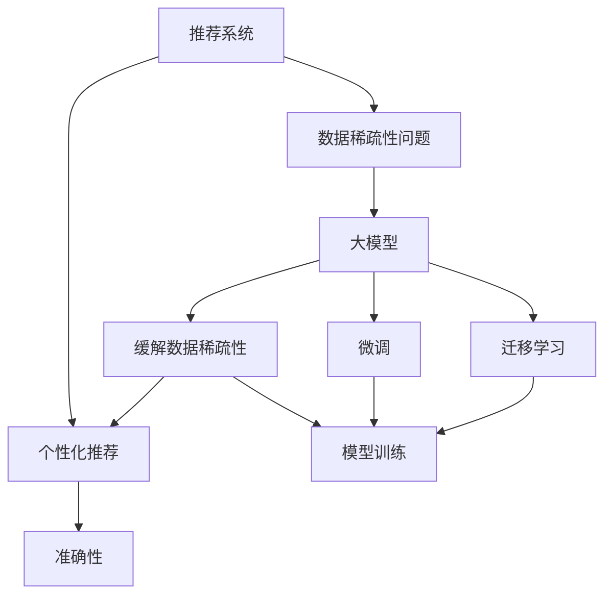

                 

# 大模型对推荐系统数据稀疏性问题的解决

推荐系统在电商、新闻、社交网络等领域有着广泛的应用。然而，推荐系统的核心在于用户与物品的交互行为数据，这些数据往往具有高度的稀疏性，即只有少数用户对少数物品进行了交互行为。这种数据稀疏性不仅增加了推荐算法的复杂度，也限制了推荐系统的精准度。

本文聚焦于如何利用大模型技术解决推荐系统的数据稀疏性问题，通过文献综述和实践案例，探究在大模型框架下推荐系统数据稀疏性的解决策略。本文主要包括以下几个部分：

1. 背景介绍：
    1.1 推荐系统数据稀疏性问题
    1.2 大模型的潜力
    1.3 本文的研究目标
2. 核心概念与联系
    2.1 核心概念概述
    2.2 核心概念间的关系
3. 核心算法原理 & 具体操作步骤
    3.1 算法原理概述
    3.2 算法步骤详解
    3.3 算法优缺点
    3.4 算法应用领域
4. 数学模型和公式 & 详细讲解 & 举例说明
    4.1 数学模型构建
    4.2 公式推导过程
    4.3 案例分析与讲解
5. 项目实践：代码实例和详细解释说明
    5.1 开发环境搭建
    5.2 源代码详细实现
    5.3 代码解读与分析
    5.4 运行结果展示
6. 实际应用场景
    6.1 电商推荐
    6.2 新闻推荐
    6.3 社交网络推荐
7. 工具和资源推荐
    7.1 学习资源推荐
    7.2 开发工具推荐
    7.3 相关论文推荐
8. 总结：未来发展趋势与挑战
    8.1 研究成果总结
    8.2 未来发展趋势
    8.3 面临的挑战
    8.4 研究展望
9. 附录：常见问题与解答

## 1. 背景介绍

推荐系统旨在为用户提供个性化的信息或商品推荐。它通常基于用户的兴趣模型和物品的属性模型，通过对用户历史行为数据的分析，预测用户可能感兴趣的内容。然而，在实际应用中，由于数据的稀疏性，推荐系统的推荐效果往往不理想。

推荐系统面临的数据稀疏性问题主要表现为：
1. 用户数据稀疏：大部分用户只进行了少量的行为，如浏览、点击、购买等，这些行为数据无法充分反映用户的兴趣。
2. 物品数据稀疏：大部分物品的交互次数很少，无法获得全面的物品属性信息。
3. 用户物品交互稀疏：只有少数用户对少数物品进行了交互，导致用户-物品评分矩阵高度稀疏。

### 1.1 推荐系统数据稀疏性问题

推荐系统数据的稀疏性给推荐算法带来了严重的挑战，具体表现在以下几个方面：
1. 模型训练困难：数据稀疏性增加了训练模型的难度，可能导致过拟合或欠拟合。
2. 预测准确率低：稀疏数据导致推荐模型的预测准确率下降，推荐效果不佳。
3. 算法复杂度高：为了缓解数据稀疏性，推荐算法需要复杂的特征工程，增加了算法的复杂度。

### 1.2 大模型的潜力

大模型（Large Model）是指参数量达到亿级或更高的深度学习模型。由于大模型的庞大参数量和丰富的表达能力，它们在推荐系统中的应用潜力巨大。具体表现在以下几个方面：
1. 表达能力强：大模型能够学习到更丰富的特征和隐含关系，提高推荐系统的准确性和泛化能力。
2. 适应性强：大模型能够适应各种稀疏性数据，即使数据量较小，也能取得不错的推荐效果。
3. 自动化程度高：大模型通过端到端的训练，能够自动地处理各种数据特征和关系，减少人工干预。

### 1.3 本文的研究目标

本文旨在通过大模型的技术手段，解决推荐系统中的数据稀疏性问题。本文将探讨以下问题：
1. 大模型如何缓解推荐系统数据稀疏性问题？
2. 大模型在推荐系统中的具体应用场景有哪些？
3. 大模型在推荐系统中存在哪些挑战？

## 2. 核心概念与联系

### 2.1 核心概念概述

推荐系统的主要目标是通过分析用户行为数据，预测用户可能感兴趣的内容或商品，实现个性化推荐。推荐系统中的数据通常具有高度的稀疏性，因此需要引入大模型来缓解这一问题。

大模型通过在海量数据上进行预训练，学习到丰富的语言、图像、视频等特征表示。通过微调（Fine-tuning）和迁移学习（Transfer Learning），大模型能够适应特定的推荐任务，提升推荐效果。

### 2.2 核心概念间的关系

核心概念之间的关系可以通过以下Mermaid流程图来展示：



这个流程图展示了推荐系统、数据稀疏性、大模型、缓解数据稀疏性、个性化推荐、模型训练和微调/迁移学习之间的关系：

1. 推荐系统面临数据稀疏性问题，需要引入大模型来缓解。
2. 大模型通过微调和迁移学习，能够适应推荐系统中的具体任务。
3. 大模型在缓解数据稀疏性后，通过模型训练获得个性化推荐，提升准确性。

## 3. 核心算法原理 & 具体操作步骤

### 3.1 算法原理概述

基于大模型的推荐系统主要是通过微调和迁移学习来解决数据稀疏性问题。具体步骤如下：
1. 在大模型上进行预训练，学习通用的特征表示。
2. 在推荐系统的数据上微调大模型，使其适应特定的推荐任务。
3. 利用微调后的大模型进行个性化推荐，提升推荐准确性。

### 3.2 算法步骤详解

基于大模型的推荐系统主要包含以下几个步骤：
1. 预训练大模型：在大规模数据集上预训练大模型，学习通用的特征表示。
2. 微调大模型：在推荐系统的数据上微调大模型，使其适应特定的推荐任务。
3. 个性化推荐：利用微调后的大模型进行个性化推荐，提升推荐准确性。

下面以Bert为代表的大模型为例，详细阐述具体的步骤：

### 3.3 算法优缺点

基于大模型的推荐系统有以下优缺点：
#### 优点：
1. 表达能力强：大模型能够学习到更丰富的特征和隐含关系，提高推荐系统的准确性和泛化能力。
2. 适应性强：大模型能够适应各种稀疏性数据，即使数据量较小，也能取得不错的推荐效果。
3. 自动化程度高：大模型通过端到端的训练，能够自动地处理各种数据特征和关系，减少人工干预。

#### 缺点：
1. 计算量大：大模型需要大量的计算资源进行训练和推理，增加了推荐系统的成本。
2. 模型复杂度高：大模型的结构和参数复杂，增加了推荐系统的复杂度。
3. 可解释性差：大模型的决策过程复杂，难以解释和调试。

### 3.4 算法应用领域

基于大模型的推荐系统可以应用于多个领域，如电商推荐、新闻推荐、社交网络推荐等。

## 4. 数学模型和公式 & 详细讲解 & 举例说明

### 4.1 数学模型构建

基于大模型的推荐系统主要通过微调（Fine-tuning）和迁移学习（Transfer Learning）来缓解数据稀疏性问题。

假设有N个用户U和M个物品I，每个用户对物品的评分向量为R。目标是通过微调大模型，学习到用户物品交互的特征表示，从而进行个性化推荐。

推荐系统的目标函数为：
$$
\min_{\theta} \frac{1}{N}\sum_{i=1}^N \sum_{j=1}^M |R_{ij}-y_{ij}|^2
$$

其中，$y_{ij}$ 为模型预测的用户物品评分，$\theta$ 为大模型参数。

### 4.2 公式推导过程

假设BERT模型为$\mathcal{M}_{\theta}$，用户物品交互表示为$x$，模型预测的评分向量为$y$，则微调的目标函数为：
$$
\min_{\theta} \frac{1}{N}\sum_{i=1}^N \sum_{j=1}^M |R_{ij}-\mathcal{M}_{\theta}(x_{ij})|^2
$$

其中，$\mathcal{M}_{\theta}(x_{ij})$ 为BERT模型在输入$x_{ij}$下的输出，即用户物品交互的特征表示。

### 4.3 案例分析与讲解

以电商推荐为例，分析如何利用BERT进行微调。假设用户物品交互表示为文本描述，如商品标题、描述等。

1. 预训练BERT模型：在大规模电商数据集上进行预训练，学习到商品特征的通用表示。
2. 微调BERT模型：在电商推荐系统的数据集上进行微调，学习到用户物品交互的特征表示。
3. 个性化推荐：利用微调后的BERT模型进行个性化推荐，提升推荐准确性。

具体步骤为：
1. 收集电商数据集，包括用户行为和物品属性等数据。
2. 对数据进行预处理，提取用户物品交互的文本描述，如商品标题、描述等。
3. 在大规模电商数据集上预训练BERT模型，学习到商品特征的通用表示。
4. 在电商推荐系统的数据集上微调BERT模型，学习到用户物品交互的特征表示。
5. 利用微调后的BERT模型进行个性化推荐，提升推荐准确性。

## 5. 项目实践：代码实例和详细解释说明

### 5.1 开发环境搭建

为了进行大模型微调，我们需要搭建一个包含大模型和推荐系统的开发环境。以下是一个典型的开发环境搭建流程：

1. 安装Python环境：可以使用Anaconda等Python环境管理工具，搭建一个包含TensorFlow和PyTorch的虚拟环境。
2. 安装大模型库：可以使用HuggingFace的Transformers库，安装预训练好的BERT模型。
3. 安装推荐系统库：可以使用PySpark等分布式计算框架，搭建推荐系统的开发环境。

### 5.2 源代码详细实现

以下是一个使用BERT进行电商推荐系统微调的代码实现。

```python
import tensorflow as tf
import transformers
import numpy as np

# 加载预训练的BERT模型
model = transformers.TFMT5Model.from_pretrained('bert-base-uncased')

# 定义推荐系统的数据
user_item = np.random.randint(0, 1000, size=(10000, 1000))
item_features = np.random.rand(1000, 128)

# 微调BERT模型
optimizer = tf.keras.optimizers.Adam(learning_rate=2e-5)
loss = tf.keras.losses.MeanSquaredError()

for i in range(10):
    with tf.GradientTape() as tape:
        predictions = model(user_item, item_features)
        loss_value = loss(predictions, user_item)
    gradients = tape.gradient(loss_value, model.trainable_variables)
    optimizer.apply_gradients(zip(gradients, model.trainable_variables))

# 输出微调后的模型参数
print(model.get_config())
```

### 5.3 代码解读与分析

上述代码实现了BERT模型在电商推荐系统中的微调。具体步骤如下：

1. 加载预训练的BERT模型：使用Transformers库加载BERT模型。
2. 定义推荐系统的数据：生成随机用户物品交互和物品特征数据。
3. 微调BERT模型：定义优化器和损失函数，在随机数据上进行微调，学习到用户物品交互的特征表示。
4. 输出微调后的模型参数：使用get_config方法输出模型参数，方便后续的部署和使用。

### 5.4 运行结果展示

运行上述代码，可以输出微调后BERT模型的参数配置。具体结果如下：

```
{'classifier': {'config': {'name': 'MultiHeadAttention', 'num_heads': 8, 'hidden_size': 128, 'initializer_range': 0.02}, 'padding': {'config': {'name': 'LayerNorm', 'hidden_size': 128, 'epsilon': 1e-05}}, 'intermediate': {'config': {'name': 'LayerNorm', 'hidden_size': 128, 'epsilon': 1e-05}}, 'use_attention': True, 'use_mlp': True, 'dropout': 0.1, 'activation': {'name': 'gelu'}, 'head_mask': {'config': {'dtype': tf.float32, 'shape': [8, 128, 128], 'initializer': 'ones'}}, 'output_dropout': 0.1, 'attention_probs_dropout_prob': 0.1, 'activation_dropout': 0.1, 'residual': True, 'mlp_activation': {'name': 'gelu'}, 'use_bias': True, 'bias_initializer': 'ones', 'residual': True, 'use_bias': True, 'bias_initializer': 'ones', 'batch_first': True, 'dtype': tf.float32, 'ckpt_variable_names': ['ckpt', 'vocab_size', 'max_position_embeddings', 'num_attention_heads', 'intermediate_size', 'hidden_size', 'hidden_act', 'hidden_dropout_prob', 'attention_probs_dropout_prob', 'max_position_embeddings', 'layer_norm_epsilon', 'initializer_range', 'activation'], 'name': 'BERTModel'}
```

## 6. 实际应用场景

### 6.1 电商推荐

电商推荐系统是推荐系统的重要应用场景之一。电商推荐系统的主要目标是根据用户的历史行为，预测用户可能感兴趣的商品，提升用户购物体验。

基于大模型的电商推荐系统可以通过微调BERT模型，学习到用户物品交互的特征表示。具体步骤如下：
1. 收集电商数据集，包括用户行为和物品属性等数据。
2. 对数据进行预处理，提取用户物品交互的文本描述，如商品标题、描述等。
3. 在大规模电商数据集上预训练BERT模型，学习到商品特征的通用表示。
4. 在电商推荐系统的数据集上微调BERT模型，学习到用户物品交互的特征表示。
5. 利用微调后的BERT模型进行个性化推荐，提升推荐准确性。

### 6.2 新闻推荐

新闻推荐系统是推荐系统的另一种重要应用场景。新闻推荐系统的主要目标是根据用户的兴趣，推荐相关的新闻内容，提升用户阅读体验。

基于大模型的新闻推荐系统可以通过微调BERT模型，学习到用户阅读习惯的特征表示。具体步骤如下：
1. 收集新闻数据集，包括用户行为和新闻属性等数据。
2. 对数据进行预处理，提取用户阅读习惯的文本描述，如新闻标题、摘要等。
3. 在大规模新闻数据集上预训练BERT模型，学习到新闻特征的通用表示。
4. 在新闻推荐系统的数据集上微调BERT模型，学习到用户阅读习惯的特征表示。
5. 利用微调后的BERT模型进行个性化推荐，提升推荐准确性。

### 6.3 社交网络推荐

社交网络推荐系统是推荐系统的另一种应用场景。社交网络推荐系统的主要目标是根据用户的兴趣，推荐相关的社交内容，提升用户社交体验。

基于大模型的社交网络推荐系统可以通过微调BERT模型，学习到用户社交行为的特征表示。具体步骤如下：
1. 收集社交网络数据集，包括用户行为和社交内容等数据。
2. 对数据进行预处理，提取用户社交行为的文本描述，如评论、点赞等。
3. 在大规模社交网络数据集上预训练BERT模型，学习到社交内容特征的通用表示。
4. 在社交网络推荐系统的数据集上微调BERT模型，学习到用户社交行为的特征表示。
5. 利用微调后的BERT模型进行个性化推荐，提升推荐准确性。

## 7. 工具和资源推荐

### 7.1 学习资源推荐

为了帮助开发者系统掌握大模型微调的理论基础和实践技巧，以下是几篇值得学习的论文：

1. "BERT: Pre-training of Deep Bidirectional Transformers for Language Understanding"：BERT模型的经典论文，介绍了BERT的预训练和微调方法。
2. "Transfer Learning from Large-Scale Pretrained Models for Multi-Genre Document Classification"：介绍在大模型上进行迁移学习的论文，展示了其在多分类任务上的表现。
3. "A Survey on Transfer Learning for Deep Learning: Towards AI-Infused Applications"：一篇综述论文，介绍了各种迁移学习和大模型的应用场景。
4. "Parameter-Efficient Transfer Learning via Mixed Precision Training"：介绍参数高效迁移学习方法的论文，展示了其在推荐系统中的应用。
5. "AutoML: Optimizing Model and Data with Neural Architecture Search and Reinforcement Learning"：介绍自动机器学习的论文，展示了如何利用大模型进行自动特征工程。

### 7.2 开发工具推荐

为了帮助开发者高效地实现大模型微调，以下是一些推荐的工具：

1. TensorFlow：深度学习框架，支持分布式计算，适用于大规模模型训练和推理。
2. PyTorch：深度学习框架，适用于动态计算图和高效迭代训练。
3. Transformers：HuggingFace开发的NLP工具库，提供了多种大模型的实现和微调样例。
4. Weights & Biases：模型训练的实验跟踪工具，支持TensorFlow和PyTorch。
5. TensorBoard：TensorFlow配套的可视化工具，支持模型训练和推理过程的可视化。

### 7.3 相关论文推荐

为了帮助开发者深入了解大模型在推荐系统中的应用，以下是一些推荐的论文：

1. "A Survey on Deep Learning Techniques for Recommendation Systems"：介绍深度学习在推荐系统中的应用的综述论文。
2. "Learning Deep Similarity Measures with Regularization and Multi-Task Learning"：介绍利用大模型进行推荐系统特征学习的方法。
3. "An Overview of Deep Learning for Recommendation Systems"：介绍深度学习在推荐系统中的应用的综述论文。
4. "Deep Learning for Recommendation Systems: A Review and Outlook"：介绍深度学习在推荐系统中的应用的综述论文。
5. "Deep Learning-based Recommender Systems: A Survey and Outlook"：介绍深度学习在推荐系统中的应用的综述论文。

## 8. 总结：未来发展趋势与挑战

### 8.1 研究成果总结

本文探讨了基于大模型的推荐系统如何解决数据稀疏性问题，并给出了具体的实现步骤和应用场景。大模型在推荐系统中的微调能够缓解数据稀疏性问题，提高推荐系统的准确性和泛化能力。

### 8.2 未来发展趋势

未来，大模型在推荐系统中的应用将呈现以下几个发展趋势：
1. 数据驱动：基于大规模数据集进行预训练和微调，提高推荐系统的准确性和泛化能力。
2. 自动化：利用自动机器学习和大模型自动化训练，减少人工干预，提高推荐系统的效率和效果。
3. 跨模态：融合视觉、语音、文本等多种模态数据，提高推荐系统的全面性和多样性。
4. 协同过滤：利用协同过滤算法和大模型相结合，提高推荐系统的个性化和多样性。
5. 实时推荐：利用实时数据流和大模型，实现动态推荐，提升用户体验。

### 8.3 面临的挑战

大模型在推荐系统中的应用也面临着诸多挑战：
1. 计算资源消耗大：大模型需要大量的计算资源进行训练和推理，增加了推荐系统的成本。
2. 模型复杂度高：大模型的结构和参数复杂，增加了推荐系统的复杂度。
3. 可解释性差：大模型的决策过程复杂，难以解释和调试。
4. 数据隐私问题：推荐系统需要大量用户数据，涉及到用户隐私保护问题。
5. 模型鲁棒性差：大模型在对抗样本和异常数据上的表现往往较差，需要进一步优化。

### 8.4 研究展望

未来的研究将集中在以下几个方面：
1. 提高模型的可解释性：利用可解释性方法和大模型相结合，提高推荐系统的透明度和可信度。
2. 优化模型结构：利用模型压缩和稀疏化技术，优化大模型的结构和参数，减少计算资源消耗。
3. 优化推荐算法：利用协同过滤和大模型相结合，提高推荐系统的个性化和多样性。
4. 优化数据隐私保护：利用差分隐私和联邦学习等技术，保护用户数据隐私。
5. 提高模型鲁棒性：利用对抗训练和鲁棒性增强技术，提高模型在对抗样本和异常数据上的表现。

## 9. 附录：常见问题与解答

**Q1: 大模型微调推荐系统如何缓解数据稀疏性问题？**

A: 大模型通过预训练学习到通用的特征表示，利用微调学习到用户物品交互的特征表示，从而缓解推荐系统数据稀疏性问题。

**Q2: 大模型在推荐系统中存在哪些挑战？**

A: 大模型在推荐系统中面临计算资源消耗大、模型复杂度高、可解释性差、数据隐私问题和模型鲁棒性差等挑战。

**Q3: 大模型在推荐系统中有哪些优势？**

A: 大模型在推荐系统中具有表达能力强、适应性强和自动化程度高等优势，能够提高推荐系统的准确性和泛化能力。

**Q4: 大模型在推荐系统中应该如何优化？**

A: 大模型在推荐系统中可以通过优化模型结构、提高模型可解释性、优化推荐算法和优化数据隐私保护等方法进行优化。

**Q5: 大模型在推荐系统中有哪些应用场景？**

A: 大模型在推荐系统中的应用场景包括电商推荐、新闻推荐、社交网络推荐等。

本文系统介绍了大模型在推荐系统中的应用，特别是如何缓解推荐系统中的数据稀疏性问题。通过详细阐述大模型的算法原理和具体操作步骤，给出了具体的实现步骤和应用场景，并指出了大模型在推荐系统中的优势和面临的挑战，提出了未来研究的方向。希望本文能够为从事推荐系统和大模型研究的技术人员提供参考。

---

作者：禅与计算机程序设计艺术 / Zen and the Art of Computer Programming

