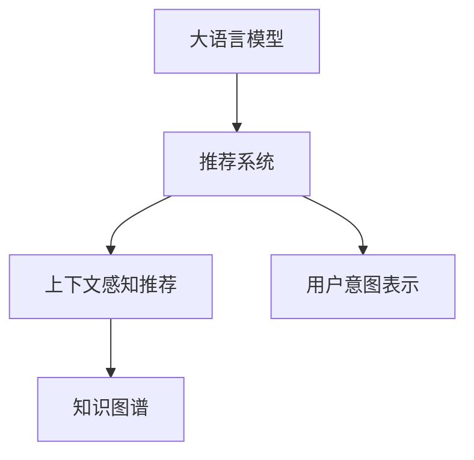

                 

# 大模型对推荐系统用户体验的提升

## 1. 背景介绍

随着数字经济的蓬勃发展，推荐系统已成为电子商务、社交媒体、在线视频等互联网应用的核心组成部分。优秀的推荐系统不仅能够提高用户满意度，还能显著提升平台的用户粘性和转化率。然而，现有的推荐系统大多基于机器学习模型，其表现受限于特征工程、模型选择和数据量等因素。近年来，大语言模型的兴起为推荐系统带来了新的突破口。通过将自然语言处理(NLP)技术与推荐系统相结合，大模型在推荐任务上展现出了强大的表现力，为提升用户体验带来了显著的提升。

## 2. 核心概念与联系

### 2.1 核心概念概述

本节将介绍几个与大模型对推荐系统影响密切相关的核心概念：

- **大语言模型(Large Language Model, LLM)**：如BERT、GPT等，通过大规模无标签文本预训练，能够学习到丰富的语言表示和常识知识。
- **推荐系统(Recommendation System)**：通过用户的历史行为和兴趣，预测用户可能感兴趣的物品，进行个性化推荐。
- **上下文感知推荐(Context-aware Recommendation)**：在推荐系统中考虑用户行为的背景信息，如时间、地点、设备等，提升推荐的精准性。
- **知识图谱(Knowledge Graph)**：用于描述实体和实体间关系的图形数据结构，可用于丰富推荐系统的语义信息。
- **用户意图表示(User Intent Representation)**：将用户输入的自然语言转化为可理解的用户意图，是推荐系统智能化的关键。

这些概念之间的逻辑关系可以通过以下Mermaid流程图来展示：



该流程图展示了大语言模型如何与推荐系统相结合，通过上下文感知和用户意图表示，提升推荐系统的个性化和智能化水平。

## 3. 核心算法原理 & 具体操作步骤
### 3.1 算法原理概述

大语言模型在推荐系统中的应用主要体现在两个方面：用户行为预测和物品推荐生成。

**用户行为预测**：通过分析用户的历史行为数据，如浏览、点击、评分等，提取有意义的文本特征，输入到大模型中进行预测，得到用户的潜在兴趣。

**物品推荐生成**：对于热门物品或新商品，用户可能缺乏明确的兴趣偏好。大模型通过生成式任务，如摘要生成、对话生成等，自动生成高质量的推荐文本，帮助用户快速发现新的兴趣点。

### 3.2 算法步骤详解

以用户行为预测为例，基于大模型的推荐系统一般包括以下几个关键步骤：

**Step 1: 数据预处理**
- 收集用户的历史行为数据，并提取文本特征。
- 使用分词、去除停用词等技术处理文本数据。
- 构建训练集和验证集，将标注数据划分为训练集和测试集。

**Step 2: 构建大语言模型**
- 选择合适的预训练语言模型，如BERT、GPT等。
- 在预训练模型的基础上，添加特定任务的目标函数和损失函数。

**Step 3: 模型微调**
- 将处理后的文本数据输入模型，进行有监督微调。
- 根据模型的输出结果，计算预测值与真实值之间的误差。
- 使用梯度下降等优化算法更新模型参数，最小化损失函数。

**Step 4: 模型评估与测试**
- 在验证集上评估模型性能，选择最优模型。
- 在测试集上进一步测试模型效果，确保模型具有良好的泛化能力。
- 部署模型到实际推荐系统中，进行实时预测。

**Step 5: 上下文感知与知识融合**
- 考虑用户行为的时空背景，在模型输入中添加上下文信息。
- 利用知识图谱，丰富模型的语义信息，提升推荐质量。

**Step 6: 用户意图表示与生成**
- 通过自然语言处理技术，将用户输入的文本转化为可理解的意图表示。
- 利用生成式模型，自动生成推荐文本，提升用户体验。

### 3.3 算法优缺点

基于大模型的推荐系统具有以下优点：
1. 语义理解力强：大语言模型能够从文本中提取深层次语义信息，提升推荐的精准性。
2. 模型可解释性高：大模型通过文本生成等任务，可以输出清晰的推荐文本，便于用户理解。
3. 泛化能力强：大模型在泛化能力上优于传统机器学习模型，能够适应不同数据分布。

同时，该方法也存在一定的局限性：
1. 对标注数据依赖高：大模型需要大量的标注数据进行微调，标注成本较高。
2. 计算资源需求大：大模型参数量大，训练和推理耗时较长。
3. 模型复杂度高：大模型的结构复杂，可能存在不易调试的问题。
4. 数据隐私风险：大模型需要处理大量用户数据，可能存在数据泄露风险。

尽管存在这些局限性，但大模型在推荐系统中的应用仍展示了强大的潜力，能够提升推荐的准确性和个性化水平，改善用户体验。

### 3.4 算法应用领域

大语言模型在推荐系统中的应用，已经覆盖了多个领域，包括但不限于：

- **电子商务推荐**：通过分析用户的浏览和购买记录，推荐个性化的商品。
- **内容推荐**：对文章、视频、音乐等内容进行推荐，提升用户的浏览体验。
- **广告推荐**：通过用户行为预测，精准投放广告，提高广告的点击率和转化率。
- **旅游推荐**：对景点、酒店等旅游资源进行推荐，帮助用户规划行程。
- **智能客服**：通过用户提问预测意图，提供个性化的回答和建议。

这些应用场景中，大语言模型都能够通过用户行为分析，生成高质量的推荐文本，提升用户体验，降低运营成本。

## 4. 数学模型和公式 & 详细讲解
### 4.1 数学模型构建

基于大模型的推荐系统，其核心在于将用户行为转化为文本，并输入到大语言模型中进行预测。假设用户历史行为数据为 $D=\{x_i, y_i\}_{i=1}^N$，其中 $x_i$ 为行为文本，$y_i$ 为对应的兴趣标签。推荐系统的目标是通过训练模型，对新用户行为 $x$ 预测其兴趣 $y$。

定义推荐模型的预测函数为 $f(x; \theta)$，其中 $\theta$ 为模型参数。模型的损失函数为：

$$
\mathcal{L}(\theta) = -\frac{1}{N}\sum_{i=1}^N [y_i\log f(x_i; \theta)+(1-y_i)\log(1-f(x_i; \theta))]
$$

其中，$y_i\log f(x_i; \theta)$ 表示预测为正样本的损失，$(1-y_i)\log(1-f(x_i; \theta))$ 表示预测为负样本的损失。

### 4.2 公式推导过程

对于二分类问题，模型的预测函数 $f(x; \theta)$ 通常采用sigmoid函数：

$$
f(x; \theta) = \sigma(W^T x + b)
$$

其中，$W$ 和 $b$ 为模型参数，$x$ 为输入特征向量。

将损失函数代入sigmoid函数，得到：

$$
\mathcal{L}(\theta) = -\frac{1}{N}\sum_{i=1}^N [y_i\log \sigma(W^T x_i + b)+(1-y_i)\log(1-\sigma(W^T x_i + b))]
$$

对损失函数求导，得到：

$$
\frac{\partial \mathcal{L}(\theta)}{\partial \theta} = -\frac{1}{N}\sum_{i=1}^N [(y_i-\sigma(W^T x_i + b))x_i]
$$

通过梯度下降等优化算法，不断更新模型参数 $\theta$，最小化损失函数 $\mathcal{L}(\theta)$。

### 4.3 案例分析与讲解

以下以一篇新闻文章推荐为例，说明如何使用大语言模型进行推荐系统建模：

假设一篇文章 $x$ 的文本为：

```text
某公司发布财报，净利润增长20%
```

用户的兴趣 $y$ 为正样本。将文章文本输入大语言模型，得到预测结果 $f(x; \theta)$。

假设模型输出的预测概率为 $p$，则推荐策略可以如下设定：
- 如果 $p > 0.5$，推荐该文章为用户的兴趣点。
- 如果 $p < 0.5$，不推荐该文章。
- 如果 $p = 0.5$，根据用户行为的历史概率进行决策。

这样，通过大语言模型的预测，可以有效提升推荐系统的准确性和个性化水平。

## 5. 项目实践：代码实例和详细解释说明
### 5.1 开发环境搭建

要进行大语言模型的推荐系统开发，需要先搭建开发环境。以下是基于PyTorch和Transformers库的搭建流程：

1. 安装Anaconda：
```bash
conda install anaconda
```

2. 创建虚拟环境：
```bash
conda create -n recommendation-env python=3.8
conda activate recommendation-env
```

3. 安装PyTorch和相关依赖：
```bash
pip install torch torchvision torchaudio
```

4. 安装Transformers库：
```bash
pip install transformers
```

5. 安装其他依赖库：
```bash
pip install numpy pandas sklearn
```

完成上述步骤后，即可开始大语言模型推荐系统的开发。

### 5.2 源代码详细实现

以下是一个简单的推荐系统实现示例，通过使用BERT模型对新闻文章进行推荐：

```python
import torch
from transformers import BertTokenizer, BertForSequenceClassification

# 定义数据预处理函数
def preprocess_data(data, tokenizer, max_len):
    tokenized_data = tokenizer(data, return_tensors='pt', max_length=max_len, padding='max_length', truncation=True)
    return tokenized_data['input_ids'], tokenized_data['attention_mask']

# 定义模型微调函数
def fine_tune_model(data, labels, model, optimizer, device):
    model.train()
    loss = 0
    for batch in data:
        input_ids, attention_mask = batch['input_ids'].to(device), batch['attention_mask'].to(device)
        labels = labels.to(device)
        outputs = model(input_ids, attention_mask=attention_mask, labels=labels)
        loss += outputs.loss
    optimizer.zero_grad()
    loss.backward()
    optimizer.step()
    return loss.item() / len(data)

# 训练函数
def train_epoch(model, data_loader, optimizer, device):
    model.train()
    loss = 0
    for batch in data_loader:
        input_ids, attention_mask = batch['input_ids'].to(device), batch['attention_mask'].to(device)
        labels = batch['labels'].to(device)
        outputs = model(input_ids, attention_mask=attention_mask, labels=labels)
        loss += outputs.loss
    optimizer.zero_grad()
    loss.backward()
    optimizer.step()
    return loss.item() / len(data_loader)

# 评估函数
def evaluate(model, data_loader, device):
    model.eval()
    loss = 0
    correct = 0
    with torch.no_grad():
        for batch in data_loader:
            input_ids, attention_mask = batch['input_ids'].to(device), batch['attention_mask'].to(device)
            labels = batch['labels'].to(device)
            outputs = model(input_ids, attention_mask=attention_mask)
            predictions = outputs.argmax(dim=2)
            loss += outputs.loss
            correct += (predictions == labels).sum().item()
    return loss.item() / len(data_loader), correct / len(data_loader)

# 设置模型、优化器和设备
model = BertForSequenceClassification.from_pretrained('bert-base-uncased', num_labels=2)
optimizer = torch.optim.AdamW(model.parameters(), lr=1e-5)
device = torch.device('cuda' if torch.cuda.is_available() else 'cpu')
model.to(device)

# 加载数据集
train_data = ...
dev_data = ...
test_data = ...

# 训练过程
train_loader = ...
dev_loader = ...
test_loader = ...

for epoch in range(5):
    train_loss = train_epoch(model, train_loader, optimizer, device)
    dev_loss, dev_acc = evaluate(model, dev_loader, device)
    print(f'Epoch {epoch+1}, train loss: {train_loss:.3f}, dev loss: {dev_loss:.3f}, dev acc: {dev_acc:.3f}')

# 测试过程
test_loss, test_acc = evaluate(model, test_loader, device)
print(f'Test loss: {test_loss:.3f}, test acc: {test_acc:.3f}')
```

### 5.3 代码解读与分析

这段代码实现了使用BERT模型进行二分类推荐系统的训练和评估。以下是关键代码的解释：

**数据预处理函数**：将输入文本数据进行分词、截断、填充等预处理，返回模型所需的输入张量。

**模型微调函数**：使用梯度下降算法更新模型参数，最小化损失函数。

**训练函数**：在每个epoch内，对训练集数据进行前向传播和反向传播，更新模型参数。

**评估函数**：在验证集和测试集上，评估模型的预测准确率和损失。

**训练和测试过程**：通过迭代训练，逐步提高模型的预测准确率，并在测试集上评估模型性能。

## 6. 实际应用场景
### 6.1 电子商务推荐

在电子商务平台，基于大语言模型的推荐系统能够为用户提供个性化商品推荐。通过对用户的浏览、点击、购买行为进行分析，模型可以预测用户可能感兴趣的商品，并在搜索结果中优先展示。

**应用实例**：某电商平台收集用户的历史行为数据，将文本输入BERT模型，得到用户的兴趣向量。根据用户向量与商品向量的相似度，推荐系统生成商品推荐列表，提升用户购买转化率。

### 6.2 内容推荐

在内容平台，大语言模型可以用于推荐新闻、文章、视频等内容。通过对用户的行为数据进行文本编码，模型可以预测用户对不同内容的兴趣，生成个性化的推荐内容。

**应用实例**：某视频网站收集用户的观看历史数据，将视频标题和描述输入BERT模型，预测用户对不同视频的兴趣。根据兴趣得分，推荐系统生成个性化视频推荐列表，提高用户观看体验。

### 6.3 广告推荐

在广告平台，大语言模型可以用于精准投放广告。通过对用户的行为数据进行文本编码，模型可以预测用户的兴趣标签，生成个性化的广告内容，提升广告的点击率和转化率。

**应用实例**：某广告平台收集用户的点击历史数据，将广告文案输入BERT模型，预测用户对不同广告的兴趣。根据兴趣得分，推荐系统生成个性化广告推荐列表，提高广告的投放效果。

### 6.4 未来应用展望

未来，大语言模型在推荐系统中的应用将更加广泛，预计将出现以下趋势：

1. **多模态推荐**：将文本、图片、视频等多模态数据结合起来，提升推荐系统的表现力。例如，将商品图片输入模型，预测用户对不同商品的兴趣。

2. **动态推荐**：实时更新用户兴趣，动态调整推荐内容。例如，用户阅读新闻后，推荐系统自动更新用户的兴趣向量，生成新的推荐列表。

3. **自适应推荐**：根据用户的反馈数据，实时调整推荐策略。例如，用户对推荐结果的点击和反馈数据，可以用于优化模型的预测性能。

4. **跨领域推荐**：将推荐系统应用于不同领域，如金融、医疗、旅游等，提升跨领域推荐的效果。例如，在金融领域，推荐系统可以根据用户的投资行为，推荐合适的理财产品。

5. **推荐解释**：为推荐结果提供解释，帮助用户理解推荐逻辑。例如，推荐系统输出推荐文本，解释推荐的理由和依据。

## 7. 工具和资源推荐
### 7.1 学习资源推荐

为了帮助开发者深入理解大语言模型在推荐系统中的应用，这里推荐一些优质的学习资源：

1. 《深度学习自然语言处理》课程：斯坦福大学开设的NLP明星课程，涵盖自然语言处理的基本概念和前沿技术，包括推荐系统的相关知识。

2. 《Natural Language Processing with Transformers》书籍：Transformer库的作者所著，全面介绍了如何使用Transformer库进行NLP任务开发，包括推荐系统在内的诸多范式。

3. 《Reinforcement Learning for Recommendation Systems》书籍：涵盖强化学习在推荐系统中的应用，提供了大量实践案例和代码实现。

4. HuggingFace官方文档：Transformer库的官方文档，提供了丰富的预训练模型和微调样例代码，是学习推荐系统的必备资料。

5. 《推荐系统：算法、效果、工程》博客：作者详细介绍了推荐系统从理论到实践的完整流程，提供了大量实践案例和代码实现。

通过对这些资源的学习实践，相信你一定能够掌握大语言模型在推荐系统中的应用，并用于解决实际的推荐问题。

### 7.2 开发工具推荐

高效的开发离不开优秀的工具支持。以下是几款用于大语言模型推荐系统开发的常用工具：

1. PyTorch：基于Python的开源深度学习框架，灵活动态的计算图，适合快速迭代研究。大部分预训练语言模型都有PyTorch版本的实现。

2. TensorFlow：由Google主导开发的开源深度学习框架，生产部署方便，适合大规模工程应用。同样有丰富的预训练语言模型资源。

3. Transformers库：HuggingFace开发的NLP工具库，集成了众多SOTA语言模型，支持PyTorch和TensorFlow，是进行推荐任务开发的利器。

4. Weights & Biases：模型训练的实验跟踪工具，可以记录和可视化模型训练过程中的各项指标，方便对比和调优。与主流深度学习框架无缝集成。

5. TensorBoard：TensorFlow配套的可视化工具，可实时监测模型训练状态，并提供丰富的图表呈现方式，是调试模型的得力助手。

6. Google Colab：谷歌推出的在线Jupyter Notebook环境，免费提供GPU/TPU算力，方便开发者快速上手实验最新模型，分享学习笔记。

合理利用这些工具，可以显著提升大语言模型推荐系统的开发效率，加快创新迭代的步伐。

### 7.3 相关论文推荐

大语言模型在推荐系统中的应用，源于学界的持续研究。以下是几篇奠基性的相关论文，推荐阅读：

1. Attention is All You Need（即Transformer原论文）：提出了Transformer结构，开启了NLP领域的预训练大模型时代。

2. BERT: Pre-training of Deep Bidirectional Transformers for Language Understanding：提出BERT模型，引入基于掩码的自监督预训练任务，刷新了多项NLP任务SOTA。

3. Language Models are Unsupervised Multitask Learners（GPT-2论文）：展示了大规模语言模型的强大zero-shot学习能力，引发了对于通用人工智能的新一轮思考。

4. Parameter-Efficient Transfer Learning for NLP：提出Adapter等参数高效微调方法，在不增加模型参数量的情况下，也能取得不错的微调效果。

5. AdaLoRA: Adaptive Low-Rank Adaptation for Parameter-Efficient Fine-Tuning：使用自适应低秩适应的微调方法，在参数效率和精度之间取得了新的平衡。

这些论文代表了大语言模型在推荐系统中的发展和应用，通过学习这些前沿成果，可以帮助研究者把握学科前进方向，激发更多的创新灵感。

## 8. 总结：未来发展趋势与挑战
### 8.1 总结

本文对大语言模型在推荐系统中的应用进行了全面系统的介绍。首先阐述了大语言模型和推荐系统研究背景和意义，明确了推荐系统智能化发展的必要性。其次，从原理到实践，详细讲解了大语言模型在推荐任务中的具体应用方法，给出了推荐系统开发的完整代码实现。同时，本文还广泛探讨了大语言模型在电子商务、内容推荐、广告推荐等多个行业领域的应用前景，展示了其在推荐系统中的强大潜力。最后，本文精选了推荐系统的各类学习资源，力求为读者提供全方位的技术指引。

通过本文的系统梳理，可以看到，大语言模型在推荐系统中的应用正在成为NLP领域的重要范式，极大地拓展了推荐系统的应用边界，提升了用户体验。未来，伴随大语言模型的不断演进和优化，推荐系统必将在更多领域大放异彩，为数字化经济带来新的突破。

### 8.2 未来发展趋势

展望未来，大语言模型在推荐系统中的应用将呈现以下几个发展趋势：

1. **模型规模持续增大**：随着算力成本的下降和数据规模的扩张，预训练语言模型的参数量还将持续增长。超大规模语言模型蕴含的丰富语言知识，有望支撑更加复杂多变的推荐任务。

2. **推荐系统智能化提升**：大语言模型的语义理解力强，能够从文本中提取深层次语义信息，提升推荐的精准性。未来，推荐系统将更加注重语义理解和上下文感知，提升推荐的智能化水平。

3. **跨领域推荐拓展**：大语言模型能够跨越不同领域的语义鸿沟，进行跨领域推荐。例如，在金融领域，推荐系统可以根据用户的投资行为，推荐合适的理财产品。

4. **用户意图表示**：通过自然语言处理技术，将用户输入的文本转化为可理解的意图表示，提升推荐系统的个性化水平。例如，用户搜索“美食推荐”，推荐系统自动生成个性化美食推荐列表。

5. **推荐解释和反馈机制**：为推荐结果提供解释，帮助用户理解推荐逻辑。例如，推荐系统输出推荐文本，解释推荐的理由和依据。同时，收集用户对推荐结果的反馈数据，实时调整推荐策略，提升推荐效果。

以上趋势凸显了大语言模型在推荐系统中的广阔前景。这些方向的探索发展，必将进一步提升推荐系统的性能和应用范围，为数字化经济带来新的变革。

### 8.3 面临的挑战

尽管大语言模型在推荐系统中的应用已经取得了显著效果，但在迈向更加智能化、普适化应用的过程中，仍面临着诸多挑战：

1. **标注数据瓶颈**：推荐系统需要大量的标注数据进行微调，标注成本较高。如何进一步降低推荐系统对标注样本的依赖，将是一大难题。

2. **模型鲁棒性不足**：推荐系统面对不同领域、不同背景的数据时，泛化性能往往大打折扣。如何提高推荐模型的鲁棒性，避免灾难性遗忘，还需要更多理论和实践的积累。

3. **计算资源需求大**：大语言模型的计算资源需求大，训练和推理耗时较长。如何优化模型结构和计算效率，提升推荐系统的实时性，将是重要的优化方向。

4. **数据隐私风险**：推荐系统需要处理大量用户数据，可能存在数据泄露风险。如何保护用户隐私，确保数据安全，将是重要的研究方向。

5. **推荐解释和可信度**：推荐系统需要提供透明的推荐过程和可信的推荐结果。如何为推荐结果提供解释，提高用户对系统的信任，将是重要的研究方向。

6. **推荐系统的可解释性和公平性**：推荐系统需要具备可解释性和公平性，避免出现偏见和歧视。如何保证推荐系统的透明性和公平性，将是重要的研究方向。

以上挑战需要通过技术创新、算法优化和政策法规等多方面的努力，才能在大语言模型推荐系统中逐步解决。

### 8.4 研究展望

面对推荐系统面临的种种挑战，未来的研究需要在以下几个方面寻求新的突破：

1. **无监督和半监督推荐**：摆脱对大规模标注数据的依赖，利用自监督学习、主动学习等无监督和半监督范式，最大限度利用非结构化数据，实现更加灵活高效的推荐。

2. **知识图谱的融合**：将知识图谱与推荐系统结合，丰富模型的语义信息，提升推荐的精准性。例如，利用知识图谱的实体关系信息，提升商品推荐的质量。

3. **多模态推荐**：将文本、图片、视频等多模态数据结合起来，提升推荐系统的表现力。例如，将商品图片输入模型，预测用户对不同商品的兴趣。

4. **推荐系统的可解释性**：为推荐结果提供解释，帮助用户理解推荐逻辑。例如，推荐系统输出推荐文本，解释推荐的理由和依据。

5. **推荐系统的公平性**：通过算法和模型设计，确保推荐系统的透明性和公平性，避免出现偏见和歧视。例如，利用公平性约束函数，优化推荐系统的性能。

6. **推荐系统的实时性和动态性**：实时更新用户兴趣，动态调整推荐内容。例如，用户阅读新闻后，推荐系统自动更新用户的兴趣向量，生成新的推荐列表。

以上研究方向的探索，必将引领推荐系统向更高的台阶发展，为数字经济带来新的突破。

## 9. 附录：常见问题与解答

**Q1: 如何选择合适的预训练语言模型？**

A: 选择合适的预训练语言模型需要考虑以下几个方面：
1. 任务的复杂度：任务越复杂，需要模型的表现力越强，如BERT、GPT等大模型更适合复杂的推荐任务。
2. 数据规模：数据规模越大，模型的参数量也越大，如GPT等大模型适合处理大规模数据。
3. 计算资源：计算资源越充足，可以选择参数量更大的模型，如T5、XLNet等。

**Q2: 微调过程中的损失函数如何设定？**

A: 微调过程中的损失函数需要根据推荐任务设定，常见的有二分类交叉熵损失、多分类交叉熵损失、均方误差损失等。例如，二分类推荐任务可以设定为：

$$
\mathcal{L}(\theta) = -\frac{1}{N}\sum_{i=1}^N [y_i\log f(x_i; \theta)+(1-y_i)\log(1-f(x_i; \theta))]
$$

其中，$y_i$ 为标签，$f(x_i; \theta)$ 为模型预测的概率。

**Q3: 推荐系统中的上下文感知如何实现？**

A: 上下文感知可以通过在模型输入中添加时间、地点、设备等背景信息来实现。例如，将用户的行为时间、设备型号等信息编码成向量，输入到模型中，提升推荐的个性化水平。

**Q4: 推荐系统的动态推荐如何实现？**

A: 动态推荐可以通过实时更新用户兴趣，动态调整推荐内容来实现。例如，用户阅读新闻后，推荐系统自动更新用户的兴趣向量，生成新的推荐列表。

**Q5: 推荐系统的自适应推荐如何实现？**

A: 自适应推荐可以通过收集用户对推荐结果的反馈数据，实时调整推荐策略来实现。例如，用户对推荐结果的点击和反馈数据，可以用于优化模型的预测性能。

---

作者：禅与计算机程序设计艺术 / Zen and the Art of Computer Programming

