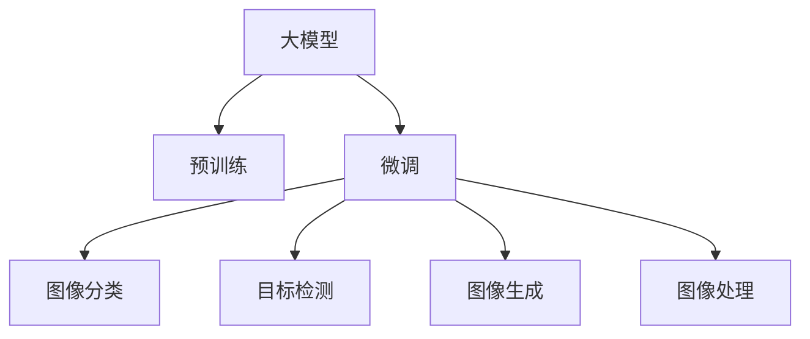

                 

# 大模型技术在电商平台商品图像识别中的应用

> 关键词：大模型技术, 商品图像识别, 电商, 图像分类, 目标检测, 图像生成, 图像处理, 深度学习

## 1. 背景介绍

### 1.1 问题由来
随着电子商务的蓬勃发展，商品图像识别成为电商平台中的核心技术之一。商家通过精确的图像识别，能快速匹配商品信息，提升用户体验。传统的商品图像识别技术依赖于手工标注的数据集，随着电商图片数量和种类的爆炸式增长，数据标注成本急剧上升。而基于大模型的图像识别技术通过海量无标注数据预训练，不需要人工标注，能显著降低成本，提升识别准确度。

### 1.2 问题核心关键点
大模型在电商商品图像识别中的应用，主要包括以下关键点：
- **数据预训练**：利用大规模无标签图像数据预训练模型，学习通用的图像特征表示。
- **图像分类**：对商品图像进行分类识别，提取具体商品类别。
- **目标检测**：识别商品图像中的关键区域和对象，提取其位置和大小信息。
- **图像生成**：利用大模型生成缺失的商品图像，解决数据匮乏问题。
- **图像处理**：通过大模型的微调，提升图像处理能力，如超分辨率、去噪等。

大模型技术在电商商品图像识别中的作用，就在于其能够利用预训练的图像表示，对特定领域数据进行微调，快速提升识别性能。同时，大模型还具有强大的图像生成能力，对于商品图像的缺失或噪声数据，可通过生成模型补充和修复。

## 2. 核心概念与联系

### 2.1 核心概念概述

为更好地理解大模型在电商平台商品图像识别中的应用，本节将介绍几个核心概念：

- **大模型**：以自回归（如GPT）或自编码（如BERT）模型为代表的深度神经网络模型，通过在大规模无标签数据上进行预训练，学习到通用的图像特征表示。
- **预训练**：指在大规模无标签数据上，通过自监督学习任务训练通用模型，学习到通用的图像特征表示。常见的预训练任务包括图像自编码、图像生成对抗网络（GAN）等。
- **微调**：指在预训练模型的基础上，使用特定领域的数据，通过有监督学习优化模型在该领域上的性能。通常只需要调整顶层分类器或解码器，并以较小的学习率更新全部或部分的模型参数。
- **图像分类**：将图像分为不同类别，通常用于商品识别。
- **目标检测**：识别图像中的具体对象和位置，通常用于商品定位。
- **图像生成**：利用模型生成新的图像，用于商品图像补充或修复。
- **图像处理**：利用模型进行图像增强、超分辨率、去噪等操作，提升图像质量。

这些核心概念之间的逻辑关系可以通过以下Mermaid流程图来展示：



这个流程图展示了大模型在电商商品图像识别中的核心概念及其之间的关系：

1. 大模型通过预训练获得基础能力。
2. 微调是大模型应用于特定任务的前提，提高模型在特定领域上的性能。
3. 图像分类、目标检测、图像生成、图像处理都是微调模型的具体应用。

## 3. 核心算法原理 & 具体操作步骤
### 3.1 算法原理概述

基于大模型的电商商品图像识别，本质上是图像分类和目标检测等任务的有监督微调过程。其核心思想是：将预训练的大模型视作一个强大的图像特征提取器，通过特定领域的数据集进行微调，使得模型能够识别特定的商品类别或定位具体的商品区域。

形式化地，假设预训练模型为 $M_{\theta}$，其中 $\theta$ 为预训练得到的模型参数。给定电商商品图像识别任务 $T$ 的标注数据集 $D=\{(x_i, y_i)\}_{i=1}^N, x_i \in \mathcal{X}, y_i \in \{1, 2, \cdots, K\}$，微调的目标是找到新的模型参数 $\hat{\theta}$，使得：

$$
\hat{\theta}=\mathop{\arg\min}_{\theta} \mathcal{L}(M_{\theta},D)
$$

其中 $\mathcal{L}$ 为针对任务 $T$ 设计的损失函数，用于衡量模型预测输出与真实标签之间的差异。常见的损失函数包括交叉熵损失、均方误差损失等。

通过梯度下降等优化算法，微调过程不断更新模型参数 $\theta$，最小化损失函数 $\mathcal{L}$，使得模型输出逼近真实标签。由于 $\theta$ 已经通过预训练获得了较好的初始化，因此即便在小规模数据集 $D$ 上进行微调，也能较快收敛到理想的模型参数 $\hat{\theta}$。

### 3.2 算法步骤详解

基于大模型的电商商品图像识别一般包括以下几个关键步骤：

**Step 1: 准备预训练模型和数据集**
- 选择合适的预训练图像模型 $M_{\theta}$ 作为初始化参数，如 ResNet、VGG 等。
- 准备电商商品图像识别任务的标注数据集 $D$，划分为训练集、验证集和测试集。一般要求标注数据与预训练数据的分布不要差异过大。

**Step 2: 添加任务适配层**
- 根据任务类型，在预训练模型顶层设计合适的输出层和损失函数。
- 对于图像分类任务，通常在顶层添加全连接层和交叉熵损失函数。
- 对于目标检测任务，通常使用区域池化层和二分类交叉熵损失函数。

**Step 3: 设置微调超参数**
- 选择合适的优化算法及其参数，如 AdamW、SGD 等，设置学习率、批大小、迭代轮数等。
- 设置正则化技术及强度，包括权重衰减、Dropout、Early Stopping 等。
- 确定冻结预训练参数的策略，如仅微调顶层，或全部参数都参与微调。

**Step 4: 执行梯度训练**
- 将训练集数据分批次输入模型，前向传播计算损失函数。
- 反向传播计算参数梯度，根据设定的优化算法和学习率更新模型参数。
- 周期性在验证集上评估模型性能，根据性能指标决定是否触发 Early Stopping。
- 重复上述步骤直到满足预设的迭代轮数或 Early Stopping 条件。

**Step 5: 测试和部署**
- 在测试集上评估微调后模型 $M_{\hat{\theta}}$ 的性能，对比微调前后的精度提升。
- 使用微调后的模型对新商品图像进行推理预测，集成到实际的应用系统中。
- 持续收集新的商品图像，定期重新微调模型，以适应商品种类和样式的不断变化。

以上是基于大模型的电商商品图像识别的一般流程。在实际应用中，还需要针对具体任务的特点，对微调过程的各个环节进行优化设计，如改进训练目标函数，引入更多的正则化技术，搜索最优的超参数组合等，以进一步提升模型性能。

### 3.3 算法优缺点

基于大模型的电商商品图像识别方法具有以下优点：
1. 简单高效。只需准备少量标注数据，即可对预训练模型进行快速适配，获得较大的性能提升。
2. 通用适用。适用于各种电商商品图像识别任务，如商品分类、商品定位等，设计简单的任务适配层即可实现微调。
3. 参数高效。利用参数高效微调技术，在固定大部分预训练参数的情况下，仍可取得不错的提升。
4. 效果显著。在学术界和工业界的诸多任务上，基于微调的方法已经刷新了最先进的性能指标。

同时，该方法也存在一定的局限性：
1. 依赖标注数据。微调的效果很大程度上取决于标注数据的质量和数量，获取高质量标注数据的成本较高。
2. 迁移能力有限。当目标任务与预训练数据的分布差异较大时，微调的性能提升有限。
3. 负面效果传递。预训练模型的固有偏见、有害信息等，可能通过微调传递到下游任务，造成负面影响。
4. 可解释性不足。微调模型的决策过程通常缺乏可解释性，难以对其推理逻辑进行分析和调试。

尽管存在这些局限性，但就目前而言，基于大模型的微调方法仍是大模型应用于电商商品图像识别的主要范式。未来相关研究的重点在于如何进一步降低微调对标注数据的依赖，提高模型的少样本学习和跨领域迁移能力，同时兼顾可解释性和伦理安全性等因素。

### 3.4 算法应用领域

基于大模型的电商商品图像识别技术，已经在图像分类、目标检测等多个领域得到广泛的应用，例如：

- **图像分类**：如将商品图像分类为服装、家电、食品等不同类别。通过微调使模型学习商品-类别映射。
- **目标检测**：识别商品图像中的具体对象和位置，如检测图片中的手机、电视、冰箱等。通过微调使模型学习物体-位置三元组。
- **图像生成**：生成缺失的商品图像，如基于描述生成商品图片。通过微调使模型学习生成高质量的图像。
- **图像处理**：提升图像质量，如超分辨率、去噪等。通过微调使模型学习图像增强技术。

除了上述这些经典任务外，大模型在电商商品图像识别领域的应用还涵盖了商品推荐、智能搜索、商品搭配等诸多创新方向，为电商平台的智能化发展带来了新的契机。

## 4. 数学模型和公式 & 详细讲解 & 举例说明
### 4.1 数学模型构建

本节将使用数学语言对基于大模型的电商商品图像识别过程进行更加严格的刻画。

记预训练图像模型为 $M_{\theta}:\mathcal{X} \rightarrow \mathcal{Y}$，其中 $\mathcal{X}$ 为输入空间，$\mathcal{Y}$ 为输出空间，$\theta \in \mathbb{R}^d$ 为模型参数。假设电商商品图像识别任务的训练集为 $D=\{(x_i,y_i)\}_{i=1}^N, x_i \in \mathcal{X}, y_i \in \{1, 2, \cdots, K\}$。

定义模型 $M_{\theta}$ 在图像输入 $x$ 上的输出为 $\hat{y}=M_{\theta}(x) \in [0,1]$，表示商品类别概率。真实标签 $y \in \{1, 2, \cdots, K\}$。则二分类交叉熵损失函数定义为：

$$
\ell(M_{\theta}(x),y) = -[y\log \hat{y} + (1-y)\log (1-\hat{y})]
$$

将其代入经验风险公式，得：

$$
\mathcal{L}(\theta) = -\frac{1}{N}\sum_{i=1}^N [y_i\log M_{\theta}(x_i)+(1-y_i)\log(1-M_{\theta}(x_i))]
$$

根据链式法则，损失函数对参数 $\theta_k$ 的梯度为：

$$
\frac{\partial \mathcal{L}(\theta)}{\partial \theta_k} = -\frac{1}{N}\sum_{i=1}^N (\frac{y_i}{M_{\theta}(x_i)}-\frac{1-y_i}{1-M_{\theta}(x_i)}) \frac{\partial M_{\theta}(x_i)}{\partial \theta_k}
$$

其中 $\frac{\partial M_{\theta}(x_i)}{\partial \theta_k}$ 可进一步递归展开，利用自动微分技术完成计算。

### 4.2 公式推导过程

以下我们以二分类任务为例，推导交叉熵损失函数及其梯度的计算公式。

假设模型 $M_{\theta}$ 在输入 $x$ 上的输出为 $\hat{y}=M_{\theta}(x) \in [0,1]$，表示商品类别概率。真实标签 $y \in \{1, 2, \cdots, K\}$。则二分类交叉熵损失函数定义为：

$$
\ell(M_{\theta}(x),y) = -[y\log \hat{y} + (1-y)\log (1-\hat{y})]
$$

将其代入经验风险公式，得：

$$
\mathcal{L}(\theta) = -\frac{1}{N}\sum_{i=1}^N [y_i\log M_{\theta}(x_i)+(1-y_i)\log(1-M_{\theta}(x_i))]
$$

根据链式法则，损失函数对参数 $\theta_k$ 的梯度为：

$$
\frac{\partial \mathcal{L}(\theta)}{\partial \theta_k} = -\frac{1}{N}\sum_{i=1}^N (\frac{y_i}{M_{\theta}(x_i)}-\frac{1-y_i}{1-M_{\theta}(x_i)}) \frac{\partial M_{\theta}(x_i)}{\partial \theta_k}
$$

其中 $\frac{\partial M_{\theta}(x_i)}{\partial \theta_k}$ 可进一步递归展开，利用自动微分技术完成计算。

在得到损失函数的梯度后，即可带入参数更新公式，完成模型的迭代优化。重复上述过程直至收敛，最终得到适应电商商品图像识别任务的最优模型参数 $\theta^*$。

## 5. 项目实践：代码实例和详细解释说明
### 5.1 开发环境搭建

在进行电商商品图像识别项目实践前，我们需要准备好开发环境。以下是使用Python进行PyTorch开发的环境配置流程：

1. 安装Anaconda：从官网下载并安装Anaconda，用于创建独立的Python环境。

2. 创建并激活虚拟环境：
```bash
conda create -n pytorch-env python=3.8 
conda activate pytorch-env
```

3. 安装PyTorch：根据CUDA版本，从官网获取对应的安装命令。例如：
```bash
conda install pytorch torchvision torchaudio cudatoolkit=11.1 -c pytorch -c conda-forge
```

4. 安装其他相关库：
```bash
pip install numpy pandas scikit-learn matplotlib torchvision
```

完成上述步骤后，即可在`pytorch-env`环境中开始项目实践。

### 5.2 源代码详细实现

下面以电商商品图像分类任务为例，给出使用PyTorch对ResNet模型进行微调的PyTorch代码实现。

首先，定义模型类和损失函数：

```python
import torch.nn as nn
import torch.nn.functional as F
from torchvision import models, transforms

class ResNetClassifier(nn.Module):
    def __init__(self, num_classes):
        super(ResNetClassifier, self).__init__()
        self.resnet = models.resnet18(pretrained=True)
        self.fc = nn.Linear(self.resnet.fc.in_features, num_classes)
        
    def forward(self, x):
        x = self.resnet(x)
        x = x.view(x.size(0), -1)
        x = self.fc(x)
        return x

criterion = nn.CrossEntropyLoss()
```

接着，定义数据处理和加载函数：

```python
transform_train = transforms.Compose([
    transforms.RandomCrop(224),
    transforms.RandomHorizontalFlip(),
    transforms.ToTensor(),
    transforms.Normalize(mean=[0.485, 0.456, 0.406],
                        std=[0.229, 0.224, 0.225])
])

transform_test = transforms.Compose([
    transforms.Resize(256),
    transforms.CenterCrop(224),
    transforms.ToTensor(),
    transforms.Normalize(mean=[0.485, 0.456, 0.406],
                        std=[0.229, 0.224, 0.225])
])

train_data = torchvision.datasets.ImageFolder(root='train_data', transform=transform_train)
test_data = torchvision.datasets.ImageFolder(root='test_data', transform=transform_test)
```

然后，定义微调函数：

```python
def train_epoch(model, data_loader, optimizer):
    model.train()
    losses = []
    for batch_idx, (data, target) in enumerate(data_loader):
        optimizer.zero_grad()
        output = model(data)
        loss = criterion(output, target)
        loss.backward()
        optimizer.step()
        losses.append(loss.item())
    return sum(losses) / len(data_loader)

def evaluate(model, data_loader, criterion):
    model.eval()
    losses = []
    correct = 0
    with torch.no_grad():
        for batch_idx, (data, target) in enumerate(data_loader):
            output = model(data)
            loss = criterion(output, target)
            losses.append(loss.item())
            pred = output.argmax(dim=1, keepdim=True)
            correct += pred.eq(target.view_as(pred)).sum().item()
    return sum(losses) / len(data_loader), correct / len(data_loader.dataset)
```

最后，启动训练流程：

```python
model = ResNetClassifier(num_classes=10)
optimizer = torch.optim.Adam(model.parameters(), lr=0.001)

train_loader = torch.utils.data.DataLoader(train_data, batch_size=64, shuffle=True)
test_loader = torch.utils.data.DataLoader(test_data, batch_size=64, shuffle=False)

epochs = 5
for epoch in range(epochs):
    train_loss, train_correct = train_epoch(model, train_loader, optimizer)
    test_loss, test_correct = evaluate(model, test_loader, criterion)
    print(f'Epoch {epoch+1}, train loss: {train_loss:.3f}, train accuracy: {train_correct*100:.2f}%')
    print(f'Epoch {epoch+1}, test loss: {test_loss:.3f}, test accuracy: {test_correct*100:.2f}%')
```

以上就是使用PyTorch对ResNet模型进行电商商品图像分类任务微调的完整代码实现。可以看到，得益于PyTorch的强大封装，我们可以用相对简洁的代码完成ResNet模型的加载和微调。

### 5.3 代码解读与分析

让我们再详细解读一下关键代码的实现细节：

**ResNetClassifier类**：
- `__init__`方法：初始化ResNet模型的顶部分类器。
- `forward`方法：前向传播计算，输入数据通过ResNet模型提取特征，再通过全连接层进行分类。

**train_epoch和evaluate函数**：
- 定义训练和评估函数。训练函数对每个batch进行前向传播和反向传播，计算损失和参数更新。评估函数则只在测试集上进行推理和评估，不更新模型参数。

**训练流程**：
- 定义总的epoch数，开始循环迭代。每个epoch内，先进行训练，后进行测试。

**输出解释**：
- 输出每个epoch的训练和测试损失，以及训练和测试准确率。

可以看到，PyTorch配合torchvision库使得电商商品图像分类任务的微调代码实现变得简洁高效。开发者可以将更多精力放在数据处理、模型改进等高层逻辑上，而不必过多关注底层的实现细节。

当然，工业级的系统实现还需考虑更多因素，如模型的保存和部署、超参数的自动搜索、更灵活的任务适配层等。但核心的微调范式基本与此类似。

## 6. 实际应用场景
### 6.1 商品分类和搜索

基于大模型的电商商品图像分类技术，可以用于商品的分类和搜索。用户通过上传商品图片，系统能够自动识别图片中的商品类别，并快速匹配相关信息。

在技术实现上，可以收集电商平台的大量商品图片，并对其进行标注，构建有监督数据集。在此基础上对预训练的ResNet模型进行微调，使其能够学习商品图片-类别映射。微调后的模型即可对新商品图片进行分类预测，帮助用户快速搜索到所需商品。

### 6.2 个性化推荐

电商平台需要为用户推荐个性化的商品。基于大模型的图像分类技术，可以对用户浏览和购买的历史商品图片进行分类，提取用户兴趣点。同时，对所有商品图片进行分类，构建商品-类别的关联矩阵。通过对比用户兴趣点和商品分类，即可推荐用户可能感兴趣的商品。

在技术实现上，可以构建用户历史行为数据集，对用户浏览和购买的商品图片进行分类，提取用户兴趣点。同时，对所有商品图片进行分类，构建商品-类别的关联矩阵。通过对比用户兴趣点和商品分类，即可推荐用户可能感兴趣的商品。

### 6.3 商品广告投放

电商平台的商品广告投放需要精准匹配用户兴趣和商品属性。基于大模型的图像分类技术，可以对用户浏览和点击的商品图片进行分类，提取用户兴趣点。同时，对商品图片进行分类，构建商品-类别的关联矩阵。通过对比用户兴趣点和商品分类，即可精准投放用户可能感兴趣的广告。

在技术实现上，可以构建用户历史行为数据集，对用户浏览和点击的商品图片进行分类，提取用户兴趣点。同时，对商品图片进行分类，构建商品-类别的关联矩阵。通过对比用户兴趣点和商品分类，即可精准投放用户可能感兴趣的广告。

### 6.4 未来应用展望

随着大模型和微调方法的不断发展，基于微调范式将在更多电商领域得到应用，为电商平台带来新的契机。

在智慧物流领域，基于大模型的图像识别技术可以用于货物分类、包装检查等环节，提高物流效率和质量。

在智慧营销领域，大模型能够分析用户行为数据，预测用户需求，优化营销策略，提升用户体验。

在智慧安全领域，基于大模型的图像识别技术可以用于人脸识别、行为异常检测等安全监控，提高安全性。

此外，在智能客服、电商推荐、智能家居等众多电商领域，基于大模型微调的人工智能应用也将不断涌现，为电商平台的智能化发展提供新的动力。相信随着技术的日益成熟，微调方法将成为电商平台智能化应用的强大推动力，引领电商行业进入新的发展阶段。

## 7. 工具和资源推荐
### 7.1 学习资源推荐

为了帮助开发者系统掌握大模型在电商平台商品图像识别中的应用，这里推荐一些优质的学习资源：

1. 《Deep Learning for Computer Vision》书籍：涵盖图像分类、目标检测、图像生成等核心任务，提供丰富的代码示例和理论分析。

2. CS231n《卷积神经网络》课程：斯坦福大学开设的计算机视觉明星课程，深入讲解图像分类、目标检测等核心算法。

3. PyTorch官方文档：PyTorch的官方文档，提供详尽的代码实现和模型架构解析，是深度学习开发者的必备资料。

4. GitHub上的ResNet实现：Github上众多开源的ResNet实现，如[PyTorch的ResNet实现](https://github.com/pytorch/vision/tree/master/torchvision/models/resnet)，提供了丰富的参考资源。

5. Kaggle竞赛：Kaggle上的图像分类竞赛，如ImageNet、CIFAR等，提供大量标注数据集和比赛平台，是提升技能的好机会。

通过对这些资源的学习实践，相信你一定能够快速掌握大模型在电商平台商品图像识别中的应用方法，并用于解决实际的电商问题。
### 7.2 开发工具推荐

高效的开发离不开优秀的工具支持。以下是几款用于大模型在电商平台商品图像识别开发的常用工具：

1. PyTorch：基于Python的开源深度学习框架，灵活动态的计算图，适合快速迭代研究。大部分预训练图像模型都有PyTorch版本的实现。

2. TensorFlow：由Google主导开发的开源深度学习框架，生产部署方便，适合大规模工程应用。同样有丰富的预训练图像模型资源。

3. Torchvision：PyTorch配套的图像处理库，集成了各种图像增强、预处理、后处理功能，方便开发和部署。

4. OpenCV：开源计算机视觉库，提供丰富的图像处理和计算机视觉功能，如图像分类、目标检测、人脸识别等。

5. Matplotlib：Python数据可视化库，方便绘制图像分类和目标检测结果，帮助开发者调试模型。

6. Weights & Biases：模型训练的实验跟踪工具，可以记录和可视化模型训练过程中的各项指标，方便对比和调优。

7. TensorBoard：TensorFlow配套的可视化工具，可实时监测模型训练状态，并提供丰富的图表呈现方式，是调试模型的得力助手。

合理利用这些工具，可以显著提升大模型在电商平台商品图像识别任务中的开发效率，加快创新迭代的步伐。

### 7.3 相关论文推荐

大模型在电商商品图像识别领域的发展源于学界的持续研究。以下是几篇奠基性的相关论文，推荐阅读：

1. ImageNet Classification with Deep Convolutional Neural Networks：提出ImageNet大规模数据集，推动了图像分类任务的突破。

2. Deep Residual Learning for Image Recognition：提出ResNet模型，解决了深度神经网络中的梯度消失问题，推动了图像分类任务的进展。

3. Object Detection with a Single Shot MultiBox Detector：提出SSD模型，提升了目标检测任务的精度和速度。

4. Multi-scale Feature Pyramid Networks for Object Detection：提出Faster R-CNN模型，进一步提升了目标检测任务的精度和速度。

5. Mask R-CNN: Feature Pyramid Networks for Object Detection and Segmentation：提出Mask R-CNN模型，实现了目标检测和分割任务的统一处理。

6. Generative Adversarial Nets：提出GAN模型，推动了图像生成技术的进步，为电商商品图像生成提供了新思路。

这些论文代表了大模型在电商商品图像识别领域的发展脉络。通过学习这些前沿成果，可以帮助研究者把握学科前进方向，激发更多的创新灵感。

## 8. 总结：未来发展趋势与挑战
### 8.1 总结

本文对基于大模型的电商商品图像识别方法进行了全面系统的介绍。首先阐述了大模型和微调技术的研究背景和意义，明确了微调在拓展预训练模型应用、提升电商商品图像识别性能方面的独特价值。其次，从原理到实践，详细讲解了微调过程的数学原理和关键步骤，给出了电商商品图像识别任务的完整代码实现。同时，本文还广泛探讨了微调技术在电商商品图像识别领域的应用前景，展示了微调范式的巨大潜力。

通过本文的系统梳理，可以看到，基于大模型的电商商品图像识别方法正在成为电商领域的重要技术范式，极大地拓展了电商平台的智能化应用场景，提升了用户购物体验。未来，伴随大模型和微调方法的持续演进，相信电商平台的智能化水平将进一步提升，引领电商行业进入新的发展阶段。

### 8.2 未来发展趋势

展望未来，大模型在电商商品图像识别领域将呈现以下几个发展趋势：

1. **模型规模持续增大**：随着算力成本的下降和数据规模的扩张，预训练模型的参数量还将持续增长。超大规模模型蕴含的丰富图像特征，有望支撑更加复杂多变的电商商品图像识别任务。

2. **微调方法日趋多样**：除了传统的全参数微调外，未来会涌现更多参数高效的微调方法，如LoRA等，在节省计算资源的同时也能保证微调精度。

3. **模型通用性增强**：经过海量数据的预训练和多领域任务的微调，未来的模型将具备更强大的跨领域迁移能力，逐步迈向通用人工智能(AGI)的目标。

4. **多模态微调崛起**：当前的大模型主要聚焦于视觉信息，未来会进一步拓展到图像、视频、语音等多模态数据微调。多模态信息的融合，将显著提升电商商品图像识别的准确性和鲁棒性。

5. **模型融合提升**：大模型与其他AI技术的融合，如知识图谱、逻辑推理、强化学习等，将进一步提升电商商品图像识别的性能和应用范围。

这些趋势凸显了大模型在电商商品图像识别领域的广阔前景。这些方向的探索发展，必将进一步提升电商平台的智能化水平，提升用户购物体验。

### 8.3 面临的挑战

尽管大模型在电商商品图像识别领域已经取得了显著成果，但在迈向更加智能化、普适化应用的过程中，仍面临诸多挑战：

1. **标注成本瓶颈**：尽管微调能够显著降低标注数据的需求，但对于长尾应用场景，获取高质量标注数据的成本仍然较高。如何进一步降低微调对标注样本的依赖，将是一大难题。

2. **模型鲁棒性不足**：当前大模型面对域外数据时，泛化性能往往大打折扣。对于测试样本的微小扰动，模型的预测也容易发生波动。如何提高模型的鲁棒性，避免灾难性遗忘，还需要更多理论和实践的积累。

3. **计算资源受限**：超大规模模型对算力和内存等计算资源提出了很高要求，如何解决计算资源受限问题，将是大规模模型应用的关键。

4. **数据隐私与安全**：电商平台的商品图像数据可能包含用户隐私信息，如何保护数据隐私，同时确保模型训练和推理的安全性，将是大模型应用的重要课题。

5. **模型公平性问题**：大模型可能学习到数据中的偏见和歧视，如何确保模型的公平性和公正性，避免对特定群体的不公平歧视，也将是未来的研究重点。

这些挑战凸显了大模型在电商商品图像识别领域的复杂性，需要多方面协同努力才能突破。相信随着技术进步和研究深入，这些挑战终将逐步解决，大模型在电商商品图像识别领域的潜力将进一步释放。

### 8.4 研究展望

面向未来，大模型在电商商品图像识别领域的研究应聚焦以下几个方向：

1. **无监督和半监督学习**：探索无监督和半监督学习方法，利用数据增强、自监督学习等技术，降低标注成本，提升模型泛化能力。

2. **参数高效微调**：开发更加参数高效的微调方法，如LoRA、Prefix等，在保证微调效果的同时，减少模型参数量，提高计算效率。

3. **多模态融合**：引入图像、视频、语音等多模态数据进行融合，提升电商商品图像识别的准确性和鲁棒性。

4. **知识图谱融合**：将知识图谱中的结构化信息与大模型结合，提升电商商品图像识别任务的准确性和解释性。

5. **安全性与隐私保护**：探索数据隐私保护技术，如差分隐私、联邦学习等，确保大模型训练和推理的安全性。

6. **公平性与公正性**：研究和制定模型公平性的评估标准，确保大模型在公平性和公正性方面达到较高要求。

这些研究方向将推动大模型在电商商品图像识别领域的应用走向更加成熟和深入，为电商平台的智能化发展提供更多创新和突破。

## 9. 附录：常见问题与解答

**Q1：电商商品图像识别任务是否适用于大模型微调？**

A: 电商商品图像识别任务通常数据量较大，但标注成本相对较低。使用大模型进行微调，可以显著提升识别性能，且对标注数据的要求也较低。因此，大模型微调非常适合电商商品图像识别任务。

**Q2：如何选择合适的学习率？**

A: 电商商品图像识别任务的微调学习率一般介于0.001到0.01之间。可以通过学习率衰减策略，如Warmup、Step Decay等，逐步降低学习率，避免过拟合。

**Q3：电商商品图像识别任务中如何缓解过拟合？**

A: 电商商品图像识别任务中缓解过拟合的方法包括数据增强、正则化、早停等。数据增强可以通过旋转、缩放、翻转等方式扩充训练集。正则化可以使用L2正则、Dropout等技术。早停可以在验证集上评估模型，当性能不再提升时停止训练。

**Q4：电商商品图像识别任务中如何使用预训练模型？**

A: 电商商品图像识别任务可以使用预训练的ResNet、VGG等模型作为初始化参数。通过微调这些预训练模型，可以快速适应电商领域的特定任务。

**Q5：电商商品图像识别任务中如何使用大模型生成商品图像？**

A: 大模型生成商品图像可以通过GAN模型实现。在电商商品图像生成任务中，可以构建一个包含商品描述的文本数据集，通过大模型生成对应的商品图片。

这些问题的解答，希望能为你提供一定的参考，助你在电商商品图像识别任务中更好地应用大模型微调技术。

---

作者：禅与计算机程序设计艺术 / Zen and the Art of Computer Programming

