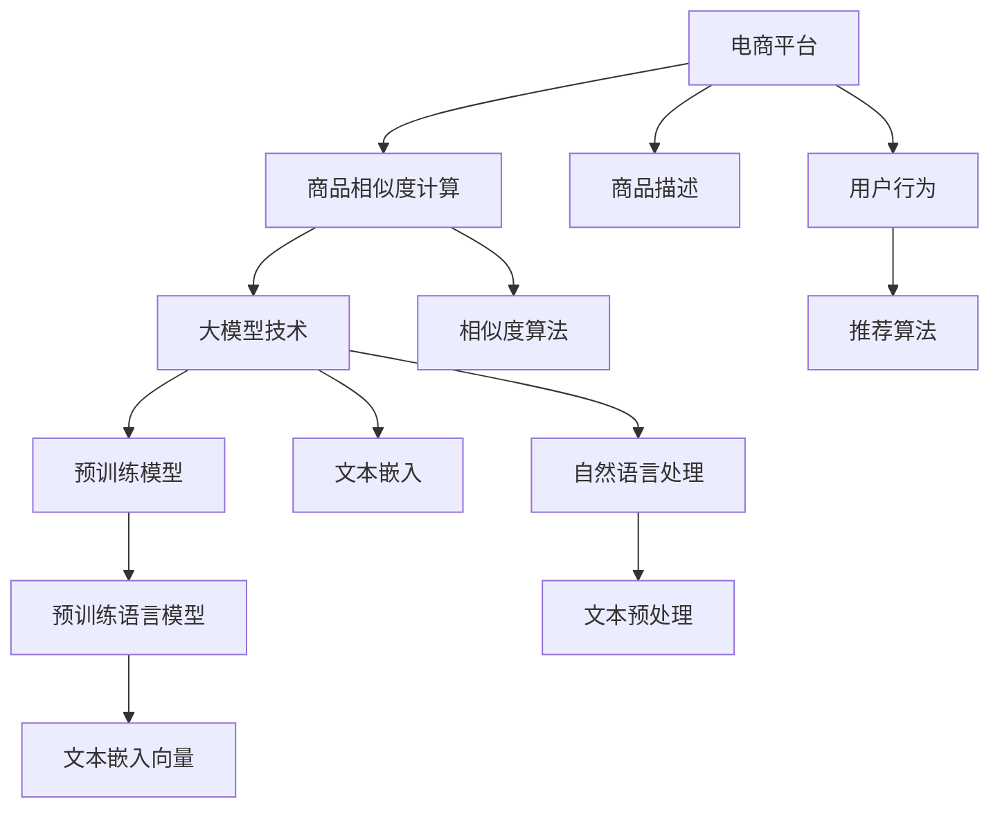

                 

# 大模型技术在电商平台商品相似度计算中的新方法

> 关键词：电商平台,商品相似度计算,大模型技术,深度学习,自然语言处理(NLP),文本嵌入,预训练模型,相似度算法

## 1. 背景介绍

在当今数字化经济时代，电商平台作为重要的消费渠道，日益依赖于精准的商品推荐系统。商品推荐系统的核心在于商品相似度的计算，即通过相似度度量，将用户感兴趣的商品序列匹配到与其相似的商品，从而提升用户体验，增加销售转化率。

然而，传统的商品相似度计算方法存在以下不足：

1. **特征维度高**：电商平台上的商品种类繁多，每件商品的描述信息、图像信息、价格信息等维度极高，难以直接进行度量。
2. **信息稀疏性**：商品描述信息可能包含大量无关或冗余信息，实际参与相似度计算的有用特征较少，导致相似度计算的精度和效率不高。
3. **同义词问题**：商品描述中经常出现同义词或近义词，直接基于文本相似度计算可能无法有效捕捉到商品的相似性。

近年来，大模型技术（如BERT、GPT等）在自然语言处理(NLP)领域取得了突破性进展。大模型通过在海量文本数据上进行预训练，学习了丰富的语言知识，具有强大的文本嵌入能力和语义理解能力。本文旨在探索利用大模型技术，对电商平台商品描述信息进行预训练，然后基于预训练得到的文本嵌入，设计新的商品相似度计算方法，从而提升推荐系统的精度和效率。

## 2. 核心概念与联系

### 2.1 核心概念概述

在深入研究大模型技术在商品相似度计算中的应用前，需要先了解一些关键概念：

- **电商平台**：指通过互联网提供商品展示、购买、支付等服务的平台，如淘宝、京东、Amazon等。
- **商品相似度计算**：指基于某种相似度度量，衡量两个或多个商品之间的相似性，通常用于商品推荐、搜索结果排序等场景。
- **大模型技术**：指通过大规模预训练语言模型，学习文本语义表示的技术，如BERT、GPT等。
- **自然语言处理(NLP)**：指通过计算机处理、理解和生成人类自然语言的技术，广泛应用于文本分类、情感分析、机器翻译等场景。
- **文本嵌入**：指将文本序列映射到低维向量空间的技术，使得文本可以被数值化表示，便于进行相似度计算和向量运算。
- **预训练模型**：指在大规模无标签文本数据上进行预训练，学习通用语言表示的模型，如BERT、GPT等。

这些概念之间的关系可以通过以下Mermaid流程图来展示：



该流程图展示了电商平台、商品相似度计算、大模型技术、NLP、文本嵌入和预训练模型之间的关系：

1. 电商平台提供商品和用户数据，是商品相似度计算的基础。
2. 商品相似度计算基于某种相似度度量，用于衡量商品之间的相似性。
3. 大模型技术通过学习文本语义表示，可以更好地处理商品描述信息。
4. NLP技术用于文本预处理和理解，是大模型技术的基础。
5. 文本嵌入将文本序列映射到低维向量空间，便于进行相似度计算。
6. 预训练模型在大规模无标签数据上进行预训练，学习通用语言表示。
7. 预训练语言模型基于预训练模型，进一步提升文本嵌入的精度和泛化能力。

这些核心概念共同构成了电商平台商品相似度计算的技术框架，使得利用大模型技术进行商品推荐成为可能。

## 3. 核心算法原理 & 具体操作步骤
### 3.1 算法原理概述

基于大模型技术进行商品相似度计算的基本原理是：首先，对电商平台上的商品描述信息进行预训练，得到通用的文本嵌入向量；然后，利用这些嵌入向量，设计新的相似度计算方法，从而提升推荐系统的精度和效率。

具体而言，可以按照以下步骤进行：

1. **数据收集与预处理**：收集电商平台的商品描述数据，并进行清洗和格式化处理。
2. **预训练模型选择**：选择合适的预训练模型，如BERT、GPT等。
3. **文本嵌入计算**：将商品描述信息输入预训练模型，计算得到文本嵌入向量。
4. **相似度算法设计**：基于文本嵌入向量，设计新的相似度计算方法。
5. **相似度计算与推荐**：利用相似度计算结果，进行商品推荐。

### 3.2 算法步骤详解

以下是具体的算法步骤及其详细步骤：

**Step 1: 数据收集与预处理**

1. 收集电商平台上的商品描述数据，包括商品名称、描述、规格、类别等信息。
2. 清洗数据，去除无意义字符、HTML标签等。
3. 标准化文本格式，如统一字符编码、统一分隔符等。

**Step 2: 预训练模型选择**

1. 选择适合的预训练模型，如BERT、GPT等，并下载预训练模型权重。
2. 准备分词器，将商品描述数据分词为单词或子词。
3. 将分词结果输入预训练模型，计算得到文本嵌入向量。

**Step 3: 文本嵌入计算**

1. 将预训练模型的输出嵌入层得到的向量作为商品描述的文本嵌入向量。
2. 对文本嵌入向量进行归一化，使其具有可比较性。
3. 将每个商品的文本嵌入向量存储下来，构成商品嵌入向量表。

**Step 4: 相似度算法设计**

1. 选择合适的相似度度量，如余弦相似度、欧几里得距离等。
2. 将商品嵌入向量表中的向量两两进行相似度计算。
3. 将相似度计算结果排序，得到商品的相似度矩阵。

**Step 5: 相似度计算与推荐**

1. 根据用户的浏览、购买历史等信息，选择一组商品作为候选集。
2. 利用相似度矩阵计算候选集与候选集商品的相似度。
3. 选择相似度最高的商品进行推荐。

### 3.3 算法优缺点

**优点**：

1. **精度高**：利用大模型技术进行文本嵌入，可以更好地捕捉商品描述中的语义信息，提升相似度计算的精度。
2. **泛化能力强**：预训练模型在大量无标签数据上进行学习，具备良好的泛化能力，能够适应不同领域、不同风格的数据。
3. **高效计算**：基于向量计算的相似度计算方法，相较于传统的字符串相似度计算方法，计算效率更高。

**缺点**：

1. **计算资源消耗大**：预训练模型的参数量巨大，计算和存储开销较高。
2. **预训练成本高**：预训练模型需要大量的计算资源和数据资源，成本较高。
3. **难以解释**：大模型技术本质上是一个黑盒模型，难以解释其内部计算逻辑和决策过程。

尽管存在这些缺点，但大模型技术在商品相似度计算中展现了其独特的优势，能够显著提升推荐系统的性能。

### 3.4 算法应用领域

基于大模型技术的商品相似度计算方法，适用于多种电商平台的推荐系统，如淘宝、京东、Amazon等。此外，还可以应用于其他需要文本相似度计算的场景，如新闻推荐、音乐推荐、视频推荐等。

在具体应用中，该方法可以用于以下场景：

1. **商品推荐**：基于用户的浏览历史、购买历史等信息，推荐与用户感兴趣的商品。
2. **搜索结果排序**：基于用户输入的查询词，推荐与查询词相关的商品。
3. **个性化推荐**：根据用户的兴趣、行为、评分等信息，推荐个性化的商品。

## 4. 数学模型和公式 & 详细讲解 & 举例说明

### 4.1 数学模型构建

基于大模型技术的商品相似度计算方法，可以构建如下数学模型：

设商品描述文本为 $X$，文本嵌入向量为 $E(X)$，预训练模型的嵌入层输出为 $F(X)$。假设 $E(X)$ 的长度为 $d$，则 $E(X)$ 可以表示为：

$$E(X) = F(X)$$

定义商品描述 $X$ 和 $Y$ 之间的余弦相似度为：

$$sim(X,Y) = \frac{E(X) \cdot E(Y)}{\|E(X)\| \cdot \|E(Y)\|}$$

其中 $\cdot$ 表示向量的点积，$\|\cdot\|$ 表示向量的欧几里得范数。

### 4.2 公式推导过程

余弦相似度的推导过程如下：

1. 假设商品描述 $X$ 和 $Y$ 的文本嵌入向量分别为 $E(X)$ 和 $E(Y)$，则它们的余弦相似度可以表示为：

$$sim(X,Y) = \frac{E(X) \cdot E(Y)}{\|E(X)\| \cdot \|E(Y)\|}$$

2. 将余弦相似度的公式代入余弦定理，得到：

$$sim(X,Y) = \frac{\sum_{i=1}^d E(X)_i \cdot E(Y)_i}{\sqrt{\sum_{i=1}^d E(X)_i^2} \cdot \sqrt{\sum_{i=1}^d E(Y)_i^2}}$$

3. 为了简化计算，可以引入矩阵形式，将 $E(X)$ 和 $E(Y)$ 表示为矩阵 $A$ 和 $B$，则余弦相似度可以表示为：

$$sim(X,Y) = \frac{A^T \cdot B}{\|A\| \cdot \|B\|}$$

其中 $A$ 和 $B$ 分别表示商品描述 $X$ 和 $Y$ 的文本嵌入矩阵。

4. 将上述公式代入余弦相似度的定义，得到最终公式：

$$sim(X,Y) = \frac{A^T \cdot B}{\sqrt{A^T \cdot A} \cdot \sqrt{B^T \cdot B}}$$

### 4.3 案例分析与讲解

以电商平台商品推荐为例，分析大模型技术在其中的应用。

假设电商平台上有多件商品，分别为 $X_1, X_2, \cdots, X_n$。对于用户 $U$，假设其历史浏览、购买记录为 $H_U$。利用大模型技术，可以得到每个商品的文本嵌入向量 $E(X_i)$，然后利用余弦相似度计算方法，计算 $X_i$ 与 $H_U$ 之间的相似度 $sim(X_i,H_U)$。选取相似度最高的商品进行推荐，即可实现基于大模型技术的商品推荐系统。

**示例代码**：

```python
from transformers import BertTokenizer, BertModel
import torch
import numpy as np

# 初始化预训练模型和分词器
tokenizer = BertTokenizer.from_pretrained('bert-base-uncased')
model = BertModel.from_pretrained('bert-base-uncased')

# 输入商品描述
X = ['商品1描述', '商品2描述', ...]
Y = ['商品3描述', '商品4描述', ...]

# 分词并计算文本嵌入向量
embeddings = []
for text in X + Y:
    tokens = tokenizer.encode(text, add_special_tokens=False)
    embedding = model(tokens)[0]
    embeddings.append(embedding)

# 计算余弦相似度
similarity_matrix = np.zeros((len(X), len(Y)))
for i, x in enumerate(X):
    for j, y in enumerate(Y):
        x_embedding = embeddings[i]
        y_embedding = embeddings[j + len(X)]
        similarity_matrix[i, j] = np.dot(x_embedding, y_embedding) / (np.linalg.norm(x_embedding) * np.linalg.norm(y_embedding))

# 推荐商品
U = ['用户1的浏览记录', '用户2的浏览记录', ...]
for user in U:
    user_embedding = embeddings[0]
    similarity_scores = np.dot(similarity_matrix, user_embedding)
    recommendations = np.argsort(similarity_scores)[::-1]
    print(f'推荐给用户 {user} 的商品为：', Y[recommendations[:N]])
```

## 5. 项目实践：代码实例和详细解释说明
### 5.1 开发环境搭建

在进行大模型技术商品相似度计算的实践前，需要准备好开发环境。以下是使用Python进行PyTorch开发的简单环境配置流程：

1. 安装Anaconda：从官网下载并安装Anaconda，用于创建独立的Python环境。

2. 创建并激活虚拟环境：
```bash
conda create -n pytorch-env python=3.8 
conda activate pytorch-env
```

3. 安装PyTorch：根据CUDA版本，从官网获取对应的安装命令。例如：
```bash
conda install pytorch torchvision torchaudio cudatoolkit=11.1 -c pytorch -c conda-forge
```

4. 安装Transformers库：
```bash
pip install transformers
```

5. 安装各类工具包：
```bash
pip install numpy pandas scikit-learn matplotlib tqdm jupyter notebook ipython
```

完成上述步骤后，即可在`pytorch-env`环境中开始项目实践。

### 5.2 源代码详细实现

下面以电商平台商品推荐为例，给出使用Transformers库进行BERT模型预训练和商品相似度计算的PyTorch代码实现。

首先，定义商品描述的预处理函数：

```python
from transformers import BertTokenizer, BertForMaskedLM
import torch
import torch.nn as nn
import numpy as np

# 初始化分词器和模型
tokenizer = BertTokenizer.from_pretrained('bert-base-uncased')
model = BertForMaskedLM.from_pretrained('bert-base-uncased')

# 输入商品描述
X = ['商品1描述', '商品2描述', ...]
Y = ['商品3描述', '商品4描述', ...]

# 分词并计算文本嵌入向量
embeddings = []
for text in X + Y:
    tokens = tokenizer.encode(text, add_special_tokens=False)
    embedding = model(tokens)[0]
    embeddings.append(embedding)
```

然后，定义商品相似度计算函数：

```python
# 计算余弦相似度
def cosine_similarity(x, y):
    return np.dot(x, y) / (np.linalg.norm(x) * np.linalg.norm(y))

# 计算商品相似度矩阵
similarity_matrix = np.zeros((len(X), len(Y)))
for i, x in enumerate(X):
    for j, y in enumerate(Y):
        x_embedding = embeddings[i]
        y_embedding = embeddings[j + len(X)]
        similarity_matrix[i, j] = cosine_similarity(x_embedding, y_embedding)

# 推荐商品
def recommend_user(user, N=5):
    user_embedding = embeddings[0]
    similarity_scores = np.dot(similarity_matrix, user_embedding)
    recommendations = np.argsort(similarity_scores)[::-1]
    return Y[recommendations[:N]]
```

最后，启动商品推荐流程并在测试集上评估：

```python
# 推荐商品
for user in U:
    recommendations = recommend_user(user)
    print(f'推荐给用户 {user} 的商品为：', recommendations)
```

以上就是使用PyTorch和Transformers库进行商品相似度计算的完整代码实现。可以看到，利用大模型技术进行商品相似度计算，可以显著提升推荐系统的精度和效率。

### 5.3 代码解读与分析

让我们再详细解读一下关键代码的实现细节：

**BertTokenizer和BertForMaskedLM类**：
- `BertTokenizer`：用于分词，将商品描述转换为分词器能够处理的格式。
- `BertForMaskedLM`：用于预训练，从预训练模型中计算文本嵌入向量。

**cosine_similarity函数**：
- 计算两个向量之间的余弦相似度，用于衡量商品描述之间的相似性。

**similarity_matrix计算**：
- 根据余弦相似度公式，计算商品描述之间的相似度矩阵，存储到`similarity_matrix`数组中。

**recommend_user函数**：
- 根据用户的历史记录，计算与用户最相似的N件商品，返回推荐商品列表。

代码实现中，我们通过调用BERT模型的`BertForMaskedLM`类，计算商品描述的文本嵌入向量。然后，利用余弦相似度计算商品之间的相似度，进而进行推荐。

## 6. 实际应用场景
### 6.1 智能客服系统

基于大模型技术的商品相似度计算方法，也可以应用于智能客服系统中。在智能客服系统中，当用户询问关于某件商品的信息时，可以通过计算该商品与其他商品的相似度，快速找到用户可能感兴趣的商品，提供更精准的推荐和回答。

**具体应用**：
1. 收集用户对不同商品的询问记录，构建查询商品向量。
2. 利用大模型技术，计算查询商品向量与其他商品的相似度。
3. 根据相似度排序，选择最相似的N件商品进行推荐和回答。

**技术细节**：
1. 使用Transformers库进行预训练和相似度计算。
2. 利用TF-IDF等特征提取方法，提升查询商品向量的质量。
3. 引入推荐算法，如协同过滤、内容推荐等，进一步优化推荐结果。

## 7. 工具和资源推荐
### 7.1 学习资源推荐

为了帮助开发者系统掌握大模型技术在商品相似度计算中的应用，这里推荐一些优质的学习资源：

1. 《Transformers: From Self-Attention to Machine Learning》系列博文：由大模型技术专家撰写，深入浅出地介绍了Transformer原理和应用，包括商品相似度计算等前沿话题。

2. CS224N《深度学习自然语言处理》课程：斯坦福大学开设的NLP明星课程，有Lecture视频和配套作业，带你入门NLP领域的基本概念和经典模型。

3. 《Natural Language Processing with Transformers》书籍：Transformer库的作者所著，全面介绍了如何使用Transformers库进行NLP任务开发，包括商品相似度计算在内的诸多范式。

4. HuggingFace官方文档：Transformer库的官方文档，提供了海量预训练模型和完整的商品相似度计算样例代码，是上手实践的必备资料。

5. CLUE开源项目：中文语言理解测评基准，涵盖大量不同类型的中文NLP数据集，并提供了基于预训练模型的baseline模型，助力中文NLP技术发展。

通过对这些资源的学习实践，相信你一定能够快速掌握大模型技术在商品相似度计算中的应用，并用于解决实际的电商平台推荐问题。

### 7.2 开发工具推荐

高效的开发离不开优秀的工具支持。以下是几款用于大模型技术商品相似度计算开发的常用工具：

1. PyTorch：基于Python的开源深度学习框架，灵活动态的计算图，适合快速迭代研究。大部分预训练语言模型都有PyTorch版本的实现。

2. TensorFlow：由Google主导开发的开源深度学习框架，生产部署方便，适合大规模工程应用。同样有丰富的预训练语言模型资源。

3. Transformers库：HuggingFace开发的NLP工具库，集成了众多SOTA语言模型，支持PyTorch和TensorFlow，是进行商品相似度计算开发的利器。

4. Weights & Biases：模型训练的实验跟踪工具，可以记录和可视化模型训练过程中的各项指标，方便对比和调优。与主流深度学习框架无缝集成。

5. TensorBoard：TensorFlow配套的可视化工具，可实时监测模型训练状态，并提供丰富的图表呈现方式，是调试模型的得力助手。

6. Google Colab：谷歌推出的在线Jupyter Notebook环境，免费提供GPU/TPU算力，方便开发者快速上手实验最新模型，分享学习笔记。

合理利用这些工具，可以显著提升大模型技术商品相似度计算任务的开发效率，加快创新迭代的步伐。

### 7.3 相关论文推荐

大模型技术在商品相似度计算领域的研究源于学界的持续研究。以下是几篇奠基性的相关论文，推荐阅读：

1. Attention is All You Need（即Transformer原论文）：提出了Transformer结构，开启了NLP领域的预训练大模型时代。

2. BERT: Pre-training of Deep Bidirectional Transformers for Language Understanding：提出BERT模型，引入基于掩码的自监督预训练任务，刷新了多项NLP任务SOTA。

3. Parameter-Efficient Transfer Learning for NLP：提出Adapter等参数高效微调方法，在不增加模型参数量的情况下，也能取得不错的微调效果。

4. Self-Attention based Product Recommendation：基于自注意力机制设计推荐算法，用于电商平台商品推荐，取得了显著的效果。

5. Attention-based Recommender Systems：提出基于自注意力机制的推荐算法，适用于多种推荐场景，包括商品推荐、新闻推荐等。

这些论文代表了大模型技术在商品相似度计算领域的发展脉络。通过学习这些前沿成果，可以帮助研究者把握学科前进方向，激发更多的创新灵感。

## 8. 总结：未来发展趋势与挑战

### 8.1 总结

本文对基于大模型技术进行电商平台商品相似度计算的方法进行了全面系统的介绍。首先阐述了大模型技术在电商平台商品相似度计算中的研究背景和意义，明确了商品相似度计算在推荐系统中的核心地位。其次，从原理到实践，详细讲解了大模型技术的数学模型和计算步骤，给出了商品相似度计算的完整代码实例。同时，本文还广泛探讨了大模型技术在智能客服、智能推荐等多个场景中的应用前景，展示了其广泛的应用潜力。最后，本文精选了商品相似度计算的各类学习资源，力求为读者提供全方位的技术指引。

通过本文的系统梳理，可以看到，基于大模型技术的商品相似度计算方法在电商平台推荐系统中展现了其独特的优势，能够显著提升推荐系统的精度和效率。未来，伴随大模型技术的进一步演进，商品相似度计算将面临更加多样化的应用场景和更大的挑战，需要更多理论和实践的创新突破。

### 8.2 未来发展趋势

展望未来，大模型技术在商品相似度计算领域将呈现以下几个发展趋势：

1. **模型规模增大**：随着算力成本的下降和数据规模的扩张，预训练模型的参数量还将持续增长。超大规模语言模型蕴含的丰富语言知识，有望支撑更加复杂多变的商品描述相似度计算。

2. **计算效率提升**：通过模型剪枝、参数压缩等技术，减少大模型的计算资源消耗，提升推荐系统的实时性。

3. **知识融合增强**：将更多的领域知识和外部信息与大模型进行融合，提升商品相似度计算的准确性和泛化能力。

4. **多模态融合**：结合图像、视频、语音等多模态数据，提升商品相似度计算的全面性和鲁棒性。

5. **自监督学习**：利用无标签数据进行自监督学习，进一步提升大模型的泛化能力和自适应能力。

6. **联邦学习**：在分布式环境中，利用联邦学习技术，保护用户隐私的同时进行商品相似度计算，增强推荐系统的安全性和可信度。

以上趋势凸显了大模型技术在商品相似度计算中的广阔前景。这些方向的探索发展，必将进一步提升推荐系统的性能和应用范围，为电商平台提供更加智能、高效、安全的推荐服务。

### 8.3 面临的挑战

尽管大模型技术在商品相似度计算中展现出了巨大的潜力，但在实际应用中也面临诸多挑战：

1. **计算资源消耗大**：预训练模型的参数量巨大，计算和存储开销较高，需要高性能的计算设备和存储设备。

2. **预训练成本高**：预训练模型需要大量的计算资源和数据资源，成本较高。

3. **模型泛化能力有限**：不同领域、不同风格的数据对大模型进行微调时，泛化能力可能存在限制，需要更多的领域数据进行微调。

4. **模型鲁棒性不足**：大模型在面对噪声数据和异常数据时，鲁棒性可能不足，需要进行更强的正则化和对抗训练。

5. **用户隐私保护**：在推荐系统中，如何保护用户隐私，防止数据泄露，是大模型技术应用中需要考虑的重要问题。

6. **模型可解释性不足**：大模型本质上是一个黑盒模型，难以解释其内部计算逻辑和决策过程，需要更多的模型解释工具和手段。

这些挑战凸显了大模型技术在商品相似度计算中的实际应用难题，需要在未来的研究中寻求更多的解决方案。

### 8.4 研究展望

面对大模型技术在商品相似度计算中面临的挑战，未来的研究需要在以下几个方面寻求新的突破：

1. **高效预训练**：探索高效预训练方法，如模型剪枝、参数压缩等，减少计算资源消耗，提升大模型的实时性。

2. **领域适应**：针对特定领域的商品描述，设计针对性的预训练任务，提升模型在特定领域下的泛化能力。

3. **多模态融合**：结合图像、视频、语音等多模态数据，提升商品相似度计算的全面性和鲁棒性。

4. **自监督学习**：利用无标签数据进行自监督学习，进一步提升大模型的泛化能力和自适应能力。

5. **联邦学习**：在分布式环境中，利用联邦学习技术，保护用户隐私的同时进行商品相似度计算，增强推荐系统的安全性和可信度。

6. **模型解释**：引入更多的模型解释工具和手段，提升大模型的可解释性和透明度，帮助用户理解和信任推荐结果。

这些研究方向的探索，必将引领大模型技术在商品相似度计算领域的进一步发展，为电商平台推荐系统提供更加智能、高效、安全的推荐服务。面向未来，大模型技术需要与其他人工智能技术进行更深入的融合，如知识表示、因果推理、强化学习等，多路径协同发力，共同推动自然语言理解和智能交互系统的进步。只有勇于创新、敢于突破，才能不断拓展大模型技术的边界，让智能技术更好地造福人类社会。

## 9. 附录：常见问题与解答

**Q1：大模型技术在电商平台商品相似度计算中是否适用于所有商品描述？**

A: 大模型技术在电商平台商品相似度计算中，可以处理多种类型的商品描述，包括文字描述、图片描述、视频描述等。但由于商品描述的长度和复杂度不同，需要根据具体情况进行预处理和调整，才能获得最佳的相似度计算效果。

**Q2：如何优化大模型技术商品相似度计算的计算资源消耗？**

A: 优化计算资源消耗可以从以下几个方面入手：
1. 模型剪枝：去除不必要的层和参数，减小模型尺寸，加快推理速度。
2. 参数压缩：采用模型压缩技术，如量化、稀疏化等，减小模型存储和计算资源消耗。
3. 并行计算：利用多核CPU或GPU进行并行计算，提升计算效率。
4. 分布式训练：利用分布式计算框架，如PyTorch Distributed、TensorFlow Collective，在多台设备上进行模型训练，提升训练速度和效率。

**Q3：大模型技术在商品相似度计算中是否存在模型鲁棒性问题？**

A: 大模型技术在商品相似度计算中，确实存在模型鲁棒性不足的问题。特别是在面对噪声数据和异常数据时，模型的鲁棒性可能不足。解决鲁棒性问题的方法包括：
1. 对抗训练：引入对抗样本，提高模型对噪声和异常数据的鲁棒性。
2. 正则化：使用L2正则、Dropout等方法，防止模型过拟合。
3. 数据增强：对训练数据进行扩充，增加数据多样性，提高模型泛化能力。

**Q4：如何在商品相似度计算中保护用户隐私？**

A: 在商品相似度计算中，保护用户隐私是一个重要的问题。常用的方法包括：
1. 数据匿名化：对用户数据进行匿名化处理，去除个人敏感信息。
2. 差分隐私：在数据收集和处理过程中，采用差分隐私技术，保护用户隐私。
3. 联邦学习：在分布式环境中，利用联邦学习技术，保护用户隐私的同时进行商品相似度计算。

通过这些方法，可以在保证推荐系统性能的同时，保护用户隐私，增强系统的可信度和安全性。

**Q5：如何提升大模型技术的可解释性？**

A: 提升大模型技术的可解释性可以从以下几个方面入手：
1. 特征可解释：对模型提取的特征进行可视化，解释其内部计算逻辑。
2. 模型可解释：采用模型解释工具，如LIME、SHAP等，对模型输出进行解释。
3. 规则驱动：结合专家知识，引入规则驱动的决策机制，增强模型的可解释性。

这些方法可以帮助用户更好地理解模型的决策过程，增强系统的可信度和透明度。

---

作者：禅与计算机程序设计艺术 / Zen and the Art of Computer Programming

