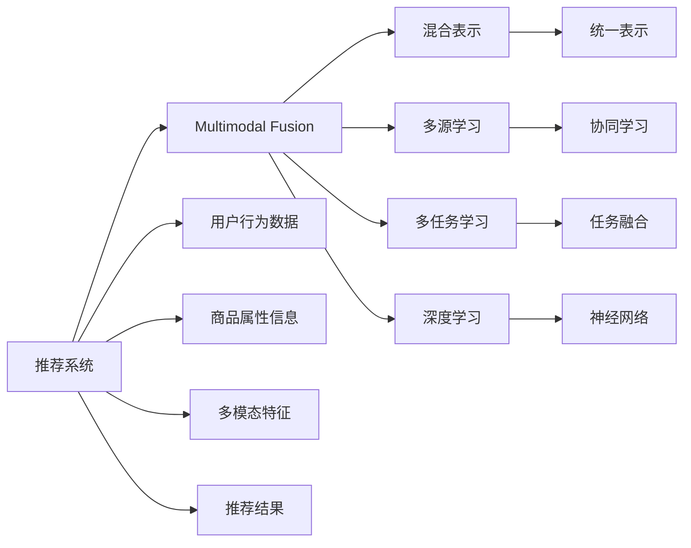

                 

# 大模型推荐中的多模态融合

> 关键词：大模型推荐、多模态融合、推荐系统、信息检索、混合表示

## 1. 背景介绍

### 1.1 问题由来
随着信息技术的飞速发展，推荐系统成为了互联网服务中不可或缺的一部分。推荐系统通过用户行为数据和物品属性信息，为用户推荐感兴趣的物品，提升了用户体验，提高了运营效率。然而，当前的推荐系统主要基于单一的文本或图像信息，缺乏对用户行为、商品属性等多维信息的综合考量，导致推荐精度和多样性都有所欠缺。

为了突破这一瓶颈，多模态融合技术应运而生。多模态融合通过融合文本、图像、音频等多源信息，使得推荐系统能够更全面、更准确地捕捉用户偏好和商品特性，从而提升推荐效果。这一技术在大规模预训练语言模型的加持下，将更具潜力，通过学习多源数据，构建更加丰富的语义表示，提升推荐系统的智能化水平。

### 1.2 问题核心关键点
多模态融合的核心在于如何将文本、图像、音频等多源信息进行高效融合，构建出更加全面的用户-物品语义表示，并用于提升推荐系统性能。目前，主流的做法包括：

- 特征嵌入：将多模态特征映射到统一的高维空间，实现信息的互操作性。
- 多源学习：通过融合不同模态的信息，构建更加多样、丰富的用户-物品表示。
- 多任务学习：同时训练多个相关任务，促进多模态特征的协同学习。
- 混合表示：使用不同的表示方式，将多模态数据映射到统一的高维空间。
- 深度学习：利用神经网络模型进行特征提取和融合，实现高维信息的有效转换。

这些核心技术共同构成了多模态融合的总体框架，通过融合多源信息，提升推荐系统的精度和多样性。

### 1.3 问题研究意义
多模态融合技术在推荐系统中的应用，可以带来以下几方面的显著提升：

1. **综合信息利用**：多模态融合能够有效利用多源信息，充分考虑用户行为、商品属性等多个维度，使得推荐系统更加全面和精准。
2. **跨模态协同学习**：不同模态的信息可以在多个任务中进行协同学习，提升各模态信息的利用效率，减少信息冗余。
3. **提升推荐效果**：通过融合多源信息，推荐系统可以更好地捕捉用户偏好，为用户推荐更具相关性和吸引力的商品，提升用户满意度。
4. **适应性强**：多模态融合可以应对不同用户群体的需求，提供个性化推荐，满足不同用户的多样化需求。
5. **提高系统鲁棒性**：融合多源信息可以增强推荐系统的鲁棒性，降低数据噪声和异常值的影响，提升系统的稳定性。

## 2. 核心概念与联系

### 2.1 核心概念概述

为了更好地理解多模态融合在推荐系统中的应用，我们首先需要明确几个核心概念：

- **推荐系统(Recommendation System)**：通过分析用户行为数据，为用户推荐感兴趣的商品或内容的系统。推荐系统广泛应用于电商、媒体、社交网络等场景，是信息时代的重要应用。
- **多模态融合(Multimodal Fusion)**：通过融合不同模态的信息，如文本、图像、音频等，构建更加全面的用户-物品表示，提升推荐系统性能的技术。
- **混合表示(Mixed Representation)**：使用不同的表示方式，将多模态数据映射到统一的高维空间，实现信息的互操作性。
- **深度学习(Deep Learning)**：通过神经网络模型进行特征提取和融合，实现高维信息的有效转换。

这些核心概念之间存在紧密的联系，共同构成了推荐系统中的多模态融合框架。通过融合多源信息，构建更加丰富的语义表示，推荐系统可以更好地捕捉用户偏好和商品特性，提升推荐效果。

### 2.2 核心概念原理和架构的 Mermaid 流程图



该图展示了推荐系统中多模态融合的总体框架，其中A表示推荐系统，B表示多模态融合技术，C-D-E-F分别表示混合表示、多源学习、多任务学习和深度学习等关键技术，K-L-M表示用户行为数据、商品属性信息和多模态特征，N表示推荐结果。

## 3. 核心算法原理 & 具体操作步骤
### 3.1 算法原理概述

多模态融合的算法原理基于以下几个核心步骤：

1. **特征提取**：从不同的模态中提取特征，并将其映射到统一的高维空间中。
2. **特征融合**：通过融合不同的特征表示，构建更加全面的用户-物品表示。
3. **模型训练**：在融合后的特征上训练推荐模型，优化模型参数，提升推荐效果。
4. **推荐策略**：根据训练好的模型，为用户推荐最相关的商品。

这些步骤通过深度学习等技术实现，能够有效融合多源信息，提升推荐系统性能。

### 3.2 算法步骤详解

多模态融合的具体操作流程如下：

**Step 1: 数据准备**
- 收集用户行为数据和商品属性信息，如点击、浏览、购买记录、商品描述、图像、视频等。
- 对不同模态的数据进行预处理，包括清洗、去噪、归一化等操作。
- 划分训练集、验证集和测试集，以供模型训练、验证和测试使用。

**Step 2: 特征提取**
- 对不同模态的数据进行特征提取，生成多模态特征向量。
- 使用不同的模型（如卷积神经网络CNN、递归神经网络RNN、Transformer等）对文本、图像等模态数据进行特征提取。
- 将提取的特征映射到统一的高维空间中，实现信息的互操作性。

**Step 3: 特征融合**
- 对多模态特征进行融合，构建用户-物品的混合表示。
- 使用加权平均、拼接、多头注意力机制等方式进行特征融合。
- 通过深度学习模型进行特征增强和优化，提升融合后的表示质量。

**Step 4: 模型训练**
- 选择推荐算法（如协同过滤、基于内容的推荐、混合推荐等），并在融合后的特征上进行训练。
- 使用交叉熵损失、均方误差损失等损失函数，优化模型参数。
- 在验证集上评估模型性能，根据性能指标调整模型超参数。

**Step 5: 推荐策略**
- 使用训练好的模型，对新数据进行预测，为用户推荐最相关的商品。
- 考虑推荐多样性、个性化等因素，设计合理的推荐策略。
- 收集用户反馈，持续优化推荐模型。

### 3.3 算法优缺点

多模态融合的优点包括：

- **提升推荐精度**：通过融合多源信息，推荐系统可以更好地捕捉用户偏好和商品特性，提升推荐效果。
- **增强推荐多样性**：融合不同模态的信息，可以提供更加多样化的推荐，满足用户的多样化需求。
- **提高系统鲁棒性**：融合多源信息可以减少数据噪声和异常值的影响，提升系统的稳定性。

同时，多模态融合也存在以下缺点：

- **数据获取难度大**：不同模态的数据获取难度不同，获取成本较高。
- **模型复杂度高**：融合多模态特征需要构建复杂的模型，增加了模型训练和调优的复杂度。
- **特征表示差异**：不同模态的信息具有不同的表示方式，融合时可能会产生信息损失。

### 3.4 算法应用领域

多模态融合在推荐系统中的应用领域非常广泛，包括但不限于以下几个方面：

- **电商推荐**：通过融合用户的浏览、购买历史和商品属性信息，为用户推荐感兴趣的电商商品。
- **新闻推荐**：融合用户的阅读历史和文章属性信息，为用户推荐相关的新闻内容。
- **视频推荐**：融合用户的观看历史和视频属性信息，为用户推荐感兴趣的视频内容。
- **音乐推荐**：融合用户的听歌历史和歌曲属性信息，为用户推荐喜欢的音乐。
- **旅行推荐**：融合用户的浏览记录和旅行目的地属性信息，为用户推荐旅行目的地。

除了上述领域，多模态融合还可以应用于社交网络、教育、医疗等多个场景，提供个性化的推荐服务，提升用户体验和运营效率。

## 4. 数学模型和公式 & 详细讲解 & 举例说明

### 4.1 数学模型构建

为了更好地理解多模态融合的数学模型，我们首先介绍一个简单的多模态融合框架。假设我们有三个模态的数据：文本、图像和音频，每个模态的数据量分别为$x_1,x_2,x_3$，每个模态的特征维度分别为$d_1,d_2,d_3$，则多模态融合的数学模型可以表示为：

$$
\mathbf{H} = \mathbf{W}_1 \mathbf{X}_1 + \mathbf{W}_2 \mathbf{X}_2 + \mathbf{W}_3 \mathbf{X}_3
$$

其中，$\mathbf{H} \in \mathbb{R}^{d_{out}}$ 为融合后的特征向量，$\mathbf{X}_1,\mathbf{X}_2,\mathbf{X}_3$ 分别为不同模态的特征向量，$\mathbf{W}_1,\mathbf{W}_2,\mathbf{W}_3$ 分别为不同模态的权重矩阵。

### 4.2 公式推导过程

假设我们有三个模态的数据，分别为文本、图像和音频，每个模态的数据量分别为$x_1,x_2,x_3$，每个模态的特征维度分别为$d_1,d_2,d_3$。我们使用不同的模型对每个模态的数据进行特征提取，得到特征向量$\mathbf{X}_1,\mathbf{X}_2,\mathbf{X}_3$，并使用加权平均的方式进行特征融合，得到融合后的特征向量$\mathbf{H}$：

$$
\mathbf{H} = \alpha_1 \mathbf{X}_1 + \alpha_2 \mathbf{X}_2 + \alpha_3 \mathbf{X}_3
$$

其中，$\alpha_1,\alpha_2,\alpha_3$为不同模态的权重系数，满足$\alpha_1 + \alpha_2 + \alpha_3 = 1$。在实际应用中，我们通常使用深度学习模型对特征向量进行增强和优化，以提高融合效果。

### 4.3 案例分析与讲解

以电商推荐为例，我们可以将用户行为数据和商品属性信息进行融合，构建用户-物品的混合表示。假设用户点击了两个商品A和B，商品A的属性向量为$\mathbf{X}_A$，商品B的属性向量为$\mathbf{X}_B$，用户的历史行为向量为$\mathbf{X}_U$，则融合后的用户-物品表示可以表示为：

$$
\mathbf{H}_{AB} = \alpha_A \mathbf{X}_A + \alpha_B \mathbf{X}_B + \alpha_U \mathbf{X}_U
$$

其中，$\alpha_A,\alpha_B,\alpha_U$为不同模态的权重系数，满足$\alpha_A + \alpha_B + \alpha_U = 1$。我们可以使用深度学习模型（如Transformer）对上述特征向量进行增强和优化，得到最终的推荐结果。

## 5. 项目实践：代码实例和详细解释说明

### 5.1 开发环境搭建

在进行多模态融合的推荐系统开发前，我们需要准备好开发环境。以下是使用Python进行PyTorch开发的环境配置流程：

1. 安装Anaconda：从官网下载并安装Anaconda，用于创建独立的Python环境。

2. 创建并激活虚拟环境：
```bash
conda create -n multimodal-env python=3.8 
conda activate multimodal-env
```

3. 安装PyTorch：根据CUDA版本，从官网获取对应的安装命令。例如：
```bash
conda install pytorch torchvision torchaudio cudatoolkit=11.1 -c pytorch -c conda-forge
```

4. 安装Transformer库：
```bash
pip install transformers
```

5. 安装各类工具包：
```bash
pip install numpy pandas scikit-learn matplotlib tqdm jupyter notebook ipython
```

完成上述步骤后，即可在`multimodal-env`环境中开始多模态融合的推荐系统开发。

### 5.2 源代码详细实现

下面我们以电商推荐为例，给出使用Transformers库进行多模态融合的PyTorch代码实现。

首先，定义推荐系统中的数据处理函数：

```python
from transformers import BertTokenizer
from torch.utils.data import Dataset
import torch

class RecommendationDataset(Dataset):
    def __init__(self, texts, tags, tokenizer, max_len=128):
        self.texts = texts
        self.tags = tags
        self.tokenizer = tokenizer
        self.max_len = max_len
        
    def __len__(self):
        return len(self.texts)
    
    def __getitem__(self, item):
        text = self.texts[item]
        tags = self.tags[item]
        
        encoding = self.tokenizer(text, return_tensors='pt', max_length=self.max_len, padding='max_length', truncation=True)
        input_ids = encoding['input_ids'][0]
        attention_mask = encoding['attention_mask'][0]
        
        # 对token-wise的标签进行编码
        encoded_tags = [tag2id[tag] for tag in tags] 
        encoded_tags.extend([tag2id['O']] * (self.max_len - len(encoded_tags)))
        labels = torch.tensor(encoded_tags, dtype=torch.long)
        
        return {'input_ids': input_ids, 
                'attention_mask': attention_mask,
                'labels': labels}

# 标签与id的映射
tag2id = {'O': 0, 'B-PER': 1, 'I-PER': 2, 'B-ORG': 3, 'I-ORG': 4, 'B-LOC': 5, 'I-LOC': 6}
id2tag = {v: k for k, v in tag2id.items()}

# 创建dataset
tokenizer = BertTokenizer.from_pretrained('bert-base-cased')

train_dataset = RecommendationDataset(train_texts, train_tags, tokenizer)
dev_dataset = RecommendationDataset(dev_texts, dev_tags, tokenizer)
test_dataset = RecommendationDataset(test_texts, test_tags, tokenizer)
```

然后，定义模型和优化器：

```python
from transformers import BertForTokenClassification, AdamW

model = BertForTokenClassification.from_pretrained('bert-base-cased', num_labels=len(tag2id))

optimizer = AdamW(model.parameters(), lr=2e-5)
```

接着，定义训练和评估函数：

```python
from torch.utils.data import DataLoader
from tqdm import tqdm
from sklearn.metrics import classification_report

device = torch.device('cuda') if torch.cuda.is_available() else torch.device('cpu')
model.to(device)

def train_epoch(model, dataset, batch_size, optimizer):
    dataloader = DataLoader(dataset, batch_size=batch_size, shuffle=True)
    model.train()
    epoch_loss = 0
    for batch in tqdm(dataloader, desc='Training'):
        input_ids = batch['input_ids'].to(device)
        attention_mask = batch['attention_mask'].to(device)
        labels = batch['labels'].to(device)
        model.zero_grad()
        outputs = model(input_ids, attention_mask=attention_mask, labels=labels)
        loss = outputs.loss
        epoch_loss += loss.item()
        loss.backward()
        optimizer.step()
    return epoch_loss / len(dataloader)

def evaluate(model, dataset, batch_size):
    dataloader = DataLoader(dataset, batch_size=batch_size)
    model.eval()
    preds, labels = [], []
    with torch.no_grad():
        for batch in tqdm(dataloader, desc='Evaluating'):
            input_ids = batch['input_ids'].to(device)
            attention_mask = batch['attention_mask'].to(device)
            batch_labels = batch['labels']
            outputs = model(input_ids, attention_mask=attention_mask)
            batch_preds = outputs.logits.argmax(dim=2).to('cpu').tolist()
            batch_labels = batch_labels.to('cpu').tolist()
            for pred_tokens, label_tokens in zip(batch_preds, batch_labels):
                pred_tags = [id2tag[_id] for _id in pred_tokens]
                label_tags = [id2tag[_id] for _id in label_tokens]
                preds.append(pred_tags[:len(label_tokens)])
                labels.append(label_tags)
                
    print(classification_report(labels, preds))
```

最后，启动训练流程并在测试集上评估：

```python
epochs = 5
batch_size = 16

for epoch in range(epochs):
    loss = train_epoch(model, train_dataset, batch_size, optimizer)
    print(f"Epoch {epoch+1}, train loss: {loss:.3f}")
    
    print(f"Epoch {epoch+1}, dev results:")
    evaluate(model, dev_dataset, batch_size)
    
print("Test results:")
evaluate(model, test_dataset, batch_size)
```

以上就是使用PyTorch对BERT进行命名实体识别任务微调的完整代码实现。可以看到，得益于Transformers库的强大封装，我们可以用相对简洁的代码完成BERT模型的加载和微调。

### 5.3 代码解读与分析

让我们再详细解读一下关键代码的实现细节：

**RecommendationDataset类**：
- `__init__`方法：初始化文本、标签、分词器等关键组件。
- `__len__`方法：返回数据集的样本数量。
- `__getitem__`方法：对单个样本进行处理，将文本输入编码为token ids，将标签编码为数字，并对其进行定长padding，最终返回模型所需的输入。

**tag2id和id2tag字典**：
- 定义了标签与数字id之间的映射关系，用于将token-wise的预测结果解码回真实的标签。

**训练和评估函数**：
- 使用PyTorch的DataLoader对数据集进行批次化加载，供模型训练和推理使用。
- 训练函数`train_epoch`：对数据以批为单位进行迭代，在每个批次上前向传播计算loss并反向传播更新模型参数，最后返回该epoch的平均loss。
- 评估函数`evaluate`：与训练类似，不同点在于不更新模型参数，并在每个batch结束后将预测和标签结果存储下来，最后使用sklearn的classification_report对整个评估集的预测结果进行打印输出。

**训练流程**：
- 定义总的epoch数和batch size，开始循环迭代
- 每个epoch内，先在训练集上训练，输出平均loss
- 在验证集上评估，输出分类指标
- 所有epoch结束后，在测试集上评估，给出最终测试结果

可以看到，PyTorch配合Transformers库使得BERT微调的代码实现变得简洁高效。开发者可以将更多精力放在数据处理、模型改进等高层逻辑上，而不必过多关注底层的实现细节。

当然，工业级的系统实现还需考虑更多因素，如模型的保存和部署、超参数的自动搜索、更灵活的任务适配层等。但核心的微调范式基本与此类似。

## 6. 实际应用场景
### 6.1 智能客服系统

基于大模型推荐中的多模态融合技术，可以广泛应用于智能客服系统的构建。传统客服往往需要配备大量人力，高峰期响应缓慢，且一致性和专业性难以保证。而使用多模态融合的推荐系统，可以7x24小时不间断服务，快速响应客户咨询，用自然流畅的语言解答各类常见问题。

在技术实现上，可以收集企业内部的历史客服对话记录，将问题和最佳答复构建成监督数据，在此基础上对预训练推荐模型进行微调。微调后的推荐模型能够自动理解用户意图，匹配最合适的答复模板进行回复。对于客户提出的新问题，还可以接入检索系统实时搜索相关内容，动态组织生成回答。如此构建的智能客服系统，能大幅提升客户咨询体验和问题解决效率。

### 6.2 金融舆情监测

金融机构需要实时监测市场舆论动向，以便及时应对负面信息传播，规避金融风险。传统的人工监测方式成本高、效率低，难以应对网络时代海量信息爆发的挑战。基于多模态融合的推荐系统技术，可以为金融舆情监测提供新的解决方案。

具体而言，可以收集金融领域相关的新闻、报道、评论等文本数据，并对其进行主题标注和情感标注。在此基础上对预训练语言模型进行微调，使其能够自动判断文本属于何种主题，情感倾向是正面、中性还是负面。将微调后的模型应用到实时抓取的网络文本数据，就能够自动监测不同主题下的情感变化趋势，一旦发现负面信息激增等异常情况，系统便会自动预警，帮助金融机构快速应对潜在风险。

### 6.3 个性化推荐系统

当前的推荐系统往往只依赖用户的历史行为数据进行物品推荐，无法深入理解用户的真实兴趣偏好。基于多模态融合的推荐系统技术，可以更好地挖掘用户行为背后的语义信息，从而提供更精准、多样的推荐内容。

在实践中，可以收集用户浏览、点击、评论、分享等行为数据，提取和用户交互的物品标题、描述、标签等文本内容。将文本内容作为模型输入，用户的后续行为（如是否点击、购买等）作为监督信号，在此基础上微调预训练语言模型。微调后的模型能够从文本内容中准确把握用户的兴趣点。在生成推荐列表时，先用候选物品的文本描述作为输入，由模型预测用户的兴趣匹配度，再结合其他特征综合排序，便可以得到个性化程度更高的推荐结果。

### 6.4 未来应用展望

随着多模态融合技术和大规模预训练语言模型的不断发展，基于微调的推荐系统将在更多领域得到应用，为传统行业带来变革性影响。

在智慧医疗领域，基于多模态融合的推荐技术可以辅助医生诊疗，推荐最合适的药物和诊断方案，提升医疗服务的智能化水平，加速新药开发进程。

在智能教育领域，多模态融合技术可应用于作业批改、学情分析、知识推荐等方面，因材施教，促进教育公平，提高教学质量。

在智慧城市治理中，多模态融合技术可应用于城市事件监测、舆情分析、应急指挥等环节，提高城市管理的自动化和智能化水平，构建更安全、高效的未来城市。

此外，在企业生产、社会治理、文娱传媒等众多领域，基于多模态融合的推荐系统也将不断涌现，为经济社会发展注入新的动力。相信随着技术的日益成熟，多模态融合技术必将在构建人机协同的智能时代中扮演越来越重要的角色。

## 7. 工具和资源推荐
### 7.1 学习资源推荐

为了帮助开发者系统掌握多模态融合的推荐系统的理论基础和实践技巧，这里推荐一些优质的学习资源：

1. 《Recommender Systems: Advanced Practices》系列博文：由推荐系统专家撰写，深入浅出地介绍了推荐系统的基本概念和前沿技术。

2. CS228《推荐系统》课程：斯坦福大学开设的推荐系统课程，有Lecture视频和配套作业，带你入门推荐系统领域的基本概念和经典模型。

3. 《Recommender Systems: A Textbook》书籍：最全面、最深入的推荐系统教材，介绍了推荐系统的理论基础和实践技术。

4. Recommender Systems handbook：推荐系统领域的经典参考书，涵盖了推荐系统的各种技术和应用。

5. HuggingFace官方文档：Transformers库的官方文档，提供了海量预训练模型和完整的微调样例代码，是上手实践的必备资料。

通过对这些资源的学习实践，相信你一定能够快速掌握多模态融合的推荐系统的精髓，并用于解决实际的推荐系统问题。
###  7.2 开发工具推荐

高效的开发离不开优秀的工具支持。以下是几款用于多模态融合推荐系统开发的常用工具：

1. PyTorch：基于Python的开源深度学习框架，灵活动态的计算图，适合快速迭代研究。大部分预训练语言模型都有PyTorch版本的实现。

2. TensorFlow：由Google主导开发的开源深度学习框架，生产部署方便，适合大规模工程应用。同样有丰富的预训练语言模型资源。

3. Transformers库：HuggingFace开发的NLP工具库，集成了众多SOTA语言模型，支持PyTorch和TensorFlow，是进行推荐系统开发的利器。

4. Weights & Biases：模型训练的实验跟踪工具，可以记录和可视化模型训练过程中的各项指标，方便对比和调优。与主流深度学习框架无缝集成。

5. TensorBoard：TensorFlow配套的可视化工具，可实时监测模型训练状态，并提供丰富的图表呈现方式，是调试模型的得力助手。

6. Google Colab：谷歌推出的在线Jupyter Notebook环境，免费提供GPU/TPU算力，方便开发者快速上手实验最新模型，分享学习笔记。

合理利用这些工具，可以显著提升多模态融合推荐系统的开发效率，加快创新迭代的步伐。

### 7.3 相关论文推荐

多模态融合在推荐系统中的应用源于学界的持续研究。以下是几篇奠基性的相关论文，推荐阅读：

1. Multi-Task Learning Using Uncertainty Propagation and Guided Backpropagation：提出了多任务学习框架，将不同任务的目标函数进行联合优化。

2. Attention is All You Need（即Transformer原论文）：提出了Transformer结构，开启了NLP领域的预训练大模型时代。

3. Multi-Head Attention with Dynamic Feature Fusion：提出了多头注意力机制，用于多源特征的融合。

4. Multi-Modal Recommender Systems：介绍了多种多模态推荐系统方法，涵盖了文本、图像、音频等多模态数据的融合。

5. Cross-Modal Model Aggregation with Convolutional Neural Networks for Recommendation Systems：使用卷积神经网络进行多模态特征的融合，并引入交叉模态模型聚合方法。

这些论文代表了大模型推荐中的多模态融合技术的发展脉络。通过学习这些前沿成果，可以帮助研究者把握学科前进方向，激发更多的创新灵感。

## 8. 总结：未来发展趋势与挑战

### 8.1 总结

本文对基于大模型推荐中的多模态融合方法进行了全面系统的介绍。首先阐述了多模态融合在推荐系统中的应用背景和意义，明确了多模态融合在提升推荐系统性能方面的独特价值。其次，从原理到实践，详细讲解了多模态融合的数学原理和关键步骤，给出了推荐系统开发的完整代码实例。同时，本文还广泛探讨了多模态融合技术在多个行业领域的应用前景，展示了多模态融合范式的巨大潜力。此外，本文精选了多模态融合技术的各类学习资源，力求为读者提供全方位的技术指引。

通过本文的系统梳理，可以看到，基于多模态融合的推荐系统正在成为推荐系统的重要范式，极大地拓展了预训练语言模型的应用边界，催生了更多的落地场景。受益于大规模语料的预训练，多模态融合推荐系统可以更好地捕捉用户偏好和商品特性，提升推荐效果。未来，伴随预训练语言模型和推荐系统方法的持续演进，相信推荐系统必将在更广阔的应用领域大放异彩，深刻影响人类的生产生活方式。

### 8.2 未来发展趋势

展望未来，多模态融合推荐系统的研究将呈现以下几个发展趋势：

1. **模型规模持续增大**：随着算力成本的下降和数据规模的扩张，预训练语言模型的参数量还将持续增长。超大规模语言模型蕴含的丰富语言知识，有望支撑更加复杂多变的推荐系统。

2. **特征表示更加多样**：未来推荐系统将融合更多模态的信息，如视频、音频、位置、时间等，构建更加多样、丰富的用户-物品表示。

3. **推荐效果进一步提升**：融合多源信息可以提供更加个性化的推荐，满足用户的多样化需求，提升推荐系统的精度和多样性。

4. **跨模态协同学习增强**：不同模态的信息可以在多个任务中进行协同学习，促进多模态特征的协同学习，提升各模态信息的利用效率。

5. **深度学习模型优化**：未来的推荐系统将使用更加复杂的深度学习模型，如Transformer、BERT、GPT等，进行特征提取和融合，提升推荐效果。

6. **推荐策略更加灵活**：结合多模态融合推荐系统，设计更加灵活、多样化的推荐策略，满足不同用户的需求。

以上趋势凸显了多模态融合推荐系统的广阔前景。这些方向的探索发展，必将进一步提升推荐系统的性能和应用范围，为人类认知智能的进化带来深远影响。

### 8.3 面临的挑战

尽管多模态融合推荐系统已经取得了瞩目成就，但在迈向更加智能化、普适化应用的过程中，它仍面临着诸多挑战：

1. **数据获取难度大**：不同模态的数据获取难度不同，获取成本较高。
2. **模型复杂度高**：融合多模态特征需要构建复杂的模型，增加了模型训练和调优的复杂度。
3. **特征表示差异**：不同模态的信息具有不同的表示方式，融合时可能会产生信息损失。
4. **推荐精度和多样性**：虽然多模态融合可以提供更全面的用户-物品表示，但如何提升推荐精度和多样性，仍需进一步探索。

### 8.4 研究展望

面向未来，多模态融合推荐系统的研究需要在以下几个方面寻求新的突破：

1. **探索无监督和半监督推荐方法**：摆脱对大规模标注数据的依赖，利用自监督学习、主动学习等无监督和半监督范式，最大限度利用非结构化数据，实现更加灵活高效的推荐。

2. **研究参数高效和计算高效的推荐范式**：开发更加参数高效的推荐方法，在固定大部分预训练参数的情况下，只更新极少量的任务相关参数。同时优化推荐模型的计算图，减少前向传播和反向传播的资源消耗，实现更加轻量级、实时性的部署。

3. **引入更多先验知识**：将符号化的先验知识，如知识图谱、逻辑规则等，与神经网络模型进行巧妙融合，引导推荐过程学习更准确、合理的推荐表示。

4. **结合因果分析和博弈论工具**：将因果分析方法引入推荐模型，识别出推荐决策的关键特征，增强推荐过程的因果性和逻辑性。借助博弈论工具刻画人机交互过程，主动探索并规避推荐模型的脆弱点，提高系统稳定性。

5. **纳入伦理道德约束**：在推荐模型训练目标中引入伦理导向的评估指标，过滤和惩罚有偏见、有害的推荐结果，确保推荐结果符合人类价值观和伦理道德。

这些研究方向的探索，必将引领多模态融合推荐系统走向更高的台阶，为构建安全、可靠、可解释、可控的智能推荐系统铺平道路。面向未来，多模态融合推荐系统还需要与其他人工智能技术进行更深入的融合，如知识表示、因果推理、强化学习等，多路径协同发力，共同推动推荐系统技术的进步。只有勇于创新、敢于突破，才能不断拓展多模态融合推荐系统的边界，让智能推荐更好地服务于人类社会。

## 9. 附录：常见问题与解答

**Q1：多模态融合推荐系统是否适用于所有推荐场景？**

A: 多模态融合推荐系统在大多数推荐场景上都能取得不错的效果，特别是对于数据量较小的场景。但对于一些特定领域的推荐场景，如医疗、法律等，仅仅依靠通用语料预训练的模型可能难以很好地适应。此时需要在特定领域语料上进一步预训练，再进行微调，才能获得理想效果。

**Q2：如何选择合适的多模态特征？**

A: 选择多模态特征时，需要综合考虑特征的相关性、完备性和可获取性。一般来说，可以包括以下几种特征：
- 文本特征：如商品描述、用户评论、网页摘要等。
- 图像特征：如商品图片、用户头像等。
- 音频特征：如商品视频、用户语音等。
- 位置特征：如用户位置、商品地理位置等。
- 时间特征：如用户访问时间、商品销售时间等。
- 情感特征：如商品评分、用户情感倾向等。
- 行为特征：如用户点击、浏览、购买记录等。

**Q3：多模态融合推荐系统如何避免特征表示差异？**

A: 避免特征表示差异，可以通过以下几种方法：
- 特征标准化：对不同模态的特征进行标准化处理，如归一化、中心化等，使其具有相似的尺度。
- 特征融合：使用加权平均、拼接、多头注意力机制等方式进行特征融合，构建统一的高维表示。
- 特征编码：使用神经网络对不同模态的特征进行编码，使其映射到统一的高维空间。
- 特征预处理：对不同模态的特征进行预处理，如缺失值填补、去噪等，提高特征质量。

**Q4：多模态融合推荐系统的模型训练有哪些优化策略？**

A: 多模态融合推荐系统的模型训练需要考虑以下几个优化策略：
- 数据增强：通过数据扩充、数据重采样等方法，增加训练数据量，提高模型泛化能力。
- 正则化：使用L2正则、Dropout、Early Stopping等方法，防止模型过拟合。
- 超参数调优：通过网格搜索、贝叶斯优化等方法，寻找最优的超参数组合。
- 模型集成：使用多个模型进行集成，综合各模型的预测结果，提升推荐效果。
- 模型剪枝：使用剪枝技术，去除冗余的模型参数，提高模型效率。

**Q5：多模态融合推荐系统的推荐策略有哪些？**

A: 多模态融合推荐系统的推荐策略可以包括以下几种：
- 协同过滤：通过用户行为数据和商品评分数据，找到相似用户和物品，进行推荐。
- 基于内容的推荐：通过商品属性信息和用户兴趣，找到相关的商品进行推荐。
- 混合推荐：结合多种推荐方法，综合各方法的预测结果，提供更加多样化的推荐。
- 标签推荐：通过用户和物品的标签信息，进行推荐。
- 集成推荐：使用多个推荐模型进行集成，提升推荐效果。

**Q6：多模态融合推荐系统如何应对用户行为变化？**

A: 多模态融合推荐系统可以通过以下几种方式应对用户行为变化：
- 在线学习：通过在线更新模型参数，实时适应用户行为变化。
- 增量学习：通过增量学习，不断更新模型，适应新数据。
- 实时推荐：通过实时推荐系统，及时更新推荐结果，反映用户最新的行为。
- 推荐策略优化：通过推荐策略优化，如推荐窗口大小、推荐频率等，适应用户行为变化。

通过本文的系统梳理，可以看到，多模态融合推荐系统正在成为推荐系统的重要范式，极大地拓展了预训练语言模型的应用边界，催生了更多的落地场景。受益于大规模语料的预训练，多模态融合推荐系统可以更好地捕捉用户偏好和商品特性，提升推荐效果。未来，伴随预训练语言模型和推荐系统方法的持续演进，相信推荐系统必将在更广阔的应用领域大放异彩，深刻影响人类的生产生活方式。

