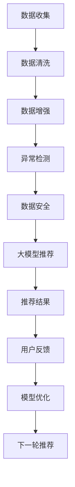

                 

# 大模型推荐中的数据质量问题与应对策略

## 1. 背景介绍

在当今数据驱动的智能推荐系统中，大模型已经成为不可或缺的核心组件。通过在海量用户行为数据上进行预训练，大模型可以学习到丰富的用户兴趣和行为模式，并在下游推荐任务中进行微调，生成个性化的推荐结果。然而，数据质量问题在大模型的推荐应用中显得尤为重要。低质量的数据不仅会导致推荐系统性能下降，还可能带来一系列安全和伦理风险。

## 2. 核心概念与联系

### 2.1 核心概念概述

- **大模型推荐**：利用大规模预训练语言模型，结合用户行为数据，通过微调生成个性化推荐结果的系统。
- **数据质量**：指数据在准确性、完整性、时效性、一致性、安全性和可靠性等方面的优劣程度。
- **数据清洗**：对原始数据进行去重、去噪、填充缺失值等操作，以提高数据质量。
- **数据增强**：通过数据扩充技术，增加数据的多样性和数量，提高模型的泛化能力。
- **异常检测**：识别数据中的异常值和噪声，并采取相应措施进行清洗。
- **数据安全**：保护数据隐私和安全性，防止数据泄露和滥用。

这些核心概念之间存在紧密的联系，数据质量直接影响大模型的训练和推荐效果，而数据清洗、数据增强和异常检测等技术手段可以显著提升数据质量。数据安全和隐私保护则是为了保障数据在存储、传输和使用过程中的安全性，避免数据被滥用。

### 2.2 核心概念原理和架构的 Mermaid 流程图



此图展示了数据从收集到最终推荐的流程。数据收集后，通过一系列的数据清洗、增强、检测和安全措施，确保数据质量，最后输入到大模型中进行微调，生成推荐结果，并根据用户反馈进行优化，进入下一轮推荐。

## 3. 核心算法原理 & 具体操作步骤

### 3.1 算法原理概述

大模型推荐的核心算法包括预训练、微调和推荐生成三个部分。其中，数据质量直接影响预训练和微调的效果，进而影响推荐结果的准确性和个性化程度。

- **预训练**：在大规模无标签数据上，使用自监督任务训练通用语言模型。
- **微调**：在预训练模型基础上，使用下游推荐任务的标注数据进行微调，生成个性化的推荐结果。
- **推荐生成**：根据用户的历史行为和上下文信息，生成推荐内容。

### 3.2 算法步骤详解

1. **数据收集**：
   - 收集用户行为数据，包括浏览记录、点击记录、购买记录等。
   - 整合多渠道数据，如网页日志、移动应用日志等。

2. **数据清洗**：
   - 去除重复和噪声数据，保留有效信息。
   - 填补缺失值，确保数据完整性。

3. **数据增强**：
   - 使用数据扩充技术，如回译、同义词替换、数据合成等，增加数据多样性。
   - 使用对抗样本训练，提升模型鲁棒性。

4. **异常检测**：
   - 使用统计方法或机器学习算法识别异常值和噪声数据。
   - 使用基于模型的检测方法，如离群点检测、时间序列异常检测等。

5. **数据安全**：
   - 使用数据加密和脱敏技术，防止数据泄露和滥用。
   - 设置数据访问权限，确保数据使用合规。

6. **微调**：
   - 选择合适的预训练模型，如BERT、GPT等。
   - 设计任务适配层，如分类头、生成器等。
   - 选择合适的优化器，如AdamW、SGD等。
   - 设置学习率、批大小、迭代轮数等超参数。

7. **推荐生成**：
   - 根据用户历史行为和上下文信息，生成推荐结果。
   - 使用模型推理接口，如PyTorch、TensorFlow等。

### 3.3 算法优缺点

**优点**：
- 可以利用大规模数据训练高性能推荐模型。
- 可以动态调整推荐内容，满足用户个性化需求。
- 可以利用预训练模型的通用知识和迁移学习能力，提升推荐效果。

**缺点**：
- 对数据质量要求高，数据质量问题直接影响推荐效果。
- 模型复杂度高，对计算资源和内存要求较高。
- 模型训练和推理速度较慢，难以实时响应用户请求。

### 3.4 算法应用领域

大模型推荐技术在多个领域得到了广泛应用，包括电商、新闻、音乐、视频等。在电商领域，大模型推荐可以为用户推荐个性化商品；在新闻领域，可以为用户推荐相关文章；在音乐和视频领域，可以为用户推荐相似内容。

## 4. 数学模型和公式 & 详细讲解

### 4.1 数学模型构建

大模型推荐通常使用自回归模型（如GPT）或自编码模型（如BERT）进行预训练。假设预训练模型为 $M_{\theta}$，其中 $\theta$ 为模型参数。对于推荐任务 $T$，其标注数据集为 $D=\{(x_i,y_i)\}_{i=1}^N$，其中 $x_i$ 为用户行为数据，$y_i$ 为推荐结果。推荐模型的目标是最小化预测误差，即：

$$
\min_{\theta} \frac{1}{N} \sum_{i=1}^N \ell(M_{\theta}(x_i),y_i)
$$

其中 $\ell$ 为损失函数，如均方误差、交叉熵等。

### 4.2 公式推导过程

以均方误差为例，推荐模型的目标函数为：

$$
\min_{\theta} \frac{1}{N} \sum_{i=1}^N (y_i - M_{\theta}(x_i))^2
$$

对上式求导，得到：

$$
\frac{\partial \mathcal{L}}{\partial \theta} = - \frac{2}{N} \sum_{i=1}^N (y_i - M_{\theta}(x_i)) M_{\theta}'(x_i)
$$

其中 $M_{\theta}'(x_i)$ 为模型对 $x_i$ 的导数。通过反向传播算法，更新模型参数 $\theta$，最小化预测误差。

### 4.3 案例分析与讲解

假设有一个电商推荐系统，收集了用户浏览记录 $x$ 和购买记录 $y$。使用大模型进行推荐，其损失函数为均方误差，模型的更新规则如下：

$$
\theta \leftarrow \theta - \eta \frac{2}{N} \sum_{i=1}^N (y_i - M_{\theta}(x_i)) M_{\theta}'(x_i)
$$

其中 $\eta$ 为学习率，$N$ 为训练样本数。

## 5. 项目实践：代码实例和详细解释说明

### 5.1 开发环境搭建

1. 安装Anaconda：从官网下载并安装Anaconda，用于创建独立的Python环境。

2. 创建并激活虚拟环境：
```bash
conda create -n pytorch-env python=3.8 
conda activate pytorch-env
```

3. 安装PyTorch：根据CUDA版本，从官网获取对应的安装命令。例如：
```bash
conda install pytorch torchvision torchaudio cudatoolkit=11.1 -c pytorch -c conda-forge
```

4. 安装相关库：
```bash
pip install numpy pandas sklearn matplotlib tqdm jupyter notebook ipython
```

完成上述步骤后，即可在`pytorch-env`环境中开始推荐系统的开发。

### 5.2 源代码详细实现

```python
import torch
from torch import nn
from torch.utils.data import DataLoader
from torch.nn import CrossEntropyLoss
from torch.optim import AdamW
from transformers import BertTokenizer, BertForSequenceClassification

# 加载数据集
train_data = ...
test_data = ...

# 初始化模型
tokenizer = BertTokenizer.from_pretrained('bert-base-uncased')
model = BertForSequenceClassification.from_pretrained('bert-base-uncased', num_labels=2)

# 加载数据并进行预处理
def preprocess_data(data):
    return tokenizer(data['text'], padding='max_length', truncation=True, max_length=512)

# 定义训练函数
def train_epoch(model, data_loader, optimizer):
    model.train()
    loss = 0
    for batch in data_loader:
        input_ids = batch['input_ids'].to(device)
        attention_mask = batch['attention_mask'].to(device)
        labels = batch['labels'].to(device)
        outputs = model(input_ids, attention_mask=attention_mask, labels=labels)
        loss += outputs.loss
        optimizer.zero_grad()
        outputs.loss.backward()
        optimizer.step()
    return loss / len(data_loader)

# 定义测试函数
def evaluate(model, data_loader):
    model.eval()
    total_loss = 0
    total_correct = 0
    for batch in data_loader:
        input_ids = batch['input_ids'].to(device)
        attention_mask = batch['attention_mask'].to(device)
        labels = batch['labels'].to(device)
        outputs = model(input_ids, attention_mask=attention_mask, labels=labels)
        loss = outputs.loss
        total_loss += loss.item()
        total_correct += torch.sum(outputs.predictions.argmax(dim=1) == labels)
    return total_correct / len(data_loader)

# 启动训练流程并在测试集上评估
epochs = 5
batch_size = 16
learning_rate = 2e-5
device = torch.device('cuda') if torch.cuda.is_available() else torch.device('cpu')

model.to(device)
optimizer = AdamW(model.parameters(), lr=learning_rate)

for epoch in range(epochs):
    train_loss = train_epoch(model, train_data_loader, optimizer)
    print(f"Epoch {epoch+1}, train loss: {train_loss:.3f}")

    test_accuracy = evaluate(model, test_data_loader)
    print(f"Epoch {epoch+1}, test accuracy: {test_accuracy:.3f}")

print("Test results:")
evaluate(model, test_data_loader)
```

### 5.3 代码解读与分析

**数据预处理**：
- `preprocess_data`函数使用BertTokenizer对文本数据进行分词和编码，并添加掩码和padding，确保输入数据符合模型要求。

**模型初始化**：
- 使用BertForSequenceClassification模型作为推荐模型，并设置标签数量为2（即二分类任务）。

**训练和测试函数**：
- `train_epoch`函数定义了模型在训练集上的训练过程，包括前向传播、损失计算、反向传播和参数更新。
- `evaluate`函数定义了模型在测试集上的评估过程，计算准确率等指标。

**训练和测试流程**：
- 定义总的epoch数、batch size和初始学习率，启动训练循环。
- 每个epoch内，先在训练集上训练，输出平均损失。
- 在验证集上评估，输出准确率等指标。
- 所有epoch结束后，在测试集上评估，给出最终结果。

## 6. 实际应用场景

### 6.1 电商推荐

电商推荐系统可以为用户提供个性化的商品推荐，提高购物体验和转化率。通过收集用户浏览、点击、购买等行为数据，并对其进行预处理和增强，可以构建高质量的推荐模型。大模型推荐系统在电商领域已经得到了广泛应用，如亚马逊的推荐系统。

### 6.2 新闻推荐

新闻推荐系统为用户推荐相关的新闻文章，提升用户阅读体验和满意度。通过收集用户的阅读行为数据，如文章浏览时间、点赞次数等，并对其进行预处理和增强，可以构建高质量的新闻推荐系统。例如，谷歌的GNN和GraphSAGE模型，通过构建用户和文章之间的图网络，提高了新闻推荐的准确性和多样性。

### 6.3 音乐和视频推荐

音乐和视频推荐系统为用户推荐相似的音乐和视频内容，提升用户娱乐体验。通过收集用户的听歌和看视频行为数据，并对其进行预处理和增强，可以构建高质量的音乐和视频推荐系统。例如，Netflix的推荐系统，通过分析用户的历史观看记录和评分数据，生成个性化的视频推荐列表。

### 6.4 未来应用展望

随着大模型推荐技术的不断发展，其在更多领域的应用前景将更加广阔。

- **医疗领域**：通过收集患者病历数据，并构建医疗推荐系统，可以为医生推荐合适的治疗方案，提升医疗服务质量和效率。
- **教育领域**：通过收集学生的学习行为数据，并构建个性化推荐系统，可以为学生推荐合适的学习资源，提升学习效果和个性化教育水平。
- **金融领域**：通过收集用户的交易和投资行为数据，并构建金融推荐系统，可以为用户推荐合适的投资产品，提升投资收益和风险控制能力。
- **娱乐领域**：通过收集用户的娱乐行为数据，并构建个性化推荐系统，可以为用户推荐电影、游戏等娱乐内容，提升娱乐体验和满意度。

## 7. 工具和资源推荐

### 7.1 学习资源推荐

为了帮助开发者系统掌握大模型推荐技术，这里推荐一些优质的学习资源：

1. 《深度学习与推荐系统》书籍：介绍了深度学习在推荐系统中的应用，涵盖大模型推荐、协同过滤、矩阵分解等经典算法。
2. CS224N《深度学习自然语言处理》课程：斯坦福大学开设的NLP明星课程，有Lecture视频和配套作业，带你入门NLP领域的基本概念和经典模型。
3. 《Recommender Systems》书籍：介绍了推荐系统的基础理论、算法和应用，涵盖协同过滤、内容推荐、混合推荐等主流方法。
4. Kaggle推荐系统竞赛：通过参与实际竞赛，学习推荐系统开发的实践技巧和经验积累。
5. Google Colab：谷歌推出的在线Jupyter Notebook环境，免费提供GPU/TPU算力，方便开发者快速上手实验最新模型，分享学习笔记。

通过对这些资源的学习实践，相信你一定能够快速掌握大模型推荐技术的精髓，并用于解决实际的推荐问题。

### 7.2 开发工具推荐

高效的开发离不开优秀的工具支持。以下是几款用于大模型推荐开发的常用工具：

1. PyTorch：基于Python的开源深度学习框架，灵活动态的计算图，适合快速迭代研究。
2. TensorFlow：由Google主导开发的开源深度学习框架，生产部署方便，适合大规模工程应用。
3. Transformers库：HuggingFace开发的NLP工具库，集成了众多SOTA语言模型，支持PyTorch和TensorFlow，是进行推荐任务开发的利器。
4. Weights & Biases：模型训练的实验跟踪工具，可以记录和可视化模型训练过程中的各项指标，方便对比和调优。与主流深度学习框架无缝集成。
5. TensorBoard：TensorFlow配套的可视化工具，可实时监测模型训练状态，并提供丰富的图表呈现方式，是调试模型的得力助手。
6. Jupyter Notebook：轻量级开发环境，支持代码编写、数据可视化等，便于进行模型开发和调试。

合理利用这些工具，可以显著提升大模型推荐任务的开发效率，加快创新迭代的步伐。

### 7.3 相关论文推荐

大模型推荐技术的发展源于学界的持续研究。以下是几篇奠基性的相关论文，推荐阅读：

1. Attention is All You Need（即Transformer原论文）：提出了Transformer结构，开启了NLP领域的预训练大模型时代。
2. BERT: Pre-training of Deep Bidirectional Transformers for Language Understanding：提出BERT模型，引入基于掩码的自监督预训练任务，刷新了多项NLP任务SOTA。
3. DeepFM: A Factorization-Machine-Based Neural Collaborative Filtering Model：提出DeepFM模型，将深度神经网络和协同过滤相结合，提升推荐效果。
4. Matrix Factorization Techniques for Recommender Systems：介绍了矩阵分解算法在推荐系统中的应用，提供了多项SOTA算法。
5. A Survey on Recommendation Systems Based on Deep Learning：综述了深度学习在推荐系统中的应用，涵盖深度神经网络、自编码器、注意力机制等主流方法。

这些论文代表了大模型推荐技术的发展脉络。通过学习这些前沿成果，可以帮助研究者把握学科前进方向，激发更多的创新灵感。

## 8. 总结：未来发展趋势与挑战

### 8.1 研究成果总结

本文对大模型推荐技术进行了全面系统的介绍，包括以下几个方面：
- 概述了数据质量在推荐系统中的重要性。
- 详细介绍了数据清洗、增强、异常检测等关键技术。
- 讲解了预训练、微调和推荐生成等算法原理。
- 给出了代码实例和详细解释。

通过本文的系统梳理，可以看到，大模型推荐技术在大数据时代发挥着重要作用，有助于提升推荐系统性能和用户体验。但面对海量数据和高性能要求，仍需不断优化和改进，以应对数据质量问题和系统挑战。

### 8.2 未来发展趋势

展望未来，大模型推荐技术将呈现以下几个发展趋势：

1. **模型融合**：未来将更多地融合不同模态数据，如文本、图像、视频等，提升推荐系统的多模态能力和泛化性能。
2. **数据融合**：通过数据融合技术，整合多渠道数据，提升推荐系统的数据多样性和丰富性。
3. **实时推荐**：通过高效计算和存储技术，实现实时推荐，满足用户即时需求。
4. **个性化推荐**：通过深度学习和强化学习技术，提升推荐系统的个性化和精准度。
5. **隐私保护**：加强数据隐私保护和匿名化处理，确保用户数据安全。

### 8.3 面临的挑战

尽管大模型推荐技术已经取得了显著成果，但在实现推荐系统的高性能和个性化需求的过程中，仍面临诸多挑战：

1. **数据质量**：数据缺失、噪声和异常值等问题，会直接影响推荐效果。如何确保数据质量，是一个长期挑战。
2. **计算资源**：大模型推荐系统对计算资源要求高，如何提升模型训练和推理效率，是一个技术难题。
3. **隐私保护**：用户数据的隐私保护是一个重要的伦理问题，如何在推荐系统中平衡用户隐私和数据利用，是一个难题。
4. **模型解释性**：大模型推荐系统的决策过程缺乏解释性，如何赋予模型更高的透明度和可解释性，是一个亟待解决的问题。

### 8.4 研究展望

面对大模型推荐技术面临的挑战，未来的研究需要在以下几个方面寻求新的突破：

1. **数据增强与生成**：开发更多高效的数据增强和生成技术，提升数据质量和多样性。
2. **高效计算与存储**：探索更高效的计算图优化和模型压缩方法，提升推荐系统的计算效率。
3. **隐私保护与匿名化**：加强隐私保护技术研究，确保用户数据安全。
4. **模型解释性与透明性**：研究模型可解释性算法，提升推荐系统的透明性和可解释性。
5. **跨模态融合**：探索跨模态融合技术，提升推荐系统的多模态能力和泛化性能。
6. **实时推荐**：研究实时推荐算法，提升推荐系统的响应速度和实时性。

通过这些研究方向的探索，相信大模型推荐技术将不断优化和进步，为推荐系统的发展提供新的动力。

## 9. 附录：常见问题与解答

**Q1：如何处理缺失数据？**

A: 对于缺失数据，常见的处理方式包括插值法、均值填补法、删除法等。插值法通过已知数据点来推测缺失数据，均值填补法用缺失数据的均值来填补，删除法则直接删除缺失数据。

**Q2：如何进行数据增强？**

A: 数据增强可以通过以下方式实现：
- 回译：将数据从一种语言回译成另一种语言，增加数据多样性。
- 同义词替换：将数据中的单词替换为其同义词，增加数据丰富度。
- 数据合成：通过生成对抗网络等技术，生成新的数据样本，增加数据多样性。

**Q3：如何进行异常检测？**

A: 异常检测可以通过以下方式实现：
- 统计方法：计算数据的均值和标准差，通过统计量识别异常值。
- 机器学习：使用离群点检测算法，如孤立森林、局部离群因子等，识别异常数据。
- 基于模型的检测：使用异常检测模型，如一阶差分、时间序列等，识别异常值。

**Q4：如何进行数据安全保护？**

A: 数据安全保护可以通过以下方式实现：
- 数据加密：使用加密算法对数据进行加密，保护数据隐私。
- 数据脱敏：对数据中的敏感信息进行脱敏处理，防止数据泄露。
- 访问控制：设置数据访问权限，确保数据仅被授权人员访问。

**Q5：如何进行模型优化？**

A: 模型优化可以通过以下方式实现：
- 数据预处理：进行数据清洗、归一化和标准化处理，提升数据质量。
- 模型压缩：使用剪枝、量化等方法，减少模型参数和内存占用。
- 模型融合：将多个模型进行融合，提升推荐效果和鲁棒性。

通过这些方法，可以显著提升大模型推荐系统的性能和用户体验。

---

作者：禅与计算机程序设计艺术 / Zen and the Art of Computer Programming

