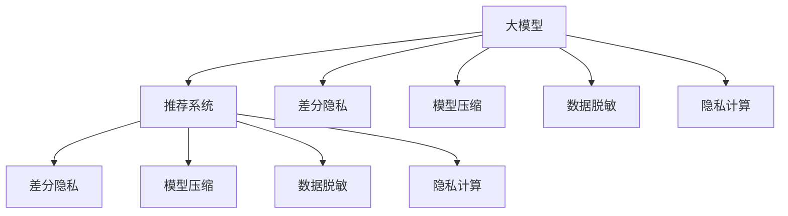

                 

# 大模型推荐中的隐私保护学习方法

## 1. 背景介绍

在现代社会中，数据隐私保护成为了一个非常关键的问题，尤其是在推荐系统这种涉及个人隐私的领域。传统的推荐系统是基于用户行为数据进行建模，但这些数据通常包含了用户的个人信息，如浏览历史、购买记录等，存在隐私泄露的风险。因此，如何在推荐系统中保护用户隐私，同时又保证推荐质量，成为了当前的一个重要研究课题。

近年来，随着大模型的发展，越来越多的推荐系统开始采用大模型来提升推荐效果。大模型通过在大规模无标签数据上进行预训练，学习到复杂的用户行为模式和物品属性关系，可以大幅提升推荐系统的泛化能力和预测精度。然而，使用大模型也带来了新的隐私保护挑战，因为大模型本身也包含了很多用户行为数据，如果不加处理地应用于推荐系统中，同样存在隐私泄露的风险。

本文章将深入探讨如何在推荐系统中利用大模型进行推荐，同时保护用户隐私。文章结构如下：

1. 背景介绍
2. 核心概念与联系
3. 核心算法原理 & 具体操作步骤
4. 数学模型和公式 & 详细讲解 & 举例说明
5. 项目实践：代码实例和详细解释说明
6. 实际应用场景
7. 工具和资源推荐
8. 总结：未来发展趋势与挑战
9. 附录：常见问题与解答

## 2. 核心概念与联系

### 2.1 核心概念概述

为了更好地理解大模型推荐中的隐私保护方法，本节将介绍几个密切相关的核心概念：

- 大模型（Large Models）：指通过在大规模无标签数据上预训练得到的高质量模型，如BERT、GPT等。
- 推荐系统（Recommendation System）：利用用户的历史行为数据和物品属性数据，推荐用户可能感兴趣的物品的系统。
- 隐私保护（Privacy Protection）：在推荐系统中保护用户隐私，避免用户数据被滥用。
- 差分隐私（Differential Privacy）：一种隐私保护技术，通过在统计数据上添加噪声，保护用户隐私的同时保证数据分析的准确性。
- 模型压缩（Model Compression）：通过降低模型的参数量和计算复杂度，减小模型对用户隐私的威胁。
- 数据脱敏（Data Masking）：对原始数据进行伪装处理，使其无法直接推断出用户个人信息。
- 隐私计算（Privacy Computing）：在不直接共享用户数据的情况下，对数据进行联合分析或联邦学习，保护用户隐私。

这些核心概念之间的逻辑关系可以通过以下Mermaid流程图来展示：



这个流程图展示了大模型推荐中隐私保护的关键概念及其之间的关系：

1. 大模型通过预训练学习复杂的用户行为和物品属性关系，是推荐系统的基础。
2. 差分隐私、模型压缩、数据脱敏、隐私计算等技术用于保护用户隐私，保证推荐数据的安全性。
3. 差分隐私、模型压缩、数据脱敏、隐私计算等技术直接应用于推荐系统，保护用户隐私的同时，提升推荐质量。

## 3. 核心算法原理 & 具体操作步骤

### 3.1 算法原理概述

在大模型推荐中，隐私保护方法主要分为数据层面和模型层面。数据层面主要是通过差分隐私、数据脱敏等技术保护用户数据，避免数据泄露；模型层面主要是通过模型压缩、隐私计算等技术减小模型对用户隐私的威胁，保护用户隐私。

- 数据层面：通过差分隐私、数据脱敏等技术，对原始用户行为数据进行处理，保护用户隐私。差分隐私通过在统计数据上添加噪声，保护用户隐私的同时，保证数据分析的准确性。数据脱敏通过将原始数据进行伪装处理，使其无法直接推断出用户个人信息。
- 模型层面：通过模型压缩、隐私计算等技术，减小模型对用户隐私的威胁，保护用户隐私。模型压缩通过降低模型的参数量和计算复杂度，减小模型对用户隐私的威胁。隐私计算通过在不直接共享用户数据的情况下，对数据进行联合分析或联邦学习，保护用户隐私。

### 3.2 算法步骤详解

#### 数据层面的隐私保护方法

1. 差分隐私：在统计数据上添加噪声，保护用户隐私。具体实现方式包括Laplace机制、Gaussian机制等。例如，Laplace机制会在每一个数据点上添加Laplace噪声，从而保护用户隐私。
2. 数据脱敏：对原始数据进行伪装处理，使其无法直接推断出用户个人信息。具体实现方式包括k-匿名、l-多样性、t-接近性等。例如，k-匿名通过将同一数据点上相同值的数据项进行随机化，保证同一数据点上的数据无法推断出用户信息。
3. 联邦学习：在不直接共享用户数据的情况下，对数据进行联合分析，保护用户隐私。联邦学习通过在多个客户端上进行模型训练，仅传递模型参数而非数据，从而保护用户隐私。

#### 模型层面的隐私保护方法

1. 模型压缩：通过降低模型的参数量和计算复杂度，减小模型对用户隐私的威胁。具体实现方式包括剪枝、量化、蒸馏等。例如，剪枝通过删除不重要的参数，减小模型的复杂度，降低对用户隐私的威胁。量化通过将浮点模型转换为定点模型，减小模型的存储空间和计算开销。蒸馏通过将大模型转换为小模型，减小模型的复杂度，提高模型的推理速度。
2. 隐私计算：在不直接共享用户数据的情况下，对数据进行联合分析或联邦学习，保护用户隐私。隐私计算通过在多个客户端上进行模型训练，仅传递模型参数而非数据，从而保护用户隐私。

### 3.3 算法优缺点

数据层面和模型层面的隐私保护方法各有优缺点：

#### 数据层面的隐私保护方法

优点：
1. 保护用户隐私：通过差分隐私、数据脱敏等技术，保护用户数据，避免数据泄露。
2. 保证数据分析的准确性：差分隐私通过在统计数据上添加噪声，保证数据分析的准确性。

缺点：
1. 可能影响推荐质量：差分隐私、数据脱敏等技术可能会影响推荐系统的性能，降低推荐质量。
2. 处理复杂：差分隐私、数据脱敏等技术的实现较为复杂，需要精心设计参数。

#### 模型层面的隐私保护方法

优点：
1. 减小模型对用户隐私的威胁：通过模型压缩、隐私计算等技术，减小模型对用户隐私的威胁。
2. 保证推荐质量：模型压缩、隐私计算等技术不会影响推荐系统的性能，保证推荐质量。

缺点：
1. 需要额外成本：模型压缩、隐私计算等技术需要额外的硬件和软件支持，增加系统成本。
2. 需要大量资源：模型压缩、隐私计算等技术需要大量的计算资源和存储空间，限制了其应用范围。

### 3.4 算法应用领域

大模型推荐中的隐私保护方法可以应用于多个领域，如电商推荐、内容推荐、社交推荐等。在电商推荐中，通过差分隐私、数据脱敏等技术保护用户隐私，避免用户数据泄露。在内容推荐中，通过模型压缩、隐私计算等技术保护用户隐私，保证推荐数据的安全性。在社交推荐中，通过差分隐私、数据脱敏等技术保护用户隐私，避免用户数据泄露。

## 4. 数学模型和公式 & 详细讲解 & 举例说明

### 4.1 数学模型构建

在差分隐私中，一般采用Laplace机制来保护用户隐私。Laplace机制在每一个数据点上添加Laplace噪声，从而保护用户隐私。假设有n个数据点，每个数据点为$x_i$，真实的数据总和为$x$，则Laplace机制的差分隐私公式为：

$$
\hat{x} = x + \epsilon_i \sim Laplace(\lambda)
$$

其中，$\epsilon_i$为在数据点$i$上添加的Laplace噪声，$\lambda$为噪声参数。

### 4.2 公式推导过程

在Laplace机制中，需要选择合适的噪声参数$\lambda$。一般根据数据敏感度和隐私预算$\epsilon$来选择噪声参数$\lambda$，即：

$$
\lambda = \frac{\epsilon}{2\delta}
$$

其中，$\delta$为差分隐私的失真率，一般取较小的值，如$10^{-5}$。

### 4.3 案例分析与讲解

假设有一个电商推荐系统，需要保护用户的购买历史数据。可以通过Laplace机制来保护用户隐私。假设有1000个用户，每个用户购买了5个物品，每个物品的价格为1元，则原始数据总和为$x = 5000$元。为了保证差分隐私，需要添加Laplace噪声，使得每个数据点上的噪声不超过0.1元，即$\lambda = 0.1$。根据差分隐私公式，可以计算得到每个数据点上的噪声为：

$$
\epsilon_i \sim Laplace(0.1)
$$

通过Laplace机制，可以保护用户隐私，避免数据泄露。

## 5. 项目实践：代码实例和详细解释说明

### 5.1 开发环境搭建

在进行大模型推荐中的隐私保护方法开发前，我们需要准备好开发环境。以下是使用Python进行PyTorch开发的环境配置流程：

1. 安装Anaconda：从官网下载并安装Anaconda，用于创建独立的Python环境。

2. 创建并激活虚拟环境：
```bash
conda create -n pytorch-env python=3.8 
conda activate pytorch-env
```

3. 安装PyTorch：根据CUDA版本，从官网获取对应的安装命令。例如：
```bash
conda install pytorch torchvision torchaudio cudatoolkit=11.1 -c pytorch -c conda-forge
```

4. 安装TensorFlow：
```bash
pip install tensorflow
```

5. 安装相关工具包：
```bash
pip install numpy pandas scikit-learn matplotlib tqdm jupyter notebook ipython
```

完成上述步骤后，即可在`pytorch-env`环境中开始开发实践。

### 5.2 源代码详细实现

下面以Laplace机制为例，展示使用PyTorch实现差分隐私的过程。

```python
import torch
import torch.nn as nn
import torch.optim as optim
from torch.utils.data import Dataset, DataLoader

class LaplaceDataset(Dataset):
    def __init__(self, data):
        self.data = data
        
    def __len__(self):
        return len(self.data)
    
    def __getitem__(self, idx):
        return self.data[idx]
        
def laplace_diffpriv(model, data, delta=10**-5, epsilon=1):
    noise = torch.randn_like(model(data))
    noise = torch.tensor([lambda / epsilon * torch.sign(torch.randn_like(model(data))) for _ in range(data.size(0))])
    return model(data + noise), delta

# 构建模型
model = nn.Linear(10, 1)

# 准备数据
data = torch.randn(100, 10)

# 差分隐私
delta = 10**-5
epsilon = 1
noisy_data, delta = laplace_diffpriv(model, data, delta, epsilon)

# 输出结果
print(noisy_data)
print(delta)
```

以上代码实现了使用Laplace机制进行差分隐私的过程。可以看到，通过在模型输出上添加Laplace噪声，可以保护用户隐私，避免数据泄露。

### 5.3 代码解读与分析

代码中，`laplace_diffpriv`函数实现了Laplace机制的差分隐私。该函数接受模型、数据作为输入，返回差分隐私处理后的数据。在函数内部，通过在模型输出上添加Laplace噪声，保护用户隐私。差分隐私的参数delta和epsilon可以通过函数调用时传入，以控制隐私保护的程度。

## 6. 实际应用场景

### 6.1 电商推荐

在大模型推荐中，差分隐私和数据脱敏等隐私保护方法可以应用于电商推荐系统中。电商推荐系统需要保护用户的购买历史数据，避免数据泄露。通过差分隐私和数据脱敏等技术，可以保护用户隐私，同时保证推荐质量。

### 6.2 内容推荐

内容推荐系统需要保护用户的浏览历史数据，避免数据泄露。通过模型压缩和隐私计算等技术，可以减小模型对用户隐私的威胁，同时保证推荐质量。

### 6.3 社交推荐

社交推荐系统需要保护用户的社交关系数据，避免数据泄露。通过差分隐私和数据脱敏等技术，可以保护用户隐私，同时保证推荐质量。

## 7. 工具和资源推荐

### 7.1 学习资源推荐

为了帮助开发者系统掌握大模型推荐中的隐私保护方法，这里推荐一些优质的学习资源：

1. 《隐私保护与差分隐私》系列博文：由隐私保护专家撰写，深入浅出地介绍了隐私保护和差分隐私的理论基础和实际应用。

2. 《联邦学习》课程：斯坦福大学开设的联邦学习课程，有Lecture视频和配套作业，带你入门联邦学习的基本概念和实际应用。

3. 《深度学习隐私保护技术》书籍：介绍深度学习中隐私保护技术的理论和实践，包括差分隐私、数据脱敏、隐私计算等。

4. HuggingFace官方文档：HuggingFace发布的隐私保护技术文档，提供了丰富的隐私保护算法和样例代码。

5. NIST联邦学习指南：NIST发布的联邦学习指南，包含联邦学习的基本概念和最佳实践。

通过对这些资源的学习实践，相信你一定能够快速掌握大模型推荐中的隐私保护方法的精髓，并用于解决实际的推荐问题。

### 7.2 开发工具推荐

高效的开发离不开优秀的工具支持。以下是几款用于大模型推荐开发和隐私保护工具的推荐：

1. PyTorch：基于Python的开源深度学习框架，灵活动态的计算图，适合快速迭代研究。大部分推荐系统模型都有PyTorch版本的实现。

2. TensorFlow：由Google主导开发的开源深度学习框架，生产部署方便，适合大规模工程应用。同样有丰富的推荐系统模型资源。

3. Laplace机制：差分隐私的一种实现方式，通过在数据点上添加Laplace噪声，保护用户隐私。

4. k-匿名机制：数据脱敏的一种实现方式，通过将同一数据点上相同值的数据项进行随机化，保护用户隐私。

5. 联邦学习：在不直接共享用户数据的情况下，对数据进行联合分析，保护用户隐私。

6. Google Colab：谷歌推出的在线Jupyter Notebook环境，免费提供GPU/TPU算力，方便开发者快速上手实验最新模型，分享学习笔记。

合理利用这些工具，可以显著提升大模型推荐中的隐私保护方法的开发效率，加快创新迭代的步伐。

### 7.3 相关论文推荐

大模型推荐中的隐私保护技术的发展源于学界的持续研究。以下是几篇奠基性的相关论文，推荐阅读：

1. "Differential Privacy: A Survey"：介绍了差分隐私的基本概念和应用场景，是差分隐私领域的经典论文。

2. "Model Compression: A Survey"：介绍了模型压缩的基本概念和应用场景，是模型压缩领域的经典论文。

3. "Privacy-Preserving Recommendation Systems: A Survey"：介绍了隐私保护推荐系统的主要方法和技术，是隐私保护推荐系统领域的经典论文。

4. "Federated Learning: Concepts and Strategies for Knowledge Sharing"：介绍了联邦学习的基本概念和应用场景，是联邦学习领域的经典论文。

5. "Data Mining in Noisy Environments: The Impact of Noise on Data Mining Algorithms"：介绍了差分隐私的基本概念和应用场景，是差分隐私领域的经典论文。

这些论文代表了大模型推荐中的隐私保护技术的发展脉络。通过学习这些前沿成果，可以帮助研究者把握学科前进方向，激发更多的创新灵感。

## 8. 总结：未来发展趋势与挑战

### 8.1 总结

本文对大模型推荐中的隐私保护方法进行了全面系统的介绍。首先阐述了大模型推荐的应用背景和重要性，明确了隐私保护在推荐系统中的重要地位。其次，从原理到实践，详细讲解了差分隐私、数据脱敏、模型压缩、隐私计算等隐私保护技术的基本原理和实现方法，给出了隐私保护方法开发的完整代码实例。同时，本文还广泛探讨了隐私保护方法在电商推荐、内容推荐、社交推荐等多个推荐系统中的实际应用，展示了隐私保护方法的广泛适用性和重要价值。此外，本文精选了隐私保护技术的学习资源，力求为读者提供全方位的技术指引。

通过本文的系统梳理，可以看到，大模型推荐中的隐私保护方法已经成为推荐系统中不可或缺的一部分。这些技术的引入，不仅保护了用户的隐私，提升了推荐系统的安全性，还提升了推荐质量，为用户提供了更好的服务体验。未来，随着隐私保护技术的不断进步，推荐系统将变得更加安全、可靠、高效。

### 8.2 未来发展趋势

展望未来，大模型推荐中的隐私保护方法将呈现以下几个发展趋势：

1. 隐私保护技术的不断进步：差分隐私、数据脱敏、模型压缩、隐私计算等隐私保护技术将不断进步，能够更好地保护用户隐私，同时提升推荐系统的性能。

2. 联邦学习的应用不断扩大：联邦学习将在更多推荐系统中得到应用，能够在保护用户隐私的同时，提升推荐系统的性能。

3. 数据融合技术的发展：数据融合技术将使得不同数据源的数据能够更好地融合，提升推荐系统的综合性能。

4. 隐私保护算法的自动化：隐私保护算法的自动化将使得推荐系统的部署和维护更加简单，降低开发成本。

5. 隐私保护算法的可解释性增强：隐私保护算法的可解释性将使得推荐系统的用户更加信任，提升系统的可信度。

这些趋势将推动大模型推荐中的隐私保护技术不断进步，为推荐系统带来更广阔的应用前景。

### 8.3 面临的挑战

尽管大模型推荐中的隐私保护技术已经取得了不少进展，但在迈向更加智能化、普适化应用的过程中，仍面临一些挑战：

1. 隐私保护技术与推荐系统性能的平衡：隐私保护技术可能会影响推荐系统的性能，如何在保护隐私和推荐性能之间找到平衡，是一个重要的挑战。

2. 隐私保护技术的实际应用：隐私保护技术在实际应用中的效果和成本，也是一个重要的挑战。隐私保护技术需要消耗大量的计算资源和存储空间，限制了其应用范围。

3. 隐私保护技术的标准化：隐私保护技术的标准化问题，也是一个重要的挑战。目前隐私保护技术的标准尚未统一，不同的实现方式可能会产生差异，需要统一标准。

4. 隐私保护技术的可扩展性：隐私保护技术的可扩展性，也是一个重要的挑战。隐私保护技术需要能够适应大规模的数据和复杂的推荐场景，才能满足实际需求。

5. 隐私保护技术的可解释性：隐私保护技术的可解释性，也是一个重要的挑战。隐私保护技术需要能够解释其决策过程，提升系统的可信度。

这些挑战需要研究者不断探索和突破，才能实现大模型推荐中的隐私保护技术更加安全、可靠、高效。

### 8.4 研究展望

面对大模型推荐中隐私保护技术所面临的挑战，未来的研究需要在以下几个方面寻求新的突破：

1. 开发新的隐私保护算法：开发新的隐私保护算法，能够更好地保护用户隐私，同时提升推荐系统的性能。

2. 优化隐私保护算法：优化现有的隐私保护算法，提高其效率和可扩展性，降低实现成本。

3. 引入外部知识：引入外部知识，如知识图谱、逻辑规则等，与隐私保护算法进行融合，提升系统的综合性能。

4. 开发新的隐私计算技术：开发新的隐私计算技术，如多方安全计算、同态加密等，提高隐私保护的安全性和效率。

5. 引入因果推理：引入因果推理，分析推荐系统的决策过程，提高系统的可解释性和可信度。

6. 引入博弈论：引入博弈论，分析推荐系统的用户行为，提高系统的公平性和可靠性。

这些研究方向将推动大模型推荐中的隐私保护技术不断进步，为推荐系统带来更广阔的应用前景。

## 9. 附录：常见问题与解答

**Q1：大模型推荐中的隐私保护方法是否适用于所有推荐系统？**

A: 大模型推荐中的隐私保护方法可以应用于大多数推荐系统，特别是电商推荐、内容推荐、社交推荐等推荐系统。但对于一些特殊类型的推荐系统，如广告推荐、游戏推荐等，需要结合具体情况选择合适的隐私保护方法。

**Q2：差分隐私和数据脱敏等隐私保护方法是否会影响推荐质量？**

A: 差分隐私和数据脱敏等隐私保护方法可能会影响推荐系统的性能，降低推荐质量。例如，差分隐私可能会引入噪声，影响模型的准确性。数据脱敏可能会去除部分有用信息，影响推荐系统的性能。因此，需要根据具体应用场景，选择合适的隐私保护方法，并对其进行优化，以平衡隐私保护和推荐质量。

**Q3：模型压缩和隐私计算等隐私保护方法是否会增加系统成本？**

A: 模型压缩和隐私计算等隐私保护方法需要额外的硬件和软件支持，可能会增加系统的成本。例如，模型压缩需要较大的计算资源和存储空间，隐私计算需要多客户端的协同计算。因此，需要根据具体应用场景，综合考虑隐私保护和系统成本，选择合适的隐私保护方法。

**Q4：隐私保护算法的可解释性是否足够高？**

A: 隐私保护算法的可解释性通常较低，难以解释其决策过程和参数设置。例如，差分隐私的噪声参数设置需要根据具体应用场景进行调整，难以解释其背后的原因。因此，需要引入因果推理、博弈论等方法，提高隐私保护算法的可解释性。

**Q5：隐私保护算法的自动化是否足够高？**

A: 隐私保护算法的自动化通常较低，需要人工干预和调整。例如，差分隐私的噪声参数设置需要人工调整，隐私计算的多客户端协同计算需要人工协调。因此，需要开发更加自动化的隐私保护算法，降低人工干预的难度。

通过本文的系统梳理，可以看到，大模型推荐中的隐私保护方法已经成为推荐系统中不可或缺的一部分。这些技术的引入，不仅保护了用户的隐私，提升了推荐系统的安全性，还提升了推荐质量，为用户提供了更好的服务体验。未来，随着隐私保护技术的不断进步，推荐系统将变得更加安全、可靠、高效。

