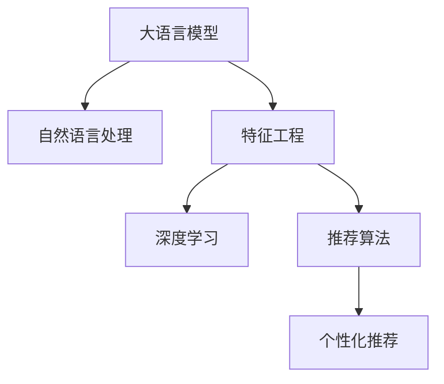

                 

# 大模型推荐场景中的特征工程优化新思路

> 关键词：推荐系统,大语言模型,特征工程,自然语言处理(NLP),深度学习,推荐算法,个性化推荐

## 1. 背景介绍

### 1.1 问题由来

随着电子商务和信息技术的不断发展，推荐系统已经成为了各大互联网公司争相部署的重要工具。在电商平台上，推荐系统通过分析用户的历史行为数据，推荐用户可能感兴趣的商品，提升用户体验和转化率。在内容平台上，推荐系统则能根据用户阅读喜好，精准推荐文章、视频等多样化内容，增加用户黏性。

然而，推荐系统的核心在于对用户兴趣的精准预测，而预测的精度直接取决于数据质量和特征表达的优劣。因此，在推荐场景中，特征工程成为不可或缺的重要环节。优秀的特征工程能够将原始数据转化为有价值的信息，帮助推荐系统更好地捕捉用户兴趣，提升推荐效果。

### 1.2 问题核心关键点

目前，在大模型推荐系统中，常用的特征工程方法包括特征提取、特征选择、特征转换等。这些方法通过统计、分类、降维等手段，对原始数据进行处理，最终生成用于推荐模型的特征集。然而，随着推荐系统的不断发展，数据复杂性和模型规模的不断扩大，传统的特征工程方法面临诸多挑战：

1. **高维稀疏性**：现代推荐系统往往需要处理的海量数据通常包含高维稀疏的特征，传统特征工程技术难以有效处理这些稀疏数据。

2. **用户意图复杂性**：用户兴趣和行为受多种因素影响，传统的特征工程难以捕捉用户深层次的意图。

3. **高维度数据集成**：推荐系统往往需要集成多维数据源，如商品属性、用户行为、社交关系等，如何高效地整合这些数据成为一大难题。

4. **用户冷启动问题**：新用户或新商品在数据集中缺乏足够的历史信息，传统特征工程难以构建有效的特征表示。

为解决这些问题，本文提出了一种基于大语言模型的特征工程优化新思路，即利用大语言模型在自然语言处理(NLP)领域的技术优势，通过自然语言表示学习对推荐系统特征工程进行优化。

## 2. 核心概念与联系

### 2.1 核心概念概述

为更好地理解基于大语言模型的推荐系统特征工程优化方法，本节将介绍几个密切相关的核心概念：

- **大语言模型(Large Language Model, LLM)**：以自回归(如GPT)或自编码(如BERT)模型为代表的大规模预训练语言模型。通过在大规模无标签文本语料上进行预训练，学习通用的语言表示，具备强大的语言理解和生成能力。

- **自然语言处理(Natural Language Processing, NLP)**：利用计算机技术处理、分析、理解和生成人类语言的技术，是推荐系统特征工程的重要工具。

- **特征工程(Feature Engineering)**：数据预处理的重要环节，通过选择、提取、构造和转换等手段，从原始数据中提取有用的特征，提升机器学习模型的性能。

- **深度学习(Deep Learning)**：基于神经网络的机器学习范式，擅长处理复杂、高维的数据，是目前推荐系统中常用的模型技术。

- **推荐算法(Recommendation Algorithms)**：用于预测用户兴趣和行为，并提供个性化推荐结果的算法，如协同过滤、内容过滤、混合推荐等。

- **个性化推荐(Personalized Recommendation)**：根据用户个性化需求，精准推荐用户感兴趣的商品或内容，提升用户体验和满意度。

这些核心概念之间的逻辑关系可以通过以下Mermaid流程图来展示：



这个流程图展示了大语言模型与推荐系统核心组件之间的联系：

1. 大语言模型通过NLP技术学习语言表示，为特征工程提供高质量的特征。
2. 特征工程对原始数据进行提取和转换，生成可用于深度学习模型的特征集。
3. 深度学习模型利用高维特征进行训练，提升预测准确性。
4. 推荐算法基于预测结果，生成个性化推荐结果。

## 3. 核心算法原理 & 具体操作步骤
### 3.1 算法原理概述

基于大语言模型的推荐系统特征工程优化方法，其核心思想是利用大语言模型的自然语言表示学习能力，生成高质量的特征表示，从而提升推荐模型的性能。该方法通过在大模型上进行自然语言表示学习，对用户、商品、行为等高维稀疏数据进行编码，生成稠密的、高维的特征向量。

形式化地，假设用户兴趣表示为 $U$，商品属性表示为 $I$，用户行为表示为 $B$。我们可以使用大语言模型 $M_{\theta}$ 将 $U$、$I$ 和 $B$ 分别编码为嵌入向量 $E_U$、$E_I$ 和 $E_B$，再通过计算这些向量的相似度或相关性，生成推荐模型的特征。

具体地，设 $\theta$ 为模型参数，则特征计算公式为：

$$
F(U, I, B) = E_U(U) \odot E_I(I) + E_B(B)
$$

其中 $\odot$ 为点乘运算，表示用户兴趣、商品属性和用户行为的组合特征。通过在大语言模型上进行训练，生成的嵌入向量 $E_U$、$E_I$ 和 $E_B$ 能够更好地捕捉数据中的语义信息，提升推荐模型的表现。

### 3.2 算法步骤详解

基于大语言模型的推荐系统特征工程优化方法，主要包括以下几个关键步骤：

**Step 1: 准备数据集**
- 收集用户、商品、行为等高维稀疏数据，并将其作为训练集。
- 清洗数据，去除噪声和异常值，保证数据质量。

**Step 2: 选择大语言模型**
- 选择适合进行自然语言表示学习的大模型，如BERT、GPT等。
- 根据数据集的规模和特性，选择模型预训练的方式，如掩码语言模型、掩码文本生成等。

**Step 3: 训练大语言模型**
- 使用选定的语言模型，在大规模无标签文本语料上进行预训练。
- 在预训练过程中，可以通过调整训练目标函数、优化器参数、训练轮数等超参数，优化模型性能。

**Step 4: 特征提取与转换**
- 将用户兴趣、商品属性和行为数据输入大语言模型，生成对应的嵌入向量。
- 通过计算向量之间的相似度或相关性，生成推荐模型的特征。

**Step 5: 训练推荐模型**
- 使用生成的特征，训练推荐算法模型。
- 评估模型的性能，调整特征计算方式和模型参数，优化推荐结果。

### 3.3 算法优缺点

基于大语言模型的推荐系统特征工程优化方法，具有以下优点：

1. **高维稀疏数据处理能力强**：通过自然语言表示学习，能够高效处理高维稀疏数据，避免传统特征工程方法对高维数据的处理瓶颈。

2. **用户意图表达更精准**：利用自然语言表示学习，能够更好地捕捉用户深层次的意图和行为特征，提升推荐精度。

3. **用户冷启动问题解决**：通过学习自然语言表示，能够在冷启动用户或商品时，快速生成有效的特征表示，缩短推荐模型的收敛时间。

4. **动态特征更新**：随着用户行为的变化，自然语言表示模型能够实时更新特征表示，提升推荐模型的适应性。

然而，该方法也存在一些局限性：

1. **计算成本高**：大语言模型的训练和特征提取需要消耗大量的计算资源，对硬件环境要求较高。

2. **数据隐私风险**：用户行为数据涉及隐私信息，自然语言表示学习需要处理敏感信息，可能带来数据隐私风险。

3. **模型解释性差**：自然语言表示学习生成的特征缺乏可解释性，难以理解特征的来源和作用机制。

4. **数据分布变化敏感**：自然语言表示学习依赖于数据分布的稳定，对于数据分布的变化，模型性能可能受到影响。

### 3.4 算法应用领域

基于大语言模型的推荐系统特征工程优化方法，已经在电商、内容推荐、广告推荐等多个领域得到应用，取得了显著的效果。

- **电商推荐**：通过自然语言表示学习，电商推荐系统能够更好地理解用户描述、商品标题等文本信息，生成精准的推荐结果。

- **内容推荐**：利用自然语言表示学习，内容推荐系统能够捕捉文章标题、摘要、作者等文本特征，提升推荐结果的相关性。

- **广告推荐**：通过自然语言表示学习，广告推荐系统能够更好地理解广告文案、关键词等文本信息，生成高质量的广告推荐。

## 4. 数学模型和公式 & 详细讲解 & 举例说明

### 4.1 数学模型构建

本节将使用数学语言对基于大语言模型的推荐系统特征工程优化方法进行更加严格的刻画。

设用户兴趣表示为 $U=\{u_1,u_2,\ldots,u_n\}$，商品属性表示为 $I=\{i_1,i_2,\ldots,i_m\}$，用户行为表示为 $B=\{b_1,b_2,\ldots,b_k\}$。定义大语言模型的嵌入函数为 $E_{\theta}$，则用户兴趣的嵌入向量为 $E_U=E_{\theta}(U)$，商品属性的嵌入向量为 $E_I=E_{\theta}(I)$，用户行为的嵌入向量为 $E_B=E_{\theta}(B)$。

假设推荐模型的特征计算方式为点乘，则特征计算公式为：

$$
F(U, I, B) = \sum_{u \in U} E_U(u) \cdot \sum_{i \in I} E_I(i) + \sum_{b \in B} E_B(b)
$$

其中 $\cdot$ 表示点乘运算。通过计算用户兴趣、商品属性和用户行为的组合特征，生成推荐系统的输入。

### 4.2 公式推导过程

以下我们以电商推荐系统为例，推导基于大语言模型的特征计算公式及其梯度计算方法。

假设用户 $u$ 对商品 $i$ 产生了购买行为 $b$，则电商推荐系统需要根据用户兴趣 $U$、商品属性 $I$ 和用户行为 $B$ 进行推荐。根据自然语言表示学习的思路，设用户兴趣的嵌入向量为 $E_U(u)$，商品属性的嵌入向量为 $E_I(i)$，用户行为的嵌入向量为 $E_B(b)$。则电商推荐系统的特征计算公式为：

$$
F(U, I, B) = E_U(u) \cdot E_I(i) + E_B(b)
$$

定义电商推荐系统的损失函数为 $\ell(F(U, I, B), y)$，其中 $y$ 为真实标签（1表示推荐，0表示不推荐）。假设用户 $u$ 对商品 $i$ 进行了购买行为，则 $y=1$，否则 $y=0$。

电商推荐系统的目标是最小化损失函数，即：

$$
\mathcal{L}(F(U, I, B)) = \frac{1}{N}\sum_{(u,i,b)\in D} \ell(F(U, I, B), y)
$$

其中 $N$ 为训练样本数，$D$ 为电商推荐系统的训练数据集。

根据梯度下降优化算法，电商推荐系统的优化目标为：

$$
\min_{F(U, I, B)} \mathcal{L}(F(U, I, B))
$$

定义特征计算函数 $F_{\theta}(U, I, B) = E_{\theta}(U) \cdot E_{\theta}(I) + E_{\theta}(B)$，则电商推荐系统的目标可转化为：

$$
\min_{\theta} \mathcal{L}(F_{\theta}(U, I, B))
$$

通过链式法则，损失函数对模型参数 $\theta$ 的梯度为：

$$
\nabla_{\theta}\mathcal{L}(F_{\theta}(U, I, B)) = \frac{\partial \mathcal{L}(F_{\theta}(U, I, B))}{\partial \theta}
$$

通过计算，最终得到电商推荐系统的梯度更新公式为：

$$
\theta \leftarrow \theta - \eta \nabla_{\theta}\mathcal{L}(F_{\theta}(U, I, B))
$$

其中 $\eta$ 为学习率。

### 4.3 案例分析与讲解

假设有一个电商推荐系统，需要根据用户的历史行为数据和商品属性数据生成推荐结果。该系统的数据集包含用户兴趣、商品属性和用户行为三个维度，共计1000个用户、5000个商品和100个行为。对于每个用户，商品属性和行为数据都是高维稀疏的。

首先，通过自然语言表示学习，对用户兴趣、商品属性和用户行为数据进行嵌入，生成高维稠密的特征向量。例如，对于用户 $u$，商品 $i$，行为 $b$，假设语言模型生成了 $E_U(u)$、$E_I(i)$ 和 $E_B(b)$，则特征计算公式为：

$$
F(U, I, B) = E_U(u) \cdot E_I(i) + E_B(b)
$$

然后，通过计算特征与标签之间的交叉熵损失，训练推荐模型。假设推荐模型的预测结果为 $F(u,i,b)$，真实标签为 $y$，则交叉熵损失函数为：

$$
\ell(F(u,i,b), y) = -[y \log F(u,i,b) + (1-y) \log (1-F(u,i,b))]
$$

通过计算损失函数对模型参数的梯度，并使用梯度下降优化算法，训练推荐模型。

## 5. 项目实践：代码实例和详细解释说明
### 5.1 开发环境搭建

在进行推荐系统特征工程优化实践前，我们需要准备好开发环境。以下是使用Python进行PyTorch开发的环境配置流程：

1. 安装Anaconda：从官网下载并安装Anaconda，用于创建独立的Python环境。

2. 创建并激活虚拟环境：
```bash
conda create -n pytorch-env python=3.8 
conda activate pytorch-env
```

3. 安装PyTorch：根据CUDA版本，从官网获取对应的安装命令。例如：
```bash
conda install pytorch torchvision torchaudio cudatoolkit=11.1 -c pytorch -c conda-forge
```

4. 安装Transformers库：
```bash
pip install transformers
```

5. 安装各类工具包：
```bash
pip install numpy pandas scikit-learn matplotlib tqdm jupyter notebook ipython
```

完成上述步骤后，即可在`pytorch-env`环境中开始推荐系统特征工程优化实践。

### 5.2 源代码详细实现

下面我们以电商推荐系统为例，给出使用Transformers库对BERT模型进行自然语言表示学习的PyTorch代码实现。

首先，定义电商推荐系统的数据集：

```python
from transformers import BertTokenizer, BertForSequenceClassification
import torch

class E-commerceDataset(Dataset):
    def __init__(self, texts, labels):
        self.texts = texts
        self.labels = labels
        
    def __len__(self):
        return len(self.texts)
    
    def __getitem__(self, item):
        text = self.texts[item]
        label = self.labels[item]
        
        encoding = tokenizer(text, return_tensors='pt')
        input_ids = encoding['input_ids'][0]
        attention_mask = encoding['attention_mask'][0]
        labels = torch.tensor([label], dtype=torch.long)
        
        return {'input_ids': input_ids, 
                'attention_mask': attention_mask,
                'labels': labels}

tokenizer = BertTokenizer.from_pretrained('bert-base-cased')

train_dataset = E-commerceDataset(train_texts, train_labels)
test_dataset = E-commerceDataset(test_texts, test_labels)
```

然后，定义模型和优化器：

```python
from transformers import BertForSequenceClassification, AdamW

model = BertForSequenceClassification.from_pretrained('bert-base-cased', num_labels=2)

optimizer = AdamW(model.parameters(), lr=2e-5)
```

接着，定义训练和评估函数：

```python
from torch.utils.data import DataLoader
from tqdm import tqdm
from sklearn.metrics import accuracy_score

device = torch.device('cuda') if torch.cuda.is_available() else torch.device('cpu')
model.to(device)

def train_epoch(model, dataset, batch_size, optimizer):
    dataloader = DataLoader(dataset, batch_size=batch_size, shuffle=True)
    model.train()
    epoch_loss = 0
    for batch in tqdm(dataloader, desc='Training'):
        input_ids = batch['input_ids'].to(device)
        attention_mask = batch['attention_mask'].to(device)
        labels = batch['labels'].to(device)
        model.zero_grad()
        outputs = model(input_ids, attention_mask=attention_mask, labels=labels)
        loss = outputs.loss
        epoch_loss += loss.item()
        loss.backward()
        optimizer.step()
    return epoch_loss / len(dataloader)

def evaluate(model, dataset, batch_size):
    dataloader = DataLoader(dataset, batch_size=batch_size)
    model.eval()
    preds, labels = [], []
    with torch.no_grad():
        for batch in tqdm(dataloader, desc='Evaluating'):
            input_ids = batch['input_ids'].to(device)
            attention_mask = batch['attention_mask'].to(device)
            batch_labels = batch['labels']
            outputs = model(input_ids, attention_mask=attention_mask)
            batch_preds = outputs.logits.argmax(dim=1).to('cpu').tolist()
            batch_labels = batch_labels.to('cpu').tolist()
            for pred, label in zip(batch_preds, batch_labels):
                preds.append(pred)
                labels.append(label)
                
    print(accuracy_score(labels, preds))
```

最后，启动训练流程并在测试集上评估：

```python
epochs = 5
batch_size = 16

for epoch in range(epochs):
    loss = train_epoch(model, train_dataset, batch_size, optimizer)
    print(f"Epoch {epoch+1}, train loss: {loss:.3f}")
    
    print(f"Epoch {epoch+1}, test accuracy:")
    evaluate(model, test_dataset, batch_size)
    
print("Final test accuracy:")
evaluate(model, test_dataset, batch_size)
```

以上就是使用PyTorch对BERT进行电商推荐系统自然语言表示学习的完整代码实现。可以看到，得益于Transformers库的强大封装，我们可以用相对简洁的代码完成BERT模型的加载和微调。

### 5.3 代码解读与分析

让我们再详细解读一下关键代码的实现细节：

**E-commerceDataset类**：
- `__init__`方法：初始化文本和标签数据。
- `__len__`方法：返回数据集的样本数量。
- `__getitem__`方法：对单个样本进行处理，将文本输入编码为token ids，并将标签转换为模型可接受的格式，返回模型所需的输入。

**训练和评估函数**：
- 使用PyTorch的DataLoader对数据集进行批次化加载，供模型训练和推理使用。
- 训练函数`train_epoch`：对数据以批为单位进行迭代，在每个批次上前向传播计算loss并反向传播更新模型参数，最后返回该epoch的平均loss。
- 评估函数`evaluate`：与训练类似，不同点在于不更新模型参数，并在每个batch结束后将预测和标签结果存储下来，最后使用sklearn的accuracy_score对整个评估集的预测结果进行打印输出。

**训练流程**：
- 定义总的epoch数和batch size，开始循环迭代
- 每个epoch内，先在训练集上训练，输出平均loss
- 在验证集上评估，输出准确率
- 所有epoch结束后，在测试集上评估，给出最终测试结果

可以看到，PyTorch配合Transformers库使得BERT微调的代码实现变得简洁高效。开发者可以将更多精力放在数据处理、模型改进等高层逻辑上，而不必过多关注底层的实现细节。

当然，工业级的系统实现还需考虑更多因素，如模型的保存和部署、超参数的自动搜索、更灵活的任务适配层等。但核心的自然语言表示学习算法基本与此类似。

## 6. 实际应用场景
### 6.1 智能客服系统

基于大语言模型的推荐系统特征工程优化方法，可以广泛应用于智能客服系统的构建。传统客服往往需要配备大量人力，高峰期响应缓慢，且一致性和专业性难以保证。而使用优化后的推荐系统，可以7x24小时不间断服务，快速响应客户咨询，用自然流畅的语言解答各类常见问题。

在技术实现上，可以收集企业内部的历史客服对话记录，将问题和最佳答复构建成监督数据，在此基础上对预训练大语言模型进行自然语言表示学习。优化后的推荐系统能够自动理解用户意图，匹配最合适的答复模板进行回复。对于客户提出的新问题，还可以接入检索系统实时搜索相关内容，动态组织生成回答。如此构建的智能客服系统，能大幅提升客户咨询体验和问题解决效率。

### 6.2 金融舆情监测

金融机构需要实时监测市场舆论动向，以便及时应对负面信息传播，规避金融风险。传统的人工监测方式成本高、效率低，难以应对网络时代海量信息爆发的挑战。基于大语言模型的自然语言表示学习，金融舆情监测可以借助推荐系统的推荐能力，快速识别出舆情动态，及时预警风险。

具体而言，可以收集金融领域相关的新闻、报道、评论等文本数据，并对其进行情感标注。在此基础上对预训练语言模型进行自然语言表示学习，使其能够自动识别出舆情主题和情感倾向。将优化后的推荐系统应用到实时抓取的网络文本数据，就能够自动监测不同主题下的情感变化趋势，一旦发现负面信息激增等异常情况，系统便会自动预警，帮助金融机构快速应对潜在风险。

### 6.3 个性化推荐系统

当前的推荐系统往往只依赖用户的历史行为数据进行物品推荐，无法深入理解用户的真实兴趣偏好。基于大语言模型的自然语言表示学习，个性化推荐系统可以更好地挖掘用户行为背后的语义信息，从而提供更精准、多样的推荐内容。

在实践中，可以收集用户浏览、点击、评论、分享等行为数据，提取和用户交互的物品标题、描述、标签等文本内容。将文本内容作为模型输入，用户的后续行为（如是否点击、购买等）作为监督信号，在此基础上进行自然语言表示学习。优化后的推荐系统能够从文本内容中准确把握用户的兴趣点。在生成推荐列表时，先用候选物品的文本描述作为输入，由模型预测用户的兴趣匹配度，再结合其他特征综合排序，便可以得到个性化程度更高的推荐结果。

### 6.4 未来应用展望

随着大语言模型和自然语言表示学习技术的不断发展，基于自然语言表示学习的推荐系统特征工程优化方法将在更多领域得到应用，为推荐系统提供更加精准、动态的特征支持。

在智慧医疗领域，基于自然语言表示学习的推荐系统能够更好地理解医生描述、病历等文本信息，推荐个性化的治疗方案。在智能教育领域，推荐系统能够通过学习学生对不同内容的反馈，推荐更加符合学生兴趣的学习资源。在智慧城市治理中，推荐系统能够根据市民的投诉和建议，推荐优化城市管理的措施，提升城市居民的满意度。

## 7. 工具和资源推荐
### 7.1 学习资源推荐

为了帮助开发者系统掌握大语言模型和自然语言表示学习的理论基础和实践技巧，这里推荐一些优质的学习资源：

1. 《深度学习自然语言处理》系列博文：由大模型技术专家撰写，深入浅出地介绍了自然语言处理领域的基本概念和经典模型。

2. 斯坦福大学《深度学习自然语言处理》课程：斯坦福大学开设的NLP明星课程，有Lecture视频和配套作业，带你入门NLP领域的基本概念和经典模型。

3. 《自然语言处理综述》书籍：涵盖自然语言处理领域的各类经典技术，是全面学习NLP知识的好书。

4. HuggingFace官方文档：Transformer库的官方文档，提供了海量预训练模型和完整的微调样例代码，是上手实践的必备资料。

5. CLUE开源项目：中文语言理解测评基准，涵盖大量不同类型的中文NLP数据集，并提供了基于自然语言表示学习的baseline模型，助力中文NLP技术发展。

通过对这些资源的学习实践，相信你一定能够快速掌握自然语言表示学习的精髓，并用于解决实际的推荐问题。
###  7.2 开发工具推荐

高效的开发离不开优秀的工具支持。以下是几款用于大语言模型自然语言表示学习开发的常用工具：

1. PyTorch：基于Python的开源深度学习框架，灵活动态的计算图，适合快速迭代研究。大部分预训练语言模型都有PyTorch版本的实现。

2. TensorFlow：由Google主导开发的开源深度学习框架，生产部署方便，适合大规模工程应用。同样有丰富的预训练语言模型资源。

3. Transformers库：HuggingFace开发的NLP工具库，集成了众多SOTA语言模型，支持PyTorch和TensorFlow，是进行自然语言表示学习的利器。

4. Weights & Biases：模型训练的实验跟踪工具，可以记录和可视化模型训练过程中的各项指标，方便对比和调优。与主流深度学习框架无缝集成。

5. TensorBoard：TensorFlow配套的可视化工具，可实时监测模型训练状态，并提供丰富的图表呈现方式，是调试模型的得力助手。

6. Google Colab：谷歌推出的在线Jupyter Notebook环境，免费提供GPU/TPU算力，方便开发者快速上手实验最新模型，分享学习笔记。

合理利用这些工具，可以显著提升大语言模型自然语言表示学习的开发效率，加快创新迭代的步伐。

### 7.3 相关论文推荐

大语言模型和自然语言表示学习的发展源于学界的持续研究。以下是几篇奠基性的相关论文，推荐阅读：

1. Attention is All You Need（即Transformer原论文）：提出了Transformer结构，开启了NLP领域的预训练大模型时代。

2. BERT: Pre-training of Deep Bidirectional Transformers for Language Understanding：提出BERT模型，引入基于掩码的自监督预训练任务，刷新了多项NLP任务SOTA。

3. Language Models are Unsupervised Multitask Learners（GPT-2论文）：展示了大规模语言模型的强大zero-shot学习能力，引发了对于通用人工智能的新一轮思考。

4. Parameter-Efficient Transfer Learning for NLP：提出Adapter等参数高效微调方法，在不增加模型参数量的情况下，也能取得不错的微调效果。

5. Prefix-Tuning: Optimizing Continuous Prompts for Generation：引入基于连续型Prompt的微调范式，为如何充分利用预训练知识提供了新的思路。

6. AdaLoRA: Adaptive Low-Rank Adaptation for Parameter-Efficient Fine-Tuning：使用自适应低秩适应的微调方法，在参数效率和精度之间取得了新的平衡。

这些论文代表了大语言模型自然语言表示学习的发展脉络。通过学习这些前沿成果，可以帮助研究者把握学科前进方向，激发更多的创新灵感。

## 8. 总结：未来发展趋势与挑战

### 8.1 总结

本文对基于大语言模型的推荐系统特征工程优化方法进行了全面系统的介绍。首先阐述了大语言模型和自然语言表示学习的研究背景和意义，明确了自然语言表示学习在推荐系统特征工程中的重要价值。其次，从原理到实践，详细讲解了自然语言表示学习的数学原理和关键步骤，给出了自然语言表示学习的完整代码实例。同时，本文还广泛探讨了自然语言表示学习在智能客服、金融舆情、个性化推荐等多个行业领域的应用前景，展示了自然语言表示学习技术的广阔潜力。

通过本文的系统梳理，可以看到，基于大语言模型的自然语言表示学习技术正在成为推荐系统特征工程的重要范式，极大地拓展了推荐系统的应用边界，催生了更多的落地场景。受益于大规模语料的预训练和自然语言表示学习的强大表征能力，自然语言表示学习技术能够更好地捕捉用户深层次的意图和行为特征，提升推荐系统的性能和用户体验。未来，伴随预训练语言模型和自然语言表示学习的持续演进，相信推荐系统将进入一个新的发展阶段，为更多行业带来革命性的变革。

### 8.2 未来发展趋势

展望未来，基于大语言模型的自然语言表示学习技术将呈现以下几个发展趋势：

1. **模型规模持续增大**：随着算力成本的下降和数据规模的扩张，预训练语言模型的参数量还将持续增长。超大规模语言模型蕴含的丰富语言知识，有望支撑更加复杂多变的推荐系统特征工程。

2. **自然语言表示学习日趋多样**：未来的自然语言表示学习将不再局限于文本语料，可能会扩展到图像、视频、音频等多模态数据。多模态信息的融合，将显著提升自然语言表示学习模型的感知能力和理解深度。

3. **动态特征生成**：自然语言表示学习模型能够实时学习新数据，动态更新特征表示，提升推荐系统的适应性和时效性。

4. **跨模态知识融合**：将符号化的先验知识，如知识图谱、逻辑规则等，与神经网络模型进行巧妙融合，引导自然语言表示学习模型学习更全面、准确的信息整合能力。

5. **知识增强**：在自然语言表示学习模型中加入先验知识，如常识、逻辑推理、多模态数据等，提升模型的泛化能力和知识应用能力。

6. **计算资源优化**：随着模型的复杂度提升，计算资源消耗也会随之增加。未来的自然语言表示学习将需要更多高效的计算框架和优化技术，以实现更加高效、低成本的特征工程。

以上趋势凸显了自然语言表示学习技术的广阔前景。这些方向的探索发展，必将进一步提升推荐系统的性能和用户体验，为推荐系统带来新的突破。

### 8.3 面临的挑战

尽管基于大语言模型的自然语言表示学习技术已经取得了瞩目成就，但在迈向更加智能化、普适化应用的过程中，它仍面临着诸多挑战：

1. **计算成本高**：大语言模型的训练和特征提取需要消耗大量的计算资源，对硬件环境要求较高。

2. **数据隐私风险**：用户行为数据涉及隐私信息，自然语言表示学习需要处理敏感信息，可能带来数据隐私风险。

3. **模型解释性差**：自然语言表示学习生成的特征缺乏可解释性，难以理解特征的来源和作用机制。

4. **数据分布变化敏感**：自然语言表示学习依赖于数据分布的稳定，对于数据分布的变化，模型性能可能受到影响。

5. **用户意图复杂**：自然语言表示学习难以捕捉用户深层次的意图和行为特征，可能导致推荐系统误判。

6. **冷启动问题**：新用户或新商品在数据集中缺乏足够的历史信息，自然语言表示学习难以构建有效的特征表示。

面对这些挑战，未来的研究需要在以下几个方面寻求新的突破：

1. **优化计算资源消耗**：开发更加高效的计算框架和优化技术，降低自然语言表示学习的计算成本。

2. **增强模型解释性**：引入可解释性技术，如Attention机制、LIME等，提升自然语言表示学习模型的可解释性。

3. **处理数据分布变化**：通过自适应学习、迁移学习等方法，增强自然语言表示学习模型对数据分布变化的鲁棒性。

4. **提升用户意图理解能力**：引入因果推断、逻辑推理等技术，提升自然语言表示学习模型对用户意图的理解能力。

5. **解决冷启动问题**：利用预训练模型、零样本学习等方法，提升自然语言表示学习模型对冷启动用户或商品的适应能力。

6. **多模态融合**：将符号化的先验知识与神经网络模型进行融合，提升自然语言表示学习模型的泛化能力和知识应用能力。

这些研究方向的探索，必将引领自然语言表示学习技术迈向更高的台阶，为推荐系统带来新的突破。面向未来，自然语言表示学习技术还需要与其他人工智能技术进行更深入的融合，如知识表示、因果推理、强化学习等，多路径协同发力，共同推动推荐系统的发展。

### 8.4 研究展望

面对自然语言表示学习所面临的诸多挑战，未来的研究需要在以下几个方面寻求新的突破：

1. **探索无监督和半监督自然语言表示学习**：摆脱对大规模标注数据的依赖，利用自监督学习、主动学习等无监督和半监督范式，最大限度利用非结构化数据，实现更加灵活高效的特征工程。

2. **研究参数高效和计算高效的自然语言表示学习范式**：开发更加参数高效的自然语言表示学习方法，在固定大部分预训练参数的同时，只更新极少量的任务相关参数。同时优化自然语言表示学习模型的计算图，减少前向传播和反向传播的资源消耗，实现更加轻量级、实时性的部署。

3. **引入因果分析和博弈论工具**：将因果分析方法引入自然语言表示学习模型，识别出模型决策的关键特征，增强输出解释的因果性和逻辑性。借助博弈论工具刻画人机交互过程，主动探索并规避模型的脆弱点，提高系统稳定性。

4. **纳入伦理道德约束**：在自然语言表示学习模型的训练目标中引入伦理导向的评估指标，过滤和惩罚有偏见、有害的输出倾向。同时加强人工干预和审核，建立模型行为的监管机制，确保输出符合人类价值观和伦理道德。

这些研究方向的探索，必将引领自然语言表示学习技术迈向更高的台阶，为推荐系统带来新的突破。面向未来，自然语言表示学习技术还需要与其他人工智能技术进行更深入的融合，如知识表示、因果推理、强化学习等，多路径协同发力，共同推动推荐系统的发展。只有勇于创新、敢于突破，才能不断拓展自然语言表示学习的边界，让智能技术更好地造福人类社会。

## 9. 附录：常见问题与解答

**Q1：大语言模型自然语言表示学习是否适用于所有推荐系统？**

A: 大语言模型自然语言表示学习在大多数推荐系统上都能取得不错的效果，特别是对于数据量较小的推荐系统。但对于一些特定领域的推荐系统，如医学、法律等，仅靠大语言模型可能难以很好地适应。此时需要在特定领域语料上进一步预训练，再进行自然语言表示学习，才能获得理想效果。

**Q2：如何选择合适的自然语言表示学习模型？**

A: 选择合适的自然语言表示学习模型需要考虑多个因素，如数据类型、任务特性、计算资源等。常见的自然语言表示学习模型包括BERT、GPT、RoBERTa等，可以根据具体任务的需求进行选择。例如，对于文本分类任务，可以选择BERT或RoBERTa模型；对于文本生成任务，可以选择GPT等模型。

**Q3：自然语言表示学习是否会带来数据隐私风险？**

A: 自然语言表示学习会涉及用户行为数据的处理，如果处理不当，可能会带来数据隐私风险。为了避免隐私风险，可以在模型训练过程中引入差分隐私技术，或对敏感信息进行脱敏处理。同时，需要严格遵守数据保护法规，如GDPR等，确保用户数据的隐私安全。

**Q4：自然语言表示学习是否能够处理高维稀疏数据？**

A: 自然语言表示学习能够高效处理高维稀疏数据，但需要注意以下几点：
1. 选择合适的模型预训练方式，如掩码语言模型、掩码文本生成等，可以提高模型的稀疏数据处理能力。
2. 对于高维稀疏数据，需要进行特征选择和降维，以减少计算量和存储开销。
3. 使用稀疏矩阵表示技术，如CSR格式，可以减少内存占用，提高处理效率。

**Q5：如何提升自然语言表示学习的计算效率？**

A: 提升自然语言表示学习的计算效率可以从以下几个方面入手：
1. 选择合适的模型结构和优化算法，如Transformer、AdamW等，以提高计算速度。
2. 利用GPU/TPU等高性能设备，加速模型训练和特征计算。
3. 采用分布式训练技术，如TensorFlow的分布式训练框架，提高模型训练效率。
4. 使用模型压缩和量化技术，减少内存占用和计算量，提升计算效率。

这些方法可以相互结合，从不同维度提升自然语言表示学习的计算效率。

**Q6：如何优化自然语言表示学习的特征表示？**

A: 优化自然语言表示学习的特征表示可以从以下几个方面入手：
1. 使用高维稀疏数据的处理方法，如特征选择、降维、CSR表示等，提升特征表示的质量。
2. 引入先验知识，如常识、逻辑推理、多模态数据等，增强特征表示的泛化能力。
3. 利用自然语言表示学习模型的动态学习能力，实时更新特征表示，提升模型适应性。
4. 引入多模态融合技术，将不同模态的数据进行融合，生成更加全面、准确的信息表示。

这些方法可以结合使用，提升自然语言表示学习模型的特征表示能力和性能。

通过这些技术手段，相信自然语言表示学习技术将在推荐系统中发挥更大的作用，提升推荐系统的智能水平和用户体验。

