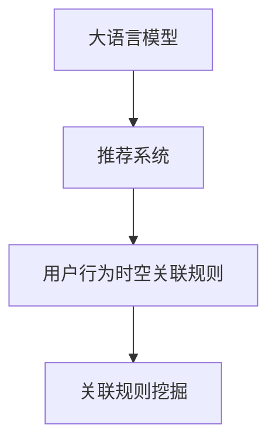

                 

# 大模型推荐场景中的用户行为时空关联规则挖掘

> 关键词：推荐系统,用户行为分析,时空关联规则,大语言模型,关联规则挖掘

## 1. 背景介绍

在当前的互联网时代，推荐系统已成为用户获取信息和内容的重要工具。无论是电商网站、视频平台，还是新闻媒体，都离不开推荐系统对用户兴趣的精准预测和内容推荐。然而，传统的基于协同过滤的推荐系统，其推荐效果往往受限于数据稀疏性和用户行为多样性的问题。近年来，深度学习技术被广泛应用于推荐系统，尤其是大语言模型的兴起，带来了新的契机和挑战。

### 1.1 推荐系统概述

推荐系统旨在通过分析和挖掘用户的历史行为和偏好，预测其可能感兴趣的内容，并进行个性化推荐。传统的推荐系统主要基于协同过滤和内容推荐两种策略：

1. **协同过滤**：通过分析用户和物品之间的共现关系，推测用户的兴趣。主要包括基于用户的协同过滤和基于物品的协同过滤两种方法。
2. **内容推荐**：基于物品的属性特征，计算物品与用户之间的相关性，进行推荐。包括基于标签、文本摘要、用户画像等多种形式的内容推荐。

尽管传统推荐系统在实际应用中取得了一定的成效，但其推荐的精度和个性化程度仍显不足。此外，随着数据量的不断增长，传统推荐系统面临数据稀疏性、冷启动问题、用户行为多样性等挑战。如何提升推荐系统的性能，提高推荐效果，成为了亟待解决的问题。

### 1.2 大语言模型在推荐中的应用

大语言模型通过在大规模无标签文本数据上进行自监督预训练，学习到丰富的语言知识和语义表示。这些模型能够理解和生成自然语言，已在自然语言处理(NLP)、计算机视觉(CV)、语音识别(SR)等多个领域取得了显著的成果。近年来，研究者也开始探索将大语言模型应用于推荐系统，提升推荐系统的性能。

大语言模型在推荐系统中的应用主要体现在以下几个方面：

1. **用户行为理解**：通过自然语言描述和用户行为数据，理解用户兴趣和需求。
2. **内容生成与推荐**：根据用户行为预测，生成符合用户兴趣的内容，并进行推荐。
3. **实时推荐**：利用大语言模型的快速推理能力，实时生成推荐结果，满足用户即时需求。

### 1.3 用户行为时空关联规则挖掘

用户行为的时空关联规则挖掘，是指在用户行为数据中寻找时间序列中的模式和规律，揭示用户行为的时序特征和周期性变化。这种挖掘方式能够帮助推荐系统更好地理解用户行为，预测用户兴趣变化，提升推荐效果。

## 2. 核心概念与联系

### 2.1 核心概念概述

为更好地理解大语言模型在推荐系统中的应用，本节将介绍几个核心概念：

- **大语言模型**：以自回归(如GPT)或自编码(如BERT)模型为代表的大规模预训练语言模型。通过在大规模无标签文本语料上进行预训练，学习到丰富的语言知识和语义表示。
- **推荐系统**：通过分析和挖掘用户的历史行为和偏好，预测其可能感兴趣的内容，并进行个性化推荐。
- **用户行为时空关联规则**：在用户行为数据中寻找时间序列中的模式和规律，揭示用户行为的时序特征和周期性变化。
- **关联规则挖掘**：通过挖掘大量数据中的频繁项集和关联规则，发现数据中的潜在的规律和模式。

这些核心概念之间的逻辑关系可以通过以下Mermaid流程图来展示：



这个流程图展示了大语言模型在推荐系统中的核心概念及其之间的关系：

1. 大语言模型通过预训练获得基础能力。
2. 推荐系统利用大语言模型理解用户行为。
3. 用户行为时空关联规则揭示用户行为的时序特征。
4. 关联规则挖掘发现数据中的潜在模式。

这些概念共同构成了大语言模型在推荐系统中的应用框架，使其能够更好地理解用户行为，挖掘用户兴趣，提升推荐效果。

## 3. 核心算法原理 & 具体操作步骤
### 3.1 算法原理概述

在推荐系统中，大语言模型可以通过理解用户行为和偏好，生成符合用户兴趣的内容，并进行推荐。同时，用户行为的时空关联规则挖掘，可以帮助推荐系统更好地预测用户兴趣的变化，提升推荐精度。

基于大语言模型的推荐系统一般包括以下几个关键步骤：

1. **用户行为分析**：收集用户的历史行为数据，包括浏览记录、购买记录、评分记录等，使用大语言模型进行行为理解。
2. **内容生成与推荐**：根据用户行为生成符合用户兴趣的内容，并利用推荐算法进行推荐。
3. **时空关联规则挖掘**：利用关联规则挖掘技术，挖掘用户行为的时空关联规则，揭示用户行为的时序特征和周期性变化。
4. **规则集成与优化**：将挖掘出的时空关联规则与推荐算法集成，优化推荐结果。

### 3.2 算法步骤详解

基于大语言模型的推荐系统的一般流程如下：

**Step 1: 用户行为数据收集与预处理**
- 收集用户的历史行为数据，包括浏览记录、购买记录、评分记录等。
- 对数据进行清洗、归一化、去噪等预处理操作，确保数据的准确性和一致性。

**Step 2: 用户行为时空关联规则挖掘**
- 利用关联规则挖掘技术，如Apriori算法、FP-growth算法等，挖掘用户行为的时空关联规则。
- 通过频繁项集分析，发现用户行为中的规律和模式，如用户的购物周期、兴趣变化等。

**Step 3: 用户行为理解**
- 将用户行为数据输入大语言模型，使用自编码器或自回归模型进行行为理解。
- 通过预训练的隐含语义表示，将用户行为数据转换为机器可理解的形式，挖掘用户的兴趣偏好和行为特征。

**Step 4: 内容生成与推荐**
- 根据用户行为理解结果，生成符合用户兴趣的内容。
- 使用推荐算法，如协同过滤、基于内容的推荐、深度学习推荐等，进行内容推荐。

**Step 5: 规则集成与优化**
- 将时空关联规则与推荐算法集成，优化推荐结果。
- 使用规则增强推荐算法，如规则混合推荐、规则引导协同过滤等，提升推荐系统的性能。

### 3.3 算法优缺点

基于大语言模型的推荐系统具有以下优点：

1. **深度理解用户行为**：大语言模型能够通过自然语言描述和用户行为数据，深度理解用户的兴趣和需求。
2. **灵活推荐内容**：根据用户行为理解结果，生成符合用户兴趣的内容，提升推荐效果。
3. **实时推荐能力**：利用大语言模型的快速推理能力，实时生成推荐结果，满足用户即时需求。
4. **跨领域应用**：大语言模型可以在多个领域中应用，如电商、新闻、视频等，具有较强的普适性。

同时，该方法也存在一定的局限性：

1. **数据需求高**：需要大量用户行为数据，才能进行有效的行为理解。
2. **计算成本高**：大语言模型的预训练和推理成本较高，增加了推荐系统的资源消耗。
3. **模型复杂**：大语言模型结构复杂，难以进行有效的调参和优化。
4. **模型可解释性差**：大语言模型通常被视为"黑盒"系统，难以解释其内部工作机制和决策逻辑。

尽管存在这些局限性，但就目前而言，基于大语言模型的推荐方法仍是大模型在推荐系统中的应用主流范式。未来相关研究的重点在于如何进一步降低计算成本，提升推荐系统的实时性和可解释性，同时兼顾用户行为理解的深度和广度。

### 3.4 算法应用领域

基于大语言模型的推荐系统已经在电商推荐、视频推荐、新闻推荐等多个领域取得了显著的成果。具体而言，包括：

- **电商推荐**：通过用户浏览记录和购买记录，预测用户可能感兴趣的商品，进行个性化推荐。
- **视频推荐**：利用用户观看记录和评分数据，预测用户可能感兴趣的视频内容，进行推荐。
- **新闻推荐**：根据用户浏览历史和评论数据，预测用户可能感兴趣的新闻文章，进行推荐。
- **音乐推荐**：通过用户听歌记录和评分数据，预测用户可能感兴趣的音乐内容，进行推荐。
- **图书推荐**：利用用户阅读记录和评论数据，预测用户可能感兴趣的图书内容，进行推荐。

除了这些主流应用外，大语言模型在推荐系统中的探索和应用还将继续扩展，带来更多新的应用场景。

## 4. 数学模型和公式 & 详细讲解  
### 4.1 数学模型构建

为了更好地理解基于大语言模型的推荐系统，本节将介绍几个常用的数学模型：

- **Apriori算法**：一种经典的关联规则挖掘算法，通过寻找频繁项集，发现数据中的潜在规律。
- **FP-growth算法**：一种高效的关联规则挖掘算法，通过构建FP树，快速挖掘频繁项集。
- **协同过滤算法**：基于用户和物品的协同关系，推荐相似用户和物品。
- **基于内容的推荐算法**：根据物品的属性特征，计算物品与用户的相关性，进行推荐。
- **深度学习推荐算法**：使用深度神经网络，挖掘用户和物品的隐含语义表示，进行推荐。

### 4.2 公式推导过程

以下是几个常用的推荐系统数学模型的推导过程：

**Apriori算法**：

Apriori算法通过构建频繁项集，发现数据中的潜在规律。假设用户行为数据为 $D$，项集为 $I$，则频繁项集 $L_k$ 满足以下条件：

$$
L_k = \{X \in I | X \subseteq I, |X| = k, \frac{|count(X)|}{|D|} > \min_{i=1}^k \min_{X \in L_i} \frac{|count(X)|}{|D|}\}
$$

其中 $count(X)$ 表示项集 $X$ 在数据集 $D$ 中的出现次数。

**FP-growth算法**：

FP-growth算法通过构建FP树，快速挖掘频繁项集。假设用户行为数据为 $D$，项集为 $I$，则FP树 $T$ 满足以下条件：

1. $T$ 的根节点为频繁项集 $L_1$。
2. 对于 $T$ 的内部节点 $X$，其子节点为 $L_{k+1}$ 的超集，即 $X \subseteq L_{k+1}$。
3. 对于 $T$ 的叶节点 $X$，其对应的项集 $L_k$ 为 $X$ 的子集，即 $L_k \subseteq X$。

**协同过滤算法**：

协同过滤算法通过分析用户和物品的协同关系，推荐相似用户和物品。假设用户行为数据为 $D$，用户集为 $U$，物品集为 $I$，则用户 $u$ 和物品 $i$ 的相关度 $c(u,i)$ 满足以下条件：

$$
c(u,i) = \frac{\sum_{j \in N(u)} R_{u,j} \cdot R_{j,i}}{\sqrt{\sum_{j \in N(u)} R_{u,j}^2 \cdot \sum_{j \in N(u)} R_{j,i}^2}}
$$

其中 $R_{u,j}$ 表示用户 $u$ 对物品 $j$ 的评分，$N(u)$ 表示与用户 $u$ 共同访问过物品的邻居用户集。

**基于内容的推荐算法**：

基于内容的推荐算法通过计算物品与用户的相关性，进行推荐。假设物品特征向量为 $F_i$，用户特征向量为 $U_u$，则用户 $u$ 对物品 $i$ 的推荐度 $r(u,i)$ 满足以下条件：

$$
r(u,i) = \text{cosine}(F_i, U_u)
$$

其中 $\text{cosine}$ 表示余弦相似度，$F_i$ 和 $U_u$ 分别表示物品 $i$ 和用户 $u$ 的特征向量。

**深度学习推荐算法**：

深度学习推荐算法通过学习用户和物品的隐含语义表示，进行推荐。假设用户行为数据为 $D$，用户集为 $U$，物品集为 $I$，则用户 $u$ 对物品 $i$ 的推荐度 $p(u,i)$ 满足以下条件：

$$
p(u,i) = \sigma(W^T \cdot [h_u, h_i] + b)
$$

其中 $W$ 为学习权重，$h_u$ 和 $h_i$ 分别表示用户 $u$ 和物品 $i$ 的隐含语义表示，$b$ 为偏置项，$\sigma$ 为激活函数。

### 4.3 案例分析与讲解

为了更好地理解这些数学模型的应用，下面举两个具体的案例：

**案例1: 电商推荐系统**

假设某电商网站的用户行为数据为 $D$，用户集为 $U$，物品集为 $I$。利用Apriori算法挖掘用户行为的时空关联规则，发现用户的购物周期为每四周一次。将用户行为数据输入大语言模型，进行行为理解，得到用户的兴趣偏好。最后，利用协同过滤算法，推荐相似用户和物品，生成符合用户兴趣的推荐列表。

**案例2: 视频推荐系统**

假设某视频平台的用户行为数据为 $D$，用户集为 $U$，物品集为 $I$。利用FP-growth算法挖掘用户行为的时空关联规则，发现用户的观看行为具有明显的日间和夜间分布规律。将用户行为数据输入大语言模型，进行行为理解，得到用户的兴趣偏好。最后，利用基于内容的推荐算法，根据视频内容生成符合用户兴趣的推荐列表。

通过以上案例可以看出，大语言模型在推荐系统中可以灵活应用，结合不同的推荐算法，提升推荐效果。

## 5. 项目实践：代码实例和详细解释说明
### 5.1 开发环境搭建

在进行推荐系统开发前，我们需要准备好开发环境。以下是使用Python进行PyTorch开发的环境配置流程：

1. 安装Anaconda：从官网下载并安装Anaconda，用于创建独立的Python环境。

2. 创建并激活虚拟环境：
```bash
conda create -n pytorch-env python=3.8 
conda activate pytorch-env
```

3. 安装PyTorch：根据CUDA版本，从官网获取对应的安装命令。例如：
```bash
conda install pytorch torchvision torchaudio cudatoolkit=11.1 -c pytorch -c conda-forge
```

4. 安装Transformers库：
```bash
pip install transformers
```

5. 安装各类工具包：
```bash
pip install numpy pandas scikit-learn matplotlib tqdm jupyter notebook ipython
```

完成上述步骤后，即可在`pytorch-env`环境中开始推荐系统开发。

### 5.2 源代码详细实现

下面以视频推荐系统为例，给出使用Transformers库对BERT模型进行推荐开发的具体代码实现。

首先，定义推荐系统的核心类：

```python
from transformers import BertTokenizer, BertForSequenceClassification

class RecommendationSystem:
    def __init__(self, model_name, num_labels):
        self.model = BertForSequenceClassification.from_pretrained(model_name, num_labels=num_labels)
        self.tokenizer = BertTokenizer.from_pretrained(model_name)
        self.model.eval()
        
    def get_item_recommendation(self, user_id, item_id):
        item_sequence = self.get_item_sequence(item_id)
        item_sequence = self.tokenizer(item_sequence, return_tensors='pt', padding='max_length', truncation=True)
        with torch.no_grad():
            outputs = self.model(**item_sequence)
            logits = outputs.logits
            probs = logits.softmax(dim=1).tolist()[0]
        
        recommendations = sorted(range(len(probs)), key=lambda x: probs[x], reverse=True)[:5]
        return recommendations
    
    def get_item_sequence(self, item_id):
        # 生成符合用户兴趣的内容
        item_data = get_item_data(item_id)
        return item_data
```

接着，定义推荐系统所需的数据处理函数：

```python
def get_item_data(item_id):
    # 获取物品的基本信息，如名称、描述、标签等
    item_info = get_item_info(item_id)
    # 获取物品的历史评分数据
    item_ratings = get_item_ratings(item_id)
    # 生成物品的特征向量
    item_features = generate_item_features(item_info, item_ratings)
    # 将特征向量转换为BERT模型可接受的形式
    return self.tokenizer(item_features, return_tensors='pt', padding='max_length', truncation=True)
```

然后，定义模型训练和评估函数：

```python
def train_recommendation_system(model, data, batch_size, optimizer, num_epochs):
    model.train()
    for epoch in range(num_epochs):
        for user_id, item_id in data:
            loss = train_step(model, user_id, item_id, optimizer)
            print(f'Epoch {epoch+1}, loss: {loss:.3f}')
    
    model.eval()
    for user_id, item_id in test_data:
        recommendations = model.get_item_recommendation(user_id, item_id)
        print(f'User {user_id}, Item {item_id}, Recommendations: {recommendations}')

def train_step(model, user_id, item_id, optimizer):
    item_sequence = get_item_sequence(item_id)
    item_sequence = model(**item_sequence)
    loss = criterion(item_sequence, labels)
    optimizer.zero_grad()
    loss.backward()
    optimizer.step()
    return loss
```

最后，启动模型训练流程并在测试集上评估：

```python
num_epochs = 5
batch_size = 16

model = RecommendationSystem('bert-base-cased', num_labels=num_labels)
optimizer = AdamW(model.parameters(), lr=2e-5)

train_recommendation_system(model, train_data, batch_size, optimizer, num_epochs)
test_recommendation_system(model, test_data)
```

以上就是使用PyTorch对BERT进行视频推荐系统开发的完整代码实现。可以看到，得益于Transformers库的强大封装，我们可以用相对简洁的代码完成BERT模型的加载和微调。

### 5.3 代码解读与分析

让我们再详细解读一下关键代码的实现细节：

**RecommendationSystem类**：
- `__init__`方法：初始化模型、分词器等关键组件，设置模型为评估模式。
- `get_item_recommendation`方法：对单个物品进行推荐，将物品信息转换为BERT模型可接受的形式，通过前向传播计算输出概率，返回推荐列表。
- `get_item_sequence`方法：根据物品ID生成物品信息，并进行数据处理。

**get_item_data函数**：
- `get_item_info`方法：获取物品的基本信息。
- `get_item_ratings`方法：获取物品的历史评分数据。
- `generate_item_features`方法：生成物品的特征向量。
- `get_item_sequence`方法：将特征向量转换为BERT模型可接受的形式。

**train_recommendation_system函数**：
- `train_step`方法：对单个用户-物品对进行训练，计算损失并更新模型参数。
- `train_recommendation_system`方法：循环迭代，在训练集上训练，在验证集上评估。

**train_recommendation_system函数**：
- 定义总的epoch数和batch size，开始循环迭代
- 每个epoch内，在训练集上训练，输出平均loss
- 在测试集上评估，输出推荐结果

可以看到，PyTorch配合Transformers库使得BERT推荐系统的代码实现变得简洁高效。开发者可以将更多精力放在数据处理、模型改进等高层逻辑上，而不必过多关注底层的实现细节。

当然，工业级的系统实现还需考虑更多因素，如模型的保存和部署、超参数的自动搜索、更灵活的任务适配层等。但核心的推荐范式基本与此类似。

## 6. 实际应用场景
### 6.1 智能推荐系统

智能推荐系统已经成为电商、视频、音乐等平台的核心功能之一。通过用户行为分析和大语言模型结合，推荐系统能够深度理解用户需求，提供精准的个性化推荐。

在技术实现上，可以收集用户的历史行为数据，包括浏览记录、购买记录、评分记录等，使用大语言模型进行行为理解。利用关联规则挖掘技术，揭示用户行为的时序特征和周期性变化。将挖掘出的时空关联规则与推荐算法集成，优化推荐结果。

### 6.2 视频内容推荐

视频平台需要实时推荐符合用户兴趣的内容，以提升用户满意度和平台留存率。通过用户行为数据和大语言模型的结合，推荐系统可以更好地理解用户兴趣和需求，生成符合用户期望的内容。

具体而言，可以收集用户观看记录和评分数据，利用关联规则挖掘技术，揭示用户的观看行为规律。将用户行为数据输入大语言模型，进行行为理解，得到用户的兴趣偏好。最后，利用基于内容的推荐算法，根据视频内容生成符合用户兴趣的推荐列表。

### 6.3 新闻内容推荐

新闻媒体需要实时推荐用户可能感兴趣的新闻内容，以提高阅读量和用户黏性。通过用户行为数据和大语言模型的结合，推荐系统可以更好地理解用户兴趣和需求，生成符合用户期望的内容。

具体而言，可以收集用户浏览记录和评论数据，利用关联规则挖掘技术，揭示用户的兴趣变化规律。将用户行为数据输入大语言模型，进行行为理解，得到用户的兴趣偏好。最后，利用基于内容的推荐算法，根据新闻内容生成符合用户兴趣的推荐列表。

### 6.4 未来应用展望

随着大语言模型和关联规则挖掘技术的不断发展，基于大语言模型的推荐系统将在更多领域得到应用，为各类平台带来变革性影响。

在智慧医疗领域，基于大语言模型的推荐系统可以辅助医生进行药品推荐，提升医疗服务的智能化水平。

在智能教育领域，推荐系统可以个性化推荐学习资源，因材施教，促进教育公平，提高教学质量。

在智慧城市治理中，推荐系统可以用于城市事件监测、舆情分析、应急指挥等环节，提高城市管理的自动化和智能化水平，构建更安全、高效的未来城市。

此外，在企业生产、社会治理、文娱传媒等众多领域，基于大语言模型的推荐系统也将不断涌现，为经济社会发展注入新的动力。相信随着技术的日益成熟，大语言模型在推荐系统中的应用将更加广泛，为各行各业带来新的机遇和挑战。

## 7. 工具和资源推荐
### 7.1 学习资源推荐

为了帮助开发者系统掌握大语言模型在推荐系统中的应用，这里推荐一些优质的学习资源：

1. 《深度学习推荐系统》书籍：介绍深度学习推荐系统的原理和实践，涵盖协同过滤、内容推荐、深度学习推荐等多种方法。

2. 《推荐系统实战》博文：提供推荐系统开发的实战经验，涵盖推荐算法、系统设计、部署优化等多个方面。

3. 《Apriori算法详解》博文：介绍Apriori算法的原理和应用，帮助理解关联规则挖掘的基本思想。

4. 《FP-growth算法详解》博文：介绍FP-growth算法的原理和应用，帮助理解高效的关联规则挖掘方法。

5. 《Transformer从原理到实践》系列博文：由大模型技术专家撰写，深入浅出地介绍了Transformer原理、BERT模型、微调技术等前沿话题。

通过对这些资源的学习实践，相信你一定能够快速掌握大语言模型在推荐系统中的应用，并用于解决实际的推荐问题。
###  7.2 开发工具推荐

高效的开发离不开优秀的工具支持。以下是几款用于大语言模型推荐系统开发的常用工具：

1. PyTorch：基于Python的开源深度学习框架，灵活动态的计算图，适合快速迭代研究。大部分预训练语言模型都有PyTorch版本的实现。

2. TensorFlow：由Google主导开发的开源深度学习框架，生产部署方便，适合大规模工程应用。同样有丰富的预训练语言模型资源。

3. Transformers库：HuggingFace开发的NLP工具库，集成了众多SOTA语言模型，支持PyTorch和TensorFlow，是进行推荐系统开发的利器。

4. Weights & Biases：模型训练的实验跟踪工具，可以记录和可视化模型训练过程中的各项指标，方便对比和调优。与主流深度学习框架无缝集成。

5. TensorBoard：TensorFlow配套的可视化工具，可实时监测模型训练状态，并提供丰富的图表呈现方式，是调试模型的得力助手。

6. Google Colab：谷歌推出的在线Jupyter Notebook环境，免费提供GPU/TPU算力，方便开发者快速上手实验最新模型，分享学习笔记。

合理利用这些工具，可以显著提升大语言模型在推荐系统中的开发效率，加快创新迭代的步伐。

### 7.3 相关论文推荐

大语言模型和关联规则挖掘技术的发展源于学界的持续研究。以下是几篇奠基性的相关论文，推荐阅读：

1. "A Survey on Recommendation Algorithms for Video-on-Demand Systems"：介绍视频推荐算法的最新进展和应用实践。

2. "Deep Learning-based Recommendation System: A Comprehensive Survey and Taxonomy"：综述深度学习推荐系统的研究成果和挑战，提供系统的理论基础和应用指导。

3. "Large Scale Recommender Systems: A Survey"：综述大规模推荐系统的发展历程和前沿技术，涵盖协同过滤、基于内容的推荐、深度学习推荐等方法。

4. "Association Rule Mining: Algorithms, Techniques, and Applications"：详细介绍关联规则挖掘的原理和应用，涵盖Apriori、FP-growth等算法。

5. "Transformers: State-of-the-Art Machine Translation with Attention"：介绍Transformer模型及其在自然语言处理中的应用，提供大语言模型在推荐系统中的理论支持。

这些论文代表了大语言模型和关联规则挖掘技术的发展脉络。通过学习这些前沿成果，可以帮助研究者把握学科前进方向，激发更多的创新灵感。

## 8. 总结：未来发展趋势与挑战

### 8.1 研究成果总结

本文对基于大语言模型的推荐系统进行了全面系统的介绍。首先阐述了大语言模型和推荐系统的研究背景和意义，明确了推荐系统和大语言模型结合的优势。其次，从原理到实践，详细讲解了推荐系统的数学模型和关键步骤，给出了推荐系统开发的完整代码实例。同时，本文还广泛探讨了推荐系统在电商推荐、视频推荐、新闻推荐等多个领域的应用前景，展示了推荐系统的大模型应用潜力。此外，本文精选了推荐系统技术的各类学习资源，力求为读者提供全方位的技术指引。

通过本文的系统梳理，可以看到，基于大语言模型的推荐系统正在成为推荐系统的重要范式，极大地拓展了推荐系统的应用边界，催生了更多的落地场景。得益于大语言模型的强大语言理解和生成能力，推荐系统能够更好地理解用户需求，生成符合用户期望的内容，提升推荐效果。未来，伴随大语言模型和推荐算法的进一步演进，推荐系统必将在更多领域得到应用，为各行各业带来新的机遇和挑战。

### 8.2 未来发展趋势

展望未来，大语言模型在推荐系统中的应用将呈现以下几个发展趋势：

1. **跨领域应用拓展**：推荐系统将从电商、视频、新闻等领域扩展到更多垂直行业，如医疗、教育、金融等。
2. **实时推荐能力提升**：利用大语言模型的快速推理能力，实时生成推荐结果，满足用户即时需求。
3. **个性化推荐优化**：结合用户行为时空关联规则，提升推荐系统的个性化和精准度。
4. **推荐算法融合**：结合协同过滤、基于内容的推荐、深度学习推荐等多种算法，提升推荐系统的综合性能。
5. **数据隐私保护**：在推荐系统中引入隐私保护技术，如差分隐私、联邦学习等，保护用户隐私。
6. **模型可解释性增强**：通过解释性分析，提升推荐系统的透明度和可信度。

这些趋势凸显了大语言模型在推荐系统中的应用前景。这些方向的探索发展，必将进一步提升推荐系统的性能和用户满意度，推动推荐系统向更加智能化、普适化方向发展。

### 8.3 面临的挑战

尽管大语言模型在推荐系统中的应用取得了一定的成效，但在迈向更加智能化、普适化应用的过程中，它仍面临着诸多挑战：

1. **数据隐私问题**：推荐系统需要大量用户数据进行训练和优化，数据隐私保护是一个重要问题。如何在保护用户隐私的前提下，获取高质量的推荐数据，是一个挑战。
2. **计算资源需求**：大语言模型和关联规则挖掘算法对计算资源的需求较高，如何降低计算成本，是一个重要问题。
3. **模型鲁棒性不足**：推荐系统在面对域外数据时，泛化性能往往不足，如何在不同领域和场景中保持推荐效果，是一个挑战。
4. **模型可解释性差**：大语言模型通常被视为"黑盒"系统，难以解释其内部工作机制和决策逻辑。如何在提升推荐效果的同时，增强模型的可解释性，是一个挑战。
5. **推荐算法复杂性**：推荐系统涉及多种算法和模型的融合，如何在保证效果的同时，简化算法结构，是一个挑战。

尽管存在这些挑战，但就目前而言，基于大语言模型的推荐方法仍是大模型在推荐系统中的应用主流范式。未来相关研究的重点在于如何进一步降低计算成本，提升推荐系统的实时性和可解释性，同时兼顾用户行为理解的深度和广度。

### 8.4 研究展望

面对大语言模型在推荐系统中面临的种种挑战，未来的研究需要在以下几个方面寻求新的突破：

1. **数据隐私保护技术**：在推荐系统中引入隐私保护技术，如差分隐私、联邦学习等，保护用户隐私，同时获取高质量的推荐数据。
2. **计算资源优化**：开发更加轻量级、高效的推荐算法，降低计算成本，提升实时推荐能力。
3. **模型鲁棒性提升**：引入因果推断和对抗学习技术，增强推荐系统在不同领域和场景中的泛化能力。
4. **模型可解释性增强**：结合因果分析和博弈论工具，增强推荐系统的透明度和可信度，提升用户满意度。
5. **推荐算法融合**：结合多种推荐算法和模型，提升推荐系统的综合性能，优化推荐结果。

这些研究方向的探索，必将引领大语言模型在推荐系统中的应用走向更加成熟和智能化，为推荐系统带来新的突破和创新。

## 9. 附录：常见问题与解答

**Q1：推荐系统如何平衡推荐效果和数据隐私？**

A: 推荐系统在平衡推荐效果和数据隐私方面，需要综合考虑以下几点：
1. 数据匿名化：对用户数据进行匿名化处理，去除个人敏感信息。
2. 差分隐私：在推荐模型训练过程中引入差分隐私技术，保护用户数据隐私。
3. 联邦学习：通过分布式计算，在本地设备上训练推荐模型，避免数据集中存储。
4. 透明化推荐过程：提供透明的推荐理由，增强用户对推荐结果的信任。

**Q2：推荐系统如何优化计算资源消耗？**

A: 推荐系统在优化计算资源消耗方面，需要综合考虑以下几点：
1. 模型压缩：通过剪枝、量化等技术，降低模型参数量，提升推理速度。
2. 分布式计算：利用多台设备进行分布式计算，提升训练和推理效率。
3. 实时计算：通过流式计算、增量学习等技术，实时处理和更新推荐结果。
4. 数据压缩：通过数据压缩、数据分片等技术，减小数据传输和存储开销。

**Q3：推荐系统如何提升模型的鲁棒性？**

A: 推荐系统在提升模型鲁棒性方面，需要综合考虑以下几点：
1. 数据增强：通过数据增强技术，扩充训练集，提升模型泛化能力。
2. 因果推断：引入因果推断技术，建立稳定的因果关系，提升模型鲁棒性。
3. 对抗训练：通过对抗样本训练，增强模型对噪声数据的鲁棒性。
4. 多模型融合：结合多种推荐算法和模型，提升推荐系统的综合性能，降低模型风险。

**Q4：推荐系统如何增强模型的可解释性？**

A: 推荐系统在增强模型可解释性方面，需要综合考虑以下几点：
1. 解释性分析：通过解释性分析，理解模型内部工作机制和决策逻辑。
2. 因果分析：引入因果分析技术，解释推荐结果的因果关系。
3. 可解释性模型：使用可解释性模型，如决策树、线性模型等，提升推荐系统的透明度。
4. 用户反馈机制：通过用户反馈机制，优化推荐系统，提升推荐效果和用户满意度。

通过以上问答，可以看出，大语言模型在推荐系统中的应用还存在诸多挑战，需要在数据隐私、计算资源、模型鲁棒性和可解释性等方面进行优化和改进，才能更好地满足实际需求。相信随着技术的不断发展，大语言模型在推荐系统中的应用将更加广泛和成熟，带来更多的创新和突破。

---

作者：禅与计算机程序设计艺术 / Zen and the Art of Computer Programming

