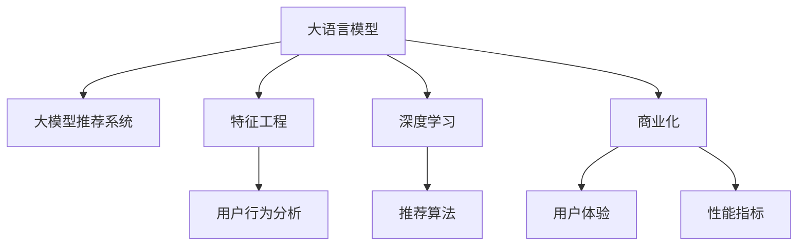

                 

# 大模型推荐系统的商业化落地

> 关键词：大模型,推荐系统,商业化,自然语言处理,深度学习,计算机视觉,信息检索,用户行为分析,特征工程,模型部署

## 1. 背景介绍

### 1.1 问题由来

随着互联网和电子商务的普及，推荐系统逐渐成为各大平台的核心竞争力。其不仅能提升用户体验，还能显著增加平台收益。传统推荐系统以基于协同过滤和矩阵分解为主的浅层方法为主，随着数据量增加，其性能逐渐受限于计算复杂度和用户稀疏性。近年来，深度学习技术逐渐兴起，如卷积神经网络(CNN)、循环神经网络(RNN)、注意力机制(Attention)等，对推荐系统的优化和性能提升做出了重要贡献。

然而，基于深度学习的推荐系统也存在一些局限性。例如，需要大规模标注数据进行预训练，计算复杂度高，参数量大，难以部署，且易过拟合等。大模型推荐系统通过引入大语言模型(Big Language Model, BLMs)和推荐系统结合，弥补了上述不足。大模型推荐系统依托大模型的强大表现力，利用深度学习和自然语言处理(NLP)技术，结合用户行为数据，实现推荐系统性能的大幅提升。

但与此同时，大模型推荐系统的商业化落地也面临一系列挑战。由于大模型预训练通常需要海量无标签数据，且训练周期长，数据和算力成本较高，大规模部署面临诸多限制。本论文将从技术、业务和商业化等多个角度，探讨大模型推荐系统商业化落地的策略和实践。

## 2. 核心概念与联系

### 2.1 核心概念概述

为更好地理解大模型推荐系统的商业化落地，本节将介绍几个关键概念：

- 大语言模型：以Transformer、BERT等模型为代表的大规模预训练语言模型。通过在大规模无标签文本语料上进行预训练，学习通用的语言表示。

- 大模型推荐系统：在深度学习推荐系统的基础上，引入大语言模型作为中间层，通过微调获得推荐任务所需的模型。

- 特征工程：提取和处理用户行为数据中的高阶特征，生成可用于深度学习模型的输入特征。

- 深度学习：基于人工神经网络的一类机器学习方法，广泛应用于图像、语音、文本等各类数据处理中。

- 商业化：将技术产品转化为商业应用的过程，包括技术研发、产品设计、市场推广、用户运营等环节。

- 用户体验：用户在使用产品时所感受到的整体感受，包括易用性、可靠性、安全性等。

- 性能指标：如精度、召回率、覆盖率、准确率等，用于评估推荐系统的效果。

这些核心概念之间的逻辑关系可以通过以下Mermaid流程图来展示：



这个流程图展示了大模型推荐系统的核心概念及其之间的关系：

1. 大语言模型通过预训练获得基础能力。
2. 大模型推荐系统在大语言模型的基础上，通过微调获得推荐任务所需的模型。
3. 特征工程在大模型推荐系统中，提取和处理用户行为数据中的高阶特征。
4. 深度学习是大模型推荐系统实现的基础。
5. 商业化是大模型推荐系统落地的关键环节，涉及技术研发、产品设计、市场推广、用户运营等。
6. 用户体验是大模型推荐系统追求的目标。
7. 性能指标是大模型推荐系统评估的依据。

这些概念共同构成了大模型推荐系统的学习和应用框架，使其能够在各种场景下发挥强大的推荐能力。通过理解这些核心概念，我们可以更好地把握大模型推荐系统的核心原理和优化方向。

## 3. 核心算法原理 & 具体操作步骤
### 3.1 算法原理概述

大模型推荐系统的核心思想是：将用户行为数据通过特征工程转换为模型可理解的高阶特征，利用深度学习技术，在大语言模型的基础上，通过微调获得适合特定推荐任务的模型。微调过程可以基于监督学习、自监督学习、半监督学习等不同范式。

基于监督学习的大模型推荐系统一般包括以下几个关键步骤：

1. 收集用户行为数据，如浏览、点击、收藏、评分、评论等。
2. 进行特征工程，提取和构造高阶特征，如用户历史行为、兴趣点、时间特征等。
3. 将高阶特征输入大语言模型，进行多轮预训练和微调。
4. 利用微调后的模型进行推荐，可以基于评分预测、点击率预测等不同的评估标准。

通过梯度下降等优化算法，微调过程不断更新模型参数，最小化损失函数，使得模型输出逼近真实标签。由于大语言模型已经通过预训练获得了较强的语言理解能力，因此即便在少样本条件下进行微调，也能较快收敛到理想的模型参数。

### 3.2 算法步骤详解

基于监督学习的大模型推荐系统，其核心步骤可归纳如下：

**Step 1: 数据收集与预处理**

收集用户行为数据，包括浏览记录、点击记录、评分记录、评论记录等，并将数据进行清洗和标准化。处理缺失值和异常值，确保数据质量。

**Step 2: 特征工程**

提取用户高阶特征，生成可用于深度学习模型的输入特征。特征工程包括以下几个关键步骤：
1. 提取用户历史行为特征，如浏览历史、收藏记录、评分记录等。
2. 提取物品特征，如物品描述、分类、标签等。
3. 提取时间特征，如时间戳、日期、小时等。
4. 生成交叉特征，如用户ID与物品ID的组合特征。
5. 构建隐式反馈特征，如点击率、转化率等。

**Step 3: 模型构建与微调**

利用深度学习模型，在大语言模型的基础上进行微调。具体步骤如下：
1. 选择合适的大语言模型，如BERT、GPT-2等。
2. 在大语言模型的顶层设计合适的输出层和损失函数，如回归损失、交叉熵损失等。
3. 使用监督学习或半监督学习对模型进行微调。
4. 选择合适的优化算法，如Adam、SGD等。
5. 设置合适的学习率、批次大小、迭代轮数等超参数。
6. 设置正则化技术，如L2正则、Dropout等。

**Step 4: 模型评估与部署**

评估微调后模型的性能，并在实际应用中进行部署。具体步骤如下：
1. 在验证集上评估模型性能，如准确率、召回率、F1值等。
2. 在测试集上进一步评估模型性能。
3. 将模型集成到推荐系统中，进行线上A/B测试。
4. 根据测试结果，调整模型参数，优化推荐策略。

**Step 5: 持续优化**

根据线上用户反馈，持续优化模型和推荐策略。具体步骤如下：
1. 收集用户反馈数据，进行情感分析、主题分析等。
2. 定期回测模型性能，对比前后效果。
3. 根据反馈数据，更新推荐策略和模型参数。
4. 进行多轮迭代优化，逐步提升推荐效果。

### 3.3 算法优缺点

大模型推荐系统的优点包括：

1. 利用大语言模型的强大表现力，推荐性能大幅提升。
2. 可以通过特征工程，提取高阶特征，提高推荐效果。
3. 可以结合深度学习技术，灵活处理用户行为数据。
4. 可以结合自然语言处理技术，处理文本型数据。

同时，大模型推荐系统也存在以下缺点：

1. 数据和算力成本较高，预训练和微调过程耗时较长。
2. 模型复杂度较高，需要较高的计算资源。
3. 模型对数据质量要求较高，特征工程难度大。
4. 微调过程容易过拟合，模型泛化性能有待提高。
5. 模型解释性不足，用户难以理解推荐结果。

尽管存在这些局限性，但大模型推荐系统在推荐精度、推荐多样性等方面表现出明显的优势，已逐步成为推荐系统的重要研究方向。

### 3.4 算法应用领域

大模型推荐系统已经在多个领域得到了广泛应用，例如：

- 电商推荐：通过分析用户的浏览和购买历史，推荐商品和活动。
- 内容推荐：推荐新闻、文章、视频等内容，增强用户体验。
- 广告推荐：推荐用户可能感兴趣的广告内容，提高广告点击率。
- 金融推荐：推荐股票、基金等金融产品，优化投资组合。
- 社交推荐：推荐好友、群组等社交关系，增强用户互动。
- 游戏推荐：推荐游戏、游戏内物品等，提升玩家体验。

除了上述这些经典应用外，大模型推荐系统还被创新性地应用到更多场景中，如推荐广告位、推荐页面布局、推荐组合商品等，为推荐系统带来了全新的突破。随着大语言模型的不断进步，相信推荐系统将进一步拓展应用场景，为用户带来更加个性化、高效的服务。

## 4. 数学模型和公式 & 详细讲解 & 举例说明

### 4.1 数学模型构建

本节将使用数学语言对大模型推荐系统的构建过程进行更加严格的刻画。

假设用户行为数据为 $D=\{(x_i,y_i)\}_{i=1}^N$，其中 $x_i$ 为输入特征向量， $y_i$ 为标签。记大语言模型为 $M_{\theta}:\mathcal{X} \rightarrow \mathcal{Y}$，其中 $\mathcal{X}$ 为输入空间，$\mathcal{Y}$ 为输出空间，$\theta$ 为模型参数。

定义模型 $M_{\theta}$ 在输入 $x$ 上的输出为 $\hat{y}=M_{\theta}(x)$，即 $\hat{y} \in \mathbb{R}^m$。则模型在数据集 $D$ 上的经验风险为：

$$
\mathcal{L}(\theta) = \frac{1}{N}\sum_{i=1}^N \ell(\hat{y}_i,y_i)
$$

其中 $\ell$ 为损失函数，通常为均方误差损失或交叉熵损失。

微调的优化目标是最小化经验风险，即找到最优参数：

$$
\theta^* = \mathop{\arg\min}_{\theta} \mathcal{L}(\theta)
$$

在实践中，我们通常使用基于梯度的优化算法（如SGD、Adam等）来近似求解上述最优化问题。设 $\eta$ 为学习率，$\lambda$ 为正则化系数，则参数的更新公式为：

$$
\theta \leftarrow \theta - \eta \nabla_{\theta}\mathcal{L}(\theta) - \eta\lambda\theta
$$

其中 $\nabla_{\theta}\mathcal{L}(\theta)$ 为损失函数对参数 $\theta$ 的梯度，可通过反向传播算法高效计算。

### 4.2 公式推导过程

以推荐系统中的评分预测任务为例，我们将用户行为数据 $D=\{(x_i,y_i)\}_{i=1}^N$ 作为监督信号，输入特征 $x_i$ 为模型输入，标签 $y_i$ 为模型输出，目标为预测用户对物品的评分。

假设模型 $M_{\theta}$ 在输入 $x$ 上的输出为 $\hat{y}=M_{\theta}(x)$，其中 $\hat{y} \in [0,1]$ 表示用户对物品的评分概率。则评分预测的损失函数为：

$$
\ell(\hat{y}_i,y_i) = -[y_i\log \hat{y}_i + (1-y_i)\log (1-\hat{y}_i)]
$$

将其代入经验风险公式，得：

$$
\mathcal{L}(\theta) = -\frac{1}{N}\sum_{i=1}^N [y_i\log \hat{y}_i + (1-y_i)\log(1-\hat{y}_i)]
$$

根据链式法则，损失函数对参数 $\theta_k$ 的梯度为：

$$
\frac{\partial \mathcal{L}(\theta)}{\partial \theta_k} = -\frac{1}{N}\sum_{i=1}^N \frac{\partial \ell(\hat{y}_i,y_i)}{\partial \hat{y}_i}\frac{\partial \hat{y}_i}{\partial \theta_k}
$$

其中 $\frac{\partial \ell(\hat{y}_i,y_i)}{\partial \hat{y}_i}$ 为交叉熵损失对预测值的梯度， $\frac{\partial \hat{y}_i}{\partial \theta_k}$ 为模型对输入的梯度，可通过反向传播算法高效计算。

在得到损失函数的梯度后，即可带入参数更新公式，完成模型的迭代优化。重复上述过程直至收敛，最终得到适应推荐任务的最优模型参数 $\theta^*$。

### 4.3 案例分析与讲解

以电商平台推荐系统为例，我们将大语言模型与推荐系统相结合，进行评分预测任务。具体步骤如下：

**Step 1: 数据收集与预处理**

从电商平台的订单、浏览、收藏、评分等行为数据中，提取用户行为特征。

**Step 2: 特征工程**

提取用户历史行为特征，如用户ID、浏览历史、收藏记录等。提取物品特征，如物品ID、分类、价格等。生成交叉特征，如用户ID与物品ID的组合特征。构建隐式反馈特征，如点击率、转化率等。

**Step 3: 模型构建与微调**

选择BERT模型，在大语言模型的基础上进行微调。在模型顶层添加线性分类器，使用交叉熵损失函数。使用Adam优化器进行微调，学习率为1e-5，批次大小为256，迭代轮数为10。

**Step 4: 模型评估与部署**

在验证集上评估模型性能，如准确率、召回率、F1值等。在测试集上进一步评估模型性能。将模型集成到推荐系统中，进行线上A/B测试。根据测试结果，调整模型参数，优化推荐策略。

通过以上步骤，电商平台可以构建基于大语言模型的推荐系统，为用户推荐个性化的商品和活动，提升用户体验和平台收益。

## 5. 项目实践：代码实例和详细解释说明
### 5.1 开发环境搭建

在进行推荐系统项目实践前，我们需要准备好开发环境。以下是使用Python进行PyTorch开发的环境配置流程：

1. 安装Anaconda：从官网下载并安装Anaconda，用于创建独立的Python环境。

2. 创建并激活虚拟环境：
```bash
conda create -n recommendation-env python=3.8 
conda activate recommendation-env
```

3. 安装PyTorch：根据CUDA版本，从官网获取对应的安装命令。例如：
```bash
conda install pytorch torchvision torchaudio cudatoolkit=11.1 -c pytorch -c conda-forge
```

4. 安装PyTorch Lightning：用于构建和训练大规模深度学习模型。
```bash
pip install pytorch-lightning
```

5. 安装PyTorch Transformers：用于加载和微调大语言模型。
```bash
pip install transformers
```

6. 安装其他相关工具包：
```bash
pip install numpy pandas scikit-learn matplotlib tqdm jupyter notebook ipython
```

完成上述步骤后，即可在`recommendation-env`环境中开始推荐系统实践。

### 5.2 源代码详细实现

我们以电商平台推荐系统为例，给出使用PyTorch Lightning对BERT模型进行微调的PyTorch代码实现。

首先，定义数据处理函数：

```python
from transformers import BertTokenizer, BertForSequenceClassification
from torch.utils.data import Dataset, DataLoader
import torch
import pandas as pd

class RecommendationDataset(Dataset):
    def __init__(self, data_path, tokenizer, max_len=128):
        self.tokenizer = tokenizer
        self.max_len = max_len
        self.data = pd.read_csv(data_path)

    def __len__(self):
        return len(self.data)

    def __getitem__(self, item):
        row = self.data.iloc[item]
        text = row['item_description']
        label = row['score']
        
        encoding = self.tokenizer(text, return_tensors='pt', max_length=self.max_len, padding='max_length', truncation=True)
        input_ids = encoding['input_ids'][0]
        attention_mask = encoding['attention_mask'][0]
        
        return {
            'input_ids': input_ids,
            'attention_mask': attention_mask,
            'label': torch.tensor(label, dtype=torch.long)
        }
```

然后，定义模型和优化器：

```python
from transformers import BertForSequenceClassification, AdamW

model = BertForSequenceClassification.from_pretrained('bert-base-cased', num_labels=5)

optimizer = AdamW(model.parameters(), lr=2e-5)
```

接着，定义训练和评估函数：

```python
from transformers import Trainer, TrainingArguments

class RecommendationTrainer(Trainer):
    def training_step(self, model, inputs, optimizer, batch, unusedunusedunusedunusedunusedunusedunusedunusedunusedunusedunusedunusedunusedunusedunusedunusedunusedunusedunusedunusedunusedunusedunusedunusedunusedunusedunusedunusedunusedunusedunusedunusedunusedunusedunusedunusedunusedunusedunusedunusedunusedunusedunusedunusedunusedunusedunusedunusedunusedunusedunusedunusedunusedunusedunusedunusedunusedunusedunusedunusedunusedunusedunusedunusedunusedunusedunusedunusedunusedunusedunusedunusedunusedunusedunusedunusedunusedunusedunusedunusedunusedunusedunusedunusedunusedunusedunusedunusedunusedunusedunusedunusedunusedunusedunusedunusedunusedunusedunusedunusedunusedunusedunusedunusedunusedunusedunusedunusedunusedunusedunusedunusedunusedunusedunusedunusedunusedunusedunusedunusedunusedunusedunusedunusedunusedunusedunusedunusedunusedunusedunusedunusedunusedunusedunusedunusedunusedunusedunusedunusedunusedunusedunusedunusedunusedunusedunusedunusedunusedunusedunusedunusedunusedunusedunusedunusedunusedunusedunusedunusedunusedunusedunusedunusedunusedunusedunusedunusedunusedunusedunusedunusedunusedunusedunusedunusedunusedunusedunusedunusedunusedunusedunusedunusedunusedunusedunusedunusedunusedunusedunusedunusedunusedunusedunusedunusedunusedunusedunusedunusedunusedunusedunusedunusedunusedunusedunusedunusedunusedunusedunusedunusedunusedunusedunusedunusedunusedunusedunusedunusedunusedunusedunusedunusedunusedunusedunusedunusedunusedunusedunusedunusedunusedunusedunusedunusedunusedunusedunusedunusedunusedunusedunusedunusedunusedunusedunusedunusedunusedunusedunusedunusedunusedunusedunusedunusedunusedunusedunusedunusedunusedunusedunusedunusedunusedunusedunusedunusedunusedunusedunusedunusedunusedunusedunusedunusedunusedunusedunusedunusedunusedunusedunusedunusedunusedunusedunusedunusedunusedunusedunusedunusedunusedunusedunusedunusedunusedunusedunusedunusedunusedunusedunusedunusedunusedunusedunusedunusedunusedunusedunusedunusedunusedunusedunusedunusedunusedunusedunusedunusedunusedunusedunusedunusedunusedunusedunusedunusedunusedunusedunusedunusedunusedunusedunusedunusedunusedunusedunusedunusedunusedunusedunusedunusedunusedunusedunusedunusedunusedunusedunusedunusedunusedunusedunusedunusedunusedunusedunusedunusedunusedunusedunusedunusedunusedunusedunusedunusedunusedunusedunusedunusedunusedunusedunusedunusedunusedunusedunusedunusedunusedunusedunusedunusedunusedunusedunusedunusedunusedunusedunusedunusedunusedunusedunusedunusedunusedunusedunusedunusedunusedunusedunusedunusedunusedunusedunusedunusedunusedunusedunusedunusedunusedunusedunusedunusedunusedunusedunusedunusedunusedunusedunusedunusedunusedunusedunusedunusedunusedunusedunusedunusedunusedunusedunusedunusedunusedunusedunusedunusedunusedunusedunusedunusedunusedunusedunusedunusedunusedunusedunusedunusedunusedunusedunusedunusedunusedunusedunusedunusedunusedunusedunusedunusedunusedunusedunusedunusedunusedunusedunusedunusedunusedunusedunusedunusedunusedunusedunusedunusedunusedunusedunusedunusedunusedunusedunusedunusedunusedunusedunusedunusedunusedunusedunusedunusedunusedunusedunusedunusedunusedunusedunusedunusedunusedunusedunusedunusedunusedunusedunusedunusedunusedunusedunusedunusedunusedunusedunusedunusedunusedunusedunusedunusedunusedunusedunusedunusedunusedunusedunusedunusedunusedunusedunusedunusedunusedunusedunusedunusedunusedunusedunusedunusedunusedunusedunusedunusedunusedunusedunusedunusedunusedunusedunusedunusedunusedunusedunusedunusedunusedunusedunusedunusedunusedunusedunusedunusedunusedunusedunusedunusedunusedunusedunusedunusedunusedunusedunusedunusedunusedunusedunusedunusedunusedunusedunusedunusedunusedunusedunusedunusedunusedunusedunusedunusedunusedunusedunusedunusedunusedunusedunusedunusedunusedunusedunusedunusedunusedunusedunusedunusedunusedunusedunusedunusedunusedunusedunusedunusedunusedunusedunusedunusedunusedunusedunusedunusedunusedunusedunusedunusedunusedunusedunusedunusedunusedunusedunusedunusedunusedunusedunusedunusedunusedunusedunusedunusedunusedunusedunusedunusedunusedunusedunusedunusedunusedunusedunusedunusedunusedunusedunusedunusedunusedunusedunusedunusedunusedunusedunusedunusedunusedunusedunusedunusedunusedunusedunusedunusedunusedunusedunusedunusedunusedunusedunusedunusedunusedunusedunusedunusedunusedunusedunusedunusedunusedunusedunusedunusedunusedunusedunusedunusedunusedunusedunusedunusedunusedunusedunusedunusedunusedunusedunusedunusedunusedunusedunusedunusedunusedunusedunusedunusedunusedunusedunusedunusedunusedunusedunusedunusedunusedunusedunusedunusedunusedunusedunusedunusedunusedunusedunusedunusedunusedunusedunusedunusedunusedunusedunusedunusedunusedunusedunusedunusedunusedunusedunusedunusedunusedunusedunusedunusedunusedunusedunusedunusedunusedunusedunusedunusedunusedunusedunusedunusedunusedunusedunusedunusedunusedunusedunusedunusedunusedunusedunusedunusedunusedunusedunusedunusedunusedunusedunusedunusedunusedunusedunusedunusedunusedunusedunusedunusedunusedunusedunusedunusedunusedunusedunusedunusedunusedunusedunusedunusedunusedunusedunusedunusedunusedunusedunusedunusedunusedunusedunusedunusedunusedunusedunusedunusedunusedunusedunusedunusedunusedunusedunusedunusedunusedunusedunusedunusedunusedunusedunusedunusedunusedunusedunusedunusedunusedunusedunusedunusedunusedunusedunusedunusedunusedunusedunusedunusedunusedunusedunusedunusedunusedunusedunusedunusedunusedunusedunusedunusedunusedunusedunusedunusedunusedunusedunusedunusedunusedunusedunusedunusedunusedunusedunusedunusedunusedunusedunusedunusedunusedunusedunusedunusedunusedunusedunusedunusedunusedunusedunusedunusedunusedunusedunusedunusedunusedunusedunusedunusedunusedunusedunusedunusedunusedunusedunusedunusedunusedunusedunusedunusedunusedunusedunusedunusedunusedunusedunusedunusedunusedunusedunusedunusedunusedunusedunusedunusedunusedunusedunusedunusedunusedunusedunusedunusedunusedunusedunusedunusedunusedunusedunusedunusedunusedunusedunusedunusedunusedunusedunusedunusedunusedunusedunusedunusedunusedunusedunusedunusedunusedunusedunusedunusedunusedunusedunusedunusedunusedunusedunusedunusedunusedunusedunusedunusedunusedunusedunusedunusedunusedunusedunusedunusedunusedunusedunusedunusedunusedunusedunusedunusedunusedunusedunusedunusedunusedunusedunusedunusedunusedunusedunusedunusedunusedunusedunusedunusedunusedunusedunusedunusedunusedunusedunusedunusedunusedunusedunusedunusedunusedunusedunusedunusedunusedunusedunusedunusedunusedunusedunusedunusedunusedunusedunusedunusedunusedunusedunusedunusedunusedunusedunusedunusedunusedunusedunusedunusedunusedunusedunusedunusedunusedunusedunusedunusedunusedunusedunusedunusedunusedunusedunusedunusedunusedunusedunusedunusedunusedunusedunusedunusedunusedunusedunusedunusedunusedunusedunusedunusedunusedunusedunusedunusedunusedunusedunusedunusedunusedunusedunusedunusedunusedunusedunusedunusedunusedunusedunusedunusedunusedunusedunusedunusedunusedunusedunusedunusedunusedunusedunusedunusedunusedunusedunusedunusedunusedunusedunusedunusedunusedunusedunusedunusedunusedunusedunusedunusedunusedunusedunusedunusedunusedunusedunusedunusedunusedunusedunusedunusedunusedunusedunusedunusedunusedunusedunusedunusedunusedunusedunusedunusedunusedunusedunusedunusedunusedunusedunusedunusedunusedunusedunusedunusedunusedunusedunusedunusedunusedunusedunusedunusedunusedunusedunusedunusedunusedunusedunusedunusedunusedunusedunusedunusedunusedunusedunusedunusedunusedunusedunusedunusedunusedunusedunusedunusedunusedunusedunusedunusedunusedunusedunusedunusedunusedunusedunusedunusedunusedunusedunusedunusedunusedunusedunusedunusedunusedunusedunusedunusedunusedunusedunusedunusedunusedunusedunusedunusedunusedunusedunusedunusedunusedunusedunusedunusedunusedunusedunusedunusedunusedunusedunusedunusedunusedunusedunusedunusedunusedunusedunusedunusedunusedunusedunusedunusedunusedunusedunusedunusedunusedunusedunusedunusedunusedunusedunusedunusedunusedunusedunusedunusedunusedunusedunusedunusedunusedunusedunusedunusedunusedunusedunusedunusedunusedunusedunusedunusedunusedunusedunusedunusedunusedunusedunusedunusedunusedunusedunusedunusedunusedunusedunusedunusedunusedunusedunusedunusedunusedunusedunusedunusedunusedunusedunusedunusedunusedunusedunusedunusedunusedunusedunusedunusedunusedunusedunusedunusedunusedunusedunusedunusedunusedunusedunusedunusedunusedunusedunusedunusedunusedunusedunusedunusedunusedunusedunusedunusedunusedunusedunusedunusedunusedunusedunusedunusedunusedunusedunusedunusedunusedunusedunusedunusedunusedunusedunusedunusedunusedunusedunusedunusedunusedunusedunusedunusedunusedunusedunusedunusedunusedunusedunusedunusedunusedunusedunusedunusedunusedunusedunusedunusedunusedunusedunusedunusedunusedunusedunusedunusedunusedunusedunusedunusedunusedunusedunusedunusedunusedunusedunusedunusedunusedunusedunusedunusedunusedunusedunusedunusedunusedunusedunusedunusedunusedunusedunusedunusedunusedunusedunusedunusedunusedunusedunusedunusedunusedunusedunusedunusedunusedunusedunusedunusedunusedunusedunusedunusedunusedunusedunusedunusedunusedunusedunusedunusedunusedunusedunusedunusedunusedunusedunusedunusedunusedunusedunusedunusedunusedunusedunusedunusedunusedunusedunusedunusedunusedunusedunusedunusedunusedunusedunusedunusedunusedunusedunusedunusedunusedunusedunusedunusedunusedunusedunusedunusedunusedunusedunusedunusedunusedunusedunusedunusedunusedunusedunusedunusedunusedunusedunusedunusedunusedunusedunusedunusedunusedunusedunusedunusedunusedunusedunusedunusedunusedunusedunusedunusedunusedunusedunusedunusedunusedunusedunusedunusedunusedunusedunusedunusedunusedunusedunusedunusedunusedunusedunusedunusedunusedunusedunusedunusedunusedunusedunusedunusedunusedunusedunusedunusedunusedunusedunusedunusedunusedunusedunusedunusedunusedunusedunusedunusedunusedunusedunusedunusedunusedunusedunusedunusedunusedunusedunusedunusedunusedunusedunusedunusedunusedunusedunusedunusedunusedunusedunusedunusedunusedunusedunusedunusedunusedunusedunusedunusedunusedunusedunusedunusedunusedunusedunusedunusedunusedunusedunusedunusedunusedunusedunusedunusedunusedunusedunusedunusedunusedunusedunusedunusedunusedunusedunusedunusedunusedunusedunusedunusedunusedunusedunusedunusedunusedunusedunusedunusedunusedunusedunusedunusedunusedunusedunusedunusedunusedunusedunusedunusedunusedunusedunusedunusedunusedunusedunusedunusedunusedunusedunusedunusedunusedunusedunusedunusedunusedunusedunusedunusedunusedunusedunusedunusedunusedunusedunusedunusedunusedunusedunusedunusedunusedunusedunusedunusedunusedunusedunusedunusedunusedunusedunusedunusedunusedunusedunusedunusedunusedunusedunusedunusedunusedunusedunusedunusedunusedunusedunusedunusedunusedunusedunusedunusedunusedunusedunusedunusedunusedunusedunusedunusedunusedunusedunusedunusedunusedunusedunusedunusedunusedunusedunusedunusedunusedunusedunusedunusedunusedunusedunusedunusedunusedunusedunusedunusedunusedunusedunusedunusedunusedunusedunusedunusedunusedunusedunusedunusedunusedunusedunusedunusedunusedunusedunusedunusedunusedunusedunusedunusedunusedunusedunusedunusedunusedunusedunusedunusedunusedunusedunusedunusedunusedunusedunusedunusedunusedunusedunusedunusedunusedunusedunusedunusedunusedunusedunusedunusedunusedunusedunusedunusedunusedunusedunusedunusedunusedunusedunusedunusedunusedunusedunusedunusedunusedunusedunusedunusedunusedunusedunusedunusedunusedunusedunusedunusedunusedunusedunusedunusedunusedunusedunusedunusedunusedunusedunusedunusedunusedunusedunusedunusedunusedunusedunusedunusedunusedunusedunusedunusedunusedunusedunusedunusedunusedunusedunusedunusedunusedunusedunusedunusedunusedunusedunusedunusedunusedunusedunusedunusedunusedunusedunusedunusedunusedunusedunusedunusedunusedunusedunusedunusedunusedunusedunusedunusedunusedunusedunusedunusedunusedunusedunusedunusedunusedunusedunusedunusedunusedunusedunusedunusedunusedunusedunusedunusedunusedunusedunusedunusedunusedunusedunusedunusedunusedunusedunusedunusedunusedunusedunusedunusedunusedunusedunusedunusedunusedunusedunusedunusedunusedunusedunusedunusedunusedunusedunusedunusedunusedunusedunusedunusedunusedunusedunusedunusedunusedunusedunusedunusedunusedunusedunusedunusedunusedunusedunusedunusedunusedunusedunusedunusedunusedunusedunusedunusedunusedunusedunusedunusedunusedunusedunusedunusedunusedunusedunusedunusedunusedunusedunusedunusedunusedunusedunusedunusedunusedunusedunusedunusedunusedunusedunusedunusedunusedunusedunusedunusedunusedunusedunusedunusedunusedunusedunusedunusedunusedunusedunusedunusedunusedunusedunusedunusedunusedunusedunusedunusedunusedunusedunusedunusedunusedunusedunusedunusedunusedunusedunusedunusedunusedunusedunusedunusedunusedunusedunusedunusedunusedunusedunusedunusedunusedunusedunusedunusedunusedunusedunusedunusedunusedunusedunusedunusedunusedunusedunusedunusedunusedunusedunusedunusedunusedunusedunusedunusedunusedunusedunusedunusedunusedunusedunusedunusedunusedunusedunusedunusedunusedunusedunusedunusedunusedunusedunusedunusedunusedunusedunusedunusedunusedunusedunusedunusedunusedunusedunusedunusedunusedunusedunusedunusedunusedunusedunusedunusedunusedunusedunusedunusedunusedunusedunusedunusedunusedunusedunusedunusedunusedunusedunusedunusedunusedunusedunusedunusedunusedunusedunusedunusedunusedunusedunusedunusedunusedunusedunusedunusedunusedunusedunusedunusedunusedunusedunusedunusedunusedunusedunusedunusedunusedunusedunusedunusedunusedunusedunusedunusedunusedunusedunusedunusedunusedunusedunusedunusedunusedunusedunusedunusedunusedunusedunusedunusedunusedunusedunusedunusedunusedunusedunusedunusedunusedunusedunusedunusedunusedunusedunusedunusedunusedunusedunusedunusedunusedunusedunusedunusedunusedunusedunusedunusedunusedunusedunusedunusedunusedunusedunusedunusedunusedunusedunusedunusedunusedunusedunusedunusedunusedunusedunusedunusedunusedunusedunusedunusedunusedunusedunusedunusedunusedunusedunusedunusedunusedunusedunusedunusedunusedunusedunusedunusedunusedunusedunusedunusedunusedunusedunusedunusedunusedunusedunusedunusedunusedunusedunusedunusedunusedunusedunusedunusedunusedunusedunusedunusedunusedunusedunusedunusedunusedunusedunusedunusedunusedunusedunusedunusedunusedunusedunusedunusedunusedunusedunusedunusedunusedunusedunusedunusedunusedunusedunusedunusedunusedunusedunusedunusedunusedunusedunusedunusedunusedunusedunusedunusedunusedunusedunusedunusedunusedunusedunusedunusedunusedunusedunusedunusedunusedunusedunusedunusedunusedunusedunusedunusedunusedunusedunusedunusedunusedunusedunusedunusedunusedunusedunusedunusedunusedunusedunusedunusedunusedunusedunusedunusedunusedunusedunusedunusedunusedunusedunusedunusedunusedunusedunusedunusedunusedunusedunusedunusedunusedunusedunusedunusedunusedunusedunusedunusedunusedunusedunusedunusedunusedunusedunusedunusedunusedunusedunusedunusedunusedunusedunusedunusedunusedunusedunusedunusedunusedunusedunusedunusedunusedunusedunusedunusedunusedunusedunusedunusedunusedunusedunusedunusedunusedunusedunusedunusedunusedunusedunusedunusedunusedunusedunusedunusedunusedunusedunusedunusedunusedunusedunusedunusedunusedunusedunusedunusedunusedunusedunusedunusedunusedunusedunusedunusedunusedunusedunusedunusedunusedunusedunusedunusedunusedunusedunusedunusedunusedunusedunusedunusedunusedunusedunusedunusedunusedunusedunusedunusedunusedunusedunusedunusedunusedunusedunusedunusedunusedunusedunusedunusedunusedunusedunusedunusedunusedunusedunusedunusedunusedunusedunusedunusedunusedunusedunusedunusedunusedunusedunusedunusedunusedunusedunusedunusedunusedunusedunusedunusedunusedunusedunusedunusedunusedunusedunusedunusedunusedunusedunusedunusedunusedunusedunusedunusedunusedunusedunusedunusedunusedunusedunusedunusedunusedunusedunusedunusedunusedunusedunusedunusedunusedunusedunusedunusedunusedunusedunusedunusedunusedunusedunusedunusedunusedunusedunusedunusedunusedunusedunusedunusedunusedunusedunusedunusedunusedunusedunusedunusedunusedunusedunusedunusedunusedunusedunusedunusedunusedunusedunusedunusedunusedunusedunusedunusedunusedunusedunusedunusedunusedunusedunusedunusedunusedunusedunusedunusedunusedunusedunusedunusedunusedunusedunusedunusedunusedunusedunusedunusedunusedunusedunusedunusedunusedunusedunusedunusedunusedunusedunusedunusedunusedunusedunusedunusedunusedunusedunusedunusedunusedunusedunusedunusedunusedunusedunusedunusedunusedunusedunusedunusedunusedunusedunusedunusedunusedunusedunusedunusedunusedunusedunusedunusedunusedunusedunusedunusedunusedunusedunusedunusedunusedunusedunusedunusedunusedunusedunusedunusedunusedunusedunusedunusedunusedunusedunusedunusedunusedunusedunusedunusedunusedunusedunusedunusedunusedunusedunusedunusedunusedunusedunusedunusedunusedunusedunusedunusedunusedunusedunusedunusedunusedunusedunusedunusedunusedunusedunusedunusedunusedunusedunusedunusedunusedunusedunusedunusedunusedunusedunusedunusedunusedunusedunusedunusedunusedunusedunusedunusedunusedunusedunusedunusedunusedunusedunusedunusedunusedunusedunusedunusedunusedunusedunusedunusedunusedunusedunusedunusedunusedunusedunusedunusedunusedunusedunusedunusedunusedunusedunusedunusedunusedunusedunusedunusedunusedunusedunusedunusedunusedunusedunusedunusedunusedunusedunusedunusedunusedunusedunusedunusedunusedunusedunusedunusedunusedunusedunusedunusedunusedunusedunusedunusedunusedunusedunusedunusedunusedunusedunusedunusedunusedunusedunusedunusedunusedunusedunusedunusedunusedunusedunusedunusedunusedunusedunusedunusedunusedunusedunusedunusedunusedunusedunusedunusedunusedunusedunusedunusedunusedunusedunusedunusedunusedunusedunusedunusedunusedunusedunusedunusedunusedunusedunusedunusedunusedunusedunusedunusedunusedunusedunusedunusedunusedunusedunusedunusedunusedunusedunusedunusedunusedunusedunusedunusedunusedunusedunusedunusedunusedunusedunusedunusedunusedunusedunusedunusedunusedunusedunusedunusedunusedunusedunusedunusedunusedunusedunusedunusedunusedunusedunusedunusedunusedunusedunusedunusedunusedunusedunusedunusedunusedunusedunusedunusedunusedunusedunusedunusedunusedunusedunusedunusedunusedunusedunusedunusedunusedunusedunusedunusedunusedunusedunusedunusedunusedunusedunusedunusedunusedunusedunusedunusedunusedunusedunusedunusedunusedunusedunusedunusedunusedunusedunusedunusedunusedunusedunusedunusedunusedunusedunusedunusedunusedunusedunusedunusedunusedunusedunusedunusedunusedunusedunusedunusedunusedunusedunusedunusedunusedunusedunusedunusedunusedunusedunusedunusedunusedunusedunusedunusedunusedunusedunusedunusedunusedunusedunusedunusedunusedunusedunusedunusedunusedunusedunusedunusedunusedunusedunusedunusedunusedunusedunusedunusedunusedunusedunusedunusedunusedunusedunusedunusedunusedunusedunusedunusedunusedunusedunusedunusedunusedunusedunusedunusedunusedunusedunusedunusedunusedunusedunusedunusedunusedunusedunusedunusedunusedunusedunusedunusedunusedunusedunusedunusedunusedunusedunusedunusedunusedunusedunusedunusedunusedunusedunusedunusedunusedunusedunusedunusedunusedunusedunusedunusedunusedunusedunusedunusedunusedunusedunusedunusedunusedunusedunusedunusedunusedunusedunusedunusedunusedunusedunusedunusedunusedunusedunusedunusedunusedunusedunusedunusedunusedunusedunusedunusedunusedunusedunusedunusedunusedunusedunusedunusedunusedunusedunusedunusedunusedunusedunusedunusedunusedunusedunusedunusedunusedunusedunusedunusedunusedunusedunusedunusedunusedunusedunusedunusedunusedunusedunusedunusedunusedunusedunusedunusedunusedunusedunusedunusedunusedunusedunusedunusedunusedunusedunusedunusedunusedunusedunusedunusedunusedunusedunusedunusedunusedunusedunusedunusedunusedunusedunusedunusedunusedunusedunusedunusedunusedunusedunusedunusedunusedunusedunusedunusedunusedunusedunusedunusedunusedunusedunusedunusedunusedunusedunusedunusedunusedunusedunusedunusedunusedunusedunusedunusedunusedunusedunusedunusedunusedunusedunusedunusedunusedunusedunusedunusedunusedunusedunusedunusedunusedunusedunusedunusedunusedunusedunusedunusedunusedunusedunusedunusedunusedunusedunusedunusedunusedunusedunusedunusedunusedunusedunusedunusedunusedunusedunusedunusedunusedunusedunusedunusedunusedunusedunusedunusedunusedunusedunusedunusedunusedunusedunusedunusedunusedunusedunusedunusedunusedunusedunusedunusedunusedunusedunusedunusedunusedunusedunusedunusedunusedunusedunusedunusedunusedunusedunusedunusedunusedunusedunusedunusedunusedunusedunusedunusedunusedunusedunusedunusedunusedunusedunusedunusedunusedunusedunusedunusedunusedunusedunusedunusedunusedunusedunusedunusedunusedunusedunusedunusedunusedunusedunusedunusedunusedunusedunusedunusedunusedunusedunusedunusedunusedunusedunusedunusedunusedunusedunusedunusedunusedunusedunusedunusedunusedunusedunusedunusedunusedunusedunusedunusedunusedunusedunusedunusedunusedunusedunusedunusedunusedunusedunusedunusedunusedunusedunusedunusedunusedunusedunusedunusedunusedunusedunusedunusedunusedunusedunusedunusedunusedunusedunusedunusedunusedunusedunusedunusedunusedunusedunusedunusedunusedunusedunusedunusedunusedunusedunusedunusedunusedunusedunusedunusedunusedunusedunusedunusedunusedunusedunusedunusedunusedunusedunusedunusedunusedunusedunusedunusedunusedunusedunusedunusedunusedunusedunusedunusedunusedunusedunusedunusedunusedunusedunusedunusedunusedunusedunusedunusedunusedunusedunusedunusedunusedunusedunusedunusedunusedunusedunusedunusedunusedunusedunusedunusedunusedunusedunusedunusedunusedunusedunusedunusedunusedunusedunusedunusedunusedunusedunusedunusedunusedunusedunusedunusedunusedunusedunusedunusedunusedunusedunusedunusedunusedunusedunusedunusedunusedunusedunusedunusedunusedunusedunusedunusedunusedunusedunusedunusedunusedunusedunusedunusedunusedunusedunusedunusedunusedunusedunusedunusedunusedunusedunusedunusedunusedunusedunusedunusedunusedunusedunusedunusedunusedunusedunusedunusedunusedunusedunusedunusedunusedunusedunusedunusedunusedunusedunusedunusedunusedunusedunusedunusedunusedunusedunusedunusedunusedunusedunusedunusedunusedunusedunusedunusedunusedunusedunusedunusedunusedunusedunusedunusedunusedunusedunusedunusedunusedunusedunusedunusedunusedunusedunusedunusedunusedunusedunusedunusedunusedunusedunusedunusedunusedunusedunusedunusedunusedunusedunusedunusedunusedunusedunusedunusedunusedunusedunusedunusedunusedunusedunusedunusedunusedunusedunusedunusedunusedunusedunusedunusedunusedunusedunusedunusedunusedunusedunusedunusedunusedunusedunusedunusedunusedunusedunusedunusedunusedunusedunusedunusedunusedunusedunusedunusedunusedunusedunusedunusedunusedunusedunusedunusedunusedunusedunusedunusedunusedunusedunusedunusedunusedunusedunusedunusedunusedunusedunusedunusedunusedunusedunusedunusedunusedunusedunusedunusedunusedunusedunusedunusedunusedunusedunusedunusedunusedunusedunusedunusedunusedunusedunusedunusedunusedunusedunusedunusedunusedunusedunusedunusedunusedunusedunusedunusedunusedunusedunusedunusedunusedunusedunusedunusedunusedunusedunusedunusedunusedunusedunusedunusedunusedunusedunusedunusedunusedunusedunusedunusedunusedunusedunusedunusedunusedunusedunusedunusedunusedunusedunusedunusedunusedunusedunusedunusedunusedunusedunusedunusedunusedunusedunusedunusedunusedunusedunusedunusedunusedunusedunusedunusedunusedunusedunusedunusedunusedunusedunusedunusedunusedunusedunusedunusedunusedunusedunusedunusedunusedunusedunusedunusedunusedunusedunusedunusedunusedunusedunusedunusedunusedunusedunusedunusedunusedunusedunusedunusedunusedunusedunusedunusedunusedunusedunusedunusedunusedunusedunusedunusedunusedunusedunusedunusedunusedunusedunusedunusedunusedunusedunusedunusedunusedunusedunusedunusedunusedunusedunusedunusedunusedunusedunusedunusedunusedunusedunusedunusedunusedunusedunusedunusedunusedunusedunusedunusedunusedunusedunusedunusedunusedunusedunusedunusedunusedunusedunusedunusedunusedunusedunusedunusedunusedunusedunusedunusedunusedunusedunusedunusedunusedunusedunusedunusedunusedunusedunusedunusedunusedunusedunusedunusedunusedunusedunusedunusedunusedunusedunusedunusedunusedunusedunusedunusedunusedunusedunusedunusedunusedunusedunusedunusedunusedunusedunusedunusedunusedunusedunusedunusedunusedunusedunusedunusedunusedunusedunusedunusedunusedunusedunusedunusedunusedunusedunusedunusedunusedunusedunusedunusedunusedunusedunusedunusedunusedunusedunusedunusedunusedunusedunusedunusedunusedunusedunusedunusedunusedunusedunusedunusedunusedunusedunusedunusedunusedunusedunusedunusedunusedunusedunusedunusedunusedunusedunusedunusedunusedunusedunusedunusedunusedunusedunusedunusedunusedunusedunusedunusedunusedunusedunusedunusedunusedunusedunusedunusedunusedunusedunusedunusedunusedunusedunusedunusedunusedunusedunusedunusedunusedunusedunusedunusedunusedunusedunusedunusedunusedunusedunusedunusedunusedunusedunusedunusedunusedunusedunusedunusedunusedunusedunusedunusedunusedunusedunusedunusedunusedunusedunusedunusedunusedunusedunusedunusedunusedunusedunusedunusedunusedunusedunusedunusedunusedunusedunusedunusedunusedunusedunusedunusedunusedunusedunusedunusedunusedunusedunusedunusedunusedunusedunusedunusedunusedunusedunusedunusedunusedunusedunusedunusedunusedunusedunusedunusedunusedunusedunusedunusedunusedunusedunusedunusedunusedunusedunusedunusedunusedunusedunusedunusedunusedunusedunusedunusedunusedunusedunusedunusedunusedunusedunusedunusedunusedunusedunusedunusedunusedunusedunusedunusedunusedunusedunusedunusedunusedunusedunusedunusedunusedunusedunusedunusedunusedunusedunusedunusedunusedunusedunusedunusedunusedunusedunusedunusedunusedunusedunusedunusedunusedunusedunusedunusedunusedunusedunusedunusedunusedunusedunusedunusedunusedunusedunusedunusedunusedunusedunusedunusedunusedunusedunusedunusedunusedunusedunusedunusedunusedunusedunusedunusedunusedunusedunusedunusedunusedunusedunusedunusedunusedunusedunusedunusedunusedunusedunusedunusedunusedunusedunusedunusedunusedunusedunusedunusedunusedunusedunusedunusedunusedunusedunusedunusedunusedunusedunusedunusedunusedunusedunusedunusedunusedunusedunusedunusedunusedunusedunusedunusedunusedunusedunusedunusedunusedunusedunusedunusedunusedunusedunusedunusedunusedunusedunusedunusedunusedunusedunusedunusedunusedunusedunusedunusedunusedunusedunusedunusedunusedunusedunusedunusedunusedunusedunusedunusedunusedunusedunusedunusedunusedunusedunusedunusedunusedunusedunusedunusedunusedunusedunusedunusedunusedunusedunusedunusedunusedunusedunusedunusedunusedunusedunusedunusedunusedunusedunusedunusedunusedunusedunusedunusedunusedunusedunusedunusedunusedunusedunusedunusedunusedunusedunusedunusedunusedunusedunusedunusedunusedunusedunusedunusedunusedunusedunusedunusedunusedunusedunusedunusedunusedunusedunusedunusedunusedunusedunusedunusedunusedunusedunusedunusedunusedunusedunusedunusedunusedunusedunusedunusedunusedunusedunusedunusedunusedunusedunusedunusedunusedunusedunusedunusedunusedunusedunusedunusedunusedunusedunusedunusedunusedunusedunusedunusedunusedunusedunusedunusedunusedunusedunusedunusedunusedunusedunusedunusedunusedunusedunusedunusedunusedunusedunusedunusedunusedunusedunusedunusedunusedunusedunusedunusedunusedunusedunusedunusedunusedunusedunusedunusedunusedunusedunusedunusedunusedunusedunusedunusedunusedunusedunusedunusedunusedunusedunusedunusedunusedunusedunusedunusedunusedunusedunusedunusedunusedunusedunusedunusedunusedunusedunusedunusedunusedunusedunusedunusedunusedunusedunusedunusedunusedunusedunusedunusedunusedunusedunusedunusedunusedunusedunusedunusedunusedunusedunusedunusedunusedunusedunusedunusedunusedunusedunusedunusedunusedunusedunusedunusedunusedunusedunusedunusedunusedunusedunusedunusedunusedunusedunusedunusedunusedunusedunusedunusedunusedunusedunusedunusedunusedunusedunusedunusedunusedunusedunusedunusedunusedunusedunusedunusedunusedunusedunusedunusedunusedunusedunusedunusedunusedunusedunusedunusedunusedunusedunusedunusedunusedunusedunusedunusedunusedunusedunusedunusedunusedunusedunusedunusedunusedunusedunusedunusedunusedunusedunusedunusedunusedunusedunusedunusedunusedunusedunusedunusedunusedunusedunusedunusedunusedunusedunusedunusedunusedunusedunusedunusedunusedunusedunusedunusedunusedunusedunusedunusedunusedunusedunusedunusedunusedunusedunusedunusedunusedunusedunusedunusedunusedunusedunusedunusedunusedunusedunusedunusedunusedunusedunusedunusedunusedunusedunusedunusedunusedunusedunusedunusedunusedunusedunusedunusedunusedunusedunusedunusedunusedunusedunusedunusedunusedunusedunusedunusedunusedunusedunusedunusedunusedunusedunusedunusedunusedunusedunusedunusedunusedunusedunusedunusedunusedunusedunusedunusedunusedunusedunusedunusedunusedunusedunusedunusedunusedunusedunusedunusedunusedunusedunusedunusedunusedunusedunusedunusedunusedunusedunusedunusedunusedunusedunusedunusedunusedunusedunusedunusedunusedunusedunusedunusedunusedunusedunusedunusedunusedunusedunusedunusedunusedunusedunusedunusedunusedunusedunusedunusedunusedunusedunusedunusedunusedunusedunusedunusedunusedunusedunusedunusedunusedunusedunusedunusedunusedunusedunusedunusedunusedunusedunusedunusedunusedunusedunusedunusedunusedunusedunusedunusedunusedunusedunusedunusedunusedunusedunusedunusedunusedunusedunusedunusedunusedunusedunusedunusedunusedunusedunusedunusedunusedunusedunusedunusedunusedunusedunusedunusedunusedunusedunusedunusedunusedunusedunusedunusedunusedunusedunusedunusedunusedunusedunusedunusedunusedunusedunusedunusedunusedunusedunusedunusedunusedunusedunusedunusedunusedunusedunusedunusedunusedunusedunusedunusedunusedunusedunusedunusedunusedunusedunusedunusedunusedunusedunusedunusedunusedunusedunusedunusedunusedunusedunusedunusedunusedunusedunusedunusedunusedunusedunusedunusedunusedunusedunusedunusedunusedunusedunusedunusedunusedunusedunusedunusedunusedunusedunusedunusedunusedunusedunusedunusedunusedunusedunusedunusedunusedunusedunusedunusedunusedunusedunusedunusedunusedunusedunusedunusedunusedunusedunusedunusedunusedunusedunusedunusedunusedunusedunusedunusedunusedunusedunusedunusedunusedunusedunusedunusedunusedunusedunusedunusedunusedunusedunusedunusedunusedunusedunusedunusedunusedunusedunusedunusedunusedunusedunusedunusedunusedunusedunusedunusedunusedunusedunusedunusedunusedunusedunusedunusedunusedunusedunusedunusedunusedunusedunusedunusedunusedunusedunusedunusedunusedunusedunusedunusedunusedunusedunusedunusedunusedunusedunusedunusedunusedunusedunusedunusedunusedunusedunusedunusedunusedunusedunusedunusedunusedunusedunusedunusedunusedunusedunusedunusedunusedunusedunusedunusedunusedunusedunusedunusedunusedunusedunusedunusedunusedunusedunusedunusedunusedunusedunusedunusedunusedunusedunusedunusedunusedunusedunusedunusedunusedunusedunusedunusedunusedunusedunusedunusedunusedunusedunusedunusedunusedunusedunusedunusedunusedunusedunusedunusedunusedunusedunusedunusedunusedunusedunusedunusedunusedunusedunusedunusedunusedunusedunusedunusedunusedunusedunusedunusedunusedunusedunusedunusedunusedunusedunusedunusedunusedunusedunusedunusedunusedunusedunusedunusedunusedunusedunusedunusedunusedunusedunusedunusedunusedunusedunusedunusedunusedunusedunusedunusedunusedunusedunusedunusedunusedunusedunusedunusedunusedunusedunusedunusedunusedunusedunusedunusedunusedunusedunusedunusedunusedunusedunusedunusedunusedunusedunusedunusedunusedunusedunusedunusedunusedunusedunusedunusedunusedunusedunusedunusedunusedunusedunusedunusedunusedunusedunusedunusedunusedunusedunusedunusedunusedunusedunusedunusedunusedunusedunusedunusedunusedunusedunusedunusedunusedunusedunusedunusedunusedunusedunusedunusedunusedunusedunusedunusedunusedunusedunusedunusedunusedunusedunusedunusedunusedunusedunusedunusedunusedunusedunusedunusedunusedunusedunusedunusedunusedunusedunusedunusedunusedunusedunusedunusedunusedunusedunusedunusedunusedunusedunusedunusedunusedunusedunusedunusedunusedunusedunusedunusedunusedunusedunusedunusedunusedunusedunusedunusedunusedunusedunusedunusedunusedunusedunusedunusedunusedunusedunusedunusedunusedunusedunusedunusedunusedunusedunusedunusedunusedunusedunusedunusedunusedunusedunusedunusedunusedunusedunusedunusedunusedunusedunusedunusedunusedunusedunusedunusedunusedunusedunusedunusedunusedunusedunusedunusedunusedunusedunusedunusedunusedunusedunusedunusedunusedunusedunusedunusedunusedunusedunusedunusedunusedunusedunusedunusedunusedunusedunusedunusedunusedunusedunusedunusedunusedunusedunusedunusedunusedunusedunusedunusedunusedunusedunusedunusedunusedunusedunusedunusedunusedunusedunusedunusedunusedunusedunusedunusedunusedunusedunusedunusedunusedunusedunusedunusedunusedunusedunusedunusedunusedunusedunusedunusedunusedunusedunusedunusedunusedunusedunusedunusedunusedunusedunusedunusedunusedunusedunusedunusedunusedunusedunusedunusedunusedunusedunusedunusedunusedunusedunusedunusedunusedunusedunusedunusedunusedunusedunusedunusedunusedunusedunusedunusedunusedunusedunusedunusedunusedunusedunusedunusedunusedunusedunusedunusedunusedunusedunusedunusedunusedunusedunusedunusedunusedunusedunusedunusedunusedunusedunusedunusedunusedunusedunusedunusedunusedunusedunusedunusedunusedunusedunusedunusedunusedunusedunusedunusedunusedunusedunusedunusedunusedunusedunusedunusedunusedunusedunusedunusedunusedunusedunusedunusedunusedunusedunusedunusedunusedunusedunusedunusedunusedunusedunusedunusedunusedunusedunusedunusedunused

