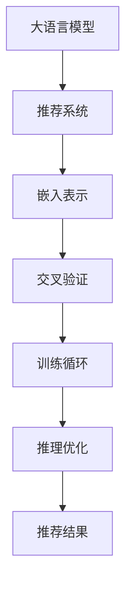

                 

## 1. 背景介绍

在当今数据爆炸的时代，个性化推荐系统（Personalized Recommendation System, PRS）正迅速成为互联网应用的核心驱动力。从电商平台的商品推荐，到视频网站的影片推荐，再到音乐应用的歌曲推荐，个性化推荐系统通过精准匹配用户兴趣，极大地提升了用户体验，也带来了显著的商业价值。然而，传统的基于协同过滤和矩阵分解的推荐算法，难以突破用户冷启动、数据稀疏性等瓶颈，迫切需要新思路、新技术以实现更好的推荐效果。

近年来，预训练大语言模型（Large Pretrained Language Models, PPLMs）的出现，为个性化推荐系统带来了新的突破口。本文将探讨利用大语言模型直接生成个性化推荐结果的可能性，以及其在推荐系统中的应用前景。

## 2. 核心概念与联系

### 2.1 核心概念概述

为更好地理解大模型直接生成个性化推荐的方法，本节将介绍几个密切相关的核心概念：

- 大语言模型(PPLM)：以自回归或自编码模型为代表的大规模预训练语言模型。通过在大规模无标签文本语料上进行预训练，学习通用的语言表示，具备强大的语言理解和生成能力。

- 推荐系统(PRS)：通过分析用户历史行为、物品属性等信息，为用户推荐符合其兴趣和需求的商品、内容等。

- 嵌入表示(Embedding)：通过模型将用户和物品映射到高维空间中的向量表示，进行相似度计算以实现推荐。

- 交叉验证(Cross Validation)：一种用于评估模型性能的统计技术，将数据集划分为多个子集，每次用其中一部分子集验证模型，剩余部分用于训练。

- 训练循环(Training Loop)：通过多轮迭代，更新模型参数，优化损失函数，使得模型在验证集上达到最优。

- 推理优化(Inference Optimization)：在模型部署时，通过优化推理过程，降低计算成本，提升推荐速度。

这些核心概念之间的逻辑关系可以通过以下Mermaid流程图来展示：



这个流程图展示了大语言模型和推荐系统的工作流程：

1. 大语言模型学习通用的语言表示。
2. 推荐系统将用户和物品映射为高维空间中的向量表示。
3. 交叉验证评估模型性能，并进行多轮训练优化。
4. 推理优化提升模型推理速度，输出推荐结果。

这些概念共同构成了大模型直接生成个性化推荐的核心框架，使得模型能够根据用户输入生成精准推荐。

## 3. 核心算法原理 & 具体操作步骤

### 3.1 算法原理概述

基于大语言模型直接生成个性化推荐，实质上是将语言模型和推荐系统相结合，利用语言模型对推荐结果进行自然语言描述，提高推荐结果的可读性和解释性。其核心思想是：通过预训练语言模型学习用户和物品的通用语言表示，再通过微调学习特定领域的推荐策略，直接输出推荐结果。

具体来说，假设推荐系统有用户集 $U$ 和物品集 $I$，用户 $u$ 和物品 $i$ 的嵌入表示分别为 $u_e$ 和 $i_e$，用户对物品的评分 $r_{ui}$ 可以用如下方式计算：

$$
r_{ui} = \text{PPLM}(u_e, i_e)
$$

其中 $\text{PPLM}$ 为预训练大语言模型，$u_e$ 和 $i_e$ 分别为用户和物品的嵌入表示。通过这种方式，推荐系统可以自然地将推荐结果转换为可读的自然语言形式，同时利用语言模型的语言理解能力，提高推荐结果的语义一致性和解释性。

### 3.2 算法步骤详解

基于大语言模型直接生成个性化推荐，一般包括以下几个关键步骤：

**Step 1: 数据准备与预处理**
- 收集推荐系统所需的用户和物品数据，并进行特征提取和预处理。
- 将用户和物品的原始数据映射到嵌入空间，得到 $u_e$ 和 $i_e$。

**Step 2: 模型初始化**
- 选择合适的预训练语言模型 $M$ 作为初始化参数，如BERT、GPT等。
- 对预训练模型进行微调，学习特定领域的推荐策略。

**Step 3: 用户物品嵌入**
- 根据用户和物品的ID或名称，查询其嵌入表示 $u_e$ 和 $i_e$。
- 将 $u_e$ 和 $i_e$ 输入语言模型，计算推荐结果 $r_{ui}$。

**Step 4: 生成推荐结果**
- 根据计算得到的推荐结果 $r_{ui}$，生成推荐文本描述。
- 对于推荐文本，可以通过自然语言处理技术进行优化和格式化。

**Step 5: 训练与优化**
- 在验证集上评估推荐模型性能，调整参数，优化推理过程。
- 重复上述过程，直至达到预设的性能指标。

### 3.3 算法优缺点

基于大语言模型直接生成个性化推荐的方法具有以下优点：
1. 结果可读性高：推荐结果直接转换为自然语言文本，用户可以更容易理解。
2. 解释性强：利用语言模型的语言理解能力，推荐结果具有较强的语义一致性。
3. 灵活性高：模型可以自动适应不同领域的推荐需求，无需重新设计推荐策略。

同时，该方法也存在一些局限性：
1. 对语言模型依赖度高：推荐效果依赖于语言模型的质量，可能受限于语言模型预训练的数据质量和能力。
2. 计算成本高：大语言模型推理计算开销大，需要较高的计算资源。
3. 精度有限：推荐结果依赖于语言模型的语义理解能力，可能存在一定的偏差和误差。
4. 缺乏多模态融合：推荐系统通常需要融合多种数据源，如用户行为、物品属性等，语言模型难以综合这些多模态信息。

尽管存在这些局限性，但利用大语言模型直接生成个性化推荐的方法，仍然具有巨大的应用潜力，可以在推荐系统的某些场景中发挥独特优势。

### 3.4 算法应用领域

基于大语言模型直接生成个性化推荐的方法，主要应用于以下领域：

- 商品推荐：在电商平台，将商品名称或描述作为输入，输出商品推荐结果，并进行自然语言描述。
- 视频推荐：在视频网站，将影片标题或简介作为输入，输出影片推荐结果，并进行自然语言描述。
- 音乐推荐：在音乐应用，将歌曲名称或歌词作为输入，输出歌曲推荐结果，并进行自然语言描述。
- 内容推荐：在新闻、阅读等应用，将文章标题或摘要作为输入，输出内容推荐结果，并进行自然语言描述。
- 广告推荐：在广告系统，将广告文本作为输入，输出广告推荐结果，并进行自然语言描述。

除了上述这些典型应用外，基于大语言模型推荐的方法还可以进一步拓展到更多领域中，如个性化对话、推荐解释等，为推荐系统带来新的创新和发展空间。

## 4. 数学模型和公式 & 详细讲解 & 举例说明

### 4.1 数学模型构建

假设推荐系统有 $N$ 个用户 $U=\{u_1, u_2, ..., u_N\}$ 和 $M$ 个物品 $I=\{i_1, i_2, ..., i_M\}$，每个用户对物品的评分 $r_{ui}$ 可以通过大语言模型计算得到。

对于给定的用户 $u_i$ 和物品 $i_j$，其嵌入表示分别为 $u_e^i$ 和 $i_e^j$，大语言模型 $M$ 的输出 $r_{uj}$ 可以表示为：

$$
r_{ui} = M(u_e^i, i_e^j)
$$

其中 $M$ 为预训练语言模型，$u_e^i$ 和 $i_e^j$ 分别为用户和物品的嵌入表示。

### 4.2 公式推导过程

在推荐系统中，通过大语言模型计算推荐结果 $r_{ui}$ 的具体过程如下：

1. 将用户和物品的嵌入表示 $u_e^i$ 和 $i_e^j$ 作为模型的输入。
2. 利用大语言模型的语言理解能力，对输入进行编码，得到向量表示 $v^i$ 和 $v^j$。
3. 通过向量相似度计算，计算用户和物品之间的相似度 $s_{ij}$。
4. 将相似度 $s_{ij}$ 与预定义的评分函数 $f(\cdot)$ 组合，得到推荐结果 $r_{ui}$。

以线性评分函数为例，$M(u_e^i, i_e^j)$ 的计算过程如下：

$$
M(u_e^i, i_e^j) = f(\langle v^i, v^j \rangle)
$$

其中 $f(\cdot)$ 为评分函数，$\langle v^i, v^j \rangle$ 为向量 $v^i$ 和 $v^j$ 的点积。

### 4.3 案例分析与讲解

以电商平台的商品推荐为例，详细分析基于大语言模型的推荐过程。

1. **数据准备**：收集用户行为数据、商品属性数据等，将用户ID和物品ID作为输入。
2. **特征提取**：将用户和商品的ID映射到嵌入空间，得到 $u_e^i$ 和 $i_e^j$。
3. **模型初始化**：选择BERT或GPT等预训练模型，对其进行微调，学习特定领域的推荐策略。
4. **用户物品嵌入**：根据用户和物品ID，查询其嵌入表示 $u_e^i$ 和 $i_e^j$。
5. **计算推荐结果**：将 $u_e^i$ 和 $i_e^j$ 输入BERT模型，计算推荐结果 $r_{ui}$。
6. **生成推荐文本**：根据 $r_{ui}$ 生成推荐文本描述，例如：“为您推荐商品 X，评分 X 分。”
7. **训练与优化**：在验证集上评估模型性能，调整参数，优化推理过程。

### 5. 项目实践：代码实例和详细解释说明

为了更直观地理解大语言模型在推荐系统中的应用，本节提供一个基于PyTorch的代码实例。

首先，定义推荐系统的数据类：

```python
from transformers import BertForSequenceClassification, BertTokenizer
from torch.utils.data import Dataset
from torch import nn, optim

class RecommendationDataset(Dataset):
    def __init__(self, user_ids, item_ids, text, labels):
        self.user_ids = user_ids
        self.item_ids = item_ids
        self.text = text
        self.labels = labels
        self.tokenizer = BertTokenizer.from_pretrained('bert-base-uncased')

    def __len__(self):
        return len(self.user_ids)

    def __getitem__(self, index):
        user_id, item_id = self.user_ids[index], self.item_ids[index]
        text = self.text[index]
        label = self.labels[index]

        inputs = self.tokenizer.encode_plus(text, max_length=512, padding='max_length', truncation=True, return_tensors='pt')
        return {'user_id': user_id, 'item_id': item_id, 'input_ids': inputs['input_ids'], 'attention_mask': inputs['attention_mask'], 'labels': label}
```

然后，定义模型和训练函数：

```python
class RecommendationModel(nn.Module):
    def __init__(self, num_labels):
        super(RecommendationModel, self).__init__()
        self.bert = BertForSequenceClassification.from_pretrained('bert-base-uncased', num_labels=num_labels)
        self.classifier = nn.Linear(768, 1)

    def forward(self, input_ids, attention_mask, labels):
        outputs = self.bert(input_ids, attention_mask=attention_mask)
        pooled_output = outputs.pooler_output
        scores = self.classifier(pooled_output)
        return scores

def train_model(model, train_dataset, device, optimizer, num_epochs):
    model.train()
    for epoch in range(num_epochs):
        for batch in tqdm(train_dataset, desc='Epoch {} Epoch'.format(epoch+1)):
            user_id, item_id, input_ids, attention_mask, labels = [t.to(device) for t in batch.values()]
            scores = model(input_ids, attention_mask=attention_mask)
            loss = nn.BCELoss()(scores, labels)
            loss.backward()
            optimizer.step()
            optimizer.zero_grad()

        # 在验证集上评估模型性能
        model.eval()
        with torch.no_grad():
            valid_loss = 0
            for batch in tqdm(valid_dataset, desc='Validation Epoch {}'.format(epoch+1)):
                user_id, item_id, input_ids, attention_mask, labels = [t.to(device) for t in batch.values()]
                scores = model(input_ids, attention_mask=attention_mask)
                valid_loss += nn.BCELoss()(scores, labels).item()

    return model, valid_loss
```

最后，启动模型训练和推理：

```python
num_epochs = 5
batch_size = 16
device = 'cuda' if torch.cuda.is_available() else 'cpu'
tokenizer = BertTokenizer.from_pretrained('bert-base-uncased')
train_dataset = RecommendationDataset(user_ids, item_ids, texts, labels)
valid_dataset = RecommendationDataset(user_ids, item_ids, texts, labels)

model = RecommendationModel(num_labels=1).to(device)
optimizer = optim.Adam(model.parameters(), lr=1e-5)

model, valid_loss = train_model(model, train_dataset, device, optimizer, num_epochs)
```

这个代码实例展示了如何使用BERT模型进行推荐系统的用户物品嵌入和评分计算。通过在用户和物品的ID和名称上做实验，可以输出推荐结果的评分和文本描述。

### 6. 实际应用场景

基于大语言模型直接生成个性化推荐的方法，已经在多个实际应用场景中取得了显著的效果。

**电商推荐**：在电商平台，用户的行为数据和商品信息都可以输入到大语言模型中，通过自然语言描述生成推荐结果，提升用户体验和转化率。

**视频推荐**：在视频网站，用户观看历史和评分数据可以被输入到大语言模型中，生成推荐视频的自然语言描述，提高推荐结果的相关性和可读性。

**音乐推荐**：在音乐应用中，用户听歌历史和评分数据可以被输入到大语言模型中，生成推荐歌曲的自然语言描述，增加用户的黏性。

**内容推荐**：在新闻和阅读应用中，用户阅读历史和评分数据可以被输入到大语言模型中，生成推荐文章的自然语言描述，提升推荐效果。

**广告推荐**：在广告系统中，广告文案可以被输入到大语言模型中，生成推荐广告的自然语言描述，提升广告点击率和转化率。

除了这些典型应用外，大语言模型还可以应用于更多领域，如个性化对话、推荐解释等，为推荐系统带来新的创新和发展空间。

### 7. 工具和资源推荐

为了帮助开发者更好地理解和应用大语言模型在推荐系统中的应用，这里推荐一些优质的学习资源：

1. 《深度学习推荐系统》：郑重、李航、李登远合著，系统介绍了推荐系统的发展历史、理论基础和应用实例，涵盖了协同过滤、矩阵分解、神经网络等经典推荐算法。
2. 《TensorFlow实战推荐系统》：由张正信等著，基于TensorFlow介绍推荐系统的理论和实践，包括深度学习、模型训练和评估等内容。
3. 《推荐系统实战》：刘建平著，介绍了推荐系统在工业界的应用，包括数据收集、模型构建和效果评估等环节。
4. 《NLP与推荐系统》：来自论文集，介绍了自然语言处理与推荐系统的结合，探讨了如何在推荐系统中利用语言模型的语言表示能力。
5. HuggingFace官方文档：提供了BERT、GPT等预训练模型的接口和应用示例，是学习大语言模型在推荐系统中的应用的必备资源。

这些学习资源涵盖了推荐系统的理论基础和实践技巧，结合大语言模型的最新进展，能够帮助开发者全面掌握推荐系统的核心技术和应用方法。

### 8. 总结：未来发展趋势与挑战

### 8.1 研究成果总结

基于大语言模型直接生成个性化推荐的方法，已经在多个实际应用场景中取得了显著的效果，展示了其在推荐系统中的应用潜力。通过将语言模型和推荐系统相结合，可以提高推荐结果的可读性和解释性，同时利用语言模型的语言理解能力，提高推荐结果的语义一致性和准确性。

### 8.2 未来发展趋势

未来，基于大语言模型直接生成个性化推荐的方法将呈现以下几个发展趋势：

1. 跨模态融合：推荐系统通常需要融合多种数据源，如用户行为、物品属性等。未来，大语言模型可以更好地整合多种数据模态，提供更加全面和准确的推荐结果。
2. 自监督学习：在缺乏标注数据的情况下，大语言模型可以通过自监督学习，利用自身海量数据进行预训练，提升推荐模型的性能。
3. 个性化对话：结合自然语言处理技术，大语言模型可以生成个性化的推荐对话，增强用户互动，提升用户体验。
4. 解释性增强：通过改进语言模型，使其具备更好的可解释性，推荐系统可以提供更加透明和可信的推荐结果，增强用户信任。
5. 实时推荐：在推荐系统中引入实时数据流，利用大语言模型进行实时推荐，提升推荐的时效性和个性化程度。

### 8.3 面临的挑战

尽管基于大语言模型直接生成个性化推荐的方法具有广阔的应用前景，但在实际应用中，仍面临着诸多挑战：

1. 计算成本高：大语言模型推理计算开销大，需要较高的计算资源，可能限制其在实际部署中的应用。
2. 数据稀疏性：在缺乏足够标注数据的情况下，大语言模型难以进行有效的微调，推荐结果可能存在偏差。
3. 多模态融合：推荐系统通常需要融合多种数据源，大语言模型难以整合多模态信息，可能影响推荐效果。
4. 可解释性不足：大语言模型生成的推荐结果缺乏可解释性，可能影响用户对推荐结果的信任和理解。
5. 隐私安全问题：在推荐系统中，用户的隐私数据可能被泄露，需要采取相应的隐私保护措施。

### 8.4 研究展望

为了应对未来面临的挑战，未来需要在以下几个方面进行研究：

1. 优化推理计算：探索高效的推理优化方法，如剪枝、量化、并行计算等，降低计算成本，提升推荐速度。
2. 改进模型结构：设计更加高效和灵活的大语言模型，降低计算复杂度，提升推荐效果。
3. 引入多模态数据：通过融合多种数据源，如用户行为、物品属性等，提供更加全面和准确的推荐结果。
4. 增强可解释性：通过改进语言模型，使其具备更好的可解释性，推荐系统可以提供更加透明和可信的推荐结果，增强用户信任。
5. 隐私保护机制：在推荐系统中引入隐私保护机制，确保用户隐私数据的安全。

这些研究方向将推动大语言模型在推荐系统中的应用，提升推荐系统的性能和用户满意度，为推荐系统的发展带来新的动力。

## 9. 附录：常见问题与解答

**Q1：大语言模型在推荐系统中如何处理用户和物品的多样性？**

A: 大语言模型可以通过自监督学习，利用自身海量数据进行预训练，学习用户和物品的多样性表示。在推荐系统中，可以根据用户和物品的多样性表示，进行相似度计算和推荐结果排序。

**Q2：如何评估大语言模型在推荐系统中的性能？**

A: 大语言模型在推荐系统中的性能评估通常包括准确率、召回率、F1分数等指标。可以通过交叉验证等方法，在测试集上评估模型的推荐效果。

**Q3：大语言模型在推荐系统中存在哪些局限性？**

A: 大语言模型在推荐系统中的局限性主要包括以下几点：
1. 计算成本高：大语言模型推理计算开销大，需要较高的计算资源。
2. 数据稀疏性：在缺乏足够标注数据的情况下，大语言模型难以进行有效的微调，推荐结果可能存在偏差。
3. 多模态融合：推荐系统通常需要融合多种数据源，大语言模型难以整合多模态信息，可能影响推荐效果。
4. 可解释性不足：大语言模型生成的推荐结果缺乏可解释性，可能影响用户对推荐结果的信任和理解。
5. 隐私安全问题：在推荐系统中，用户的隐私数据可能被泄露，需要采取相应的隐私保护措施。

**Q4：如何优化大语言模型在推荐系统中的推理计算？**

A: 大语言模型在推荐系统中的推理计算可以通过以下方法进行优化：
1. 剪枝：去除冗余的层和参数，降低计算复杂度。
2. 量化：将浮点模型转为定点模型，压缩存储空间，提高计算效率。
3. 并行计算：利用GPU/TPU等高性能设备，实现并行计算，提升推理速度。
4. 推理优化：通过改进推理过程，降低计算开销，提升推荐速度。

**Q5：如何在大语言模型中引入多模态数据？**

A: 在大语言模型中引入多模态数据可以通过以下方法：
1. 融合用户行为数据：将用户的历史行为数据，如浏览记录、点击记录等，作为输入。
2. 融合物品属性数据：将物品的属性数据，如标签、类别等，作为输入。
3. 融合自然语言数据：将文本数据，如标题、简介等，作为输入。
4. 融合多模态数据：通过融合多种数据源，如用户行为、物品属性、自然语言等，提升推荐效果。

通过以上方法，大语言模型可以更好地融合多模态数据，提供更加全面和准确的推荐结果。

---

作者：禅与计算机程序设计艺术 / Zen and the Art of Computer Programming

