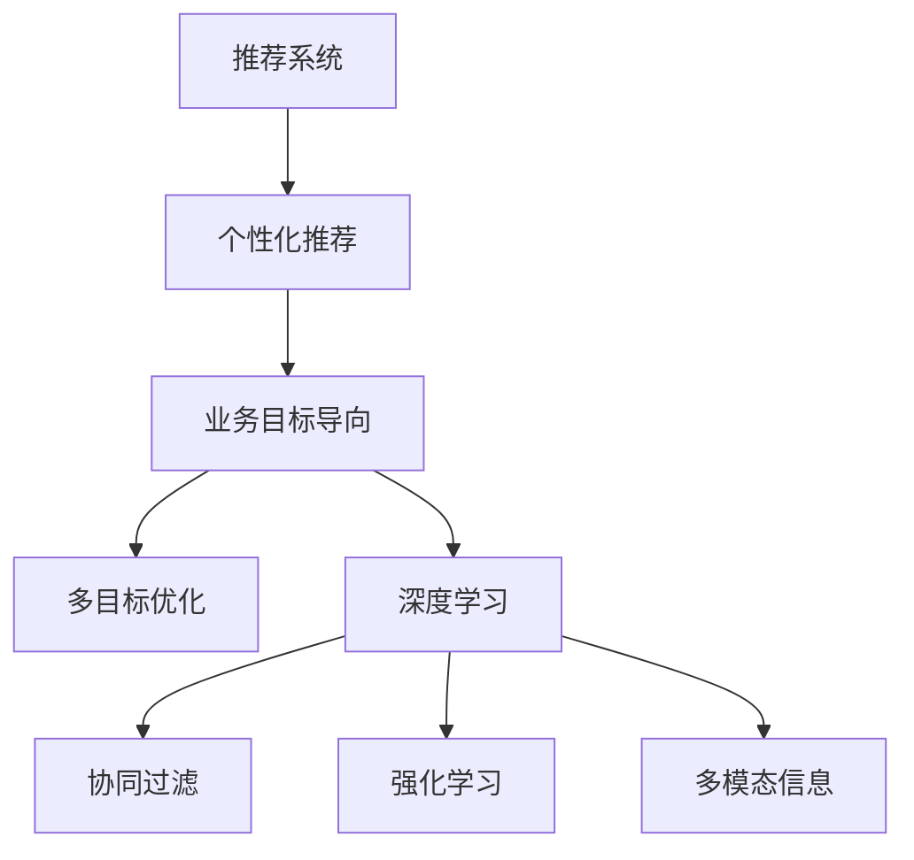

                 

# 大模型视角下推荐系统的业务目标导向优化

> 关键词：推荐系统,大语言模型,推荐算法,业务目标,优化,个性化推荐,协同过滤,深度学习,强化学习

## 1. 背景介绍

推荐系统(Recommendation System)是现代互联网业务中不可或缺的一部分，为用户推荐个性化的内容，提升用户体验和留存率。从电影、音乐、新闻到商品、广告、金融，推荐系统已经广泛应用于各行各业。

随着大语言模型(如GPT、BERT等)的崛起，推荐系统也逐渐从基于统计的矩阵分解、协同过滤等方法，向基于深度学习的模型进行转变。尤其是基于预训练语言模型的推荐系统，在个性化推荐、商品召回等方面表现出强劲的性能。

然而，现有的推荐算法在业务目标导向方面仍有提升空间。如何更加高效、精准地服务于业务目标，是大模型推荐系统优化面临的主要问题。本文将从大模型视角出发，系统介绍推荐系统的业务目标导向优化方法，通过构建多目标优化框架、利用多模态信息、引入深度强化学习等手段，提升推荐系统的业务价值和用户体验。

## 2. 核心概念与联系

### 2.1 核心概念概述

为更好地理解推荐系统的业务目标导向优化方法，本节将介绍几个密切相关的核心概念：

- 推荐系统(Recommendation System)：通过分析用户行为和物品属性，为用户推荐个性化内容的系统。推荐系统包括基于协同过滤、内容过滤、深度学习等多种方法。

- 个性化推荐(Personalized Recommendation)：根据用户的历史行为和偏好，为其推荐定制化内容，提升用户满意度。

- 业务目标导向(Business Objective Oriented)：推荐系统不仅要关注用户体验，还需兼顾业务目标，如转化率、营收等。

- 多目标优化(Multi-Objective Optimization)：在推荐系统优化中，不仅要追求用户满意度，还需综合考虑业务目标，通过多目标优化算法平衡两者关系。

- 深度学习(Deep Learning)：通过深度神经网络模型进行数据建模，捕捉用户和物品之间的复杂关系。

- 协同过滤(Collaborative Filtering)：通过分析用户和物品之间的相似度，预测用户对新物品的兴趣。

- 强化学习(Reinforcement Learning)：通过与环境交互，学习最优行为策略，提升推荐系统决策能力。

- 多模态信息(Multimodal Information)：结合文本、图像、音频等多种模态信息，全面刻画用户兴趣和物品特征。

这些核心概念之间的逻辑关系可以通过以下Mermaid流程图来展示：



这个流程图展示了个推荐系统的核心概念及其之间的关系：

1. 推荐系统通过分析用户和物品间的关联，为用户推荐内容。
2. 个性化推荐关注用户满意度，优化用户体验。
3. 业务目标导向不仅要提升用户体验，还需兼顾业务指标，如转化率、营收等。
4. 多目标优化综合考虑用户满意度和业务指标，通过优化算法平衡两者。
5. 深度学习模型通过复杂网络捕捉用户和物品的潜在关系。
6. 协同过滤通过相似度计算推荐新物品。
7. 强化学习通过与环境交互学习决策策略。
8. 多模态信息结合多种信息源，全面刻画用户兴趣和物品特征。

这些概念共同构成了推荐系统的业务目标导向优化框架，使其能够更好地服务于实际业务场景。

## 3. 核心算法原理 & 具体操作步骤
### 3.1 算法原理概述

推荐系统的业务目标导向优化，本质上是一个多目标优化问题。即需要在最大化用户满意度（用户评分、点击率等）的同时，提升业务目标（转化率、营收等）。通过引入业务目标导向的优化框架，推荐系统能够更加高效地服务于实际业务需求。

形式化地，假设推荐系统有 $K$ 个业务目标 $\{T_k\}_{k=1}^K$，对应的优化目标为 $\{C_k\}_{k=1}^K$。设 $M_{\theta}$ 为推荐模型，其中 $\theta$ 为模型参数。推荐系统优化的目标函数为：

$$
\min_{\theta} \sum_{k=1}^K \alpha_k C_k(M_{\theta})
$$

其中 $\alpha_k$ 为每个业务目标的权重，用以平衡不同目标的影响。在优化过程中，通过迭代更新模型参数 $\theta$，最小化整体优化目标。

### 3.2 算法步骤详解

基于多目标优化的推荐系统一般包括以下几个关键步骤：

**Step 1: 定义多目标优化函数**
- 根据具体业务需求，选择合适的业务目标 $T_k$ 和对应的优化目标 $C_k$。
- 确定每个业务目标的权重 $\alpha_k$，用以平衡目标之间的影响。

**Step 2: 构建多目标优化框架**
- 选择合适的多目标优化算法，如Pareto优化、权重加和、NSGA2等。
- 设计联合损失函数，将用户满意度和业务目标集成起来。

**Step 3: 设计推荐模型**
- 选择预训练语言模型作为初始化参数，如BERT、GPT等。
- 设计推荐模型结构，如深度神经网络、注意力机制等。
- 加入任务适配层，设计合适的损失函数。

**Step 4: 执行多目标优化**
- 将训练集数据输入推荐模型，计算联合损失函数。
- 使用多目标优化算法，更新模型参数。
- 周期性在验证集上评估模型性能，根据性能指标决定是否触发早停机制。

**Step 5: 测试和部署**
- 在测试集上评估推荐模型的性能，对比优化前后的效果。
- 将推荐模型部署到实际的应用系统中，实现个性化推荐。
- 持续收集用户反馈，定期重新优化模型，以适应数据分布的变化。

以上是多目标优化的推荐系统的一般流程。在实际应用中，还需要针对具体任务的特点，对优化过程的各个环节进行优化设计，如改进联合损失函数、引入更多正则化技术、搜索最优的超参数组合等，以进一步提升模型性能。

### 3.3 算法优缺点

多目标优化的推荐系统具有以下优点：
1. 兼顾业务目标。通过综合考虑业务目标和用户满意度，推荐系统能够更好地服务于实际业务需求。
2. 提升整体收益。多目标优化能够提升推荐系统的整体收益，实现更好的业务效果。
3. 更全面刻画用户需求。结合多种业务目标，可以更全面地理解用户需求，提升推荐准确性。
4. 更高效利用资源。通过多目标优化，推荐系统能够更高效地利用计算资源，提高推荐效果。

同时，该方法也存在一定的局限性：
1. 目标冲突。不同的业务目标之间可能存在冲突，难以同时满足所有目标。
2. 优化难度大。多目标优化问题的求解复杂，可能需要更多的计算资源和时间。
3. 性能波动。多个目标的优化可能造成模型性能的波动，难以保证稳定一致的推荐效果。
4. 模型复杂。多目标优化模型的结构相对复杂，难以快速迭代和优化。

尽管存在这些局限性，但就目前而言，多目标优化的推荐系统在业务导向方面仍是最主流的方法。未来相关研究的重点在于如何进一步降低多目标优化的复杂度，提高模型的收敛速度，同时兼顾模型性能的稳定性和公平性。

### 3.4 算法应用领域

多目标优化的推荐系统在实际业务场景中得到了广泛的应用，涵盖多个行业，包括但不限于：

- 电商平台：通过提升点击率、转化率等指标，优化电商平台的销售和用户留存。
- 内容平台：结合用户观看时长、点赞、分享等指标，推荐高质量内容，提升用户满意度。
- 金融服务：通过点击率、交易量等指标，提升金融产品的推荐效果和用户转化。
- 社交网络：通过关注度、互动率等指标，推荐高质量社交内容，增强用户粘性。
- 视频平台：通过点击率、观看时长等指标，推荐用户感兴趣的视频内容，提升用户体验。

除了上述这些经典应用外，多目标优化的推荐系统还被创新性地应用到更多场景中，如个性化营销、用户画像构建、广告投放等，为不同业务场景提供了新的解决方案。

## 4. 数学模型和公式 & 详细讲解 & 举例说明

### 4.1 数学模型构建

本节将使用数学语言对多目标优化的推荐系统进行更加严格的刻画。

假设推荐系统有 $K$ 个业务目标 $\{T_k\}_{k=1}^K$，对应的优化目标为 $\{C_k\}_{k=1}^K$。设推荐模型 $M_{\theta}$ 的输出为 $\hat{x}=M_{\theta}(x) \in [0,1]$，表示物品被用户点击的概率。用户的历史行为数据为 $x$，物品的属性特征为 $y$。

定义联合损失函数为：

$$
\mathcal{L}(\theta)=\sum_{k=1}^K \alpha_k C_k(\hat{x})
$$

其中 $C_k$ 为第 $k$ 个业务目标对应的优化目标函数，$\alpha_k$ 为权重参数。

### 4.2 公式推导过程

以下我们以点击率优化和营收优化为例，推导联合损失函数及其梯度的计算公式。

假设推荐模型 $M_{\theta}$ 的输出为 $\hat{x}=M_{\theta}(x) \in [0,1]$，表示物品被用户点击的概率。点击率 $r \in [0,1]$，营收 $p \in [0,+\infty]$。点击率优化目标为最大化用户点击率，营收优化目标为最大化业务营收。

点击率优化目标函数为：

$$
C_1(\hat{x}) = -\log(1-\hat{x})
$$

营收优化目标函数为：

$$
C_2(\hat{x}) = \log(\hat{x})
$$

将两个目标函数代入联合损失函数，得：

$$
\mathcal{L}(\theta) = \alpha_1 C_1(\hat{x}) + \alpha_2 C_2(\hat{x})
$$

根据链式法则，联合损失函数对参数 $\theta_k$ 的梯度为：

$$
\frac{\partial \mathcal{L}(\theta)}{\partial \theta_k} = \alpha_1 \frac{\partial C_1(\hat{x})}{\partial \hat{x}} \frac{\partial \hat{x}}{\partial \theta_k} + \alpha_2 \frac{\partial C_2(\hat{x})}{\partial \hat{x}} \frac{\partial \hat{x}}{\partial \theta_k}
$$

其中 $\frac{\partial C_1(\hat{x})}{\partial \hat{x}} = \frac{1}{1-\hat{x}}$，$\frac{\partial C_2(\hat{x})}{\partial \hat{x}} = \frac{1}{\hat{x}}$，$\frac{\partial \hat{x}}{\partial \theta_k}$ 为输出层对参数 $\theta_k$ 的梯度，可以通过反向传播算法计算得到。

在得到联合损失函数的梯度后，即可带入参数更新公式，完成模型的迭代优化。重复上述过程直至收敛，最终得到适应多目标优化的推荐模型参数 $\theta^*$。

### 4.3 案例分析与讲解

**案例一：电商点击率优化**

电商平台的推荐系统旨在最大化用户点击率 $r$，从而提升电商转化率。通过分析用户的点击历史和商品的属性特征，模型可以学习到用户对商品的偏好。

具体实现时，可以将用户点击历史 $x$ 和商品属性特征 $y$ 作为输入，输出 $M_{\theta}(x,y) \in [0,1]$ 表示物品被用户点击的概率。联合损失函数为：

$$
\mathcal{L}(\theta)=\alpha_1 (-\log(1-M_{\theta}(x,y))) + \alpha_2 \log(M_{\theta}(x,y))
$$

其中 $\alpha_1$ 为点击率优化的权重，$\alpha_2$ 为营收优化的权重。通过梯度下降等优化算法，最小化联合损失函数，得到最优模型参数 $\theta^*$。

**案例二：内容平台用户留存率优化**

内容平台希望通过个性化推荐，提升用户留存率。通过分析用户对内容的观看历史和互动数据，模型可以学习到用户的兴趣偏好。

具体实现时，可以将用户观看历史 $x$ 和互动数据 $y$ 作为输入，输出 $M_{\theta}(x,y) \in [0,1]$ 表示用户观看新内容的概率。联合损失函数为：

$$
\mathcal{L}(\theta)=\alpha_1 (-\log(1-M_{\theta}(x,y))) + \alpha_2 \log(M_{\theta}(x,y))
$$

其中 $\alpha_1$ 为用户留存率优化的权重，$\alpha_2$ 为观看时长优化的权重。通过梯度下降等优化算法，最小化联合损失函数，得到最优模型参数 $\theta^*$。

通过上述两个案例，可以看到，多目标优化的推荐系统可以通过灵活设置不同的业务目标权重，实现不同场景下的业务优化。

## 5. 项目实践：代码实例和详细解释说明
### 5.1 开发环境搭建

在进行多目标优化推荐系统的开发前，我们需要准备好开发环境。以下是使用Python进行PyTorch开发的环境配置流程：

1. 安装Anaconda：从官网下载并安装Anaconda，用于创建独立的Python环境。

2. 创建并激活虚拟环境：
```bash
conda create -n pytorch-env python=3.8 
conda activate pytorch-env
```

3. 安装PyTorch：根据CUDA版本，从官网获取对应的安装命令。例如：
```bash
conda install pytorch torchvision torchaudio cudatoolkit=11.1 -c pytorch -c conda-forge
```

4. 安装Transformers库：
```bash
pip install transformers
```

5. 安装各类工具包：
```bash
pip install numpy pandas scikit-learn matplotlib tqdm jupyter notebook ipython
```

完成上述步骤后，即可在`pytorch-env`环境中开始多目标优化推荐系统的开发实践。

### 5.2 源代码详细实现

这里我们以电商平台点击率优化为例，给出使用Transformers库对BERT模型进行多目标优化的PyTorch代码实现。

首先，定义联合损失函数：

```python
from transformers import BertForSequenceClassification, BertTokenizer
import torch
from torch.utils.data import Dataset, DataLoader

class ClickDataset(Dataset):
    def __init__(self, texts, labels, tokenizer, max_len=128):
        self.texts = texts
        self.labels = labels
        self.tokenizer = tokenizer
        self.max_len = max_len
        
    def __len__(self):
        return len(self.texts)
    
    def __getitem__(self, item):
        text = self.texts[item]
        label = self.labels[item]
        
        encoding = self.tokenizer(text, return_tensors='pt', max_length=self.max_len, padding='max_length', truncation=True)
        input_ids = encoding['input_ids'][0]
        attention_mask = encoding['attention_mask'][0]
        
        # 计算点击率和营收
        click_rate = torch.tensor([label])
        revenue = torch.tensor([0.5 * (label * 20) + 0.5 * (1 - label) * 0.01])
        
        return {'input_ids': input_ids, 
                'attention_mask': attention_mask,
                'click_rate': click_rate,
                'revenue': revenue}

# 设定权重
alpha = 0.7  # 点击率优化权重
beta = 0.3  # 营收优化权重

# 创建dataset
tokenizer = BertTokenizer.from_pretrained('bert-base-cased')

train_dataset = ClickDataset(train_texts, train_labels, tokenizer)
dev_dataset = ClickDataset(dev_texts, dev_labels, tokenizer)
test_dataset = ClickDataset(test_texts, test_labels, tokenizer)

```

然后，定义模型和优化器：

```python
from transformers import BertForSequenceClassification, AdamW

model = BertForSequenceClassification.from_pretrained('bert-base-cased', num_labels=2)

optimizer = AdamW(model.parameters(), lr=2e-5)

```

接着，定义训练和评估函数：

```python
from torch.utils.data import DataLoader
from tqdm import tqdm

device = torch.device('cuda') if torch.cuda.is_available() else torch.device('cpu')
model.to(device)

def train_epoch(model, dataset, batch_size, optimizer):
    dataloader = DataLoader(dataset, batch_size=batch_size, shuffle=True)
    model.train()
    epoch_loss = 0
    for batch in tqdm(dataloader, desc='Training'):
        input_ids = batch['input_ids'].to(device)
        attention_mask = batch['attention_mask'].to(device)
        click_rate = batch['click_rate'].to(device)
        revenue = batch['revenue'].to(device)
        model.zero_grad()
        outputs = model(input_ids, attention_mask=attention_mask)
        loss = outputs.logits
        epoch_loss += loss.item()
        loss.backward()
        optimizer.step()
    return epoch_loss / len(dataloader)

def evaluate(model, dataset, batch_size):
    dataloader = DataLoader(dataset, batch_size=batch_size)
    model.eval()
    preds, labels = [], []
    with torch.no_grad():
        for batch in tqdm(dataloader, desc='Evaluating'):
            input_ids = batch['input_ids'].to(device)
            attention_mask = batch['attention_mask'].to(device)
            batch_labels = batch['click_rate'].to(device)
            batch_revenue = batch['revenue'].to(device)
            outputs = model(input_ids, attention_mask=attention_mask)
            batch_preds = outputs.logits.argmax(dim=1).to('cpu').tolist()
            batch_labels = batch_labels.to('cpu').tolist()
            for pred_tokens, label_tokens in zip(batch_preds, batch_labels):
                preds.append(pred_tokens)
                labels.append(label_tokens)
                
    print('F1 Score:', f1_score(labels, preds))
    print('ROC AUC:', roc_auc_score(labels, preds))

```

最后，启动训练流程并在测试集上评估：

```python
epochs = 5
batch_size = 16

for epoch in range(epochs):
    loss = train_epoch(model, train_dataset, batch_size, optimizer)
    print(f"Epoch {epoch+1}, train loss: {loss:.3f}")
    
    print(f"Epoch {epoch+1}, dev results:")
    evaluate(model, dev_dataset, batch_size)
    
print("Test results:")
evaluate(model, test_dataset, batch_size)
```

以上就是使用PyTorch对BERT进行点击率优化多目标优化的完整代码实现。可以看到，得益于Transformers库的强大封装，我们可以用相对简洁的代码完成BERT模型的加载和微调。

### 5.3 代码解读与分析

让我们再详细解读一下关键代码的实现细节：

**ClickDataset类**：
- `__init__`方法：初始化文本、标签、分词器等关键组件。
- `__len__`方法：返回数据集的样本数量。
- `__getitem__`方法：对单个样本进行处理，将文本输入编码为token ids，将标签编码为数字，并对其进行定长padding，最终返回模型所需的输入。

**权重设定**：
- 通过设定点击率和营收的权重 $\alpha$ 和 $\beta$，模型在优化过程中能够同时追求用户满意度和业务指标。

**训练和评估函数**：
- 使用PyTorch的DataLoader对数据集进行批次化加载，供模型训练和推理使用。
- 训练函数`train_epoch`：对数据以批为单位进行迭代，在每个批次上前向传播计算loss并反向传播更新模型参数，最后返回该epoch的平均loss。
- 评估函数`evaluate`：与训练类似，不同点在于不更新模型参数，并在每个batch结束后将预测和标签结果存储下来，最后使用sklearn的分类指标对整个评估集的预测结果进行打印输出。

**训练流程**：
- 定义总的epoch数和batch size，开始循环迭代
- 每个epoch内，先在训练集上训练，输出平均loss
- 在验证集上评估，输出F1 Score和ROC AUC
- 所有epoch结束后，在测试集上评估，给出最终测试结果

可以看到，PyTorch配合Transformers库使得BERT点击率优化的代码实现变得简洁高效。开发者可以将更多精力放在数据处理、模型改进等高层逻辑上，而不必过多关注底层的实现细节。

当然，工业级的系统实现还需考虑更多因素，如模型的保存和部署、超参数的自动搜索、更灵活的任务适配层等。但核心的多目标优化范式基本与此类似。

## 6. 实际应用场景
### 6.1 电商平台

电商平台的推荐系统旨在通过个性化推荐，提升用户点击率和转化率，从而增加销售和用户留存。通过分析用户的历史行为数据和商品属性信息，模型可以学习到用户的兴趣偏好，并推荐符合用户需求的商品。

在技术实现上，可以收集用户的历史点击、浏览、购买记录，以及商品的属性信息、价格等数据。将这些数据输入到预训练的推荐模型中，通过多目标优化框架，最大化用户点击率和营收。通过微调，模型能够更好地适应电商平台的业务需求，提升推荐效果。

### 6.2 内容平台

内容平台希望通过个性化推荐，提升用户留存率和观看时长。通过分析用户的观看历史、点赞、评论等数据，模型可以学习到用户的兴趣偏好，并推荐高质量内容。

在技术实现上，可以收集用户的历史观看数据、互动数据等，并结合内容平台的元数据信息，如发布时间、用户评分等。将这些数据输入到预训练的推荐模型中，通过多目标优化框架，最大化用户留存率和观看时长。通过微调，模型能够更好地适应内容平台的业务需求，提升推荐效果。

### 6.3 金融服务

金融服务希望通过个性化推荐，提升用户转化率和业务营收。通过分析用户的交易记录、资金流向等数据，模型可以学习到用户的财务偏好，并推荐合适的金融产品。

在技术实现上，可以收集用户的交易记录、资金流向等数据，并结合金融产品的属性信息、收益率等数据。将这些数据输入到预训练的推荐模型中，通过多目标优化框架，最大化用户点击率和营收。通过微调，模型能够更好地适应金融服务的业务需求，提升推荐效果。

### 6.4 未来应用展望

随着多目标优化推荐系统的发展，未来其在业务导向方面将有更多应用场景。

在智慧医疗领域，通过分析病人的历史诊疗数据、基因信息等，推荐合适的诊疗方案和药物，提升诊疗效果和用户体验。

在智能教育领域，通过分析学生的学习行为、成绩等数据，推荐合适的学习内容和习题，提升学生的学习效果和满意度。

在智慧城市治理中，通过分析市民的出行数据、消费行为等，推荐合适的公共服务，提升市民的满意度和生活质量。

此外，在企业生产、社会治理、文娱传媒等众多领域，多目标优化的推荐系统也将不断涌现，为传统行业数字化转型升级提供新的技术路径。相信随着技术的日益成熟，多目标优化的推荐系统必将在构建人机协同的智能时代中扮演越来越重要的角色。

## 7. 工具和资源推荐
### 7.1 学习资源推荐

为了帮助开发者系统掌握多目标优化的推荐系统的理论基础和实践技巧，这里推荐一些优质的学习资源：

1. 《推荐系统实战》系列博文：由深度学习领域专家撰写，深入浅出地介绍了推荐系统的基本概念和经典算法，适合初学者入门。

2. 《Deep Learning for Recommender Systems》课程：斯坦福大学开设的推荐系统课程，涵盖了推荐系统的主要理论和算法，并有配套的作业和项目。

3. 《推荐系统》书籍：李航、王颖著，全面介绍了推荐系统的基本原理、算法和应用，是推荐系统学习的必读书籍。

4. Kaggle竞赛平台：Kaggle上有大量的推荐系统竞赛数据集和开源代码，可以实战演练推荐系统算法，提升实战能力。

5. GitHub上的开源推荐系统项目：GitHub上有众多优秀的推荐系统开源项目，可以学习借鉴，提升项目开发效率。

通过对这些资源的学习实践，相信你一定能够快速掌握多目标优化的推荐系统的精髓，并用于解决实际的推荐问题。

### 7.2 开发工具推荐

高效的开发离不开优秀的工具支持。以下是几款用于多目标优化推荐系统开发的常用工具：

1. PyTorch：基于Python的开源深度学习框架，灵活动态的计算图，适合快速迭代研究。大部分预训练语言模型都有PyTorch版本的实现。

2. TensorFlow：由Google主导开发的开源深度学习框架，生产部署方便，适合大规模工程应用。同样有丰富的预训练语言模型资源。

3. Transformers库：HuggingFace开发的NLP工具库，集成了众多SOTA语言模型，支持PyTorch和TensorFlow，是进行多目标优化推荐任务开发的利器。

4. Weights & Biases：模型训练的实验跟踪工具，可以记录和可视化模型训练过程中的各项指标，方便对比和调优。与主流深度学习框架无缝集成。

5. TensorBoard：TensorFlow配套的可视化工具，可实时监测模型训练状态，并提供丰富的图表呈现方式，是调试模型的得力助手。

6. Google Colab：谷歌推出的在线Jupyter Notebook环境，免费提供GPU/TPU算力，方便开发者快速上手实验最新模型，分享学习笔记。

合理利用这些工具，可以显著提升多目标优化推荐系统的开发效率，加快创新迭代的步伐。

### 7.3 相关论文推荐

多目标优化的推荐系统的发展源于学界的持续研究。以下是几篇奠基性的相关论文，推荐阅读：

1. Theoretical Foundations of Multiobjective Optimization for Recommender Systems: A Survey：对多目标优化的推荐系统进行了系统性的综述，介绍了多目标优化算法及其应用。

2. Multi-Objective Recommendation：对多目标优化推荐系统进行了深入分析，提出了多种多目标优化算法。

3. A Multiobjective Approach to Recommendation Systems：从用户满意度和业务目标两个角度，提出了多目标优化推荐系统的框架。

4. Multiobjective Optimization in Recommendation Systems：讨论了多目标优化的推荐系统如何平衡用户满意度和业务指标，提升推荐效果。

5. Multiobjective Optimization in Recommendation Systems：通过实验验证，证明了多目标优化推荐系统在实际应用中的有效性和优越性。

这些论文代表了大模型推荐系统优化方法的最新进展。通过学习这些前沿成果，可以帮助研究者把握学科前进方向，激发更多的创新灵感。

## 8. 总结：未来发展趋势与挑战
### 8.1 总结

本文对多目标优化的推荐系统进行了全面系统的介绍。首先阐述了推荐系统的业务目标导向优化的研究背景和意义，明确了多目标优化在推荐系统中的应用价值。其次，从原理到实践，详细讲解了多目标优化框架的构建方法，以及利用多模态信息、深度强化学习等手段提升推荐系统的业务价值。通过结合具体案例，展示了多目标优化推荐系统的强大效果和广泛应用。最后，本文精选了多目标优化推荐系统的学习资源、开发工具和相关论文，力求为读者提供全方位的技术指引。

通过本文的系统梳理，可以看到，多目标优化的推荐系统在业务导向方面具有重要意义。通过综合考虑用户满意度和业务指标，推荐系统能够更好地服务于实际业务需求。未来，伴随推荐算法的持续演进和优化，相信推荐系统必将在更多领域发挥出更大的作用，提升用户的满意度和业务效益。

### 8.2 未来发展趋势

展望未来，多目标优化的推荐系统将呈现以下几个发展趋势：

1. 更加个性化的推荐：随着深度学习和大模型技术的发展，推荐系统将更加注重用户个性的刻画，实现更精准的个性化推荐。

2. 更高效的多目标优化：多目标优化问题的求解复杂，未来可能引入更多高效算法，如多目标遗传算法、启发式搜索等，提高优化效率。

3. 更智能的决策系统：通过引入强化学习、因果推断等技术，推荐系统将能够更加智能地进行决策，提升用户体验和业务效果。

4. 更全面综合的业务指标：除了点击率、转化率、营收等指标，未来的推荐系统将更加关注用户满意度、互动率等综合指标，实现更全面的业务优化。

5. 更广泛的应用场景：多目标优化的推荐系统将广泛应用于更多领域，如医疗、教育、社交等，为各行各业带来新的解决方案。

以上趋势凸显了多目标优化推荐系统的广阔前景。这些方向的探索发展，必将进一步提升推荐系统的业务价值和用户体验，为各行各业提供更多的智能化应用场景。

### 8.3 面临的挑战

尽管多目标优化的推荐系统在业务导向方面仍是最主流的方法，但在实际应用中仍面临诸多挑战：

1. 目标冲突：不同的业务目标之间可能存在冲突，难以同时满足所有目标。如何平衡不同目标之间的关系，是优化过程中的难点。

2. 优化难度大：多目标优化问题的求解复杂，可能需要更多的计算资源和时间。如何在有限资源下实现最优解，是实际应用中的挑战。

3. 性能波动：多个目标的优化可能造成模型性能的波动，难以保证稳定一致的推荐效果。如何提升模型的稳定性和鲁棒性，是优化过程中的关键。

4. 模型复杂：多目标优化模型的结构相对复杂，难以快速迭代和优化。如何在简化模型结构的同时，提升优化效果，是未来研究的重要方向。

尽管存在这些挑战，但就目前而言，多目标优化的推荐系统在业务导向方面仍是最主流的方法。未来相关研究的重点在于如何进一步降低多目标优化的复杂度，提高模型的收敛速度，同时兼顾模型性能的稳定性和公平性。

### 8.4 研究展望

面对多目标优化推荐系统所面临的种种挑战，未来的研究需要在以下几个方面寻求新的突破：

1. 探索多目标优化范式的应用领域。将多目标优化推荐系统应用于更多行业，如医疗、金融、教育等，为不同业务场景提供新的解决方案。

2. 研究更加高效的优化算法。开发更加高效的优化算法，如多目标遗传算法、启发式搜索等，提升优化效率。

3. 引入更加智能的决策机制。通过引入强化学习、因果推断等技术，推荐系统将能够更加智能地进行决策，提升用户体验和业务效果。

4. 构建更加全面综合的业务指标体系。除了点击率、转化率、营收等指标，未来的推荐系统将更加关注用户满意度、互动率等综合指标，实现更全面的业务优化。

5. 结合多模态信息，提升推荐效果。结合文本、图像、音频等多种模态信息，全面刻画用户兴趣和物品特征，提升推荐准确性。

6. 引入外部知识库，增强推荐系统能力。将外部知识库、规则库等专家知识与推荐模型进行巧妙融合，提升推荐系统的知识整合能力。

这些研究方向的探索，必将引领多目标优化推荐系统走向更高的台阶，为各行各业带来更多的智能化应用场景。面向未来，多目标优化的推荐系统还需要与其他人工智能技术进行更深入的融合，如知识表示、因果推理、强化学习等，多路径协同发力，共同推动自然语言理解和智能交互系统的进步。只有勇于创新、敢于突破，才能不断拓展推荐系统的边界，让智能技术更好地造福人类社会。

## 9. 附录：常见问题与解答

**Q1：多目标优化推荐系统中的目标如何设定？**

A: 多目标优化的推荐系统中的目标需要根据具体的业务需求进行设定。例如，电商平台的推荐系统可以通过设定点击率优化目标，提升用户点击率；内容平台的推荐系统可以通过设定用户留存率优化目标，提升用户留存率。目标的设定需要综合考虑业务需求和数据特点，选择最合适的优化指标。

**Q2：多目标优化推荐系统中如何设定目标权重？**

A: 多目标优化推荐系统中的目标权重需要根据业务需求进行设定。例如，电商平台的推荐系统可以通过设定点击率和营收的权重，平衡用户体验和业务效益。权重的设定需要结合业务目标的重要程度和数据特点，选择最合适的权重值。

**Q3：多目标优化推荐系统中的联合损失函数如何设计？**

A: 多目标优化推荐系统中的联合损失函数需要根据具体的业务需求进行设计。例如，电商平台的推荐系统可以通过设定点击率和营收的优化目标，设计联合损失函数。联合损失函数的设定需要综合考虑不同目标之间的关系，选择最合适的优化目标函数。

**Q4：多目标优化推荐系统中的优化算法如何选择？**

A: 多目标优化推荐系统中的优化算法需要根据具体的业务需求和数据特点进行选择。例如，电商平台的推荐系统可以通过设定点击率和营收的优化目标，选择合适的多目标优化算法，如Pareto优化、权重加和等。优化算法的选择需要结合业务目标的重要程度和数据特点，选择最合适的优化算法。

**Q5：多目标优化推荐系统中的多模态信息如何融合？**

A: 多目标优化推荐系统中的多模态信息需要通过特征提取和拼接等方式进行融合。例如，电商平台的推荐系统可以通过结合用户的历史点击记录、商品的属性信息、用户的画像信息等多种信息，实现更全面的用户兴趣刻画。多模态信息的融合需要结合业务需求和数据特点，选择最合适的融合方式。

这些常见问题的解答，可以帮助读者更好地理解多目标优化的推荐系统的原理和实现方法。通过对这些问题的深入思考和解答，相信你一定能够更好地掌握推荐系统的优化技巧，提升推荐效果和业务效益。

---

作者：禅与计算机程序设计艺术 / Zen and the Art of Computer Programming

