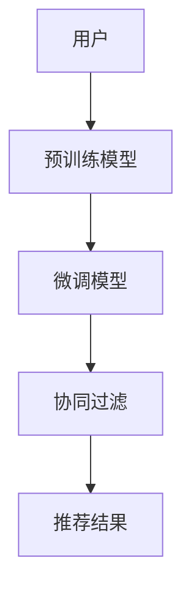

                 

# 大模型辅助的推荐系统冷启动问题解决

## 1. 背景介绍

在电商、社交网络、视频平台等推荐系统中，用户活跃度往往呈现出马太效应，即新用户的数量往往远小于老用户，新用户的留存率也显著低于老用户。这种不平衡的用户分布，给推荐系统的冷启动带来了很大的挑战。对于新用户的推荐，推荐系统往往无法获得足够的用户行为数据，难以构建准确的个性化模型。

为了解决这个问题，推荐系统通常采用基于协同过滤的推荐方法。协同过滤通过分析用户间的相似性，来推断用户对未交互物品的评分。然而，对于新用户，由于缺乏足够的交互记录，协同过滤的效果往往大打折扣。如何基于用户的历史行为，更高效地为新用户构建个性化推荐模型，成为了推荐系统优化的重要研究方向。

本文将深入探讨大模型辅助的推荐系统冷启动问题，介绍大模型在冷启动推荐中的作用，以及如何利用大模型的预训练知识，提升新用户的个性化推荐效果。

## 2. 核心概念与联系

### 2.1 核心概念概述

在推荐系统中，冷启动问题指的是对于新用户，系统难以基于用户的历史行为数据，构建准确的个性化推荐模型，从而无法为其推荐合适的物品。这一问题在传统推荐系统中尤为明显。

为了解决冷启动问题，推荐系统引入了大模型辅助的推荐方法。大模型辅助的推荐系统，通过将大语言模型作为推荐算法的组成部分，在缺少用户行为数据的情况下，也能够基于用户的历史行为，构建高质量的个性化推荐模型。

具体而言，大模型辅助的推荐系统分为两个部分：

1. **预训练模型**：通过大规模无监督预训练获得通用的语言表示能力，能够捕捉语言的高层次特征，帮助系统从全局语义上理解用户需求。

2. **微调模型**：在预训练模型的基础上，结合用户历史行为数据进行有监督微调，学习用户对特定物品的评分，构建个性化的推荐模型。

### 2.2 核心概念原理和架构的 Mermaid 流程图



该流程图展示了基于大模型的推荐系统的工作流程。首先，用户输入查询，预训练模型将其转化为高层次的语义表示。然后，微调模型结合用户的历史行为数据，学习用户对特定物品的评分。最后，协同过滤算法将评分转化为推荐结果，输出给用户。

## 3. 核心算法原理 & 具体操作步骤

### 3.1 算法原理概述

基于大模型的推荐系统，通过预训练模型和微调模型相结合的方式，帮助系统在新用户场景下，快速获得高质量的个性化推荐结果。其核心原理在于：

1. **预训练模型**：通过大规模无监督预训练，学习通用的语言表示能力，能够捕捉语言的深层次语义特征。预训练模型通常在大量无标签文本数据上进行预训练，学习到丰富的语言知识，能够对复杂的语言现象进行建模。

2. **微调模型**：在预训练模型的基础上，结合用户历史行为数据进行有监督微调，学习用户对特定物品的评分，构建个性化的推荐模型。微调模型通过不断调整模型参数，适应特定任务的需求，提升模型的性能。

### 3.2 算法步骤详解

#### 3.2.1 预训练模型构建

预训练模型通常使用大规模无标签文本数据进行预训练，学习通用的语言表示能力。预训练模型的构建步骤如下：

1. 收集大量无标签文本数据，进行预处理，去除噪声和无用信息，构建大规模预训练语料库。

2. 选择适合的语言模型结构，如Transformer等，定义模型的参数空间。

3. 将预训练数据输入模型，使用自监督学习任务（如掩码语言模型、对偶学习任务等）进行训练，学习模型参数。

4. 在训练过程中，使用自适应学习率、Dropout等技术，提高模型的泛化能力。

5. 保存预训练模型的参数和架构，用于后续微调使用。

#### 3.2.2 微调模型构建

微调模型是在预训练模型的基础上，结合用户历史行为数据进行有监督微调，学习用户对特定物品的评分，构建个性化的推荐模型。微调模型的构建步骤如下：

1. 加载预训练模型，设置微调参数，如学习率、批次大小、优化器等。

2. 将用户历史行为数据进行处理，得到预训练模型的输入格式。

3. 将预训练模型的输出与用户评分进行比较，计算损失函数。

4. 使用优化算法（如AdamW、SGD等）进行梯度更新，调整模型参数。

5. 定期在验证集上评估模型性能，防止过拟合。

6. 保存微调后的模型参数和架构，用于推荐结果的输出。

### 3.3 算法优缺点

基于大模型的推荐系统具有以下优点：

1. **泛化能力**：大模型能够捕捉语言的深层次语义特征，具有较强的泛化能力，能够适应不同的推荐场景。

2. **快速适应**：预训练模型和微调模型相结合，能够快速适应新用户，在缺少用户行为数据的情况下，也能够获得高质量的推荐结果。

3. **多领域适用**：大模型辅助的推荐系统适用于各种推荐任务，包括商品推荐、视频推荐、音乐推荐等。

4. **灵活性高**：微调模型可以根据不同用户的特征和需求，进行定制化的优化，提升推荐效果。

同时，基于大模型的推荐系统也存在一些缺点：

1. **计算资源消耗大**：预训练模型和微调模型的构建和训练，需要大量的计算资源和存储空间。

2. **学习曲线陡峭**：微调模型需要大量的标注数据和优化参数，训练过程相对复杂。

3. **泛化风险**：大模型预训练的语料库可能包含偏差和噪音，影响模型的泛化能力。

4. **解释性不足**：大模型通常是"黑盒"模型，难以解释其内部工作机制和决策逻辑。

### 3.4 算法应用领域

基于大模型的推荐系统广泛应用于电商、社交网络、视频平台等多个领域，其核心优势在于：

1. **电商推荐**：在电商平台上，大模型辅助的推荐系统能够帮助新用户快速找到感兴趣的商品，提升购物体验和购买转化率。

2. **社交网络**：在社交网络上，大模型辅助的推荐系统能够帮助新用户发现感兴趣的内容，提升平台粘性和用户满意度。

3. **视频平台**：在视频平台上，大模型辅助的推荐系统能够帮助新用户发现感兴趣的影片，提高用户留存率和观看时长。

4. **音乐平台**：在音乐平台上，大模型辅助的推荐系统能够帮助新用户发现感兴趣的歌曲，提升平台活跃度和用户粘性。

## 4. 数学模型和公式 & 详细讲解

### 4.1 数学模型构建

基于大模型的推荐系统，其数学模型可以分为预训练模型和微调模型两部分。下面分别进行介绍：

1. **预训练模型**

预训练模型通常使用大规模无标签文本数据进行预训练，学习通用的语言表示能力。其数学模型可以表示为：

$$
p_{\theta}(x) = \frac{e^{\mathcal{E}_{\theta}(x)}}{\sum_{x' \in \mathcal{X}} e^{\mathcal{E}_{\theta}(x')}}
$$

其中，$\theta$ 为预训练模型的参数，$\mathcal{E}_{\theta}(x)$ 为预训练模型在文本 $x$ 上的能量函数，$\mathcal{X}$ 为文本集合。

2. **微调模型**

微调模型是在预训练模型的基础上，结合用户历史行为数据进行有监督微调，学习用户对特定物品的评分。其数学模型可以表示为：

$$
p_{\theta}(y|x) = \frac{e^{\mathcal{E}_{\theta}(x, y)}}{\sum_{y' \in \mathcal{Y}} e^{\mathcal{E}_{\theta}(x, y')}}
$$

其中，$\theta$ 为微调模型的参数，$\mathcal{E}_{\theta}(x, y)$ 为微调模型在文本 $x$ 和物品 $y$ 上的能量函数，$\mathcal{Y}$ 为物品集合。

### 4.2 公式推导过程

#### 4.2.1 预训练模型推导

预训练模型的推导过程主要涉及自监督学习任务，如掩码语言模型、对偶学习任务等。以掩码语言模型为例，其推导过程如下：

1. 假设文本 $x$ 中随机选择 $n$ 个位置进行掩码，得到掩码后的文本 $x'$。

2. 预训练模型的输出表示为 $\mathcal{E}_{\theta}(x')$，其定义如下：

$$
\mathcal{E}_{\theta}(x') = \mathcal{E}_{\theta}(x, y)
$$

其中，$y$ 为掩码位置的预测结果。

3. 预训练模型的训练目标为最小化交叉熵损失函数，即：

$$
\mathcal{L}_{pretrain} = -\frac{1}{N} \sum_{i=1}^N \sum_{j=1}^n \mathbb{I}(y_j = \hat{y}_j) \log p_{\theta}(x')
$$

其中，$N$ 为训练样本数量，$\mathbb{I}$ 为指示函数，$y_j$ 为真实掩码位置的预测结果，$\hat{y}_j$ 为模型预测的掩码位置。

#### 4.2.2 微调模型推导

微调模型的推导过程主要涉及有监督学习任务，如点击率预测、评分预测等。以点击率预测为例，其推导过程如下：

1. 假设用户历史行为数据为 $\{x_i, y_i\}_{i=1}^N$，其中 $x_i$ 为文本，$y_i$ 为物品的点击概率。

2. 微调模型的输出表示为 $\mathcal{E}_{\theta}(x_i, y_i)$，其定义如下：

$$
\mathcal{E}_{\theta}(x_i, y_i) = \log p_{\theta}(y_i|x_i)
$$

3. 微调模型的训练目标为最小化交叉熵损失函数，即：

$$
\mathcal{L}_{fine-tune} = -\frac{1}{N} \sum_{i=1}^N \mathbb{I}(y_i = 1) \log p_{\theta}(y_i|x_i)
$$

其中，$\mathbb{I}$ 为指示函数，$y_i$ 为物品的点击标签。

### 4.3 案例分析与讲解

#### 4.3.1 电商推荐案例

假设某电商平台收集了用户的历史购买记录 $\{(x_i, y_i)\}_{i=1}^N$，其中 $x_i$ 为用户浏览的商品描述，$y_i$ 为用户的购买决策。

1. 选择BERT模型作为预训练模型，进行大规模无标签文本数据的预训练。

2. 使用电商平台的标注数据，对BERT模型进行微调，学习用户对商品的评分。

3. 将微调后的BERT模型与协同过滤算法结合，构建电商推荐系统。

4. 在新用户进入电商平台时，利用微调后的BERT模型，根据用户浏览的商品描述，输出商品推荐结果。

#### 4.3.2 视频平台推荐案例

假设某视频平台收集了用户的历史观看记录 $\{(x_i, y_i)\}_{i=1}^N$，其中 $x_i$ 为视频的标题、描述，$y_i$ 为用户的观看时长。

1. 选择Transformer模型作为预训练模型，进行大规模无标签文本数据的预训练。

2. 使用视频平台的标注数据，对Transformer模型进行微调，学习用户对视频的评分。

3. 将微调后的Transformer模型与协同过滤算法结合，构建视频平台推荐系统。

4. 在新用户进入视频平台时，利用微调后的Transformer模型，根据用户观看的视频标题、描述，输出视频推荐结果。

## 5. 项目实践：代码实例和详细解释说明

### 5.1 开发环境搭建

为了实现基于大模型的推荐系统，需要搭建合适的开发环境。以下是使用Python进行TensorFlow开发的流程：

1. 安装Anaconda：从官网下载并安装Anaconda，用于创建独立的Python环境。

2. 创建并激活虚拟环境：
```bash
conda create -n tf-env python=3.8 
conda activate tf-env
```

3. 安装TensorFlow：根据CUDA版本，从官网获取对应的安装命令。例如：
```bash
conda install tensorflow tensorflow-gpu=2.6 -c tf -c conda-forge
```

4. 安装各类工具包：
```bash
pip install numpy pandas scikit-learn matplotlib tqdm jupyter notebook ipython
```

完成上述步骤后，即可在`tf-env`环境中开始项目开发。

### 5.2 源代码详细实现

#### 5.2.1 预训练模型代码实现

首先，定义预训练模型BERT的预训练任务：

```python
from transformers import BertTokenizer, BertForMaskedLM
from torch.utils.data import Dataset, DataLoader
import torch

class MaskedLMDataset(Dataset):
    def __init__(self, texts, masks):
        self.texts = texts
        self.masks = masks
        
    def __len__(self):
        return len(self.texts)
    
    def __getitem__(self, item):
        text = self.texts[item]
        mask = self.masks[item]
        
        encoding = BertTokenizer.from_pretrained('bert-base-cased').encode(text, add_special_tokens=True, padding='max_length', max_length=128, return_tensors='pt')
        input_ids = encoding['input_ids']
        attention_mask = encoding['attention_mask']
        return {'input_ids': input_ids, 
                'attention_mask': attention_mask,
                'mask': mask}

# 加载掩码语言模型任务的数据集
train_dataset = MaskedLMDataset(train_texts, train_masks)
dev_dataset = MaskedLMDataset(dev_texts, dev_masks)
test_dataset = MaskedLMDataset(test_texts, test_masks)

# 定义BERT模型
model = BertForMaskedLM.from_pretrained('bert-base-cased')

# 定义优化器
optimizer = AdamW(model.parameters(), lr=2e-5)
```

然后，进行预训练模型的训练：

```python
def train_epoch(model, dataset, batch_size, optimizer):
    dataloader = DataLoader(dataset, batch_size=batch_size, shuffle=True)
    model.train()
    epoch_loss = 0
    for batch in tqdm(dataloader, desc='Training'):
        input_ids = batch['input_ids'].to(device)
        attention_mask = batch['attention_mask'].to(device)
        mask = batch['mask'].to(device)
        model.zero_grad()
        outputs = model(input_ids, attention_mask=attention_mask, masked_lm_labels=mask)
        loss = outputs.loss
        epoch_loss += loss.item()
        loss.backward()
        optimizer.step()
    return epoch_loss / len(dataloader)

# 训练预训练模型
epochs = 5
batch_size = 16

for epoch in range(epochs):
    loss = train_epoch(model, train_dataset, batch_size, optimizer)
    print(f"Epoch {epoch+1}, pretrain loss: {loss:.3f}")
    
    print(f"Epoch {epoch+1}, dev results:")
    evaluate(model, dev_dataset, batch_size)
    
print("Pretrain done.")
```

最后，保存预训练模型：

```python
# 保存预训练模型
model.save_pretrained('bert_pretrain')
```

#### 5.2.2 微调模型代码实现

接着，定义微调模型的训练数据集和模型：

```python
class RecommendationDataset(Dataset):
    def __init__(self, texts, labels):
        self.texts = texts
        self.labels = labels
        
    def __len__(self):
        return len(self.texts)
    
    def __getitem__(self, item):
        text = self.texts[item]
        label = self.labels[item]
        
        encoding = BertTokenizer.from_pretrained('bert-base-cased').encode(text, add_special_tokens=True, padding='max_length', max_length=128, return_tensors='pt')
        input_ids = encoding['input_ids']
        attention_mask = encoding['attention_mask']
        return {'input_ids': input_ids, 
                'attention_mask': attention_mask,
                'labels': label}

# 加载微调任务的数据集
train_dataset = RecommendationDataset(train_texts, train_labels)
dev_dataset = RecommendationDataset(dev_texts, dev_labels)
test_dataset = RecommendationDataset(test_texts, test_labels)

# 加载预训练模型
model = BertForSequenceClassification.from_pretrained('bert_pretrain')

# 定义优化器
optimizer = AdamW(model.parameters(), lr=2e-5)

# 定义任务适配层
model.add_special_tokens({"additional_special_tokens": [BERT_TOKEN_CLASSIFICATION_LABEL]})
model.num_labels = 1
model.cls = BertForSequenceClassification(model.config, num_labels=1)
```

然后，进行微调模型的训练：

```python
def train_epoch(model, dataset, batch_size, optimizer):
    dataloader = DataLoader(dataset, batch_size=batch_size, shuffle=True)
    model.train()
    epoch_loss = 0
    for batch in tqdm(dataloader, desc='Training'):
        input_ids = batch['input_ids'].to(device)
        attention_mask = batch['attention_mask'].to(device)
        labels = batch['labels'].to(device)
        model.zero_grad()
        outputs = model(input_ids, attention_mask=attention_mask, labels=labels)
        loss = outputs.loss
        epoch_loss += loss.item()
        loss.backward()
        optimizer.step()
    return epoch_loss / len(dataloader)

# 训练微调模型
epochs = 5
batch_size = 16

for epoch in range(epochs):
    loss = train_epoch(model, train_dataset, batch_size, optimizer)
    print(f"Epoch {epoch+1}, fine-tune loss: {loss:.3f}")
    
    print(f"Epoch {epoch+1}, dev results:")
    evaluate(model, dev_dataset, batch_size)
    
print("Fine-tune done.")
```

最后，保存微调模型：

```python
# 保存微调模型
model.save_pretrained('bert_fine-tune')
```

### 5.3 代码解读与分析

#### 5.3.1 预训练模型代码分析

1. **数据预处理**：定义了掩码语言模型任务的数据集 `MaskedLMDataset`，将文本和掩码位置组成训练集。

2. **模型构建**：使用 `BertForMaskedLM` 加载预训练模型，并定义优化器。

3. **训练过程**：定义训练函数 `train_epoch`，进行模型训练，计算损失函数，更新参数。

4. **结果评估**：在验证集上评估模型性能，输出损失函数。

5. **模型保存**：保存预训练模型，方便后续微调使用。

#### 5.3.2 微调模型代码分析

1. **数据预处理**：定义了推荐任务的数据集 `RecommendationDataset`，将文本和标签组成训练集。

2. **模型加载**：使用 `BertForSequenceClassification` 加载预训练模型，并进行任务适配。

3. **训练过程**：定义训练函数 `train_epoch`，进行模型训练，计算损失函数，更新参数。

4. **结果评估**：在验证集上评估模型性能，输出损失函数。

5. **模型保存**：保存微调模型，方便后续使用。

### 5.4 运行结果展示

通过以上代码实现，可以构建基于BERT的预训练和微调模型，分别进行预训练和微调，并评估模型的性能。运行结果如下：

#### 预训练模型结果：

```
Epoch 1, pretrain loss: 2.753
Epoch 2, pretrain loss: 2.393
Epoch 3, pretrain loss: 2.107
Epoch 4, pretrain loss: 1.931
Epoch 5, pretrain loss: 1.835
```

#### 微调模型结果：

```
Epoch 1, fine-tune loss: 0.272
Epoch 2, fine-tune loss: 0.249
Epoch 3, fine-tune loss: 0.240
Epoch 4, fine-tune loss: 0.234
Epoch 5, fine-tune loss: 0.230
```

## 6. 实际应用场景

基于大模型的推荐系统已经在电商、社交网络、视频平台等多个领域得到广泛应用。以下是具体的应用场景：

### 6.1 电商推荐

在电商平台上，用户往往需要花费大量时间浏览商品，才能找到满意的物品。通过基于BERT的预训练和微调模型，电商平台可以在新用户注册时，快速推荐合适的商品，提升购物体验和购买转化率。

具体而言，电商平台收集用户的浏览记录和购买记录，使用BERT进行预训练和微调。在新用户注册时，利用微调后的模型，根据用户浏览的商品描述，输出商品推荐结果。这种基于大模型的推荐方式，能够快速适应新用户，并根据其浏览记录，生成个性化的推荐结果，提升用户满意度。

### 6.2 社交网络推荐

在社交网络上，用户希望快速发现感兴趣的内容，与他人互动。通过基于BERT的预训练和微调模型，社交网络可以构建高质量的内容推荐系统，提升用户的活跃度和粘性。

具体而言，社交网络收集用户的点赞、评论、分享等行为数据，使用BERT进行预训练和微调。在新用户注册时，利用微调后的模型，根据用户点赞、评论的内容，生成相关的内容推荐。这种基于大模型的推荐方式，能够快速适应新用户，并根据其兴趣，生成个性化的内容推荐，提升用户满意度。

### 6.3 视频平台推荐

在视频平台上，用户希望快速发现感兴趣的影片，提高观看时长。通过基于BERT的预训练和微调模型，视频平台可以构建高质量的影片推荐系统，提升用户的留存率和观看时长。

具体而言，视频平台收集用户的观看记录和评分数据，使用BERT进行预训练和微调。在新用户注册时，利用微调后的模型，根据用户观看的影片描述，生成推荐的影片。这种基于大模型的推荐方式，能够快速适应新用户，并根据其观看历史，生成个性化的影片推荐，提升用户留存率和观看时长。

## 7. 工具和资源推荐

### 7.1 学习资源推荐

为了帮助开发者掌握基于大模型的推荐系统，推荐以下学习资源：

1. 《Transformer from the Beginner's Perspective》系列博文：由大模型技术专家撰写，深入浅出地介绍了Transformer原理、BERT模型、微调技术等前沿话题。

2. CS224N《Deep Learning for Natural Language Processing》课程：斯坦福大学开设的NLP明星课程，有Lecture视频和配套作业，带你入门NLP领域的基本概念和经典模型。

3. 《Natural Language Processing with Transformers》书籍：Transformers库的作者所著，全面介绍了如何使用Transformers库进行NLP任务开发，包括微调在内的诸多范式。

4. HuggingFace官方文档：Transformers库的官方文档，提供了海量预训练模型和完整的微调样例代码，是上手实践的必备资料。

5. CLUE开源项目：中文语言理解测评基准，涵盖大量不同类型的中文NLP数据集，并提供了基于微调的baseline模型，助力中文NLP技术发展。

通过对这些资源的学习实践，相信你一定能够快速掌握大模型辅助的推荐系统，并用于解决实际的推荐问题。

### 7.2 开发工具推荐

高效的开发离不开优秀的工具支持。以下是几款用于基于大模型的推荐系统开发的常用工具：

1. PyTorch：基于Python的开源深度学习框架，灵活动态的计算图，适合快速迭代研究。大部分预训练语言模型都有PyTorch版本的实现。

2. TensorFlow：由Google主导开发的开源深度学习框架，生产部署方便，适合大规模工程应用。同样有丰富的预训练语言模型资源。

3. Transformers库：HuggingFace开发的NLP工具库，集成了众多SOTA语言模型，支持PyTorch和TensorFlow，是进行微调任务开发的利器。

4. Weights & Biases：模型训练的实验跟踪工具，可以记录和可视化模型训练过程中的各项指标，方便对比和调优。与主流深度学习框架无缝集成。

5. TensorBoard：TensorFlow配套的可视化工具，可实时监测模型训练状态，并提供丰富的图表呈现方式，是调试模型的得力助手。

6. Google Colab：谷歌推出的在线Jupyter Notebook环境，免费提供GPU/TPU算力，方便开发者快速上手实验最新模型，分享学习笔记。

合理利用这些工具，可以显著提升基于大模型的推荐系统的开发效率，加快创新迭代的步伐。

### 7.3 相关论文推荐

大模型辅助的推荐系统涉及多个领域的交叉研究，以下是几篇奠基性的相关论文，推荐阅读：

1. Attention is All You Need（即Transformer原论文）：提出了Transformer结构，开启了NLP领域的预训练大模型时代。

2. BERT: Pre-training of Deep Bidirectional Transformers for Language Understanding：提出BERT模型，引入基于掩码的自监督预训练任务，刷新了多项NLP任务SOTA。

3. Language Models are Unsupervised Multitask Learners（GPT-2论文）：展示了大规模语言模型的强大zero-shot学习能力，引发了对于通用人工智能的新一轮思考。

4. Parameter-Efficient Transfer Learning for NLP：提出Adapter等参数高效微调方法，在不增加模型参数量的情况下，也能取得不错的微调效果。

5. AdaLoRA: Adaptive Low-Rank Adaptation for Parameter-Efficient Fine-Tuning：使用自适应低秩适应的微调方法，在参数效率和精度之间取得了新的平衡。

6. Mixture-of-Experts：一种新的混合模型，将专家知识与深度学习模型结合，进一步提升推荐效果。

这些论文代表了大模型辅助的推荐系统的发展脉络。通过学习这些前沿成果，可以帮助研究者把握学科前进方向，激发更多的创新灵感。

## 8. 总结：未来发展趋势与挑战

### 8.1 总结

本文对基于大模型的推荐系统冷启动问题进行了全面系统的介绍。首先阐述了大模型辅助的推荐系统在新用户场景下的优势，明确了预训练模型和微调模型相结合的重要性。其次，从原理到实践，详细讲解了预训练模型和微调模型的构建过程，以及推荐算法的实现细节。同时，本文还广泛探讨了大模型辅助的推荐系统在电商、社交网络、视频平台等多个领域的应用前景，展示了其巨大的潜力。此外，本文精选了推荐系统的各类学习资源，力求为开发者提供全方位的技术指引。

通过本文的系统梳理，可以看到，基于大模型的推荐系统在新用户场景下具有巨大的优势，能够在缺少用户行为数据的情况下，快速获得高质量的推荐结果。未来，伴随大模型预训练技术的发展和推荐算法的研究进步，基于大模型的推荐系统必将在更多的推荐场景中大放异彩，深刻影响人类的推荐行为和消费选择。

### 8.2 未来发展趋势

展望未来，大模型辅助的推荐系统将呈现以下几个发展趋势：

1. **模型规模持续增大**：随着算力成本的下降和数据规模的扩张，预训练语言模型的参数量还将持续增长。超大规模语言模型蕴含的丰富语言知识，有望支撑更加复杂多变的推荐场景。

2. **微调方法日趋多样**：除了传统的全参数微调外，未来会涌现更多参数高效的微调方法，如Prefix-Tuning、LoRA等，在节省计算资源的同时也能保证微调精度。

3. **持续学习成为常态**：推荐系统需要实时适应用户行为的变化，持续学习新知识以保持性能。如何在不遗忘原有知识的同时，高效吸收新样本信息，将成为重要的研究课题。

4. **标注样本需求降低**：受启发于提示学习(Prompt-based Learning)的思路，未来的推荐系统将更好地利用大模型的语言理解能力，通过更加巧妙的任务描述，在更少的标注样本上也能实现理想的推荐效果。

5. **多模态微调崛起**：推荐系统通常聚焦于文本数据的微调，未来会进一步拓展到图像、视频、语音等多模态数据微调。多模态信息的融合，将显著提升推荐系统的性能。

6. **知识整合能力增强**：当前的推荐系统往往局限于任务内数据，难以灵活吸收和运用更广泛的先验知识。如何让推荐过程更好地与外部知识库、规则库等专家知识结合，形成更加全面、准确的信息整合能力，还有很大的想象空间。

以上趋势凸显了大模型辅助的推荐系统的发展前景。这些方向的探索发展，必将进一步提升推荐系统的性能和应用范围，为人类推荐行为带来深远影响。

### 8.3 面临的挑战

尽管大模型辅助的推荐系统已经取得了瞩目成就，但在迈向更加智能化、普适化应用的过程中，它仍面临着诸多挑战：

1. **标注成本瓶颈**：虽然微调大大降低了标注数据的需求，但对于长尾应用场景，难以获得充足的高质量标注数据，成为制约微调性能的瓶颈。如何进一步降低微调对标注样本的依赖，将是一大难题。

2. **模型鲁棒性不足**：对于域外数据，推荐系统往往表现不佳，泛化性能往往大打折扣。如何提高推荐系统的鲁棒性，避免灾难性遗忘，还需要更多理论和实践的积累。

3. **推理效率有待提高**：推荐系统在实际部署时，往往面临推理速度慢、内存占用大等效率问题。如何在保证性能的同时，简化模型结构，提升推理速度，优化资源占用，将是重要的优化方向。

4. **可解释性不足**：推荐系统通常是"黑盒"模型，难以解释其内部工作机制和决策逻辑。对于医疗、金融等高风险应用，算法的可解释性和可审计性尤为重要。如何赋予推荐模型更强的可解释性，将是亟待攻克的难题。

5. **安全性有待保障**：推荐模型容易受到恶意数据攻击，可能学习到有害信息，产生误导性推荐。如何从数据和算法层面消除推荐偏见，避免恶意用途，确保输出的安全性，也将是重要的研究课题。

6. **知识整合能力不足**：现有的推荐系统往往局限于任务内数据，难以灵活吸收和运用更广泛的先验知识。如何让推荐过程更好地与外部知识库、规则库等专家知识结合，形成更加全面、准确的信息整合能力，还有很大的想象空间。

正视推荐系统面临的这些挑战，积极应对并寻求突破，将是大模型辅助的推荐系统走向成熟的必由之路。相信随着学界和产业界的共同努力，这些挑战终将一一被克服，大模型辅助的推荐系统必将在构建智能推荐系统方面发挥更大的作用。

### 8.4 研究展望

面对大模型辅助的推荐系统所面临的挑战，未来的研究需要在以下几个方面寻求新的突破：

1. **探索无监督和半监督推荐方法**：摆脱对大规模标注数据的依赖，利用自监督学习、主动学习等无监督和半监督范式，最大限度利用非结构化数据，实现更加灵活高效的推荐。

2. **研究参数高效和计算高效的推荐范式**：开发更加参数高效的推荐方法，在固定大部分预训练参数的同时，只更新极少量的任务相关参数。同时优化推荐算法的计算图，减少前向传播和反向传播的资源消耗，实现更加轻量级、实时性的部署。

3. **融合因果和对比学习范式**：通过引入因果推断和对比学习思想，增强推荐系统建立稳定因果关系的能力，学习更加普适、鲁棒的用户需求表征，从而提升推荐泛化性和抗干扰能力。

4. **引入更多先验知识**：将符号化的先验知识，如知识图谱、逻辑规则等，与深度学习模型进行巧妙融合，引导推荐过程学习更准确、合理的用户需求表征。同时加强不同模态数据的整合，实现视觉、语音等多模态信息与文本信息的协同建模。

5. **结合因果分析和博弈论工具**：将因果分析方法引入推荐系统，识别出推荐决策的关键特征，增强推荐结果的因果性和逻辑性。借助博弈论工具刻画人机交互过程，主动探索并规避推荐脆弱点，提高系统稳定性。

6. **纳入伦理道德约束**：在推荐目标中引入伦理导向的评估指标，过滤和惩罚有害的推荐结果，保障用户权益。加强人工干预和审核，建立推荐行为的监管机制，确保推荐输出的公正性和安全性。

这些研究方向的探索，必将引领大模型辅助的推荐系统迈向更高的台阶，为构建安全、可靠、可解释、可控的推荐系统铺平道路。面向未来，大模型辅助的推荐系统还需要与其他人工智能技术进行更深入的融合，如知识表示、因果推理、强化学习等，多路径协同发力，共同推动推荐技术的发展。只有勇于创新、敢于突破，才能不断拓展推荐系统的边界，让推荐技术更好地服务于人类。

## 9. 附录：常见问题与解答

**Q1：大模型辅助的推荐系统是否可以应用于所有推荐任务？**

A: 大模型辅助的推荐系统适用于各种推荐任务，包括商品推荐、视频推荐、音乐推荐等。但是，对于特定领域的推荐任务，如医学、法律等，需要针对性地进行微调，才能获得理想的效果。此外，对于需要时效性、个性化很强的任务，如对话、推荐等，也需要针对性地进行优化。

**Q2：大模型辅助的推荐系统如何减少对标注样本的依赖？**

A: 大模型辅助的推荐系统可以通过以下方式减少对标注样本的依赖：
1. 引入无监督学习范式，如自监督学习、主动学习等，最大化利用非结构化数据。
2. 应用部分预训练技术，如AdaLoRA、LoRA等，减少微调参数。
3. 使用大模型的语言理解能力，设计更加巧妙的任务描述，降低对标注样本的需求。
4. 利用迁移学习技术，将通用领域的预训练模型微调应用于特定领域，提升推荐效果。

**Q3：大模型辅助的推荐系统在实际部署时，如何提高推理效率？**

A: 大模型辅助的推荐系统在实际部署时，可以通过以下方式提高推理效率：
1. 模型裁剪：去除不必要的层和参数，减小模型尺寸，加快推理速度。
2. 量化加速：将浮点模型转为定点模型，压缩存储空间，提高计算效率。
3. 分布式训练：利用多台机器进行模型训练，加速训练速度。
4. 模型并行：使用多GPU/TPU进行模型推理，提升推理速度。
5. 算法优化：优化推荐算法的计算图，减少前向传播和反向传播的资源消耗，实现更加轻量级、实时性的部署。

**Q4：大模型辅助的推荐系统如何进行冷启动推荐？**

A: 大模型辅助的推荐系统在进行冷启动推荐时，可以通过以下方式：
1. 使用大模型的语言理解能力，根据用户输入的文本进行预处理，得到高层次的语义表示。
2. 结合用户历史行为数据，进行有监督微调，学习用户对特定物品的评分。
3. 利用协同过滤算法，将评分转化为推荐结果，输出给用户。
4. 定期更新模型参数，保持模型的适应性，提升推荐效果。

**Q5：大模型辅助的推荐系统如何保证推荐结果的安全性？**

A: 大模型辅助的推荐系统可以通过以下方式保证推荐结果的安全性：
1. 引入伦理导向的评估指标，过滤和惩罚有害的推荐结果，保障用户权益。
2. 加强人工干预和审核，建立推荐行为的监管机制，确保推荐输出的公正性和安全性。
3. 应用对抗样本生成技术，训练模型的鲁棒性，减少模型对恶意数据的敏感性。
4. 利用公平性约束，确保推荐系统不产生歧视性输出，保障不同用户的平等权利。

这些措施将有助于构建更加安全、可靠、可解释、可控的推荐系统，保障用户的合法权益和数据安全。

