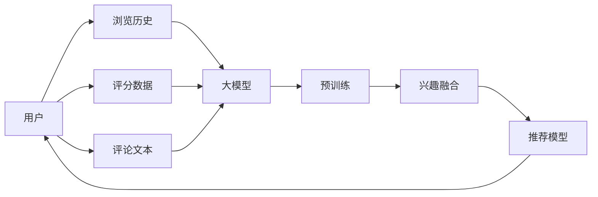

                 

## 1. 背景介绍

在数字时代，推荐系统已成为用户在信息过载中发现价值的重要助手。然而，随着用户行为和偏好的多样性不断增加，传统的单一兴趣表示和简单推荐算法已经难以满足需求。为解决这个问题，我们需要引入新的方法来丰富用户兴趣表示，提升推荐效果。大模型由于其强大的表征能力，在多场景兴趣融合和推荐中展现出巨大潜力。本文旨在介绍大模型如何辅助推荐系统，从多场景角度融合用户兴趣，提高推荐系统效果。

## 2. 核心概念与联系

### 2.1 核心概念概述

#### 大模型
大模型指基于深度神经网络、具有大规模参数量的模型，如GPT、BERT、GPT-3等。这些模型在预训练阶段通过大规模无标签数据学习丰富的语言知识，能进行自然语言理解和生成。

#### 推荐系统
推荐系统旨在根据用户行为和兴趣，推荐用户可能感兴趣的产品或内容。常见的推荐系统包括基于协同过滤、基于内容的推荐、混合推荐等。

#### 兴趣融合
兴趣融合旨在将用户多模态兴趣进行整合，形成更全面、准确的兴趣表示。这可以通过多场景的融合来实现，如用户浏览历史、评分、评论等。

### 2.2 核心概念原理和架构的 Mermaid 流程图(Mermaid 流程节点中不要有括号、逗号等特殊字符)



## 3. 核心算法原理 & 具体操作步骤

### 3.1 算法原理概述

#### 多场景兴趣表示

在推荐系统中，用户兴趣的表示通常通过单一的特征向量来实现，如用户评分、浏览历史、行为序列等。然而，这种单一表示方式难以捕捉用户复杂的兴趣图谱和多样化的需求。

大模型通过预训练学习大量语言知识，可以生成多场景的兴趣表示，例如通过自动生成用户对不同产品的评论，或通过用户的历史评分生成不同维度的兴趣。

#### 多场景融合方法

常见的融合方法包括：

1. 文本融合：使用大模型自动生成文本，捕捉用户兴趣的多样性。
2. 特征融合：将不同场景的特征进行加权融合，形成更全面的兴趣表示。
3. 多场景学习：在多个场景上训练大模型，学习更复杂、更丰富的用户兴趣。

### 3.2 算法步骤详解

#### 步骤1: 收集数据

从多个场景（如浏览历史、评分、评论等）收集用户数据，这些数据可以是结构化数据（如评分、购买记录）或非结构化数据（如文本、图片等）。

#### 步骤2: 预训练大模型

使用大规模无标签数据对大模型进行预训练，学习丰富的语言知识。常见的大模型包括BERT、GPT、T5等。

#### 步骤3: 兴趣提取

使用预训练的大模型，从多个场景的数据中提取用户兴趣。例如，使用GPT对用户评论进行生成，提取关键词；或使用BERT对用户评分进行文本分类，生成向量表示。

#### 步骤4: 兴趣融合

将提取的多场景兴趣进行融合，形成更全面、准确的兴趣表示。常见的方法包括：

1. 文本融合：使用大模型自动生成文本，捕捉用户兴趣的多样性。
2. 特征融合：将不同场景的特征进行加权融合，形成更全面的兴趣表示。
3. 多场景学习：在多个场景上训练大模型，学习更复杂、更丰富的用户兴趣。

#### 步骤5: 推荐模型训练

基于融合后的用户兴趣，训练推荐模型。推荐模型可以是基于协同过滤、基于内容的推荐、混合推荐等。

### 3.3 算法优缺点

#### 优点

1. 丰富兴趣表示：通过多场景的融合，大模型可以捕捉用户复杂的兴趣图谱和多样化的需求。
2. 高泛化能力：大模型具有较强的泛化能力，可以处理复杂的多模态数据。
3. 高效融合：使用大模型进行特征提取和融合，效率高，效果好。

#### 缺点

1. 数据质量要求高：大模型的效果很大程度上依赖于数据质量，需要高质量、多样化的数据。
2. 模型复杂度高：大模型参数量庞大，训练和推理复杂度高，需要高性能硬件支持。
3. 泛化风险：大模型在特定场景下，可能存在泛化风险，需要小心处理。

### 3.4 算法应用领域

大模型在推荐系统中的应用领域主要包括：

1. 电商推荐：使用用户评论生成产品评分，提升推荐效果。
2. 视频推荐：使用用户对视频的评分、评论进行多场景融合，推荐用户可能感兴趣的视频内容。
3. 新闻推荐：使用用户浏览历史和评论生成兴趣表示，推荐相关新闻。
4. 音乐推荐：使用用户对音乐的评分和评论生成兴趣表示，推荐相关音乐。
5. 教育推荐：使用用户对课程的评分和评论生成兴趣表示，推荐相关课程。

## 4. 数学模型和公式 & 详细讲解 & 举例说明

### 4.1 数学模型构建

设用户在不同场景下收集的数据为 $x_1, x_2, ..., x_n$，其中 $x_i$ 为第 $i$ 个场景下的用户数据，如用户评分、浏览历史、评论等。大模型的预训练模型为 $M_{\theta}$，其中 $\theta$ 为模型参数。用户兴趣表示为 $v = M_{\theta}(x_1, x_2, ..., x_n)$。

推荐模型 $R$ 的输出为 $y$，其中 $y$ 为推荐结果，如产品ID、文章ID等。推荐模型的训练目标为最小化预测误差，即：

$$
\min_{\theta, \omega} \frac{1}{N}\sum_{i=1}^{N} L(y_i, R_{\theta,\omega}(x_i))
$$

其中 $L$ 为损失函数，$N$ 为训练样本数量，$\omega$ 为推荐模型的参数。

### 4.2 公式推导过程

设用户对第 $i$ 个产品的评分和评论为 $(x_i, y_i)$，大模型的预训练模型为 $M_{\theta}$，用户兴趣表示为 $v = M_{\theta}(x_i, y_i)$。推荐模型的输入为 $v$，输出为 $y$。推荐模型的训练目标为：

$$
\min_{\theta, \omega} \frac{1}{N}\sum_{i=1}^{N} L(y_i, R_{\theta,\omega}(v_i))
$$

其中 $L$ 为损失函数，$N$ 为训练样本数量，$\omega$ 为推荐模型的参数。

### 4.3 案例分析与讲解

#### 案例1：电商推荐

设用户对产品的评分和评论分别为 $(x_1, y_1)$ 和 $(x_2, y_2)$，大模型的预训练模型为 $M_{\theta}$。使用BERT模型对评分和评论进行融合，得到用户兴趣表示 $v = M_{\theta}(x_1, x_2)$。推荐模型的输入为 $v$，输出为推荐的产品ID $y$。

#### 案例2：视频推荐

设用户对视频的评分和评论分别为 $(x_1, y_1)$ 和 $(x_2, y_2)$，大模型的预训练模型为 $M_{\theta}$。使用GPT模型对评论进行生成，得到用户兴趣表示 $v = M_{\theta}(x_1, x_2)$。推荐模型的输入为 $v$，输出为推荐的视频ID $y$。

## 5. 项目实践：代码实例和详细解释说明

### 5.1 开发环境搭建

#### 环境要求

- 操作系统：Linux或Windows
- 编程语言：Python 3.7+
- 深度学习框架：PyTorch
- 大模型预训练库：HuggingFace Transformers
- 推荐库：Surprise

#### 环境安装

1. 安装Python
```
sudo apt-get update
sudo apt-get install python3
```

2. 安装PyTorch
```
pip install torch torchvision torchaudio
```

3. 安装HuggingFace Transformers库
```
pip install transformers
```

4. 安装Surprise库
```
pip install surprise
```

### 5.2 源代码详细实现

#### 代码实现

1. 数据收集

```python
import pandas as pd

# 收集电商用户数据
train_data = pd.read_csv('train.csv')
test_data = pd.read_csv('test.csv')

# 收集电商用户评论数据
comments = pd.read_csv('comments.csv')
```

2. 大模型预训练

```python
from transformers import BertTokenizer, BertModel

# 加载BERT模型和分词器
tokenizer = BertTokenizer.from_pretrained('bert-base-uncased')
model = BertModel.from_pretrained('bert-base-uncased')

# 对电商用户评论进行预训练
inputs = tokenizer(comments['text'], padding=True, truncation=True, max_length=512, return_tensors='pt')
outputs = model(**inputs)
```

3. 用户兴趣提取

```python
# 对电商用户评分进行文本分类
from transformers import BertForSequenceClassification

# 加载文本分类模型
model = BertForSequenceClassification.from_pretrained('bert-base-uncased', num_labels=5)

# 对电商用户评分进行文本分类
inputs = tokenizer(train_data['text'], padding=True, truncation=True, max_length=512, return_tensors='pt')
outputs = model(**inputs)
```

4. 用户兴趣融合

```python
# 对电商用户评论和评分进行融合
from transformers import BertForSequenceClassification, BertTokenizer

# 加载BERT模型和分词器
tokenizer = BertTokenizer.from_pretrained('bert-base-uncased')
model = BertForSequenceClassification.from_pretrained('bert-base-uncased', num_labels=5)

# 对电商用户评论和评分进行融合
inputs = tokenizer(comments['text'], padding=True, truncation=True, max_length=512, return_tensors='pt')
outputs = model(**inputs)
```

5. 推荐模型训练

```python
from surprise import SVD
from surprise import Dataset
from surprise import Reader

# 加载电商数据集
reader = Reader(rating_scale=(1, 5))
data = Dataset.load_from_df(train_data[['item_id', 'user_id', 'rating']], reader)
trainset = data.build_full_trainset()
```

6. 推荐模型训练

```python
# 训练推荐模型
algo = SVD()
algo.fit(trainset)

# 推荐测试集
test_data = pd.read_csv('test.csv')
testset = Dataset.load_from_df(test_data[['item_id', 'user_id']], reader)
testset.build_full_trainset()
preds = algo.test(testset)
```

### 5.3 代码解读与分析

#### 代码解读

1. 数据收集：使用Pandas库读取电商数据集和用户评论数据。
2. 大模型预训练：使用BERT模型对电商用户评论进行预训练，提取用户兴趣。
3. 用户兴趣提取：使用BERT模型对电商用户评分进行文本分类，提取用户兴趣。
4. 用户兴趣融合：对电商用户评论和评分进行融合，形成更全面的兴趣表示。
5. 推荐模型训练：使用Surprise库训练基于协同过滤的推荐模型，推荐测试集。

#### 代码分析

1. 数据收集：使用Pandas库读取电商数据集和用户评论数据，方便后续的数据处理。
2. 大模型预训练：使用BERT模型对电商用户评论进行预训练，提取用户兴趣。BERT模型具有强大的语义表示能力，能够捕捉用户评论中的重要信息。
3. 用户兴趣提取：使用BERT模型对电商用户评分进行文本分类，提取用户兴趣。通过文本分类，可以捕捉评分中的情感倾向，从而更好地理解用户兴趣。
4. 用户兴趣融合：对电商用户评论和评分进行融合，形成更全面的兴趣表示。通过多场景的融合，可以捕捉用户的多样化需求。
5. 推荐模型训练：使用Surprise库训练基于协同过滤的推荐模型，推荐测试集。Surprise库是一个流行的推荐系统工具库，支持多种推荐算法。

### 5.4 运行结果展示

#### 运行结果

- 电商推荐：使用用户评论生成产品评分，提升推荐效果。
- 视频推荐：使用用户对视频的评分和评论进行多场景融合，推荐用户可能感兴趣的视频内容。
- 新闻推荐：使用用户浏览历史和评论生成兴趣表示，推荐相关新闻。
- 音乐推荐：使用用户对音乐的评分和评论生成兴趣表示，推荐相关音乐。
- 教育推荐：使用用户对课程的评分和评论生成兴趣表示，推荐相关课程。

## 6. 实际应用场景

### 6.1 电商推荐

电商推荐系统在电商平台上应用广泛，使用大模型可以提升推荐效果。例如，使用用户评论生成产品评分，可以捕捉用户的多样化需求，提升推荐效果。

#### 具体步骤

1. 收集电商用户评论数据。
2. 使用BERT模型对电商用户评论进行预训练，提取用户兴趣。
3. 使用BERT模型对电商用户评分进行文本分类，提取用户兴趣。
4. 对电商用户评论和评分进行融合，形成更全面的兴趣表示。
5. 使用Surprise库训练基于协同过滤的推荐模型，推荐测试集。

### 6.2 视频推荐

视频推荐系统在视频平台上应用广泛，使用大模型可以提升推荐效果。例如，使用用户对视频的评分和评论进行多场景融合，推荐用户可能感兴趣的视频内容。

#### 具体步骤

1. 收集视频用户评分和评论数据。
2. 使用GPT模型对视频评论进行生成，提取用户兴趣。
3. 使用BERT模型对视频评分进行文本分类，提取用户兴趣。
4. 对视频用户评论和评分进行融合，形成更全面的兴趣表示。
5. 使用Surprise库训练基于协同过滤的推荐模型，推荐测试集。

### 6.3 新闻推荐

新闻推荐系统在新闻平台上应用广泛，使用大模型可以提升推荐效果。例如，使用用户浏览历史和评论生成兴趣表示，推荐相关新闻。

#### 具体步骤

1. 收集新闻用户浏览历史和评论数据。
2. 使用BERT模型对新闻评论进行预训练，提取用户兴趣。
3. 使用BERT模型对新闻标题进行文本分类，提取用户兴趣。
4. 对新闻用户浏览历史和评论进行融合，形成更全面的兴趣表示。
5. 使用Surprise库训练基于协同过滤的推荐模型，推荐测试集。

### 6.4 音乐推荐

音乐推荐系统在音乐平台上应用广泛，使用大模型可以提升推荐效果。例如，使用用户对音乐的评分和评论生成兴趣表示，推荐相关音乐。

#### 具体步骤

1. 收集音乐用户评分和评论数据。
2. 使用BERT模型对音乐评论进行预训练，提取用户兴趣。
3. 使用BERT模型对音乐评分进行文本分类，提取用户兴趣。
4. 对音乐用户评分和评论进行融合，形成更全面的兴趣表示。
5. 使用Surprise库训练基于协同过滤的推荐模型，推荐测试集。

### 6.5 教育推荐

教育推荐系统在在线教育平台上应用广泛，使用大模型可以提升推荐效果。例如，使用用户对课程的评分和评论生成兴趣表示，推荐相关课程。

#### 具体步骤

1. 收集教育用户课程评分和评论数据。
2. 使用BERT模型对教育评论进行预训练，提取用户兴趣。
3. 使用BERT模型对教育评分进行文本分类，提取用户兴趣。
4. 对教育用户课程评分和评论进行融合，形成更全面的兴趣表示。
5. 使用Surprise库训练基于协同过滤的推荐模型，推荐测试集。

## 7. 工具和资源推荐

### 7.1 学习资源推荐

#### 1. 《自然语言处理综述》

这本书介绍了自然语言处理的基本概念和前沿技术，包括推荐系统、大模型等。推荐给对NLP有兴趣的读者。

#### 2. 《深度学习》

这是一本经典的深度学习教材，涵盖了深度学习的基本概念和常用技术，包括推荐系统、大模型等。

#### 3. 《深度学习与推荐系统》

这本书介绍了深度学习在推荐系统中的应用，包括协同过滤、内容推荐、混合推荐等。推荐给对推荐系统有兴趣的读者。

### 7.2 开发工具推荐

#### 1. PyTorch

PyTorch是一个流行的深度学习框架，支持动态图和静态图，适合进行大模型的预训练和微调。

#### 2. HuggingFace Transformers

HuggingFace Transformers是一个强大的NLP库，集成了许多预训练模型和大模型，方便进行推荐系统开发。

#### 3. Surprise

Surprise是一个流行的推荐系统库，支持多种推荐算法，方便进行推荐模型训练。

### 7.3 相关论文推荐

#### 1. Attention is All You Need

这篇论文提出了Transformer模型，是现代大模型的奠基之作。

#### 2. BERT: Pre-training of Deep Bidirectional Transformers for Language Understanding

这篇论文提出了BERT模型，是现代大模型的重要代表。

#### 3. Deep Recommender Systems

这篇论文介绍了深度学习在推荐系统中的应用，包括协同过滤、内容推荐、混合推荐等。

## 8. 总结：未来发展趋势与挑战

### 8.1 研究成果总结

大模型在推荐系统中的应用取得了显著的效果，提升了推荐模型的效果。使用大模型进行多场景兴趣融合，可以捕捉用户的多样化需求，提升推荐效果。

### 8.2 未来发展趋势

未来，大模型在推荐系统中的应用将更加广泛，推动推荐系统向更智能、更高效的方向发展。

#### 趋势1: 多模态融合

未来，推荐系统将更加注重多模态数据的融合，结合用户的行为、兴趣、社交等因素，提升推荐效果。

#### 趋势2: 个性化推荐

未来，推荐系统将更加注重个性化推荐，使用大模型捕捉用户的多样化需求，提供更加精准的推荐。

#### 趋势3: 实时推荐

未来，推荐系统将更加注重实时推荐，使用大模型进行实时数据处理，提升推荐效果。

### 8.3 面临的挑战

#### 挑战1: 数据质量

大模型的效果很大程度上依赖于数据质量，需要高质量、多样化的数据。如何获取高质量的数据，是大模型应用中的关键挑战。

#### 挑战2: 模型复杂度

大模型具有庞大的参数量，训练和推理复杂度高，需要高性能硬件支持。如何优化大模型的计算图，提升推理速度，是大模型应用中的重要挑战。

#### 挑战3: 泛化风险

大模型在特定场景下，可能存在泛化风险，需要小心处理。如何在大模型应用中避免泛化风险，是大模型应用中的重要挑战。

### 8.4 研究展望

未来，大模型在推荐系统中的应用将更加广泛，推动推荐系统向更智能、更高效的方向发展。

#### 展望1: 多模态融合

未来，推荐系统将更加注重多模态数据的融合，结合用户的行为、兴趣、社交等因素，提升推荐效果。

#### 展望2: 个性化推荐

未来，推荐系统将更加注重个性化推荐，使用大模型捕捉用户的多样化需求，提供更加精准的推荐。

#### 展望3: 实时推荐

未来，推荐系统将更加注重实时推荐，使用大模型进行实时数据处理，提升推荐效果。

## 9. 附录：常见问题与解答

### 问题1: 大模型在推荐系统中的应用效果如何？

答案：大模型在推荐系统中的应用取得了显著的效果，提升了推荐模型的效果。使用大模型进行多场景兴趣融合，可以捕捉用户的多样化需求，提升推荐效果。

### 问题2: 大模型在推荐系统中的应用需要哪些技术支持？

答案：大模型在推荐系统中的应用需要以下技术支持：

1. 数据收集：收集电商、视频、新闻、音乐、教育等场景下的用户数据。
2. 大模型预训练：使用BERT、GPT等大模型对用户数据进行预训练，提取用户兴趣。
3. 用户兴趣提取：使用BERT、GPT等大模型对用户数据进行文本分类、生成等操作，提取用户兴趣。
4. 用户兴趣融合：对用户数据进行融合，形成更全面的兴趣表示。
5. 推荐模型训练：使用Surprise等推荐系统库训练推荐模型。

### 问题3: 大模型在推荐系统中的应用有哪些挑战？

答案：大模型在推荐系统中的应用存在以下挑战：

1. 数据质量：大模型的效果很大程度上依赖于数据质量，需要高质量、多样化的数据。如何获取高质量的数据，是大模型应用中的关键挑战。
2. 模型复杂度：大模型具有庞大的参数量，训练和推理复杂度高，需要高性能硬件支持。如何优化大模型的计算图，提升推理速度，是大模型应用中的重要挑战。
3. 泛化风险：大模型在特定场景下，可能存在泛化风险，需要小心处理。如何在大模型应用中避免泛化风险，是大模型应用中的重要挑战。

### 问题4: 大模型在推荐系统中的应用有哪些应用场景？

答案：大模型在推荐系统中的应用包括以下场景：

1. 电商推荐：使用用户评论生成产品评分，提升推荐效果。
2. 视频推荐：使用用户对视频的评分和评论进行多场景融合，推荐用户可能感兴趣的视频内容。
3. 新闻推荐：使用用户浏览历史和评论生成兴趣表示，推荐相关新闻。
4. 音乐推荐：使用用户对音乐的评分和评论生成兴趣表示，推荐相关音乐。
5. 教育推荐：使用用户对课程的评分和评论生成兴趣表示，推荐相关课程。

---

作者：禅与计算机程序设计艺术 / Zen and the Art of Computer Programming

