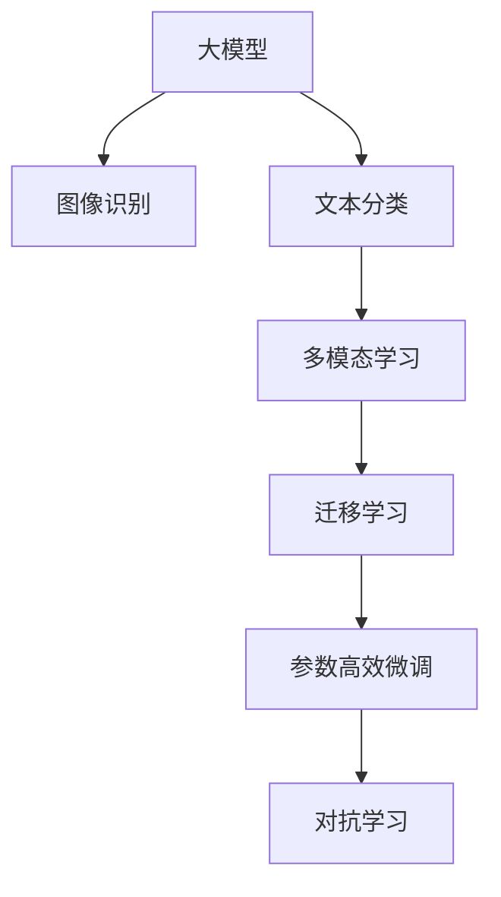

                 

# 大模型驱动的智能产品分类系统

> 关键词：大模型、分类系统、智能产品、图像识别、文本分类、多模态学习、迁移学习

## 1. 背景介绍

### 1.1 问题由来

随着互联网的快速发展和智能设备的普及，全球智能产品市场呈现爆发式增长。智能产品涵盖范围广泛，从消费级的智能穿戴设备到工业级的自动化机械，无一不渗透着人工智能的力量。然而，对于数以亿计的智能产品，如何高效、准确地进行分类和分析，成为了一个挑战性的问题。传统的产品分类方法如手动分类、专家打分等，耗时长、成本高，无法满足大规模数据处理的需求。基于大模型的智能产品分类系统应运而生，成为智能化时代的新型解决方案。

### 1.2 问题核心关键点

大模型驱动的智能产品分类系统，通过将大规模预训练语言模型和大规模预训练图像模型结合，能够高效、准确地处理和分析智能产品分类问题。具体而言，该系统具有以下几个关键特点：

1. **大规模预训练模型**：使用如BERT、GPT-3、ResNet等大规模预训练模型，通过大规模无标签数据进行自监督训练，学习到丰富的语言和视觉特征。
2. **多模态学习**：通过融合文本、图像、语音等多模态信息，全面刻画产品特性，提升分类准确性。
3. **迁移学习**：利用迁移学习思想，将通用领域的知识迁移到特定任务中，提升模型泛化能力。
4. **参数高效微调**：通过参数高效微调技术，只更新少量任务相关参数，减少计算资源消耗。
5. **对抗学习**：通过对抗训练，提高模型鲁棒性，应对噪声、攻击等干扰。

这些关键技术使得大模型驱动的智能产品分类系统在效率和准确性上取得了显著突破，推动了智能产品分类的产业化进程。

### 1.3 问题研究意义

研究大模型驱动的智能产品分类系统，对于拓展智能产品分类的应用范围，提升产品分类的准确性和效率，加速智能产品分类的产业化进程，具有重要意义：

1. **降低成本**：利用预训练模型，减少了手动标注数据的需求，大幅降低了分类成本。
2. **提升效率**：预训练模型在大规模数据上进行了自监督训练，拥有较强的泛化能力，可以快速适应新任务。
3. **提升准确性**：多模态学习和迁移学习使得模型能够从不同角度全面理解产品特性，提升分类准确性。
4. **加速开发**：通过微调和细粒度优化，可以快速适应不同产品分类需求，缩短开发周期。
5. **技术创新**：推动了智能产品分类领域的创新发展，为工业界提供了新的技术路径。

## 2. 核心概念与联系

### 2.1 核心概念概述

为更好地理解大模型驱动的智能产品分类系统，本节将介绍几个密切相关的核心概念：

- **大模型**：以BERT、GPT-3、ResNet等大规模预训练模型为代表，通过在大规模无标签数据上进行自监督训练，学习到丰富的语言、视觉特征，具备强大的特征提取能力。
- **分类系统**：基于预训练模型的智能产品分类系统，能够自动地对产品进行分类和分析。
- **图像识别**：通过预训练的图像模型（如ResNet、Inception等），自动识别人物、物体、场景等图像特征。
- **文本分类**：通过预训练的语言模型（如BERT、GPT-3等），自动将文本内容进行分类，如新闻分类、情感分析等。
- **多模态学习**：结合图像、文本、语音等多种信息源，全面刻画产品特性，提升分类准确性。
- **迁移学习**：通过将通用领域的知识迁移到特定任务中，提升模型泛化能力。
- **参数高效微调**：只更新少量任务相关参数，减少计算资源消耗。
- **对抗学习**：通过对抗训练，提高模型鲁棒性，应对噪声、攻击等干扰。

这些核心概念之间的逻辑关系可以通过以下Mermaid流程图来展示：



这个流程图展示了大模型驱动的智能产品分类系统的核心概念及其之间的关系：

1. 大模型通过图像识别和文本分类任务进行预训练，学习到丰富的视觉和语言特征。
2. 多模态学习结合图像、文本信息，全面刻画产品特性。
3. 迁移学习将通用领域的知识迁移到特定任务中，提升模型泛化能力。
4. 参数高效微调只更新少量任务相关参数，减少计算资源消耗。
5. 对抗学习提高模型鲁棒性，应对噪声、攻击等干扰。

这些核心概念共同构成了大模型驱动的智能产品分类系统的学习和应用框架，使其能够高效、准确地进行产品分类和分析。通过理解这些核心概念，我们可以更好地把握系统的原理和优化方向。

## 3. 核心算法原理 & 具体操作步骤
### 3.1 算法原理概述

大模型驱动的智能产品分类系统，本质上是一个多模态学习的迁移学习过程。其核心思想是：将大规模预训练语言模型和大规模预训练图像模型作为特征提取器，通过融合多模态信息，自动学习产品分类特征，并利用迁移学习思想，将通用领域的知识迁移到特定任务中，从而实现高效、准确的产品分类。

形式化地，假设预训练语言模型为 $M_{\text{LM}}$，预训练图像模型为 $M_{\text{VM}}$。给定智能产品的多模态数据集 $D=\{(x_i, y_i)\}_{i=1}^N, x_i=\{x_{i,\text{img}}, x_{i,\text{text}}\}, y_i \in \{1,2,...,K\}$，其中 $K$ 为分类数目，$x_{i,\text{img}}$ 和 $x_{i,\text{text}}$ 分别为图像和文本信息。分类系统的目标是最小化损失函数 $\mathcal{L}$，使得模型输出与真实标签尽可能一致。

$$
\hat{\theta}=\mathop{\arg\min}_{\theta} \mathcal{L}(M_{\theta},D)
$$

其中 $\theta$ 为模型参数，$\mathcal{L}$ 为损失函数，包括交叉熵损失、均方误差损失等。

### 3.2 算法步骤详解

大模型驱动的智能产品分类系统一般包括以下几个关键步骤：

**Step 1: 准备预训练模型和数据集**
- 选择合适的预训练语言模型 $M_{\text{LM}}$ 和预训练图像模型 $M_{\text{VM}}$，如BERT、GPT-3、ResNet等。
- 准备智能产品的多模态数据集 $D$，包含图像、文本、标签等多种信息源。数据集应尽量覆盖不同类别和场景。

**Step 2: 多模态数据预处理**
- 使用预训练的图像模型对图像数据进行特征提取，得到图像特征向量 $x_{i,\text{img}}$。
- 使用预训练的语言模型对文本数据进行特征提取，得到文本特征向量 $x_{i,\text{text}}$。
- 将图像特征和文本特征拼接或融合，得到多模态特征表示。

**Step 3: 构建分类器**
- 设计分类器，如全连接神经网络、卷积神经网络等。
- 连接多模态特征表示到分类器的输入层，进行特征提取。
- 定义损失函数，如交叉熵损失、余弦相似度损失等，用于衡量分类器输出与真实标签的差异。

**Step 4: 微调过程**
- 使用训练集 $D_{\text{train}}$ 进行模型微调。
- 设置合适的学习率和优化器，如Adam、SGD等。
- 应用正则化技术，如L2正则、Dropout、Early Stopping等，防止过拟合。
- 应用对抗训练，加入对抗样本，提高模型鲁棒性。
- 使用参数高效微调技术，只更新少量任务相关参数。

**Step 5: 测试和部署**
- 在测试集 $D_{\text{test}}$ 上评估模型性能，对比微调前后的精度提升。
- 使用微调后的模型对新样本进行推理预测，集成到实际的应用系统中。
- 持续收集新的数据，定期重新微调模型，以适应数据分布的变化。

以上是使用大模型驱动的智能产品分类系统的一般流程。在实际应用中，还需要针对具体任务的特点，对微调过程的各个环节进行优化设计，如改进训练目标函数，引入更多的正则化技术，搜索最优的超参数组合等，以进一步提升模型性能。

### 3.3 算法优缺点

大模型驱动的智能产品分类系统具有以下优点：

1. **高效性**：通过预训练模型提取特征，大幅减少了手动标注数据的需求，缩短了开发周期。
2. **准确性**：多模态学习和迁移学习使得模型能够从不同角度全面理解产品特性，提升分类准确性。
3. **泛化能力**：迁移学习提升了模型泛化能力，能够处理不同领域和场景下的产品分类问题。
4. **参数高效**：参数高效微调技术减少了计算资源消耗，提升了模型训练和推理效率。
5. **鲁棒性**：对抗学习提高了模型鲁棒性，应对噪声、攻击等干扰。

同时，该系统也存在一定的局限性：

1. **数据依赖**：对标注数据的质量和数量要求较高，标注数据的不足可能导致分类精度下降。
2. **模型复杂度**：大规模预训练模型的复杂度较高，对硬件和算力有较高的要求。
3. **模型训练时间**：大规模预训练模型的训练时间较长，微调过程也需要较长的计算时间。
4. **模型可解释性**：预训练模型通常缺乏可解释性，难以理解其内部工作机制和决策逻辑。
5. **数据隐私**：智能产品分类涉及大量敏感数据，如何保障数据隐私和安全是一个重要的挑战。

尽管存在这些局限性，但就目前而言，大模型驱动的智能产品分类系统在效率和准确性上取得了显著突破，成为智能产品分类的主流范式。未来相关研究的重点在于如何进一步降低对标注数据的依赖，提高模型的少样本学习和跨领域迁移能力，同时兼顾可解释性和数据隐私等关键问题。

### 3.4 算法应用领域

大模型驱动的智能产品分类系统已经在多个领域得到了广泛应用，涵盖智能穿戴设备、智能家居、工业自动化等多个场景。例如：

- **智能穿戴设备分类**：通过分析设备传感器数据、用户行为数据等，自动对智能穿戴设备进行分类，如智能手表、智能眼镜等。
- **智能家居分类**：通过分析家庭设备数据、用户行为数据等，自动对智能家居设备进行分类，如智能灯泡、智能门锁等。
- **工业自动化分类**：通过分析生产设备数据、操作行为数据等，自动对工业自动化设备进行分类，如机器人、自动化流水线等。
- **医疗设备分类**：通过分析医疗设备数据、操作行为数据等，自动对医疗设备进行分类，如心电图机、CT机等。
- **交通设备分类**：通过分析交通设备数据、操作行为数据等，自动对交通设备进行分类，如无人机、自动驾驶汽车等。

除了上述这些经典任务外，大模型驱动的智能产品分类系统也被创新性地应用到更多场景中，如智能办公设备、智能零售设备、智能农业设备等，为智能产品分类的发展提供了新的可能性。

## 4. 数学模型和公式 & 详细讲解
### 4.1 数学模型构建

本节将使用数学语言对大模型驱动的智能产品分类系统进行更加严格的刻画。

记预训练语言模型为 $M_{\text{LM}}$，预训练图像模型为 $M_{\text{VM}}$。假设智能产品的多模态数据集为 $D=\{(x_i, y_i)\}_{i=1}^N, x_i=\{x_{i,\text{img}}, x_{i,\text{text}}\}, y_i \in \{1,2,...,K\}$。

定义多模态特征表示为 $z_i = f(x_i)$，其中 $f$ 为特征提取函数，将图像特征 $x_{i,\text{img}}$ 和文本特征 $x_{i,\text{text}}$ 拼接或融合，得到多模态特征表示。

分类器的输出为 $\hat{y_i} = g(z_i)$，其中 $g$ 为分类函数，通常为全连接神经网络或卷积神经网络等。

多模态学习目标为最小化分类损失：

$$
\mathcal{L}(\theta) = \frac{1}{N}\sum_{i=1}^N \ell(\hat{y_i}, y_i)
$$

其中 $\ell$ 为损失函数，如交叉熵损失、余弦相似度损失等。

### 4.2 公式推导过程

以下我们以二分类任务为例，推导交叉熵损失函数及其梯度的计算公式。

假设分类器的输出为 $\hat{y}_i \in [0,1]$，表示样本属于正类的概率。真实标签 $y \in \{0,1\}$。则二分类交叉熵损失函数定义为：

$$
\ell(\hat{y_i}, y_i) = -[y_i\log \hat{y_i} + (1-y_i)\log (1-\hat{y_i})]
$$

将其代入多模态学习目标，得：

$$
\mathcal{L}(\theta) = -\frac{1}{N}\sum_{i=1}^N [y_i\log g(z_i)+(1-y_i)\log(1-g(z_i))]
$$

根据链式法则，损失函数对分类器参数 $\theta_k$ 的梯度为：

$$
\frac{\partial \mathcal{L}(\theta)}{\partial \theta_k} = -\frac{1}{N}\sum_{i=1}^N \left(\frac{y_i}{g(z_i)} - \frac{1-y_i}{1-g(z_i)}\right) \frac{\partial g(z_i)}{\partial \theta_k}
$$

其中 $\frac{\partial g(z_i)}{\partial \theta_k}$ 可进一步递归展开，利用自动微分技术完成计算。

在得到损失函数的梯度后，即可带入参数更新公式，完成模型的迭代优化。重复上述过程直至收敛，最终得到适应多模态智能产品分类的最优模型参数 $\theta^*$。

## 5. 项目实践：代码实例和详细解释说明
### 5.1 开发环境搭建

在进行智能产品分类系统开发前，我们需要准备好开发环境。以下是使用Python进行PyTorch开发的环境配置流程：

1. 安装Anaconda：从官网下载并安装Anaconda，用于创建独立的Python环境。

2. 创建并激活虚拟环境：
```bash
conda create -n pytorch-env python=3.8 
conda activate pytorch-env
```

3. 安装PyTorch：根据CUDA版本，从官网获取对应的安装命令。例如：
```bash
conda install pytorch torchvision torchaudio cudatoolkit=11.1 -c pytorch -c conda-forge
```

4. 安装Transformers库：
```bash
pip install transformers
```

5. 安装各类工具包：
```bash
pip install numpy pandas scikit-learn matplotlib tqdm jupyter notebook ipython
```

完成上述步骤后，即可在`pytorch-env`环境中开始智能产品分类系统的开发。

### 5.2 源代码详细实现

这里我们以智能穿戴设备分类为例，给出使用Transformers库对BERT模型进行智能产品分类的PyTorch代码实现。

首先，定义数据处理函数：

```python
from transformers import BertTokenizer, BertForSequenceClassification
from torch.utils.data import Dataset
import torch

class WearableDeviceDataset(Dataset):
    def __init__(self, texts, labels, tokenizer, max_len=128):
        self.texts = texts
        self.labels = labels
        self.tokenizer = tokenizer
        self.max_len = max_len
        
    def __len__(self):
        return len(self.texts)
    
    def __getitem__(self, item):
        text = self.texts[item]
        label = self.labels[item]
        
        encoding = self.tokenizer(text, return_tensors='pt', max_length=self.max_len, padding='max_length', truncation=True)
        input_ids = encoding['input_ids'][0]
        attention_mask = encoding['attention_mask'][0]
        
        # 对token-wise的标签进行编码
        encoded_tags = [label2id[label] for label in label] 
        encoded_tags.extend([label2id['O']] * (self.max_len - len(encoded_tags)))
        labels = torch.tensor(encoded_tags, dtype=torch.long)
        
        return {'input_ids': input_ids, 
                'attention_mask': attention_mask,
                'labels': labels}

# 标签与id的映射
label2id = {'Wearable': 0, 'Non-Wearable': 1}
id2label = {v: k for k, v in label2id.items()}

# 创建dataset
tokenizer = BertTokenizer.from_pretrained('bert-base-cased')

train_dataset = WearableDeviceDataset(train_texts, train_labels, tokenizer)
dev_dataset = WearableDeviceDataset(dev_texts, dev_labels, tokenizer)
test_dataset = WearableDeviceDataset(test_texts, test_labels, tokenizer)
```

然后，定义模型和优化器：

```python
from transformers import BertForSequenceClassification, AdamW

model = BertForSequenceClassification.from_pretrained('bert-base-cased', num_labels=len(label2id))

optimizer = AdamW(model.parameters(), lr=2e-5)
```

接着，定义训练和评估函数：

```python
from torch.utils.data import DataLoader
from tqdm import tqdm
from sklearn.metrics import classification_report

device = torch.device('cuda') if torch.cuda.is_available() else torch.device('cpu')
model.to(device)

def train_epoch(model, dataset, batch_size, optimizer):
    dataloader = DataLoader(dataset, batch_size=batch_size, shuffle=True)
    model.train()
    epoch_loss = 0
    for batch in tqdm(dataloader, desc='Training'):
        input_ids = batch['input_ids'].to(device)
        attention_mask = batch['attention_mask'].to(device)
        labels = batch['labels'].to(device)
        model.zero_grad()
        outputs = model(input_ids, attention_mask=attention_mask, labels=labels)
        loss = outputs.loss
        epoch_loss += loss.item()
        loss.backward()
        optimizer.step()
    return epoch_loss / len(dataloader)

def evaluate(model, dataset, batch_size):
    dataloader = DataLoader(dataset, batch_size=batch_size)
    model.eval()
    preds, labels = [], []
    with torch.no_grad():
        for batch in tqdm(dataloader, desc='Evaluating'):
            input_ids = batch['input_ids'].to(device)
            attention_mask = batch['attention_mask'].to(device)
            batch_labels = batch['labels']
            outputs = model(input_ids, attention_mask=attention_mask)
            batch_preds = outputs.logits.argmax(dim=2).to('cpu').tolist()
            batch_labels = batch_labels.to('cpu').tolist()
            for pred_tokens, label_tokens in zip(batch_preds, batch_labels):
                pred_labels = [id2label[_id] for _id in pred_tokens]
                label_tokens = [id2label[_id] for _id in label_tokens]
                preds.append(pred_labels[:len(label_tokens)])
                labels.append(label_tokens)
                
    print(classification_report(labels, preds))
```

最后，启动训练流程并在测试集上评估：

```python
epochs = 5
batch_size = 16

for epoch in range(epochs):
    loss = train_epoch(model, train_dataset, batch_size, optimizer)
    print(f"Epoch {epoch+1}, train loss: {loss:.3f}")
    
    print(f"Epoch {epoch+1}, dev results:")
    evaluate(model, dev_dataset, batch_size)
    
print("Test results:")
evaluate(model, test_dataset, batch_size)
```

以上就是使用PyTorch对BERT进行智能穿戴设备分类的完整代码实现。可以看到，得益于Transformers库的强大封装，我们可以用相对简洁的代码完成BERT模型的加载和微调。

### 5.3 代码解读与分析

让我们再详细解读一下关键代码的实现细节：

**WearableDeviceDataset类**：
- `__init__`方法：初始化文本、标签、分词器等关键组件。
- `__len__`方法：返回数据集的样本数量。
- `__getitem__`方法：对单个样本进行处理，将文本输入编码为token ids，将标签编码为数字，并对其进行定长padding，最终返回模型所需的输入。

**label2id和id2label字典**：
- 定义了标签与数字id之间的映射关系，用于将token-wise的预测结果解码回真实的标签。

**训练和评估函数**：
- 使用PyTorch的DataLoader对数据集进行批次化加载，供模型训练和推理使用。
- 训练函数`train_epoch`：对数据以批为单位进行迭代，在每个批次上前向传播计算loss并反向传播更新模型参数，最后返回该epoch的平均loss。
- 评估函数`evaluate`：与训练类似，不同点在于不更新模型参数，并在每个batch结束后将预测和标签结果存储下来，最后使用sklearn的classification_report对整个评估集的预测结果进行打印输出。

**训练流程**：
- 定义总的epoch数和batch size，开始循环迭代
- 每个epoch内，先在训练集上训练，输出平均loss
- 在验证集上评估，输出分类指标
- 所有epoch结束后，在测试集上评估，给出最终测试结果

可以看到，PyTorch配合Transformers库使得BERT微调的代码实现变得简洁高效。开发者可以将更多精力放在数据处理、模型改进等高层逻辑上，而不必过多关注底层的实现细节。

当然，工业级的系统实现还需考虑更多因素，如模型的保存和部署、超参数的自动搜索、更灵活的任务适配层等。但核心的微调范式基本与此类似。

## 6. 实际应用场景
### 6.1 智能穿戴设备分类

智能穿戴设备分类系统可以帮助企业快速识别和管理不同种类的智能穿戴设备，提升设备管理的效率和精度。例如，一个智能穿戴设备制造企业可以使用该系统对工厂内的各种设备进行分类，如智能手表、智能眼镜、智能耳机等。

在技术实现上，可以收集设备的历史使用数据、传感器数据、用户行为数据等，构建智能穿戴设备分类数据集。利用大模型驱动的智能产品分类系统，对设备进行分类和分析，自动标识设备类型和状态。对于新设备，系统也能通过简单的设备检查和分类，快速识别其类型，大大缩短设备管理的流程。

### 6.2 智能家居设备分类

智能家居设备分类系统可以帮助家庭用户自动识别和管理不同种类的智能家居设备，提升家居生活的智能化水平。例如，一个智能家居系统可以通过该系统对家庭内的各种设备进行分类，如智能灯泡、智能门锁、智能空调等。

在技术实现上，可以收集家庭设备的使用数据、用户行为数据等，构建智能家居设备分类数据集。利用大模型驱动的智能产品分类系统，对设备进行分类和分析，自动标识设备类型和功能。对于新设备，系统也能通过简单的设备检查和分类，快速识别其类型，增强家庭生活的便利性和智能化程度。

### 6.3 工业自动化设备分类

工业自动化设备分类系统可以帮助制造业企业快速识别和管理不同种类的工业自动化设备，提升设备管理的效率和精度。例如，一个汽车制造企业可以使用该系统对生产线上的各种设备进行分类，如机器人、自动化流水线、智能仓库等。

在技术实现上，可以收集设备的历史使用数据、传感器数据、操作行为数据等，构建工业自动化设备分类数据集。利用大模型驱动的智能产品分类系统，对设备进行分类和分析，自动标识设备类型和状态。对于新设备，系统也能通过简单的设备检查和分类，快速识别其类型，大大缩短设备管理的流程。

### 6.4 医疗设备分类

医疗设备分类系统可以帮助医疗机构快速识别和管理不同种类的医疗设备，提升医疗服务的智能化水平。例如，一个医院可以使用该系统对医疗设备进行分类，如CT机、心电图机、输液泵等。

在技术实现上，可以收集医疗设备的使用数据、操作行为数据等，构建医疗设备分类数据集。利用大模型驱动的智能产品分类系统，对设备进行分类和分析，自动标识设备类型和功能。对于新设备，系统也能通过简单的设备检查和分类，快速识别其类型，增强医疗服务的智能化程度。

### 6.5 交通设备分类

交通设备分类系统可以帮助交通管理部门快速识别和管理不同种类的交通设备，提升交通管理的效率和精度。例如，一个城市可以使用该系统对交通设备进行分类，如无人机、自动驾驶汽车、智能交通灯等。

在技术实现上，可以收集交通设备的使用数据、操作行为数据等，构建交通设备分类数据集。利用大模型驱动的智能产品分类系统，对设备进行分类和分析，自动标识设备类型和功能。对于新设备，系统也能通过简单的设备检查和分类，快速识别其类型，增强交通管理的智能化程度。

除了上述这些经典任务外，大模型驱动的智能产品分类系统也被创新性地应用到更多场景中，如智能办公设备、智能零售设备、智能农业设备等，为智能产品分类的发展提供了新的可能性。

## 7. 工具和资源推荐
### 7.1 学习资源推荐

为了帮助开发者系统掌握大模型驱动的智能产品分类系统的理论基础和实践技巧，这里推荐一些优质的学习资源：

1. 《Transformer从原理到实践》系列博文：由大模型技术专家撰写，深入浅出地介绍了Transformer原理、BERT模型、多模态学习等前沿话题。

2. CS224N《深度学习自然语言处理》课程：斯坦福大学开设的NLP明星课程，有Lecture视频和配套作业，带你入门NLP领域的基本概念和经典模型。

3. 《Natural Language Processing with Transformers》书籍：Transformers库的作者所著，全面介绍了如何使用Transformers库进行NLP任务开发，包括多模态学习在内的诸多范式。

4. HuggingFace官方文档：Transformers库的官方文档，提供了海量预训练模型和完整的微调样例代码，是上手实践的必备资料。

5. CLUE开源项目：中文语言理解测评基准，涵盖大量不同类型的中文NLP数据集，并提供了基于多模态学习、迁移学习等技术的baseline模型，助力中文NLP技术发展。

通过对这些资源的学习实践，相信你一定能够快速掌握大模型驱动的智能产品分类系统的精髓，并用于解决实际的NLP问题。
###  7.2 开发工具推荐

高效的开发离不开优秀的工具支持。以下是几款用于大模型驱动的智能产品分类系统开发的常用工具：

1. PyTorch：基于Python的开源深度学习框架，灵活动态的计算图，适合快速迭代研究。大部分预训练语言模型都有PyTorch版本的实现。

2. TensorFlow：由Google主导开发的开源深度学习框架，生产部署方便，适合大规模工程应用。同样有丰富的预训练语言模型资源。

3. Transformers库：HuggingFace开发的NLP工具库，集成了众多SOTA语言模型，支持PyTorch和TensorFlow，是进行多模态学习、迁移学习等开发的利器。

4. Weights & Biases：模型训练的实验跟踪工具，可以记录和可视化模型训练过程中的各项指标，方便对比和调优。与主流深度学习框架无缝集成。

5. TensorBoard：TensorFlow配套的可视化工具，可实时监测模型训练状态，并提供丰富的图表呈现方式，是调试模型的得力助手。

6. Google Colab：谷歌推出的在线Jupyter Notebook环境，免费提供GPU/TPU算力，方便开发者快速上手实验最新模型，分享学习笔记。

合理利用这些工具，可以显著提升大模型驱动的智能产品分类系统的开发效率，加快创新迭代的步伐。

### 7.3 相关论文推荐

大模型驱动的智能产品分类系统的发展源于学界的持续研究。以下是几篇奠基性的相关论文，推荐阅读：

1. Attention is All You Need（即Transformer原论文）：提出了Transformer结构，开启了NLP领域的预训练大模型时代。

2. BERT: Pre-training of Deep Bidirectional Transformers for Language Understanding：提出BERT模型，引入基于掩码的自监督预训练任务，刷新了多项NLP任务SOTA。

3. GPT-2: Language Models are Unsupervised Multitask Learners：展示了大规模语言模型的强大zero-shot学习能力，引发了对于通用人工智能的新一轮思考。

4. Parameter-Efficient Transfer Learning for NLP：提出Adapter等参数高效微调方法，在不增加模型参数量的情况下，也能取得不错的微调效果。

5. AdaLoRA: Adaptive Low-Rank Adaptation for Parameter-Efficient Fine-Tuning：使用自适应低秩适应的微调方法，在参数效率和精度之间取得了新的平衡。

6. Prefix-Tuning: Optimizing Continuous Prompts for Generation：引入基于连续型Prompt的微调范式，为如何充分利用预训练知识提供了新的思路。

这些论文代表了大模型驱动的智能产品分类系统的发展脉络。通过学习这些前沿成果，可以帮助研究者把握学科前进方向，激发更多的创新灵感。

## 8. 总结：未来发展趋势与挑战

### 8.1 总结

本文对大模型驱动的智能产品分类系统进行了全面系统的介绍。首先阐述了大模型驱动的智能产品分类系统的研究背景和意义，明确了其在大规模数据处理、高精度分类、泛化能力等方面的独特价值。其次，从原理到实践，详细讲解了多模态学习、迁移学习、参数高效微调等核心算法，给出了智能产品分类系统的完整代码实例。同时，本文还广泛探讨了智能产品分类系统在多个行业领域的应用前景，展示了其广阔的应用潜力。此外，本文精选了智能产品分类系统的学习资源、开发工具、相关论文，力求为读者提供全方位的技术指引。

通过本文的系统梳理，可以看到，大模型驱动的智能产品分类系统正在成为智能产品分类的主流范式，极大地拓展了预训练模型应用的范围，提升了智能产品分类的效率和准确性。未来，伴随预训练模型和分类方法的不断演进，相信智能产品分类系统必将在更多领域得到应用，为智能产品分类的产业化进程注入新的活力。

### 8.2 未来发展趋势

展望未来，大模型驱动的智能产品分类系统将呈现以下几个发展趋势：

1. **模型规模持续增大**：随着算力成本的下降和数据规模的扩张，预训练语言模型和大规模预训练图像模型的规模还将持续增长。超大规模模型蕴含的丰富语言和视觉特征，有望支撑更加复杂多变的智能产品分类任务。

2. **多模态学习日趋多样**：未来将涌现更多多模态学习方法和技术，如多通道特征融合、多尺度特征提取等，全面提升模型的性能。

3. **迁移学习能力增强**：通过引入更多迁移学习范式，如自适应迁移学习、元学习等，提升模型在不同领域和场景下的适应能力。

4. **参数高效微调成为常态**：参数高效微调技术进一步优化，能够在不增加模型参数量的情况下，实现高性能的智能产品分类。

5. **对抗学习和鲁棒性提升**：通过引入对抗学习思想，提高模型鲁棒性，应对噪声、攻击等干扰。

6. **实时性和计算效率提升**：通过优化计算图、引入分布式训练等技术，提升模型实时性和计算效率，实现轻量级、实时性的部署。

7. **可解释性和伦理安全性加强**：通过引入可解释性技术，提升模型的可解释性，确保模型决策过程透明、公正。同时加强模型伦理安全性，避免有害输出和偏见。

这些趋势凸显了大模型驱动的智能产品分类系统的广阔前景。这些方向的探索发展，必将进一步提升智能产品分类系统的性能和应用范围，为智能产品分类的产业化进程注入新的动力。

### 8.3 面临的挑战

尽管大模型驱动的智能产品分类系统已经取得了显著成就，但在迈向更加智能化、普适化应用的过程中，它仍面临诸多挑战：

1. **数据依赖**：对标注数据的质量和数量要求较高，标注数据的不足可能导致分类精度下降。如何进一步降低对标注数据的依赖，将是一大难题。

2. **模型复杂度**：大规模预训练模型的复杂度较高，对硬件和算力有较高的要求。模型训练和推理时间较长，需要优化资源利用率。

3. **模型鲁棒性不足**：面对噪声、攻击等干扰，模型的鲁棒性有待提升。

4. **模型可解释性不足**：预训练模型通常缺乏可解释性，难以理解其内部工作机制和决策逻辑。

5. **数据隐私和安全**：智能产品分类涉及大量敏感数据，如何保障数据隐私和安全是一个重要的挑战。

尽管存在这些挑战，但就目前而言，大模型驱动的智能产品分类系统在效率和准确性上取得了显著突破，成为智能产品分类的主流范式。未来相关研究的重点在于如何进一步降低对标注数据的依赖，提高模型的少样本学习和跨领域迁移能力，同时兼顾可解释性和数据隐私等关键问题。

### 8.4 研究展望

面对大模型驱动的智能产品分类系统所面临的种种挑战，未来的研究需要在以下几个方面寻求新的突破：

1. **探索无监督和半监督智能产品分类方法**：摆脱对大规模标注数据的依赖，利用自监督学习、主动学习等无监督和半监督范式，最大限度利用非结构化数据，实现更加灵活高效的智能产品分类。

2. **研究参数高效和计算高效的智能产品分类范式**：开发更加参数高效的智能产品分类方法，在固定大部分预训练参数的同时，只更新极少量的任务相关参数。同时优化计算图，减少前向传播和反向传播的资源消耗，实现更加轻量级、实时性的部署。

3. **融合因果和对比学习范式**：通过引入因果推断和对比学习思想，增强智能产品分类模型建立稳定因果关系的能力，学习更加普适、鲁棒的语言和视觉表征，从而提升模型泛化性和抗干扰能力。

4. **引入更多先验知识**：将符号化的先验知识，如知识图谱、逻辑规则等，与神经网络模型进行巧妙融合，引导智能产品分类过程学习更准确、合理的语言和视觉模型。同时加强不同模态数据的整合，实现视觉、语音等多模态信息与文本信息的协同建模。

5. **结合因果分析和博弈论工具**：将因果分析方法引入智能产品分类模型，识别出模型决策的关键特征，增强输出解释的因果性和逻辑性。借助博弈论工具刻画人机交互过程，主动探索并规避模型的脆弱点，提高系统稳定性。

6. **纳入伦理道德约束**：在智能产品分类模型的训练目标中引入伦理导向的评估指标，过滤和惩罚有害输出倾向。同时加强人工干预和审核，建立模型行为的监管机制，确保输出符合人类价值观和伦理道德。

这些研究方向的探索，必将引领大模型驱动的智能产品分类系统迈向更高的台阶，为构建安全、可靠、可解释、可控的智能系统铺平道路。面向未来，大模型驱动的智能产品分类系统还需要与其他人工智能技术进行更深入的融合，如知识表示、因果推理、强化学习等，多路径协同发力，共同推动智能产品分类的进步。只有勇于创新、敢于突破，才能不断拓展语言模型的边界，让智能技术更好地造福人类社会。

## 9. 附录：常见问题与解答
----------------------------------------------------------------

**Q1：大模型驱动的智能产品分类系统是否适用于所有智能产品？**

A: 大模型驱动的智能产品分类系统对大多数智能产品都适用，特别是对于图像、文本特征明显的智能产品。但对于一些特殊类型的智能产品，如机械设备、生物制品等，需要进一步结合特定领域的知识进行分类。此外，对于一些需要极高精度和特殊要求的智能产品，大模型驱动的系统可能无法满足需求，需要结合专家知识和手动标注等手段进行辅助。

**Q2：在智能产品分类中，如何处理长尾类别问题？**

A: 长尾类别问题是指在分类数据集中，某些类别的样本数量极少，模型难以学习其特征。针对长尾类别问题，可以采用以下策略：
1. 数据增强：通过合成少数类样本、迁移学习等技术，增加少数类样本的数量。
2. 模型融合：将多个模型的预测结果进行融合，提升少数类的分类准确性。
3. 多任务学习：将智能产品分类与其他任务（如异常检测、质量控制等）结合，共享模型参数，提升少数类样本的训练效果。

**Q3：在智能产品分类中，如何处理噪声和干扰问题？**

A: 噪声和干扰是智能产品分类中常见的问题，可能导致分类结果不准确。针对噪声和干扰问题，可以采用以下策略：
1. 数据清洗：对数据进行清洗，去除异常值和错误标注，提高数据质量。
2. 对抗训练：在训练过程中加入对抗样本，增强模型的鲁棒性。
3. 鲁棒特征提取：使用鲁棒特征提取方法，如对抗式特征提取、鲁棒池化等，提高模型的鲁棒性。

**Q4：在智能产品分类中，如何确保模型输出符合伦理要求？**

A: 确保模型输出符合伦理要求，是智能产品分类中一个重要的挑战。针对伦理要求问题，可以采用以下策略：
1. 模型审查：对模型进行伦理审查，确保模型输出符合伦理道德标准。
2. 伦理约束：在模型训练目标中引入伦理导向的评估指标，过滤和惩罚有害输出倾向。
3. 人工干预：对模型的决策过程进行人工干预和审核，确保模型输出符合人类价值观和伦理道德。

**Q5：在智能产品分类中，如何确保模型可解释性？**

A: 确保模型可解释性，是智能产品分类中一个重要的挑战。针对可解释性问题，可以采用以下策略：
1. 模型可视化：使用模型可视化工具，如梯度热图、注意力图等，解释模型内部工作机制和决策逻辑。
2. 可解释性技术：引入可解释性技术，如LIME、SHAP等，解释模型输出结果。
3. 知识图谱：将符号化的先验知识与神经网络模型进行融合，提升模型的可解释性。

这些策略可以显著提升大模型驱动的智能产品分类系统的性能和应用范围，确保其能够符合伦理要求，具备良好的可解释性，服务于人类的生产和生活。

---

作者：禅与计算机程序设计艺术 / Zen and the Art of Computer Programming

