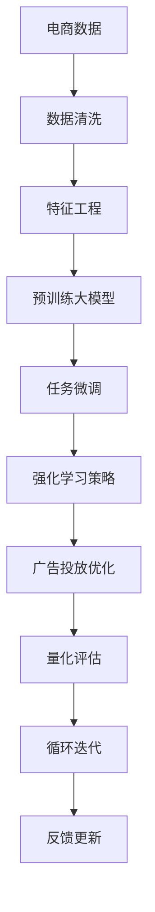

                 

# 大模型驱动的电商个性化促销效果预测与优化

> 关键词：
> 大模型, 电商, 个性化推荐, 促销效果预测, 强化学习, 深度学习, 量化评估, 广告投放, 广告优化

## 1. 背景介绍

### 1.1 问题由来

在电子商务行业中，促销活动如满减、折扣、优惠券等是商家吸引用户、提升销售额的重要手段。然而，如何精准地预测促销活动的有效性，合理分配预算，最大化ROI（投资回报率），始终是商家关注的重点。传统的促销活动预测主要依赖于历史数据统计，但这种基于历史统计的方法难以处理大量复杂、高维的特征，导致预测效果不尽人意。

近年来，深度学习和大模型的崛起为电商促销活动预测带来了新的机遇。通过在大规模电商数据上预训练大模型，可以提取到丰富的用户行为特征和商品属性信息，从而提升促销效果预测的准确性。大模型驱动的促销活动预测，不仅能够更好地理解用户意图和商品特性，还能够灵活适应电商行业的多变特征，为促销优化提供了强有力的支持。

### 1.2 问题核心关键点

大模型驱动的电商个性化促销活动预测与优化，主要是通过深度学习和强化学习等技术手段，在大模型基础上进行任务微调，实现促销效果的精准预测和预算优化。其核心在于：

- 数据驱动的预训练：利用电商领域的大量数据，通过预训练大模型，提取用户行为和商品属性的高维表示。
- 强化学习策略：根据预测结果和广告实际效果，优化广告投放策略，调整预算分配，提升ROI。
- 在线学习与迭代：通过在线学习，不断优化模型和策略，适应电商市场动态变化，持续提高广告投放效果。

## 2. 核心概念与联系

### 2.1 核心概念概述

为更好地理解大模型在电商促销活动预测与优化中的应用，本节将介绍几个关键概念：

- **大模型（Large Model）**：指具有大规模参数量，通过自监督或监督学习训练得到的深度神经网络模型。常见的如BERT、GPT等。
- **电商推荐系统（E-commerce Recommendation System）**：用于提升电商平台的购物体验和销售转化率的技术，通常包含推荐算法、个性化推荐等模块。
- **促销活动预测（Promotion Effect Prediction）**：预测电商促销活动的效果，包括点击率、转化率、销售额等关键指标，为广告投放策略提供数据支持。
- **强化学习（Reinforcement Learning, RL）**：通过与环境的交互，学习最优策略的机器学习范式。适用于电商广告投放预算优化，通过不断调整策略，提升投放效果。
- **深度学习（Deep Learning）**：包含多层神经网络结构的机器学习技术，通过学习数据中的复杂特征，实现精确的预测和分类任务。
- **广告投放优化（Ad Placement Optimization）**：通过优化广告的展示位置和展示时间，提升广告的点击率和转化率，最大化广告投放效果。
- **量化评估（Quantitative Evaluation）**：通过统计和计算广告投放效果的关键指标，评估广告投放策略的效果，为后续优化提供依据。

这些概念之间的逻辑关系可以通过以下Mermaid流程图来展示：



这个流程图展示了大模型在电商促销活动预测与优化中的核心概念及其关系：

1. 电商数据通过清洗和特征工程，进入预训练大模型的训练过程。
2. 预训练大模型提取用户行为和商品属性的高维表示。
3. 在预训练模型的基础上，进行任务微调，学习促销活动的效果预测模型。
4. 通过强化学习策略，调整广告投放策略，优化预算分配。
5. 广告投放优化提升广告效果，反馈到量化评估环节。
6. 量化评估结果反馈到微调模型和强化学习策略中，进行循环迭代。

## 3. 核心算法原理 & 具体操作步骤

### 3.1 算法原理概述

大模型驱动的电商促销活动预测与优化，本质上是一种基于深度学习和强化学习的协同优化过程。其核心思想是：

- **深度学习**：利用预训练大模型提取用户行为和商品属性的高维表示，构建预测模型。
- **强化学习**：通过不断调整广告投放策略，优化预算分配，提升广告投放效果。

形式化地，假设电商促销活动为 $P=\{p_i\}_{i=1}^N$，其中 $p_i$ 表示第 $i$ 次促销活动。目标是通过深度学习模型 $M_{\theta}$，对每次促销活动的效果进行预测，即：

$$
\hat{E}_i = M_{\theta}(x_i)
$$

其中，$x_i$ 表示第 $i$ 次促销活动的相关数据，$\hat{E}_i$ 为预测的点击率、转化率、销售额等效果指标。通过强化学习策略 $S$，不断调整广告投放策略，优化预算分配，使得累计效果最大化。最终目标为：

$$
\max_{S}\sum_{i=1}^N \hat{E}_i
$$

### 3.2 算法步骤详解

基于深度学习和强化学习的电商促销活动预测与优化，一般包括以下几个关键步骤：

**Step 1: 数据预处理与特征工程**
- 收集电商平台的各类促销活动数据，如商品价格、折扣、推广渠道、用户历史行为等。
- 对数据进行清洗、归一化、特征选择等预处理步骤。
- 设计合理的特征工程流程，提取用户行为和商品属性的高维特征，包括用户画像、商品标签、上下文信息等。

**Step 2: 大模型预训练**
- 选择合适的预训练大模型，如BERT、Transformer等，作为初始化参数。
- 在大规模电商数据上进行预训练，学习用户行为和商品属性的高维表示。

**Step 3: 任务微调**
- 在预训练模型的基础上，添加合适的输出层和损失函数，进行任务微调。
- 选择合适的优化算法及其参数，如AdamW、SGD等，设置学习率、批大小、迭代轮数等。
- 应用正则化技术，如L2正则、Dropout、Early Stopping等，防止过拟合。
- 利用小批量随机梯度下降（SGD）等方法，更新模型参数。

**Step 4: 强化学习策略**
- 根据预测结果和广告实际效果，设计强化学习策略。
- 构建强化学习环境，将促销活动与用户行为映射为状态和动作。
- 选择合适的强化学习算法，如Q-Learning、SARSA等，优化广告投放策略。
- 设置奖励函数，评估每次广告投放的效果，调整预算分配。

**Step 5: 广告投放优化**
- 根据强化学习策略，调整广告投放策略，优化预算分配。
- 优化广告展示位置和展示时间，提升广告点击率和转化率。
- 实时监测广告投放效果，根据量化评估结果进行策略调整。

**Step 6: 循环迭代与反馈更新**
- 将强化学习策略的结果反馈到微调模型中，进行循环迭代优化。
- 不断优化模型参数和强化学习策略，提高促销活动预测的准确性和广告投放效果。
- 在每次迭代后，重新评估模型效果，更新广告投放策略。

以上是基于深度学习和强化学习的电商促销活动预测与优化的主要步骤。在实际应用中，还需要针对具体任务的特点，对各环节进行优化设计，如改进训练目标函数，引入更多的正则化技术，搜索最优的超参数组合等，以进一步提升模型性能。

### 3.3 算法优缺点

基于深度学习和强化学习的大模型驱动电商促销活动预测与优化，具有以下优点：

- **泛化能力强**：大模型通过自监督学习获取的表示，能够应对电商市场的动态变化，具备较强的泛化能力。
- **适应性强**：深度学习模型和强化学习策略的协同优化，能够适应电商广告的多变特征，灵活调整广告投放策略。
- **效果显著**：在大模型基础上进行微调和优化，可以显著提升广告投放效果，提高ROI。

同时，该方法也存在一定的局限性：

- **计算资源要求高**：预训练大模型和任务微调需要大量的计算资源，增加了硬件投入成本。
- **模型复杂度高**：大模型和强化学习策略的结合，增加了系统的复杂度，需要更强的工程实践能力。
- **数据依赖性强**：模型效果依赖于电商数据的质量和多样性，数据获取和处理成本较高。
- **解释性不足**：深度学习和强化学习的决策过程缺乏可解释性，难以对模型的输出进行有效调试。

尽管存在这些局限性，但就目前而言，基于深度学习和强化学习的大模型驱动电商促销活动预测与优化方法，仍是电商广告投放预算优化的主流范式。未来相关研究的重点在于如何进一步降低计算资源需求，提高模型的解释性和泛化能力，同时兼顾模型的可解释性和伦理安全性等因素。

### 3.4 算法应用领域

基于大模型驱动的电商促销活动预测与优化方法，在电商广告投放优化、个性化推荐等领域已经得到了广泛的应用，具体包括：

- **广告投放优化**：通过大模型进行广告点击率预测，优化广告展示位置和展示时间，提升广告效果。
- **个性化推荐**：利用大模型提取用户行为和商品属性的高维表示，推荐用户感兴趣的促销活动，提升购物体验和转化率。
- **广告预算分配**：通过强化学习策略，动态调整广告投放预算，最大化广告投放效果。
- **商品搭配推荐**：结合大模型和推荐系统，推荐用户可能感兴趣的商品搭配，提升销售转化率。
- **个性化优惠券**：利用大模型预测用户的优惠券使用概率，个性化推荐优惠券，提高用户留存率和回购率。

除了上述这些经典应用外，大模型驱动的电商促销活动预测与优化方法也被创新性地应用到更多场景中，如智能客服、社交电商、快闪店等，为电商市场带来了新的商业机遇。

## 4. 数学模型和公式 & 详细讲解 & 举例说明

### 4.1 数学模型构建

本节将使用数学语言对基于深度学习和强化学习的大模型驱动电商促销活动预测与优化过程进行更加严格的刻画。

记电商促销活动为 $P=\{p_i\}_{i=1}^N$，其中 $p_i$ 表示第 $i$ 次促销活动。假设电商平台在促销活动 $p_i$ 的预算为 $B_i$，广告投放策略为 $S$，目标是通过深度学习模型 $M_{\theta}$ 预测每次促销活动的效果，即：

$$
\hat{E}_i = M_{\theta}(x_i)
$$

其中 $x_i$ 表示第 $i$ 次促销活动的相关数据，$\hat{E}_i$ 为预测的点击率、转化率、销售额等效果指标。通过强化学习策略 $S$，不断调整广告投放策略，优化预算分配，使得累计效果最大化。

### 4.2 公式推导过程

以下我们以点击率预测为例，推导深度学习模型的损失函数及其梯度的计算公式。

假设电商平台在促销活动 $p_i$ 的预算为 $B_i$，广告投放策略为 $S$。模型在促销活动 $p_i$ 的点击率预测为 $\hat{R}_i$，实际点击率为 $R_i$。则预测模型的损失函数为：

$$
\ell(M_{\theta}) = \frac{1}{N} \sum_{i=1}^N [R_i - \hat{R}_i]^2
$$

通过反向传播算法，损失函数对模型参数 $\theta$ 的梯度为：

$$
\frac{\partial \ell(M_{\theta})}{\partial \theta} = \frac{1}{N} \sum_{i=1}^N -2(R_i - \hat{R}_i)\frac{\partial \hat{R}_i}{\partial \theta}
$$

其中 $\frac{\partial \hat{R}_i}{\partial \theta}$ 可进一步递归展开，利用自动微分技术完成计算。

在得到损失函数的梯度后，即可带入优化算法进行参数更新，最小化损失函数。重复上述过程直至收敛，最终得到适应电商促销活动预测的最优模型参数 $\theta^*$。

### 4.3 案例分析与讲解

以某电商平台的个性化促销活动预测为例，分析深度学习模型的应用过程：

1. **数据预处理与特征工程**：
   - 收集电商平台的各类促销活动数据，如商品价格、折扣、推广渠道、用户历史行为等。
   - 对数据进行清洗、归一化、特征选择等预处理步骤。
   - 设计合理的特征工程流程，提取用户行为和商品属性的高维特征，包括用户画像、商品标签、上下文信息等。

2. **大模型预训练**：
   - 选择BERT模型，在大规模电商数据上进行预训练，学习用户行为和商品属性的高维表示。
   - 利用预训练模型进行电商数据的特征嵌入，生成用户行为和商品属性的高维向量表示。

3. **任务微调**：
   - 在预训练模型的基础上，添加合适的输出层和损失函数，进行任务微调。
   - 使用AdamW优化算法，设置学习率、批大小、迭代轮数等。
   - 应用L2正则、Dropout等正则化技术，防止过拟合。
   - 利用小批量随机梯度下降（SGD）等方法，更新模型参数。

4. **强化学习策略**：
   - 根据预测结果和广告实际效果，设计强化学习策略。
   - 构建强化学习环境，将促销活动与用户行为映射为状态和动作。
   - 选择合适的强化学习算法，如Q-Learning、SARSA等，优化广告投放策略。
   - 设置奖励函数，评估每次广告投放的效果，调整预算分配。

5. **广告投放优化**：
   - 根据强化学习策略，调整广告投放策略，优化预算分配。
   - 优化广告展示位置和展示时间，提升广告点击率和转化率。
   - 实时监测广告投放效果，根据量化评估结果进行策略调整。

6. **循环迭代与反馈更新**：
   - 将强化学习策略的结果反馈到微调模型中，进行循环迭代优化。
   - 不断优化模型参数和强化学习策略，提高促销活动预测的准确性和广告投放效果。
   - 在每次迭代后，重新评估模型效果，更新广告投放策略。

通过以上步骤，可以实现基于大模型的电商促销活动预测与优化。可以看到，深度学习模型和强化学习策略的协同工作，可以显著提升广告投放的效果，帮助电商平台实现预算的优化。

## 5. 项目实践：代码实例和详细解释说明

### 5.1 开发环境搭建

在进行电商促销活动预测与优化实践前，我们需要准备好开发环境。以下是使用Python进行PyTorch开发的环境配置流程：

1. 安装Anaconda：从官网下载并安装Anaconda，用于创建独立的Python环境。

2. 创建并激活虚拟环境：
```bash
conda create -n ecommerce-env python=3.8 
conda activate ecommerce-env
```

3. 安装PyTorch：根据CUDA版本，从官网获取对应的安装命令。例如：
```bash
conda install pytorch torchvision torchaudio cudatoolkit=11.1 -c pytorch -c conda-forge
```

4. 安装Transformer库：
```bash
pip install transformers
```

5. 安装各类工具包：
```bash
pip install numpy pandas scikit-learn matplotlib tqdm jupyter notebook ipython
```

完成上述步骤后，即可在`ecommerce-env`环境中开始电商促销活动预测与优化的实践。

### 5.2 源代码详细实现

下面我们以电商促销活动预测为例，给出使用Transformers库对BERT模型进行微调的PyTorch代码实现。

首先，定义促销活动预测的数据处理函数：

```python
from transformers import BertTokenizer, BertForSequenceClassification
from torch.utils.data import Dataset
import torch

class PromotionDataset(Dataset):
    def __init__(self, texts, labels, tokenizer, max_len=128):
        self.texts = texts
        self.labels = labels
        self.tokenizer = tokenizer
        self.max_len = max_len
        
    def __len__(self):
        return len(self.texts)
    
    def __getitem__(self, item):
        text = self.texts[item]
        label = self.labels[item]
        
        encoding = self.tokenizer(text, return_tensors='pt', max_length=self.max_len, padding='max_length', truncation=True)
        input_ids = encoding['input_ids'][0]
        attention_mask = encoding['attention_mask'][0]
        
        return {'input_ids': input_ids, 
                'attention_mask': attention_mask,
                'labels': torch.tensor(label, dtype=torch.long)}
```

然后，定义模型和优化器：

```python
from transformers import AdamW

model = BertForSequenceClassification.from_pretrained('bert-base-cased', num_labels=2) # 二分类任务
optimizer = AdamW(model.parameters(), lr=2e-5)
```

接着，定义训练和评估函数：

```python
from torch.utils.data import DataLoader
from tqdm import tqdm
from sklearn.metrics import accuracy_score

device = torch.device('cuda') if torch.cuda.is_available() else torch.device('cpu')
model.to(device)

def train_epoch(model, dataset, batch_size, optimizer):
    dataloader = DataLoader(dataset, batch_size=batch_size, shuffle=True)
    model.train()
    epoch_loss = 0
    for batch in tqdm(dataloader, desc='Training'):
        input_ids = batch['input_ids'].to(device)
        attention_mask = batch['attention_mask'].to(device)
        labels = batch['labels'].to(device)
        model.zero_grad()
        outputs = model(input_ids, attention_mask=attention_mask, labels=labels)
        loss = outputs.loss
        epoch_loss += loss.item()
        loss.backward()
        optimizer.step()
    return epoch_loss / len(dataloader)

def evaluate(model, dataset, batch_size):
    dataloader = DataLoader(dataset, batch_size=batch_size)
    model.eval()
    preds, labels = [], []
    with torch.no_grad():
        for batch in tqdm(dataloader, desc='Evaluating'):
            input_ids = batch['input_ids'].to(device)
            attention_mask = batch['attention_mask'].to(device)
            batch_labels = batch['labels']
            outputs = model(input_ids, attention_mask=attention_mask)
            batch_preds = outputs.logits.argmax(dim=2).to('cpu').tolist()
            batch_labels = batch_labels.to('cpu').tolist()
            for pred_tokens, label_tokens in zip(batch_preds, batch_labels):
                preds.append(pred_tokens)
                labels.append(label_tokens)
                
    print('Accuracy:', accuracy_score(labels, preds))
```

最后，启动训练流程并在测试集上评估：

```python
epochs = 5
batch_size = 16

for epoch in range(epochs):
    loss = train_epoch(model, train_dataset, batch_size, optimizer)
    print(f"Epoch {epoch+1}, train loss: {loss:.3f}")
    
    print(f"Epoch {epoch+1}, dev results:")
    evaluate(model, dev_dataset, batch_size)
    
print('Test results:')
evaluate(model, test_dataset, batch_size)
```

以上就是使用PyTorch对BERT进行电商促销活动预测的完整代码实现。可以看到，得益于Transformers库的强大封装，我们可以用相对简洁的代码完成BERT模型的加载和微调。

### 5.3 代码解读与分析

让我们再详细解读一下关键代码的实现细节：

**PromotionDataset类**：
- `__init__`方法：初始化文本、标签、分词器等关键组件。
- `__len__`方法：返回数据集的样本数量。
- `__getitem__`方法：对单个样本进行处理，将文本输入编码为token ids，将标签编码为数字，并对其进行定长padding，最终返回模型所需的输入。

**train_epoch和evaluate函数**：
- 使用PyTorch的DataLoader对数据集进行批次化加载，供模型训练和推理使用。
- 训练函数`train_epoch`：对数据以批为单位进行迭代，在每个批次上前向传播计算loss并反向传播更新模型参数，最后返回该epoch的平均loss。
- 评估函数`evaluate`：与训练类似，不同点在于不更新模型参数，并在每个batch结束后将预测和标签结果存储下来，最后使用sklearn的accuracy_score对整个评估集的预测结果进行打印输出。

**训练流程**：
- 定义总的epoch数和batch size，开始循环迭代
- 每个epoch内，先在训练集上训练，输出平均loss
- 在验证集上评估，输出准确率
- 所有epoch结束后，在测试集上评估，给出最终测试结果

可以看到，PyTorch配合Transformers库使得BERT微调的代码实现变得简洁高效。开发者可以将更多精力放在数据处理、模型改进等高层逻辑上，而不必过多关注底层的实现细节。

当然，工业级的系统实现还需考虑更多因素，如模型的保存和部署、超参数的自动搜索、更灵活的任务适配层等。但核心的微调范式基本与此类似。

## 6. 实际应用场景

### 6.1 智能客服系统

基于大模型驱动的电商促销活动预测，智能客服系统可以通过预测用户的购买意向，及时推送个性化促销活动，提升用户购买转化率。通过将预测结果实时反馈到客服系统，自动调整对话策略，还可以实现更智能的客服交互，提升客户体验。

在技术实现上，可以收集用户的历史行为数据，如浏览记录、点击记录、聊天记录等，通过预训练大模型提取高维表示，结合强化学习策略，预测用户是否愿意购买某次促销活动。将预测结果作为客服系统的输入，自动调整对话策略，引导用户进行购买。如此构建的智能客服系统，能大幅提升客户咨询体验和问题解决效率。

### 6.2 个性化推荐系统

在个性化推荐系统中，利用大模型进行促销活动预测，可以提升推荐系统的准确性和及时性。通过预测用户对促销活动的响应概率，推荐系统可以动态调整推荐策略，优先展示高转化率的促销活动，提升用户的购物体验和转化率。

在具体实现上，可以利用大模型预测用户对每次促销活动的响应概率，结合用户历史行为数据，动态调整推荐列表的顺序和展示方式。通过实时反馈用户点击和购买结果，不断优化大模型和推荐策略，提高个性化推荐的精准度。

### 6.3 库存管理优化

电商平台的库存管理需要合理分配促销活动预算，避免库存积压或断货。通过大模型进行促销活动效果预测，可以实时调整库存策略，优化库存管理。

在具体实现上，可以结合大模型和强化学习策略，预测每次促销活动的效果，动态调整库存分配策略。对于预测效果不佳的促销活动，减少库存投入，避免资源浪费。对于预测效果较好的促销活动，加大库存补充，满足市场需求。通过不断优化库存策略，实现库存管理的最优化。

### 6.4 未来应用展望

随着大模型和强化学习技术的不断发展，基于大模型的电商促销活动预测与优化技术将在更多领域得到应用，为电商市场带来变革性影响。

在智慧物流领域，基于大模型的物流预测和优化，可以提升物流效率，降低配送成本。在大模型基础上进行任务微调，结合强化学习策略，实现智能仓储和配送的自动化。

在金融领域，基于大模型的金融市场预测和风险评估，可以为投资决策提供数据支持。通过大模型进行市场风险预测，实时调整投资策略，降低投资风险。

在健康医疗领域，基于大模型的健康数据分析和预测，可以提升医疗服务的精准度和效率。通过大模型进行健康数据分析，结合强化学习策略，实现智能诊疗和健康管理的自动化。

除了上述这些经典应用外，大模型驱动的电商促销活动预测与优化方法也被创新性地应用到更多场景中，如智能家居、智能交通等，为智能社会建设注入新的动力。相信随着技术的日益成熟，基于大模型的电商促销活动预测与优化技术必将引领电商市场的智能化转型，推动社会经济的发展。

## 7. 工具和资源推荐
### 7.1 学习资源推荐

为了帮助开发者系统掌握大模型驱动的电商促销活动预测与优化技术，这里推荐一些优质的学习资源：

1. 《深度学习基础》系列博文：由深度学习领域专家撰写，系统介绍了深度学习的原理和实践，包括激活函数、损失函数、优化算法等基础概念。

2. 《强化学习基础》系列视频课程：斯坦福大学开设的强化学习课程，提供丰富的视频和作业资源，帮助理解强化学习的基本概念和算法。

3. 《电商数据挖掘与分析》书籍：介绍电商数据挖掘的基本技术和方法，涵盖用户行为分析、商品推荐、促销活动预测等主题。

4. 《自然语言处理与深度学习》书籍：涵盖自然语言处理领域的经典算法和技术，包括文本分类、序列标注、问答系统等主题。

5. Kaggle电商数据集：Kaggle上丰富的电商数据集资源，包括用户行为、商品属性、促销活动等数据，支持数据挖掘和模型训练。

通过对这些资源的学习实践，相信你一定能够快速掌握大模型驱动的电商促销活动预测与优化技术，并用于解决实际的电商问题。
###  7.2 开发工具推荐

高效的开发离不开优秀的工具支持。以下是几款用于大模型驱动电商促销活动预测与优化开发的常用工具：

1. PyTorch：基于Python的开源深度学习框架，灵活动态的计算图，适合快速迭代研究。大部分预训练语言模型都有PyTorch版本的实现。

2. TensorFlow：由Google主导开发的开源深度学习框架，生产部署方便，适合大规模工程应用。同样有丰富的预训练语言模型资源。

3. Transformers库：HuggingFace开发的NLP工具库，集成了众多SOTA语言模型，支持PyTorch和TensorFlow，是进行电商促销活动预测与优化的利器。

4. Weights & Biases：模型训练的实验跟踪工具，可以记录和可视化模型训练过程中的各项指标，方便对比和调优。与主流深度学习框架无缝集成。

5. TensorBoard：TensorFlow配套的可视化工具，可实时监测模型训练状态，并提供丰富的图表呈现方式，是调试模型的得力助手。

6. Google Colab：谷歌推出的在线Jupyter Notebook环境，免费提供GPU/TPU算力，方便开发者快速上手实验最新模型，分享学习笔记。

合理利用这些工具，可以显著提升电商促销活动预测与优化的开发效率，加快创新迭代的步伐。

### 7.3 相关论文推荐

大模型驱动的电商促销活动预测与优化技术的发展源于学界的持续研究。以下是几篇奠基性的相关论文，推荐阅读：

1. Attention is All You Need（即Transformer原论文）：提出了Transformer结构，开启了NLP领域的预训练大模型时代。

2. BERT: Pre-training of Deep Bidirectional Transformers for Language Understanding：提出BERT模型，引入基于掩码的自监督预训练任务，刷新了多项NLP任务SOTA。

3. Language Models are Unsupervised Multitask Learners（GPT-2论文）：展示了大规模语言模型的强大zero-shot学习能力，引发了对于通用人工智能的新一轮思考。

4. Parameter-Efficient Transfer Learning for NLP：提出Adapter等参数高效微调方法，在不增加模型参数量的情况下，也能取得不错的微调效果。

5. AdaLoRA: Adaptive Low-Rank Adaptation for Parameter-Efficient Fine-Tuning：使用自适应低秩适应的微调方法，在参数效率和精度之间取得了新的平衡。

6. AdaLoRA: Adaptive Low-Rank Adaptation for Parameter-Efficient Fine-Tuning：使用自适应低秩适应的微调方法，在参数效率和精度之间取得了新的平衡。

这些论文代表了大模型驱动的电商促销活动预测与优化技术的发展脉络。通过学习这些前沿成果，可以帮助研究者把握学科前进方向，激发更多的创新灵感。

## 8. 总结：未来发展趋势与挑战

### 8.1 总结

本文对大模型驱动的电商促销活动预测与优化方法进行了全面系统的介绍。首先阐述了大模型和强化学习在电商促销活动预测与优化中的应用背景和意义，明确了预测与优化在电商广告投放预算优化中的独特价值。其次，从原理到实践，详细讲解了深度学习和强化学习在大模型驱动下的协同优化过程，给出了电商促销活动预测与优化的完整代码实例。同时，本文还广泛探讨了预测与优化方法在智能客服、个性化推荐、库存管理等电商领域的实际应用前景，展示了预测与优化技术的广泛应用价值。

通过本文的系统梳理，可以看到，基于深度学习和强化学习的大模型驱动电商促销活动预测与优化技术，不仅能够提升电商广告的投放效果，还能够推动电商市场的智能化转型。这种技术与电商市场的多变特性、实时需求高度契合，必将在电商市场持续发挥重要作用。

### 8.2 未来发展趋势

展望未来，大模型驱动的电商促销活动预测与优化技术将呈现以下几个发展趋势：

1. **模型规模持续增大**：随着算力成本的下降和数据规模的扩张，预训练大模型的参数量还将持续增长。超大规模语言模型蕴含的丰富语言知识，有望支撑更加复杂多变的电商促销活动预测。

2. **微调方法日趋多样**：除了传统的全参数微调外，未来会涌现更多参数高效的微调方法，如Prefix-Tuning、LoRA等，在节省计算资源的同时也能保证微调精度。

3. **持续学习成为常态**：随着电商市场数据的不断变化，微调模型也需要持续学习新知识以保持性能。如何在不遗忘原有知识的同时，高效吸收新样本信息，将成为重要的研究课题。

4. **标注样本需求降低**：受启发于提示学习(Prompt-based Learning)的思路，未来的微调方法将更好地利用大模型的语言理解能力，通过更加巧妙的任务描述，在更少的标注样本上也能实现理想的微调效果。

5. **跨领域迁移能力提升**：通过大模型的预训练和微调，模型可以具备较强的跨领域迁移能力，应用于更多电商场景，提升广告投放效果。

6. **多模态数据融合**：未来的电商市场将更多地涉及多模态数据，如文本、图像、语音等，大模型驱动的电商促销活动预测与优化技术，需要融合多模态数据，提升模型的泛化能力。

以上趋势凸显了大模型驱动的电商促销活动预测与优化技术的广阔前景。这些方向的探索发展，必将进一步提升电商促销活动预测与优化技术的性能和应用范围，为电商市场带来新的商业机遇。

### 8.3 面临的挑战

尽管大模型驱动的电商促销活动预测与优化技术已经取得了瞩目成就，但在迈向更加智能化、普适化应用的过程中，它仍面临着诸多挑战：

1. **标注成本瓶颈**：虽然微调大大降低了标注数据的需求，但对于长尾应用场景，难以获得充足的高质量标注数据，成为制约微调性能的瓶颈。如何进一步降低微调对标注样本的依赖，将是一大难题。

2. **模型鲁棒性不足**：当前微调模型面对域外数据时，泛化性能往往大打折扣。对于测试样本的微小扰动，微调模型的预测也容易发生波动。如何提高微调模型的鲁棒性，避免灾难性遗忘，还需要更多理论和实践的积累。

3. **推理效率有待提高**：大规模语言模型虽然精度高，但在实际部署时往往面临推理速度慢、内存占用大等效率问题。如何在保证性能的同时，简化模型结构，提升推理速度，优化资源占用，将是重要的优化方向。

4. **可解释性亟需加强**：当前微调模型更像是"黑盒"系统，难以解释其内部工作机制和决策逻辑。对于医疗、金融等高风险应用，算法的可解释性和可审计性尤为重要。如何赋予微调模型更强的可解释性，将是亟待攻克的难题。

5. **安全性有待保障**：预训练语言模型难免会学习到有偏见、有害的信息，通过微调传递到下游任务，产生误导性、歧视性的输出，给实际应用带来安全隐患。如何从数据和算法层面消除模型偏见，避免恶意用途，确保输出的安全性，也将是重要的研究课题。

6. **知识整合能力不足**：现有的微调模型往往局限于任务内数据，难以灵活吸收和运用更广泛的先验知识。如何让微调过程更好地与外部知识库、规则库等专家知识结合，形成更加全面、准确的信息整合能力，还有很大的想象空间。

正视微调面临的这些挑战，积极应对并寻求突破，将是大模型驱动的电商促销活动预测与优化技术走向成熟的必由之路。相信随着学界和产业界的共同努力，这些挑战终将一一被克服，大模型驱动的电商促销活动预测与优化技术必将引领电商市场的智能化转型，推动社会经济的发展。

### 8.4 研究展望

面对大模型驱动的电商促销活动预测与优化技术所面临的种种挑战，未来的研究需要在以下几个方面寻求新的突破：

1. **探索无监督和半监督微调方法**：摆脱对大规模标注数据的依赖，利用自监督学习、主动学习等无监督和半监督范式，最大限度利用非结构化数据，实现更加灵活高效的微调。

2. **研究参数高效和计算高效的微调范式**：开发更加参数高效的微调方法，在固定大部分预训练参数的同时，只更新极少量的任务相关参数。同时优化微调模型的计算图，减少前向传播和反向传播的资源消耗，实现更加轻量级、实时性的部署。

3. **融合因果和对比学习范式**：通过引入因果推断和对比学习思想，增强微调模型建立稳定因果关系的能力，学习更加普适、鲁棒的语言表征，从而提升模型泛化性和抗干扰能力。

4. **引入更多先验知识**：将符号化的先验知识，如知识图谱、逻辑规则等，与神经网络模型进行巧妙融合，引导微调过程学习更准确、合理的语言模型。同时加强不同模态数据的整合，实现视觉、语音等多模态信息与文本信息的协同建模。

5. **结合因果分析和博弈论工具**：将因果分析方法引入微调模型，识别出模型决策的关键特征，增强输出解释的因果性和逻辑性。借助博弈论工具刻画人机交互过程，主动探索并规避模型的脆弱点，提高系统稳定性。

6. **纳入伦理道德约束**：在模型训练目标中引入伦理导向的评估指标，过滤和惩罚有偏见、有害的输出倾向。同时加强人工干预和审核，建立模型行为的监管机制，确保输出符合人类价值观和伦理道德。

这些研究方向的探索，必将引领大模型驱动的电商促销活动预测与优化技术迈向更高的台阶，为构建安全、可靠、可解释、可控的智能系统铺平道路。面向未来，大模型驱动的电商促销活动预测与优化技术还需要与其他人工智能技术进行更深入的融合，如知识表示、因果推理、强化学习等，多路径协同发力，共同推动电商市场的智能化转型。只有勇于创新、敢于突破，才能不断拓展语言模型的边界，让智能技术更好地造福人类社会。

## 9. 附录：常见问题与解答

**Q1：大模型驱动的电商促销活动预测与优化是否适用于所有电商场景？**

A: 大模型驱动的电商促销活动预测与优化方法，适用于大多数电商场景，特别是数据量大、业务复杂、用户行为多样化的场景。但对于一些特定的电商领域，如细分垂直领域、新兴电商平台等，可能需要结合领域特定的特征进行调整优化。

**Q2：微调过程中如何选择合适的学习率？**

A: 微调的学习率一般要比预训练时小1-2个数量级，如果使用过大的学习率，容易破坏预训练权重，导致过拟合。一般建议从1e-5开始调参，逐步减小学习率，直至收敛。也可以使用warmup策略，在开始阶段使用较小的学习率，再逐渐过渡到预设值。需要注意的是，不同的优化器(如AdamW、Adafactor等)以及不同的学习率调度策略，可能需要设置不同的学习率阈值。

**Q3：采用大模型驱动的电商促销活动预测与优化时需要注意哪些资源瓶颈？**

A: 目前主流的预训练大模型动辄以亿计的参数规模，对算力、内存、存储都提出了很高的要求。GPU/TPU等高性能设备是必不可少的，但即便如此，超大批次的训练和推理也可能遇到显存不足的问题。因此需要采用一些资源优化技术，如梯度积累、混合精度训练、模型并行等，来突破硬件瓶颈。同时，模型的存储和读取也可能占用大量时间和空间，需要采用模型压缩、稀疏化存储等方法进行优化。

**Q4：如何缓解微调过程中的过拟合问题？**

A: 过拟合是微调面临的主要挑战，尤其是在标注数据不足的情况下。常见的缓解策略包括：
1. 数据增强：通过回译、近义替换等方式扩充训练集
2. 正则化：使用L2正则、Dropout、Early Stopping等避免过拟合
3. 对抗训练：引入对抗样本，提高模型鲁棒性
4. 参数高效微调：只调整少量参数(如Adapter、Prefix等)，减小过拟合风险
5. 多模型集成：训练多个微调模型，取平均输出，抑制过拟合

这些策略往往需要根据具体任务和数据特点进行灵活组合。只有在数据、模型、训练、推理等各环节进行全面优化，才能最大限度地发挥大模型驱动电商促销活动预测与优化的威力。

**Q5：大模型驱动的电商促销活动预测与优化在落地部署时需要注意哪些问题？**

A: 将大模型驱动的电商促销活动预测与优化技术转化为实际应用，还需要考虑以下因素：
1. 模型裁剪：去除不必要的层和参数，减小模型尺寸，加快推理速度
2. 量化加速：将浮点模型转为定点模型，压缩存储空间，提高计算效率
3. 服务化封装：将模型封装为标准化服务接口，便于集成调用
4. 弹性伸缩：根据请求流量动态调整资源配置，平衡服务质量和成本
5. 监控告警：实时采集系统指标，设置异常告警阈值，确保服务稳定性
6. 安全防护：采用访问鉴权、数据脱敏等措施，保障数据和模型安全

大模型驱动的电商促销活动预测与优化技术，需要在数据、模型、工程、业务等多个维度进行全面优化，才能真正实现广告投放预算的优化。唯有从数据、算法、工程、业务等多个维度协同发力，才能得到理想的预测与优化效果。

---

作者：禅与计算机程序设计艺术 / Zen and the Art of Computer Programming

