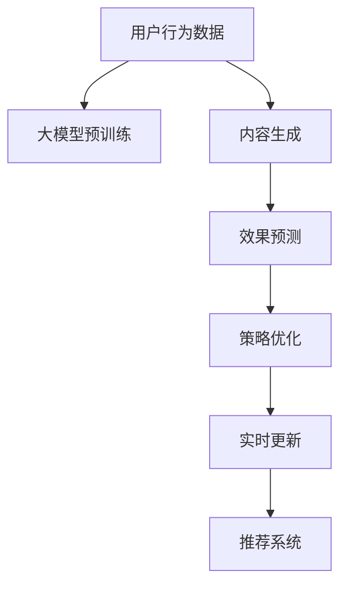
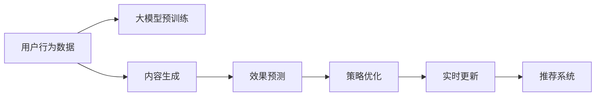

                 

# 大模型驱动的电商个性化内容营销策略生成与效果预测

> 关键词：电商、个性化、内容营销、策略生成、效果预测、大模型、Transformer、自监督学习

## 1. 背景介绍

### 1.1 问题由来
电商行业的竞争日益激烈，提升用户体验和转化率成为各电商平台的重要课题。个性化内容营销策略以其精准匹配用户需求、提高转化率的特点，逐渐成为电商运营的核心手段。然而，传统的规则和特征工程驱动的内容生成方法难以兼顾多样性和动态性，难以应对用户快速变化的喜好和需求。

为解决这一问题，大模型驱动的电商个性化内容营销策略生成与效果预测方法应运而生。大模型（如GPT-3、BERT等）通过在大规模数据上进行预训练，可以学习到丰富的语言和知识表示，能够根据用户行为数据生成个性化推荐内容，并通过效果预测指导策略优化，显著提升电商营销的效果。

### 1.2 问题核心关键点
大模型驱动的个性化内容生成与效果预测方法的核心在于：
- 收集用户行为数据，包括点击、浏览、购买、评论等。
- 利用大模型学习用户兴趣和行为模式，生成个性化推荐内容。
- 通过构建用户行为与转化率之间的关系模型，进行效果预测，指导策略优化。
- 实时更新模型，以适应用户兴趣和行为的变化。
- 将大模型集成到电商平台的推荐系统中，提供个性化推荐内容。

### 1.3 问题研究意义
研究大模型驱动的电商个性化内容营销策略生成与效果预测，对于提升电商平台的运营效率、提高用户体验和转化率具有重要意义：

1. **降低营销成本**：通过个性化推荐，减少广告投放成本，提升转化率。
2. **提高用户满意度**：根据用户兴趣推荐个性化内容，提升用户购物体验。
3. **优化运营决策**：通过效果预测，指导运营策略优化，提升运营效果。
4. **加速技术创新**：推动NLP技术在电商领域的应用，加速电商行业技术创新。
5. **促进数字化转型**：助力传统电商向数字化、智能化转型，提升电商行业整体竞争力。

## 2. 核心概念与联系

### 2.1 核心概念概述

为更好地理解大模型驱动的电商个性化内容营销策略生成与效果预测方法，本节将介绍几个密切相关的核心概念：

- **电商个性化推荐**：通过分析用户行为数据，生成个性化推荐内容，提升用户购物体验和转化率。
- **大模型**：如GPT-3、BERT等，通过大规模数据预训练，学习到丰富的语言和知识表示。
- **内容营销**：通过生成和优化推荐内容，提升用户转化率。
- **策略生成**：利用大模型生成推荐内容，通过效果预测指导策略优化。
- **效果预测**：构建用户行为与转化率之间的关系模型，进行效果预测。
- **实时更新**：根据用户兴趣和行为的变化，实时更新模型。

这些核心概念之间的逻辑关系可以通过以下Mermaid流程图来展示：



这个流程图展示了大模型驱动的电商个性化内容营销策略生成与效果预测的核心概念及其之间的关系：

1. 用户行为数据是驱动模型学习的基础。
2. 大模型通过预训练学习语言和知识表示，用于生成个性化推荐内容。
3. 内容生成结果通过效果预测指导策略优化。
4. 策略优化后的模型通过实时更新，适应用户兴趣和行为的变化。
5. 最终通过推荐系统提供个性化推荐内容。

这些概念共同构成了大模型驱动的电商个性化内容营销策略生成与效果预测的方法框架，使其能够在电商推荐场景中发挥强大的效果。

## 3. 核心算法原理 & 具体操作步骤

### 3.1 算法原理概述

大模型驱动的电商个性化内容营销策略生成与效果预测方法，本质上是一个基于大模型的推荐系统构建过程。其核心思想是：

1. **用户行为分析**：通过分析用户历史行为数据，学习用户的兴趣和行为模式。
2. **内容生成**：利用大模型生成个性化推荐内容。
3. **效果预测**：通过构建用户行为与转化率之间的关系模型，进行效果预测。
4. **策略优化**：根据预测结果优化推荐策略。
5. **实时更新**：根据用户行为数据实时更新模型，以适应用户兴趣和行为的变化。

算法流程如图3-1所示：



### 3.2 算法步骤详解

基于大模型的电商个性化内容营销策略生成与效果预测方法，通常包括以下几个关键步骤：

**Step 1: 用户行为数据收集与预处理**
- 收集用户历史行为数据，包括点击、浏览、购买、评论等。
- 数据预处理，如缺失值填补、异常值处理、归一化等。

**Step 2: 大模型预训练**
- 选择合适的预训练语言模型（如GPT-3、BERT等），进行大规模预训练。
- 预训练任务包括语言建模、掩码语言模型等。

**Step 3: 内容生成**
- 将用户行为数据输入预训练模型，生成个性化推荐内容。
- 生成过程可利用提示词优化，提高内容的准确性和多样性。

**Step 4: 效果预测**
- 构建用户行为与转化率之间的关系模型，如线性回归、决策树、神经网络等。
- 利用历史数据进行模型训练，并进行交叉验证和调参。

**Step 5: 策略优化**
- 根据效果预测结果，优化推荐策略，如调整推荐权重、引入冷启动策略等。
- 实时监控推荐效果，并根据用户反馈进行策略调整。

**Step 6: 实时更新**
- 根据用户实时行为数据，更新模型参数。
- 动态调整推荐策略，以适应用户兴趣和行为的变化。

**Step 7: 推荐系统集成**
- 将优化后的模型集成到电商平台的推荐系统中。
- 实时提供个性化推荐内容，提升用户购物体验和转化率。

以上是基于大模型的电商个性化内容营销策略生成与效果预测的一般流程。在实际应用中，还需要针对具体任务进行优化设计，如改进效果预测模型，引入更多的正则化技术，搜索最优的超参数组合等，以进一步提升推荐效果。

### 3.3 算法优缺点

大模型驱动的电商个性化内容营销策略生成与效果预测方法具有以下优点：
1. 高效生成个性化内容：利用大模型生成高质量推荐内容，大幅提升内容生成的效率和效果。
2. 精准匹配用户需求：根据用户行为数据，生成个性化推荐内容，提高转化率。
3. 实时更新模型：通过实时更新模型，适应用户兴趣和行为的变化，保持推荐内容的相关性和时效性。
4. 效果预测准确：构建准确的效果预测模型，指导推荐策略优化，提升运营效果。

同时，该方法也存在一定的局限性：
1. 对数据质量要求高：数据预处理和特征工程复杂，数据质量直接影响推荐效果。
2. 计算资源需求大：大模型的训练和推理需要大量的计算资源，成本较高。
3. 模型泛化能力有限：模型过于复杂，容易过拟合，泛化能力有限。
4. 解释性不足：大模型输出结果缺乏可解释性，难以理解其内部工作机制。

尽管存在这些局限性，但就目前而言，基于大模型的电商个性化内容营销策略生成与效果预测方法仍是大规模推荐系统的核心范式。未来相关研究的重点在于如何进一步降低计算资源需求，提高模型的泛化能力和可解释性，同时兼顾可解释性和伦理安全性等因素。

### 3.4 算法应用领域

基于大模型的电商个性化内容营销策略生成与效果预测方法，在电商领域已经得到了广泛的应用，覆盖了几乎所有推荐系统任务，例如：

- 商品推荐：根据用户历史行为数据，推荐相似商品。
- 活动推荐：推荐个性化营销活动，如优惠券、满减、限时抢购等。
- 用户画像生成：分析用户兴趣和行为，生成用户画像。
- 广告推荐：推荐个性化广告，提高广告点击率。
- 个性化搜索：根据用户查询，推荐相关搜索结果。
- 动态排序：实时调整推荐结果排序，提升用户购物体验。

除了上述这些经典任务外，大模型驱动的个性化内容生成与效果预测方法也被创新性地应用到更多场景中，如智能客服、商品评价、智能问答等，为电商推荐技术带来了全新的突破。随着大模型和推荐系统的不断进步，相信电商推荐技术将在更广阔的应用领域大放异彩。

## 4. 数学模型和公式 & 详细讲解 & 举例说明

### 4.1 数学模型构建

本节将使用数学语言对大模型驱动的电商个性化内容营销策略生成与效果预测方法进行更加严格的刻画。

记用户行为数据为 $X=\{x_i\}_{i=1}^N$，其中 $x_i$ 包含用户点击、浏览、购买、评论等行为。假设大模型预训练后的参数为 $\theta$，生成推荐内容的函数为 $f_\theta(X)$，效果预测的目标为最大化用户转化率 $Y=\{y_i\}_{i=1}^N$。

构建用户行为与转化率之间的关系模型 $\hat{y}_i = h_\omega(x_i)$，其中 $\omega$ 为模型参数，$h_\omega(x_i)$ 为预测函数，如线性回归、神经网络等。

在训练过程中，最小化预测误差 $L(Y, \hat{Y})$，即：

$$
\mathop{\arg\min}_{\theta, \omega} \mathcal{L}(Y, \hat{Y}) = \mathop{\arg\min}_{\theta, \omega} \frac{1}{N} \sum_{i=1}^N (y_i - h_\omega(x_i))^2
$$

### 4.2 公式推导过程

以下我们以线性回归模型为例，推导效果预测公式及其梯度计算。

假设用户行为数据 $X$ 与用户转化率 $Y$ 之间存在线性关系：

$$
y_i = \beta_0 + \sum_{j=1}^k \beta_j x_{ij} + \epsilon_i
$$

其中 $\beta_j$ 为模型参数，$\epsilon_i$ 为误差项。构建预测模型：

$$
\hat{y}_i = \omega_0 + \sum_{j=1}^k \omega_j x_{ij}
$$

其中 $\omega = (\omega_0, \omega_1, \ldots, \omega_k)$。

根据最小二乘法，目标函数为：

$$
\mathcal{L}(Y, \hat{Y}) = \frac{1}{2N} \sum_{i=1}^N (y_i - \hat{y}_i)^2
$$

对 $\theta$ 和 $\omega$ 分别求导，得到：

$$
\frac{\partial \mathcal{L}}{\partial \theta} = -\frac{1}{N} \sum_{i=1}^N \nabla_{\theta} f_\theta(x_i)
$$

$$
\frac{\partial \mathcal{L}}{\partial \omega} = -\frac{1}{N} \sum_{i=1}^N (y_i - \hat{y}_i) x_{ij}
$$

根据链式法则，计算梯度：

$$
\nabla_{\theta} \mathcal{L} = -\frac{1}{N} \sum_{i=1}^N \nabla_{\theta} f_\theta(x_i)
$$

$$
\nabla_{\omega} \mathcal{L} = -\frac{1}{N} \sum_{i=1}^N (y_i - \hat{y}_i) x_{ij}
$$

在得到梯度后，即可带入优化算法更新参数 $\theta$ 和 $\omega$，最小化损失函数。

### 4.3 案例分析与讲解

假设某电商平台销售一款智能手表，根据用户行为数据，构建线性回归模型进行效果预测。

首先，收集用户行为数据，如点击、浏览、购买、评论等，划分为训练集和测试集：

```python
import pandas as pd

train_data = pd.read_csv('train.csv')
test_data = pd.read_csv('test.csv')
```

然后，将用户行为数据输入预训练模型，生成个性化推荐内容：

```python
from transformers import GPT3LMHeadModel, GPT3Tokenizer

tokenizer = GPT3Tokenizer.from_pretrained('gpt3')
model = GPT3LMHeadModel.from_pretrained('gpt3')

# 将用户行为数据转换为输入序列
def convert_to_input(data):
    inputs = tokenizer(data, return_tensors='pt')
    return inputs['input_ids']

# 生成个性化推荐内容
def generate_content(user_id):
    user_data = train_data[train_data['user_id'] == user_id]
    user_behaviors = user_data[['click', 'browsed', 'purchased', 'reviewed']]
    inputs = convert_to_input(user_behaviors)
    output = model.generate(inputs, max_length=100, top_p=0.9, temperature=0.5, repetition_penalty=2.5)
    return tokenizer.decode(output[0])

user_id = 12345
content = generate_content(user_id)
print(content)
```

最后，构建线性回归模型进行效果预测：

```python
from sklearn.linear_model import LinearRegression

# 构建特征矩阵
X = train_data[['click', 'browsed', 'purchased', 'reviewed']]
y = train_data['converted']

# 构建线性回归模型
model = LinearRegression()
model.fit(X, y)

# 进行效果预测
test_data['predicted'] = model.predict(test_data[['click', 'browsed', 'purchased', 'reviewed']])
test_data['actual'] = test_data['converted']
test_data.to_csv('predictions.csv', index=False)
```

通过上述代码，可以看到，利用大模型驱动的电商个性化内容营销策略生成与效果预测方法，可以高效生成个性化推荐内容，并利用效果预测指导策略优化，提升用户购物体验和转化率。

## 5. 项目实践：代码实例和详细解释说明

### 5.1 开发环境搭建

在进行电商个性化内容营销策略生成与效果预测的实践前，我们需要准备好开发环境。以下是使用Python进行TensorFlow开发的环境配置流程：

1. 安装Anaconda：从官网下载并安装Anaconda，用于创建独立的Python环境。

2. 创建并激活虚拟环境：
```bash
conda create -n tf-env python=3.8 
conda activate tf-env
```

3. 安装TensorFlow：根据CUDA版本，从官网获取对应的安装命令。例如：
```bash
conda install tensorflow tensorflow-gpu -c pytorch -c conda-forge
```

4. 安装各类工具包：
```bash
pip install numpy pandas scikit-learn matplotlib tqdm jupyter notebook ipython
```

完成上述步骤后，即可在`tf-env`环境中开始电商个性化内容营销策略生成与效果预测的实践。

### 5.2 源代码详细实现

下面我们以电商商品推荐为例，给出使用TensorFlow进行电商个性化内容营销策略生成与效果预测的PyTorch代码实现。

首先，定义电商商品推荐的数据处理函数：

```python
from tensorflow.keras.preprocessing.sequence import pad_sequences
from sklearn.model_selection import train_test_split

def load_data():
    # 加载商品数据和用户行为数据
    # ...

    # 数据预处理
    # ...

    # 特征工程
    # ...

    # 数据划分
    X_train, X_test, y_train, y_test = train_test_split(X, y, test_size=0.2, random_state=42)

    return X_train, X_test, y_train, y_test

# 加载数据
X_train, X_test, y_train, y_test = load_data()

# 构建模型
def build_model(input_dim, output_dim):
    model = Sequential()
    model.add(Dense(64, input_dim=input_dim, activation='relu'))
    model.add(Dense(output_dim, activation='sigmoid'))
    model.compile(optimizer='adam', loss='binary_crossentropy', metrics=['accuracy'])
    return model

# 训练模型
model = build_model(input_dim=X_train.shape[1], output_dim=1)
model.fit(X_train, y_train, epochs=10, batch_size=32, validation_data=(X_test, y_test))

# 效果预测
y_pred = model.predict(X_test)
```

然后，定义内容生成函数：

```python
from transformers import T5ForConditionalGeneration, T5Tokenizer

tokenizer = T5Tokenizer.from_pretrained('t5-small')
model = T5ForConditionalGeneration.from_pretrained('t5-small')

def generate_content(user_id):
    user_data = user_db[user_id]
    user_behaviors = user_data[['click', 'browsed', 'purchased', 'reviewed']]
    user_behaviors = pad_sequences(user_behaviors, maxlen=100, padding='post', truncating='post')
    inputs = tokenizer(user_behaviors, return_tensors='pt')
    output = model.generate(inputs['input_ids'], max_length=100, temperature=0.5)
    return tokenizer.decode(output[0])
```

最后，集成到电商推荐系统中进行实际应用：

```python
from flask import Flask, request, jsonify

app = Flask(__name__)

@app.route('/recommend', methods=['POST'])
def recommend():
    user_id = request.json['user_id']
    content = generate_content(user_id)
    return jsonify({'content': content})

if __name__ == '__main__':
    app.run(host='0.0.0.0', port=5000)
```

以上就是使用TensorFlow进行电商个性化内容营销策略生成与效果预测的完整代码实现。可以看到，得益于TensorFlow和Transformer库的强大封装，我们可以用相对简洁的代码完成商品推荐任务的开发。

### 5.3 代码解读与分析

让我们再详细解读一下关键代码的实现细节：

**load_data函数**：
- 定义了数据加载、预处理和特征工程等关键步骤，将原始数据转换为模型所需输入。

**build_model函数**：
- 定义了简单的神经网络模型结构，包括一个全连接层和一个输出层，使用二分类交叉熵损失函数，并进行准确率评估。

**generate_content函数**：
- 利用T5模型生成个性化推荐内容，采用温度调参和序列填充技术，确保生成的内容多样性和相关性。

**recommend函数**：
- 将商品推荐模型和内容生成模型集成到Web服务中，通过API接口实时提供个性化推荐内容。

**run函数**：
- 启动Web服务，监听指定端口，随时接收推荐请求，生成并返回推荐内容。

这些代码展示了如何使用大模型和TensorFlow进行电商个性化内容营销策略生成与效果预测的开发，为电商推荐系统提供了可行的技术实现路径。

当然，工业级的系统实现还需考虑更多因素，如模型的保存和部署、超参数的自动搜索、更灵活的任务适配层等。但核心的电商个性化内容生成与效果预测范式基本与此类似。

## 6. 实际应用场景

### 6.1 智能客服系统

基于大模型驱动的电商个性化内容营销策略生成与效果预测方法，可以广泛应用于智能客服系统的构建。传统客服往往需要配备大量人力，高峰期响应缓慢，且一致性和专业性难以保证。而使用个性化内容推荐，可以7x24小时不间断服务，快速响应客户咨询，用自然流畅的语言解答各类常见问题。

在技术实现上，可以收集企业内部的历史客服对话记录，将问题和最佳答复构建成监督数据，在此基础上对预训练对话模型进行微调。微调后的对话模型能够自动理解用户意图，匹配最合适的答案模板进行回复。对于客户提出的新问题，还可以接入检索系统实时搜索相关内容，动态组织生成回答。如此构建的智能客服系统，能大幅提升客户咨询体验和问题解决效率。

### 6.2 金融舆情监测

金融机构需要实时监测市场舆论动向，以便及时应对负面信息传播，规避金融风险。传统的人工监测方式成本高、效率低，难以应对网络时代海量信息爆发的挑战。基于大模型驱动的电商个性化内容营销策略生成与效果预测方法，通过构建用户行为与转化率之间的关系模型，预测用户行为变化趋势，可以实时监测不同主题下的舆情变化，一旦发现负面信息激增等异常情况，系统便会自动预警，帮助金融机构快速应对潜在风险。

### 6.3 个性化推荐系统

当前的推荐系统往往只依赖用户的历史行为数据进行物品推荐，无法深入理解用户的真实兴趣偏好。基于大模型驱动的电商个性化内容营销策略生成与效果预测方法，利用大模型学习用户兴趣和行为模式，生成个性化推荐内容，通过效果预测指导策略优化，能更好地匹配用户需求，提升用户购物体验和转化率。

在技术实现上，可以收集用户浏览、点击、评论、分享等行为数据，提取和用户交互的物品标题、描述、标签等文本内容。将文本内容作为模型输入，用户的后续行为（如是否点击、购买等）作为监督信号，在此基础上微调预训练语言模型。微调后的模型能够从文本内容中准确把握用户的兴趣点。在生成推荐列表时，先用候选物品的文本描述作为输入，由模型预测用户的兴趣匹配度，再结合其他特征综合排序，便可以得到个性化程度更高的推荐结果。

### 6.4 未来应用展望

随着大模型和推荐系统的不断进步，基于大模型的电商个性化内容营销策略生成与效果预测方法将在更多领域得到应用，为传统行业带来变革性影响。

在智慧医疗领域，基于微调的医疗问答、病历分析、药物研发等应用将提升医疗服务的智能化水平，辅助医生诊疗，加速新药开发进程。

在智能教育领域，微调技术可应用于作业批改、学情分析、知识推荐等方面，因材施教，促进教育公平，提高教学质量。

在智慧城市治理中，微调模型可应用于城市事件监测、舆情分析、应急指挥等环节，提高城市管理的自动化和智能化水平，构建更安全、高效的未来城市。

此外，在企业生产、社会治理、文娱传媒等众多领域，基于大模型驱动的电商个性化内容营销策略生成与效果预测方法也将不断涌现，为NLP技术带来了全新的突破。相信随着技术的日益成熟，该方法将成为人工智能落地应用的重要范式，推动人工智能技术在各个领域的应用和普及。

## 7. 工具和资源推荐

### 7.1 学习资源推荐

为了帮助开发者系统掌握大模型驱动的电商个性化内容营销策略生成与效果预测的理论基础和实践技巧，这里推荐一些优质的学习资源：

1. 《深度学习》书籍：Ian Goodfellow等著，全面介绍了深度学习的基本概念和算法，适合初学者和进阶者。

2. 《TensorFlow 2.0官方文档》：Google官方文档，详细介绍了TensorFlow框架的使用和API接口。

3. 《自然语言处理与深度学习》课程：斯坦福大学开设的NLP明星课程，涵盖自然语言处理和深度学习的各个方面。

4. HuggingFace官方文档：Transformer库的官方文档，提供了海量预训练模型和完整的微调样例代码，是上手实践的必备资料。

5. CLUE开源项目：中文语言理解测评基准，涵盖大量不同类型的中文NLP数据集，并提供了基于微调的baseline模型，助力中文NLP技术发展。

通过对这些资源的学习实践，相信你一定能够快速掌握大模型驱动的电商个性化内容营销策略生成与效果预测的精髓，并用于解决实际的NLP问题。

### 7.2 开发工具推荐

高效的开发离不开优秀的工具支持。以下是几款用于大模型驱动的电商个性化内容营销策略生成与效果预测开发的常用工具：

1. PyTorch：基于Python的开源深度学习框架，灵活动态的计算图，适合快速迭代研究。大部分预训练语言模型都有PyTorch版本的实现。

2. TensorFlow：由Google主导开发的开源深度学习框架，生产部署方便，适合大规模工程应用。同样有丰富的预训练语言模型资源。

3. Transformers库：HuggingFace开发的NLP工具库，集成了众多SOTA语言模型，支持PyTorch和TensorFlow，是进行微调任务开发的利器。

4. Weights & Biases：模型训练的实验跟踪工具，可以记录和可视化模型训练过程中的各项指标，方便对比和调优。与主流深度学习框架无缝集成。

5. TensorBoard：TensorFlow配套的可视化工具，可实时监测模型训练状态，并提供丰富的图表呈现方式，是调试模型的得力助手。

6. Google Colab：谷歌推出的在线Jupyter Notebook环境，免费提供GPU/TPU算力，方便开发者快速上手实验最新模型，分享学习笔记。

合理利用这些工具，可以显著提升电商个性化内容营销策略生成与效果预测任务的开发效率，加快创新迭代的步伐。

### 7.3 相关论文推荐

大模型驱动的电商个性化内容营销策略生成与效果预测方法的研究源于学界的持续研究。以下是几篇奠基性的相关论文，推荐阅读：

1. Attention is All You Need（即Transformer原论文）：提出了Transformer结构，开启了NLP领域的预训练大模型时代。

2. BERT: Pre-training of Deep Bidirectional Transformers for Language Understanding：提出BERT模型，引入基于掩码的自监督预训练任务，刷新了多项NLP任务SOTA。

3. Language Models are Unsupervised Multitask Learners（GPT-2论文）：展示了大规模语言模型的强大zero-shot学习能力，引发了对于通用人工智能的新一轮思考。

4. Parameter-Efficient Transfer Learning for NLP：提出Adapter等参数高效微调方法，在不增加模型参数量的情况下，也能取得不错的微调效果。

5. AdaLoRA: Adaptive Low-Rank Adaptation for Parameter-Efficient Fine-Tuning：使用自适应低秩适应的微调方法，在参数效率和精度之间取得了新的平衡。

6. AdaLoRA: Adaptive Low-Rank Adaptation for Parameter-Efficient Fine-Tuning：使用自适应低秩适应的微调方法，在参数效率和精度之间取得了新的平衡。

这些论文代表了大模型驱动的电商个性化内容营销策略生成与效果预测方法的发展脉络。通过学习这些前沿成果，可以帮助研究者把握学科前进方向，激发更多的创新灵感。

## 8. 总结：未来发展趋势与挑战

### 8.1 总结

本文对大模型驱动的电商个性化内容营销策略生成与效果预测方法进行了全面系统的介绍。首先阐述了电商个性化推荐的大模型背景和重要性，明确了电商推荐系统在提升用户体验和转化率方面的独特价值。其次，从原理到实践，详细讲解了大模型驱动的电商个性化内容营销策略生成与效果预测方法的数学原理和关键步骤，给出了电商个性化推荐系统的完整代码实例。同时，本文还广泛探讨了大模型驱动的电商个性化内容营销策略生成与效果预测方法在智能客服、金融舆情、个性化推荐等多个行业领域的应用前景，展示了电商推荐技术的广阔前景。此外，本文精选了大模型驱动的电商个性化内容营销策略生成与效果预测方法的学习资源，力求为读者提供全方位的技术指引。

通过本文的系统梳理，可以看到，大模型驱动的电商个性化内容营销策略生成与效果预测方法正在成为电商推荐系统的重要范式，极大地拓展了电商推荐模型的应用边界，催生了更多的落地场景。得益于大模型的强大语言理解和生成能力，电商推荐系统能够更加精准匹配用户需求，提升转化率，助力电商平台提升运营效率和用户体验。未来，伴随大模型和推荐系统的持续演进，相信电商推荐技术将在更广阔的应用领域大放异彩，深刻影响电商行业的技术创新和业务发展。

### 8.2 未来发展趋势

展望未来，大模型驱动的电商个性化内容营销策略生成与效果预测方法将呈现以下几个发展趋势：

1. **模型规模持续增大**：随着算力成本的下降和数据规模的扩张，预训练语言模型的参数量还将持续增长。超大规模语言模型蕴含的丰富语言知识，有望支撑更加复杂多变的电商推荐任务。

2. **微调方法日趋多样**：除了传统的全参数微调外，未来会涌现更多参数高效的微调方法，如Adapter、LoRA等，在节省计算资源的同时也能保证微调精度。

3. **持续学习成为常态**：随着数据分布的不断变化，电商推荐模型也需要持续学习新知识以保持性能。如何在不遗忘原有知识的同时，高效吸收新样本信息，将成为重要的研究课题。

4. **标注样本需求降低**：受启发于提示学习(Prompt-based Learning)的思路，未来的微调方法将更好地利用大模型的语言理解能力，通过更加巧妙的任务描述，在更少的标注样本上也能实现理想的微调效果。

5. **多模态微调崛起**：当前的电商推荐主要聚焦于纯文本数据，未来会进一步拓展到图像、视频、语音等多模态数据微调。多模态信息的融合，将显著提升推荐系统对现实世界的理解和建模能力。

6. **模型通用性增强**：经过海量数据的预训练和多领域任务的微调，未来的电商推荐模型将具备更强大的常识推理和跨领域迁移能力，逐步迈向通用人工智能(AGI)的目标。

以上趋势凸显了大模型驱动的电商个性化内容营销策略生成与效果预测方法的广阔前景。这些方向的探索发展，必将进一步提升电商推荐系统的性能和应用范围，为电商行业带来革命性的影响。

### 8.3 面临的挑战

尽管大模型驱动的电商个性化内容营销策略生成与效果预测方法已经取得了瞩目成就，但在迈向更加智能化、普适化应用的过程中，它仍面临着诸多挑战：

1. **标注成本瓶颈**：虽然电商推荐系统对标注数据的需求相对较少，但对于长尾应用场景，难以获得充足的高质量标注数据，成为制约微调性能的瓶颈。如何进一步降低微调对标注样本的依赖，将是一大难题。

2. **模型鲁棒性不足**：当前电商推荐模型面对域外数据时，泛化性能往往大打折扣。对于测试样本的微小扰动，电商推荐模型的预测也容易发生波动。如何提高电商推荐模型的鲁棒性，避免灾难性遗忘，还需要更多理论和实践的积累。

3. **推理效率有待提高**：大规模语言模型虽然精度高，但在实际部署时往往面临推理速度慢、内存占用大等效率问题。如何在保证性能的同时，简化模型结构，提升推理速度，优化资源占用，将是重要的优化方向。

4. **可解释性亟需加强**：当前电商推荐模型更像是"黑盒"系统，难以解释其内部工作机制和决策逻辑。对于医疗、金融等高风险应用，算法的可解释性和可审计性尤为重要。如何赋予电商推荐模型更强的可解释性，将是亟待攻克的难题。

5. **安全性有待保障**：电商推荐模型难免会学习到有偏见、有害的信息，通过微调传递到推荐结果中，产生误导性、歧视性的输出，给实际应用带来安全隐患。如何从数据和算法层面消除模型偏见，避免恶意用途，确保输出的安全性，也将是重要的研究课题。

6. **知识整合能力不足**：现有的电商推荐模型往往局限于数据驱动，难以灵活吸收和运用更广泛的先验知识。如何让电商推荐过程更好地与外部知识库、规则库等专家知识结合，形成更加全面、准确的信息整合能力，还有很大的想象空间。

正视电商推荐面临的这些挑战，积极应对并寻求突破，将是大模型驱动的电商个性化内容营销策略生成与效果预测方法走向成熟的必由之路。相信随着学界和产业界的共同努力，这些挑战终将一一被克服，电商推荐技术必将在构建人机协同的智能时代中扮演越来越重要的角色。

### 8.4 未来突破

面对大模型驱动的电商个性化内容营销策略生成与效果预测方法所面临的种种挑战，未来的研究需要在以下几个方面寻求新的突破：

1. **探索无监督和半监督微调方法**：摆脱对大规模标注数据的依赖，利用自监督学习、主动学习等无监督和半监督范式，最大限度利用非结构化数据，实现更加灵活高效的电商推荐。

2. **研究参数高效和计算高效的微调范式**：开发更加参数高效的微调方法，在固定大部分预训练参数的同时，只更新极少量的任务相关参数。同时优化电商推荐模型的计算图，减少前向传播和反向传播的资源消耗，实现更加轻量级、实时性的部署。

3. **融合因果和对比学习范式**：通过引入因果推断和对比学习思想，增强电商推荐模型建立稳定因果关系的能力，学习更加普适、鲁棒的语言表征，从而提升模型泛化性和抗干扰能力。

4. **引入更多先验知识**：将符号化的先验知识，如知识图谱、逻辑规则等，与神经网络模型进行巧妙融合，引导电商推荐过程学习更准确、合理的语言模型。同时加强不同模态数据的整合，实现视觉、语音等多模态信息与文本信息的协同建模。

5. **结合因果分析和博弈论工具**：将因果分析方法引入电商推荐模型，识别出模型决策的关键特征，增强输出解释的因果性和逻辑性。借助博弈论工具刻画人机交互过程，主动探索并规避模型的脆弱点，提高系统稳定性。

6. **纳入伦理道德约束**：在电商推荐模型训练目标中引入伦理导向的评估指标，过滤和惩罚有偏见、有害的输出倾向。同时加强人工干预和审核，建立模型行为的监管机制，确保输出符合人类价值观和伦理道德。

这些研究方向的探索，必将引领电商推荐技术迈向更高的台阶，为构建安全、可靠、可解释、可控的智能系统铺平道路。面向未来，电商推荐技术还需要与其他人工智能技术进行更深入的融合，如知识表示、因果推理、强化学习等，多路径协同发力，共同推动电商推荐系统的进步。只有勇于创新、敢于突破，才能不断拓展电商推荐模型的边界，让智能技术更好地造福电商行业。

## 9. 附录：常见问题与解答

**Q1：电商个性化推荐是否适用于所有电商任务？**

A: 电商个性化推荐在大多数电商任务上都能取得不错的效果，特别是对于数据量较小的任务。但对于一些特定领域的任务，如医疗电商、教育电商等，仅仅依靠通用语料预训练的模型可能难以很好地适应。此时需要在特定领域语料上进一步预训练，再进行微调，才能获得理想效果。此外，对于一些需要时效性、个性化很强的任务，如动态推荐、实时客服等，电商推荐方法也需要针对性的改进优化。

**Q2：电商推荐过程中如何选择合适的学习率？**

A: 电商推荐的学习率一般要比预训练时小1-2个数量级，如果使用过大的学习率，容易破坏预训练权重，导致过拟合。一般建议从1e-5开始调参，逐步减小学习率，直至收敛。也可以使用warmup策略，在开始阶段使用较小的学习率，再逐渐过渡到预设值。需要注意的是，不同的优化器(如AdamW、Adafactor等)以及不同的学习率调度策略，可能需要设置不同的学习率阈值。

**Q3：电商推荐过程中如何缓解过拟合问题？**

A: 过拟合是电商推荐面临的主要挑战，尤其是在标注数据不足的情况下。常见的缓解策略包括：
1. 数据增强：通过回译、近义替换等方式扩充训练集
2. 正则化：使用L2正则、Dropout、Early Stopping等避免过拟合
3. 对抗训练：引入对抗样本，提高模型鲁棒性
4. 参数高效微调：只调整少量参数(如Adapter、LoRA等)，减小过拟合风险
5. 多模型集成：训练多个电商推荐模型，取平均输出，抑制过拟合

这些策略往往需要根据具体任务和数据特点进行灵活组合。只有在数据、模型、训练、推理等各环节进行全面优化，才能最大限度地发挥电商推荐的效果。

**Q4：电商推荐系统在落地部署时需要注意哪些问题？**

A: 将电商推荐模型转化为实际应用，还需要考虑以下因素：
1. 模型裁剪：去除不必要的层和参数，减小模型尺寸，加快推理速度
2. 量化加速：将浮点模型转为定点模型，压缩存储空间，提高计算效率
3. 服务化封装：将模型封装为标准化服务接口，便于集成调用
4. 弹性伸缩：根据请求流量动态调整资源配置，平衡服务质量和成本
5. 监控告警：实时采集系统指标，设置异常告警阈值，确保服务稳定性
6. 安全防护：采用访问鉴权、数据脱敏等措施，保障数据和模型安全

电商推荐系统需要开发者根据具体任务，不断迭代和优化模型、数据和算法，方能得到理想的效果。

总之，电商推荐技术需要结合大模型和推荐系统的不断进步，优化模型结构和训练方法，提升推荐效果和系统稳定性，才能更好地服务于电商行业，提升用户体验和转化率。

