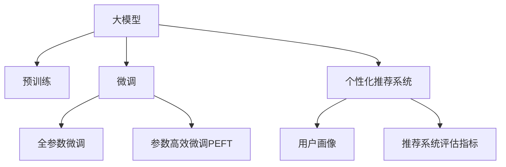

                 

## 1. 背景介绍

### 1.1 问题由来
在电商领域，个性化推荐已经成为提高用户体验和销售额的关键手段。传统的推荐算法，如协同过滤、基于内容的推荐等，虽然能够提供不错的推荐效果，但往往无法考虑用户心理和行为的多样性。大模型，尤其是预训练语言模型，通过学习大量语料，具备强大的理解能力和上下文推断能力，能够更好地理解和模拟用户行为，提供更加精准的个性化推荐服务。

### 1.2 问题核心关键点
大模型在电商个性化推荐中，其核心在于通过深度学习技术，从用户行为、商品描述、评论等文本数据中提取丰富的语义信息，结合用户画像，构建用户行为模型和商品推荐模型。通过微调这些预训练模型，可以在较小的数据集上，快速适应特定电商应用场景，提升推荐效果。

## 2. 核心概念与联系

### 2.1 核心概念概述

为了更好地理解大模型在电商个性化推荐中的应用，本节将介绍几个关键概念：

- 大模型(大语言模型)：以Transformer结构为代表的深度学习模型，通过在大规模无标签文本数据上进行预训练，学习到丰富的语言表示，具备强大的语义理解和生成能力。

- 预训练(Pre-training)：指在大规模无标签文本数据上，通过自监督学习任务训练通用语言模型的过程。常见的预训练任务包括语言建模、掩码语言模型等。

- 微调(Fine-tuning)：指在预训练模型的基础上，使用特定电商场景的少量标注数据，通过有监督学习优化模型在个性化推荐任务上的性能。

- 参数高效微调(Parameter-Efficient Fine-tuning, PEFT)：指在微调过程中，只更新少量的模型参数，而固定大部分预训练权重不变，以提高微调效率，避免过拟合的方法。

- 个性化推荐系统：基于用户画像和商品特征，通过深度学习模型提供个性化推荐服务的系统。

- 用户画像(User Profile)：根据用户的历史行为、偏好、评分等数据，构建出用户特征向量，用于个性化推荐。

- 推荐系统评估指标：如点击率(CTR)、转化率(Conversion Rate)、用户满意度等，用于衡量推荐系统的效果。

这些核心概念之间的逻辑关系可以通过以下Mermaid流程图来展示：



这个流程图展示了核心概念之间的联系：

1. 大模型通过预训练获得基础能力。
2. 微调是对预训练模型进行任务特定的优化，可以适应特定电商推荐场景。
3. 用户画像和商品特征是构建推荐系统的关键。
4. 推荐系统评估指标用于衡量个性化推荐的性能。

## 3. 核心算法原理 & 具体操作步骤
### 3.1 算法原理概述

基于大模型的个性化推荐系统，本质上是一个有监督的微调过程。其核心思想是：将预训练的大模型视作强大的特征提取器，通过电商场景的少量标注数据进行微调，使模型能够自动提取和理解用户和商品的语义信息，从而在个性化推荐任务上获得优秀的性能。

形式化地，假设预训练语言模型为 $M_{\theta}$，其中 $\theta$ 为预训练得到的模型参数。给定电商推荐任务 $T$ 的标注数据集 $D=\{(x_i, y_i)\}_{i=1}^N$，微调的目标是找到新的模型参数 $\hat{\theta}$，使得：

$$
\hat{\theta}=\mathop{\arg\min}_{\theta} \mathcal{L}(M_{\theta},D)
$$

其中 $\mathcal{L}$ 为针对任务 $T$ 设计的损失函数，用于衡量模型预测输出与真实标签之间的差异。常见的损失函数包括交叉熵损失、均方误差损失等。

通过梯度下降等优化算法，微调过程不断更新模型参数 $\theta$，最小化损失函数 $\mathcal{L}$，使得模型输出逼近真实标签。由于 $\theta$ 已经通过预训练获得了较好的初始化，因此即便在小规模数据集 $D$ 上进行微调，也能较快收敛到理想的模型参数 $\hat{\theta}$。

### 3.2 算法步骤详解

基于大模型的个性化推荐微调，一般包括以下几个关键步骤：

**Step 1: 准备预训练模型和数据集**
- 选择合适的预训练语言模型 $M_{\theta}$ 作为初始化参数，如 GPT、BERT等。
- 准备电商推荐任务 $T$ 的标注数据集 $D$，划分为训练集、验证集和测试集。一般要求标注数据与预训练数据的分布不要差异过大。

**Step 2: 添加任务适配层**
- 根据电商推荐任务类型，在预训练模型顶层设计合适的输出层和损失函数。
- 对于分类推荐任务，通常在顶层添加线性分类器和交叉熵损失函数。
- 对于生成推荐任务，通常使用语言模型的解码器输出概率分布，并以负对数似然为损失函数。

**Step 3: 设置微调超参数**
- 选择合适的优化算法及其参数，如 AdamW、SGD 等，设置学习率、批大小、迭代轮数等。
- 设置正则化技术及强度，包括权重衰减、Dropout、Early Stopping 等。
- 确定冻结预训练参数的策略，如仅微调顶层，或全部参数都参与微调。

**Step 4: 执行梯度训练**
- 将训练集数据分批次输入模型，前向传播计算损失函数。
- 反向传播计算参数梯度，根据设定的优化算法和学习率更新模型参数。
- 周期性在验证集上评估模型性能，根据性能指标决定是否触发 Early Stopping。
- 重复上述步骤直到满足预设的迭代轮数或 Early Stopping 条件。

**Step 5: 测试和部署**
- 在测试集上评估微调后模型 $M_{\hat{\theta}}$ 的性能，对比微调前后的推荐精度提升。
- 使用微调后的模型对新商品进行推荐，集成到电商应用系统中。
- 持续收集新的用户行为数据，定期重新微调模型，以适应用户需求变化。

以上是基于大模型的电商个性化推荐微调的一般流程。在实际应用中，还需要针对具体电商推荐场景的特点，对微调过程的各个环节进行优化设计，如改进训练目标函数，引入更多的正则化技术，搜索最优的超参数组合等，以进一步提升模型性能。

### 3.3 算法优缺点

基于大模型的电商个性化推荐微调方法具有以下优点：
1. 简单高效。只需准备少量标注数据，即可对预训练模型进行快速适配，获得较大的性能提升。
2. 通用适用。适用于各种电商推荐任务，包括分类、匹配、生成等，设计简单的任务适配层即可实现微调。
3. 参数高效。利用参数高效微调技术，在固定大部分预训练参数的情况下，仍可取得不错的提升。
4. 效果显著。在学术界和工业界的诸多电商推荐任务上，基于微调的方法已经刷新了最先进的性能指标。

同时，该方法也存在一定的局限性：
1. 依赖标注数据。微调的效果很大程度上取决于标注数据的质量和数量，获取高质量标注数据的成本较高。
2. 迁移能力有限。当目标任务与预训练数据的分布差异较大时，微调的性能提升有限。
3. 负面效果传递。预训练模型的固有偏见、有害信息等，可能通过微调传递到下游任务，造成负面影响。
4. 可解释性不足。微调模型的决策过程通常缺乏可解释性，难以对其推理逻辑进行分析和调试。

尽管存在这些局限性，但就目前而言，基于大模型的电商个性化推荐微调方法仍然是大模型应用的主流范式。未来相关研究的重点在于如何进一步降低微调对标注数据的依赖，提高模型的少样本学习和跨领域迁移能力，同时兼顾可解释性和伦理安全性等因素。

### 3.4 算法应用领域

基于大模型的电商个性化推荐微调方法，在电商领域已经得到了广泛的应用，覆盖了几乎所有常见的电商推荐任务，例如：

- 商品分类：对商品进行分类，如电子产品、服装鞋帽等。通过微调使模型学习商品-分类映射。
- 相似商品推荐：推荐与用户已购买或浏览的商品类似的商品。通过微调使模型学习商品间的相似性。
- 个性化商品推荐：根据用户历史行为，推荐用户可能感兴趣的商品。通过微调使模型学习用户行为与商品相关性。
- 用户画像生成：分析用户行为数据，生成用户画像。通过微调使模型学习用户特征。
- 商品召回策略优化：优化召回商品的筛选策略，提高推荐效果。通过微调使模型学习最优召回阈值。

除了上述这些经典任务外，大模型的微调方法也被创新性地应用到更多场景中，如异常交易检测、价格预测、库存管理等，为电商技术带来了新的突破。随着预训练模型和微调方法的不断进步，相信大模型在电商推荐领域的应用将会更加广泛和深入。

## 4. 数学模型和公式 & 详细讲解
### 4.1 数学模型构建

本节将使用数学语言对基于大模型的电商个性化推荐微调过程进行更加严格的刻画。

记预训练语言模型为 $M_{\theta}$，其中 $\theta$ 为模型参数。假设电商推荐任务 $T$ 的训练集为 $D=\{(x_i,y_i)\}_{i=1}^N$，其中 $x_i$ 表示用户行为数据，$y_i$ 表示商品ID。

定义模型 $M_{\theta}$ 在数据样本 $(x,y)$ 上的损失函数为 $\ell(M_{\theta}(x),y)$，则在数据集 $D$ 上的经验风险为：

$$
\mathcal{L}(\theta) = \frac{1}{N} \sum_{i=1}^N \ell(M_{\theta}(x_i),y_i)
$$

其中 $\ell$ 为电商推荐任务的损失函数，如交叉熵损失、均方误差损失等。微调的优化目标是最小化经验风险，即找到最优参数：

$$
\theta^* = \mathop{\arg\min}_{\theta} \mathcal{L}(\theta)
$$

在实践中，我们通常使用基于梯度的优化算法（如SGD、Adam等）来近似求解上述最优化问题。设 $\eta$ 为学习率，$\lambda$ 为正则化系数，则参数的更新公式为：

$$
\theta \leftarrow \theta - \eta \nabla_{\theta}\mathcal{L}(\theta) - \eta\lambda\theta
$$

其中 $\nabla_{\theta}\mathcal{L}(\theta)$ 为损失函数对参数 $\theta$ 的梯度，可通过反向传播算法高效计算。

### 4.2 公式推导过程

以下我们以商品分类任务为例，推导交叉熵损失函数及其梯度的计算公式。

假设模型 $M_{\theta}$ 在输入 $x$ 上的输出为 $\hat{y}=M_{\theta}(x)$，表示用户行为对商品分类的概率预测。真实标签 $y \in \{1,0\}$，其中 $1$ 表示该行为对应商品属于分类 $C$。则二分类交叉熵损失函数定义为：

$$
\ell(M_{\theta}(x),y) = -y\log \hat{y} - (1-y)\log (1-\hat{y})
$$

将其代入经验风险公式，得：

$$
\mathcal{L}(\theta) = -\frac{1}{N}\sum_{i=1}^N [y_i\log M_{\theta}(x_i)+(1-y_i)\log(1-M_{\theta}(x_i))]
$$

根据链式法则，损失函数对参数 $\theta_k$ 的梯度为：

$$
\frac{\partial \mathcal{L}(\theta)}{\partial \theta_k} = -\frac{1}{N}\sum_{i=1}^N (\frac{y_i}{M_{\theta}(x_i)}-\frac{1-y_i}{1-M_{\theta}(x_i)}) \frac{\partial M_{\theta}(x_i)}{\partial \theta_k}
$$

其中 $\frac{\partial M_{\theta}(x_i)}{\partial \theta_k}$ 可进一步递归展开，利用自动微分技术完成计算。

在得到损失函数的梯度后，即可带入参数更新公式，完成模型的迭代优化。重复上述过程直至收敛，最终得到适应电商推荐任务的最优模型参数 $\theta^*$。

## 5. 项目实践：代码实例和详细解释说明
### 5.1 开发环境搭建

在进行电商个性化推荐微调实践前，我们需要准备好开发环境。以下是使用Python进行PyTorch开发的环境配置流程：

1. 安装Anaconda：从官网下载并安装Anaconda，用于创建独立的Python环境。

2. 创建并激活虚拟环境：
```bash
conda create -n pytorch-env python=3.8 
conda activate pytorch-env
```

3. 安装PyTorch：根据CUDA版本，从官网获取对应的安装命令。例如：
```bash
conda install pytorch torchvision torchaudio cudatoolkit=11.1 -c pytorch -c conda-forge
```

4. 安装Transformers库：
```bash
pip install transformers
```

5. 安装各类工具包：
```bash
pip install numpy pandas scikit-learn matplotlib tqdm jupyter notebook ipython
```

完成上述步骤后，即可在`pytorch-env`环境中开始微调实践。

### 5.2 源代码详细实现

下面我们以商品分类任务为例，给出使用Transformers库对BERT模型进行电商推荐微调的PyTorch代码实现。

首先，定义商品分类任务的数据处理函数：

```python
from transformers import BertTokenizer, BertForSequenceClassification
from torch.utils.data import Dataset
import torch

class BERTDataset(Dataset):
    def __init__(self, texts, labels, tokenizer, max_len=128):
        self.texts = texts
        self.labels = labels
        self.tokenizer = tokenizer
        self.max_len = max_len
        
    def __len__(self):
        return len(self.texts)
    
    def __getitem__(self, item):
        text = self.texts[item]
        label = self.labels[item]
        
        encoding = self.tokenizer(text, return_tensors='pt', max_length=self.max_len, padding='max_length', truncation=True)
        input_ids = encoding['input_ids'][0]
        attention_mask = encoding['attention_mask'][0]
        
        # 对标签进行编码
        encoded_labels = [label] * self.max_len
        labels = torch.tensor(encoded_labels, dtype=torch.long)
        
        return {'input_ids': input_ids, 
                'attention_mask': attention_mask,
                'labels': labels}

# 训练集和测试集
train_texts = ... # 商品描述文本列表
train_labels = ... # 商品分类标签列表

test_texts = ... # 商品描述文本列表
test_labels = ... # 商品分类标签列表

tokenizer = BertTokenizer.from_pretrained('bert-base-cased')

train_dataset = BERTDataset(train_texts, train_labels, tokenizer)
test_dataset = BERTDataset(test_texts, test_labels, tokenizer)
```

然后，定义模型和优化器：

```python
from transformers import AdamW

model = BertForSequenceClassification.from_pretrained('bert-base-cased', num_labels=2)

optimizer = AdamW(model.parameters(), lr=2e-5)
```

接着，定义训练和评估函数：

```python
from torch.utils.data import DataLoader
from tqdm import tqdm
from sklearn.metrics import classification_report

device = torch.device('cuda') if torch.cuda.is_available() else torch.device('cpu')
model.to(device)

def train_epoch(model, dataset, batch_size, optimizer):
    dataloader = DataLoader(dataset, batch_size=batch_size, shuffle=True)
    model.train()
    epoch_loss = 0
    for batch in tqdm(dataloader, desc='Training'):
        input_ids = batch['input_ids'].to(device)
        attention_mask = batch['attention_mask'].to(device)
        labels = batch['labels'].to(device)
        model.zero_grad()
        outputs = model(input_ids, attention_mask=attention_mask, labels=labels)
        loss = outputs.loss
        epoch_loss += loss.item()
        loss.backward()
        optimizer.step()
    return epoch_loss / len(dataloader)

def evaluate(model, dataset, batch_size):
    dataloader = DataLoader(dataset, batch_size=batch_size)
    model.eval()
    preds, labels = [], []
    with torch.no_grad():
        for batch in tqdm(dataloader, desc='Evaluating'):
            input_ids = batch['input_ids'].to(device)
            attention_mask = batch['attention_mask'].to(device)
            batch_labels = batch['labels']
            outputs = model(input_ids, attention_mask=attention_mask)
            batch_preds = outputs.logits.argmax(dim=2).to('cpu').tolist()
            batch_labels = batch_labels.to('cpu').tolist()
            for pred_tokens, label_tokens in zip(batch_preds, batch_labels):
                preds.append(pred_tokens)
                labels.append(label_tokens)
                
    print(classification_report(labels, preds))
```

最后，启动训练流程并在测试集上评估：

```python
epochs = 5
batch_size = 16

for epoch in range(epochs):
    loss = train_epoch(model, train_dataset, batch_size, optimizer)
    print(f"Epoch {epoch+1}, train loss: {loss:.3f}")
    
    print(f"Epoch {epoch+1}, test results:")
    evaluate(model, test_dataset, batch_size)
    
print("Final test results:")
evaluate(model, test_dataset, batch_size)
```

以上就是使用PyTorch对BERT进行电商商品分类任务微调的完整代码实现。可以看到，得益于Transformers库的强大封装，我们可以用相对简洁的代码完成BERT模型的加载和微调。

### 5.3 代码解读与分析

让我们再详细解读一下关键代码的实现细节：

**BERTDataset类**：
- `__init__`方法：初始化文本、标签、分词器等关键组件。
- `__len__`方法：返回数据集的样本数量。
- `__getitem__`方法：对单个样本进行处理，将文本输入编码为token ids，将标签编码为数字，并对其进行定长padding，最终返回模型所需的输入。

**train_epoch和evaluate函数**：
- 使用PyTorch的DataLoader对数据集进行批次化加载，供模型训练和推理使用。
- 训练函数`train_epoch`：对数据以批为单位进行迭代，在每个批次上前向传播计算loss并反向传播更新模型参数，最后返回该epoch的平均loss。
- 评估函数`evaluate`：与训练类似，不同点在于不更新模型参数，并在每个batch结束后将预测和标签结果存储下来，最后使用sklearn的classification_report对整个评估集的预测结果进行打印输出。

**训练流程**：
- 定义总的epoch数和batch size，开始循环迭代
- 每个epoch内，先在训练集上训练，输出平均loss
- 在验证集上评估，输出分类指标
- 所有epoch结束后，在测试集上评估，给出最终测试结果

可以看到，PyTorch配合Transformers库使得BERT微调的代码实现变得简洁高效。开发者可以将更多精力放在数据处理、模型改进等高层逻辑上，而不必过多关注底层的实现细节。

当然，工业级的系统实现还需考虑更多因素，如模型的保存和部署、超参数的自动搜索、更灵活的任务适配层等。但核心的微调范式基本与此类似。

## 6. 实际应用场景
### 6.1 智能客服系统

基于大语言模型微调的对话技术，可以广泛应用于智能客服系统的构建。传统客服往往需要配备大量人力，高峰期响应缓慢，且一致性和专业性难以保证。而使用微调后的对话模型，可以7x24小时不间断服务，快速响应客户咨询，用自然流畅的语言解答各类常见问题。

在技术实现上，可以收集企业内部的历史客服对话记录，将问题和最佳答复构建成监督数据，在此基础上对预训练对话模型进行微调。微调后的对话模型能够自动理解用户意图，匹配最合适的答案模板进行回复。对于客户提出的新问题，还可以接入检索系统实时搜索相关内容，动态组织生成回答。如此构建的智能客服系统，能大幅提升客户咨询体验和问题解决效率。

### 6.2 金融舆情监测

金融机构需要实时监测市场舆论动向，以便及时应对负面信息传播，规避金融风险。传统的人工监测方式成本高、效率低，难以应对网络时代海量信息爆发的挑战。基于大语言模型微调的文本分类和情感分析技术，为金融舆情监测提供了新的解决方案。

具体而言，可以收集金融领域相关的新闻、报道、评论等文本数据，并对其进行主题标注和情感标注。在此基础上对预训练语言模型进行微调，使其能够自动判断文本属于何种主题，情感倾向是正面、中性还是负面。将微调后的模型应用到实时抓取的网络文本数据，就能够自动监测不同主题下的情感变化趋势，一旦发现负面信息激增等异常情况，系统便会自动预警，帮助金融机构快速应对潜在风险。

### 6.3 个性化推荐系统

当前的推荐系统往往只依赖用户的历史行为数据进行物品推荐，无法考虑用户心理和行为的多样性。基于大语言模型微调技术，个性化推荐系统可以更好地理解和模拟用户行为，提供更加精准的个性化推荐服务。

在实践中，可以收集用户浏览、点击、评论、分享等行为数据，提取和用户交互的物品标题、描述、标签等文本内容。将文本内容作为模型输入，用户的后续行为（如是否点击、购买等）作为监督信号，在此基础上微调预训练语言模型。微调后的模型能够从文本内容中准确把握用户的兴趣点。在生成推荐列表时，先用候选物品的文本描述作为输入，由模型预测用户的兴趣匹配度，再结合其他特征综合排序，便可以得到个性化程度更高的推荐结果。

### 6.4 未来应用展望

随着大语言模型微调技术的不断发展，基于微调范式将在更多领域得到应用，为传统行业带来变革性影响。

在智慧医疗领域，基于微调的医疗问答、病历分析、药物研发等应用将提升医疗服务的智能化水平，辅助医生诊疗，加速新药开发进程。

在智能教育领域，微调技术可应用于作业批改、学情分析、知识推荐等方面，因材施教，促进教育公平，提高教学质量。

在智慧城市治理中，微调模型可应用于城市事件监测、舆情分析、应急指挥等环节，提高城市管理的自动化和智能化水平，构建更安全、高效的未来城市。

此外，在企业生产、社会治理、文娱传媒等众多领域，基于大模型微调的人工智能应用也将不断涌现，为经济社会发展注入新的动力。相信随着技术的日益成熟，微调方法将成为人工智能落地应用的重要范式，推动人工智能技术向更广阔的领域加速渗透。

## 7. 工具和资源推荐
### 7.1 学习资源推荐

为了帮助开发者系统掌握大语言模型微调的理论基础和实践技巧，这里推荐一些优质的学习资源：

1. 《Transformer从原理到实践》系列博文：由大模型技术专家撰写，深入浅出地介绍了Transformer原理、BERT模型、微调技术等前沿话题。

2. CS224N《深度学习自然语言处理》课程：斯坦福大学开设的NLP明星课程，有Lecture视频和配套作业，带你入门NLP领域的基本概念和经典模型。

3. 《Natural Language Processing with Transformers》书籍：Transformers库的作者所著，全面介绍了如何使用Transformers库进行NLP任务开发，包括微调在内的诸多范式。

4. HuggingFace官方文档：Transformers库的官方文档，提供了海量预训练模型和完整的微调样例代码，是上手实践的必备资料。

5. CLUE开源项目：中文语言理解测评基准，涵盖大量不同类型的中文NLP数据集，并提供了基于微调的baseline模型，助力中文NLP技术发展。

通过对这些资源的学习实践，相信你一定能够快速掌握大语言模型微调的精髓，并用于解决实际的NLP问题。
###  7.2 开发工具推荐

高效的开发离不开优秀的工具支持。以下是几款用于大语言模型微调开发的常用工具：

1. PyTorch：基于Python的开源深度学习框架，灵活动态的计算图，适合快速迭代研究。大部分预训练语言模型都有PyTorch版本的实现。

2. TensorFlow：由Google主导开发的开源深度学习框架，生产部署方便，适合大规模工程应用。同样有丰富的预训练语言模型资源。

3. Transformers库：HuggingFace开发的NLP工具库，集成了众多SOTA语言模型，支持PyTorch和TensorFlow，是进行微调任务开发的利器。

4. Weights & Biases：模型训练的实验跟踪工具，可以记录和可视化模型训练过程中的各项指标，方便对比和调优。与主流深度学习框架无缝集成。

5. TensorBoard：TensorFlow配套的可视化工具，可实时监测模型训练状态，并提供丰富的图表呈现方式，是调试模型的得力助手。

6. Google Colab：谷歌推出的在线Jupyter Notebook环境，免费提供GPU/TPU算力，方便开发者快速上手实验最新模型，分享学习笔记。

合理利用这些工具，可以显著提升大语言模型微调任务的开发效率，加快创新迭代的步伐。

### 7.3 相关论文推荐

大语言模型和微调技术的发展源于学界的持续研究。以下是几篇奠基性的相关论文，推荐阅读：

1. Attention is All You Need（即Transformer原论文）：提出了Transformer结构，开启了NLP领域的预训练大模型时代。

2. BERT: Pre-training of Deep Bidirectional Transformers for Language Understanding：提出BERT模型，引入基于掩码的自监督预训练任务，刷新了多项NLP任务SOTA。

3. Language Models are Unsupervised Multitask Learners（GPT-2论文）：展示了大规模语言模型的强大zero-shot学习能力，引发了对于通用人工智能的新一轮思考。

4. Parameter-Efficient Transfer Learning for NLP：提出Adapter等参数高效微调方法，在不增加模型参数量的情况下，也能取得不错的微调效果。

5. Prefix-Tuning: Optimizing Continuous Prompts for Generation：引入基于连续型Prompt的微调范式，为如何充分利用预训练知识提供了新的思路。

6. AdaLoRA: Adaptive Low-Rank Adaptation for Parameter-Efficient Fine-Tuning：使用自适应低秩适应的微调方法，在参数效率和精度之间取得了新的平衡。

这些论文代表了大语言模型微调技术的发展脉络。通过学习这些前沿成果，可以帮助研究者把握学科前进方向，激发更多的创新灵感。

## 8. 总结：未来发展趋势与挑战

### 8.1 总结

本文对基于大模型的电商个性化推荐系统进行了全面系统的介绍。首先阐述了电商推荐系统的背景和重要性，明确了电商个性化推荐中的关键问题。其次，从原理到实践，详细讲解了基于大模型的个性化推荐系统的数学原理和关键步骤，给出了电商推荐任务的代码实例。同时，本文还广泛探讨了个性化推荐系统在电商应用中的实际应用场景，展示了个性化推荐系统的巨大潜力。此外，本文精选了个性化推荐技术的各类学习资源，力求为读者提供全方位的技术指引。

通过本文的系统梳理，可以看到，基于大模型的电商个性化推荐系统已经成为电商推荐技术的重要范式，通过微调可以更好地适应电商场景，提升推荐效果。未来，伴随预训练语言模型和微调方法的持续演进，相信电商推荐技术将会更加智能化、个性化，为电商行业带来新的变革。

### 8.2 未来发展趋势

展望未来，大模型在电商个性化推荐中的未来发展趋势包括以下几个方向：

1. 模型规模持续增大。随着算力成本的下降和数据规模的扩张，预训练语言模型的参数量还将持续增长。超大规模语言模型蕴含的丰富语言知识，有望支撑更加复杂多变的电商推荐场景。

2. 推荐系统更加个性化。大模型微调技术将能够更好地理解和模拟用户心理和行为，通过多维度特征学习，提供更精准、更多样的个性化推荐服务。

3. 跨领域推荐能力增强。通过引入更多领域特定的数据和任务，大模型微调技术能够更好地融合跨领域知识，提升推荐系统的泛化能力。

4. 低资源推荐应用拓展。如何利用更少的数据和计算资源实现高性能推荐，是未来电商个性化推荐的一个重要方向。大模型微调技术将探索更多轻量级、低成本的推荐策略。

5. 实时推荐引擎构建。大模型微调技术将能够构建实时推荐系统，支持大规模在线用户和实时商品更新，提升推荐效率和用户体验。

6. 交互式推荐系统开发。通过引入自然语言交互技术，大模型微调技术将开发出更具智能化的电商推荐系统，提供更加灵活、人性化的服务。

以上趋势凸显了大语言模型微调在电商个性化推荐中的广阔前景。这些方向的探索发展，必将进一步提升推荐系统的性能和应用范围，为电商行业带来更多的机遇和挑战。

### 8.3 面临的挑战

尽管大模型在电商个性化推荐中已经取得了显著成效，但在迈向更加智能化、普适化应用的过程中，它仍面临着诸多挑战：

1. 数据质量和多样性。电商推荐任务的数据质量往往较差，且商品和用户行为多样性极高，难以构建统一的特征空间。如何提高数据质量，提升特征提取能力，是未来需要解决的问题。

2. 推荐系统泛化能力不足。当前推荐系统对电商场景的泛化能力不足，面对新商品和新用户时，推荐效果可能大打折扣。如何提升推荐系统的泛化能力，使其能够适应不同电商应用场景，还需要进一步研究和优化。

3. 模型推理效率有待提高。大规模语言模型虽然精度高，但在实际部署时往往面临推理速度慢、内存占用大等效率问题。如何提高模型推理速度，优化资源占用，是未来需要攻克的难题。

4. 推荐系统的公平性和透明度。大模型推荐系统在处理极端案例时可能出现偏差，导致不公平的推荐结果。同时，推荐系统的决策过程通常缺乏透明度，难以进行调试和解释。如何提升推荐系统的公平性和透明度，是未来的一个重要研究方向。

5. 推荐系统的可解释性和可控性。大模型推荐系统往往作为黑盒使用，用户难以理解推荐逻辑。如何提高推荐系统的可解释性和可控性，使其更加可信和可靠，还需要更多研究和实践。

6. 推荐系统安全性问题。大模型推荐系统容易受到对抗攻击，导致安全漏洞。如何提高推荐系统的安全性，防止恶意攻击和数据泄露，是未来需要重视的问题。

这些挑战需要我们不断探索和创新，才能真正实现大模型在电商推荐中的广泛应用。相信通过研究者的不懈努力，这些挑战终将一一被克服，大模型在电商推荐中的价值将得到充分释放。

### 8.4 研究展望

未来，大模型在电商个性化推荐中的研究方向可能包括以下几个方面：

1. 跨领域推荐技术研究。研究如何将大模型微调技术与其他领域知识进行融合，提升推荐系统的泛化能力和表现。

2. 多模态推荐系统研究。研究如何将文本、图像、语音等多模态信息进行整合，构建更加全面、准确的推荐模型。

3. 轻量级推荐模型研究。研究如何在保持推荐效果的前提下，构建轻量级、低成本的推荐模型，使其能够在大规模、实时化的电商推荐场景中高效运行。

4. 推荐系统公平性和透明度研究。研究如何通过引入公平性和透明度指标，提升推荐系统的公平性和可解释性，保障用户体验和信任度。

5. 推荐系统安全性研究。研究如何通过加强模型鲁棒性、引入对抗训练技术等手段，提升推荐系统的安全性，防止恶意攻击和数据泄露。

6. 实时推荐系统研究。研究如何构建实时推荐系统，支持大规模在线用户和实时商品更新，提升推荐效率和用户体验。

通过这些研究方向的研究和实践，大模型在电商个性化推荐中将发挥更大的作用，为电商行业带来更多的创新和价值。

## 9. 附录：常见问题与解答

**Q1：电商推荐系统中的数据质量如何提升？**

A: 电商推荐系统中的数据质量问题可以从以下几个方面进行提升：
1. 数据清洗：去除噪声数据、重复数据和不完整的记录，保证数据准确性。
2. 数据增强：通过对用户行为数据进行增强，如插入虚假行为数据、生成合成数据等，提高数据多样性。
3. 特征工程：通过特征选择和特征工程，提取和构造有意义的特征，提升特征表示能力。
4. 多源数据融合：通过引入其他数据源（如用户评分、评论等），进行多源数据融合，提升数据质量。

**Q2：电商推荐系统中的模型泛化能力不足如何提升？**

A: 电商推荐系统中的模型泛化能力不足可以从以下几个方面进行提升：
1. 引入更多领域数据：通过引入更多电商相关数据，如用户评价、商品描述等，增强模型泛化能力。
2. 多任务学习：通过多任务学习，将电商推荐任务与其他任务（如用户画像生成、情感分析等）联合训练，提升模型泛化能力。
3. 对抗训练：通过对抗样本训练，增强模型对噪声和攻击的鲁棒性，提升泛化能力。
4. 模型集成：通过模型集成，将多个模型进行联合预测，提升模型泛化能力。

**Q3：如何提高电商推荐系统的推荐效率？**

A: 电商推荐系统的推荐效率可以从以下几个方面进行提升：
1. 模型压缩：通过模型压缩技术，如剪枝、量化等，减小模型大小，提升推理速度。
2. 分布式训练：通过分布式训练技术，将模型训练任务分配到多台机器上进行并行训练，提升训练效率。
3. 轻量级模型：通过构建轻量级模型，如MobileBERT、ALBERT等，减小模型复杂度，提升推理效率。
4. 缓存技术：通过缓存技术，如数据缓存、模型缓存等，减少重复计算，提升推理效率。

**Q4：电商推荐系统的公平性和透明度如何提升？**

A: 电商推荐系统的公平性和透明度可以从以下几个方面进行提升：
1. 公平性指标：通过引入公平性指标，如推荐偏差、多样性指标等，监测和评估推荐系统的公平性。
2. 可解释性模型：通过引入可解释性模型，如决策树、规则模型等，提高推荐系统的透明度。
3. 用户反馈机制：通过引入用户反馈机制，如评分、评论等，调整和优化推荐系统，提升公平性和透明度。
4. 模型调试工具：通过引入模型调试工具，如A/B测试、特征重要性分析等，进行模型调试和优化，提升公平性和透明度。

**Q5：电商推荐系统的安全性问题如何防止？**

A: 电商推荐系统的安全性问题可以从以下几个方面进行防止：
1. 模型鲁棒性增强：通过增强模型鲁棒性，如对抗训练、鲁棒特征选择等，提高模型对对抗攻击的鲁棒性。
2. 数据加密：通过数据加密技术，保护用户数据安全，防止数据泄露。
3. 访问控制：通过访问控制技术，限制用户访问权限，防止恶意攻击和数据篡改。
4. 安全检测：通过安全检测技术，如入侵检测、异常检测等，实时监控系统安全状态，防止安全漏洞。

这些方法可以帮助我们提升电商推荐系统的数据质量、模型泛化能力、推荐效率、公平性和透明度，以及安全性，从而构建更加可靠、高效的电商推荐系统。

