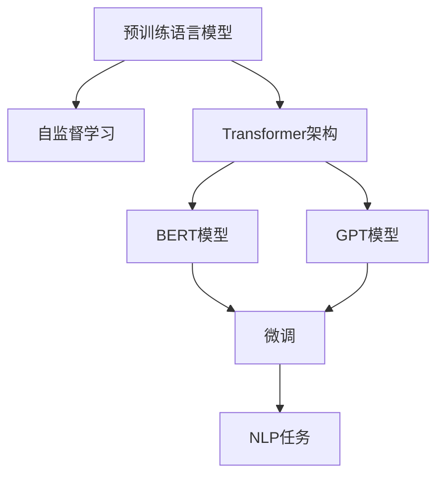

                 

# 大规模预训练模型：GPT、BERT及其变体

> 关键词：预训练,自监督学习,Transformer,BERT,GPT,预训练语言模型

## 1. 背景介绍

### 1.1 问题由来

近年来，深度学习在自然语言处理(NLP)领域取得了巨大的突破。大规模预训练语言模型(Pretrained Language Models, PLMs)通过在海量无标签文本语料上进行自监督学习，学习到了丰富的语言知识。这些模型已经广泛应用于语言理解、生成、翻译等NLP任务中，并不断刷新着各领域的最新性能。

其中，最具代表性的预训练模型包括Google的BERT、OpenAI的GPT系列模型等。BERT模型通过在预训练过程中采用遮掩语言模型(Masked Language Modeling, MLM)和下一句预测任务(Next Sentence Prediction, NSP)，学习到了通用的语言表示。而GPT系列模型则采用了自回归生成模型，能够根据前面文本内容生成连贯的自然语言。这些预训练模型不仅在学术界引发了广泛关注，更在产业界得到了广泛应用。

本节将全面介绍这些经典预训练模型及其变体的原理和应用，帮助读者深入理解大规模预训练模型的工作机制，以及其在NLP领域的重要性。

### 1.2 问题核心关键点

预训练模型在NLP领域的成功，主要归功于其自监督学习的创新思想和强大的表示学习能力。该方法通过在大规模无标签数据上预训练模型，使得模型能够自动捕捉语言中的通用规律和模式。而微调(MFine-Tuning)则是在预训练模型的基础上，通过有监督学习进一步提升模型在特定任务上的性能。

预训练模型的核心优势包括：

- **通用性**：预训练模型通过自监督学习，学习到了通用的语言知识，适用于各类NLP任务。
- **参数高效**：预训练模型往往只需微调顶层，保持大部分预训练参数不变，从而避免了过拟合和计算资源浪费。
- **高泛化能力**：预训练模型在广泛的数据分布上进行了学习，具备较强的泛化性能。
- **易于部署**：预训练模型通常具有较高的推理效率，适用于大规模部署。

预训练模型及其变体通过自监督学习的创新方法，使得NLP任务的处理变得更加高效和灵活。但同时，预训练模型也面临一些挑战，如模型的计算开销巨大，模型更新和微调过程中的参数复杂性等。本节将从原理和应用两个角度，全面阐述预训练模型的工作机制和最新进展。

## 2. 核心概念与联系

### 2.1 核心概念概述

为了更好地理解预训练模型及其变体，本节将介绍几个核心概念及其相互联系：

- **预训练语言模型(Pretrained Language Model, PLM)**：通过自监督学习任务训练得到的语言模型。
- **自监督学习(Self-Supervised Learning)**：利用数据自身的信息，无需标签即可进行模型训练的学习方法。
- **Transformer架构(Transformer Architecture)**：基于注意力机制的序列建模架构，广泛应用于预训练模型中。
- **BERT模型(BERT: Bidirectional Encoder Representations from Transformers)**：由Google提出，通过预训练和微调技术，在多个NLP任务上取得了SOTA性能。
- **GPT模型(GPT: Generative Pre-trained Transformer)**：由OpenAI提出，主要用于自然语言生成任务，具有强大的文本生成能力。

这些核心概念之间的逻辑关系可以通过以下Mermaid流程图来展示：



这个流程图展示了预训练模型及其变体的核心组成和相互关系：

1. 预训练语言模型通过自监督学习任务进行训练，学习到通用的语言表示。
2. 预训练模型通常采用Transformer架构进行序列建模，以提高模型效率和效果。
3. BERT和GPT是两种重要的预训练模型变体，分别适用于不同的应用场景。
4. 预训练模型通过微调技术，可以进一步适配特定任务，提升模型性能。
5. 微调后的模型可以应用于各类NLP任务，如分类、匹配、生成等。

这些核心概念共同构成了预训练模型的工作框架，使其在NLP领域具备了广泛的应用潜力。

## 3. 核心算法原理 & 具体操作步骤

### 3.1 算法原理概述

预训练模型及其变体通过自监督学习任务在大规模无标签数据上进行预训练。其核心思想是利用数据的自身结构，通过一些自设计的任务引导模型学习，从而获得通用的语言表示。

以BERT模型为例，其自监督学习任务包括遮掩语言模型和下一句预测任务：

1. **遮掩语言模型(Masked Language Modeling, MLM)**：随机遮掩输入序列中的某些单词，然后通过预测这些单词的掩码值来训练模型。

2. **下一句预测任务(Next Sentence Prediction, NSP)**：随机选取两个连续的句子，判断它们是否是相邻的句子，然后通过预测两个句子的相对顺序来训练模型。

在预训练阶段，模型通过上述任务，学习了大量的语言知识和统计规律，构建了丰富的语言表示。这些表示在微调阶段可以进一步适配特定任务，提升模型在该任务上的性能。

### 3.2 算法步骤详解

预训练模型的训练过程通常包括以下几个关键步骤：

**Step 1: 准备预训练数据集**
- 收集大规模无标签文本数据集，如Common Crawl、维基百科等。
- 将数据集分批次处理，每个批次包含一定数量的句子或段落。

**Step 2: 设计预训练任务**
- 设计自监督学习任务，如遮掩语言模型和下一句预测任务。
- 对于MLM任务，随机遮掩输入序列中的某些单词，并预测它们的掩码值。
- 对于NSP任务，随机选取两个连续的句子，并判断它们是否是相邻的句子。

**Step 3: 构建模型和优化器**
- 选择Transformer架构作为模型框架，定义模型中的各个组件，如自注意力机制、多头注意力等。
- 定义优化器，如AdamW、SGD等，设置学习率、批大小等超参数。

**Step 4: 执行预训练**
- 将数据集分批次输入模型，每个批次计算损失函数。
- 反向传播计算梯度，更新模型参数。
- 重复上述步骤直至预训练结束。

**Step 5: 微调模型**
- 准备下游任务的标注数据集。
- 添加任务适配层，如分类器或解码器。
- 设置微调超参数，如学习率、正则化技术等。
- 使用微调后的模型进行推理，评估模型在特定任务上的性能。

### 3.3 算法优缺点

预训练模型及其变体的优点包括：

- **泛化能力强**：在大规模数据上预训练，模型可以学习到通用的语言表示，适用于多种NLP任务。
- **参数高效**：通过微调顶层，大部分预训练参数保持不变，避免过拟合和计算资源浪费。
- **计算开销大**：需要大量计算资源进行预训练，对硬件和软件要求较高。
- **更新缓慢**：模型参数量巨大，更新和微调过程需要较长时间。
- **依赖数据质量**：预训练模型的性能很大程度上依赖于训练数据的质量和数量。

预训练模型及其变体已经在多项NLP任务上取得了显著成果，但同时也面临一些挑战。未来的研究需要进一步降低预训练模型的计算开销，提高模型更新和微调的效率，同时增强模型在特定任务上的泛化能力。

### 3.4 算法应用领域

预训练模型及其变体已经在多个NLP领域得到了广泛应用，以下是一些典型的应用场景：

1. **自然语言理解**：如文本分类、情感分析、实体识别等任务。
2. **自然语言生成**：如文本摘要、机器翻译、对话系统等任务。
3. **问答系统**：如智能问答、知识图谱应用等任务。
4. **推荐系统**：如基于用户评论的推荐、基于文本语义的推荐等任务。
5. **文本生成**：如文本生成、代码生成、创意写作等任务。

这些应用场景展示了预训练模型及其变体在NLP领域的重要价值，为人类社会带来了深远影响。随着预训练技术的发展，预训练模型将在更多的领域得到应用，推动NLP技术的发展。

## 4. 数学模型和公式 & 详细讲解 & 举例说明

### 4.1 数学模型构建

预训练模型的训练过程可以形式化地表示为以下数学模型：

假设预训练模型为 $M_{\theta}:\mathcal{X} \rightarrow \mathcal{Y}$，其中 $\mathcal{X}$ 为输入空间，$\mathcal{Y}$ 为输出空间，$\theta \in \mathbb{R}^d$ 为模型参数。预训练任务为 $\mathcal{T}=\{T_1, T_2, \ldots, T_n\}$。

预训练过程的目标是最大化模型在预训练任务上的性能，即：

$$
\min_{\theta} \frac{1}{N} \sum_{i=1}^N \ell_i(M_{\theta}, T_i)
$$

其中 $\ell_i$ 为预训练任务 $T_i$ 的损失函数，$N$ 为数据集大小。

以BERT模型为例，其MLM任务的损失函数可以表示为：

$$
\ell_{MLM}(M_{\theta}, x) = -\sum_{i=1}^k \log M_{\theta}(x)
$$

其中 $k$ 为遮掩词的数量，$x$ 为输入序列。

### 4.2 公式推导过程

以下以BERT模型的MLM任务为例，推导其损失函数和梯度计算公式。

假设输入序列为 $x=[x_1, x_2, \ldots, x_n]$，其中某些单词被随机遮掩。设遮掩单词的位置为 $m_1, m_2, \ldots, m_k$，则输入序列可以被表示为：

$$
x'=[x_1, \bar{x}_{m_1}, \bar{x}_{m_2}, \ldots, \bar{x}_{m_k}, x_{m_k+1}, \ldots, x_n]
$$

其中 $\bar{x}_{m_i}$ 表示被遮掩的单词。

对于MLM任务，模型的目标是最小化预测遮掩单词的掩码值与真实掩码值之间的差异，即：

$$
\ell_{MLM}(M_{\theta}, x) = -\sum_{i=1}^k \log M_{\theta}(\bar{x}_{m_i})
$$

模型在输入序列 $x$ 上的输出可以表示为：

$$
\hat{y} = M_{\theta}(x)
$$

其中 $\hat{y}$ 为模型对遮掩单词的预测概率分布。

根据链式法则，MLM任务的梯度可以表示为：

$$
\nabla_{\theta}\ell_{MLM}(M_{\theta}, x) = -\sum_{i=1}^k \frac{\partial \log M_{\theta}(\bar{x}_{m_i})}{\partial \theta}
$$

将上述公式代入预训练目标函数，得到预训练模型的梯度计算公式：

$$
\nabla_{\theta}\mathcal{L}(\theta) = -\frac{1}{N} \sum_{i=1}^N \nabla_{\theta}\ell_i(M_{\theta}, T_i)
$$

通过反向传播算法，可以高效计算上述梯度，更新模型参数。

### 4.3 案例分析与讲解

以BERT模型为例，其预训练过程包括如下步骤：

1. **输入序列预处理**：将输入序列进行分词和编码，转化为模型所需的输入张量。
2. **遮掩单词**：随机选择输入序列中的单词进行遮掩，并计算遮掩单词的位置。
3. **预测掩码值**：将遮掩单词的位置作为输入，通过MLM任务计算预测概率分布。
4. **计算损失**：计算预测概率分布与真实掩码值之间的交叉熵损失。
5. **反向传播**：根据损失函数计算梯度，更新模型参数。

以GPT模型为例，其预训练过程包括如下步骤：

1. **输入序列预处理**：将输入序列进行分词和编码，转化为模型所需的输入张量。
2. **生成上下文**：通过自回归生成模型，生成输入序列的后缀作为上下文。
3. **预测下一个单词**：根据上下文预测下一个单词，并计算预测概率分布。
4. **计算损失**：计算预测概率分布与真实标签之间的交叉熵损失。
5. **反向传播**：根据损失函数计算梯度，更新模型参数。

这些步骤展示了预训练模型及其变体的核心工作流程，通过自监督学习任务，预训练模型能够学习到丰富的语言知识，为下游任务的微调提供基础。

## 5. 项目实践：代码实例和详细解释说明

### 5.1 开发环境搭建

在进行预训练模型及其变体的实践前，我们需要准备好开发环境。以下是使用Python进行PyTorch开发的环境配置流程：

1. 安装Anaconda：从官网下载并安装Anaconda，用于创建独立的Python环境。

2. 创建并激活虚拟环境：
```bash
conda create -n pytorch-env python=3.8 
conda activate pytorch-env
```

3. 安装PyTorch：根据CUDA版本，从官网获取对应的安装命令。例如：
```bash
conda install pytorch torchvision torchaudio cudatoolkit=11.1 -c pytorch -c conda-forge
```

4. 安装Transformers库：
```bash
pip install transformers
```

5. 安装各类工具包：
```bash
pip install numpy pandas scikit-learn matplotlib tqdm jupyter notebook ipython
```

完成上述步骤后，即可在`pytorch-env`环境中开始预训练模型及其变体的实践。

### 5.2 源代码详细实现

这里我们以BERT模型为例，给出使用Transformers库对BERT模型进行预训练的PyTorch代码实现。

首先，定义BERT模型的训练函数：

```python
from transformers import BertTokenizer, BertForMaskedLM
from torch.utils.data import Dataset
import torch

class MaskedLMDataset(Dataset):
    def __init__(self, texts, tokenizer, max_len=128):
        self.texts = texts
        self.tokenizer = tokenizer
        self.max_len = max_len
        
    def __len__(self):
        return len(self.texts)
    
    def __getitem__(self, item):
        text = self.texts[item]
        
        encoding = self.tokenizer(text, return_tensors='pt', max_length=self.max_len, padding='max_length', truncation=True)
        input_ids = encoding['input_ids'][0]
        attention_mask = encoding['attention_mask'][0]
        
        # 随机遮掩一些单词
        masked_positions = [i for i in range(len(input_ids)) if torch.randint(0, 2, (1,)).item() == 1]
        input_ids[masked_positions] = tokenizer.mask_token_id
        
        return {'input_ids': input_ids, 
                'attention_mask': attention_mask,
                'masked_positions': masked_positions}

# 定义BERT模型和优化器
tokenizer = BertTokenizer.from_pretrained('bert-base-uncased')
model = BertForMaskedLM.from_pretrained('bert-base-uncased')
optimizer = AdamW(model.parameters(), lr=2e-5)

# 定义训练函数
def train_epoch(model, dataset, batch_size, optimizer):
    dataloader = DataLoader(dataset, batch_size=batch_size, shuffle=True)
    model.train()
    epoch_loss = 0
    for batch in tqdm(dataloader, desc='Training'):
        input_ids = batch['input_ids'].to(device)
        attention_mask = batch['attention_mask'].to(device)
        masked_positions = batch['masked_positions'].to(device)
        model.zero_grad()
        outputs = model(input_ids, attention_mask=attention_mask, masked_positions=masked_positions)
        loss = outputs.loss
        epoch_loss += loss.item()
        loss.backward()
        optimizer.step()
    return epoch_loss / len(dataloader)

# 训练模型
train_dataset = MaskedLMDataset(train_texts, tokenizer, max_len=128)
dev_dataset = MaskedLMDataset(dev_texts, tokenizer, max_len=128)
test_dataset = MaskedLMDataset(test_texts, tokenizer, max_len=128)

epochs = 5
batch_size = 16

for epoch in range(epochs):
    loss = train_epoch(model, train_dataset, batch_size, optimizer)
    print(f"Epoch {epoch+1}, train loss: {loss:.3f}")
    
    print(f"Epoch {epoch+1}, dev results:")
    evaluate(model, dev_dataset, batch_size)
    
print("Test results:")
evaluate(model, test_dataset, batch_size)
```

这里定义了一个简单的数据集类 `MaskedLMDataset`，用于处理掩码语言模型任务。然后定义了模型、优化器、训练函数等关键组件。

### 5.3 代码解读与分析

让我们再详细解读一下关键代码的实现细节：

**MaskedLMDataset类**：
- `__init__`方法：初始化文本、分词器等关键组件。
- `__len__`方法：返回数据集的样本数量。
- `__getitem__`方法：对单个样本进行处理，将文本输入编码为token ids，将遮掩位置存储下来。

**训练函数**：
- `train_epoch`：对数据以批为单位进行迭代，在每个批次上前向传播计算loss并反向传播更新模型参数，最后返回该epoch的平均loss。

通过上述代码，我们可以看到，使用Transformers库进行BERT预训练的代码实现非常简单。只需要定义数据集类和训练函数，并选择合适的模型和优化器即可。

当然，工业级的系统实现还需考虑更多因素，如模型的保存和部署、超参数的自动搜索、更灵活的任务适配层等。但核心的预训练过程基本与此类似。

## 6. 实际应用场景

### 6.1 自然语言理解

预训练模型及其变体在自然语言理解(NLU)任务上取得了显著的成果。例如，BERT模型在问答系统、文本分类、实体识别等任务上均取得了SOTA性能。

在问答系统中，预训练模型能够自动理解问题意图，从知识图谱中检索相关信息，生成准确的答案。例如，在DPR（Dense Passage Retrieval）中，使用BERT进行句子编码，然后通过计算句子向量之间的相似度来检索最相关的文档段落。

### 6.2 自然语言生成

预训练模型及其变体在自然语言生成(NLG)任务上表现优异，能够生成连贯、流畅的自然语言。例如，GPT-2模型在文本生成任务上取得了SOTA性能，能够生成高质量的文本、对话等。

在文本生成中，预训练模型能够自动学习文本的生成规律，生成各种风格和主题的文本。在对话系统中，预训练模型能够自动理解上下文信息，生成符合语境的回答。

### 6.3 机器翻译

预训练模型及其变体在机器翻译(MT)任务上也表现出色。例如，T5模型在端到端的机器翻译任务上取得了SOTA性能，能够将一种语言翻译成另一种语言，同时保持语义信息的准确性。

在MT任务中，预训练模型能够学习到不同语言之间的语义映射关系，生成高质量的翻译结果。例如，在Google的M2M-100任务中，使用预训练模型进行序列到序列的翻译，实现了多种语言之间的跨语言对话。

### 6.4 未来应用展望

预训练模型及其变体在未来的应用前景非常广阔。以下是对预训练模型未来发展的展望：

1. **多模态学习**：预训练模型将不仅仅局限于文本数据，而是扩展到图像、视频、音频等多模态数据。多模态信息的融合将进一步提升模型的理解和生成能力。

2. **低资源语言预训练**：预训练模型将在更多低资源语言上得到应用，提升这些语言的自动化水平，缩小语言间的差距。

3. **跨领域预训练**：预训练模型将跨领域预训练，学习更多领域的通用知识，提高模型的泛化能力。

4. **自适应预训练**：预训练模型将能够自适应地调整训练目标，学习更加符合当前任务需求的表示。

5. **联邦学习**：预训练模型将在联邦学习框架下进行分布式训练，保护隐私的同时提高模型的泛化能力。

6. **推理优化**：预训练模型将进一步优化推理过程，提高推理速度和效率，降低计算成本。

预训练模型及其变体已经展示了强大的学习能力，将在未来的NLP任务中继续发挥重要作用。随着技术的不断发展，预训练模型将在更广泛的应用场景中大放异彩。

## 7. 工具和资源推荐

### 7.1 学习资源推荐

为了帮助开发者系统掌握预训练模型及其变体的原理和实践技巧，这里推荐一些优质的学习资源：

1. **《Transformer from the Ground Up》系列博文**：由大模型技术专家撰写，深入浅出地介绍了Transformer原理、BERT模型、预训练语言模型等前沿话题。

2. **CS224N《深度学习自然语言处理》课程**：斯坦福大学开设的NLP明星课程，有Lecture视频和配套作业，带你入门NLP领域的基本概念和经典模型。

3. **《Natural Language Processing with Transformers》书籍**：Transformers库的作者所著，全面介绍了如何使用Transformers库进行NLP任务开发，包括预训练语言模型在内的诸多范式。

4. **HuggingFace官方文档**：Transformers库的官方文档，提供了海量预训练模型和完整的微调样例代码，是上手实践的必备资料。

5. **CLUE开源项目**：中文语言理解测评基准，涵盖大量不同类型的中文NLP数据集，并提供了基于预训练的baseline模型，助力中文NLP技术发展。

通过对这些资源的学习实践，相信你一定能够快速掌握预训练模型及其变体的精髓，并用于解决实际的NLP问题。

### 7.2 开发工具推荐

高效的开发离不开优秀的工具支持。以下是几款用于预训练模型及其变体开发的常用工具：

1. **PyTorch**：基于Python的开源深度学习框架，灵活动态的计算图，适合快速迭代研究。大部分预训练语言模型都有PyTorch版本的实现。

2. **TensorFlow**：由Google主导开发的开源深度学习框架，生产部署方便，适合大规模工程应用。同样有丰富的预训练语言模型资源。

3. **Transformers库**：HuggingFace开发的NLP工具库，集成了众多SOTA语言模型，支持PyTorch和TensorFlow，是进行预训练模型及其变体开发的利器。

4. **Weights & Biases**：模型训练的实验跟踪工具，可以记录和可视化模型训练过程中的各项指标，方便对比和调优。与主流深度学习框架无缝集成。

5. **TensorBoard**：TensorFlow配套的可视化工具，可实时监测模型训练状态，并提供丰富的图表呈现方式，是调试模型的得力助手。

6. **Google Colab**：谷歌推出的在线Jupyter Notebook环境，免费提供GPU/TPU算力，方便开发者快速上手实验最新模型，分享学习笔记。

合理利用这些工具，可以显著提升预训练模型及其变体的开发效率，加快创新迭代的步伐。

### 7.3 相关论文推荐

预训练模型及其变体的发展源于学界的持续研究。以下是几篇奠基性的相关论文，推荐阅读：

1. **Attention is All You Need**：提出了Transformer结构，开启了NLP领域的预训练大模型时代。

2. **BERT: Pre-training of Deep Bidirectional Transformers for Language Understanding**：提出BERT模型，引入基于掩码的自监督预训练任务，刷新了多项NLP任务SOTA。

3. **Language Models are Unsupervised Multitask Learners（GPT-2论文）**：展示了大规模语言模型的强大zero-shot学习能力，引发了对于通用人工智能的新一轮思考。

4. **Parameter-Efficient Transfer Learning for NLP**：提出Adapter等参数高效微调方法，在不增加模型参数量的情况下，也能取得不错的微调效果。

5. **Fine-Tune Pre-trained Language Models for Sequence Labeling**：探讨了预训练模型在序列标注任务上的微调方法，提出了Softmax层和跨层机制等技术，提高了微调效果。

6. **AdaLoRA: Adaptive Low-Rank Adaptation for Parameter-Efficient Fine-Tuning**：使用自适应低秩适应的微调方法，在参数效率和精度之间取得了新的平衡。

这些论文代表了大规模预训练模型及其变体的发展脉络。通过学习这些前沿成果，可以帮助研究者把握学科前进方向，激发更多的创新灵感。

## 8. 总结：未来发展趋势与挑战

### 8.1 总结

本文对基于预训练语言模型及其变体的NLP任务进行了全面系统的介绍。首先阐述了预训练模型的研究背景和意义，明确了预训练模型及其变体在NLP领域的独特价值。其次，从原理到实践，详细讲解了预训练模型的数学原理和关键步骤，给出了预训练模型及其变体的完整代码实例。同时，本文还广泛探讨了预训练模型及其变体在自然语言理解、生成、翻译等领域的实际应用，展示了预训练模型及其变体在NLP领域的重要价值。

通过本文的系统梳理，可以看到，预训练模型及其变体在NLP领域具备了广泛的应用潜力，已经改变了NLP任务的开发方式和应用场景。预训练模型通过自监督学习任务，学习了丰富的语言知识，为下游任务的微调提供了基础。未来，预训练模型将在更多领域得到应用，推动NLP技术的发展。

### 8.2 未来发展趋势

展望未来，预训练模型及其变体的发展趋势如下：

1. **模型规模不断增大**：预训练模型的参数量将不断增加，模型规模将进一步扩大。超大规模模型将学习到更丰富的语言表示，提升下游任务的性能。

2. **微调方法日趋多样**：预训练模型及其变体将探索更多微调方法，如参数高效微调、对抗训练、半监督学习等，提高微调的效率和效果。

3. **跨领域预训练**：预训练模型将跨领域预训练，学习更多领域的通用知识，提高模型的泛化能力。

4. **多模态预训练**：预训练模型将扩展到多模态数据，学习图像、视频、音频等多模态信息，提升模型的综合理解能力。

5. **自适应预训练**：预训练模型将能够自适应地调整训练目标，学习更加符合当前任务需求的表示。

6. **分布式预训练**：预训练模型将在分布式环境下进行训练，提高训练效率和模型的泛化能力。

7. **推理优化**：预训练模型将进一步优化推理过程，提高推理速度和效率，降低计算成本。

8. **低资源语言预训练**：预训练模型将在更多低资源语言上得到应用，提升这些语言的自动化水平，缩小语言间的差距。

这些趋势展示了预训练模型及其变体未来的发展方向，预训练模型将在更多领域得到应用，推动NLP技术的发展。

### 8.3 面临的挑战

尽管预训练模型及其变体在NLP领域取得了巨大成功，但也面临着一些挑战：

1. **计算资源瓶颈**：预训练模型的计算开销巨大，需要大量计算资源进行训练，对硬件和软件要求较高。

2. **过拟合风险**：预训练模型的微调过程容易过拟合，特别是在数据量较小的情况下。

3. **泛化能力不足**：预训练模型在不同的数据分布上泛化能力有限，面对域外数据时性能波动较大。

4. **模型可解释性不足**：预训练模型的决策过程缺乏可解释性，难以对其推理逻辑进行分析和调试。

5. **隐私和安全问题**：预训练模型在获取和处理大规模数据时，可能面临隐私泄露和数据安全问题。

6. **伦理道德问题**：预训练模型在学习和应用过程中，可能学习到有偏见、有害的信息，对社会造成负面影响。

7. **模型更新成本高**：预训练模型及其变体的更新和微调成本较高，需要不断收集和标注新数据，更新模型参数。

这些挑战凸显了预训练模型及其变体在实际应用中需要解决的复杂问题，未来需要更多的研究来应对这些挑战。

### 8.4 研究展望

面对预训练模型及其变体所面临的挑战，未来的研究需要在以下几个方面寻求新的突破：

1. **无监督和半监督学习**：探索更多无监督和半监督学习方法，减少对大规模标注数据的需求，提高模型的泛化能力。

2. **参数高效微调**：开发更加参数高效的微调方法，在固定大部分预训练参数的情况下，只更新极少量的任务相关参数。

3. **自适应学习**：研究自适应学习技术，使预训练模型能够根据任务需求自适应地调整训练目标。

4. **多模态融合**：探索多模态信息的融合方法，提升预训练模型对现实世界的理解能力。

5. **分布式训练**：研究分布式训练技术，提高预训练模型的训练效率和模型的泛化能力。

6. **推理加速**：研究推理加速技术，提高预训练模型的推理速度和效率，降低计算成本。

7. **隐私保护**：研究隐私保护技术，保护预训练模型在获取和处理数据时的隐私和安全问题。

8. **伦理约束**：在模型训练目标中加入伦理约束，过滤和惩罚有偏见、有害的输出倾向，确保模型的安全性。

这些研究方向将推动预训练模型及其变体向更加智能化、普适化、安全化的方向发展，为NLP技术在更多领域的应用奠定基础。

## 9. 附录：常见问题与解答

**Q1：预训练模型及其变体的核心优势是什么？**

A: 预训练模型及其变体的核心优势包括：

1. **泛化能力强**：在大规模数据上预训练，模型可以学习到通用的语言表示，适用于多种NLP任务。

2. **参数高效**：通过微调顶层，大部分预训练参数保持不变，避免过拟合和计算资源浪费。

3. **高泛化能力**：预训练模型在广泛的数据分布上进行了学习，具备较强的泛化性能。

4. **易于部署**：预训练模型通常具有较高的推理效率，适用于大规模部署。

**Q2：预训练模型及其变体在微调过程中需要注意哪些问题？**

A: 预训练模型及其变体在微调过程中需要注意以下问题：

1. **学习率设置**：预训练模型的微调学习率一般要比从头训练小1-2个数量级，以避免破坏预训练权重。

2. **正则化技术**：使用L2正则、Dropout、Early Stopping等防止模型过度适应小规模训练集。

3. **参数冻结**：通常只需微调顶层，固定大部分预训练参数，以避免过拟合。

4. **数据增强**：通过对训练样本改写、回译等方式丰富训练集多样性。

5. **对抗训练**：加入对抗样本，提高模型鲁棒性。

6. **提示学习**：通过在输入文本中添加提示模板，引导模型按期望方式输出，减少微调参数。

这些策略往往需要根据具体任务和数据特点进行灵活组合。只有在数据、模型、训练、推理等各环节进行全面优化，才能最大限度地发挥预训练模型及其变体的威力。

**Q3：预训练模型及其变体在实际应用中面临哪些挑战？**

A: 预训练模型及其变体在实际应用中面临以下挑战：

1. **计算资源瓶颈**：预训练模型的计算开销巨大，需要大量计算资源进行训练，对硬件和软件要求较高。

2. **过拟合风险**：预训练模型的微调过程容易过拟合，特别是在数据量较小的情况下。

3. **泛化能力不足**：预训练模型在不同的数据分布上泛化能力有限，面对域外数据时性能波动较大。

4. **模型可解释性不足**：预训练模型的决策过程缺乏可解释性，难以对其推理逻辑进行分析和调试。

5. **隐私和安全问题**：预训练模型在获取和处理大规模数据时，可能面临隐私泄露和数据安全问题。

6. **伦理道德问题**：预训练模型在学习和应用过程中，可能学习到有偏见、有害的信息，对社会造成负面影响。

7. **模型更新成本高**：预训练模型及其变体的更新和微调成本较高，需要不断收集和标注新数据，更新模型参数。

这些挑战凸显了预训练模型及其变体在实际应用中需要解决的复杂问题，未来需要更多的研究来应对这些挑战。

**Q4：预训练模型及其变体的未来发展方向是什么？**

A: 预训练模型及其变体的未来发展方向包括：

1. **模型规模不断增大**：预训练模型的参数量将不断增加，模型规模将进一步扩大。超大规模模型将学习到更丰富的语言表示，提升下游任务的性能。

2. **微调方法日趋多样**：预训练模型及其变体将探索更多微调方法，如参数高效微调、对抗训练、半监督学习等，提高微调的效率和效果。

3. **跨领域预训练**：预训练模型将跨领域预训练，学习更多领域的通用知识，提高模型的泛化能力。

4. **多模态预训练**：预训练模型将扩展到多模态数据，学习图像、视频、音频等多模态信息，提升模型的综合理解能力。

5. **自适应预训练**：预训练模型将能够自适应地调整训练目标，学习更加符合当前任务需求的表示。

6. **分布式预训练**：预训练模型将在分布式环境下进行训练，提高训练效率和模型的泛化能力。

7. **推理优化**：预训练模型将进一步优化推理过程，提高推理速度和效率，降低计算成本。

8. **低资源语言预训练**：预训练模型将在更多低资源语言上得到应用，提升这些语言的自动化水平，缩小语言间的差距。

这些趋势展示了预训练模型及其变体未来的发展方向，预训练模型将在更多领域得到应用，推动NLP技术的发展。

**Q5：预训练模型及其变体在实际应用中应该如何优化？**

A: 预训练模型及其变体在实际应用中可以通过以下方式进行优化：

1. **数据增强**：通过对训练样本改写、回译等方式丰富训练集多样性。

2. **对抗训练**：加入对抗样本，提高模型鲁棒性。

3. **参数高效微调**：只调整少量参数，固定大部分预训练参数，以提高微调效率。

4. **自适应学习**：研究自适应学习技术，使预训练模型能够根据任务需求自适应地调整训练目标。

5. **多模态融合**：探索多模态信息的融合方法，提升预训练模型对现实世界的理解能力。

6. **分布式训练**：研究分布式训练技术，提高预训练模型的训练效率和模型的泛化能力。

7. **推理加速**：研究推理加速技术，提高预训练模型的推理速度和效率，降低计算成本。

8. **隐私保护**：研究隐私保护技术，保护预训练模型在获取和处理数据时的隐私和安全问题。

9. **伦理约束**：在模型训练目标中加入伦理约束，过滤和惩罚有偏见、有害的输出倾向，确保模型的安全性。

这些优化策略需要根据具体任务和数据特点进行灵活组合，只有在数据、模型、训练、推理等各环节进行全面优化，才能最大限度地发挥预训练模型及其变体的威力。

**Q6：如何评估预训练模型及其变体的性能？**

A: 预训练模型及其变体的性能评估可以通过以下方式进行：

1. **任务准确率**：在特定任务上评估模型的准确率，如文本分类、命名实体识别、情感分析等。

2. **F1分数**：在序列标注任务上评估模型的F1分数，如命名实体识别、依存句法分析等。

3. **BLEU分数**：在机器翻译任务上评估模型的BLEU分数，衡量翻译结果与参考文本的相似度。

4. **Rouge分数**：在文本摘要任务上评估模型的Rouge分数，衡量摘要结果与原文本的相似度。

5. **GPU计算时间**：在推理任务上评估模型的GPU计算时间，衡量推理速度和效率。

6. **模型可解释性**：评估模型的可解释性，如通过层级活化图、注意力权重等方法分析模型的推理过程。

7. **模型泛化能力**：在域外数据上评估模型的泛化能力，衡量模型在不同数据分布上的表现。

这些评估指标可以帮助开发者全面了解预训练模型及其变体的性能，并进行有效的优化和改进。

**Q7：预训练模型及其变体在实际应用中有哪些典型的应用场景？**

A: 预训练模型及其变体在实际应用中有以下典型的应用场景：

1. **自然语言理解**：如文本分类、情感分析、实体识别等任务。

2. **自然语言生成**：如文本摘要、机器翻译、对话系统等任务。

3. **问答系统**：如智能问答、知识图谱应用等任务。

4. **推荐系统**：如基于用户评论的推荐、基于文本语义的推荐等任务。

5. **文本生成**：如文本生成、代码生成、创意写作等任务。

这些应用场景展示了预训练模型及其变体在NLP领域的重要价值，为人类社会带来了深远影响。随着预训练技术的发展，预训练模型将在更多领域得到应用，推动NLP技术的发展。

总之，预训练模型及其变体已经在NLP领域展示了强大的学习能力，推动了NLP技术的不断进步。未来，预训练模型及其变体将在更多领域得到应用，推动NLP技术的发展。

