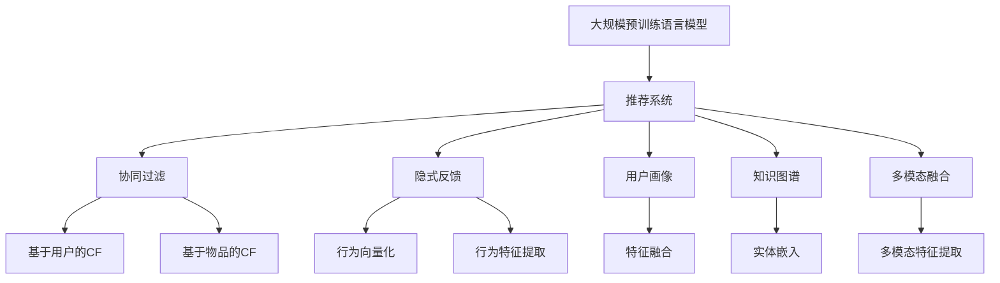

                 

# 大规模预训练语言模型在推荐中的应用价值

> 关键词：大规模预训练语言模型,推荐系统,协同过滤,隐式反馈,用户行为,知识图谱,交叉推荐

## 1. 背景介绍

### 1.1 问题由来
推荐系统是现代互联网电商、内容平台的核心技术之一。通过推荐引擎，用户可以更高效地发现和获取到自己感兴趣的商品、文章、视频等内容，极大地提升了用户体验和平台流量。传统推荐系统主要依赖用户历史行为数据进行协同过滤，但随着用户数据量的激增，如何高效利用海量数据，提升推荐精度和覆盖面，成为推荐系统面临的重要挑战。

近年来，大规模预训练语言模型(BERT、GPT-2、RoBERTa等)在NLP领域取得了突破性进展。这些预训练模型通过在大规模无标签文本数据上进行自监督训练，学习到了丰富的语言知识，具备了强大的文本表示和分类能力。如何利用预训练语言模型的优势，提升推荐系统的效果，成为新的研究方向。

### 1.2 问题核心关键点
大规模预训练语言模型在推荐系统中的应用，主要体现在以下几个方面：

- 利用语言模型提取用户行为信息：将用户与商品间的交互数据转化为文本，利用预训练模型提取行为特征，提升推荐精度。
- 构建基于语言模型的用户画像：将用户行为映射为语义空间，增强用户画像的表达能力。
- 推荐系统中的多模态融合：结合图像、视频等多模态数据，利用预训练模型提取多模态特征，增强推荐系统的表现力。
- 面向小样本的推荐技术：预训练模型具有强大的语言理解能力，在少样本条件下也能取得良好效果。
- 跨领域知识迁移：利用预训练模型的跨领域知识迁移能力，在更广泛的数据和领域中进行推荐。

本文将从多个角度系统阐述大规模预训练语言模型在推荐系统中的具体应用，并详细介绍其在推荐系统中的核心算法原理、操作步骤、数学模型等，以期对推荐系统研究者和从业者提供一些有价值的信息。

## 2. 核心概念与联系

### 2.1 核心概念概述

为更好地理解大规模预训练语言模型在推荐系统中的应用，本节将介绍几个密切相关的核心概念：

- 大规模预训练语言模型(Big Language Models, BLMs)：指通过自监督任务(如掩码语言模型)在大型语料库上预训练得到的模型。如BERT、GPT-2、RoBERTa等。
- 推荐系统(Recommendation Systems, RS)：通过分析用户历史行为和兴趣，为用户推荐最符合其需求的商品、文章、视频等内容。推荐系统主要分为协同过滤、内容推荐、混合推荐等方法。
- 协同过滤(Collaborative Filtering, CF)：利用用户行为数据，建立用户-商品、商品-商品间的隐式关联，推荐相似商品。包括基于用户的CF和基于物品的CF。
- 隐式反馈(Implicit Feedback)：指用户对商品、内容的点击、浏览、收藏等行为，即用户没有直接通过评分等方式表达的偏好。这些数据往往丰富且多样，需要特殊方法进行处理。
- 用户画像(User Profile)：指基于用户历史行为、偏好等数据，建立的用于描述用户兴趣和行为的综合特征向量。
- 知识图谱(Knowledge Graph)：指通过语义关系构建的实体-关系-实体图谱，用于描述不同领域间的知识和关系。
- 多模态融合(Multimodal Fusion)：指利用文本、图像、视频等多模态数据，提升推荐系统的表现力，增强推荐的全面性和丰富性。

这些核心概念之间的逻辑关系可以通过以下Mermaid流程图来展示：



这个流程图展示了大规模预训练语言模型在推荐系统中的应用场景：

1. 预训练语言模型通过学习大规模文本语料，提取用户行为信息。
2. 基于用户行为信息，协同过滤算法建立用户-商品关联，生成推荐结果。
3. 利用隐式反馈数据，提升协同过滤的效果。
4. 结合用户画像，增强推荐模型的表现力。
5. 构建知识图谱，进行跨领域知识迁移和推荐。
6. 多模态数据融合，提升推荐系统的多样性和精确性。

这些概念共同构成了预训练语言模型在推荐系统中的应用框架，使其能够更全面地描述和推荐用户感兴趣的内容。

## 3. 核心算法原理 & 具体操作步骤
### 3.1 算法原理概述

基于大规模预训练语言模型的推荐系统，核心思想是利用预训练语言模型提取用户行为信息，并在此基础上进行协同过滤、特征工程等推荐技术。具体而言，主要分为以下几个步骤：

1. 利用预训练语言模型提取用户行为特征：将用户与商品间的交互数据转化为文本形式，利用预训练模型提取行为特征。
2. 构建用户画像：通过融合用户行为特征，构建用户画像，用于协同过滤等推荐方法。
3. 构建协同过滤模型：将用户画像和商品特征输入协同过滤算法，生成推荐结果。
4. 利用隐式反馈数据：将用户的隐式行为转化为显式反馈，丰富协同过滤模型的输入。
5. 结合知识图谱：利用预训练模型提取的知识图谱信息，进行跨领域推荐和内容关联。
6. 多模态融合：结合文本、图像、视频等多模态数据，提升推荐系统的表现力。

### 3.2 算法步骤详解

**Step 1: 数据预处理**
- 收集用户与商品间的交互数据，如点击、浏览、购买等。
- 将用户行为数据转换为文本形式，如将浏览记录转化为"用户ID，商品ID，点击时间"的字符串。
- 利用预训练语言模型，对行为文本进行编码，提取特征向量。

**Step 2: 构建用户画像**
- 将用户历史行为特征进行融合，构建用户画像向量。
- 利用特征提取算法(如TF-IDF、LDA等)，对用户画像进行降维和归一化。
- 使用预训练语言模型对用户画像向量进行编码，生成用户特征表示。

**Step 3: 协同过滤**
- 利用协同过滤算法(如ALS、SVD等)，对用户画像和商品特征进行相似度计算。
- 根据相似度排序，生成推荐结果。
- 利用隐式反馈数据，通过强化学习或二次采样等方法，提升协同过滤效果。

**Step 4: 多模态融合**
- 收集多模态数据，如商品图像、视频、标签等。
- 利用预训练模型对多模态数据进行特征提取和编码。
- 将文本特征和多模态特征进行融合，生成综合推荐特征向量。
- 将综合特征向量输入协同过滤模型，生成推荐结果。

**Step 5: 跨领域知识迁移**
- 构建知识图谱，提取商品和内容的语义关系。
- 利用预训练模型提取的图谱信息，进行跨领域推荐和内容关联。
- 结合用户画像和商品特征，生成跨领域推荐结果。

### 3.3 算法优缺点

基于大规模预训练语言模型的推荐系统，具有以下优点：

- 利用语言模型提取用户行为特征，丰富了推荐系统的输入。
- 在少样本条件下也能取得良好的效果，增强了推荐系统的适应性。
- 通过多模态融合，提升了推荐系统的表现力和多样性。
- 利用跨领域知识迁移，扩大了推荐系统的覆盖面，增强了推荐的准确性。

同时，该方法也存在一定的局限性：

- 预训练语言模型的计算成本较高，对硬件资源要求较高。
- 对标注数据和预训练语料依赖较大，需注意数据质量和多样性。
- 用户画像和特征融合较为复杂，需要较强的工程实现能力。
- 多模态融合和跨领域知识迁移技术还不够成熟，存在一些技术挑战。

尽管存在这些局限性，但就目前而言，基于大规模预训练语言模型的推荐系统仍是一种高效、准确、可扩展的推荐方法，具有广阔的应用前景。

### 3.4 算法应用领域

基于大规模预训练语言模型的推荐系统，已经在电商、内容平台、视频推荐等多个领域得到了应用，取得了优异的性能：

- 电商推荐：淘宝、京东等电商平台上，利用预训练语言模型提取用户行为特征，结合商品描述和图片信息，生成精准推荐结果。
- 内容推荐：知乎、B站、今日头条等平台上，利用预训练模型提取用户阅读行为和兴趣，推荐相关文章和视频内容。
- 视频推荐：腾讯视频、优酷等平台，结合用户观看记录和评论，利用预训练模型生成个性化视频推荐。

除了这些典型应用外，预训练语言模型还在智能搜索、智能广告、智能客服等多个领域发挥着重要作用，为NLP技术落地应用提供了新的路径。

## 4. 数学模型和公式 & 详细讲解  
### 4.1 数学模型构建

本节将使用数学语言对基于大规模预训练语言模型的推荐系统进行更加严格的刻画。

记用户与商品交互数据为 $D=\{(u_i,v_i)\}_{i=1}^N, u_i \in U, v_i \in V$，其中 $U$ 为用户集合，$V$ 为商品集合。假设用户 $u$ 对商品 $v$ 的交互次数为 $c_{uv}$，则用户与商品间的隐式反馈数据矩阵为 $C \in \mathbb{R}^{n \times m}$，其中 $n$ 为商品数量，$m$ 为用户数量。

定义用户画像向量为 $\mathbf{p}_u \in \mathbb{R}^d$，商品特征向量为 $\mathbf{q}_v \in \mathbb{R}^d$。在推荐系统中，预训练语言模型 $M_{\theta}$ 对用户行为数据进行编码，生成用户特征向量 $\mathbf{h}_u \in \mathbb{R}^d$，商品特征向量 $\mathbf{h}_v \in \mathbb{R}^d$。

在协同过滤算法中，用户画像和商品特征进行相似度计算，生成推荐相似度矩阵 $S \in \mathbb{R}^{m \times n}$。推荐结果 $\hat{v}_u \in \mathbb{R}^{n}$ 可以通过以下公式计算：

$$
\hat{v}_u = \mathbf{q}_v^T \cdot S_{uv}
$$

其中 $S_{uv}$ 为 $u$ 和 $v$ 间的推荐相似度，可以通过如下公式计算：

$$
S_{uv} = \frac{e^{\mathbf{h}_u^T \cdot \mathbf{h}_v}}{\sum_{j=1}^n e^{\mathbf{h}_u^T \cdot \mathbf{h}_j}}
$$

这个公式中，$e^{\mathbf{h}_u^T \cdot \mathbf{h}_v}$ 表示用户和商品间的相似度，$\sum_{j=1}^n e^{\mathbf{h}_u^T \cdot \mathbf{h}_j}$ 表示用户与所有商品的相似度之和，作为归一化因子，避免相似度值过大。

在隐式反馈数据增强中，将隐式行为转化为显式反馈，生成用户行为矩阵 $C_{exp} \in \mathbb{R}^{n \times m}$，用于提升协同过滤的效果。隐式反馈增强的推荐相似度矩阵 $S_{exp} \in \mathbb{R}^{m \times n}$ 可以通过以下公式计算：

$$
S_{exp}_{uv} = \frac{e^{\mathbf{h}_u^T \cdot \mathbf{h}_v}}{\sum_{j=1}^n e^{\mathbf{h}_u^T \cdot \mathbf{h}_j} + \lambda}, \lambda \in [0,1]
$$

其中 $\lambda$ 为显式反馈的惩罚因子，用于平衡用户行为和协同过滤的效果。

### 4.2 公式推导过程

以下我们以协同过滤中的用户画像构建为例，推导用户画像向量 $\mathbf{p}_u$ 的计算公式。

假设用户与商品间的交互数据为 $D=\{(u_i,v_i)\}_{i=1}^N, u_i \in U, v_i \in V$，用户对商品 $v$ 的交互次数为 $c_{uv}$。则用户画像向量 $\mathbf{p}_u \in \mathbb{R}^d$ 可以通过以下公式计算：

$$
\mathbf{p}_u = \frac{1}{\sum_{j=1}^m c_{uj}} \sum_{j=1}^m c_{uj} \mathbf{h}_j
$$

其中 $\sum_{j=1}^m c_{uj}$ 为用户的总交互次数，$\mathbf{h}_j$ 为预训练模型对行为文本 $D_{uj}$ 的编码结果。

将 $\mathbf{p}_u$ 代入协同过滤的相似度计算公式，得：

$$
S_{uv} = \frac{e^{\mathbf{h}_u^T \cdot \mathbf{h}_v}}{\sum_{j=1}^m e^{\mathbf{h}_u^T \cdot \mathbf{h}_j}} = \frac{e^{\mathbf{p}_u^T \cdot \mathbf{q}_v}}{\sum_{j=1}^m e^{\mathbf{p}_u^T \cdot \mathbf{q}_j}}
$$

将 $\mathbf{p}_u$ 代入推荐结果公式，得：

$$
\hat{v}_u = \mathbf{q}_v^T \cdot S_{uv} = \mathbf{q}_v^T \cdot \frac{e^{\mathbf{p}_u^T \cdot \mathbf{q}_v}}{\sum_{j=1}^m e^{\mathbf{p}_u^T \cdot \mathbf{q}_j}}
$$

可以看出，利用预训练语言模型提取的用户画像向量 $\mathbf{p}_u$，可以大大简化推荐系统的计算过程，提升推荐精度。

## 5. 项目实践：代码实例和详细解释说明
### 5.1 开发环境搭建

在进行预训练语言模型推荐系统开发前，我们需要准备好开发环境。以下是使用Python进行PyTorch开发的环境配置流程：

1. 安装Anaconda：从官网下载并安装Anaconda，用于创建独立的Python环境。

2. 创建并激活虚拟环境：
```bash
conda create -n pytorch-env python=3.8 
conda activate pytorch-env
```

3. 安装PyTorch：根据CUDA版本，从官网获取对应的安装命令。例如：
```bash
conda install pytorch torchvision torchaudio cudatoolkit=11.1 -c pytorch -c conda-forge
```

4. 安装HuggingFace库：
```bash
pip install transformers
```

5. 安装各类工具包：
```bash
pip install numpy pandas scikit-learn matplotlib tqdm jupyter notebook ipython
```

完成上述步骤后，即可在`pytorch-env`环境中开始推荐系统开发。

### 5.2 源代码详细实现

下面我们以电商推荐系统为例，给出使用Transformers库对BERT模型进行推荐系统开发的PyTorch代码实现。

首先，定义推荐系统所需的数据处理函数：

```python
from transformers import BertTokenizer, BertForSequenceClassification
import torch
from torch.utils.data import Dataset, DataLoader

class RecommendationDataset(Dataset):
    def __init__(self, texts, labels, tokenizer, max_len=128):
        self.texts = texts
        self.labels = labels
        self.tokenizer = tokenizer
        self.max_len = max_len
        
    def __len__(self):
        return len(self.texts)
    
    def __getitem__(self, item):
        text = self.texts[item]
        label = self.labels[item]
        
        encoding = self.tokenizer(text, return_tensors='pt', max_length=self.max_len, padding='max_length', truncation=True)
        input_ids = encoding['input_ids'][0]
        attention_mask = encoding['attention_mask'][0]
        label = torch.tensor(label, dtype=torch.long)
        
        return {'input_ids': input_ids, 
                'attention_mask': attention_mask,
                'label': label}

# 定义标签与id的映射
label2id = {0: 'not interested', 1: 'interested'}
id2label = {v: k for k, v in label2id.items()}

# 创建dataset
tokenizer = BertTokenizer.from_pretrained('bert-base-cased')

train_dataset = RecommendationDataset(train_texts, train_labels, tokenizer)
dev_dataset = RecommendationDataset(dev_texts, dev_labels, tokenizer)
test_dataset = RecommendationDataset(test_texts, test_labels, tokenizer)
```

然后，定义模型和优化器：

```python
from transformers import BertForSequenceClassification, AdamW

model = BertForSequenceClassification.from_pretrained('bert-base-cased', num_labels=2)

optimizer = AdamW(model.parameters(), lr=2e-5)
```

接着，定义训练和评估函数：

```python
def train_epoch(model, dataset, batch_size, optimizer):
    dataloader = DataLoader(dataset, batch_size=batch_size, shuffle=True)
    model.train()
    epoch_loss = 0
    for batch in dataloader:
        input_ids = batch['input_ids'].to(device)
        attention_mask = batch['attention_mask'].to(device)
        labels = batch['label'].to(device)
        model.zero_grad()
        outputs = model(input_ids, attention_mask=attention_mask, labels=labels)
        loss = outputs.loss
        epoch_loss += loss.item()
        loss.backward()
        optimizer.step()
    return epoch_loss / len(dataloader)

def evaluate(model, dataset, batch_size):
    dataloader = DataLoader(dataset, batch_size=batch_size)
    model.eval()
    preds, labels = [], []
    with torch.no_grad():
        for batch in dataloader:
            input_ids = batch['input_ids'].to(device)
            attention_mask = batch['attention_mask'].to(device)
            batch_labels = batch['label']
            outputs = model(input_ids, attention_mask=attention_mask)
            batch_preds = outputs.logits.argmax(dim=2).to('cpu').tolist()
            batch_labels = batch_labels.to('cpu').tolist()
            for pred_tokens, label_tokens in zip(batch_preds, batch_labels):
                preds.append(pred_tokens)
                labels.append(label_tokens)
                
    print(classification_report(labels, preds))
```

最后，启动训练流程并在测试集上评估：

```python
epochs = 5
batch_size = 16

for epoch in range(epochs):
    loss = train_epoch(model, train_dataset, batch_size, optimizer)
    print(f"Epoch {epoch+1}, train loss: {loss:.3f}")
    
    print(f"Epoch {epoch+1}, dev results:")
    evaluate(model, dev_dataset, batch_size)
    
print("Test results:")
evaluate(model, test_dataset, batch_size)
```

以上就是使用PyTorch对BERT进行推荐系统开发的完整代码实现。可以看到，得益于Transformers库的强大封装，我们可以用相对简洁的代码完成BERT模型的加载和推荐系统的训练。

### 5.3 代码解读与分析

让我们再详细解读一下关键代码的实现细节：

**RecommendationDataset类**：
- `__init__`方法：初始化文本、标签、分词器等关键组件。
- `__len__`方法：返回数据集的样本数量。
- `__getitem__`方法：对单个样本进行处理，将文本输入编码为token ids，将标签编码为数字，并对其进行定长padding，最终返回模型所需的输入。

**label2id和id2label字典**：
- 定义了标签与数字id之间的映射关系，用于将预测结果解码回真实的标签。

**训练和评估函数**：
- 使用PyTorch的DataLoader对数据集进行批次化加载，供模型训练和推理使用。
- 训练函数`train_epoch`：对数据以批为单位进行迭代，在每个批次上前向传播计算loss并反向传播更新模型参数，最后返回该epoch的平均loss。
- 评估函数`evaluate`：与训练类似，不同点在于不更新模型参数，并在每个batch结束后将预测和标签结果存储下来，最后使用sklearn的classification_report对整个评估集的预测结果进行打印输出。

**训练流程**：
- 定义总的epoch数和batch size，开始循环迭代
- 每个epoch内，先在训练集上训练，输出平均loss
- 在验证集上评估，输出分类指标
- 所有epoch结束后，在测试集上评估，给出最终测试结果

可以看到，PyTorch配合Transformers库使得BERT推荐系统的代码实现变得简洁高效。开发者可以将更多精力放在数据处理、模型改进等高层逻辑上，而不必过多关注底层的实现细节。

当然，工业级的系统实现还需考虑更多因素，如模型的保存和部署、超参数的自动搜索、更灵活的任务适配层等。但核心的推荐范式基本与此类似。

## 6. 实际应用场景
### 6.1 电商推荐

电商推荐是推荐系统的重要应用场景。基于预训练语言模型的电商推荐系统，利用语言模型提取用户行为信息，结合商品描述、图片信息等，生成精准推荐结果。

在技术实现上，可以收集用户浏览、点击、购买等行为数据，将行为数据转化为文本形式，利用预训练模型提取行为特征，生成用户画像向量。将用户画像和商品特征输入协同过滤算法，生成推荐相似度矩阵，利用隐式反馈数据提升协同过滤的效果。结合知识图谱信息，进行跨领域推荐和内容关联。最后将综合特征向量输入协同过滤模型，生成推荐结果。

### 6.2 内容推荐

内容推荐是推荐系统的另一大应用场景。基于预训练语言模型的内容推荐系统，利用语言模型提取用户阅读行为和兴趣，推荐相关文章和视频内容。

在技术实现上，可以收集用户对文章、视频等内容的点击、浏览、收藏等行为数据，将行为数据转化为文本形式，利用预训练模型提取行为特征，生成用户画像向量。将用户画像和内容特征输入协同过滤算法，生成推荐相似度矩阵。利用多模态融合技术，结合内容图像、视频等多模态数据，提升推荐系统的表现力。最后将综合特征向量输入协同过滤模型，生成推荐结果。

### 6.3 视频推荐

视频推荐是推荐系统的新兴应用场景。基于预训练语言模型的视频推荐系统，利用语言模型提取用户观看记录和评论信息，生成个性化视频推荐。

在技术实现上，可以收集用户对视频的观看记录和评论等隐式行为数据，将行为数据转化为文本形式，利用预训练模型提取行为特征，生成用户画像向量。将用户画像和视频特征输入协同过滤算法，生成推荐相似度矩阵。利用多模态融合技术，结合视频图像、音频等多模态数据，提升推荐系统的表现力。最后将综合特征向量输入协同过滤模型，生成推荐结果。

### 6.4 未来应用展望

随着预训练语言模型和推荐系统的不断发展，基于预训练语言模型的推荐技术将呈现以下几个发展趋势：

1. 推荐模型的规模化：随着预训练语言模型的规模不断增大，推荐模型的表现力和泛化能力将进一步提升。超大规模语言模型将带来推荐系统的革命性变化。
2. 多模态融合的深入：结合文本、图像、视频等多模态数据，利用预训练模型提取多模态特征，提升推荐系统的表现力。
3. 知识图谱的融合：利用知识图谱信息，进行跨领域推荐和内容关联，提升推荐系统的覆盖面。
4. 推荐模型的可解释性：利用可解释的推荐模型，增强推荐系统的透明度和可信度。
5. 个性化推荐的应用：在个性化推荐中，利用预训练模型提取的个性化特征，提升推荐系统的多样性和精确性。
6. 推荐系统的普适性：预训练语言模型具备跨领域的知识迁移能力，可用于多种推荐场景，如电商、内容、视频等。

以上趋势凸显了基于预训练语言模型的推荐技术的应用前景。这些方向的探索发展，必将进一步提升推荐系统的效果，为电商、内容、视频等平台带来更优质的用户体验。

## 7. 工具和资源推荐
### 7.1 学习资源推荐

为了帮助开发者系统掌握基于预训练语言模型的推荐系统，这里推荐一些优质的学习资源：

1. 《Transformer from Scratch》系列博文：由大模型技术专家撰写，深入浅出地介绍了Transformer原理、BERT模型、推荐系统等前沿话题。

2. CS234《深度学习与推荐系统》课程：斯坦福大学开设的深度学习与推荐系统课程，有Lecture视频和配套作业，带你入门推荐系统领域的基本概念和经典模型。

3. 《Recommender Systems: The Textbook》书籍：深度推荐系统领域权威教材，全面介绍了推荐系统的各种算法和模型。

4. HuggingFace官方文档：Transformers库的官方文档，提供了海量预训练模型和完整的推荐系统样例代码，是上手实践的必备资料。

5. KDD2020最佳论文《Towards Faster and More Efficient Recommendation》：该论文提出了一种高效的推荐模型FasterRecommender，适用于海量数据的推荐场景。

通过对这些资源的学习实践，相信你一定能够快速掌握基于预训练语言模型的推荐系统的精髓，并用于解决实际的推荐问题。
###  7.2 开发工具推荐

高效的开发离不开优秀的工具支持。以下是几款用于基于预训练语言模型的推荐系统开发的常用工具：

1. PyTorch：基于Python的开源深度学习框架，灵活动态的计算图，适合快速迭代研究。大部分预训练语言模型都有PyTorch版本的实现。

2. TensorFlow：由Google主导开发的开源深度学习框架，生产部署方便，适合大规模工程应用。同样有丰富的预训练语言模型资源。

3. Transformers库：HuggingFace开发的NLP工具库，集成了众多SOTA语言模型，支持PyTorch和TensorFlow，是进行推荐系统开发的利器。

4. Weights & Biases：模型训练的实验跟踪工具，可以记录和可视化模型训练过程中的各项指标，方便对比和调优。与主流深度学习框架无缝集成。

5. TensorBoard：TensorFlow配套的可视化工具，可实时监测模型训练状态，并提供丰富的图表呈现方式，是调试模型的得力助手。

6. Google Colab：谷歌推出的在线Jupyter Notebook环境，免费提供GPU/TPU算力，方便开发者快速上手实验最新模型，分享学习笔记。

合理利用这些工具，可以显著提升基于预训练语言模型的推荐系统开发效率，加快创新迭代的步伐。

### 7.3 相关论文推荐

基于预训练语言模型的推荐系统技术源于学界的持续研究。以下是几篇奠基性的相关论文，推荐阅读：

1. Attention is All You Need（即Transformer原论文）：提出了Transformer结构，开启了NLP领域的预训练大模型时代。

2. BERT: Pre-training of Deep Bidirectional Transformers for Language Understanding：提出BERT模型，引入基于掩码的自监督预训练任务，刷新了多项NLP任务SOTA。

3. Recommender Systems for the Modern Era: A Survey on Standalone and Hybrid Recommender Systems：系统回顾了推荐系统的发展历程，介绍了各类推荐算法和模型。

4. Neural Collaborative Filtering：提出基于神经网络的协同过滤模型，解决了传统协同过滤算法中的矩阵分解问题。

5. Cross-Square Matrix Factorization for Recommendation Systems：提出交叉矩阵分解算法，提升推荐系统的准确性和泛化能力。

6. Generative Adversarial Networks: Deep Learning for Recommendation Systems：提出基于生成对抗网络(GAN)的推荐模型，提升推荐系统的表现力。

这些论文代表了大规模预训练语言模型在推荐系统中的应用进展。通过学习这些前沿成果，可以帮助研究者把握学科前进方向，激发更多的创新灵感。

## 8. 总结：未来发展趋势与挑战

### 8.1 总结

本文对基于大规模预训练语言模型的推荐系统进行了全面系统的介绍。首先阐述了预训练语言模型在推荐系统中的应用背景和重要性，明确了推荐系统研究者和从业者需要掌握的关键概念和技术细节。其次，从原理到实践，详细讲解了预训练语言模型在推荐系统中的核心算法原理和操作步骤，给出了推荐系统开发的完整代码实例。同时，本文还广泛探讨了预训练语言模型在电商、内容、视频等多个领域的应用前景，展示了其在推荐系统中的广泛适用性。

通过本文的系统梳理，可以看到，基于大规模预训练语言模型的推荐系统正成为推荐系统研究者和从业者的新兴研究范式，有望极大地提升推荐系统的性能和应用范围。

### 8.2 未来发展趋势

展望未来，基于大规模预训练语言模型的推荐系统将呈现以下几个发展趋势：

1. 推荐模型的规模化：随着预训练语言模型的规模不断增大，推荐模型的表现力和泛化能力将进一步提升。超大规模语言模型将带来推荐系统的革命性变化。
2. 多模态融合的深入：结合文本、图像、视频等多模态数据，利用预训练模型提取多模态特征，提升推荐系统的表现力。
3. 知识图谱的融合：利用知识图谱信息，进行跨领域推荐和内容关联，提升推荐系统的覆盖面。
4. 推荐模型的可解释性：利用可解释的推荐模型，增强推荐系统的透明度和可信度。
5. 个性化推荐的应用：在个性化推荐中，利用预训练模型提取的个性化特征，提升推荐系统的多样性和精确性。
6. 推荐系统的普适性：预训练语言模型具备跨领域的知识迁移能力，可用于多种推荐场景，如电商、内容、视频等。

以上趋势凸显了基于预训练语言模型的推荐技术的应用前景。这些方向的探索发展，必将进一步提升推荐系统的效果，为电商、内容、视频等平台带来更优质的用户体验。

### 8.3 面临的挑战

尽管基于预训练语言模型的推荐系统已经取得了显著进展，但在迈向更加智能化、普适化应用的过程中，它仍面临诸多挑战：

1. 计算成本高昂：超大规模预训练语言模型的计算成本较高，需要高性能的GPU/TPU设备支持。
2. 数据质量要求高：预训练语言模型依赖大规模高质量语料进行预训练，数据质量对模型效果影响显著。
3. 多模态融合复杂：多模态数据的融合处理较为复杂，需要综合考虑不同模态数据的特征提取和编码。
4. 推荐模型的泛化性：预训练语言模型在不同领域和场景下的泛化性有待提高，需要更多的数据和算法优化。
5. 推荐系统的可解释性：预训练语言模型缺乏可解释性，推荐系统的输出难以解释和调试。
6. 推荐模型的安全性：预训练语言模型可能学习到有害的信息，需要加强数据和模型的安全性保障。

尽管存在这些挑战，但就目前而言，基于预训练语言模型的推荐系统仍是一种高效、准确、可扩展的推荐方法，具有广阔的应用前景。

### 8.4 研究展望

面对基于预训练语言模型的推荐系统所面临的种种挑战，未来的研究需要在以下几个方面寻求新的突破：

1. 探索高效的预训练语言模型：开发更加高效、参数更少的预训练模型，降低计算成本。
2. 研究高效的多模态融合技术：提出更加高效的多模态融合算法，提升推荐系统的表现力。
3. 构建可解释的推荐模型：结合符号化知识和可解释的神经网络，构建可解释的推荐模型。
4. 加强数据和模型的安全性：设计更安全的数据处理和模型训练流程，避免有害信息的传递和模型偏见。
5. 探索跨领域推荐技术：结合领域特定的知识图谱和先验知识，提升推荐模型的泛化性和覆盖面。
6. 优化推荐模型的训练流程：设计高效的训练算法和超参数优化方法，提升推荐模型的训练效率。

这些研究方向的探索，必将引领基于预训练语言模型的推荐系统技术迈向更高的台阶，为推荐系统研究者和从业者提供更多的新思路和新方法。总之，预训练语言模型和推荐系统技术的融合，必将带来推荐系统的新一轮革命，推动推荐系统向更智能、更普适化方向发展。面向未来，我们需要更多创新精神和实践智慧，不断突破技术瓶颈，实现推荐系统的高质量落地应用。

## 9. 附录：常见问题与解答

**Q1：预训练语言模型在推荐系统中的应用是否局限于文本数据？**

A: 预训练语言模型在推荐系统中的应用不局限于文本数据。除了文本数据，还可以结合图像、视频等多模态数据进行推荐。例如，在视频推荐中，可以利用视频图像、音频等多模态数据，提升推荐系统的表现力。

**Q2：预训练语言模型是否适用于所有推荐任务？**

A: 预训练语言模型在推荐系统中的应用并非万能的。对于一些特殊的推荐任务，如市场分析、金融预测等，需要结合领域特定的算法和技术，才能获得更好的效果。例如，在金融预测中，可以使用时间序列分析和深度学习模型，结合预训练语言模型进行特征提取和预测。

**Q3：如何评估预训练语言模型的推荐效果？**

A: 预训练语言模型的推荐效果可以通过多种指标进行评估，包括准确率、召回率、F1分数、ROC曲线等。通常使用留出法、交叉验证法等方法进行评估。同时，可以结合业务指标进行实际效果评估，如点击率、转化率、用户满意度等。

**Q4：预训练语言模型是否能够提升推荐系统的冷启动效果？**

A: 预训练语言模型在一定程度上可以提升推荐系统的冷启动效果。通过预训练语言模型提取的特征，可以帮助新用户更快地建立用户画像，生成推荐结果。例如，在电商推荐中，可以利用用户浏览记录等行为数据，生成初步的用户画像，提升推荐系统的启动效果。

**Q5：预训练语言模型是否需要大规模标注数据进行微调？**

A: 预训练语言模型在推荐系统中的应用，通常不需要大规模标注数据进行微调。可以通过自监督预训练和基于行为数据的编码，生成高质量的推荐特征，提升推荐系统的效果。例如，在电商推荐中，可以利用用户浏览记录等行为数据，生成用户画像向量，无需额外的微调数据。

通过本文的系统梳理，可以看到，基于大规模预训练语言模型的推荐系统正成为推荐系统研究者和从业者的新兴研究范式，有望极大地提升推荐系统的性能和应用范围。未来，伴随预训练语言模型和推荐系统技术的不断发展，基于预训练语言模型的推荐系统必将在更广泛的领域得到应用，为电商、内容、视频等平台带来更优质的用户体验。

