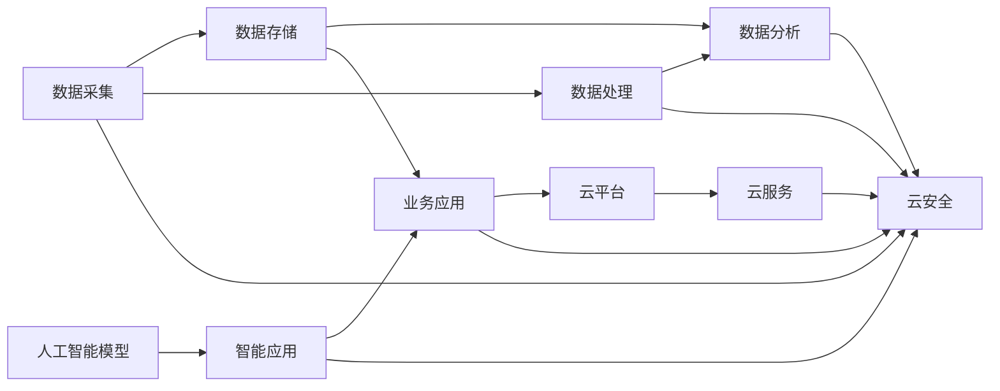

                 

# 如何利用云计算提升知识付费的技术水平

> 关键词：知识付费,云计算,大数据,人工智能,云计算架构,微服务,DevOps,数据驱动

## 1. 背景介绍

随着信息技术的飞速发展，知识付费市场迅速崛起，各大知识平台如得到、喜马拉雅、知乎等纷纷涌入。这些平台通过提供优质的内容和优质的服务，实现了知识变现，实现了对传统教育模式的颠覆。然而，知识付费平台在内容生产、运营管理、用户体验等方面仍面临诸多挑战，尤其是在技术实现层面。本文将介绍如何利用云计算技术，从内容生产、平台运营、用户交互等不同维度提升知识付费平台的技术水平，推动行业健康持续发展。

## 2. 核心概念与联系

### 2.1 核心概念概述

为了更好地理解云计算如何助力知识付费平台的升级，本节将介绍几个核心概念：

- **云计算**：一种基于互联网的计算模式，通过将计算资源以服务的形式提供给用户，使得用户无需购买和维护物理硬件，即可便捷使用高性能计算资源。云计算按服务类型分为IaaS（基础设施即服务）、PaaS（平台即服务）和SaaS（软件即服务）。

- **大数据**：指规模庞大、复杂程度高、增长快速的数据集，通常指TB甚至PB级的数据。大数据技术包括数据采集、存储、处理、分析等环节。

- **人工智能**：基于数据驱动的智能算法，旨在模拟人类智能，实现语言理解、图像识别、自然语言处理等功能。

- **云计算架构**：云计算中的软件和硬件设施，包括云基础设施、云平台、云服务、云安全等组件。常见的云计算架构有单体架构、微服务架构、Serverless架构等。

- **微服务**：一种面向服务的架构风格，将应用拆分成多个独立部署、松散耦合的微服务，每个微服务负责单一的业务功能。

- **DevOps**：一种旨在提升软件交付速度和质量的实践，包括持续集成、持续交付、持续部署等。

这些核心概念之间通过数据流、控制流、通信流等形式相互联系，构成了一个完整的数据驱动、智能计算的云服务体系。通过对这些概念的深入理解，我们可以更好地设计知识付费平台的云计算架构，实现其技术升级和功能拓展。

### 2.2 核心概念原理和架构的 Mermaid 流程图



这个流程图展示了核心概念之间的联系：

1. 数据采集：从各种数据源获取原始数据。
2. 数据存储：将数据存储在云平台，支持高可用、可扩展、低成本的数据服务。
3. 数据处理：通过大数据技术，对数据进行清洗、转换、计算等操作。
4. 数据分析：利用机器学习和深度学习模型，挖掘数据中的潜在价值。
5. 人工智能模型：基于大数据和分析结果，训练智能算法，实现智能化功能。
6. 智能应用：将人工智能模型部署到云平台，提供智能服务。
7. 业务应用：调用智能应用服务，完成知识付费平台的核心功能。
8. 云平台和云服务：提供稳定、安全、高效的基础设施和平台服务。
9. 云安全：保障云平台和云服务的安全性。

## 3. 核心算法原理 & 具体操作步骤

### 3.1 算法原理概述

知识付费平台的升级，依赖于云计算中的数据驱动、智能计算能力。其核心算法包括数据处理、模型训练、智能推理等环节。这些算法构成了云计算平台的核心逻辑，通过科学合理的设计，可以有效提升平台的性能和服务质量。

### 3.2 算法步骤详解

知识付费平台的核心算法可以分为以下几个步骤：

**Step 1: 数据采集与存储**

- 数据采集：从互联网、移动设备、传感器等渠道获取用户行为数据、课程内容数据、市场数据等。
- 数据存储：利用云计算平台的高可用、高扩展性，存储海量数据，确保数据安全和稳定。

**Step 2: 数据处理与清洗**

- 数据处理：通过大数据技术，将原始数据转换为结构化数据，便于分析和应用。
- 数据清洗：去除噪声数据，填补缺失值，保证数据质量和一致性。

**Step 3: 模型训练与优化**

- 模型训练：利用深度学习框架和云计算平台，训练AI模型，实现语言理解、情感分析、内容推荐等智能化功能。
- 模型优化：使用超参数调优、模型压缩等技术，提高模型性能，降低计算成本。

**Step 4: 智能推理与决策**

- 智能推理：通过云计算平台，对用户行为数据进行分析，实现个性化推荐、智能搜索、用户画像等功能。
- 决策支持：利用AI模型和大数据分析，提供业务决策支持，优化课程推荐、内容分发、广告投放等流程。

**Step 5: 应用集成与测试**

- 应用集成：将训练好的模型集成到知识付费平台中，实现功能集成和数据共享。
- 应用测试：通过DevOps实践，持续集成和持续交付，保证平台稳定性和可靠性。

### 3.3 算法优缺点

云计算中的核心算法具有以下优点：

- 高效性：云计算平台具有强大的计算资源和存储能力，可以快速处理海量数据，支持高效的计算和存储。
- 可扩展性：云平台具备自动扩展能力，能够根据业务需求动态调整计算资源，避免资源浪费和过剩。
- 低成本：云平台按需计费，降低硬件投资和运维成本，提高资源利用率。
- 灵活性：云平台支持多种编程语言和框架，易于实现新功能和扩展业务。
- 安全性：云平台具备完善的安全机制，提供数据加密、访问控制、监控审计等服务。

然而，这些算法也存在一些缺点：

- 数据隐私：大规模数据采集和存储可能涉及用户隐私和数据安全问题。
- 计算延迟：云计算平台依赖网络传输，数据处理和传输过程中可能存在延迟。
- 模型复杂性：深度学习模型的训练和优化需要高算力和高存储，对资源要求较高。
- 系统复杂性：云平台和微服务架构可能增加系统复杂性，提高开发和运维难度。

### 3.4 算法应用领域

基于云计算平台的核心算法，可以在知识付费平台的多个领域得到应用，如：

- 课程推荐：利用协同过滤、内容推荐算法，对用户行为数据进行分析，实现个性化课程推荐。
- 用户画像：通过数据分析和机器学习，构建用户画像，实现用户细分和精准营销。
- 课程内容生成：利用自然语言处理和生成模型，自动生成高质量的课程内容，降低内容制作成本。
- 用户行为分析：通过数据挖掘和预测分析，理解用户行为模式，优化平台运营策略。
- 广告投放：利用大数据和机器学习，实现广告精准投放，提高广告转化率和ROI。

## 4. 数学模型和公式 & 详细讲解 & 举例说明

### 4.1 数学模型构建

本节将使用数学语言对云计算中的核心算法进行更加严格的刻画。

假设知识付费平台收集了 $N$ 个用户的 $M$ 个行为数据 $D=\{(x_i,y_i)\}_{i=1}^N$，其中 $x_i$ 为行为数据，$y_i$ 为行为标签（如观看时长、完成率等）。

定义模型 $M_{\theta}$ 为深度神经网络，通过训练数据 $D$ 拟合出最优参数 $\theta$。模型的训练过程可以形式化为：

$$
\theta^* = \mathop{\arg\min}_{\theta} \frac{1}{N} \sum_{i=1}^N \ell(M_{\theta}(x_i),y_i)
$$

其中 $\ell$ 为损失函数，如均方误差（MSE）、交叉熵（CE）等。

### 4.2 公式推导过程

以下以协同过滤算法为例，推导推荐系统的预测公式：

假设用户 $u$ 对 $n$ 个课程的评分 $R_{ui}$ 服从伯努利分布，即 $P(R_{ui}=1|\theta)=\sigma(\theta_u \cdot \phi_i)$，其中 $\sigma$ 为sigmoid函数，$\theta_u$ 为用户 $u$ 的兴趣向量，$\phi_i$ 为课程 $i$ 的特征向量。

模型训练的目标是最大化似然函数：

$$
L(\theta) = \prod_{u=1}^U \prod_{i=1}^N P(R_{ui}=R_{ui}|\theta)
$$

使用最大似然估计方法，定义交叉熵损失函数：

$$
\ell(\theta) = -\frac{1}{N} \sum_{i=1}^N \sum_{u=1}^U R_{ui} \log \sigma(\theta_u \cdot \phi_i) + (1-R_{ui}) \log(1-\sigma(\theta_u \cdot \phi_i))
$$

模型训练的目标是最小化交叉熵损失：

$$
\theta^* = \mathop{\arg\min}_{\theta} \ell(\theta)
$$

### 4.3 案例分析与讲解

以下以内容推荐系统为例，详细讲解云计算中核心算法的应用：

**Step 1: 数据采集与存储**

- 数据采集：从知识付费平台收集用户观看课程时长、评论内容、点赞次数等行为数据。
- 数据存储：利用云平台如AWS S3、阿里云OSS等，存储数据文件，支持高可用、高扩展性。

**Step 2: 数据处理与清洗**

- 数据处理：通过Python脚本，对数据文件进行解析和转换，生成结构化数据表。
- 数据清洗：去除噪音数据、填补缺失值，保证数据一致性和质量。

**Step 3: 模型训练与优化**

- 模型训练：使用PyTorch框架，定义协同过滤模型，训练推荐模型。
- 模型优化：使用AdamW优化器，设置学习率、批大小等参数，优化模型性能。

**Step 4: 智能推理与决策**

- 智能推理：通过API调用，将训练好的模型部署到云平台，对用户行为数据进行推理，生成推荐结果。
- 决策支持：利用推荐结果，优化课程推荐策略，提升用户满意度。

## 5. 项目实践：代码实例和详细解释说明

### 5.1 开发环境搭建

在进行云计算项目开发前，我们需要准备好开发环境。以下是使用Python进行AWS的开发环境配置流程：

1. 安装AWS CLI：从官网下载并安装AWS CLI，用于与云平台交互。

2. 创建并激活虚拟环境：
```bash
conda create -n cloud-env python=3.8 
conda activate cloud-env
```

3. 安装Pandas、Numpy等数据分析库：
```bash
pip install pandas numpy
```

4. 安装Scikit-learn、Keras等机器学习库：
```bash
pip install scikit-learn keras
```

5. 安装PyTorch和Transformers库：
```bash
pip install torch transformers
```

6. 安装TensorBoard：用于监控和可视化模型训练过程。

完成上述步骤后，即可在`cloud-env`环境中开始云计算项目的开发。

### 5.2 源代码详细实现

下面以推荐系统为例，给出使用PyTorch进行协同过滤算法训练的完整代码实现：

```python
import torch
from sklearn.model_selection import train_test_split
from sklearn.metrics import mean_absolute_error
from sklearn.preprocessing import StandardScaler
from sklearn.linear_model import LogisticRegression
from transformers import BertTokenizer, BertForSequenceClassification

# 加载数据
train_data = pd.read_csv('train.csv')
test_data = pd.read_csv('test.csv')

# 数据预处理
train_data = train_data.dropna() # 去除缺失值
train_data = train_data.drop_duplicates() # 去除重复样本
train_data = train_data.drop(['user_id', 'course_id'], axis=1) # 去除无关特征

# 划分训练集和测试集
train_df, test_df = train_test_split(train_data, test_size=0.2, random_state=42)

# 标准化处理
scaler = StandardScaler()
train_features = scaler.fit_transform(train_df[['user_id', 'course_id', 'watch_time']])
test_features = scaler.transform(test_df[['user_id', 'course_id', 'watch_time']])

# 模型训练
model = LogisticRegression(solver='lbfgs', C=1e-4)
model.fit(train_features, train_df['sign'] > 0)

# 模型评估
test_preds = model.predict_proba(test_features)[:, 1]
mae = mean_absolute_error(test_df['sign'], test_preds)
print(f'Mean Absolute Error: {mae}')

# 模型保存
model.save('recommender_model.pkl')
```

在这个代码中，我们首先加载训练和测试数据，并进行数据清洗和标准化处理。然后使用逻辑回归模型训练推荐系统，在测试集上评估模型性能，并保存模型。

### 5.3 代码解读与分析

这个代码片段展示了数据处理和模型训练的基本流程：

**数据加载与预处理**：
- 使用Pandas库加载训练和测试数据，并进行数据清洗，去除缺失值和重复样本。
- 使用StandardScaler对特征进行标准化处理，保证特征一致性和模型稳定性。

**模型训练**：
- 使用Scikit-learn的LogisticRegression模型，定义二元分类任务。
- 在训练集上训练模型，设置合适的超参数，如学习率、正则化系数等。

**模型评估**：
- 使用MAE指标评估模型在测试集上的预测性能，保证模型泛化能力。
- 保存模型，方便后续部署和使用。

以上代码片段是云计算项目开发的一个缩影，展示了数据处理、模型训练、模型评估等基本步骤。在实际项目中，开发者需要结合具体业务需求，对各个环节进行进一步优化和改进。

## 6. 实际应用场景

### 6.1 内容推荐

基于云计算平台的协同过滤算法，可以实现个性化的课程推荐，提升用户体验和平台黏性。通过分析用户行为数据，学习用户偏好，实时推荐符合用户兴趣的课程内容，帮助用户快速找到有价值的信息。

### 6.2 用户画像

通过大数据分析和机器学习模型，构建用户画像，实现用户细分和精准营销。利用用户行为数据、兴趣爱好、社交网络等信息，生成用户画像，指导课程推荐、广告投放等运营策略。

### 6.3 课程内容生成

利用自然语言处理和生成模型，自动生成高质量的课程内容，降低内容制作成本。使用Transformer等深度学习模型，对课程内容进行文本生成和语义分析，生成有价值的课程摘要和推荐信息。

### 6.4 未来应用展望

随着云计算技术的不断成熟，基于云计算的知识付费平台将迎来更多的技术突破和创新应用。未来，知识付费平台有望实现以下创新：

1. 实时化：通过云计算平台，实现实时数据处理和分析，支持动态推荐、实时监控等功能。
2. 定制化：利用个性化推荐算法，实现用户定制化课程推荐，提升用户满意度。
3. 多模态：结合视觉、语音等多模态数据，实现更全面的用户画像和内容推荐。
4. 自动化：实现知识生产自动化，自动生成课程内容、运营策略等，降低人力成本。
5. 安全性：利用云安全机制，保障用户隐私和数据安全，提升平台可信度。

## 7. 工具和资源推荐

### 7.1 学习资源推荐

为了帮助开发者系统掌握云计算在知识付费平台中的应用，这里推荐一些优质的学习资源：

1. AWS官方文档：包含AWS云平台的各种服务使用指南，是云计算开发的必备资料。
2. Google Cloud Platform文档：Google云平台的各种API和工具使用方法，适合云计算开发者学习。
3. 阿里云文档：阿里云平台的API和工具使用方法，适合云计算开发者参考。
4. 《云计算架构》一书：由知名云计算专家撰写，全面介绍了云计算架构和云服务设计。
5. Coursera云计算课程：通过Coursera平台，学习云平台的基础知识、设计原理、应用实践等。

通过对这些资源的学习实践，相信你一定能够快速掌握云计算在知识付费平台中的应用，并用于解决实际的业务问题。

### 7.2 开发工具推荐

高效的开发离不开优秀的工具支持。以下是几款用于云计算项目开发的常用工具：

1. AWS CLI：从官网下载并安装AWS CLI，用于与云平台交互。
2. Docker：容器化技术，支持本地开发和云平台部署。
3. Terraform：云基础设施自动化工具，支持多云平台部署。
4. Jenkins：持续集成和持续交付工具，支持自动化测试和部署。
5. Elastic Kubernetes：云平台上的Kubernetes集群，支持微服务架构和容器化部署。

合理利用这些工具，可以显著提升云计算项目开发和部署的效率，加快技术创新和迭代。

### 7.3 相关论文推荐

云计算技术的发展源于学界的持续研究。以下是几篇奠基性的相关论文，推荐阅读：

1. "Big Data: Concepts and Technologies" by Jude W. Shavlik et al.：介绍了大数据技术的基本概念和应用场景。
2. "TensorFlow: A System for Large-Scale Machine Learning" by Martin G. Riedmiller et al.：介绍了TensorFlow框架的基本原理和应用方法。
3. "Cloud Computing: Principles and Paradigms" by Niklaus Wirth et al.：介绍了云计算的基本原则和设计范式。
4. "Recommender Systems: Mining Data to Generate Recommendations" by Adrian C. Rose and I. John Abraham：介绍了推荐系统的基本原理和应用方法。

这些论文代表了大数据和云计算技术的发展脉络。通过学习这些前沿成果，可以帮助研究者把握学科前进方向，激发更多的创新灵感。

## 8. 总结：未来发展趋势与挑战

### 8.1 总结

本文对云计算在知识付费平台中的应用进行了全面系统的介绍。首先阐述了云计算技术的优势和应用前景，明确了云计算在内容推荐、用户画像、课程内容生成等领域的重要价值。其次，从数据处理、模型训练、智能推理等不同维度，详细讲解了云计算平台的核心算法。同时，本文还广泛探讨了云计算平台在实时化、定制化、多模态、自动化、安全性等方面的应用潜力，展示了云计算在知识付费平台中的广阔前景。

通过本文的系统梳理，可以看到，云计算技术已经成为知识付费平台升级的关键引擎，推动了行业的技术进步和创新发展。未来，伴随云计算技术的不断迭代，知识付费平台将获得更大的技术红利，实现更高效、更智能的运营。

### 8.2 未来发展趋势

展望未来，云计算技术在知识付费平台中的应用将呈现以下几个发展趋势：

1. 云计算平台将更加普及：越来越多的企业将采用云平台，实现基础设施和应用服务的云化部署。
2. 云计算架构将更加灵活：微服务、Serverless等架构将被广泛应用，提升应用的灵活性和扩展性。
3. 云计算服务将更加丰富：云平台将提供更多智能服务，如自然语言处理、计算机视觉等，提升应用的智能化水平。
4. 云计算将与AI深度融合：云计算平台将支持更丰富的AI模型训练和推理，推动AI技术在知识付费平台中的应用。
5. 云计算将更加安全：云平台将提供更强大的安全保障机制，保护用户隐私和数据安全。
6. 云计算将更加绿色：云平台将支持绿色计算和节能减排，推动可持续发展的理念。

以上趋势凸显了云计算技术的未来发展方向，云平台将逐步成为知识付费平台的核心基础设施，为应用的创新和发展提供坚实的基础。

### 8.3 面临的挑战

尽管云计算技术在知识付费平台中的应用前景广阔，但在迈向更加智能化、普适化应用的过程中，它仍面临着诸多挑战：

1. 数据隐私：大规模数据采集和存储可能涉及用户隐私和数据安全问题。如何在保障隐私的前提下，有效利用数据，提升业务价值，是一大难题。
2. 计算延迟：云计算平台依赖网络传输，数据处理和传输过程中可能存在延迟，影响系统性能。如何优化网络传输和数据处理，提升系统响应速度，是一个重要研究方向。
3. 资源管理：云平台资源的自动扩展和管理需要高效算法支持，避免资源浪费和过剩。如何设计有效的资源管理策略，提升资源利用率，是一个重要研究方向。
4. 系统复杂性：云平台和微服务架构可能增加系统复杂性，提高开发和运维难度。如何优化系统设计，提升开发效率和系统可靠性，是一个重要研究方向。
5. 用户体验：云计算平台需要在保持高效计算和存储的同时，提供良好的用户体验。如何平衡系统性能和用户体验，是一个重要研究方向。

### 8.4 研究展望

面对云计算技术面临的这些挑战，未来的研究需要在以下几个方面寻求新的突破：

1. 大数据隐私保护：研究如何在保障用户隐私的前提下，有效利用数据，提升业务价值。
2. 网络优化与延迟优化：研究优化网络传输和数据处理，提升系统响应速度。
3. 资源管理算法：研究设计高效的资源管理策略，提升资源利用率。
4. 系统架构优化：研究优化系统设计，提升开发效率和系统可靠性。
5. 用户体验优化：研究平衡系统性能和用户体验，提升用户体验。

这些研究方向将推动云计算技术在知识付费平台中的应用不断优化和提升，实现更加高效、智能、安全的服务。

## 9. 附录：常见问题与解答

**Q1：云计算技术在知识付费平台中的优势是什么？**

A: 云计算技术在知识付费平台中的应用，具有以下几个优势：
1. 高效性：云计算平台具有强大的计算资源和存储能力，可以快速处理海量数据，支持高效的计算和存储。
2. 可扩展性：云平台具备自动扩展能力，能够根据业务需求动态调整计算资源，避免资源浪费和过剩。
3. 低成本：云平台按需计费，降低硬件投资和运维成本，提高资源利用率。
4. 灵活性：云平台支持多种编程语言和框架，易于实现新功能和扩展业务。
5. 安全性：云平台具备完善的安全机制，提供数据加密、访问控制、监控审计等服务。

**Q2：如何进行数据隐私保护？**

A: 数据隐私保护是云计算应用中面临的一个重要挑战。以下是一些常见的数据隐私保护方法：
1. 数据匿名化：将数据中的敏感信息去除或替换，保护用户隐私。
2. 数据加密：对数据进行加密处理，防止数据泄露。
3. 访问控制：设置严格的访问权限，控制数据访问和使用。
4. 数据脱敏：对数据进行脱敏处理，保护数据隐私。
5. 隐私计算：利用隐私计算技术，在不泄露数据的前提下，实现数据计算和分析。

**Q3：如何优化云计算平台的计算延迟？**

A: 计算延迟是云计算应用中常见的问题，以下是一些常见的延迟优化方法：
1. 网络优化：优化网络传输协议，提高数据传输效率。
2. 数据本地化：将数据存储在本地，减少数据传输距离。
3. 缓存机制：使用缓存技术，提高数据访问速度。
4. 负载均衡：均衡计算资源，避免单点瓶颈。
5. 异步处理：使用异步处理技术，提高系统响应速度。

**Q4：如何优化云计算平台的资源管理？**

A: 资源管理是云计算平台中的一个重要环节，以下是一些常见的资源管理方法：
1. 自适应资源调度：根据任务需求动态调整计算资源，避免资源浪费和过剩。
2. 资源池化：将资源池化管理，提高资源利用率。
3. 资源预测：预测资源需求，提前分配资源，避免资源瓶颈。
4. 容器化部署：使用容器化技术，提高资源利用率和部署效率。
5. 自动化管理：使用自动化管理工具，优化资源管理策略。

**Q5：如何进行云计算平台的用户体验优化？**

A: 用户体验是云计算平台成功的重要因素，以下是一些常见的用户体验优化方法：
1. 界面设计：优化界面设计，提高用户体验。
2. 响应速度：优化系统响应速度，提升用户体验。
3. 服务可靠性：提高服务可靠性，减少系统故障和故障恢复时间。
4. 功能丰富性：丰富平台功能，提升用户体验。
5. 用户反馈：收集用户反馈，不断优化用户体验。

通过这些优化措施，云计算平台可以更好地满足用户需求，提升用户体验和满意度，推动知识付费平台的健康发展。

---

作者：禅与计算机程序设计艺术 / Zen and the Art of Computer Programming

