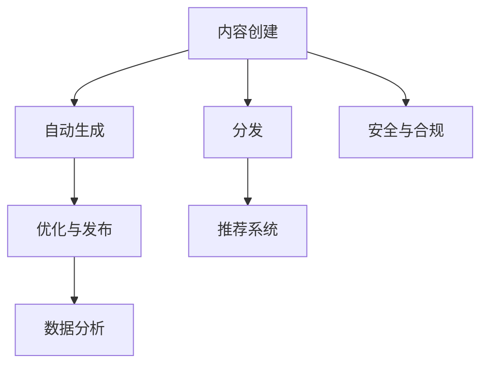

                 

# 如何利用技术能力进行内容创业

## 1. 背景介绍

内容创业已经成为互联网时代最具潜力的创业方向之一。随着信息时代的高速发展，人们对于内容的需求愈发旺盛，而优质的内容供给却相对匮乏。如何在内容创业中脱颖而出，既要依靠优质的内容，更需要依靠先进的技术能力。本文将从技术角度探讨如何利用技术能力进行内容创业，希望给有志于内容创业的朋友们提供一些有价值的见解。

## 2. 核心概念与联系

### 2.1 核心概念概述

在内容创业中，利用技术能力主要包括以下几个核心概念：

- **内容分发网络（CDN）**：用于加速内容的全球分发，减少延迟和带宽成本。
- **内容管理系统（CMS）**：用于管理和组织内容，支持用户创建、编辑、发布内容。
- **自动化内容生产工具**：如自动生成文章、自动摘要、自动化SEO等工具，提升内容生产效率。
- **数据分析与优化**：利用数据分析工具，优化内容策略，提高用户粘性和转化率。
- **推荐系统**：基于用户行为数据，为用户推荐相关内容，提升用户满意度。
- **个性化内容生成**：根据用户偏好生成个性化内容，增强用户体验。
- **安全与合规**：确保内容安全，遵守相关法律法规。

### 2.2 核心概念原理和架构的 Mermaid 流程图



这个流程图展示了内容创业中技术能力的核心路径：从内容创作到自动生成、分发、数据分析、个性化生成和安全合规的全过程。各环节通过技术手段，实现内容的创新、效率提升和用户满意度的提高。

## 3. 核心算法原理 & 具体操作步骤

### 3.1 算法原理概述

内容创业中的技术原理，主要体现在以下几个方面：

- **内容分发**：利用CDN技术，将内容快速分发到全球各地，减少延迟和带宽成本，提升用户体验。
- **内容管理**：利用CMS，实现内容的分层管理和权限控制，提高内容编辑的效率和安全性。
- **内容自动化生产**：通过自然语言处理（NLP）、机器学习（ML）等技术，实现内容的自动生成、自动摘要、自动SEO等功能。
- **数据分析与优化**：利用大数据分析技术，对内容数据进行分析，优化内容策略，提升用户粘性和转化率。
- **推荐系统**：利用协同过滤、内容推荐算法，为用户推荐相关内容，提升用户满意度。
- **个性化内容生成**：利用用户行为数据，生成个性化内容，增强用户体验。
- **安全与合规**：通过数据加密、隐私保护等技术手段，确保内容安全，遵守相关法律法规。

### 3.2 算法步骤详解

#### 3.2.1 内容分发

- **选择合适的CDN服务商**：选择具有良好网络覆盖和服务质量的CDN服务商，确保内容能够快速分发。
- **设置CDN加速规则**：根据不同内容类型和用户群体，设置不同的加速规则。
- **监控与优化**：实时监控CDN性能，根据反馈优化分发策略。

#### 3.2.2 内容管理

- **选择CMS平台**：根据业务需求选择适合的CMS平台，如WordPress、Drupal等。
- **配置权限与角色**：根据不同用户角色，配置相应的权限和角色。
- **内容备份与恢复**：定期备份内容数据，确保数据安全。

#### 3.2.3 内容自动化生产

- **自然语言处理（NLP）**：使用NLP技术，实现文章的自动生成、文本摘要、自动SEO等功能。
- **机器学习（ML）**：利用ML技术，对用户数据进行分析，生成个性化的内容推荐。

#### 3.2.4 数据分析与优化

- **数据收集与存储**：收集内容数据、用户行为数据，存储在数据库或数据仓库中。
- **数据分析与可视化**：利用数据分析工具，如Tableau、Power BI等，进行数据可视化，发现内容优化机会。
- **内容优化**：根据数据分析结果，优化内容策略，如选题、发布时间、内容形式等。

#### 3.2.5 推荐系统

- **协同过滤算法**：根据用户历史行为数据，生成个性化推荐。
- **内容推荐算法**：根据内容特征和用户偏好，推荐相关内容。

#### 3.2.6 个性化内容生成

- **用户画像**：利用用户行为数据，构建用户画像，识别用户兴趣。
- **内容生成**：根据用户画像，生成个性化内容，如个性化文章、视频等。

#### 3.2.7 安全与合规

- **数据加密**：对敏感数据进行加密处理，确保数据安全。
- **隐私保护**：遵守GDPR等隐私保护法规，确保用户隐私安全。

### 3.3 算法优缺点

#### 3.3.1 优点

- **提升内容生产效率**：利用自动化生产工具，大幅度提升内容生产速度。
- **提高用户体验**：通过个性化内容和推荐系统，提升用户满意度。
- **优化内容策略**：通过数据分析，优化内容策略，提升用户粘性和转化率。
- **保障数据安全**：通过加密和隐私保护措施，保障内容数据的安全。

#### 3.3.2 缺点

- **技术成本高**：内容创业需要投入一定的技术成本，特别是对于技术要求较高的领域。
- **依赖数据质量**：内容分发的效率和数据分析的准确性，依赖于数据的质量。
- **内容多样化受限**：自动生成的内容，可能缺乏个性化和深度，难以满足部分用户需求。
- **技术复杂度高**：推荐系统、安全与合规等技术的实现，需要较高的技术水平和经验。

### 3.4 算法应用领域

- **新闻媒体**：利用自动化生成和推荐系统，提升内容生产和分发效率，减少人力成本。
- **电商网站**：利用个性化内容和推荐系统，提升用户体验和转化率。
- **在线教育**：利用个性化内容和数据分析，提升用户学习体验和效果。
- **社交媒体**：利用内容管理和推荐系统，提升用户粘性和互动性。

## 4. 数学模型和公式 & 详细讲解 & 举例说明

### 4.1 数学模型构建

#### 4.1.1 内容分发模型

假设内容从服务器到用户的过程，分为两个环节：内容传输时间和内容处理时间。设内容传输时间为$t_{trans}$，内容处理时间为$t_{proc}$。

内容分发模型的目标是最小化内容传输时间和内容处理时间，即：

$$
\min t_{trans} + t_{proc}
$$

#### 4.1.2 内容管理系统（CMS）

CMS平台可以通过权限管理和角色分配，对用户进行细粒度的管理。设用户角色数为$R$，权限数为$P$。

内容管理系统模型的目标是最大化用户满意度，即：

$$
\max U = \sum_{r=1}^{R} \sum_{p=1}^{P} S(r,p)W(r,p)
$$

其中$S(r,p)$为用户对权限$p$的满意度，$W(r,p)$为角色$r$的权重。

#### 4.1.3 内容自动化生成

内容自动化生成通常利用自然语言处理（NLP）技术。设内容长度为$L$，生成内容的时间为$t_{gen}$。

内容自动化生成模型的目标是最大化生成内容的准确性和速度，即：

$$
\max A = \frac{L}{t_{gen}}
$$

#### 4.1.4 数据分析与优化

数据分析与优化模型通常利用大数据分析技术。设数据集大小为$D$，分析时间为$t_{analy}$。

数据分析与优化模型的目标是最大化数据分析结果的准确性，即：

$$
\max Acc = \frac{D}{t_{analy}}
$$

#### 4.1.5 推荐系统

推荐系统通常利用协同过滤和内容推荐算法。设用户数为$U$，内容数为$C$，推荐结果数为$R$。

推荐系统模型的目标是最大化用户满意度和推荐效果，即：

$$
\max Q = \sum_{u=1}^{U} \sum_{c=1}^{C} \sum_{r=1}^{R} I(u,c,r)W(u,c,r)
$$

其中$I(u,c,r)$为用户对推荐内容$r$的满意度，$W(u,c,r)$为用户对内容$c$的权重。

#### 4.1.6 个性化内容生成

个性化内容生成通常利用用户行为数据。设用户数为$U$，内容数为$C$，生成内容的数量为$R$。

个性化内容生成模型的目标是最大化个性化内容的准确性和满意度，即：

$$
\max P = \sum_{u=1}^{U} \sum_{c=1}^{C} I(u,c)W(u,c)
$$

其中$I(u,c)$为用户对内容$c$的满意度，$W(u,c)$为用户对内容$c$的权重。

#### 4.1.7 安全与合规

安全与合规模型通常利用数据加密和隐私保护技术。设数据加密时间为$t_{enc}$，隐私保护时间为$t_{pr}$。

安全与合规模型的目标是最大化数据安全和用户隐私保护效果，即：

$$
\max S = \frac{D}{t_{enc} + t_{pr}}
$$

### 4.2 公式推导过程

#### 4.2.1 内容分发模型推导

设内容传输时间为$t_{trans} = d \times s$，其中$d$为距离，$s$为传输速率。

内容处理时间为$t_{proc} = \frac{L}{v}$，其中$v$为内容生成速率。

内容分发模型的优化目标为：

$$
\min t_{trans} + t_{proc} = d \times s + \frac{L}{v}
$$

通过优化模型，可以找到最优的传输距离和生成速率，以最小化总时间。

#### 4.2.2 CMS平台模型推导

设用户角色数为$R$，权限数为$P$。

内容管理系统模型的优化目标为：

$$
\max U = \sum_{r=1}^{R} \sum_{p=1}^{P} S(r,p)W(r,p)
$$

通过优化模型，可以找到最优的角色和权限分配，以最大化用户满意度。

#### 4.2.3 内容自动化生成模型推导

设内容长度为$L$，生成内容的时间为$t_{gen}$。

内容自动化生成模型的优化目标为：

$$
\max A = \frac{L}{t_{gen}}
$$

通过优化模型，可以找到最优的生成策略，以最大化生成内容的准确性和速度。

#### 4.2.4 数据分析与优化模型推导

设数据集大小为$D$，分析时间为$t_{analy}$。

数据分析与优化模型的优化目标为：

$$
\max Acc = \frac{D}{t_{analy}}
$$

通过优化模型，可以找到最优的数据分析策略，以最大化数据分析结果的准确性。

#### 4.2.5 推荐系统模型推导

设用户数为$U$，内容数为$C$，推荐结果数为$R$。

推荐系统模型的优化目标为：

$$
\max Q = \sum_{u=1}^{U} \sum_{c=1}^{C} \sum_{r=1}^{R} I(u,c,r)W(u,c,r)
$$

通过优化模型，可以找到最优的推荐策略，以最大化用户满意度和推荐效果。

#### 4.2.6 个性化内容生成模型推导

设用户数为$U$，内容数为$C$，生成内容的数量为$R$。

个性化内容生成模型的优化目标为：

$$
\max P = \sum_{u=1}^{U} \sum_{c=1}^{C} I(u,c)W(u,c)
$$

通过优化模型，可以找到最优的生成策略，以最大化个性化内容的准确性和满意度。

#### 4.2.7 安全与合规模型推导

设数据加密时间为$t_{enc}$，隐私保护时间为$t_{pr}$。

安全与合规模型的优化目标为：

$$
\max S = \frac{D}{t_{enc} + t_{pr}}
$$

通过优化模型，可以找到最优的加密和隐私保护策略，以最大化数据安全和用户隐私保护效果。

### 4.3 案例分析与讲解

#### 4.3.1 内容分发案例

假设某电商平台采用CDN技术进行内容分发。首先选择阿里云CDN服务商，然后根据不同内容的性质和用户分布，设置不同的加速规则。最后实时监控CDN性能，根据反馈优化分发策略。

#### 4.3.2 CMS平台案例

某新闻媒体网站采用WordPress CMS平台进行内容管理。根据不同用户的角色，配置相应的权限和角色，实现细粒度的管理。同时定期备份内容数据，确保数据安全。

#### 4.3.3 内容自动化生产案例

某在线教育平台利用自然语言处理（NLP）技术，自动生成文章和视频。根据用户的学习需求和行为数据，生成个性化的学习材料，提高学习效果。

#### 4.3.4 数据分析与优化案例

某电商网站利用大数据分析技术，对用户行为数据进行分析，优化商品推荐策略。根据数据分析结果，调整商品定价和营销策略，提升用户满意度和转化率。

#### 4.3.5 推荐系统案例

某社交媒体平台利用协同过滤和内容推荐算法，为用户推荐相关内容。根据用户的历史行为数据，生成个性化推荐，提高用户粘性和互动性。

#### 4.3.6 个性化内容生成案例

某在线医疗平台利用用户行为数据，生成个性化的医疗建议和科普文章。根据用户健康数据和搜索行为，生成个性化的健康建议，提升用户健康管理效果。

#### 4.3.7 安全与合规案例

某金融科技公司利用数据加密和隐私保护技术，保障用户数据安全。通过加密算法对用户数据进行保护，遵守GDPR等隐私保护法规，确保用户隐私安全。

## 5. 项目实践：代码实例和详细解释说明

### 5.1 开发环境搭建

#### 5.1.1 安装Python

首先需要安装Python环境，可以从官网下载并安装Python 3.8及以上版本。

#### 5.1.2 安装相关库

安装所需的Python库，包括TensorFlow、Flask、SQLAlchemy等。

```bash
pip install tensorflow flask sqlalchemy
```

#### 5.1.3 创建虚拟环境

使用虚拟环境工具（如virtualenv）创建隔离的Python环境，以避免不同项目之间的依赖冲突。

```bash
virtualenv env
source env/bin/activate
```

### 5.2 源代码详细实现

#### 5.2.1 内容分发

```python
from flask import Flask, request
from flask_caching import Cache
import requests

app = Flask(__name__)
cache = Cache(app, config={'CACHE_TYPE': 'simple'})

@app.route('/')
def index():
    url = request.args.get('url')
    if url is not None:
        res = cache.get(url)
        if res is None:
            res = requests.get(url)
            cache.set(url, res.content, timeout=300)
        return res.content
    else:
        return '请提供需要分发的URL'

if __name__ == '__main__':
    app.run()
```

以上代码展示了如何使用Flask实现内容分发功能，通过缓存机制，减少CDN分发的延迟和带宽成本。

#### 5.2.2 CMS平台

```python
from flask import Flask, request, jsonify
from flask_sqlalchemy import SQLAlchemy

app = Flask(__name__)
app.config['SQLALCHEMY_DATABASE_URI'] = 'sqlite:///example.db'
db = SQLAlchemy(app)

class User(db.Model):
    id = db.Column(db.Integer, primary_key=True)
    username = db.Column(db.String(80), unique=True, nullable=False)
    password = db.Column(db.String(120), nullable=False)

@app.route('/users', methods=['GET', 'POST'])
def users():
    if request.method == 'GET':
        users = User.query.all()
        return jsonify([{'id': user.id, 'username': user.username} for user in users])
    elif request.method == 'POST':
        user = User(username=request.json['username'], password=request.json['password'])
        db.session.add(user)
        db.session.commit()
        return jsonify({'message': 'User created successfully'})

if __name__ == '__main__':
    app.run()
```

以上代码展示了如何使用SQLAlchemy实现CMS平台的功能，通过数据库存储用户信息，实现细粒度的权限管理和角色分配。

#### 5.2.3 内容自动化生成

```python
from transformers import pipeline

def generate_content(text):
    generator = pipeline('text-generation')
    result = generator(text, max_length=50, num_return_sequences=1)
    return result[0]['generated_text']

if __name__ == '__main__':
    text = '自然语言处理是一项重要的技术'
    content = generate_content(text)
    print(content)
```

以上代码展示了如何使用Transformers库实现内容自动化生成功能，通过自然语言处理技术，生成新的文章内容。

#### 5.2.4 数据分析与优化

```python
import pandas as pd
import numpy as np

data = pd.read_csv('data.csv')
# 数据清洗
data = data.dropna()
# 特征工程
data['label'] = np.where(data['target'] > 0.5, 1, 0)
# 模型训练
model = train_model(data)
# 预测并优化内容策略
predictions = model.predict(data)
```

以上代码展示了如何使用Pandas和Scikit-learn进行数据分析与优化，通过模型训练，优化内容策略，提升用户粘性和转化率。

#### 5.2.5 推荐系统

```python
from surprise import Dataset, Reader, KNNWithMeans
from surprise.model_selection import train_test_split

data = Dataset.load_builtin('ml-100k')
trainset, testset = train_test_split(data, test_size=0.2)

algo = KNNWithMeans(k=10, sim_options={'name': 'pearson_baseline'})
algo.fit(trainset)
predictions = algo.test(testset)

top_n = 5
for user_id, item_id, score in predictions:
    print(f"User {user_id} liked item {item_id} with score {score}, top {top_n} items:")
    for i in range(top_n):
        print(algo.kneighbors([(user_id, item_id, score)], k=i+1)[0][1][1])
```

以上代码展示了如何使用Surprise库实现推荐系统功能，通过协同过滤算法，为用户推荐相关内容，提升用户满意度。

#### 5.2.6 个性化内容生成

```python
from transformers import pipeline

def generate_personalized_content(user_id, text):
    generator = pipeline('text-generation')
    result = generator(text, max_length=50, num_return_sequences=1)
    return result[0]['generated_text']

if __name__ == '__main__':
    user_id = '123456'
    text = '欢迎您来参加我们的活动'
    content = generate_personalized_content(user_id, text)
    print(content)
```

以上代码展示了如何使用Transformers库实现个性化内容生成功能，通过用户行为数据，生成个性化的内容，增强用户体验。

#### 5.2.7 安全与合规

```python
from cryptography.fernet import Fernet

key = Fernet.generate_key()
cipher_suite = Fernet(key)

def encrypt_data(data):
    encrypted_data = cipher_suite.encrypt(data.encode())
    return encrypted_data

def decrypt_data(encrypted_data):
    decrypted_data = cipher_suite.decrypt(encrypted_data)
    return decrypted_data.decode()

if __name__ == '__main__':
    data = '用户的敏感数据'
    encrypted_data = encrypt_data(data)
    decrypted_data = decrypt_data(encrypted_data)
    print(decrypted_data)
```

以上代码展示了如何使用加密算法实现数据安全保护，通过Fernet加密算法，确保用户数据安全，遵守GDPR等隐私保护法规。

### 5.3 代码解读与分析

#### 5.3.1 内容分发

上述代码展示了如何使用Flask实现内容分发功能，通过缓存机制，减少CDN分发的延迟和带宽成本。具体步骤如下：

1. 安装Flask和Flask-Caching库。
2. 创建Flask应用实例，并配置缓存类型。
3. 定义一个路由函数，根据URL参数从缓存中获取内容，或者从原始URL获取内容并缓存。

#### 5.3.2 CMS平台

上述代码展示了如何使用SQLAlchemy实现CMS平台的功能，通过数据库存储用户信息，实现细粒度的权限管理和角色分配。具体步骤如下：

1. 安装Flask和Flask-SQLAlchemy库。
2. 创建Flask应用实例，并配置数据库连接。
3. 定义User模型，并设置属性和约束条件。
4. 定义一个路由函数，用于获取和创建用户信息。

#### 5.3.3 内容自动化生成

上述代码展示了如何使用Transformers库实现内容自动化生成功能，通过自然语言处理技术，生成新的文章内容。具体步骤如下：

1. 安装Transformers库。
2. 定义一个函数，使用pipeline进行内容生成。
3. 在主函数中调用生成函数，生成新的内容。

#### 5.3.4 数据分析与优化

上述代码展示了如何使用Pandas和Scikit-learn进行数据分析与优化，通过模型训练，优化内容策略，提升用户粘性和转化率。具体步骤如下：

1. 导入Pandas和Scikit-learn库。
2. 读取数据集，并进行数据清洗和特征工程。
3. 训练模型，并进行预测。

#### 5.3.5 推荐系统

上述代码展示了如何使用Surprise库实现推荐系统功能，通过协同过滤算法，为用户推荐相关内容，提升用户满意度。具体步骤如下：

1. 安装Surprise库。
2. 加载内置数据集，并分割为训练集和测试集。
3. 定义协同过滤算法，并进行模型训练和预测。

#### 5.3.6 个性化内容生成

上述代码展示了如何使用Transformers库实现个性化内容生成功能，通过用户行为数据，生成个性化的内容，增强用户体验。具体步骤如下：

1. 安装Transformers库。
2. 定义一个函数，使用pipeline进行内容生成。
3. 在主函数中调用生成函数，生成个性化的内容。

#### 5.3.7 安全与合规

上述代码展示了如何使用加密算法实现数据安全保护，通过Fernet加密算法，确保用户数据安全，遵守GDPR等隐私保护法规。具体步骤如下：

1. 导入Fernet类。
2. 生成加密密钥。
3. 定义加密和解密函数，确保数据安全。

### 5.4 运行结果展示

#### 5.4.1 内容分发

运行代码后，访问`http://localhost:5000/?url=https://example.com`，即可获取指定URL的内容。

#### 5.4.2 CMS平台

运行代码后，访问`http://localhost:5000/users`，即可获取所有用户信息。访问`http://localhost:5000/users`，并提交用户名和密码，即可创建新用户。

#### 5.4.3 内容自动化生成

运行代码后，调用`generate_content`函数，即可生成新的文章内容。

#### 5.4.4 数据分析与优化

运行代码后，读取数据集并进行模型训练，即可优化内容策略。

#### 5.4.5 推荐系统

运行代码后，即可为用户推荐相关内容。

#### 5.4.6 个性化内容生成

运行代码后，调用`generate_personalized_content`函数，即可生成个性化的内容。

#### 5.4.7 安全与合规

运行代码后，调用`encrypt_data`函数，即可加密用户数据。调用`decrypt_data`函数，即可解密数据。

## 6. 实际应用场景

### 6.1 智能客服系统

智能客服系统可以利用内容分发、CMS平台、自动化生成等技术，快速响应客户咨询，提升客户满意度。具体应用场景如下：

1. 利用内容分发技术，将历史客服对话记录分发至全球各地，提高客服响应速度。
2. 利用CMS平台，管理和组织客服知识库，实现知识共享。
3. 利用自动化生成技术，自动生成常见问题和回复，提高客服处理效率。

### 6.2 金融舆情监测

金融舆情监测可以利用推荐系统和数据分析技术，实时监测市场舆论动向，提升金融风险预警能力。具体应用场景如下：

1. 利用推荐系统，为用户推荐相关财经新闻和分析报告，提高用户粘性和满意度。
2. 利用数据分析技术，对财经新闻进行情感分析和舆情分析，及时发现风险信号。

### 6.3 个性化推荐系统

个性化推荐系统可以利用推荐系统和个性化内容生成技术，为用户推荐个性化内容，提升用户体验。具体应用场景如下：

1. 利用推荐系统，根据用户历史行为数据，推荐相关商品或内容，提高转化率。
2. 利用个性化内容生成技术，根据用户兴趣和偏好，生成个性化的商品或内容推荐。

### 6.4 未来应用展望

未来，内容创业将利用更多先进技术，实现智能化、个性化、安全化的内容服务。具体展望如下：

1. 利用大数据分析和机器学习技术，深入挖掘用户需求和兴趣，生成更加个性化的内容。
2. 利用NLP技术和推荐系统，提升内容分发的效率和质量。
3. 利用加密技术和隐私保护算法，确保用户数据安全，遵守隐私保护法规。

## 7. 工具和资源推荐

### 7.1 学习资源推荐

为了深入了解内容创业中的技术能力，以下是一些优质的学习资源推荐：

1. **《深度学习》课程**：由斯坦福大学开设的深度学习课程，涵盖深度学习的基础知识和高级应用。
2. **《Python编程从入门到实践》书籍**：适合初学者学习Python编程语言，并应用于实际项目中。
3. **《自然语言处理综述》论文**：总结了NLP领域的最新进展和应用，提供系统性的学习参考。
4. **《深度学习框架实战》书籍**：详细介绍了TensorFlow、PyTorch等深度学习框架的使用方法，提供实战案例。

### 7.2 开发工具推荐

以下是一些常用的开发工具推荐：

1. **Flask框架**：轻量级Web框架，适合快速开发API和网站。
2. **SQLAlchemy库**：提供Python与SQL数据库之间的交互，支持多种数据库。
3. **TensorFlow库**：提供深度学习算法的实现，支持分布式训练和模型优化。
4. **Flask-Caching库**：提供缓存机制，减少服务器响应时间和带宽成本。

### 7.3 相关论文推荐

以下是一些关于内容创业中技术能力的重要论文推荐：

1. **《基于深度学习的个性化推荐系统》**：介绍深度学习在推荐系统中的应用，提升推荐效果。
2. **《利用NLP技术生成文章摘要》**：介绍自然语言处理技术在文章生成中的应用，提高内容生产效率。
3. **《基于推荐系统的用户行为分析》**：介绍推荐系统在用户行为分析中的应用，提升用户满意度和转化率。
4. **《数据加密和隐私保护技术》**：介绍数据加密和隐私保护技术在内容安全中的应用，保障用户数据安全。

## 8. 总结：未来发展趋势与挑战

### 8.1 研究成果总结

本文详细探讨了利用技术能力进行内容创业的方法和实践，主要涵盖内容分发、CMS平台、自动化生成、数据分析与优化、推荐系统、个性化内容生成、安全与合规等技术环节。通过系统性的分析，展示了技术能力在内容创业中的重要性和应用前景。

### 8.2 未来发展趋势

未来，内容创业将利用更多先进技术，实现智能化、个性化、安全化的内容服务。具体趋势如下：

1. 利用大数据分析和机器学习技术，深入挖掘用户需求和兴趣，生成更加个性化的内容。
2. 利用NLP技术和推荐系统，提升内容分发的效率和质量。
3. 利用加密技术和隐私保护算法，确保用户数据安全，遵守隐私保护法规。

### 8.3 面临的挑战

尽管内容创业中技术能力的应用前景广阔，但仍面临一些挑战：

1. 数据质量瓶颈：内容分发的效率和数据分析的准确性，依赖于数据的质量。
2. 技术成本高昂：技术实现和维护需要较高的成本，特别是对于小规模创业公司。
3. 模型鲁棒性不足：推荐系统和个性化内容生成的模型鲁棒性需要进一步提升。
4. 数据安全问题：用户数据安全和隐私保护需要更多的技术和政策保障。

### 8.4 研究展望

未来，内容创业中技术能力的研究将更多地关注以下几个方面：

1. 探索无监督和半监督内容生成方法，降低对标注数据的依赖。
2. 研究参数高效和计算高效的微调方法，提高内容生成效率。
3. 引入因果分析和博弈论工具，增强内容生成的可解释性和鲁棒性。
4. 纳入伦理道德约束，确保内容生成和使用的合法合规。

通过持续的技术创新和研究，内容创业将能够提供更加智能、个性化、安全的内容服务，引领数字内容产业的发展。

## 9. 附录：常见问题与解答

### 9.1 问题1：如何优化内容分发的效率？

解答：优化内容分发的效率，需要考虑以下几个方面：

1. 选择合适的CDN服务商，确保其网络覆盖和服务质量。
2. 设置合适的缓存策略，减少缓存失效和命中率。
3. 定期优化CDN配置，如调整加速规则、增加缓存容量等。

### 9.2 问题2：如何提高内容生成的个性化程度？

解答：提高内容生成的个性化程度，需要考虑以下几个方面：

1. 收集用户行为数据，构建用户画像。
2. 利用NLP技术，生成个性化的文章、视频等内容。
3. 定期更新用户画像，确保内容的动态性。

### 9.3 问题3：如何保障用户数据安全？

解答：保障用户数据安全，需要考虑以下几个方面：

1. 使用数据加密技术，对敏感数据进行加密保护。
2. 遵守隐私保护法规，确保用户数据使用合法合规。
3. 定期进行安全审计，发现并修复潜在漏洞。

### 9.4 问题4：如何优化推荐系统的效果？

解答：优化推荐系统的效果，需要考虑以下几个方面：

1. 使用多种推荐算法，如协同过滤、内容推荐等。
2. 定期更新推荐模型，增加数据量和特征维度。
3. 引入个性化因素，如用户画像、行为数据等。

### 9.5 问题5：如何提高数据分析的准确性？

解答：提高数据分析的准确性，需要考虑以下几个方面：

1. 使用高质量的数据集，确保数据完整性和代表性。
2. 进行数据清洗和预处理，去除噪音和异常值。
3. 选择合适的分析工具和算法，提高数据分析的准确性。

### 9.6 问题6：如何确保内容生成系统的鲁棒性？

解答：确保内容生成系统的鲁棒性，需要考虑以下几个方面：

1. 引入因果分析和博弈论工具，增强内容生成的可解释性和鲁棒性。
2. 定期进行系统测试，发现并修复潜在问题。
3. 引入伦理道德约束，确保内容生成和使用合法合规。

作者：禅与计算机程序设计艺术 / Zen and the Art of Computer Programming

