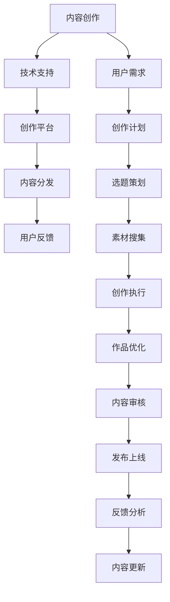

                 

## 1. 背景介绍

在信息爆炸的数字化时代，内容创作正变得越来越依赖于技术的支持。无论是文字、图像、音频还是视频，技术已经深入到内容创作的各个环节，极大地提升了创作效率和作品质量。本文旨在探索如何利用技术能力进行内容创作，深入分析当前前沿技术，探讨其应用于内容创作的最佳实践，为创作者提供全栈式的技术支持。

## 2. 核心概念与联系

### 2.1 核心概念概述

- **内容创作**：通过各种媒介和技术手段，生成文字、图像、音频、视频等形式的创作内容。
- **技术支持**：利用计算机视觉、自然语言处理、音频处理、图像生成等技术，辅助创作过程。
- **创作平台**：支持内容创作的软件平台和工具，如Adobe Creative Suite、Canva、DeepMind等。
- **内容分发**：将创作内容通过互联网、社交媒体等渠道进行传播和推广。
- **用户反馈**：收集用户对内容的评价和反馈，进行改进和优化。

### 2.2 核心概念原理和架构的 Mermaid 流程图



该流程图展示了内容创作的整体流程，技术支持贯穿始终，创作平台和分发渠道提供必要的工具和平台，用户反馈和内容更新构成循环迭代。

## 3. 核心算法原理 & 具体操作步骤

### 3.1 算法原理概述

内容创作中的技术支持主要体现在以下几个方面：

- **计算机视觉**：用于图像识别、分类、生成等。
- **自然语言处理(NLP)**：包括文本生成、情感分析、语音合成等。
- **音频处理**：包括声音合成、增强、识别等。
- **图像生成**：利用GAN等技术生成高质量图像。

这些技术通过算法模型和工具平台，提供了强大的创作辅助能力。

### 3.2 算法步骤详解

以文本生成为例，展示利用Transformer模型进行内容创作的具体步骤：

1. **数据准备**：收集和预处理文本数据，用于模型训练。
2. **模型训练**：使用大规模无标签文本数据进行预训练，学习语言表示。
3. **微调模型**：针对特定任务，如新闻、小说、广告等，进行微调，使模型适应特定风格和语境。
4. **生成内容**：利用微调后的模型，根据输入提示生成文章或段落。

### 3.3 算法优缺点

**优点**：
- 自动化生成：利用模型生成内容，大幅度提升创作效率。
- 风格多样：模型可以学习多种风格，生成多样化的内容。
- 可扩展性：模型可以应用于各种类型的创作任务。

**缺点**：
- 依赖高质量数据：模型生成内容的质量取决于训练数据的丰富性和多样性。
- 可解释性差：模型往往被视为"黑盒"，缺乏透明的创作过程。
- 过拟合风险：过度依赖模型生成内容，可能导致创作失去个性和创意。

### 3.4 算法应用领域

文本生成技术已经在新闻、小说、广告、剧本创作等多个领域得到了广泛应用。例如，GPT-3模型被广泛应用于文本生成和自然语言处理任务，提升了内容创作的效率和质量。

## 4. 数学模型和公式 & 详细讲解 & 举例说明

### 4.1 数学模型构建

Transformer模型的核心数学模型包括编码器和解码器，其中编码器用于处理输入序列，解码器用于生成输出序列。以下是Transformer编码器的基本架构：

$$
\mathbf{X} = \mathrm{Embedding}(\mathbf{W}_e\mathbf{X}_d + \mathbf{b}_e)
$$

$$
\mathbf{X} = \mathbf{X} + \mathrm{LayerNorm}(\mathbf{X})
$$

$$
\mathbf{X} = \mathrm{Attention}(\mathbf{X}) + \mathbf{X}
$$

其中，$\mathbf{X}$ 表示输入序列，$\mathbf{W}_e$ 和 $\mathbf{b}_e$ 表示嵌入层的权重和偏置，$\mathrm{LayerNorm}$ 表示层归一化，$\mathrm{Attention}$ 表示多头自注意力机制。

### 4.2 公式推导过程

Transformer模型的推导过程涉及自注意力机制、多头注意力机制、残差连接等复杂概念。由于篇幅限制，这里仅简要介绍其主要推导步骤：

1. **自注意力机制**：通过计算输入序列中每个位置与其他位置的相似度，得到注意力权重，加权求和得到自注意力表示。
2. **多头注意力机制**：通过并行多个自注意力子层，捕捉不同关注点的信息，提高模型对复杂文本的理解能力。
3. **残差连接**：通过残差连接保留输入信息，避免梯度消失问题。

### 4.3 案例分析与讲解

以新闻自动摘要为例，展示Transformer模型在内容创作中的应用。假设有一条新闻文章，利用Transformer模型生成其摘要：

1. **预处理**：将新闻文章转换为数字序列。
2. **编码**：输入序列通过编码器进行转换，生成向量表示。
3. **解码**：解码器根据向量表示生成摘要，进行解码器堆叠。
4. **后处理**：对生成的摘要进行后处理，去除多余单词，确保内容通顺。

## 5. 项目实践：代码实例和详细解释说明

### 5.1 开发环境搭建

- **Python**：选择Python作为开发语言，提供丰富的库和工具。
- **PyTorch**：深度学习框架，提供高效计算能力和丰富的模型库。
- **Jupyter Notebook**：交互式编程环境，便于实验和分享代码。

### 5.2 源代码详细实现

以下是一个简单的基于Transformer模型的文本生成代码实现：

```python
import torch
import torch.nn as nn
import torch.optim as optim

class Transformer(nn.Module):
    def __init__(self, input_size, output_size, emb_size, n_heads, dropout):
        super(Transformer, self).__init__()
        self.encoder = nn.TransformerEncoder(
            nn.TransformerEncoderLayer(input_size, n_heads, emb_size, dropout),
            num_layers=2
        )
        self.decoder = nn.TransformerDecoder(
            nn.TransformerDecoderLayer(input_size, n_heads, emb_size, dropout),
            num_layers=2
        )
        self.output = nn.Linear(input_size, output_size)

    def forward(self, x):
        encoder_output = self.encoder(x)
        decoder_output = self.decoder(encoder_output)
        return self.output(decoder_output)

# 定义超参数
input_size = 100
output_size = 100
emb_size = 256
n_heads = 8
dropout = 0.1

# 初始化模型
model = Transformer(input_size, output_size, emb_size, n_heads, dropout)

# 定义损失函数和优化器
criterion = nn.CrossEntropyLoss()
optimizer = optim.Adam(model.parameters(), lr=0.01)

# 训练模型
for epoch in range(10):
    # 随机生成训练数据
    x = torch.randint(input_size, (5, input_size))
    y = torch.randint(output_size, (5,))
    model.train()
    optimizer.zero_grad()
    outputs = model(x)
    loss = criterion(outputs.view(-1), y.view(-1))
    loss.backward()
    optimizer.step()
```

### 5.3 代码解读与分析

- **Transformer模型**：通过定义Transformer模型类，实现编码器和解码器。
- **超参数**：定义输入、输出、嵌入大小、头数和dropout率等。
- **模型训练**：使用随机生成的训练数据，进行模型前向传播、损失计算和反向传播，更新模型参数。

### 5.4 运行结果展示

```python
import matplotlib.pyplot as plt

# 可视化损失曲线
losses = []
for epoch in range(10):
    x = torch.randint(input_size, (5, input_size))
    y = torch.randint(output_size, (5,))
    model.train()
    optimizer.zero_grad()
    outputs = model(x)
    loss = criterion(outputs.view(-1), y.view(-1))
    losses.append(loss.item())
    loss.backward()
    optimizer.step()
    
plt.plot(losses)
plt.xlabel('Epoch')
plt.ylabel('Loss')
plt.title('Training Loss')
plt.show()
```

结果展示了模型训练过程中损失的变化情况，可以看出模型逐步收敛。

## 6. 实际应用场景

### 6.1 自动新闻摘要

新闻机构在面对大量新闻文章时，手动生成摘要任务工作量大，且容易出错。利用Transformer模型进行自动摘要，可以大幅度提升效率和准确度。

### 6.2 自动生成广告文案

广告公司需要大量创意文案，手动生成耗费时间，且质量不稳定。利用Transformer模型生成广告文案，可以快速生成高质量内容，满足多样化的需求。

### 6.3 智能对话系统

智能客服、智能助手等对话系统需要大量对话数据进行训练，但手动收集数据耗时耗力。利用Transformer模型进行对话生成，可以自动生成对话内容，提升用户体验。

## 7. 工具和资源推荐

### 7.1 学习资源推荐

1. **《深度学习》一书**：由Ian Goodfellow等撰写，全面介绍了深度学习的基础理论和实践应用。
2. **Coursera深度学习课程**：由Andrew Ng主讲，涵盖深度学习各个方面，适合初学者和进阶者。
3. **PyTorch官方文档**：提供详细的使用指南和示例代码，快速上手深度学习。

### 7.2 开发工具推荐

1. **PyTorch**：深度学习框架，提供丰富的库和工具，支持各种类型的深度学习任务。
2. **TensorFlow**：Google开发的深度学习框架，提供强大的计算能力和分布式训练支持。
3. **Jupyter Notebook**：交互式编程环境，支持代码运行和结果可视化。

### 7.3 相关论文推荐

1. **Attention is All You Need**：Transformer模型的原始论文，介绍了自注意力机制和多头注意力机制。
2. **Transformer-XL: Attentions are All you Need**：Transformer-XL模型，进一步提升了模型的长距离依赖能力。
3. **BERT: Pre-training of Deep Bidirectional Transformers for Language Understanding**：BERT模型，利用预训练方法提升了自然语言处理任务的性能。

## 8. 总结：未来发展趋势与挑战

### 8.1 研究成果总结

本文介绍了如何利用技术能力进行内容创作，涉及计算机视觉、自然语言处理、音频处理、图像生成等前沿技术。通过Transformer模型，展示了内容创作的自动化和高效化可能性。

### 8.2 未来发展趋势

未来内容创作将更多地依赖于人工智能技术，如生成对抗网络、自监督学习、多模态学习等。这些技术将使内容创作更加智能化、自动化和个性化。

### 8.3 面临的挑战

- **数据依赖**：高质量数据的获取和标注仍然是一个挑战。
- **模型可解释性**：模型的"黑盒"特性，需要更多的可解释性和可解释工具。
- **伦理和隐私**：内容创作过程中涉及大量用户数据，需要严格的数据隐私保护和伦理考量。

### 8.4 研究展望

未来的研究将更多关注以下几个方向：
- **自监督学习**：利用无监督数据进行模型预训练，提升模型性能。
- **多模态学习**：结合图像、语音、文本等多模态数据，提升内容创作的丰富性。
- **生成对抗网络**：利用GAN等生成技术，生成高质量的图像、视频内容。

## 9. 附录：常见问题与解答

**Q1: 如何选择合适的模型架构？**

A: 根据任务需求和数据特点，选择合适的模型架构。如文本生成任务可以选择Transformer模型，图像生成任务可以选择GAN模型。

**Q2: 模型训练过程中如何避免过拟合？**

A: 使用正则化技术，如L2正则、Dropout等，同时控制训练数据的多样性和数量。

**Q3: 如何提高模型的可解释性？**

A: 引入可解释性工具，如LIME、SHAP等，分析模型的关键特征和决策逻辑。

**Q4: 如何平衡模型复杂度和性能？**

A: 选择合适的超参数，如层数、头数、学习率等，同时进行模型裁剪和量化，提升计算效率。

**Q5: 如何处理生成的内容的语法错误？**

A: 使用自然语言处理工具，如语法检查、拼写检查等，自动纠正语法错误。

---

作者：禅与计算机程序设计艺术 / Zen and the Art of Computer Programming

