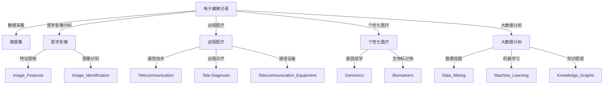

                 

## 1. 背景介绍

随着数字医疗的兴起，技术创新在医疗领域的应用日益深入。从电子健康记录(EHR)到医疗影像分析，从远程医疗到个性化治疗，技术创新正逐步重塑医疗行业的方方面面。医疗科技不仅提高了医疗服务的效率和质量，更在个性化医疗、精准医疗、远程医疗等前沿方向上取得了显著进展。本章节将详细探讨如何利用技术能力进行医疗科技创新，为读者揭示医疗领域技术应用的核心要义。

## 2. 核心概念与联系

### 2.1 核心概念概述

医疗科技创新的核心在于技术在医疗实践中的应用和优化。其主要涉及以下核心概念：

- **电子健康记录(Electronic Health Records, EHR)**：指通过电子方式记录和存储患者健康信息的系统。EHR可以帮助医生全面掌握患者历史，便于诊断和治疗。
- **医学影像分析**：通过图像识别、计算机视觉等技术，自动分析医学影像，辅助诊断如肿瘤、骨折等疾病。
- **远程医疗**：利用通信技术实现医生与患者间的远程诊疗，特别是在偏远和资源匮乏地区具有重要意义。
- **个性化医疗**：基于患者基因、病史等个性化数据，定制化治疗方案，实现精准医疗。
- **大数据分析**：通过数据挖掘、机器学习等手段，分析海量的医疗数据，发现疾病模式，提升诊疗效率和效果。

这些概念彼此关联，共同构成了医疗科技创新的技术基础。

### 2.2 核心概念原理和架构的 Mermaid 流程图



该图展示了医疗科技创新的技术架构，其中数据采集、医学影像、远程医疗、个性化医疗和大数据分析各自的关键技术和应用领域。

## 3. 核心算法原理 & 具体操作步骤

### 3.1 算法原理概述

医疗科技创新的算法技术主要围绕数据处理、模式识别、智能决策等方面展开。以下是几种核心算法及其应用：

- **数据预处理**：清洗和整理医疗数据，如缺失值处理、标准化处理等。
- **图像处理**：运用计算机视觉技术，对医学影像进行分割、特征提取、标注等处理。
- **自然语言处理(NLP)**：利用NLP技术，分析医疗文本，如病历记录、医学文献等。
- **机器学习和深度学习**：通过模型训练，发现数据中的模式和规律，用于疾病预测、诊断和治疗方案推荐等。
- **知识图谱**：构建知识图谱，利用图神经网络等技术，从结构化数据中提取知识，提升诊疗的准确性和效率。

### 3.2 算法步骤详解

#### 数据预处理

1. **数据采集**：从EHR、医学影像、电子病历等来源收集数据，确保数据的完整性和准确性。
2. **数据清洗**：删除重复数据、处理缺失值、标准化数据格式等。
3. **数据标注**：为数据添加标签，如疾病的诊断、病历的描述等。

#### 图像处理

1. **图像获取**：通过CT、MRI、X光等设备获取医学影像。
2. **图像预处理**：进行去噪、归一化、增强等处理，确保图像质量。
3. **特征提取**：使用CNN等模型提取图像中的关键特征。
4. **标注和验证**：对提取的特征进行标注，如肿瘤的边界、病灶的位置等，并使用验证集评估模型效果。

#### 自然语言处理

1. **文本获取**：从病历记录、医学文献中提取文本。
2. **文本清洗**：去除无关信息、进行分词、去除停用词等。
3. **实体识别**：识别文本中的实体，如疾病、药物等。
4. **关系提取**：利用NLP技术提取实体之间的关系，如病因、症状等。

#### 机器学习和深度学习

1. **模型选择**：选择合适的算法和模型，如SVM、决策树、RNN等。
2. **特征工程**：选择或构造合适的特征，进行特征选择和特征工程。
3. **模型训练**：使用训练数据训练模型，优化超参数。
4. **模型评估**：使用验证集评估模型性能，如准确率、召回率、F1-score等。

#### 知识图谱

1. **数据收集**：收集医疗领域的知识库和数据库。
2. **知识抽取**：从非结构化数据中抽取实体和关系。
3. **知识融合**：将不同来源的知识进行整合，构建知识图谱。
4. **知识推理**：利用图神经网络等技术，推理知识图谱中的关系和规律。

### 3.3 算法优缺点

#### 数据预处理

- **优点**：保证数据的清洁度和一致性，减少模型过拟合风险。
- **缺点**：数据清洗和标注工作量大，对专家依赖性强。

#### 图像处理

- **优点**：能够自动分析医学影像，减少人工劳动，提高诊断效率。
- **缺点**：需要高质量的医学影像数据，对于低质量影像效果不佳。

#### 自然语言处理

- **优点**：能够从文本数据中提取有价值的信息，支持大规模数据处理。
- **缺点**：对文本数据的质量和格式要求高，处理速度较慢。

#### 机器学习和深度学习

- **优点**：能够从数据中学习规律和模式，适用于各种数据类型和规模。
- **缺点**：需要大量的数据和计算资源，模型复杂度较高，不易解释。

#### 知识图谱

- **优点**：能够整合和利用结构化知识，提升诊疗的准确性和效率。
- **缺点**：知识抽取和融合工作量大，需要领域专家参与，构建难度高。

### 3.4 算法应用领域

这些算法技术在医疗科技创新的各个领域都有广泛应用，具体如下：

- **电子健康记录**：数据预处理和清洗技术，确保EHR系统的数据质量。
- **医学影像分析**：图像处理和特征提取技术，支持自动化的影像诊断。
- **远程医疗**：自然语言处理技术，实现医生与患者的远程沟通和诊疗。
- **个性化医疗**：机器学习和大数据技术，提供个性化的治疗方案。
- **大数据分析**：知识图谱和图神经网络技术，提升医疗数据的分析和利用。

## 4. 数学模型和公式 & 详细讲解 & 举例说明

### 4.1 数学模型构建

医疗科技创新的数学模型主要围绕统计学、机器学习和深度学习等方法展开。以下以医疗影像分析中的图像分割为例，构建数学模型。

**问题描述**：将CT影像中的肿瘤区域分割出来，以便辅助诊断。

**输入**：CT影像 $I$，大小为 $m \times n$。

**输出**：肿瘤区域的像素标记矩阵 $M$，大小也为 $m \times n$，标记为1表示像素属于肿瘤区域，标记为0表示不属于。

**目标**：最小化交叉熵损失函数，使模型预测的概率分布与真实标签分布一致。

### 4.2 公式推导过程

#### 交叉熵损失函数

设模型预测的概率分布为 $\hat{y}$，真实标签为 $y$，交叉熵损失函数为：

$$
\mathcal{L}(\hat{y}, y) = -\sum_{i=1}^{mn} y_i \log \hat{y}_i
$$

其中，$y_i$ 表示像素 $(i,j)$ 是否属于肿瘤区域，$\hat{y}_i$ 表示模型预测该像素属于肿瘤区域的概率。

#### 随机梯度下降

设学习率为 $\eta$，迭代次数为 $K$，则随机梯度下降算法为：

$$
\theta \leftarrow \theta - \eta \frac{\partial \mathcal{L}(\hat{y}, y)}{\partial \theta}
$$

其中，$\frac{\partial \mathcal{L}(\hat{y}, y)}{\partial \theta}$ 表示损失函数对模型参数 $\theta$ 的梯度，可以通过反向传播算法计算。

### 4.3 案例分析与讲解

**案例：医学影像分割**

1. **数据准备**：收集包含肿瘤的CT影像，进行标注，生成标注矩阵 $y$。
2. **模型选择**：选择U-Net网络，进行特征提取和分割。
3. **模型训练**：使用随机梯度下降算法，最小化交叉熵损失函数。
4. **模型评估**：在验证集上评估模型性能，如Dice系数、IoU等。

## 5. 项目实践：代码实例和详细解释说明

### 5.1 开发环境搭建

#### Python环境

1. 安装Python 3.7及以上版本。
2. 安装NumPy、Pandas、Scikit-Learn、TensorFlow等依赖库。
3. 配置好开发环境，准备进行代码编写。

#### 开发工具

1. Jupyter Notebook：轻量级的开发工具，支持代码编写和运行。
2. PyCharm：功能强大的IDE，支持代码调试和版本控制。
3. Git：版本控制工具，方便代码管理和协作。

### 5.2 源代码详细实现

以下是一个基于U-Net网络的医学影像分割的代码示例：

```python
import tensorflow as tf
from tensorflow.keras.layers import Input, Conv2D, MaxPooling2D, UpSampling2D, concatenate
from tensorflow.keras.models import Model

def unet_model(input_size=(256, 256, 1)):
    inputs = Input(input_size)
    conv1 = Conv2D(64, 3, activation='relu', padding='same')(inputs)
    conv1 = Conv2D(64, 3, activation='relu', padding='same')(conv1)
    pool1 = MaxPooling2D(pool_size=(2, 2))(conv1)

    conv2 = Conv2D(128, 3, activation='relu', padding='same')(pool1)
    conv2 = Conv2D(128, 3, activation='relu', padding='same')(conv2)
    pool2 = MaxPooling2D(pool_size=(2, 2))(conv2)

    conv3 = Conv2D(256, 3, activation='relu', padding='same')(pool2)
    conv3 = Conv2D(256, 3, activation='relu', padding='same')(conv3)
    pool3 = MaxPooling2D(pool_size=(2, 2))(conv3)

    conv4 = Conv2D(512, 3, activation='relu', padding='same')(pool3)
    conv4 = Conv2D(512, 3, activation='relu', padding='same')(conv4)
    drop4 = Dropout(0.5)(conv4)
    pool4 = MaxPooling2D(pool_size=(2, 2))(drop4)

    conv5 = Conv2D(1024, 3, activation='relu', padding='same')(pool4)
    conv5 = Conv2D(1024, 3, activation='relu', padding='same')(conv5)
    drop5 = Dropout(0.5)(conv5)

    up6 = concatenate([UpSampling2D(size=(2, 2))(drop5), conv4], axis=-1)
    conv6 = Conv2D(512, 3, activation='relu', padding='same')(up6)
    conv6 = Conv2D(512, 3, activation='relu', padding='same')(conv6)

    up7 = concatenate([UpSampling2D(size=(2, 2))(conv6), conv3], axis=-1)
    conv7 = Conv2D(256, 3, activation='relu', padding='same')(up7)
    conv7 = Conv2D(256, 3, activation='relu', padding='same')(conv7)

    up8 = concatenate([UpSampling2D(size=(2, 2))(conv7), conv2], axis=-1)
    conv8 = Conv2D(128, 3, activation='relu', padding='same')(up8)
    conv8 = Conv2D(128, 3, activation='relu', padding='same')(conv8)

    up9 = concatenate([UpSampling2D(size=(2, 2))(conv8), conv1], axis=-1)
    conv9 = Conv2D(64, 3, activation='relu', padding='same')(up9)
    conv9 = Conv2D(64, 3, activation='relu', padding='same')(conv9)
    conv9 = Conv2D(1, 1, activation='sigmoid')(conv9)

    model = Model(inputs=[inputs], outputs=[conv9])

    model.compile(optimizer=tf.keras.optimizers.Adam(lr=0.001), loss='binary_crossentropy', metrics=['accuracy'])

    return model

# 构建模型
model = unet_model()

# 加载数据
train_data = ...
val_data = ...

# 训练模型
model.fit(train_data, epochs=10, validation_data=val_data)
```

### 5.3 代码解读与分析

- **输入层和卷积层**：输入层使用卷积层进行特征提取，每个卷积层后接池化层，减少特征维度，增强特征鲁棒性。
- **上采样层和拼接层**：通过上采样和拼接层，逐步恢复特征尺寸，最终生成分割结果。
- **输出层和激活函数**：输出层使用sigmoid激活函数，将输出映射到[0,1]之间，表示像素是否属于肿瘤区域。
- **损失函数和优化器**：使用交叉熵损失函数和Adam优化器，最小化预测结果和真实标签之间的差异。

### 5.4 运行结果展示

在验证集上评估模型性能，输出准确率和Dice系数等指标。

```python
val_loss, val_acc = model.evaluate(val_data)
print(f'Validation loss: {val_loss:.4f}')
print(f'Validation accuracy: {val_acc:.4f}')
```

## 6. 实际应用场景

### 6.1 电子健康记录(EHR)

**案例：患者数据分析**

1. **数据收集**：从医院和诊所收集患者的电子健康记录。
2. **数据预处理**：清洗数据，处理缺失值和异常值。
3. **数据分析**：使用机器学习模型分析患者的历史病历，发现疾病模式，提供个性化治疗方案。

### 6.2 医学影像分析

**案例：肿瘤诊断**

1. **数据准备**：收集包含肿瘤的医学影像。
2. **图像分割**：使用U-Net网络进行肿瘤区域分割。
3. **诊断辅助**：医生参考分割结果，辅助诊断肿瘤位置和大小。

### 6.3 远程医疗

**案例：医生咨询**

1. **数据收集**：收集患者病历和症状描述。
2. **自然语言处理**：使用NLP技术分析症状描述，提取关键信息。
3. **远程诊断**：医生根据提取的信息进行远程诊疗，提供治疗建议。

### 6.4 个性化医疗

**案例：治疗方案推荐**

1. **数据准备**：收集患者的基因数据和病历信息。
2. **数据分析**：使用机器学习模型分析患者数据，生成个性化治疗方案。
3. **治疗实施**：患者根据推荐方案进行治疗，医生监控疗效。

### 6.5 大数据分析

**案例：疾病趋势分析**

1. **数据收集**：收集海量的医疗数据。
2. **数据分析**：使用数据挖掘和机器学习技术分析数据，发现疾病趋势。
3. **预警和干预**：根据分析结果，预警潜在疾病爆发，采取干预措施。

## 7. 工具和资源推荐

### 7.1 学习资源推荐

1. **《深度学习》书籍**：Ian Goodfellow等著，深度学习领域的经典教材，涵盖基础理论和应用实践。
2. **Coursera课程**：Coursera平台上开设的深度学习和机器学习课程，由世界顶级大学和专家主讲。
3. **Kaggle竞赛**：Kaggle数据科学竞赛平台，提供海量医疗数据集，实践医疗科技创新的算法。

### 7.2 开发工具推荐

1. **PyTorch**：灵活的深度学习框架，支持GPU加速，适用于科研和工程应用。
2. **TensorFlow**：谷歌开发的深度学习框架，生产部署方便，适合大规模工程应用。
3. **Jupyter Notebook**：轻量级的开发工具，支持代码编写和运行。
4. **PyCharm**：功能强大的IDE，支持代码调试和版本控制。

### 7.3 相关论文推荐

1. **《深度学习》论文**：Yoshua Bengio等著，深度学习领域的奠基之作，深入浅出地介绍了深度学习的原理和应用。
2. **《医学影像分割的深度学习》论文**：Pawel Strzelczyk等著，介绍了深度学习在医学影像分割中的应用。
3. **《基于知识图谱的医疗数据挖掘》论文**：SungWon Yoon等著，介绍了知识图谱在医疗数据挖掘中的应用。

## 8. 总结：未来发展趋势与挑战

### 8.1 研究成果总结

本文详细探讨了利用技术能力进行医疗科技创新的方法和应用，主要包括以下几个方面：

- **数据预处理**：清洗和整理医疗数据，确保数据质量和一致性。
- **图像处理**：运用计算机视觉技术，自动分析医学影像，提高诊断效率。
- **自然语言处理**：利用NLP技术，分析医疗文本，提供丰富的诊疗信息。
- **机器学习和深度学习**：通过模型训练，发现数据中的模式和规律，提供个性化的治疗方案。
- **知识图谱**：构建知识图谱，提升诊疗的准确性和效率。

### 8.2 未来发展趋势

未来医疗科技创新的趋势主要包括以下几个方面：

- **人工智能和机器学习**：结合人工智能和机器学习技术，提升医疗诊断和治疗的精准度。
- **大数据和云计算**：利用大数据和云计算技术，分析海量医疗数据，发现疾病趋势，提供个性化的医疗方案。
- **远程医疗和智慧医疗**：利用远程医疗和智慧医疗技术，提升医疗服务的可及性和便利性。
- **个性化医疗和精准医疗**：结合基因组学和生物信息学技术，提供个性化和精准的治疗方案。
- **医疗机器人和智能设备**：利用医疗机器人和智能设备，提高医疗服务效率，降低医疗成本。

### 8.3 面临的挑战

医疗科技创新面临的主要挑战包括：

- **数据隐私和安全**：医疗数据涉及患者隐私，如何保护数据安全和隐私是一个重要问题。
- **模型复杂度和可解释性**：深度学习模型复杂度较高，难以解释，如何提高模型的可解释性和可信度是一个重要问题。
- **资源和计算成本**：大模型和大数据处理需要大量的计算资源，如何降低资源和计算成本是一个重要问题。
- **医疗伦理和合规性**：医疗科技创新需要遵循伦理和合规要求，如何在技术创新中兼顾伦理和合规是一个重要问题。

### 8.4 研究展望

未来的医疗科技创新需要在以下方面进行更深入的研究和探索：

- **隐私保护技术**：开发更加安全、高效的隐私保护技术，确保医疗数据的隐私和安全。
- **可解释性技术**：开发可解释的深度学习模型，提高模型的透明度和可信度。
- **资源优化技术**：开发更高效的计算资源优化技术，降低大模型和大数据处理的资源和计算成本。
- **伦理和合规技术**：研究如何遵循医疗伦理和合规要求，确保医疗科技创新的合规性和伦理性。

总之，医疗科技创新是大数据、人工智能和医疗领域深度融合的结果，未来需要在技术创新、数据隐私、伦理合规等方面进行全面的探索和研究，才能实现医疗科技创新的持续发展和应用落地。

## 9. 附录：常见问题与解答

**Q1: 医疗数据隐私和安全如何保障？**

A: 医疗数据隐私和安全保障主要通过以下措施：

- **数据加密**：使用加密技术保护数据的传输和存储。
- **访问控制**：采用严格的访问控制机制，限制对数据的访问。
- **匿名化处理**：对数据进行匿名化处理，去除敏感信息。
- **法律合规**：遵循相关的医疗数据保护法规，如HIPAA、GDPR等。

**Q2: 医疗数据质量如何保证？**

A: 医疗数据质量保证主要通过以下措施：

- **数据清洗**：清洗和去除重复、错误、缺失的数据。
- **数据标准化**：采用统一的数据格式和标准，保证数据的一致性和可比性。
- **数据标注**：对数据进行标注，保证数据的准确性和完整性。
- **质量评估**：定期对数据质量进行评估，及时发现和解决数据问题。

**Q3: 医疗数据如何转化为医疗知识？**

A: 医疗数据转化为医疗知识主要通过以下步骤：

- **数据收集**：收集和整理医疗数据。
- **数据预处理**：清洗和整理数据，处理缺失值和异常值。
- **特征工程**：选择和构造合适的特征，进行特征选择和特征工程。
- **模型训练**：使用机器学习和深度学习模型，训练和优化模型。
- **知识提取**：从模型中提取知识，形成医疗知识库。
- **知识应用**：将知识应用到实际的医疗实践中，提升诊疗效果。

**Q4: 如何实现医疗数据的有效利用？**

A: 实现医疗数据的有效利用主要通过以下步骤：

- **数据收集**：收集和整理医疗数据。
- **数据清洗**：清洗和整理数据，处理缺失值和异常值。
- **数据分析**：使用机器学习和深度学习技术，分析数据，发现疾病模式和规律。
- **知识提取**：从数据分析结果中提取知识，形成医疗知识库。
- **知识应用**：将知识应用到实际的医疗实践中，提升诊疗效果。

**Q5: 医疗数据的隐私保护和合规性如何处理？**

A: 医疗数据的隐私保护和合规性处理主要通过以下措施：

- **数据加密**：使用加密技术保护数据的传输和存储。
- **访问控制**：采用严格的访问控制机制，限制对数据的访问。
- **匿名化处理**：对数据进行匿名化处理，去除敏感信息。
- **法律合规**：遵循相关的医疗数据保护法规，如HIPAA、GDPR等。

---

作者：禅与计算机程序设计艺术 / Zen and the Art of Computer Programming

