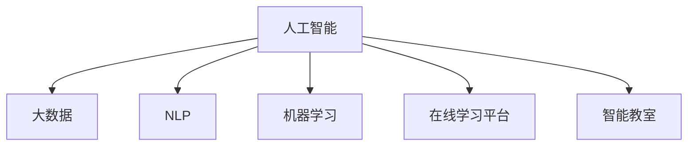

                 

# 如何利用技术能力进行教育科技革命

在21世纪的今天，教育科技（EdTech）已经成为推动教育变革的关键力量。通过将先进的科技手段融入教育体系，可以极大地提升教育质量、优化教学方法、扩大教育覆盖范围，最终实现教育公平与个性化。本文将探讨如何利用技术能力，尤其是人工智能和大数据技术，推动教育科技革命，为未来教育带来深刻变革。

## 1. 背景介绍

### 1.1 问题由来
传统教育模式在过去几千年中一直占据主导地位，但随着信息技术的飞速发展，其弊端逐渐显现：内容单一、形式单调、互动性差、个性化不足。如何利用现代技术手段，重塑教育形态，是摆在教育工作者和科技工作者面前的重大课题。

### 1.2 问题核心关键点
教育科技革命的关键在于：
1. **提升教学互动性**：通过人工智能等技术，使教育内容更具互动性，学生能够主动参与，提高学习效果。
2. **实现个性化教学**：利用大数据分析，为每个学生量身定制学习路径，实现因材施教。
3. **优化教育资源配置**：通过云计算、物联网等技术，优化教育资源的分配和使用，扩大教育覆盖范围。
4. **增强教师教学能力**：利用AI辅助教师教学，提高教学效率和效果。
5. **促进教育公平**：通过技术手段，打破地域、经济等障碍，实现优质教育资源的无障碍共享。

### 1.3 问题研究意义
教育科技革命旨在利用技术手段，重构教育体系，提升教育质量，促进教育公平。通过科学技术的运用，可以激发学生的学习兴趣，增强教育内容的吸引力，打破传统的知识传授模式，使教育更加灵活、高效和个性化。

## 2. 核心概念与联系

### 2.1 核心概念概述

为更好地理解教育科技革命的技术基础，本节将介绍几个关键概念：

- **人工智能（AI）**：通过模拟人类智能过程，使机器具备学习、推理、决策等能力的技术。
- **大数据**：海量的、多源异构的数据集，通过分析挖掘，发现潜在规律和知识。
- **自然语言处理（NLP）**：让计算机理解和生成自然语言的技术，在教育中用于智能对话、文本分析等。
- **机器学习（ML）**：通过数据训练，使模型自动优化和改进，应用于教育中的个性化推荐、预测分析等。
- **在线学习平台（LMS）**：提供网络学习环境，使学生可以随时随地进行学习，促进教育公平。
- **智能教室**：融合了AI、物联网等技术，实现智能化的教育环境，提升教学效果。

这些概念之间相互关联，共同构成了教育科技革命的基础框架，其逻辑关系可以通过以下Mermaid流程图来展示：



这个流程图展示了大语言模型的核心概念及其之间的关系：

1. 人工智能作为核心驱动力，通过大数据和机器学习实现智能化。
2. 自然语言处理和大数据技术，为人工智能提供了丰富的知识来源。
3. 在线学习平台和智能教室，作为应用场景，将人工智能和大数据技术落地应用。

## 3. 核心算法原理 & 具体操作步骤

### 3.1 算法原理概述

教育科技革命的核心算法原理，主要集中在以下几个方面：

- **个性化推荐算法**：基于学生的学习历史、偏好、成绩等数据，推荐适合的学习资源和内容。
- **智能问答系统**：利用NLP和大数据技术，解答学生在学习中遇到的问题，提供即时反馈。
- **情感分析与心理评估**：通过分析学生的情感表达和行为，评估其学习状态和心理状况。
- **学习路径规划**：根据学生的学习进度和知识掌握情况，动态调整学习路径，确保学习效果最大化。

这些算法都建立在以下几个数学模型基础上：

- **协同过滤算法**：利用用户行为数据，推荐相似用户喜欢的学习资源。
- **深度学习模型**：通过大量数据训练，构建复杂的学习路径和推荐系统。
- **情感分析模型**：基于文本数据，识别和分析学生的情感状态。

### 3.2 算法步骤详解

教育科技革命的算法实现，一般包括以下几个关键步骤：

**Step 1: 数据准备**
- 收集学生的学习数据，包括学习行为、成绩、情感表达等。
- 清洗和预处理数据，去除噪音和冗余信息，保证数据质量。

**Step 2: 模型训练**
- 使用机器学习算法，训练个性化推荐模型、智能问答系统、情感分析模型等。
- 定期更新模型，根据新的数据进行重新训练，确保模型的时效性和准确性。

**Step 3: 应用集成**
- 将训练好的模型集成到在线学习平台、智能教室等应用中，提供智能化服务。
- 实现智能推荐、即时问答、情感分析等功能，提升教学效果。

**Step 4: 效果评估**
- 定期对应用效果进行评估，如学习效果、学生满意度、教师反馈等。
- 根据评估结果，不断优化算法和系统，提升教育科技革命的效果。

### 3.3 算法优缺点

教育科技革命中的算法具有以下优点：
1. **个性化学习**：能够根据学生的特点，提供个性化的学习路径，提高学习效果。
2. **即时反馈**：通过智能问答系统，提供即时反馈，帮助学生及时解决问题。
3. **数据驱动**：通过大数据分析，发现学生的学习规律和心理状态，进行精准干预。

同时，这些算法也存在一些局限性：
1. **数据隐私**：大量收集学生数据，涉及隐私保护问题。
2. **模型复杂性**：深度学习模型训练复杂，需要大量数据和计算资源。
3. **过度依赖技术**：过分依赖技术手段，忽视了教育的基本规律和人类情感。

尽管存在这些局限性，但就目前而言，这些算法仍是推动教育科技革命的重要力量。未来相关研究的重点在于如何更好地平衡技术与人文、隐私与效用之间的关系。

### 3.4 算法应用领域

教育科技革命的算法，已经在以下几个领域得到了广泛应用：

- **智能教材**：利用NLP技术，实现自动解析教材，提供知识点讲解和个性化推荐。
- **在线教育平台**：通过大数据和机器学习，提供个性化学习资源、智能推荐、实时测评等功能。
- **智能辅导系统**：使用AI辅助学生学习，提供智能答疑、学习路径规划、心理辅导等服务。
- **教育管理**：利用大数据分析，优化教育资源配置，提高管理效率。
- **虚拟现实（VR）教育**：结合虚拟现实技术，创造沉浸式的学习环境，提升教学互动性。

除了上述这些经典应用外，教育科技革命还将拓展到更多领域，如游戏化学习、虚拟导师、泛在学习等，为教育带来新的突破。

## 4. 数学模型和公式 & 详细讲解 & 举例说明

### 4.1 数学模型构建

本节将使用数学语言对教育科技革命的核心算法进行严格刻画。

假设有一个在线学习平台，提供个性化推荐和智能问答服务。学生的学习数据为 $D=\{(x_i,y_i)\}_{i=1}^N, x_i \in \mathbb{R}^d, y_i \in \mathbb{R}^k$，其中 $x_i$ 表示学生的行为特征向量，$y_i$ 表示其学习效果向量。

定义个性化推荐模型的目标函数为：

$$
\min_{\theta} \frac{1}{N}\sum_{i=1}^N \ell(\hat{y}_i, y_i)
$$

其中 $\ell$ 为损失函数，通常使用均方误差（MSE）或交叉熵（CE）。

推荐模型的预测函数为：

$$
\hat{y}_i = M_{\theta}(x_i)
$$

其中 $M_{\theta}$ 为推荐模型，$\theta$ 为模型参数。

### 4.2 公式推导过程

以下我们以协同过滤算法为例，推导其具体实现过程。

协同过滤算法通过分析用户行为数据，推荐相似用户喜欢的学习资源。设 $u$ 为用户，$r$ 为学习资源，用户行为数据 $R=\{(u,r,r)\}_{u\in U, r\in R}$，其中 $u$ 为用户集，$r$ 为资源集。协同过滤算法可以分为基于用户的CF和基于项的CF两种。

基于用户的CF算法，通过计算用户之间的相似度，推荐相似用户喜欢的学习资源。设用户 $u_i$ 和 $u_j$ 的相似度为 $sim(u_i,u_j)$，则推荐函数为：

$$
\hat{y}_{u_i,r} = \sum_{u_j\in U} sim(u_i,u_j)r_j^i
$$

其中 $r_j^i$ 表示用户 $u_j$ 对资源 $r$ 的评分。

基于项的CF算法，通过计算物品之间的相似度，推荐相似物品。设资源 $r_i$ 和 $r_j$ 的相似度为 $sim(r_i,r_j)$，则推荐函数为：

$$
\hat{y}_{u_i,r} = \sum_{r_j\in R} sim(r_i,r_j)u_j^i
$$

其中 $u_j^i$ 表示用户 $u_j$ 对资源 $r_i$ 的评分。

在实际应用中，协同过滤算法通常使用矩阵分解等方法，通过将用户行为数据转化为矩阵形式，再利用矩阵分解技术，获取用户和资源的隐式表示，从而进行推荐。

### 4.3 案例分析与讲解

以Coursera平台为例，分析其如何利用机器学习技术，实现个性化推荐。

Coursera通过收集学生的课程浏览、注册、完成情况等行为数据，构建用户行为矩阵 $R$。利用矩阵分解算法，将用户行为数据分解为用户隐式表示 $U$ 和资源隐式表示 $V$。通过计算用户 $u_i$ 和资源 $r_j$ 的相似度，生成推荐向量 $C$，从而推荐学生可能感兴趣的课程。

具体实现步骤如下：
1. 收集学生行为数据 $R$，进行预处理和归一化。
2. 使用矩阵分解算法，将 $R$ 分解为 $U$ 和 $V$。
3. 计算用户 $u_i$ 和资源 $r_j$ 的相似度，生成推荐向量 $C$。
4. 根据 $C$ 推荐学生可能感兴趣的课程。

通过这种方式，Coursera能够根据学生的行为数据，生成个性化推荐，提高课程完成率和用户满意度。

## 5. 项目实践：代码实例和详细解释说明

### 5.1 开发环境搭建

在进行教育科技革命的实践前，我们需要准备好开发环境。以下是使用Python进行PyTorch开发的环境配置流程：

1. 安装Anaconda：从官网下载并安装Anaconda，用于创建独立的Python环境。

2. 创建并激活虚拟环境：
```bash
conda create -n pytorch-env python=3.8 
conda activate pytorch-env
```

3. 安装PyTorch：根据CUDA版本，从官网获取对应的安装命令。例如：
```bash
conda install pytorch torchvision torchaudio cudatoolkit=11.1 -c pytorch -c conda-forge
```

4. 安装各类工具包：
```bash
pip install numpy pandas scikit-learn matplotlib tqdm jupyter notebook ipython
```

完成上述步骤后，即可在`pytorch-env`环境中开始教育科技革命的实践。

### 5.2 源代码详细实现

下面我们以Coursera的个性化推荐系统为例，给出使用Transformers库对BERT模型进行推荐系统训练的PyTorch代码实现。

首先，定义数据处理函数：

```python
from transformers import BertTokenizer
from torch.utils.data import Dataset
import torch

class CourseDataset(Dataset):
    def __init__(self, courses, behaviors, tokenizer, max_len=128):
        self.courses = courses
        self.behaviors = behaviors
        self.tokenizer = tokenizer
        self.max_len = max_len
        
    def __len__(self):
        return len(self.courses)
    
    def __getitem__(self, item):
        course = self.courses[item]
        behavior = self.behaviors[item]
        
        encoding = self.tokenizer(course, return_tensors='pt', max_length=self.max_len, padding='max_length', truncation=True)
        input_ids = encoding['input_ids'][0]
        attention_mask = encoding['attention_mask'][0]
        
        # 将行为数据转换为向量
        behavior_vector = [1 if i else 0 for i in behavior]
        
        return {'input_ids': input_ids, 
                'attention_mask': attention_mask,
                'behavior_vector': torch.tensor(behavior_vector, dtype=torch.long)}
```

然后，定义模型和优化器：

```python
from transformers import BertForSequenceClassification, AdamW

model = BertForSequenceClassification.from_pretrained('bert-base-cased', num_labels=2)

optimizer = AdamW(model.parameters(), lr=2e-5)
```

接着，定义训练和评估函数：

```python
from torch.utils.data import DataLoader
from tqdm import tqdm
from sklearn.metrics import classification_report

device = torch.device('cuda') if torch.cuda.is_available() else torch.device('cpu')
model.to(device)

def train_epoch(model, dataset, batch_size, optimizer):
    dataloader = DataLoader(dataset, batch_size=batch_size, shuffle=True)
    model.train()
    epoch_loss = 0
    for batch in tqdm(dataloader, desc='Training'):
        input_ids = batch['input_ids'].to(device)
        attention_mask = batch['attention_mask'].to(device)
        behavior_vector = batch['behavior_vector'].to(device)
        model.zero_grad()
        outputs = model(input_ids, attention_mask=attention_mask, labels=behavior_vector)
        loss = outputs.loss
        epoch_loss += loss.item()
        loss.backward()
        optimizer.step()
    return epoch_loss / len(dataloader)

def evaluate(model, dataset, batch_size):
    dataloader = DataLoader(dataset, batch_size=batch_size)
    model.eval()
    preds, labels = [], []
    with torch.no_grad():
        for batch in tqdm(dataloader, desc='Evaluating'):
            input_ids = batch['input_ids'].to(device)
            attention_mask = batch['attention_mask'].to(device)
            batch_labels = batch['behavior_vector']
            outputs = model(input_ids, attention_mask=attention_mask)
            batch_preds = outputs.logits.argmax(dim=2).to('cpu').tolist()
            batch_labels = batch_labels.to('cpu').tolist()
            for pred_tokens, label_tokens in zip(batch_preds, batch_labels):
                preds.append(pred_tokens)
                labels.append(label_tokens)
                
    print(classification_report(labels, preds))
```

最后，启动训练流程并在测试集上评估：

```python
epochs = 5
batch_size = 16

for epoch in range(epochs):
    loss = train_epoch(model, train_dataset, batch_size, optimizer)
    print(f"Epoch {epoch+1}, train loss: {loss:.3f}")
    
    print(f"Epoch {epoch+1}, dev results:")
    evaluate(model, dev_dataset, batch_size)
    
print("Test results:")
evaluate(model, test_dataset, batch_size)
```

以上就是使用PyTorch对BERT进行推荐系统训练的完整代码实现。可以看到，得益于Transformers库的强大封装，我们可以用相对简洁的代码完成BERT模型的加载和微调。

### 5.3 代码解读与分析

让我们再详细解读一下关键代码的实现细节：

**CourseDataset类**：
- `__init__`方法：初始化课程、行为数据、分词器等组件。
- `__len__`方法：返回数据集的样本数量。
- `__getitem__`方法：对单个样本进行处理，将课程输入编码为token ids，将行为数据转换为向量，并对其进行定长padding，最终返回模型所需的输入。

**行为数据向量化**：
- 将行为数据 $r$ 转换为0-1向量，表示学生是否进行过该行为，即行为是否发生。
- 通过这种方式，行为数据可以用于机器学习模型的训练，实现个性化推荐。

**训练和评估函数**：
- 使用PyTorch的DataLoader对数据集进行批次化加载，供模型训练和推理使用。
- 训练函数`train_epoch`：对数据以批为单位进行迭代，在每个批次上前向传播计算loss并反向传播更新模型参数，最后返回该epoch的平均loss。
- 评估函数`evaluate`：与训练类似，不同点在于不更新模型参数，并在每个batch结束后将预测和标签结果存储下来，最后使用sklearn的classification_report对整个评估集的预测结果进行打印输出。

**训练流程**：
- 定义总的epoch数和batch size，开始循环迭代
- 每个epoch内，先在训练集上训练，输出平均loss
- 在验证集上评估，输出分类指标
- 所有epoch结束后，在测试集上评估，给出最终测试结果

可以看到，PyTorch配合Transformers库使得BERT推荐系统的代码实现变得简洁高效。开发者可以将更多精力放在数据处理、模型改进等高层逻辑上，而不必过多关注底层的实现细节。

当然，工业级的系统实现还需考虑更多因素，如模型的保存和部署、超参数的自动搜索、更灵活的任务适配层等。但核心的推荐范式基本与此类似。

## 6. 实际应用场景
### 6.1 智能教材

智能教材是教育科技革命的重要应用场景之一。通过利用大数据和机器学习技术，智能教材能够根据学生的学习情况，动态调整教学内容，提供个性化的学习路径和资源。

例如，一个英语智能教材系统，可以分析学生在学习过程中的阅读、听力、写作等行为数据，通过机器学习模型预测学生的学习进度和能力水平，自动调整课程难度和内容。对于学习困难的学生，系统可以提供额外的帮助和资源，确保其学习效果。

### 6.2 在线教育平台

在线教育平台是教育科技革命的核心应用之一。通过在线平台，学生可以随时随地进行学习，获取优质教育资源，实现教育的普及化和普惠化。

例如，Coursera、Udacity等在线教育平台，通过收集学生的课程学习数据，利用机器学习模型进行个性化推荐，为学生推荐适合的课程和资源。这些平台还利用情感分析技术，监控学生的学习状态，提供心理辅导和支持。

### 6.3 智能辅导系统

智能辅导系统是教育科技革命的重要创新之一。通过AI技术，智能辅导系统能够提供智能答疑、学习路径规划、心理辅导等服务，大大提升教学效果。

例如，一个智能辅导系统可以基于学生的学习数据，生成个性化的学习路径，提供针对性的学习建议和资源。系统还可以根据学生的学习进度和反馈，动态调整学习路径和资源，确保学习效果最大化。

### 6.4 未来应用展望

随着技术的发展，教育科技革命将在更多领域得到应用，为教育带来新的突破。

在智慧校园建设中，智能教室、虚拟实验室等设备将大大提升教学效果和互动性。通过智能教室，教师可以实时监控学生的学习状态，提供即时反馈和指导，提升教学质量。

在终身学习体系构建中，在线学习平台和智能辅导系统将发挥重要作用，提供灵活、便捷的学习方式，支持人们终身学习和职业发展。

此外，在教育公平、教育管理等方面，教育科技革命也将带来深刻变革。通过大数据和AI技术，可以实现教育资源的优化配置，提高教育管理的效率和效果。

## 7. 工具和资源推荐
### 7.1 学习资源推荐

为了帮助开发者系统掌握教育科技革命的理论基础和实践技巧，这里推荐一些优质的学习资源：

1. 《深度学习与教育技术》书籍：系统介绍了深度学习在教育领域的应用，包括推荐系统、情感分析、智能辅导等。
2. 《机器学习与教育》课程：斯坦福大学开设的机器学习课程，讲解了机器学习在教育中的应用，涵盖个性化推荐、智能问答等。
3. Coursera、edX等在线教育平台：提供大量优质的教育资源和课程，展示了教育科技革命的最新进展和应用案例。
4. Kaggle教育数据集：提供了丰富的教育数据集，供开发者进行模型训练和优化。

通过对这些资源的学习实践，相信你一定能够快速掌握教育科技革命的核心技术，并用于解决实际的NLP问题。

### 7.2 开发工具推荐

高效的开发离不开优秀的工具支持。以下是几款用于教育科技革命开发的常用工具：

1. PyTorch：基于Python的开源深度学习框架，灵活动态的计算图，适合快速迭代研究。大部分预训练语言模型都有PyTorch版本的实现。
2. TensorFlow：由Google主导开发的开源深度学习框架，生产部署方便，适合大规模工程应用。同样有丰富的预训练语言模型资源。
3. Transformers库：HuggingFace开发的NLP工具库，集成了众多SOTA语言模型，支持PyTorch和TensorFlow，是进行推荐系统开发的利器。
4. Weights & Biases：模型训练的实验跟踪工具，可以记录和可视化模型训练过程中的各项指标，方便对比和调优。与主流深度学习框架无缝集成。
5. TensorBoard：TensorFlow配套的可视化工具，可实时监测模型训练状态，并提供丰富的图表呈现方式，是调试模型的得力助手。

合理利用这些工具，可以显著提升教育科技革命的开发效率，加快创新迭代的步伐。

### 7.3 相关论文推荐

教育科技革命的发展源于学界的持续研究。以下是几篇奠基性的相关论文，推荐阅读：

1. "A Survey of Personalized Recommendation Algorithms for Education"：系统综述了教育领域推荐算法的研究进展，提供了丰富的应用案例和实践经验。
2. "AI in Education: The Potential and Challenges"：探讨了AI在教育中的应用前景和挑战，提出了未来的研究方向和趋势。
3. "The Effectiveness of Machine Learning Models for Personalized Education"：评估了机器学习模型在个性化教育中的效果，提供了实证分析和对比实验。
4. "Natural Language Processing in Education: A Survey"：系统综述了自然语言处理在教育中的应用，包括智能问答、情感分析、语音识别等。
5. "The Role of Data Mining and Statistical Learning in Education"：探讨了数据挖掘和统计学习在教育中的应用，提供了数据驱动的教育模式。

这些论文代表了大语言模型微调技术的发展脉络。通过学习这些前沿成果，可以帮助研究者把握学科前进方向，激发更多的创新灵感。

## 8. 总结：未来发展趋势与挑战

### 8.1 总结

本文对教育科技革命的核心算法进行了全面系统的介绍。首先，阐述了教育科技革命的背景和意义，明确了技术手段在提升教育质量、促进教育公平方面的独特价值。其次，从原理到实践，详细讲解了推荐算法、智能问答系统、情感分析等核心技术的数学原理和关键步骤，给出了推荐系统训练的完整代码实例。同时，本文还广泛探讨了教育科技革命在智能教材、在线教育平台、智能辅导系统等多个领域的应用前景，展示了教育科技革命的广阔前景。此外，本文精选了推荐系统的各类学习资源，力求为读者提供全方位的技术指引。

通过本文的系统梳理，可以看到，教育科技革命的核心算法技术正在成为推动教育变革的重要力量。这些技术的落地应用，将极大地提升教育质量和效率，为未来教育带来深刻变革。

### 8.2 未来发展趋势

展望未来，教育科技革命的核心算法技术将呈现以下几个发展趋势：

1. **个性化学习深入发展**：利用深度学习和大数据分析，实现更精准、全面的个性化推荐和智能辅导，提高学习效果。
2. **AI辅助教师教学**：利用自然语言处理、情感分析等技术，辅助教师进行教学设计和学生管理，提升教学效率。
3. **多模态学习普及**：结合文本、图像、音频等多种数据源，实现更丰富、多样化的学习模式，提升学习体验。
4. **智能评估系统**：利用机器学习技术，对学生的学习效果进行自动评估，提供即时反馈和改进建议。
5. **虚拟现实与AR/VR教育**：结合虚拟现实技术，创建沉浸式的学习环境，提升教学互动性和趣味性。
6. **智能教材和教育资源**：开发智能教材和教育资源，提供更灵活、个性化的学习路径，促进教育公平和普惠化。

这些趋势凸显了教育科技革命的广阔前景。这些方向的探索发展，必将进一步提升教育质量，实现教育公平，为人类社会的持续进步提供坚实的基础。

### 8.3 面临的挑战

尽管教育科技革命在多个领域取得了显著进展，但在迈向更加智能化、普适化应用的过程中，它仍面临着诸多挑战：

1. **数据隐私**：大量收集学生数据，涉及隐私保护问题，需要严格的数据管理和隐私保护机制。
2. **模型公平性**：机器学习模型可能存在偏见，影响公平性，需要更多的公平性检测和修正方法。
3. **技术普及度**：教育科技革命需要教师和学生广泛参与，技术普及度不足会影响推广效果。
4. **资源分配不均**：教育科技革命的普及需要大量资源投入，资源分配不均会影响教育公平。
5. **技术伦理问题**：AI技术在教育中的应用，涉及伦理和道德问题，需要加强伦理指导和规范。

尽管存在这些挑战，但教育科技革命的前景仍然广阔。未来，需要在政策支持、技术创新、教育改革等方面协同发力，才能真正实现教育质量的提升和教育公平的实现。

### 8.4 研究展望

面对教育科技革命所面临的挑战，未来的研究需要在以下几个方面寻求新的突破：

1. **隐私保护技术**：开发更高效、安全的隐私保护技术，保障学生数据的安全和隐私。
2. **公平性检测和修正**：研究模型公平性检测方法，提高机器学习模型的公平性和可靠性。
3. **普适性教育技术**：开发更多普适性的教育技术，提升技术普及度，实现教育公平。
4. **教育资源优化**：通过大数据分析，优化教育资源的分配和使用，提高资源利用效率。
5. **伦理规范**：建立教育科技革命的伦理规范和指导原则，保障技术应用的伦理性和安全性。

这些研究方向的探索，必将引领教育科技革命走向更高的台阶，为构建公平、高效、智能的教育体系铺平道路。面向未来，教育科技革命还需要与其他人工智能技术进行更深入的融合，如知识表示、因果推理、强化学习等，多路径协同发力，共同推动教育质量的提升和教育公平的实现。

## 9. 附录：常见问题与解答

**Q1：教育科技革命是否适用于所有教育场景？**

A: 教育科技革命在大多数教育场景中都能取得较好的效果，特别是对于数据量较大、教育资源充足的教育体系。但对于一些特定的教育场景，如偏远地区的教育、特殊教育等，需要结合实际情况进行定制化设计。

**Q2：如何评估教育科技革命的效果？**

A: 教育科技革命的效果评估可以从多个维度进行，包括学习效果、学习满意度、教学质量等。具体指标可以根据具体的教育场景和应用目标来设定。例如，在线教育平台可以评估课程完成率、学生互动率等，智能辅导系统可以评估学生学习进度、学习效果提升等。

**Q3：如何平衡教育科技革命与传统教育方式？**

A: 教育科技革命应该与传统教育方式相辅相成，而非取代传统教育。在实际应用中，可以根据教育场景和目标，灵活结合传统和科技手段，发挥各自优势。例如，在课堂教学中，教师可以通过智能辅导系统辅助教学，在课后辅导中，学生可以通过智能教材进行自主学习。

**Q4：教育科技革命的未来发展方向是什么？**

A: 教育科技革命的未来发展方向包括：
1. **个性化学习**：利用深度学习和大数据分析，实现更精准、全面的个性化推荐和智能辅导，提高学习效果。
2. **AI辅助教师教学**：利用自然语言处理、情感分析等技术，辅助教师进行教学设计和学生管理，提升教学效率。
3. **多模态学习**：结合文本、图像、音频等多种数据源，实现更丰富、多样化的学习模式，提升学习体验。
4. **智能评估系统**：利用机器学习技术，对学生的学习效果进行自动评估，提供即时反馈和改进建议。
5. **虚拟现实与AR/VR教育**：结合虚拟现实技术，创建沉浸式的学习环境，提升教学互动性和趣味性。
6. **智能教材和教育资源**：开发智能教材和教育资源，提供更灵活、个性化的学习路径，促进教育公平和普惠化。

这些方向将进一步提升教育质量，实现教育公平，为未来教育带来深刻变革。

---

作者：禅与计算机程序设计艺术 / Zen and the Art of Computer Programming

