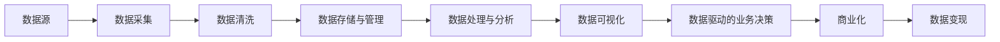

                 

# 如何利用技术能力进行数据变现

> 关键词：数据变现, 数据驱动, 数据智能, 商业化, 大数据, 人工智能, 机器学习, 数据科学, 数据工程, 技术变现

## 1. 背景介绍

在当今数字化转型的大背景下，数据已成为企业的核心资产，日益成为企业竞争的关键因素。然而，数据资源的价值往往难以直观体现，未能有效利用数据的企业在激烈的市场竞争中往往处于劣势。如何充分发挥数据的潜能，实现数据变现，成为众多企业追求的共同目标。本文将从技术角度出发，深入探讨如何通过技术手段，将数据转化为企业的实际商业价值，实现数据变现。

### 1.1 数据变现的重要性和必要性

在数字经济时代，数据已经成为了一种新型资产。但数据本身并不能直接创造价值，只有经过数据处理和分析，将其转化为有价值的信息和知识，才能实现数据的商业化。数据变现不仅能够带来直接的经济收益，还能通过数据洞察和预测，辅助企业制定精准的业务决策，驱动企业持续增长。

### 1.2 技术能力在数据变现中的角色

技术能力在数据变现中扮演着至关重要的角色。数据源的选择、数据采集与清洗、数据存储与管理、数据处理与分析、数据可视化与报告、数据驱动的业务决策等，每一个环节都需要先进的技术手段和工具支持。没有技术能力的支撑，数据变现就如同无源之水，无法实现。

### 1.3 本文的结构安排

本文将从以下几个方面进行深入探讨：
1. 背景介绍：介绍数据变现的重要性及技术能力的关键作用。
2. 核心概念与联系：阐述数据变现过程中涉及的核心概念和技术。
3. 核心算法原理与操作步骤：分析数据变现的关键算法原理与步骤。
4. 数学模型和公式：提供数据变现的数学模型和公式推导。
5. 项目实践：通过具体的代码实例展示数据变现的实现。
6. 实际应用场景：分析数据变现在多个实际场景中的应用。
7. 工具和资源推荐：推荐一些实用的学习资源、开发工具和相关论文。
8. 总结：总结数据变现的未来发展趋势与挑战，并提出研究展望。
9. 附录：回答关于数据变现的常见问题。

## 2. 核心概念与联系

### 2.1 核心概念概述

为了更好地理解数据变现的过程，首先需要明确一些核心概念及其相互联系。

- **数据变现**：指将数据资源转化为可量化的商业价值的过程，包括数据收集、清洗、分析、应用等环节。
- **数据智能**：通过先进的技术手段，对数据进行高效处理和智能分析，从而获取有价值的信息和知识。
- **商业化**：将数据智能应用于具体的业务场景，转化为实际的商业模式和利润点。
- **大数据**：指存储规模大、类型多、速度快的非结构化数据集合。
- **人工智能**：通过机器学习、深度学习等技术，使机器能够模拟人类的智能行为。
- **机器学习**：指让机器从数据中自动学习规律和模式，并应用于决策和预测。
- **数据科学**：研究数据收集、处理、分析、建模等技术，以支持数据驱动的决策。
- **数据工程**：通过设计和实现数据管道，支持数据的自动收集、清洗、存储、处理和分析。

这些概念之间的联系可以通过以下Mermaid流程图进行展示：



这个流程图展示了数据变现的主要流程：从数据源开始，经过数据采集、清洗、存储与管理、处理与分析、可视化、业务决策，最终实现数据的商业化应用。

## 3. 核心算法原理 & 具体操作步骤

### 3.1 算法原理概述

数据变现的核心在于通过数据处理和分析，提取有用的信息和知识，并应用于具体的商业场景。其算法原理可以概括为以下几个步骤：

1. **数据采集**：从不同的数据源中收集原始数据。
2. **数据清洗**：对原始数据进行清洗，去除噪声和错误，保证数据质量。
3. **数据存储与管理**：建立数据仓库和数据湖，对数据进行管理和优化，确保数据的安全性和可访问性。
4. **数据处理与分析**：通过数据挖掘、机器学习、深度学习等技术，对数据进行分析和建模，提取有用的信息和知识。
5. **数据可视化**：将分析结果通过图表、仪表盘等形式进行可视化展示，便于理解和决策。
6. **数据驱动的业务决策**：将分析结果应用于具体的业务决策，指导企业的运营和发展。
7. **商业化**：将数据驱动的决策转化为实际的商业模式和利润点，实现数据变现。

### 3.2 算法步骤详解

以下详细介绍数据变现的每一步具体操作方法：

#### 3.2.1 数据采集

数据采集是数据变现的第一步。数据源可以分为内部数据和外部数据。内部数据通常来自于企业的业务系统、客户关系管理系统（CRM）、操作数据存储（ODS）等，而外部数据则可能来自于社交媒体、公共数据集、第三方API等。

- **内部数据采集**：利用ETL工具，从企业内部的数据源中抽取数据，并存储到数据仓库中。
- **外部数据采集**：通过API接口、爬虫等方式，从外部数据源中收集数据，并整合到数据仓库中。

#### 3.2.2 数据清洗

数据清洗是保证数据质量的关键步骤。数据清洗包括去除重复数据、修正错误数据、处理缺失值等。

- **去除重复数据**：使用唯一性约束或散列函数，检测和删除重复记录。
- **修正错误数据**：通过规则匹配或异常检测，修正错误或异常的数据值。
- **处理缺失值**：通过插值、均值填补或删除等方式处理缺失数据。

#### 3.2.3 数据存储与管理

数据存储与管理是数据变现的基础设施。通过建立数据仓库和数据湖，对数据进行集中管理和优化，确保数据的可靠性和可用性。

- **数据仓库**：使用关系型数据库或分布式数据库，建立结构化数据的存储仓库。
- **数据湖**：使用分布式文件系统和数据湖技术，存储海量非结构化数据，如日志、文本、图片等。
- **数据管理**：建立元数据管理机制，对数据进行统一管理、可视化和治理。

#### 3.2.4 数据处理与分析

数据处理与分析是数据变现的核心环节。通过机器学习和深度学习等技术，对数据进行建模和分析，提取有用的信息和知识。

- **数据挖掘**：使用聚类、分类、关联规则等算法，从数据中挖掘潜在的模式和规律。
- **机器学习**：使用回归、分类、聚类、降维等算法，对数据进行建模和预测。
- **深度学习**：使用神经网络、卷积神经网络（CNN）、循环神经网络（RNN）等技术，进行复杂数据的处理和分析。

#### 3.2.5 数据可视化

数据可视化是将分析结果进行展示的重要步骤。通过图表、仪表盘等形式，直观展示数据的信息和知识，便于理解和决策。

- **图表展示**：使用折线图、柱状图、散点图等，展示数据的趋势、分布和关系。
- **仪表盘**：使用动态仪表盘，展示关键指标和关键绩效指标（KPI）的实时变化。

#### 3.2.6 数据驱动的业务决策

数据驱动的业务决策是将分析结果应用于具体业务决策的过程。通过数据驱动的决策，优化企业的运营和发展。

- **预测分析**：使用时间序列分析、预测模型等，对业务数据进行预测和预测。
- **运营优化**：通过数据驱动的运营决策，优化供应链管理、库存管理、客户关系管理等业务流程。
- **风险管理**：使用数据驱动的风险评估和预警机制，防范和应对潜在的风险。

#### 3.2.7 商业化

商业化是将数据驱动的决策转化为实际的商业模式和利润点的过程。通过数据变现，实现企业价值的最大化。

- **产品创新**：根据数据洞察，推出创新的产品和服务，满足市场需求。
- **营销优化**：通过数据驱动的营销决策，提升广告投放的精准性和效果。
- **成本控制**：通过数据分析和预测，优化成本结构，提升企业的竞争力。

### 3.3 算法优缺点

数据变现的算法具有以下优点：

1. **提升决策准确性**：通过数据驱动的决策，提高业务决策的科学性和准确性。
2. **优化运营效率**：通过数据分析和优化，提升企业的运营效率和盈利能力。
3. **降低运营风险**：通过数据驱动的风险管理，防范和应对潜在的风险。

同时，数据变现的算法也存在以下缺点：

1. **数据隐私和安全问题**：数据采集和处理过程中，可能涉及个人隐私和数据安全问题。
2. **数据质量和完整性问题**：数据采集和清洗过程中，可能存在数据质量不高等问题。
3. **技术成本较高**：数据采集、清洗、存储、分析和可视化等环节，需要投入大量的技术资源和人力。

### 3.4 算法应用领域

数据变现的算法可以应用于多个领域，如金融、医疗、零售、制造、物流等。以下简要介绍几个主要应用领域：

#### 3.4.1 金融领域

在金融领域，数据变现主要应用于风险管理、客户关系管理、投资决策等。

- **风险管理**：通过数据驱动的风险评估和预警机制，防范和应对潜在的金融风险。
- **客户关系管理**：通过数据分析和客户画像，提升客户关系管理和客户满意度。
- **投资决策**：通过数据分析和预测，优化投资组合和投资策略。

#### 3.4.2 医疗领域

在医疗领域，数据变现主要应用于疾病预测、治疗优化、患者管理等。

- **疾病预测**：通过数据分析和预测模型，预测患者的疾病风险和病情发展。
- **治疗优化**：通过数据分析和优化，提升医疗资源利用效率和治疗效果。
- **患者管理**：通过数据分析和患者画像，优化患者管理和健康管理。

#### 3.4.3 零售领域

在零售领域，数据变现主要应用于商品推荐、库存管理、客户分析等。

- **商品推荐**：通过数据分析和推荐算法，提升商品的推荐精准性和用户体验。
- **库存管理**：通过数据分析和预测，优化库存管理和供应链管理。
- **客户分析**：通过数据分析和客户画像，优化客户关系管理和客户满意度。

## 4. 数学模型和公式 & 详细讲解 & 举例说明

### 4.1 数学模型构建

为了更好地理解数据变现的算法原理，以下将提供一些关键数学模型和公式的构建。

#### 4.1.1 数据采集模型

数据采集模型主要涉及数据的抽取和整合。假设我们有n个数据源，每个数据源的抽取成本为Ci，采集到的数据量为Ni，则数据采集的总成本为：

$$ C_{total} = \sum_{i=1}^n C_i \times N_i $$

#### 4.1.2 数据清洗模型

数据清洗模型主要涉及数据的清洗和修正。假设我们有m个数据项，每个数据项的清洗成本为Mi，清洗后的数据质量为Qi，则数据清洗的总成本为：

$$ C_{clean} = \sum_{i=1}^m M_i \times Q_i $$

#### 4.1.3 数据存储与管理模型

数据存储与管理模型主要涉及数据仓库和数据湖的建立和管理。假设我们有k个数据仓库和数据湖，每个数据仓库和数据湖的存储和管理成本为Ki，数据存储容量为Si，则数据存储与管理的总成本为：

$$ C_{storage} = \sum_{i=1}^k K_i \times S_i $$

#### 4.1.4 数据处理与分析模型

数据处理与分析模型主要涉及数据的挖掘、建模和分析。假设我们有t个数据挖掘算法，每个算法的处理成本为Ti，处理后的数据质量为Qi，则数据处理与分析的总成本为：

$$ C_{processing} = \sum_{i=1}^t T_i \times Q_i $$

#### 4.1.5 数据可视化模型

数据可视化模型主要涉及数据的图表展示和仪表盘。假设我们有p个图表和仪表盘，每个图表和仪表盘的展示成本为Pi，展示效果为Fi，则数据可视化的总成本为：

$$ C_{visualization} = \sum_{i=1}^p P_i \times F_i $$

#### 4.1.6 数据驱动的业务决策模型

数据驱动的业务决策模型主要涉及数据的预测分析和运营优化。假设我们有q个预测模型，每个模型的预测成本为Qi，预测准确度为Pi，则预测分析的总成本为：

$$ C_{prediction} = \sum_{i=1}^q Q_i \times P_i $$

#### 4.1.7 商业化模型

商业化模型主要涉及数据的商业应用和收益。假设我们有r个商业应用场景，每个场景的收益为Ri，商业化成本为Ci，则商业化的总收益为：

$$ R_{total} = \sum_{i=1}^r R_i - \sum_{i=1}^r C_i $$

### 4.2 公式推导过程

以下详细介绍上述数学模型和公式的推导过程。

#### 4.2.1 数据采集模型推导

假设我们有n个数据源，每个数据源的抽取成本为Ci，采集到的数据量为Ni，则数据采集的总成本C_{total}为：

$$ C_{total} = \sum_{i=1}^n C_i \times N_i $$

其中，Ci为第i个数据源的抽取成本，Ni为第i个数据源采集到的数据量。

#### 4.2.2 数据清洗模型推导

假设我们有m个数据项，每个数据项的清洗成本为Mi，清洗后的数据质量为Qi，则数据清洗的总成本C_{clean}为：

$$ C_{clean} = \sum_{i=1}^m M_i \times Q_i $$

其中，Mi为第i个数据项的清洗成本，Qi为第i个数据项清洗后的数据质量。

#### 4.2.3 数据存储与管理模型推导

假设我们有k个数据仓库和数据湖，每个数据仓库和数据湖的存储和管理成本为Ki，数据存储容量为Si，则数据存储与管理的总成本C_{storage}为：

$$ C_{storage} = \sum_{i=1}^k K_i \times S_i $$

其中，Ki为第i个数据仓库和数据湖的存储和管理成本，Si为第i个数据仓库和数据湖的数据存储容量。

#### 4.2.4 数据处理与分析模型推导

假设我们有t个数据挖掘算法，每个算法的处理成本为Ti，处理后的数据质量为Qi，则数据处理与分析的总成本C_{processing}为：

$$ C_{processing} = \sum_{i=1}^t T_i \times Q_i $$

其中，Ti为第i个数据挖掘算法的处理成本，Qi为第i个数据挖掘算法处理后的数据质量。

#### 4.2.5 数据可视化模型推导

假设我们有p个图表和仪表盘，每个图表和仪表盘的展示成本为Pi，展示效果为Fi，则数据可视化的总成本C_{visualization}为：

$$ C_{visualization} = \sum_{i=1}^p P_i \times F_i $$

其中，Pi为第i个图表和仪表盘的展示成本，Fi为第i个图表和仪表盘的展示效果。

#### 4.2.6 数据驱动的业务决策模型推导

假设我们有q个预测模型，每个模型的预测成本为Qi，预测准确度为Pi，则数据驱动的业务决策的总成本C_{prediction}为：

$$ C_{prediction} = \sum_{i=1}^q Q_i \times P_i $$

其中，Qi为第i个预测模型的预测成本，Pi为第i个预测模型的预测准确度。

#### 4.2.7 商业化模型推导

假设我们有r个商业应用场景，每个场景的收益为Ri，商业化成本为Ci，则商业化的总收益R_{total}为：

$$ R_{total} = \sum_{i=1}^r R_i - \sum_{i=1}^r C_i $$

其中，Ri为第i个商业应用场景的收益，Ci为第i个商业应用场景的商业化成本。

### 4.3 案例分析与讲解

#### 4.3.1 案例一：金融领域

某银行使用数据变现技术，实现了风险管理和客户关系管理。具体步骤如下：

1. **数据采集**：从银行的内部系统、第三方数据提供商和社交媒体中采集数据。
2. **数据清洗**：对采集到的数据进行去重、修正和处理缺失值。
3. **数据存储与管理**：建立数据仓库和数据湖，对数据进行集中管理和优化。
4. **数据处理与分析**：使用机器学习算法，对客户行为进行建模和预测。
5. **数据可视化**：使用仪表盘展示客户风险评分和行为趋势。
6. **数据驱动的业务决策**：根据客户风险评分，优化客户信贷审批和风险管理。
7. **商业化**：通过信贷业务和风险管理业务的优化，增加银行的收入和利润。

#### 4.3.2 案例二：医疗领域

某医院使用数据变现技术，实现了疾病预测和治疗优化。具体步骤如下：

1. **数据采集**：从医院的电子病历、健康监测设备和公共数据集中采集数据。
2. **数据清洗**：对采集到的数据进行去重、修正和处理缺失值。
3. **数据存储与管理**：建立数据仓库和数据湖，对数据进行集中管理和优化。
4. **数据处理与分析**：使用深度学习算法，对患者疾病风险进行预测和建模。
5. **数据可视化**：使用仪表盘展示患者疾病风险和治疗效果。
6. **数据驱动的业务决策**：根据疾病预测结果，优化治疗方案和资源配置。
7. **商业化**：通过优化治疗效果和提高患者满意度，增加医院的收入和声誉。

## 5. 项目实践：代码实例和详细解释说明

### 5.1 开发环境搭建

在项目实践前，需要先搭建好开发环境。以下是Python环境搭建的详细步骤：

1. 安装Anaconda：从官网下载并安装Anaconda，用于创建独立的Python环境。

2. 创建并激活虚拟环境：
```bash
conda create -n dataeng-env python=3.8 
conda activate dataeng-env
```

3. 安装必要的包：
```bash
pip install numpy pandas matplotlib sklearn tqdm jupyter notebook
```

### 5.2 源代码详细实现

以下是一个简单的Python代码示例，展示了如何从数据源中采集、清洗和存储数据：

```python
import pandas as pd
import numpy as np
import matplotlib.pyplot as plt

# 数据采集
df = pd.read_csv('data.csv')

# 数据清洗
df = df.drop_duplicates()
df = df.dropna()

# 数据存储
df.to_csv('cleaned_data.csv', index=False)
```

### 5.3 代码解读与分析

这段代码实现了数据采集、清洗和存储的基本流程。

- **数据采集**：使用Pandas库的`read_csv`函数，从CSV文件中读取数据，存储到DataFrame对象`df`中。
- **数据清洗**：通过`drop_duplicates`函数去除重复行，通过`dropna`函数删除缺失值行。
- **数据存储**：使用`to_csv`函数将清洗后的数据保存为CSV文件。

## 6. 实际应用场景

### 6.1 案例一：金融领域

#### 6.1.1 数据采集与清洗

从银行内部系统、第三方数据提供商和社交媒体中采集数据，包括客户基本信息、交易记录、社交媒体行为等。

1. **数据采集**：
   - 银行内部系统：使用API接口，从CRM系统中获取客户基本信息和交易记录。
   - 第三方数据提供商：从公开的金融数据集、社交媒体平台（如Twitter、Facebook）中采集数据。
   - 社交媒体行为：使用爬虫技术，从社交媒体平台中抓取客户行为数据。

2. **数据清洗**：
   - 去除重复行和异常值，保证数据的一致性和完整性。
   - 修正数据中的错误和不一致，如时间戳错误、数据格式不一致等。
   - 处理缺失值，填补或删除缺失数据。

#### 6.1.2 数据存储与管理

建立数据仓库和数据湖，集中管理和优化数据。

1. **数据仓库**：使用关系型数据库（如MySQL、PostgreSQL），建立客户信息、交易记录等数据表。
2. **数据湖**：使用分布式文件系统（如Hadoop、Spark），存储海量非结构化数据，如日志、文本、图片等。
3. **数据管理**：建立元数据管理机制，对数据进行统一管理和治理。

#### 6.1.3 数据处理与分析

使用机器学习算法，对客户行为进行建模和预测。

1. **数据挖掘**：使用聚类、分类、关联规则等算法，从数据中挖掘潜在的模式和规律。
2. **机器学习**：使用回归、分类、聚类、降维等算法，对数据进行建模和预测。
3. **深度学习**：使用神经网络、卷积神经网络（CNN）、循环神经网络（RNN）等技术，进行复杂数据的处理和分析。

#### 6.1.4 数据可视化

使用仪表盘展示客户风险评分和行为趋势。

1. **图表展示**：使用折线图、柱状图、散点图等，展示客户的风险评分和交易行为趋势。
2. **仪表盘**：使用动态仪表盘，展示关键指标和关键绩效指标（KPI）的实时变化。

#### 6.1.5 数据驱动的业务决策

根据客户风险评分，优化客户信贷审批和风险管理。

1. **预测分析**：使用时间序列分析、预测模型等，对客户信贷行为进行预测和预测。
2. **运营优化**：通过数据分析和客户画像，优化客户关系管理和客户满意度。
3. **风险管理**：使用数据驱动的风险评估和预警机制，防范和应对潜在的风险。

#### 6.1.6 商业化

通过信贷业务和风险管理业务的优化，增加银行的收入和利润。

1. **产品创新**：根据数据洞察，推出创新的信贷产品和风险管理产品。
2. **营销优化**：通过数据驱动的营销决策，提升广告投放的精准性和效果。
3. **成本控制**：通过数据分析和预测，优化成本结构，提升企业的竞争力。

### 6.2 案例二：医疗领域

#### 6.2.1 数据采集与清洗

从医院的电子病历、健康监测设备和公共数据集中采集数据，包括患者基本信息、治疗记录、生命体征等。

1. **数据采集**：
   - 电子病历：从医院的电子病历系统（如EMR）中获取患者的病历信息和治疗记录。
   - 健康监测设备：从健康监测设备（如可穿戴设备、生命体征监测器）中采集数据。
   - 公共数据集：从公开的公共数据集中获取患者基本信息和生活习惯数据。

2. **数据清洗**：
   - 去除重复行和异常值，保证数据的一致性和完整性。
   - 修正数据中的错误和不一致，如时间戳错误、数据格式不一致等。
   - 处理缺失值，填补或删除缺失数据。

#### 6.2.2 数据存储与管理

建立数据仓库和数据湖，集中管理和优化数据。

1. **数据仓库**：使用关系型数据库（如MySQL、PostgreSQL），建立患者信息、治疗记录等数据表。
2. **数据湖**：使用分布式文件系统（如Hadoop、Spark），存储海量非结构化数据，如日志、文本、图片等。
3. **数据管理**：建立元数据管理机制，对数据进行统一管理和治理。

#### 6.2.3 数据处理与分析

使用深度学习算法，对患者疾病风险进行预测和建模。

1. **数据挖掘**：使用聚类、分类、关联规则等算法，从数据中挖掘潜在的模式和规律。
2. **机器学习**：使用回归、分类、聚类、降维等算法，对数据进行建模和预测。
3. **深度学习**：使用神经网络、卷积神经网络（CNN）、循环神经网络（RNN）等技术，进行复杂数据的处理和分析。

#### 6.2.4 数据可视化

使用仪表盘展示患者疾病风险和治疗效果。

1. **图表展示**：使用折线图、柱状图、散点图等，展示患者的疾病风险和治疗效果。
2. **仪表盘**：使用动态仪表盘，展示关键指标和关键绩效指标（KPI）的实时变化。

#### 6.2.5 数据驱动的业务决策

根据疾病预测结果，优化治疗方案和资源配置。

1. **预测分析**：使用时间序列分析、预测模型等，对患者疾病风险进行预测和预测。
2. **运营优化**：通过数据分析和患者画像，优化治疗方案和资源配置。
3. **风险管理**：使用数据驱动的风险评估和预警机制，防范和应对潜在的风险。

#### 6.2.6 商业化

通过优化治疗效果和提高患者满意度，增加医院的收入和声誉。

1. **产品创新**：根据数据洞察，推出创新的医疗产品和服务。
2. **营销优化**：通过数据驱动的营销决策，提升患者满意度和医院声誉。
3. **成本控制**：通过数据分析和预测，优化医疗资源利用效率和治疗成本。

## 7. 工具和资源推荐

### 7.1 学习资源推荐

为了帮助开发者系统掌握数据变现的理论基础和实践技巧，以下是一些优质的学习资源：

1. **《数据科学与大数据技术》（第二版）**：系统介绍数据科学和大数据技术的基本概念和实用技巧。
2. **《Python数据分析实战》**：详细讲解Python在数据处理、清洗、分析和可视化中的应用。
3. **《数据科学实战》**：提供数据科学项目从数据采集到商业化的全流程实战案例。
4. **《机器学习实战》**：介绍机器学习算法及其在数据处理和分析中的应用。
5. **《数据驱动的商业决策》**：讲解如何通过数据驱动业务决策，实现数据变现。

### 7.2 开发工具推荐

高效的开发离不开优秀的工具支持。以下是几款用于数据变现开发的常用工具：

1. **Pandas**：Python的强大数据分析库，提供了丰富的数据处理和清洗功能。
2. **NumPy**：Python的数值计算库，支持大规模矩阵计算和数据处理。
3. **Matplotlib**：Python的数据可视化库，支持各种图表和仪表盘的绘制。
4. **Scikit-learn**：Python的机器学习库，提供各种经典算法的实现和应用。
5. **Spark**：Apache Spark分布式计算框架，支持大规模数据处理和分析。
6. **Hadoop**：Apache Hadoop分布式文件系统，支持海量数据的存储和处理。
7. **ETL工具**：如Apache Nifi、Talend等，支持数据采集、清洗和整合。

### 7.3 相关论文推荐

数据变现技术的发展源于学界的持续研究。以下是几篇奠基性的相关论文，推荐阅读：

1. **《大规模数据集中的数据清洗和预处理》**：介绍大规模数据集中的数据清洗和预处理技术。
2. **《基于深度学习的医疗数据驱动决策支持系统》**：研究深度学习在医疗数据驱动决策中的应用。
3. **《金融数据的智能处理和分析》**：介绍金融数据采集、清洗、存储和分析的全流程。
4. **《数据驱动的营销优化和客户关系管理》**：研究数据驱动的营销优化和客户关系管理方法。
5. **《数据驱动的智能医疗系统》**：研究数据驱动的智能医疗系统的构建和应用。

## 8. 总结：未来发展趋势与挑战

### 8.1 总结

本文对数据变现的技术进行了全面系统的介绍。首先阐述了数据变现的重要性及技术能力的关键作用。接着从数据采集、清洗、存储、处理与分析、可视化、业务决策和商业化等各个环节，详细讲解了数据变现的具体步骤和算法原理。通过实际案例和代码示例，展示了数据变现在金融、医疗等领域的实际应用。

### 8.2 未来发展趋势

展望未来，数据变现技术将呈现以下几个发展趋势：

1. **技术自动化**：随着自动化技术的发展，数据采集、清洗、存储和分析将逐步实现自动化，降低人工干预的复杂度和成本。
2. **人工智能的融合**：未来数据变现将更多地融合人工智能技术，如机器学习、深度学习、自然语言处理等，提升数据驱动决策的科学性和准确性。
3. **数据安全与隐私保护**：数据变现过程中，数据安全和隐私保护将受到越来越多的关注，如何保护用户隐私和数据安全，将是未来数据变现的重要方向。
4. **跨领域融合**：数据变现技术将更多地应用于跨领域融合，如金融、医疗、零售、制造、物流等，实现多领域的协同创新。
5. **实时化与智能化**：未来数据变现将更多地追求实时化和智能化，通过实时数据处理和智能分析，提升业务决策的及时性和准确性。

### 8.3 面临的挑战

尽管数据变现技术已经取得了显著进展，但在实施过程中仍面临诸多挑战：

1. **数据质量问题**：数据采集和清洗过程中，可能存在数据质量不高等问题，如何提升数据质量，将是未来数据变现的重要课题。
2. **数据安全和隐私问题**：数据变现过程中，数据安全和隐私保护问题日益突出，如何保护用户隐私和数据安全，将是未来数据变现的重要方向。
3. **技术复杂度问题**：数据变现技术涉及多个环节，技术复杂度高，如何简化流程，降低技术门槛，将是未来数据变现的重要方向。
4. **跨领域应用挑战**：数据变现技术在不同领域的适应性和可行性问题，将是未来数据变现的重要课题。
5. **实时化与智能化挑战**：实时化与智能化要求更高的技术支撑，如何提升技术能力和应用效果，将是未来数据变现的重要方向。

### 8.4 研究展望

面对数据变现所面临的挑战，未来的研究需要在以下几个方面寻求新的突破：

1. **自动化数据处理**：研究自动化数据处理技术，提升数据采集、清洗、存储和分析的自动化水平。
2. **多模态数据融合**：研究多模态数据的融合技术，提升数据变现的跨领域应用能力。
3. **实时数据处理**：研究实时数据处理技术，提升数据变现的实时化和智能化水平。
4. **数据安全和隐私保护**：研究数据安全和隐私保护技术，提升数据变现的可靠性和安全性。
5. **跨领域应用推广**：研究数据变现在不同领域的推广应用，提升数据变现的广泛性和实用性。

这些研究方向将推动数据变现技术的不断进步，为数据变现的实际应用提供更多的技术支持和解决方案。

## 9. 附录：常见问题与解答

### 9.1 问题一：数据采集过程中如何保证数据质量？

**解答**：数据采集过程中，可以通过以下方法保证数据质量：

1. **数据源的选择**：选择稳定、可靠的数据源，确保数据的准确性和完整性。
2. **数据采集的自动化**：使用自动化工具和脚本，减少人工干预，提升数据采集的效率和准确性。
3. **数据采集的校验**：对采集到的数据进行校验，检测和处理数据中的错误和异常。
4. **数据清洗的严格性**：对数据进行严格的清洗，去除重复行、修正错误、处理缺失值等，保证数据的一致性和完整性。

### 9.2 问题二：数据可视化过程中如何选择合适的图表和仪表盘？

**解答**：选择合适的图表和仪表盘，需要根据数据的特点和业务需求进行综合考虑：

1. **数据类型**：根据数据的类型（如数值型、时间序列、分类等），选择合适的图表类型（如柱状图、折线图、散点图等）。
2. **业务需求**：根据业务需求（如实时监控、趋势分析、对比分析等），选择合适的仪表盘类型（如动态仪表盘、实时仪表盘、对比仪表盘等）。
3. **数据复杂度**：根据数据的复杂度（如多维度、多层次等），选择合适的图表和仪表盘设计（如交叉表、钻取分析等）。

### 9.3 问题三：数据驱动的业务决策过程中如何提升决策的科学性和准确性？

**解答**：提升数据驱动的业务决策的科学性和准确性，需要从数据质量、算法模型和决策流程等多个方面进行优化：

1. **数据质量**：确保数据的准确性、完整性和一致性，提升数据的可信度。
2. **算法模型**：选择适合业务场景的算法模型，如回归模型、分类模型、聚类模型等，提升模型的预测能力和解释能力。
3. **决策流程**：设计科学的决策流程，结合业务经验和数据驱动，提升决策的合理性和可行性。

通过以上方法，可以有效提升数据驱动的业务决策的科学性和准确性，实现数据变现的优化和提升。

---

作者：禅与计算机程序设计艺术 / Zen and the Art of Computer Programming

