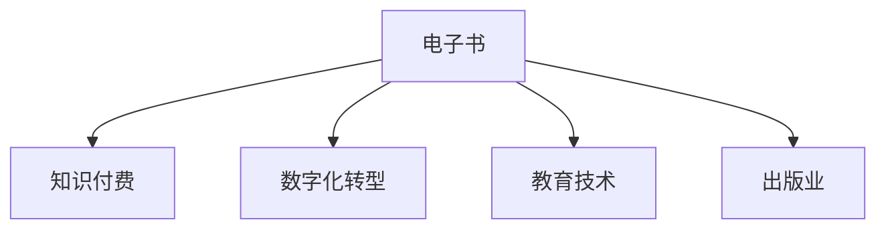

                 

# 如何利用电子书形式进行知识付费

> 关键词：电子书, 知识付费, 数字化转型, 教育技术, 出版业

## 1. 背景介绍

### 1.1 问题由来

随着互联网技术的不断进步，数字化阅读的普及率不断提高，传统的纸质书籍市场受到了严重的冲击。与此同时，知识付费的概念逐渐兴起，人们开始愿意为优质内容支付费用。电子书作为一种新兴的阅读形式，结合了数字化与知识付费的优点，为出版业和教育技术行业带来了新的发展机遇。

电子书通过数字化技术，将纸质书籍转化为可搜索、可互动、可分享的电子格式，大大降低了出版和流通的成本。同时，电子书也可以承载更多的元数据和功能，如笔记标注、目录跳转、内容搜索等，提升了阅读体验。

在知识付费模式下，用户愿意为优质、专业的内容付费，以获取深度学习、专业技能、行业洞察等方面的知识。这种模式激励了更多专业人士和机构投入优质内容的创作和发布。电子书为知识付费提供了一个理想的载体，既满足了用户对高质量内容的需求，也帮助出版业和教育技术行业实现数字化转型。

### 1.2 问题核心关键点

电子书形式的知识付费核心关键点包括：

1. **内容质量**：电子书的核心价值在于其内容，高质量、专业化的内容是吸引用户付费的关键。
2. **用户体验**：优秀的用户体验可以提高用户粘性，促进多次购买和口碑传播。
3. **技术支持**：电子书的技术实现需要具备高可靠性、易用性和安全性。
4. **营销推广**：电子书需要有效的营销策略，以吸引目标用户群体。
5. **定价策略**：合理的价格策略可以确保收入，同时吸引更多用户。
6. **数据分析**：利用数据分析优化内容和推广策略，提高用户转化率和留存率。

## 2. 核心概念与联系

### 2.1 核心概念概述

为更好地理解电子书形式的知识付费，本节将介绍几个密切相关的核心概念：

- **电子书**：一种以电子形式呈现的图书，通常采用PDF、epub、MOBI等格式，支持多种阅读设备。
- **知识付费**：通过购买或订阅的方式，获取特定领域或特定深度内容的商业模式，旨在提供专业、系统的学习材料。
- **数字化转型**：通过数字化技术重塑传统业务流程，提升效率和用户体验，开拓新业务领域的过程。
- **教育技术**：利用信息技术支持教育过程，提升教育质量和效率，如在线课程、虚拟实验室、智能辅导等。
- **出版业**：涉及书籍的编辑、出版、发行、销售等环节，电子书为其数字化转型提供了新的发展方向。

这些核心概念之间的逻辑关系可以通过以下Mermaid流程图来展示：



这个流程图展示电子书形式的知识付费的核心概念及其之间的关系：

1. 电子书作为一种新兴的阅读形式，结合了数字化与知识付费的特点。
2. 数字化转型为出版业带来了新的发展机遇，电子书为其提供了重要的数字化载体。
3. 教育技术为电子书内容的创建和分发提供了技术支持。

## 3. 核心算法原理 & 具体操作步骤
### 3.1 算法原理概述

电子书形式的知识付费，其核心算法原理主要包括：

- **推荐算法**：通过分析用户阅读行为，推荐用户感兴趣的内容。
- **定价算法**：根据内容价值和市场需求，制定合理的电子书价格。
- **搜索算法**：提升电子书内容的可搜索性，方便用户快速找到所需信息。
- **个性化展示**：利用AI技术，根据用户偏好展示个性化内容。
- **数据挖掘**：通过分析用户数据，挖掘用户需求和行为规律。

### 3.2 算法步骤详解

电子书形式的知识付费涉及的算法步骤主要包括：

1. **内容建设**：邀请专业人士创作优质内容，同时确保内容的版权合法。
2. **用户画像**：收集用户基本信息和阅读行为数据，建立用户画像。
3. **内容推荐**：利用推荐算法，将内容推荐给可能感兴趣的用户。
4. **定价优化**：根据用户反馈和市场数据，优化电子书的价格。
5. **个性化展示**：根据用户画像，展示个性化的电子书内容和广告。
6. **数据分析**：利用数据分析工具，优化推荐算法和定价策略。

### 3.3 算法优缺点

电子书形式的知识付费具有以下优点：

1. **便捷性**：用户可以随时随地进行阅读，不受时间和地点限制。
2. **价格合理**：相较于纸质书，电子书价格更具竞争优势，能够吸引更多用户。
3. **互动性强**：电子书支持多种交互功能，如笔记标注、目录跳转、内容搜索等，提升用户体验。
4. **环保节能**：电子书减少了纸质书生产和物流环节的碳排放，符合绿色环保的理念。

同时，该方法也存在一些局限性：

1. **版权保护**：电子书内容可能面临盗版和侵权问题，需要严格的技术保护措施。
2. **用户体验参差不齐**：不同电子书平台的质量和服务参差不齐，影响了用户粘性。
3. **技术依赖**：电子书技术的开发和维护需要较高的技术投入。
4. **用户习惯培养**：部分用户仍然习惯纸质书的阅读方式，电子书形式的接受度有待提高。

### 3.4 算法应用领域

电子书形式的知识付费在以下领域得到广泛应用：

1. **专业技能培训**：如编程、设计、管理等专业领域的深度学习书籍，帮助用户提升职业技能。
2. **金融投资**：财经、证券、投资等领域的专业书籍，提供市场洞察和投资策略。
3. **科技前沿**：如人工智能、区块链、物联网等新兴技术领域的书籍，帮助用户把握行业趋势。
4. **教育培训**：从小学到大学、职业培训等各类教育领域的教材和参考书，满足不同阶段的学习需求。
5. **健康生活**：如健身、饮食、心理健康等领域的书籍，提升用户的生活质量。

## 4. 数学模型和公式 & 详细讲解 & 举例说明

### 4.1 数学模型构建

电子书形式的知识付费涉及的数学模型主要包括：

- **用户行为模型**：描述用户阅读行为，如阅读时长、点击频率、购买次数等。
- **内容价值模型**：评估内容的价值，如专业度、难度、实用性等。
- **推荐模型**：根据用户画像和内容价值，推荐合适的内容。
- **定价模型**：根据市场和内容价值，制定合理的电子书价格。

### 4.2 公式推导过程

以推荐模型为例，其基本思想是通过用户历史阅读数据，预测用户对特定内容的兴趣。

假设用户 $u$ 对内容 $c$ 的兴趣为 $I_{uc}$，内容价值为 $V_c$，用户画像特征为 $P_u$，推荐算法可以表示为：

$$
I_{uc} = f(P_u, V_c, \theta)
$$

其中 $f$ 为推荐函数，$\theta$ 为模型参数。

推荐函数 $f$ 可以采用多种模型，如协同过滤、基于内容的推荐、矩阵分解等。这里以矩阵分解为例，公式为：

$$
I_{uc} = \sum_{i=1}^{n} P_{ui} \times V_i
$$

其中 $P_{ui}$ 为用户画像中第 $i$ 个特征，$V_i$ 为内容价值中第 $i$ 个特征。

### 4.3 案例分析与讲解

以电子书平台Amazon Kindle为例，其推荐算法采用协同过滤和基于内容的推荐相结合的方式。首先，Kindle通过分析用户的历史阅读行为，构建用户画像。然后，根据用户画像和内容价值，使用矩阵分解模型计算用户对每个内容的兴趣分数。最后，根据兴趣分数排序，展示用户可能感兴趣的内容。

## 5. 项目实践：代码实例和详细解释说明
### 5.1 开发环境搭建

要进行电子书形式的知识付费项目实践，首先需要搭建开发环境。以下是使用Python进行Flask开发的简单环境配置流程：

1. 安装Anaconda：从官网下载并安装Anaconda，用于创建独立的Python环境。

2. 创建并激活虚拟环境：
```bash
conda create -n book-publish python=3.8 
conda activate book-publish
```

3. 安装Flask：
```bash
pip install flask
```

4. 安装Gunicorn：用于启动Flask应用：
```bash
pip install gunicorn
```

5. 安装SQLAlchemy：用于管理数据库：
```bash
pip install sqlalchemy
```

完成上述步骤后，即可在`book-publish`环境中开始电子书形式的知识付费项目的开发。

### 5.2 源代码详细实现

以下是电子书平台Flask应用程序的代码实现：

```python
from flask import Flask, request, jsonify
from flask_sqlalchemy import SQLAlchemy
from sqlalchemy import create_engine
from sqlalchemy.orm import sessionmaker

app = Flask(__name__)
app.config['SQLALCHEMY_DATABASE_URI'] = 'sqlite:///books.db'
app.config['SECRET_KEY'] = 'secret_key'
db = SQLAlchemy(app)

class Book(db.Model):
    id = db.Column(db.Integer, primary_key=True)
    title = db.Column(db.String(100))
    author = db.Column(db.String(100))
    content = db.Column(db.Text)
    price = db.Column(db.Float)

    def __init__(self, title, author, content, price):
        self.title = title
        self.author = author
        self.content = content
        self.price = price

@app.route('/books', methods=['GET'])
def get_books():
    books = db.session.query(Book).all()
    book_list = [{'id': book.id, 'title': book.title, 'author': book.author, 'price': book.price} for book in books]
    return jsonify(book_list)

@app.route('/books/<int:id>', methods=['GET'])
def get_book(id):
    book = db.session.query(Book).filter_by(id=id).first()
    return jsonify({'id': book.id, 'title': book.title, 'author': book.author, 'price': book.price, 'content': book.content})

@app.route('/books', methods=['POST'])
def add_book():
    data = request.get_json()
    new_book = Book(title=data['title'], author=data['author'], content=data['content'], price=data['price'])
    db.session.add(new_book)
    db.session.commit()
    return jsonify({'message': 'Book added successfully'})

@app.route('/books/<int:id>', methods=['PUT'])
def update_book(id):
    data = request.get_json()
    book = db.session.query(Book).filter_by(id=id).first()
    book.title = data['title']
    book.author = data['author']
    book.price = data['price']
    book.content = data['content']
    db.session.commit()
    return jsonify({'message': 'Book updated successfully'})

@app.route('/books/<int:id>', methods=['DELETE'])
def delete_book(id):
    book = db.session.query(Book).filter_by(id=id).first()
    db.session.delete(book)
    db.session.commit()
    return jsonify({'message': 'Book deleted successfully'})

if __name__ == '__main__':
    app.run(debug=True)
```

### 5.3 代码解读与分析

让我们再详细解读一下关键代码的实现细节：

**Book类**：
- 定义了电子书的基本属性，如书名、作者、内容、价格等。
- 利用SQLAlchemy框架进行数据库操作，包括创建、查询、更新、删除等。

**Flask应用**：
- 使用Flask框架，实现了基本的CRUD操作，包括获取所有书籍、获取单个书籍、添加新书籍、更新书籍和删除书籍。
- 通过HTTP请求方式，提供RESTful风格的API接口。

**数据库操作**：
- 使用SQLAlchemy框架，将书籍信息存储在SQLite数据库中，方便管理和查询。
- 通过ORM（对象关系映射）技术，将数据库操作封装在Python对象中，提高了代码的可读性和可维护性。

可以看到，使用Flask和SQLAlchemy框架，进行电子书平台开发的代码实现相对简洁，易于理解和维护。

### 5.4 运行结果展示

运行上述代码，启动Flask应用后，可以通过HTTP请求方式访问RESTful风格的API接口，实现对书籍信息的基本操作。

以下是一个简单的示例：

```python
import requests

# 添加新书籍
url = 'http://localhost:5000/books'
book_data = {
    'title': '深度学习入门',
    'author': '张三',
    'content': '深度学习的基本概念和算法',
    'price': 19.9
}
response = requests.post(url, json=book_data)
print(response.json())

# 获取所有书籍
url = 'http://localhost:5000/books'
response = requests.get(url)
print(response.json())

# 获取单个书籍
url = 'http://localhost:5000/books/1'
response = requests.get(url)
print(response.json())

# 更新书籍信息
url = 'http://localhost:5000/books/1'
book_data = {
    'title': '深度学习基础',
    'author': '李四',
    'price': 29.9
}
response = requests.put(url, json=book_data)
print(response.json())

# 删除书籍
url = 'http://localhost:5000/books/1'
response = requests.delete(url)
print(response.json())
```

运行上述代码，可以看到添加新书籍、获取所有书籍、获取单个书籍、更新书籍信息和删除书籍的结果。

## 6. 实际应用场景
### 6.1 在线教育平台

电子书形式的知识付费在在线教育平台中得到了广泛应用。用户可以通过购买或订阅，获取特定课程或教材的电子书，进行深度学习。在线教育平台可以根据用户的学习进度和表现，推荐相关课程和教材，提升学习效果。

以Coursera平台为例，其电子书形式的课程和教材通过在线学习管理系统提供，用户可以随时随地进行学习和互动。平台通过分析用户的学习行为，推荐相关课程和教材，帮助用户高效学习。

### 6.2 专业技能培训

电子书形式的知识付费在专业技能培训中同样具有重要价值。专业领域的深度学习书籍和教材，通过电子书形式提供，可以帮助用户系统学习各类专业技能，提升职业技能。

以Udacity平台为例，其提供的Python、机器学习、数据科学等领域的电子书课程，通过在线学习管理系统提供，用户可以通过购买或订阅，获取专业领域的电子书和视频课程。平台通过分析用户的学习行为，推荐相关课程和教材，帮助用户提升职业技能。

### 6.3 金融投资

电子书形式的知识付费在金融投资领域也具有重要应用。财经、证券、投资等领域的专业书籍，通过电子书形式提供，可以帮助用户掌握市场动态和投资策略。

以华尔街见闻平台为例，其提供的财经、证券、投资等领域的电子书，通过在线学习管理系统提供，用户可以通过购买或订阅，获取专业领域的电子书和文章。平台通过分析用户的学习行为，推荐相关文章和书籍，帮助用户掌握市场动态和投资策略。

### 6.4 未来应用展望

随着电子书形式的知识付费不断发展，未来将在更多领域得到应用，为各行各业带来变革性影响。

在智慧医疗领域，电子书形式的医疗知识库，通过在线学习管理系统提供，可以帮助医生、护士等专业人士进行深度学习，提升医疗水平。

在智能家居领域，电子书形式的智能家居教程和指南，通过在线学习管理系统提供，可以帮助用户掌握智能家居设备的使用和维护。

在智能制造领域，电子书形式的智能制造教程和指南，通过在线学习管理系统提供，可以帮助工程师掌握智能制造技术，提升生产效率。

此外，在教育、金融、科技等众多领域，电子书形式的在线学习管理系统将继续发挥重要作用，为各行各业带来新的发展机遇。

## 7. 工具和资源推荐
### 7.1 学习资源推荐

为了帮助开发者系统掌握电子书形式的知识付费的理论基础和实践技巧，这里推荐一些优质的学习资源：

1. 《电子书制作与出版》系列博文：由电子书出版专家撰写，介绍电子书的制作流程、出版流程、版权保护等基础知识。

2. 《在线学习管理系统设计与实现》课程：由在线教育平台开设的课程，介绍在线学习管理系统的设计思路和实现方法。

3. 《知识付费市场分析报告》书籍：介绍知识付费市场的发展趋势、用户行为分析、商业模式创新等前沿话题。

4. Amazon Kindle官方文档：详细介绍了Kindle电子书平台的开发和运营方式，是电子书出版的必备参考资料。

5. Google Play图书应用指南：介绍了Google Play电子书平台的开发和运营方式，适合电子书出版的开发者参考。

通过对这些资源的学习实践，相信你一定能够快速掌握电子书形式的知识付费的精髓，并用于解决实际的电子书出版和运营问题。

### 7.2 开发工具推荐

高效的开发离不开优秀的工具支持。以下是几款用于电子书形式的知识付费开发的常用工具：

1. Flask：基于Python的开源Web框架，简单易用，适合快速迭代研究。

2. SQLAlchemy：Python的ORM框架，支持多种数据库，方便进行数据库操作。

3. Gunicorn：Python的Web服务器，支持异步IO和长连接，适合高并发场景。

4. Elasticsearch：分布式搜索引擎，适合大规模电子书内容搜索和推荐。

5. Pandas：数据分析和处理库，适合处理电子书用户行为数据和内容数据。

6. TensorBoard：TensorFlow配套的可视化工具，适合监控和调试电子书平台的模型和算法。

合理利用这些工具，可以显著提升电子书形式的知识付费的开发效率，加快创新迭代的步伐。

### 7.3 相关论文推荐

电子书形式的知识付费的发展源于学界的持续研究。以下是几篇奠基性的相关论文，推荐阅读：

1. "E-Pub: A New E-Book Format"（《电子书格式》）：介绍了电子书格式的发展历程和技术实现，为电子书出版的基础理论。

2. "Knowledge Peers: A New Platform for Knowledge Sharing"（《知识共享平台》）：介绍了基于电子书的知识共享平台的设计和实现，为电子书出版的应用参考。

3. "The Economics of Knowledge Sharing Platforms"（《知识共享平台经济学》）：分析了电子书知识共享平台的市场经济模型，为电子书出版的商业模式参考。

4. "E-Learning Platforms: The Future of Education"（《在线学习平台》）：介绍了在线学习平台的发展历程和应用，为电子书出版的市场前景参考。

这些论文代表了大电子书形式的知识付费的发展脉络。通过学习这些前沿成果，可以帮助研究者把握学科前进方向，激发更多的创新灵感。

## 8. 总结：未来发展趋势与挑战
### 8.1 总结

本文对电子书形式的知识付费进行了全面系统的介绍。首先阐述了电子书形式的知识付费的背景和意义，明确了电子书形式的知识付费的核心价值。其次，从原理到实践，详细讲解了电子书形式的知识付费的数学原理和关键步骤，给出了电子书出版的完整代码实例。同时，本文还广泛探讨了电子书形式的知识付费在在线教育、专业技能培训、金融投资等多个行业领域的应用前景，展示了电子书形式的巨大潜力。此外，本文精选了电子书形式的知识付费的学习资源，力求为读者提供全方位的技术指引。

通过本文的系统梳理，可以看到，电子书形式的知识付费正在成为电子书出版的核心商业模式，极大地拓展了电子书出版的应用边界，催生了更多的落地场景。受益于电子书出版的数字化转型，电子书出版的技术水平和市场规模将持续增长，为出版业和教育技术行业带来新的发展机遇。

### 8.2 未来发展趋势

展望未来，电子书形式的知识付费将呈现以下几个发展趋势：

1. **技术创新**：电子书出版平台将不断引入新技术，提升用户阅读体验和平台运营效率。如增强现实、虚拟现实、语音交互等技术，将为电子书出版带来新的创意和方向。

2. **个性化推荐**：电子书出版平台将通过大数据和AI技术，提升个性化推荐精度，增强用户粘性。推荐算法将不断优化，精准推荐用户感兴趣的内容。

3. **多样化内容**：电子书出版的内容将更加多样化，涵盖多媒体、交互式、开放获取等多种形式，满足用户多样化的阅读需求。

4. **国际化发展**：电子书出版平台将拓展国际市场，提升国际化水平。多语言、多文化的内容和平台将不断涌现，打破语言和文化的壁垒。

5. **元宇宙融合**：随着元宇宙概念的兴起，电子书出版平台将探索虚拟现实、数字孪生等新技术，构建数字化的阅读场景，提升用户体验。

6. **可持续发展**：电子书出版的数字化转型将推动绿色出版和可持续发展，减少资源消耗和碳排放，实现经济效益和环境效益的双赢。

以上趋势凸显了电子书形式的知识付费技术的广阔前景。这些方向的探索发展，必将进一步提升电子书出版的性能和应用范围，为出版业和教育技术行业带来新的发展机遇。

### 8.3 面临的挑战

尽管电子书形式的知识付费技术已经取得了显著成就，但在迈向更加智能化、普适化应用的过程中，它仍面临着诸多挑战：

1. **版权保护**：电子书出版面临盗版和侵权问题，需要严格的技术保护措施，以保护作者权益。

2. **用户体验**：电子书出版的平台和内容质量参差不齐，影响用户粘性和满意度。

3. **技术依赖**：电子书出版的技术实现需要较高的技术投入，开发和维护成本较高。

4. **用户习惯培养**：部分用户仍然习惯纸质书的阅读方式，电子书出版的接受度有待提高。

5. **市场竞争**：电子书出版市场竞争激烈，需要持续创新和优化，以吸引和留住用户。

6. **数据隐私**：电子书出版的平台需要处理大量用户数据，需要严格的数据隐私保护措施。

正视电子书形式的知识付费面临的这些挑战，积极应对并寻求突破，将是电子书出版的关键。相信随着技术创新和市场发展的不断推动，电子书出版的市场规模和应用领域将持续扩大，为出版业和教育技术行业带来新的发展机遇。

### 8.4 研究展望

面对电子书形式的知识付费所面临的种种挑战，未来的研究需要在以下几个方面寻求新的突破：

1. **新技术引入**：引入新技术，提升电子书出版的技术水平和用户体验。如增强现实、虚拟现实、语音交互等技术，将为电子书出版带来新的创意和方向。

2. **个性化推荐算法**：不断优化推荐算法，提升个性化推荐精度，增强用户粘性。

3. **多样化内容制作**：制作多样化内容，满足用户多样化的阅读需求。

4. **国际化发展**：拓展国际市场，提升国际化水平。多语言、多文化的内容和平台将不断涌现，打破语言和文化的壁垒。

5. **元宇宙融合**：探索虚拟现实、数字孪生等新技术，构建数字化的阅读场景，提升用户体验。

6. **可持续发展**：推动绿色出版和可持续发展，减少资源消耗和碳排放，实现经济效益和环境效益的双赢。

这些研究方向的探索，必将引领电子书形式的知识付费技术迈向更高的台阶，为出版业和教育技术行业带来新的发展机遇。面向未来，电子书形式的知识付费技术还需要与其他人工智能技术进行更深入的融合，如知识表示、因果推理、强化学习等，多路径协同发力，共同推动电子书出版的进步。只有勇于创新、敢于突破，才能不断拓展电子书出版的边界，让电子书出版的技术更好地造福人类社会。

## 9. 附录：常见问题与解答

**Q1：电子书出版平台如何确保版权保护？**

A: 电子书出版平台可以通过以下方式确保版权保护：
1. **技术手段**：使用数字水印、加密技术等手段，防止电子书内容被非法复制和传播。
2. **法律保护**：制定完善的版权保护机制，明确版权归属和侵权责任。
3. **用户协议**：通过用户协议，明确用户使用电子书的内容和使用范围，防止非法使用。
4. **平台监控**：利用AI技术，监控平台上的内容传播情况，及时发现和处理侵权行为。

**Q2：电子书出版平台如何提升用户体验？**

A: 电子书出版平台可以通过以下方式提升用户体验：
1. **用户界面优化**：设计直观、友好的用户界面，提升用户体验。
2. **功能扩展**：引入多种功能，如笔记标注、目录跳转、内容搜索等，提升用户阅读体验。
3. **个性化推荐**：利用大数据和AI技术，推荐用户感兴趣的内容，提升用户粘性。
4. **社区互动**：建立用户社区，促进用户交流和分享，提升用户活跃度。
5. **反馈机制**：建立用户反馈机制，及时了解用户需求和建议，不断优化平台功能。

**Q3：电子书出版的技术实现需要哪些技术支持？**

A: 电子书出版的技术实现需要以下技术支持：
1. **Web开发技术**：如Flask、Django等框架，方便构建电子书平台。
2. **数据库技术**：如MySQL、SQLite等数据库，方便管理电子书内容和用户数据。
3. **云计算技术**：如AWS、Google Cloud等云平台，提供高可靠性和高扩展性的计算资源。
4. **搜索引擎技术**：如Elasticsearch、Solr等搜索引擎，方便用户搜索电子书内容。
5. **AI技术**：如推荐算法、自然语言处理等技术，提升电子书平台的功能和用户体验。

**Q4：电子书出版的市场前景如何？**

A: 电子书出版的市场前景广阔，主要表现在以下几个方面：
1. **用户需求**：随着互联网的普及，用户对电子书的需求持续增长。
2. **技术支持**：电子书出版技术不断进步，如云服务、大数据、AI等技术为电子书出版提供了强大的技术支持。
3. **平台多样化**：电子书出版的平台不断多样化，如Kindle、Apple Books等平台，满足了用户多样化的阅读需求。
4. **市场竞争**：电子书出版市场竞争激烈，需要持续创新和优化，以吸引和留住用户。
5. **国际市场**：电子书出版的国际化水平不断提高，国际市场成为新的增长点。

**Q5：电子书出版的未来发展方向是什么？**

A: 电子书出版的未来发展方向主要包括以下几个方面：
1. **技术创新**：引入新技术，提升电子书出版的技术水平和用户体验。
2. **个性化推荐**：不断优化推荐算法，提升个性化推荐精度，增强用户粘性。
3. **多样化内容**：制作多样化内容，满足用户多样化的阅读需求。
4. **国际化发展**：拓展国际市场，提升国际化水平。
5. **元宇宙融合**：探索虚拟现实、数字孪生等新技术，构建数字化的阅读场景，提升用户体验。
6. **可持续发展**：推动绿色出版和可持续发展，减少资源消耗和碳排放，实现经济效益和环境效益的双赢。

这些方向将引领电子书出版的技术不断进步，为出版业和教育技术行业带来新的发展机遇。

---

作者：禅与计算机程序设计艺术 / Zen and the Art of Computer Programming

