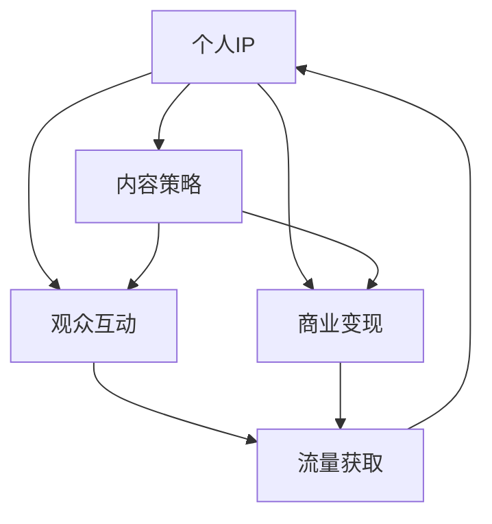

                 

# 如何利用直播平台建立个人IP

## 1. 背景介绍

### 1.1 问题由来
随着移动互联网的兴起，直播平台成为最热门的社交和娱乐方式之一。不仅主播可以通过直播收获流量和收入，普通用户也借助直播平台展现个人兴趣、生活，甚至建立个人品牌和影响力。直播平台的火爆，催生了直播行业的一片新天地。但如何在这片新天地中脱颖而出，成为有影响力的IP，成为了许多内容创作者面临的难题。

### 1.2 问题核心关键点
构建个人IP，关键在于在直播平台上展示独特的个人风格和专业能力。通过持续高质量的内容输出，建立起稳定且忠诚的观众群体。以下是构建个人IP的几个核心要素：

- **内容质量**：高水准的内容是吸引观众的根本。无论直播的主题是什么，内容必须具有高度的吸引力。
- **个人特色**：独特且稳定的个人风格可以加深观众记忆，构建稳定的观众群体。
- **互动性**：直播的互动性是区别于其他媒体形式的独特优势，良好的互动性可以增强观众粘性。
- **持续性**：定期持续直播，保持观众的持续关注。
- **技术支持**：良好的直播技术支持，如流畅的视频、音频，稳定的网络等，可以提升观众的观看体验。
- **商业变现**：通过直播平台的商业变现机制，将个人IP转化为经济效益。

通过深入理解这些核心要素，我们将探讨如何在直播平台上建立个人IP的具体策略和方法。

## 2. 核心概念与联系

### 2.1 核心概念概述

为更好地理解如何在直播平台上建立个人IP，本节将介绍几个密切相关的核心概念：

- **个人IP (Personal IP)**：指个人在某个领域建立的独特且具有商业价值的形象和影响力。在直播平台上，个人IP通常通过持续的高质量内容输出，建立起忠实且具有高粘性的观众群体。

- **内容策略 (Content Strategy)**：为达成特定目标，在直播平台上设计并执行的一系列内容创作计划和执行方案。包括内容定位、内容主题、内容形式等。

- **观众互动 (Audience Engagement)**：直播平台的互动功能，如点赞、评论、礼物等，通过积极与观众互动，增强观众参与感和忠诚度。

- **商业变现 (Monetization)**：通过直播平台的商业变现模式，如广告分成、付费订阅、商品销售等，将个人IP转化为经济效益。

- **流量获取 (Traffic Acquisition)**：通过多样化的渠道，如社交媒体、搜索引擎优化等，吸引和增加直播间的观众数量。

这些核心概念之间的逻辑关系可以通过以下Mermaid流程图来展示：



这个流程图展示了个体在直播平台上建立IP的关键环节：

1. 内容策略是构建IP的基础，通过设计合适的内容主题和形式，吸引并留住观众。
2. 观众互动是IP成长的加速器，通过互动增强观众的参与感和忠诚度。
3. 商业变现是IP经济价值的具体体现，通过广告分成、付费等变现手段，增强经济效益。
4. 流量获取是IP影响力的重要体现，通过各种渠道吸引观众，扩大影响力。

这些概念共同构成了直播平台上建立个人IP的基本框架，帮助内容创作者系统地规划和执行直播策略。

## 3. 核心算法原理 & 具体操作步骤

### 3.1 算法原理概述

构建个人IP的过程，本质上是内容创作者通过持续的高质量内容输出，逐步在直播平台上建立起稳定的观众群体。其核心思想是：

1. **内容驱动**：以优质内容为核心，通过独特的视角、专业的分析、实用的信息，吸引和留住观众。
2. **互动驱动**：积极与观众互动，通过回复评论、分享观众留言、发放奖励等方式，增强观众参与感和忠诚度。
3. **商业驱动**：通过直播平台的商业变现机制，将个人IP转化为实际的经济收益，进一步激励内容创作。
4. **技术驱动**：依托先进的直播技术，提升直播体验，增强观众观看体验。

通过上述四个方面，内容创作者可以实现从流量获取到商业变现的闭环，形成可持续的个人IP。

### 3.2 算法步骤详解

构建个人IP的详细操作步骤分为以下几个关键阶段：

#### 3.2.1 内容策划与设计

1. **确定内容主题**：根据自身的兴趣、专长和市场需求，选择合适的内容主题。内容主题应具有高价值、高趣味性和实用性。
2. **设计内容形式**：根据内容主题设计合适的直播形式，如聊天、访谈、教程、游戏等。内容形式应多样化，满足不同观众的需求。
3. **制定内容日历**：制定详细的内容日历，明确每场直播的主题、时间和直播计划。

#### 3.2.2 观众互动与引导

1. **互动策略制定**：制定积极的互动策略，鼓励观众参与和反馈。如通过问答、投票等方式引导观众参与。
2. **即时互动**：直播过程中，积极回复观众评论和提问，引导观众参与话题讨论。
3. **定期反馈**：通过问卷调查、评论分析等方式，定期收集观众反馈，优化直播内容和形式。

#### 3.2.3 商业变现策略

1. **选择适合的变现模式**：根据自身特点和观众需求，选择适合的商业变现模式，如广告分成、付费订阅、商品销售等。
2. **构建变现体系**：建立完整的商业变现体系，如通过直播平台的合作协议、观众捐赠等手段。
3. **监测与优化**：实时监测商业变现效果，通过数据分析和优化策略，提升变现效率。

#### 3.2.4 技术支持与优化

1. **技术准备**：选择合适的直播平台和技术工具，进行设备调试和测试。
2. **优化直播体验**：通过调整视频分辨率、音频质量等技术手段，提升直播体验。
3. **技术支持**：提供及时的技术支持，解决观众可能遇到的技术问题。

### 3.3 算法优缺点

直播平台上构建个人IP的主要优点：

1. **高效互动**：直播平台的即时互动功能，可以迅速建立与观众的联系，增强观众忠诚度。
2. **成本较低**：相较于传统的电视、电影等媒体形式，直播平台的初始成本较低。
3. **内容多样化**：直播平台形式多样，内容形式可以更灵活、多变。
4. **观众粘性高**：观众的观看时间和频次更容易预测和控制，便于长期运营。

主要缺点：

1. **内容同质化**：直播内容容易出现同质化现象，导致观众流失。
2. **观众忠诚度较低**：观众的流失率较高，难以保持长期稳定。
3. **技术要求高**：高质量的直播技术支持需要较高的技术门槛。

### 3.4 算法应用领域

直播平台上的个人IP构建，可以广泛应用在以下几个领域：

1. **教育培训**：利用直播平台进行在线教育培训，通过专业知识和技能分享，建立影响力。
2. **娱乐休闲**：通过才艺展示、游戏直播等形式，娱乐观众，建立娱乐IP。
3. **生活分享**：分享生活、旅游、美食等日常内容，建立生活类IP。
4. **商业咨询**：提供商业咨询、市场分析等服务，建立商业IP。
5. **体育健身**：进行体育比赛、健身指导等，吸引观众，建立体育类IP。

## 4. 数学模型和公式 & 详细讲解 & 举例说明

### 4.1 数学模型构建

假设在直播平台上，内容创作者发布 $T$ 场直播，每场直播的观看次数为 $V_i$，观看时长为 $D_i$，互动次数为 $I_i$，观众平均评分 $R_i$，观众增长率为 $\lambda$，初始观众数量为 $N_0$。观众增长模型可表示为：

$$
N_t = N_0 \times \lambda^t
$$

观众互动模型可表示为：

$$
I_t = \alpha \times V_t
$$

观众评分模型可表示为：

$$
R_t = \frac{\sum_{i=1}^T R_i}{T}
$$

其中，$t$ 表示直播场次，$\alpha$ 为观众互动系数，$V_t$ 为第 $t$ 场直播的观看次数，$T$ 为总直播场次。

### 4.2 公式推导过程

根据上述模型，观众数量随直播场次变化的公式为：

$$
N_t = N_0 \times \lambda^t = \frac{N_0}{1 - \lambda} (1 - (1 - \lambda)^t)
$$

观众互动次数随直播场次变化的公式为：

$$
I_t = \alpha \times V_t = \alpha \times N_t \times \frac{D_t}{T}
$$

观众平均评分随直播场次变化的公式为：

$$
R_t = \frac{\sum_{i=1}^T R_i}{T}
$$

其中，$D_t$ 为第 $t$ 场直播的观看时长，$T$ 为总直播场次。

### 4.3 案例分析与讲解

以某美食博主在直播平台上建立IP为例：

- **内容策划**：博主选择美食制作作为直播主题，设计了“每日美食”、“厨艺技巧”、“食材挑选”等系列内容。
- **观众互动**：博主在直播过程中积极回复观众评论，引导观众参与美食投票、美食推荐等互动。
- **商业变现**：博主通过直播平台的分成机制获得广告收入，同时通过观众打赏和商品销售获得收益。
- **技术支持**：博主使用高质量的视频设备，调整视频分辨率和音频质量，确保直播效果。

通过上述策略，博主在直播平台上逐步建立起稳定的观众群体，观看次数和互动次数不断提升，IP价值逐渐显现。

## 5. 项目实践：代码实例和详细解释说明

### 5.1 开发环境搭建

在进行直播平台IP构建的项目实践前，我们需要准备好开发环境。以下是使用Python进行直播平台IP构建的开发环境配置流程：

1. 安装Python：确保Python 3.6+版本的正确安装。
2. 安装直播平台API：根据选择的直播平台，安装相应的Python API库，如Instagram直播API、YouTube直播API等。
3. 安装数据分析工具：安装Pandas、NumPy等数据分析工具，便于数据处理和分析。
4. 安装Web开发框架：安装Flask或Django等Web开发框架，构建观众互动页面。
5. 安装测试工具：安装Selenium、pytest等测试工具，进行直播测试和调试。

完成上述步骤后，即可在本地搭建完整的IP构建开发环境。

### 5.2 源代码详细实现

下面以Instagram直播为例，给出直播平台IP构建的Python代码实现：

```python
from InstagramAPI import InstagramAPI
import time

# 登录Instagram账户
instagram = InstagramAPI(username, password)
instagram.login()

# 发布直播
live_id = instagram.publish_live("每日美食", "直播美食制作")
print("直播开始ID：", live_id)

# 观众互动
while live_id:
    time.sleep(5)
    live = instagram.get_live(live_id)
    print("直播剩余时间：", live['remaining_minutes'])
    print("观众人数：", live['total_views'])

# 结束直播
instagram.end_live(live_id)
print("直播结束")
```

以上代码实现了Instagram直播的基本功能，包括发布直播、获取观众数据、结束直播等。

### 5.3 代码解读与分析

让我们再详细解读一下关键代码的实现细节：

**InstagramAPI库**：
- `InstagramAPI` 类：提供Instagram API的接口，用于进行账户登录、发布直播、获取直播数据等操作。

**登录与发布**：
- 通过 `login` 方法登录Instagram账户，进入直播发布界面。
- 使用 `publish_live` 方法发布直播，传入直播标题和描述。
- 通过 `live_id` 获取直播开始后的唯一标识ID。

**观众互动**：
- 通过 `get_live` 方法获取直播数据，包括观众人数、剩余时间等信息。
- 通过循环获取实时数据，并打印输出。
- 通过 `end_live` 方法结束直播，释放资源。

**代码优化**：
- 在直播过程中，通过定期获取直播数据，确保观众互动的时效性。
- 代码中包含时间延迟，避免频繁请求API，降低服务器负载。
- 通过封装直播操作，使得代码更加模块化和易于扩展。

## 6. 实际应用场景

### 6.1 教育培训

直播平台在教育培训领域的应用日益广泛。知名教育机构通过直播平台进行在线课程教学，专家学者通过直播分享学术观点，学生通过直播平台进行互动学习。这种模式打破了时间和空间的限制，使优质教育资源得以广泛传播。

直播平台上的教育培训应用场景包括：

1. **在线课程教学**：知名高校和教育机构通过直播平台进行在线课程教学，实时互动，增加学生参与度。
2. **学术分享**：专家学者通过直播平台分享学术研究成果和观点，激发学术交流和讨论。
3. **互动学习**：学生通过直播平台进行互动学习和提问，增加学习效果。

### 6.2 娱乐休闲

娱乐休闲是直播平台的重要应用领域。通过直播平台，观众可以观看各类才艺表演、游戏直播、音乐演唱会等，享受娱乐。

直播平台上的娱乐休闲应用场景包括：

1. **才艺展示**：网红和艺人通过直播平台进行才艺展示，吸引观众关注和打赏。
2. **游戏直播**：电竞选手和游戏主播通过直播平台进行游戏直播，分享游戏技巧和经验。
3. **音乐演唱会**：知名歌手和乐队通过直播平台进行音乐演唱，与观众互动。

### 6.3 生活分享

通过直播平台，观众可以观看各类生活分享内容，如旅游、美食、家居等，体验不同生活方式。

直播平台上的生活分享应用场景包括：

1. **旅游分享**：旅游博主通过直播平台分享旅游见闻和攻略，吸引观众关注。
2. **美食制作**：美食博主通过直播平台分享美食制作过程，展示烹饪技巧。
3. **家居装饰**：家居博主通过直播平台分享家居装饰和生活小窍门，增加观众互动。

### 6.4 商业咨询

直播平台上的商业咨询应用场景包括：

1. **市场分析**：财经专家通过直播平台进行市场分析和预测，分享投资策略和建议。
2. **商业咨询**：企业通过直播平台进行商业咨询，解答观众提出的问题和疑虑。
3. **产品展示**：企业通过直播平台进行产品展示和推广，提升品牌知名度。

### 6.5 体育健身

体育健身也是直播平台的重要应用领域。通过直播平台，观众可以观看各类体育比赛和健身指导，享受健康生活。

直播平台上的体育健身应用场景包括：

1. **体育比赛**：体育比赛组织者通过直播平台进行比赛直播，吸引观众关注和互动。
2. **健身指导**：健身教练通过直播平台进行健身指导，分享健身经验和技巧。
3. **健康分享**：健康博主通过直播平台分享健康知识和生活方式，提高观众健康意识。

## 7. 工具和资源推荐

### 7.1 学习资源推荐

为了帮助开发者系统掌握直播平台IP构建的理论基础和实践技巧，这里推荐一些优质的学习资源：

1. **Instagram API官方文档**：Instagram官方提供的API文档，详细介绍了各种API的使用方法和示例代码。
2. **YouTube直播官方文档**：YouTube官方提供的API文档，详细介绍了直播的各种操作和调用方式。
3. **直播平台教程**：各大直播平台的官方教程和文档，如Bilibili、Twitch等，提供了丰富的直播技术支持。
4. **直播平台开发者社区**：如开发者社区Stack Overflow、GitHub等，开发者可以交流学习，获取技术支持。
5. **直播技术书籍**：如《直播技术架构实战》、《直播平台开发指南》等书籍，深入浅出地介绍了直播技术原理和实现方法。

通过对这些资源的学习实践，相信你一定能够快速掌握直播平台IP构建的精髓，并用于解决实际的直播平台问题。

### 7.2 开发工具推荐

高效的开发离不开优秀的工具支持。以下是几款用于直播平台IP构建开发的常用工具：

1. **Python**：作为直播平台IP构建的主要开发语言，Python语言简洁高效，适合快速迭代研究。
2. **Instagram API**：Instagram官方提供的API库，提供了丰富的直播操作接口，便于开发者进行直播功能开发。
3. **YouTube API**：YouTube官方提供的API库，提供了直播操作的详细文档和示例代码。
4. **Flask**：轻量级的Web框架，适合快速开发观众互动页面。
5. **Selenium**：自动化测试工具，用于测试直播平台功能和稳定性。
6. **pytest**：Python测试框架，用于测试直播平台的各种功能模块。

合理利用这些工具，可以显著提升直播平台IP构建的开发效率，加快创新迭代的步伐。

### 7.3 相关论文推荐

直播平台IP构建的研究涉及诸多领域，以下是几篇奠基性的相关论文，推荐阅读：

1. **"InstaStream: Dynamic Popular Stream Selection in Social Media Platforms"**：探讨了Instagram直播平台的流媒体选择算法，通过优化算法提升用户观看体验。
2. **"High-Quality Live Streaming with Two-Tier Encoding and Its Preprocessing Framework"**：介绍了高质量直播编码和预处理框架，提升了直播质量。
3. **"Real-Time Interaction in Live Streaming"**：研究了直播平台的实时互动技术，通过用户行为分析提升互动效果。
4. **"Leveraging Live Streaming for Market Research and Branding"**：探讨了直播平台在市场研究和品牌营销中的应用，提升了直播平台的商业价值。
5. **"Live Streaming Analytics for Engagement and Revenue"**：研究了直播平台的用户互动和商业变现，提出了多种分析方法和策略。

这些论文代表了大语言模型微调技术的发展脉络。通过学习这些前沿成果，可以帮助研究者把握学科前进方向，激发更多的创新灵感。

## 8. 总结：未来发展趋势与挑战

### 8.1 总结

本文对如何在直播平台上建立个人IP进行了全面系统的介绍。首先阐述了在直播平台上展示独特个人风格和专业能力的重要性，明确了构建IP的几个核心要素。接着，从原理到实践，详细讲解了内容策划、观众互动、商业变现等关键步骤，给出了直播平台IP构建的完整代码实例。同时，本文还广泛探讨了直播平台在教育培训、娱乐休闲、生活分享等领域的广泛应用前景，展示了直播平台IP构建的巨大潜力。此外，本文精选了直播平台IP构建的各类学习资源，力求为读者提供全方位的技术指引。

通过本文的系统梳理，可以看到，直播平台上的个人IP构建，已成为内容创作者建立影响力、提升商业价值的重要手段。直播平台的互动性、低成本、多样化等特点，使其成为内容创作者展示个人特色和专业能力的理想平台。未来，伴随直播技术的持续演进，直播平台必将在更多领域大放异彩，为内容创作者提供更多机遇。

### 8.2 未来发展趋势

展望未来，直播平台上的个人IP构建将呈现以下几个发展趋势：

1. **高质量内容的普及**：随着技术进步和设备改进，直播平台上的内容质量将进一步提升，吸引更多观众关注。
2. **多样化互动的增强**：直播平台的互动功能将不断丰富，通过AR、VR等技术，提升观众的沉浸式体验。
3. **商业变现模式的创新**：直播平台的商业变现模式将不断创新，如直播打赏、定制化服务、会员制度等。
4. **AI辅助的直播运营**：通过AI技术，优化直播内容推荐和观众互动，提升运营效率。
5. **跨平台联动**：直播平台与其他社交媒体平台的联动，实现数据互通和用户迁移，扩大直播平台的影响力。
6. **直播平台的全球化**：直播平台将进一步国际化，支持多种语言和地区特色内容。

以上趋势凸显了直播平台上个人IP构建的广阔前景。这些方向的探索发展，必将进一步提升直播平台的互动性、商业价值和用户粘性，为内容创作者带来更多机遇。

### 8.3 面临的挑战

尽管直播平台上的个人IP构建具有广阔的前景，但在迈向更加智能化、普适化应用的过程中，它仍面临着诸多挑战：

1. **内容同质化**：直播内容容易出现同质化现象，导致观众流失。
2. **观众忠诚度较低**：观众的流失率较高，难以保持长期稳定。
3. **技术门槛较高**：高质量的直播技术支持需要较高的技术门槛。
4. **隐私和版权问题**：直播内容涉及版权和隐私问题，需严格遵守相关法律法规。
5. **商业变现问题**：商业变现模式的创新需要与直播平台的商业策略保持一致。
6. **平台监管问题**：直播平台需加强监管，避免出现低俗内容，维护良好的直播环境。

这些挑战需要内容创作者在技术、法律、商业等方面进行综合考虑和应对。唯有全面优化各个环节，才能在直播平台上建立起具有商业价值的个人IP。

### 8.4 研究展望

面对直播平台IP构建面临的种种挑战，未来的研究需要在以下几个方面寻求新的突破：

1. **内容创新**：开发更具创意和互动性的直播内容，增强观众粘性和关注度。
2. **技术创新**：探索先进的直播技术，如AR/VR、AI驱动的内容推荐等，提升直播体验和互动效果。
3. **商业模式创新**：结合多种商业变现模式，如直播分成、定制化服务、会员制度等，最大化商业价值。
4. **平台监管优化**：建立健全平台监管机制，确保直播内容的健康合规。
5. **国际化和本地化**：推进直播平台的国际化进程，支持多种语言和地区特色内容，扩大受众群体。

这些研究方向的探索，必将引领直播平台上的个人IP构建走向更高的台阶，为内容创作者提供更多机遇和挑战，促进直播行业的健康发展。总之，直播平台上的个人IP构建，需要在技术、法律、商业等方面进行全面优化，方能成为内容创作者展示个人特色和专业能力的理想平台。

## 9. 附录：常见问题与解答

**Q1：如何选择直播平台和直播设备？**

A: 选择直播平台时，需考虑平台的用户量、技术支持、变现能力等因素。选择直播设备时，需考虑设备的清晰度、稳定性、易用性等，确保直播效果。

**Q2：如何提升直播互动效果？**

A: 提升直播互动效果可以从以下几个方面入手：
1. 设计互动环节，如问答、投票、直播室。
2. 积极回应观众评论，引导观众参与互动。
3. 使用互动工具，如聊天室、弹幕、点赞等功能。

**Q3：如何进行观众行为分析？**

A: 观众行为分析可以通过直播平台的API获取观众数据，如观看时长、互动次数、停留时间等，进行详细分析和优化。

**Q4：直播内容如何更新和优化？**

A: 直播内容更新和优化可以通过以下方式进行：
1. 定期发布新内容，保持观众新鲜感。
2. 根据观众反馈，调整直播内容。
3. 引入多种内容形式，增加观众选择。

**Q5：如何处理直播间的突发事件？**

A: 处理直播间的突发事件可以从以下几个方面入手：
1. 制定应急预案，准备好应对突发事件。
2. 及时与观众沟通，解释和解决突发事件。
3. 事件处理后，进行总结和反思，优化应对策略。

通过这些问题的解答，可以帮助直播平台上的内容创作者更好地理解和应用直播平台IP构建的相关技术和策略，提升直播效果和观众互动，最终建立具有商业价值的个人IP。

---

作者：禅与计算机程序设计艺术 / Zen and the Art of Computer Programming

