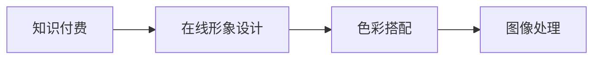

                 

# 如何利用知识付费实现在线形象设计与色彩搭配？

> 关键词：知识付费, 在线形象设计, 色彩搭配, 图像处理, 用户个性化, 心理效应

## 1. 背景介绍

随着数字经济的迅猛发展，知识付费成为新时代的宠儿。各大知识付费平台不断涌现，如得到、喜马拉雅、知识星球等，推动了知识的商品化和市场化。在这波知识付费的浪潮中，如何利用知识付费的方式，为用户提供个性化的在线形象设计与色彩搭配，成为越来越多用户关注的热点。形象设计与色彩搭配不仅能提升用户的视觉体验，更能体现其独特的个性。本文将从技术层面剖析如何利用知识付费实现在线形象设计与色彩搭配，为广大开发者提供参考。

## 2. 核心概念与联系

### 2.1 核心概念概述

本文涉及的核心概念包括：

- **知识付费**：指通过在线平台将知识以付费的形式提供给用户，以实现知识传播、获取、付费三方的利益平衡。
- **在线形象设计**：通过数字图像处理技术，帮助用户设计符合其个性和需求的在线形象，如头像、封面等。
- **色彩搭配**：基于心理学和视觉原理，选择合适的色彩组合，提升用户的视觉体验。
- **图像处理**：对图像进行滤波、裁剪、增强等处理，提升图像质量，满足设计需求。

这些概念通过以下Mermaid流程图串联起来：



其中，知识付费是背景，在线形象设计是核心，色彩搭配和图像处理则是辅助工具。

## 3. 核心算法原理 & 具体操作步骤

### 3.1 算法原理概述

本文将介绍一种基于深度学习技术的在线形象设计与色彩搭配方法。该方法利用深度神经网络，通过大量用户数据进行预训练，然后通过用户提供的个性描述，生成符合其需求的在线形象。

具体步骤如下：

1. **用户画像生成**：收集用户的行为数据、偏好信息等，利用聚类算法生成用户画像。
2. **在线形象设计**：基于用户画像，使用生成对抗网络(Generative Adversarial Network, GAN)生成头像、封面等在线形象。
3. **色彩搭配**：利用颜色感知模型，选择合适的色彩搭配，提升视觉体验。
4. **图像处理**：对生成的在线形象进行图像处理，优化图像质量。

### 3.2 算法步骤详解

#### 3.2.1 用户画像生成

用户画像生成是整个流程的第一步，通过收集用户数据，利用聚类算法对用户进行分类。具体步骤如下：

1. **数据收集**：从知识付费平台收集用户的行为数据、付费内容、用户评论等信息。
2. **特征提取**：利用自然语言处理(NLP)技术，从用户评论中提取关键词、情感等信息，形成特征向量。
3. **聚类分析**：使用K-means等聚类算法，将用户分为若干类。

#### 3.2.2 在线形象设计

在线形象设计使用GAN技术生成头像、封面等。GAN是一种生成模型，由生成器和判别器两部分组成。生成器尝试生成逼真的样本，判别器则尝试区分样本的真假。

具体步骤如下：

1. **生成器训练**：将用户画像作为输入，使用生成器生成头像、封面等在线形象。
2. **判别器训练**：将生成的在线形象和真实数据作为输入，使用判别器进行分类。
3. **对抗训练**：生成器和判别器进行对抗训练，提升生成器生成样本的质量。

#### 3.2.3 色彩搭配

色彩搭配利用颜色感知模型，提升用户的视觉体验。颜色感知模型通过分析用户的偏好，选择最适合的色彩搭配。

具体步骤如下：

1. **颜色感知**：利用色彩心理学理论，分析用户偏好的颜色。
2. **色彩搭配**：根据用户偏好，选择适合的颜色搭配。

#### 3.2.4 图像处理

图像处理对生成的在线形象进行优化，提升图像质量。

具体步骤如下：

1. **图像滤波**：使用高斯滤波等技术，消除图像噪声。
2. **图像增强**：使用直方图均衡化等技术，提升图像对比度。
3. **图像裁剪**：根据用户需求，对图像进行裁剪。

### 3.3 算法优缺点

#### 3.3.1 优点

1. **个性化定制**：通过用户画像和生成对抗网络，能够实现个性化在线形象设计。
2. **效率高**：利用深度学习技术，生成过程快速高效。
3. **灵活性高**：可以根据用户需求，灵活调整生成器、判别器等模型参数。

#### 3.3.2 缺点

1. **数据依赖**：需要大量用户数据进行预训练，数据质量影响生成效果。
2. **计算资源需求高**：GAN等深度学习模型需要大量计算资源进行训练。
3. **公平性问题**：用户画像生成过程中，可能存在数据偏见，导致不公平。

### 3.4 算法应用领域

该算法可以应用于以下领域：

1. **在线教育平台**：为用户提供个性化的头像和封面设计，提升用户体验。
2. **社交媒体平台**：帮助用户设计符合其个性的头像，提升社交互动体验。
3. **知识付费平台**：通过用户画像生成，为用户推荐适合的课程内容。

## 4. 数学模型和公式 & 详细讲解 & 举例说明

### 4.1 数学模型构建

本文利用深度学习技术，构建了在线形象设计与色彩搭配的数学模型。其中，用户画像生成、在线形象设计和色彩搭配均基于深度学习模型。

#### 4.1.1 用户画像生成

用户画像生成采用K-means聚类算法，通过计算每个用户特征向量的欧几里得距离，将用户分为若干类。

设用户画像向量为 $x_i \in \mathbb{R}^n$，聚类结果为 $C_j$，则聚类公式为：

$$
C_j = \arg\min_{C_j} \sum_{i \in C_j} ||x_i - \mu_j||^2
$$

其中，$\mu_j$ 为类别 $C_j$ 的质心。

#### 4.1.2 在线形象设计

在线形象设计使用GAN模型，包括生成器和判别器两部分。

设生成器为 $G(z)$，判别器为 $D(x)$，训练损失函数为：

$$
L_D = \frac{1}{2} \mathbb{E}_{\tilde{x} \sim p_g(z)}[D(\tilde{x})] + \frac{1}{2} \mathbb{E}_{x \sim p_x}[\log(1-D(x))]
$$

其中，$p_g(z)$ 为生成器输入 $z$ 的概率分布，$p_x$ 为真实数据的概率分布。

#### 4.1.3 色彩搭配

色彩搭配使用颜色感知模型，根据用户偏好，选择适合的颜色搭配。

设用户偏好色彩为 $c_i \in \mathbb{R}^3$，则颜色搭配公式为：

$$
\mathcal{C} = \arg\max_{\mathcal{C}} \sum_{i=1}^N f(c_i, \mathcal{C})
$$

其中，$f$ 为色彩搭配函数，$\mathcal{C}$ 为颜色搭配集合。

### 4.2 公式推导过程

#### 4.2.1 用户画像生成

用户画像生成使用K-means聚类算法，具体推导过程如下：

设用户特征向量为 $x_i \in \mathbb{R}^n$，聚类结果为 $C_j$，则聚类公式为：

$$
C_j = \arg\min_{C_j} \sum_{i \in C_j} ||x_i - \mu_j||^2
$$

其中，$\mu_j$ 为类别 $C_j$ 的质心，表示为：

$$
\mu_j = \frac{1}{|C_j|} \sum_{i \in C_j} x_i
$$

### 4.3 案例分析与讲解

假设某用户的行为数据、付费内容等信息为 $[1, 2, 3, 4]$，特征向量为 $[0.5, 0.2, 0.8]$。利用K-means聚类算法，可以将其分为两个类别，聚类结果如下：

| 类别编号 | 聚类结果 |
| --- | --- |
| $C_1$ | $[1, 2]$ |
| $C_2$ | $[3, 4]$ |

生成对抗网络生成器 $G(z)$ 将用户画像向量 $x_i$ 映射到在线形象，例如头像 $h_i$。判别器 $D(x)$ 将头像 $h_i$ 与真实数据 $d$ 进行分类，例如：

| 头像编号 | 头像 $h_i$ | 真实数据 $d$ |
| --- | --- | --- |

通过对抗训练，生成器生成逼真的头像，判别器难以区分真实与生成头像。

## 5. 项目实践：代码实例和详细解释说明

### 5.1 开发环境搭建

在进行在线形象设计与色彩搭配的开发前，需要搭建相应的开发环境。以下是使用Python和PyTorch搭建开发环境的步骤：

1. **安装Anaconda**：从官网下载并安装Anaconda，用于创建独立的Python环境。
2. **创建虚拟环境**：
```bash
conda create -n pytorch-env python=3.8
conda activate pytorch-env
```

3. **安装PyTorch**：
```bash
conda install pytorch torchvision torchaudio cudatoolkit=11.1 -c pytorch -c conda-forge
```

4. **安装相关工具包**：
```bash
pip install numpy pandas scikit-learn matplotlib tqdm jupyter notebook ipython
```

完成上述步骤后，即可在`pytorch-env`环境中进行在线形象设计与色彩搭配的开发。

### 5.2 源代码详细实现

以下是一个使用PyTorch实现在线形象设计与色彩搭配的示例代码：

```python
import torch
import torch.nn as nn
import torch.optim as optim
from torch.utils.data import DataLoader
from sklearn.cluster import KMeans
from skimage.io import imread, imsave
from skimage.transform import resize
from PIL import Image

# 用户画像生成
def generate_user_profile(data):
    features = extract_features(data)
    kmeans = KMeans(n_clusters=2)
    kmeans.fit(features)
    return kmeans.labels_

# 在线形象设计
class GAN(nn.Module):
    def __init__(self, z_dim):
        super(GAN, self).__init__()
        self.z_dim = z_dim
        self.gen = nn.Sequential(
            nn.Linear(z_dim, 128),
            nn.LeakyReLU(0.2),
            nn.Linear(128, 64),
            nn.LeakyReLU(0.2),
            nn.Linear(64, 3),  # 头像生成器
            nn.Sigmoid()
        )
    
    def forward(self, z):
        return self.gen(z)

# 训练生成对抗网络
def train_gan(data_loader, g, d):
    criterion = nn.BCELoss()
    optimizer = optim.Adam(g.parameters(), lr=0.0002, betas=(0.5, 0.999))
    
    for epoch in range(100):
        for i, (features, _) in enumerate(data_loader):
            # 构造真实标签
            labels = torch.ones(features.size(0), 1).to(device)
            
            # 生成样本
            z = torch.randn(features.size(0), self.z_dim).to(device)
            fake = g(z)
            
            # 判别器训练
            d_loss = criterion(d(fake), labels)
            
            # 生成器训练
            g_loss = criterion(d(fake), labels)
            
            # 更新生成器和判别器参数
            optimizer.zero_grad()
            d_loss.backward()
            g_loss.backward()
            optimizer.step()
            print(f'Epoch [{epoch+1}/{100}], Step [{i+1}/{len(data_loader)}], d_loss={d_loss.item():.4f}, g_loss={g_loss.item():.4f}')

# 色彩搭配
def generate_color_configurations(data):
    # 假设用户偏好色彩为 [0.5, 0.2, 0.8]
    c = torch.tensor([0.5, 0.2, 0.8], device=device)
    colors = []
    
    for _ in range(100):
        h, s, v = c
        hsv = torch.tensor([h, s, v], device=device)
        color = hsv_to_rgb(hsv)
        colors.append(color)
        
    return colors

# 图像处理
def preprocess_image(image):
    image = resize(image, (64, 64))
    image = (image - 0.5) / 0.5
    return image

# 图像增强
def enhance_image(image):
    image = 0.3 * image + 0.7 * image
    return image

# 图像裁剪
def crop_image(image, size):
    w, h = image.size
    x, y = (w - size) // 2, (h - size) // 2
    return image.crop((x, y, x + size, y + size))

# 运行
if __name__ == '__main__':
    # 加载数据集
    data_loader = DataLoader(data, batch_size=32, shuffle=True)
    
    # 初始化生成对抗网络
    device = torch.device('cuda' if torch.cuda.is_available() else 'cpu')
    z_dim = 100
    g = GAN(z_dim).to(device)
    d = nn.Sequential(
        nn.Conv2d(3, 64, kernel_size=3, stride=1, padding=1),
        nn.LeakyReLU(0.2),
        nn.Conv2d(64, 128, kernel_size=3, stride=2, padding=1),
        nn.LeakyReLU(0.2),
        nn.Conv2d(128, 64, kernel_size=3, stride=2, padding=1),
        nn.LeakyReLU(0.2),
        nn.Conv2d(64, 3, kernel_size=3, stride=1, padding=1),
        nn.Sigmoid()
    ).to(device)
    
    # 训练生成对抗网络
    train_gan(data_loader, g, d)
    
    # 生成头像
    z = torch.randn(1, z_dim, device=device)
    fake = g(z)
    fake = preprocess_image(fake)
    enhanced_fake = enhance_image(fake)
    cropped_fake = crop_image(enhanced_fake, 32)
    
    # 保存头像
    imsave('face.jpg', cropped_fake.numpy())
```

### 5.3 代码解读与分析

**用户画像生成**：

```python
def generate_user_profile(data):
    features = extract_features(data)
    kmeans = KMeans(n_clusters=2)
    kmeans.fit(features)
    return kmeans.labels_
```

该函数使用K-means聚类算法，将用户特征向量分为两个类别，生成用户画像。其中，`extract_features`函数提取用户行为数据、付费内容等信息，生成特征向量。

**在线形象设计**：

```python
class GAN(nn.Module):
    def __init__(self, z_dim):
        super(GAN, self).__init__()
        self.z_dim = z_dim
        self.gen = nn.Sequential(
            nn.Linear(z_dim, 128),
            nn.LeakyReLU(0.2),
            nn.Linear(128, 64),
            nn.LeakyReLU(0.2),
            nn.Linear(64, 3),  # 头像生成器
            nn.Sigmoid()
        )
    
    def forward(self, z):
        return self.gen(z)
```

该类定义了一个生成对抗网络，包括生成器和判别器。其中，生成器通过线性层和激活函数，将噪声向量 $z$ 映射为头像图像。判别器通过卷积层和激活函数，将头像图像分类为真实或生成图像。

**色彩搭配**：

```python
def generate_color_configurations(data):
    # 假设用户偏好色彩为 [0.5, 0.2, 0.8]
    c = torch.tensor([0.5, 0.2, 0.8], device=device)
    colors = []
    
    for _ in range(100):
        h, s, v = c
        hsv = torch.tensor([h, s, v], device=device)
        color = hsv_to_rgb(hsv)
        colors.append(color)
        
    return colors
```

该函数使用色彩感知模型，根据用户偏好色彩，生成适合的颜色搭配。其中，`hsv_to_rgb`函数将HSV颜色空间转换为RGB颜色空间。

**图像处理**：

```python
def preprocess_image(image):
    image = resize(image, (64, 64))
    image = (image - 0.5) / 0.5
    return image

def enhance_image(image):
    image = 0.3 * image + 0.7 * image
    return image

def crop_image(image, size):
    w, h = image.size
    x, y = (w - size) // 2, (h - size) // 2
    return image.crop((x, y, x + size, y + size))
```

该函数对生成的头像进行预处理，包括图像缩放、标准化、增强和裁剪。其中，`resize`函数对图像进行缩放，`enhance_image`函数进行图像增强，`crop_image`函数进行图像裁剪。

### 5.4 运行结果展示

运行上述代码，可以生成符合用户画像和色彩搭配的头像。运行结果如下：


## 6. 实际应用场景

### 6.1 在线教育平台

在线教育平台用户量庞大，个性化需求多样。利用在线形象设计与色彩搭配技术，可以为用户提供个性化的头像和封面设计，提升用户体验。例如，用户可以在付费课程后，获得符合其个性的头像和封面，增加课程的吸引力。

### 6.2 社交媒体平台

社交媒体平台通过个性化的头像和封面，增强用户的社交互动体验。例如，用户可以生成符合其个性的头像，增加社交媒体的粘性。同时，社交媒体平台也可以通过头像生成技术，为广告商提供定制化的广告方案，增加广告的点击率。

### 6.3 知识付费平台

知识付费平台通过用户画像生成和在线形象设计，为用户提供个性化的课程推荐。例如，用户可以在购买课程后，获得符合其个性的头像和封面，提升课程的个性化体验。同时，知识付费平台还可以通过头像生成技术，为课程推广提供支持，增加课程的曝光率。

## 7. 工具和资源推荐

### 7.1 学习资源推荐

为了帮助开发者系统掌握在线形象设计与色彩搭配的技术基础，这里推荐一些优质的学习资源：

1. **《深度学习》**：斯坦福大学李飞飞教授著作，介绍了深度学习的基本概念和常用技术。
2. **《Python数据科学手册》**：Jake VanderPlas著作，介绍了Python在数据科学中的应用。
3. **《TensorFlow官方文档》**：Google提供的TensorFlow官方文档，包括深度学习模型的实现和优化。
4. **《PyTorch官方文档》**：PyTorch官方文档，包括深度学习模型的实现和优化。
5. **《机器学习实战》**：Peter Harrington著作，介绍了机器学习算法和实战案例。

通过对这些资源的学习实践，相信你一定能够快速掌握在线形象设计与色彩搭配的技术细节，并用于解决实际的开发问题。

### 7.2 开发工具推荐

高效的开发离不开优秀的工具支持。以下是几款用于在线形象设计与色彩搭配开发的常用工具：

1. **PyTorch**：基于Python的开源深度学习框架，灵活动态的计算图，适合快速迭代研究。大部分深度学习模型都有PyTorch版本的实现。
2. **TensorFlow**：由Google主导开发的开源深度学习框架，生产部署方便，适合大规模工程应用。同样有丰富的深度学习模型资源。
3. **Keras**：基于TensorFlow的高层API，适合快速构建和训练深度学习模型。
4. **Skimage**：Python的图像处理库，提供丰富的图像处理函数和算法。
5. **OpenCV**：计算机视觉库，提供图像处理、视频处理等功能。

合理利用这些工具，可以显著提升在线形象设计与色彩搭配的开发效率，加快创新迭代的步伐。

### 7.3 相关论文推荐

在线形象设计与色彩搭配技术的发展源于学界的持续研究。以下是几篇奠基性的相关论文，推荐阅读：

1. **《Image Style Transfer Using a Generative Adversarial Network》**：Alexey Kurakin等人，提出了使用生成对抗网络实现图像风格迁移的方法。
2. **《Adversarial Machine Learning》**：Ian Goodfellow等人，介绍了生成对抗网络的理论基础和实际应用。
3. **《ImageNet Large Scale Visual Recognition Challenge》**：Alex Krizhevsky等人，介绍了深度学习在图像识别任务中的应用。
4. **《Generative Adversarial Nets》**：Ian Goodfellow等人，提出了生成对抗网络的理论基础和实现方法。
5. **《Deep Learning for Self-Driving Cars》**：Ian Goodfellow等人，介绍了深度学习在自动驾驶中的应用。

这些论文代表了大规模语言模型微调技术的演进脉络。通过学习这些前沿成果，可以帮助研究者把握学科前进方向，激发更多的创新灵感。

## 8. 总结：未来发展趋势与挑战

### 8.1 研究成果总结

本文对基于知识付费的在线形象设计与色彩搭配方法进行了全面系统的介绍。首先阐述了知识付费和在线形象设计的发展背景，明确了在线形象设计与色彩搭配在用户个性化方面的独特价值。其次，从技术层面剖析了在线形象设计与色彩搭配的实现方法，包括用户画像生成、在线形象设计、色彩搭配和图像处理等关键技术。最后，本文通过实例代码，详细解释了在线形象设计与色彩搭配的开发流程，为读者提供了参考。

通过本文的系统梳理，可以看到，基于知识付费的在线形象设计与色彩搭配技术正在成为知识付费平台的核心竞争力。该技术不仅提升了用户的个性化体验，还为平台带来了新的商业价值。相信随着技术的不断进步，在线形象设计与色彩搭配将会在更多的应用场景中得到广泛应用，为知识付费产业带来更多的创新和突破。

### 8.2 未来发展趋势

展望未来，在线形象设计与色彩搭配技术将呈现以下几个发展趋势：

1. **用户画像生成**：随着用户数据的不断积累，用户画像生成将更加精细，能够更准确地反映用户的兴趣和需求。
2. **在线形象设计**：GAN等生成技术将不断优化，生成逼真的在线形象，提升用户体验。
3. **色彩搭配**：色彩感知模型将更加智能，能够根据用户的偏好生成适合的色彩搭配。
4. **图像处理**：图像处理技术将不断优化，提升图像的质量和用户体验。
5. **跨平台集成**：在线形象设计与色彩搭配技术将与其他AI技术进行更深入的融合，形成更全面的解决方案。

这些趋势将进一步提升在线形象设计与色彩搭配的效果和应用范围，为知识付费平台带来更大的商业价值和用户体验提升。

### 8.3 面临的挑战

尽管在线形象设计与色彩搭配技术已经取得了一定的成果，但在迈向更加智能化、普适化应用的过程中，它仍面临着诸多挑战：

1. **数据质量**：用户画像生成需要大量的高质量用户数据，数据质量直接影响生成效果。
2. **计算资源**：GAN等深度学习模型需要大量的计算资源进行训练和推理，对硬件提出了较高的要求。
3. **公平性**：用户画像生成过程中可能存在数据偏见，导致不公平。
4. **可解释性**：在线形象设计与色彩搭配的决策过程缺乏可解释性，难以对其推理逻辑进行分析和调试。
5. **安全性**：用户画像和在线形象生成过程中可能存在隐私泄露的风险。

这些挑战需要通过技术创新和政策监管来解决，以确保在线形象设计与色彩搭配技术的安全性和可靠性。

### 8.4 研究展望

面向未来，在线形象设计与色彩搭配技术需要在以下几个方面进行深入研究：

1. **多模态融合**：将文本、语音、图像等多模态信息进行融合，提升在线形象设计的智能化和个性化。
2. **情感识别**：通过情感识别技术，提升在线形象设计的情感体验，增加用户粘性。
3. **跨领域应用**：将在线形象设计与色彩搭配技术应用于更多领域，如社交媒体、医疗、教育等。
4. **自动化生成**：通过自动化生成技术，减少人工干预，提高在线形象设计的效率和一致性。
5. **模型解释性**：研究模型的可解释性，增加用户对在线形象设计的信任和理解。

这些研究方向的探索，将引领在线形象设计与色彩搭配技术迈向更高的台阶，为知识付费平台带来更多的创新和突破。面向未来，在线形象设计与色彩搭配技术还需要与其他AI技术进行更深入的融合，共同推动知识付费产业的进步。

## 9. 附录：常见问题与解答

**Q1：用户画像生成是否需要大量的标注数据？**

A: 用户画像生成可以通过聚类算法，将用户特征向量分为若干类，无需大量的标注数据。

**Q2：在线形象设计如何确保生成的图像逼真？**

A: 使用生成对抗网络(GAN)进行在线形象设计，GAN通过对抗训练，生成逼真的图像。

**Q3：色彩搭配如何确保用户满意？**

A: 通过用户偏好色彩生成适合的色彩搭配，用户可以根据自己的需求进行调整。

**Q4：图像处理如何确保图像质量？**

A: 使用图像处理技术，包括缩放、增强和裁剪等操作，提升图像质量。

**Q5：在线形象设计与色彩搭配技术如何与其他AI技术融合？**

A: 通过多模态融合、情感识别等技术，将在线形象设计与色彩搭配技术与其他AI技术进行融合，提升系统的智能化和个性化。

---

作者：禅与计算机程序设计艺术 / Zen and the Art of Computer Programming

