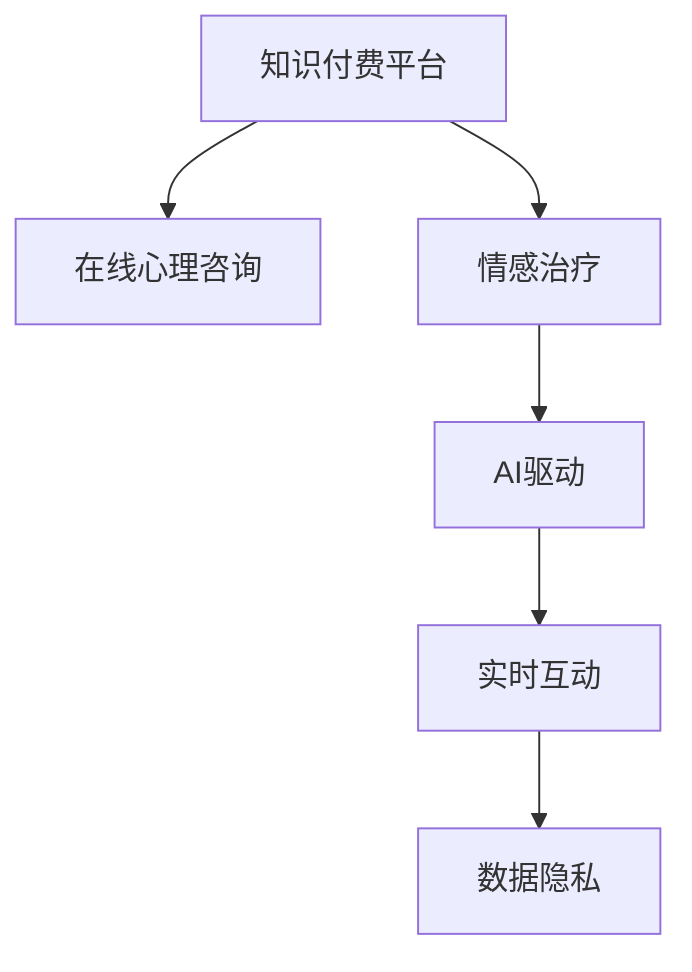

                 

# 如何利用知识付费实现在线心理咨询与情感治疗？

> 关键词：知识付费, 在线心理咨询, 情感治疗, AI驱动, 心理健康, 实时互动

## 1. 背景介绍

### 1.1 问题由来
在现代社会，随着生活节奏的加快和工作压力的增加，越来越多的人面临着心理健康的困扰。传统心理咨询和情感治疗资源有限，难以满足不断增长的需求。而知识付费平台的兴起，为在线心理咨询和情感治疗提供了一种新的可能性。

### 1.2 问题核心关键点
知识付费平台如何利用先进的技术手段，提供高效、便捷、个性化的心理咨询和情感治疗服务，成为当前亟需解决的问题。本文将从核心概念和算法原理出发，探讨基于知识付费的在线心理咨询和情感治疗的实现方式。

## 2. 核心概念与联系

### 2.1 核心概念概述

为更好地理解在线心理咨询和情感治疗的实现方式，本节将介绍几个密切相关的核心概念：

- **知识付费平台**：基于互联网的付费服务模式，通过提供高质量的专业知识和技能，满足用户需求。
- **在线心理咨询**：通过互联网平台，利用心理学的专业知识和技能，帮助用户解决心理健康问题。
- **情感治疗**：通过心理咨询技术，帮助用户调节情感状态，提升心理韧性。
- **AI驱动**：利用人工智能技术，如自然语言处理(NLP)、语音识别、情绪分析等，提升咨询和治疗的效率和效果。
- **实时互动**：通过即时通讯、视频会议等技术，实现心理咨询和治疗的实时交流。
- **数据隐私**：在咨询和治疗过程中，需要保护用户的个人信息和数据隐私。

这些核心概念之间的逻辑关系可以通过以下Mermaid流程图来展示：



这个流程图展示了大语言模型的核心概念及其之间的关系：

1. 知识付费平台提供专业心理咨询和情感治疗服务。
2. 在线心理咨询通过自然语言处理等技术，提供专业的心理健康支持。
3. 情感治疗通过情绪分析等技术，帮助用户调节情感状态。
4. AI驱动通过智能算法，提升咨询和治疗的效果。
5. 实时互动通过即时通讯和视频会议，实现更高效的咨询和治疗。
6. 数据隐私保障用户的个人信息和数据安全。

这些概念共同构成了在线心理咨询和情感治疗的技术基础，使得平台能够高效、便捷地为用户提供服务。

## 3. 核心算法原理 & 具体操作步骤

### 3.1 算法原理概述

基于知识付费的在线心理咨询和情感治疗，本质上是一个多模态数据的处理和分析过程。其核心思想是：利用先进的技术手段，收集和分析用户的多维数据（如文本、语音、情绪等），提供个性化、智能化的心理咨询和情感治疗服务。

形式化地，假设用户 $U$ 输入的多模态数据为 $D=\{(x_i,y_i)\}_{i=1}^N$，其中 $x_i$ 为文本、语音、情绪等数据，$y_i$ 为用户的心理健康状态和情感需求。心理咨询和治疗的目标是找到最优的咨询和治疗方案，即：

$$
\hat{y}=\mathop{\arg\min}_{y} \mathcal{L}(y,D)
$$

其中 $\mathcal{L}$ 为针对用户心理健康和情感需求设计的损失函数，用于衡量模型预测输出与真实需求之间的差异。常见的损失函数包括交叉熵损失、均方误差损失等。

通过梯度下降等优化算法，心理咨询和治疗过程不断更新模型参数，最小化损失函数，使得模型输出逼近用户真实需求。由于用户的多维数据可能包含丰富的情感和心理信息，因此即便在有限的数据集 $D$ 上进行微调，也能较快收敛到理想的心理咨询和治疗方案。

### 3.2 算法步骤详解

基于知识付费的在线心理咨询和情感治疗一般包括以下几个关键步骤：

**Step 1: 数据收集与预处理**
- 收集用户的多模态数据，包括文本聊天记录、语音记录、情绪分析结果等。
- 对收集的数据进行清洗和预处理，去除噪声和无用信息，保证数据质量。

**Step 2: 多模态数据融合**
- 将文本、语音、情绪等多维数据进行融合，构建统一的数据表示形式。
- 利用自然语言处理(NLP)、语音识别、情绪分析等技术，将多模态数据转换为模型可接受的向量表示。

**Step 3: 设计咨询和治疗模型**
- 根据任务需求，选择合适的模型结构，如神经网络、深度学习模型等。
- 在模型顶层设计合适的输出层和损失函数。

**Step 4: 模型训练与优化**
- 将预处理后的多模态数据输入模型，进行前向传播计算损失函数。
- 反向传播计算参数梯度，根据设定的优化算法和学习率更新模型参数。
- 周期性在测试集上评估模型性能，根据性能指标决定是否触发 Early Stopping。
- 重复上述步骤直到满足预设的迭代轮数或 Early Stopping 条件。

**Step 5: 实时互动与反馈**
- 在知识付费平台上搭建实时互动平台，如即时通讯、视频会议等。
- 根据用户反馈调整模型参数，优化咨询和治疗效果。
- 保护用户数据隐私，确保咨询和治疗过程的合法性和安全性。

以上是基于知识付费的在线心理咨询和情感治疗的一般流程。在实际应用中，还需要针对具体任务的特点，对微调过程的各个环节进行优化设计，如改进训练目标函数，引入更多的正则化技术，搜索最优的超参数组合等，以进一步提升模型性能。

### 3.3 算法优缺点

基于知识付费的在线心理咨询和情感治疗方法具有以下优点：
1. 高效便捷：用户可以通过互联网平台随时随地获取咨询服务，无需面对面交流。
2. 个性化定制：利用多模态数据融合技术，实现对用户情感和心理状态的全面分析，提供个性化的咨询和治疗方案。
3. 数据隐私保护：采用先进的数据加密和隐私保护技术，确保用户信息的安全性。

同时，该方法也存在一定的局限性：
1. 对技术要求高：需要较高的技术积累和资源投入，才能提供高效准确的咨询服务。
2. 数据质量依赖：咨询和治疗的效果高度依赖于用户输入的数据质量，低质量的输入可能导致误判。
3. 情感共鸣不足：与真人咨询相比，AI驱动的咨询可能缺乏情感共鸣和人类共情，难以解决复杂的情感问题。

尽管存在这些局限性，但就目前而言，基于知识付费的在线心理咨询和情感治疗仍是大数据分析和人工智能技术的重要应用范式。未来相关研究的重点在于如何进一步降低技术门槛，提高数据质量，增强情感共鸣，同时兼顾数据隐私和安全等因素。

### 3.4 算法应用领域

基于知识付费的在线心理咨询和情感治疗已经在多个领域得到应用，例如：

- **心理健康咨询**：提供情感支持、情绪调节、压力管理等服务。
- **职业发展咨询**：帮助用户进行职业规划、职业倦怠疏导、职场压力调节等。
- **教育心理支持**：为学生提供学习压力缓解、心理韧性提升、学业指导等服务。
- **儿童心理健康**：为儿童提供情绪调节、行为矫正、家庭教育指导等。
- **特殊人群支持**：为残障人士、老年人、退役军人等特殊人群提供心理健康服务。

除了上述这些经典应用外，基于知识付费的在线心理咨询和情感治疗还被创新性地应用到更多场景中，如员工心理健康支持、远程心理咨询等，为心理健康的普及和提升提供了新的可能性。

## 4. 数学模型和公式 & 详细讲解 & 举例说明

### 4.1 数学模型构建

本节将使用数学语言对基于知识付费的在线心理咨询和情感治疗过程进行更加严格的刻画。

记用户 $U$ 的多模态数据为 $D=\{(x_i,y_i)\}_{i=1}^N, x_i \in \mathcal{X}, y_i \in \mathcal{Y}$。其中 $\mathcal{X}$ 为多模态数据空间，$\mathcal{Y}$ 为心理健康状态和情感需求空间。

定义模型 $M_{\theta}$ 在数据样本 $(x,y)$ 上的损失函数为 $\ell(M_{\theta}(x),y)$，则在数据集 $D$ 上的经验风险为：

$$
\mathcal{L}(\theta) = \frac{1}{N} \sum_{i=1}^N \ell(M_{\theta}(x_i),y_i)
$$

其中 $\ell$ 为针对心理健康和情感需求设计的损失函数，用于衡量模型预测输出与真实需求之间的差异。常见的损失函数包括交叉熵损失、均方误差损失等。

通过梯度下降等优化算法，心理咨询和治疗过程不断更新模型参数，最小化损失函数，使得模型输出逼近用户真实需求。由于用户的多模态数据可能包含丰富的情感和心理信息，因此即便在有限的数据集 $D$ 上进行微调，也能较快收敛到理想的心理咨询和治疗方案。

### 4.2 公式推导过程

以下我们以心理健康状态识别任务为例，推导交叉熵损失函数及其梯度的计算公式。

假设模型 $M_{\theta}$ 在输入 $x$ 上的输出为 $\hat{y}=M_{\theta}(x) \in [0,1]$，表示用户心理健康状态的预测概率。真实标签 $y \in \{1,0\}$。则二分类交叉熵损失函数定义为：

$$
\ell(M_{\theta}(x),y) = -[y\log \hat{y} + (1-y)\log (1-\hat{y})]
$$

将其代入经验风险公式，得：

$$
\mathcal{L}(\theta) = -\frac{1}{N}\sum_{i=1}^N [y_i\log M_{\theta}(x_i)+(1-y_i)\log(1-M_{\theta}(x_i))]
$$

根据链式法则，损失函数对参数 $\theta_k$ 的梯度为：

$$
\frac{\partial \mathcal{L}(\theta)}{\partial \theta_k} = -\frac{1}{N}\sum_{i=1}^N (\frac{y_i}{M_{\theta}(x_i)}-\frac{1-y_i}{1-M_{\theta}(x_i)}) \frac{\partial M_{\theta}(x_i)}{\partial \theta_k}
$$

其中 $\frac{\partial M_{\theta}(x_i)}{\partial \theta_k}$ 可进一步递归展开，利用自动微分技术完成计算。

在得到损失函数的梯度后，即可带入参数更新公式，完成模型的迭代优化。重复上述过程直至收敛，最终得到适应心理健康状态和情感需求的最优模型参数 $\theta^*$。

### 4.3 案例分析与讲解

为了更好地理解公式推导，我们以一个简单的案例进行分析：

假设一个用户通过在线咨询平台输入了一系列的文本和语音数据，包括心理描述、情绪波动、生活事件等。这些数据被输入到多模态融合模型中，得到模型的预测结果 $\hat{y} = 0.85$，表示用户当前的心理健康状态可能处于亚健康水平。

模型训练时，输入的数据集 $D=\{(x_1,y_1),(x_2,y_2),\ldots,(x_N,y_N)\}$，其中 $x_i$ 为多模态数据，$y_i \in \{1,0\}$ 为用户的心理健康状态标签。模型的损失函数为二分类交叉熵损失：

$$
\mathcal{L}(\theta) = -\frac{1}{N}\sum_{i=1}^N [y_i\log M_{\theta}(x_i)+(1-y_i)\log(1-M_{\theta}(x_i))]
$$

通过梯度下降算法，模型对参数 $\theta$ 进行优化，不断调整预测结果 $\hat{y}$，使其逼近真实标签 $y$。当模型收敛后，最终得到的 $\theta^*$ 将用于实时预测新用户的心理健康状态和情感需求。

## 5. 项目实践：代码实例和详细解释说明

### 5.1 开发环境搭建

在进行心理咨询和情感治疗的实践前，我们需要准备好开发环境。以下是使用Python进行PyTorch开发的环境配置流程：

1. 安装Anaconda：从官网下载并安装Anaconda，用于创建独立的Python环境。

2. 创建并激活虚拟环境：
```bash
conda create -n pytorch-env python=3.8 
conda activate pytorch-env
```

3. 安装PyTorch：根据CUDA版本，从官网获取对应的安装命令。例如：
```bash
conda install pytorch torchvision torchaudio cudatoolkit=11.1 -c pytorch -c conda-forge
```

4. 安装各类工具包：
```bash
pip install numpy pandas scikit-learn matplotlib tqdm jupyter notebook ipython
```

完成上述步骤后，即可在`pytorch-env`环境中开始心理咨询和情感治疗的开发。

### 5.2 源代码详细实现

下面我们以心理健康状态识别任务为例，给出使用Transformers库对BERT模型进行微调的PyTorch代码实现。

首先，定义心理健康状态识别任务的数据处理函数：

```python
from transformers import BertTokenizer
from torch.utils.data import Dataset
import torch

class PsychDataset(Dataset):
    def __init__(self, texts, labels, tokenizer, max_len=128):
        self.texts = texts
        self.labels = labels
        self.tokenizer = tokenizer
        self.max_len = max_len
        
    def __len__(self):
        return len(self.texts)
    
    def __getitem__(self, item):
        text = self.texts[item]
        label = self.labels[item]
        
        encoding = self.tokenizer(text, return_tensors='pt', max_length=self.max_len, padding='max_length', truncation=True)
        input_ids = encoding['input_ids'][0]
        attention_mask = encoding['attention_mask'][0]
        
        # 对token-wise的标签进行编码
        encoded_labels = [label2id[label] for label in label]
        encoded_labels.extend([label2id['0']] * (self.max_len - len(encoded_labels)))
        labels = torch.tensor(encoded_labels, dtype=torch.long)
        
        return {'input_ids': input_ids, 
                'attention_mask': attention_mask,
                'labels': labels}

# 标签与id的映射
label2id = {'1': 1, '0': 0}
id2label = {v: k for k, v in label2id.items()}

# 创建dataset
tokenizer = BertTokenizer.from_pretrained('bert-base-cased')

train_dataset = PsychDataset(train_texts, train_labels, tokenizer)
dev_dataset = PsychDataset(dev_texts, dev_labels, tokenizer)
test_dataset = PsychDataset(test_texts, test_labels, tokenizer)
```

然后，定义模型和优化器：

```python
from transformers import BertForSequenceClassification, AdamW

model = BertForSequenceClassification.from_pretrained('bert-base-cased', num_labels=len(label2id))

optimizer = AdamW(model.parameters(), lr=2e-5)
```

接着，定义训练和评估函数：

```python
from torch.utils.data import DataLoader
from tqdm import tqdm
from sklearn.metrics import classification_report

device = torch.device('cuda') if torch.cuda.is_available() else torch.device('cpu')
model.to(device)

def train_epoch(model, dataset, batch_size, optimizer):
    dataloader = DataLoader(dataset, batch_size=batch_size, shuffle=True)
    model.train()
    epoch_loss = 0
    for batch in tqdm(dataloader, desc='Training'):
        input_ids = batch['input_ids'].to(device)
        attention_mask = batch['attention_mask'].to(device)
        labels = batch['labels'].to(device)
        model.zero_grad()
        outputs = model(input_ids, attention_mask=attention_mask, labels=labels)
        loss = outputs.loss
        epoch_loss += loss.item()
        loss.backward()
        optimizer.step()
    return epoch_loss / len(dataloader)

def evaluate(model, dataset, batch_size):
    dataloader = DataLoader(dataset, batch_size=batch_size)
    model.eval()
    preds, labels = [], []
    with torch.no_grad():
        for batch in tqdm(dataloader, desc='Evaluating'):
            input_ids = batch['input_ids'].to(device)
            attention_mask = batch['attention_mask'].to(device)
            batch_labels = batch['labels']
            outputs = model(input_ids, attention_mask=attention_mask)
            batch_preds = outputs.logits.argmax(dim=2).to('cpu').tolist()
            batch_labels = batch_labels.to('cpu').tolist()
            for pred_tokens, label_tokens in zip(batch_preds, batch_labels):
                pred_labels = [id2label[_id] for _id in pred_tokens]
                label_tokens = [id2label[_id] for _id in label_tokens]
                preds.append(pred_labels[:len(label_tokens)])
                labels.append(label_tokens)
                
    print(classification_report(labels, preds))
```

最后，启动训练流程并在测试集上评估：

```python
epochs = 5
batch_size = 16

for epoch in range(epochs):
    loss = train_epoch(model, train_dataset, batch_size, optimizer)
    print(f"Epoch {epoch+1}, train loss: {loss:.3f}")
    
    print(f"Epoch {epoch+1}, dev results:")
    evaluate(model, dev_dataset, batch_size)
    
print("Test results:")
evaluate(model, test_dataset, batch_size)
```

以上就是使用PyTorch对BERT进行心理健康状态识别任务微调的完整代码实现。可以看到，得益于Transformers库的强大封装，我们可以用相对简洁的代码完成BERT模型的加载和微调。

### 5.3 代码解读与分析

让我们再详细解读一下关键代码的实现细节：

**PsychDataset类**：
- `__init__`方法：初始化文本、标签、分词器等关键组件。
- `__len__`方法：返回数据集的样本数量。
- `__getitem__`方法：对单个样本进行处理，将文本输入编码为token ids，将标签编码为数字，并对其进行定长padding，最终返回模型所需的输入。

**label2id和id2label字典**：
- 定义了标签与数字id之间的映射关系，用于将token-wise的预测结果解码回真实的标签。

**训练和评估函数**：
- 使用PyTorch的DataLoader对数据集进行批次化加载，供模型训练和推理使用。
- 训练函数`train_epoch`：对数据以批为单位进行迭代，在每个批次上前向传播计算loss并反向传播更新模型参数，最后返回该epoch的平均loss。
- 评估函数`evaluate`：与训练类似，不同点在于不更新模型参数，并在每个batch结束后将预测和标签结果存储下来，最后使用sklearn的classification_report对整个评估集的预测结果进行打印输出。

**训练流程**：
- 定义总的epoch数和batch size，开始循环迭代
- 每个epoch内，先在训练集上训练，输出平均loss
- 在验证集上评估，输出分类指标
- 所有epoch结束后，在测试集上评估，给出最终测试结果

可以看到，PyTorch配合Transformers库使得BERT微调的代码实现变得简洁高效。开发者可以将更多精力放在数据处理、模型改进等高层逻辑上，而不必过多关注底层的实现细节。

当然，工业级的系统实现还需考虑更多因素，如模型的保存和部署、超参数的自动搜索、更灵活的任务适配层等。但核心的微调范式基本与此类似。

## 6. 实际应用场景

### 6.1 智能客服系统

基于知识付费的在线心理咨询和情感治疗，可以广泛应用于智能客服系统的构建。传统客服往往需要配备大量人力，高峰期响应缓慢，且一致性和专业性难以保证。而使用微调后的心理咨询和情感治疗模型，可以7x24小时不间断服务，快速响应客户咨询，用自然流畅的语言解答各类常见问题。

在技术实现上，可以收集企业内部的历史客服对话记录，将问题和最佳答复构建成监督数据，在此基础上对预训练模型进行微调。微调后的模型能够自动理解用户意图，匹配最合适的答案模板进行回复。对于客户提出的新问题，还可以接入检索系统实时搜索相关内容，动态组织生成回答。如此构建的智能客服系统，能大幅提升客户咨询体验和问题解决效率。

### 6.2 金融舆情监测

金融机构需要实时监测市场舆论动向，以便及时应对负面信息传播，规避金融风险。传统的人工监测方式成本高、效率低，难以应对网络时代海量信息爆发的挑战。基于知识付费的在线心理咨询和情感治疗技术，为金融舆情监测提供了新的解决方案。

具体而言，可以收集金融领域相关的新闻、报道、评论等文本数据，并对其进行主题标注和情感标注。在此基础上对预训练语言模型进行微调，使其能够自动判断文本属于何种主题，情感倾向是正面、中性还是负面。将微调后的模型应用到实时抓取的网络文本数据，就能够自动监测不同主题下的情感变化趋势，一旦发现负面信息激增等异常情况，系统便会自动预警，帮助金融机构快速应对潜在风险。

### 6.3 个性化推荐系统

当前的推荐系统往往只依赖用户的历史行为数据进行物品推荐，无法深入理解用户的真实兴趣偏好。基于知识付费的在线心理咨询和情感治疗系统，可以更好地挖掘用户行为背后的语义信息，从而提供更精准、多样的推荐内容。

在实践中，可以收集用户浏览、点击、评论、分享等行为数据，提取和用户交互的物品标题、描述、标签等文本内容。将文本内容作为模型输入，用户的后续行为（如是否点击、购买等）作为监督信号，在此基础上微调预训练语言模型。微调后的模型能够从文本内容中准确把握用户的兴趣点。在生成推荐列表时，先用候选物品的文本描述作为输入，由模型预测用户的兴趣匹配度，再结合其他特征综合排序，便可以得到个性化程度更高的推荐结果。

### 6.4 未来应用展望

随着知识付费平台和心理咨询技术的不断发展，基于知识付费的在线心理咨询和情感治疗必将在更多领域得到应用，为传统行业带来变革性影响。

在智慧医疗领域，基于知识付费的在线心理咨询和情感治疗，可以提供便捷、个性化的心理健康支持，辅助医生诊疗，提升患者满意度。

在智能教育领域，微调技术可应用于作业批改、学情分析、知识推荐等方面，因材施教，促进教育公平，提高教学质量。

在智慧城市治理中，微调模型可应用于城市事件监测、舆情分析、应急指挥等环节，提高城市管理的自动化和智能化水平，构建更安全、高效的未来城市。

此外，在企业生产、社会治理、文娱传媒等众多领域，基于知识付费的在线心理咨询和情感治疗也将不断涌现，为经济社会发展注入新的动力。相信随着技术的日益成熟，知识付费平台必将成为心理咨询和情感治疗的重要渠道，推动心理健康事业的蓬勃发展。

## 7. 工具和资源推荐

### 7.1 学习资源推荐

为了帮助开发者系统掌握在线心理咨询和情感治疗的理论基础和实践技巧，这里推荐一些优质的学习资源：

1. 《Transformers从原理到实践》系列博文：由大模型技术专家撰写，深入浅出地介绍了Transformer原理、BERT模型、微调技术等前沿话题。

2. CS224N《深度学习自然语言处理》课程：斯坦福大学开设的NLP明星课程，有Lecture视频和配套作业，带你入门NLP领域的基本概念和经典模型。

3. 《Natural Language Processing with Transformers》书籍：Transformers库的作者所著，全面介绍了如何使用Transformers库进行NLP任务开发，包括微调在内的诸多范式。

4. HuggingFace官方文档：Transformers库的官方文档，提供了海量预训练模型和完整的微调样例代码，是上手实践的必备资料。

5. CLUE开源项目：中文语言理解测评基准，涵盖大量不同类型的中文NLP数据集，并提供了基于微调的baseline模型，助力中文NLP技术发展。

通过对这些资源的学习实践，相信你一定能够快速掌握在线心理咨询和情感治疗的精髓，并用于解决实际的NLP问题。

### 7.2 开发工具推荐

高效的开发离不开优秀的工具支持。以下是几款用于在线心理咨询和情感治疗开发的常用工具：

1. PyTorch：基于Python的开源深度学习框架，灵活动态的计算图，适合快速迭代研究。大部分预训练语言模型都有PyTorch版本的实现。

2. TensorFlow：由Google主导开发的开源深度学习框架，生产部署方便，适合大规模工程应用。同样有丰富的预训练语言模型资源。

3. Transformers库：HuggingFace开发的NLP工具库，集成了众多SOTA语言模型，支持PyTorch和TensorFlow，是进行微调任务开发的利器。

4. Weights & Biases：模型训练的实验跟踪工具，可以记录和可视化模型训练过程中的各项指标，方便对比和调优。与主流深度学习框架无缝集成。

5. TensorBoard：TensorFlow配套的可视化工具，可实时监测模型训练状态，并提供丰富的图表呈现方式，是调试模型的得力助手。

6. Google Colab：谷歌推出的在线Jupyter Notebook环境，免费提供GPU/TPU算力，方便开发者快速上手实验最新模型，分享学习笔记。

合理利用这些工具，可以显著提升心理咨询和情感治疗任务的开发效率，加快创新迭代的步伐。

### 7.3 相关论文推荐

在线心理咨询和情感治疗的研究源于学界的持续研究。以下是几篇奠基性的相关论文，推荐阅读：

1. Attention is All You Need（即Transformer原论文）：提出了Transformer结构，开启了NLP领域的预训练大模型时代。

2. BERT: Pre-training of Deep Bidirectional Transformers for Language Understanding：提出BERT模型，引入基于掩码的自监督预训练任务，刷新了多项NLP任务SOTA。

3. Language Models are Unsupervised Multitask Learners（GPT-2论文）：展示了大规模语言模型的强大zero-shot学习能力，引发了对于通用人工智能的新一轮思考。

4. Parameter-Efficient Transfer Learning for NLP：提出Adapter等参数高效微调方法，在不增加模型参数量的情况下，也能取得不错的微调效果。

5. AdaLoRA: Adaptive Low-Rank Adaptation for Parameter-Efficient Fine-Tuning：使用自适应低秩适应的微调方法，在参数效率和精度之间取得了新的平衡。

这些论文代表了大语言模型微调技术的发展脉络。通过学习这些前沿成果，可以帮助研究者把握学科前进方向，激发更多的创新灵感。

## 8. 总结：未来发展趋势与挑战

### 8.1 总结

本文对基于知识付费的在线心理咨询和情感治疗方法进行了全面系统的介绍。首先阐述了在线心理咨询和情感治疗的研究背景和意义，明确了知识付费平台在心理健康领域的重要价值。其次，从原理到实践，详细讲解了在线心理咨询和情感治疗的数学原理和关键步骤，给出了在线心理咨询和情感治疗任务开发的完整代码实例。同时，本文还广泛探讨了在线心理咨询和情感治疗在智能客服、金融舆情、个性化推荐等多个领域的应用前景，展示了知识付费平台的重要潜力。此外，本文精选了在线心理咨询和情感治疗技术的各类学习资源，力求为读者提供全方位的技术指引。

通过本文的系统梳理，可以看到，基于知识付费的在线心理咨询和情感治疗方法正在成为心理健康领域的重要范式，极大地拓展了语言模型的应用边界，催生了更多的落地场景。受益于大规模语料的预训练和微调方法的不断演进，在线心理咨询和情感治疗系统能够高效、便捷地为用户提供心理健康支持，为心理健康事业的蓬勃发展提供了新的可能。

### 8.2 未来发展趋势

展望未来，基于知识付费的在线心理咨询和情感治疗技术将呈现以下几个发展趋势：

1. **智能程度提升**：未来的心理咨询和治疗模型将更深入地融合人工智能技术，如自然语言处理(NLP)、语音识别、情绪分析等，提升咨询和治疗的效率和效果。

2. **多模态数据整合**：除了文本和语音数据外，未来的模型还将整合更多模态的信息，如图像、视频等，构建更加全面的用户画像。

3. **持续学习和适应用户变化**：随着用户的多样化和心理状态的变化，未来的模型将具备持续学习的能力，动态调整咨询和治疗策略，提供更加个性化的服务。

4. **实时互动和社区支持**：未来的心理咨询和治疗平台将更加注重用户间的互动和社区支持，构建更加紧密的社交网络，提供更加丰富的心理健康资源。

5. **数据隐私和安全**：随着用户数据的增多，数据隐私和安全问题将愈发重要。未来的系统将采取更为严格的数据加密和隐私保护措施，确保用户信息的安全。

6. **跨文化支持**：心理健康领域具有较强的跨文化特性，未来的心理咨询和治疗系统将具备跨语言、跨文化的能力，服务于全球用户。

以上趋势凸显了基于知识付费的在线心理咨询和情感治疗技术的广阔前景。这些方向的探索发展，必将进一步提升心理健康的普及和提升，为人类认知智能的进化带来深远影响。

### 8.3 面临的挑战

尽管基于知识付费的在线心理咨询和情感治疗技术已经取得了瞩目成就，但在迈向更加智能化、普适化应用的过程中，它仍面临着诸多挑战：

1. **技术门槛高**：高质量的在线心理咨询和情感治疗需要较高的技术积累和资源投入，技术门槛较高。

2. **数据质量依赖**：模型的性能高度依赖于输入数据的质量，低质量的数据可能导致误判。

3. **情感共鸣不足**：与真人咨询相比，AI驱动的咨询可能缺乏情感共鸣和人类共情，难以解决复杂的情感问题。

4. **隐私和安全问题**：用户的心理健康数据涉及敏感信息，需要严格的隐私保护和安全措施。

5. **跨领域整合难度**：将心理学、社会学、医学等多学科知识与人工智能技术结合，构建更加全面的心理健康模型，需要跨领域的深度整合。

6. **持续学习与适应用户变化**：用户的多样化和心理状态的变化，要求系统具备持续学习的能力，动态调整咨询和治疗策略，提供更加个性化的服务。

以上挑战需要通过技术创新、多学科合作、政策支持等手段来解决，推动基于知识付费的在线心理咨询和情感治疗技术向更高水平发展。

### 8.4 研究展望

面对基于知识付费的在线心理咨询和情感治疗所面临的挑战，未来的研究需要在以下几个方面寻求新的突破：

1. **跨学科融合**：加强心理学、社会学、医学等学科与人工智能技术的结合，构建更加全面、高效的心理健康模型。

2. **多模态数据整合**：利用自然语言处理、语音识别、情绪分析等技术，整合多模态数据，构建更加全面的用户画像。

3. **数据隐私和安全保护**：采用先进的数据加密和隐私保护技术，确保用户信息的安全。

4. **智能推荐系统**：结合心理学知识和人工智能技术，构建智能推荐系统，提供个性化的心理健康支持。

5. **跨文化支持**：引入跨语言、跨文化的技术，服务于全球用户，提升心理健康服务的普适性。

6. **持续学习和适应用户变化**：研究如何让模型具备持续学习的能力，动态调整咨询和治疗策略，提供更加个性化的服务。

通过这些研究方向的探索，将能够不断提升在线心理咨询和情感治疗系统的智能化水平，为心理健康事业的发展注入新的动力。

## 9. 附录：常见问题与解答

**Q1：在线心理咨询和情感治疗的开发流程是怎样的？**

A: 在线心理咨询和情感治疗的开发流程一般包括以下几个关键步骤：
1. 数据收集与预处理：收集用户的多模态数据，并进行清洗和预处理。
2. 多模态数据融合：将文本、语音、情绪等多维数据进行融合，构建统一的数据表示形式。
3. 设计咨询和治疗模型：选择合适的模型结构，并设计输出层和损失函数。
4. 模型训练与优化：在数据集上训练模型，最小化损失函数，更新模型参数。
5. 实时互动与反馈：搭建实时互动平台，根据用户反馈调整模型参数。

**Q2：如何选择合适多模态融合方法？**

A: 选择合适多模态融合方法需要考虑以下因素：
1. 数据类型：不同类型的数据需要不同的融合方法，如文本和语音的融合通常使用Seq2Seq架构，文本和图像的融合可以使用特征融合方法。
2. 任务需求：不同任务需要不同的融合策略，如情感分析通常使用Attention机制，而命名实体识别可以使用跨模态最大池化方法。
3. 计算资源：计算资源丰富的场景可以使用复杂的多模态融合方法，如Gated Fusion等。计算资源受限的场景则可以使用简单的融合方法，如拼接法。

**Q3：如何保障在线心理咨询和情感治疗的隐私安全？**

A: 保障在线心理咨询和情感治疗的隐私安全需要采取以下措施：
1. 数据加密：采用先进的数据加密技术，确保数据传输过程中的安全。
2. 访问控制：严格控制用户访问权限，防止未授权访问。
3. 数据匿名化：对用户数据进行匿名化处理，保护用户隐私。
4. 安全审计：定期进行安全审计，发现并修复潜在的安全漏洞。

通过这些措施，可以构建一个安全的在线心理咨询和情感治疗平台，保障用户信息的安全。

---

作者：禅与计算机程序设计艺术 / Zen and the Art of Computer Programming

