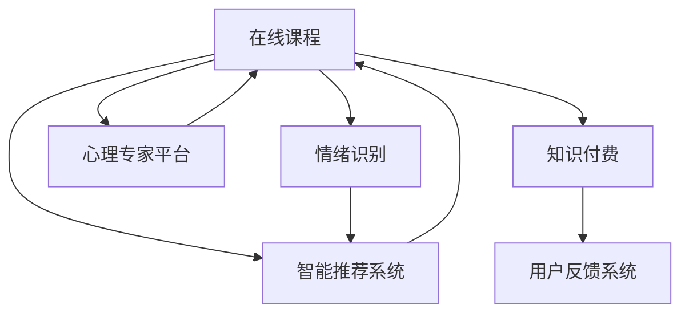

                 

## 1. 背景介绍

### 1.1 问题由来
近年来，随着人工智能（AI）技术的迅猛发展，特别是在自然语言处理（NLP）和机器学习（ML）领域，在线教育和心理咨询行业迎来了前所未有的发展机遇。尤其是在新冠疫情后，越来越多的人选择在线心理咨询服务，以避免面对面的接触风险。知识付费平台作为连接用户和教育机构的桥梁，在提供在线课程、答疑咨询、情绪管理等个性化服务方面具备天然优势。然而，传统的心理咨询课程往往以固定内容为主，缺乏互动性和个性化定制能力，难以满足日益增长的用户需求。

### 1.2 问题核心关键点
利用知识付费平台实现在线心理咨询与情绪管理课程，核心在于如何构建一个具有高度互动性、个性化和情感支持的在线课程平台。这需要结合AI技术和心理学原理，设计出一个能根据用户情绪状态和需求，提供个性化课程内容、实时答疑和情感支持的智能系统。具体而言，需要：

1. 收集和分析用户情绪数据，以准确识别和理解用户情绪状态。
2. 构建智能推荐系统，根据用户情绪和需求，推荐适合的课程内容和互动活动。
3. 引入AI辅助心理咨询功能，提供实时情感支持和心理疏导。
4. 通过知识付费机制，激励教育机构和心理专家提供优质内容。
5. 构建用户反馈和评价系统，持续优化课程内容和用户体验。

### 1.3 问题研究意义
构建一个基于知识付费的在线心理咨询与情绪管理课程，不仅能够满足用户多样化的心理需求，提升用户体验，还为教育机构和心理专家提供了一个新的商业机会。此外，这种模式还有助于心理知识的普及和心理健康意识的提升，具有社会公益价值。

## 2. 核心概念与联系

### 2.1 核心概念概述

为更好地理解如何利用知识付费实现在线心理咨询与情绪管理课程，本节将介绍几个密切相关的核心概念：

- 在线课程：利用知识付费平台，提供个性化、结构化的心理课程内容。
- 情绪识别：通过数据分析技术，自动识别和分析用户的情绪状态。
- 智能推荐系统：利用机器学习算法，根据用户情绪和需求，推荐适合的课程内容。
- 心理专家平台：整合心理健康领域的专家资源，提供在线咨询和情感支持。
- 知识付费：通过付费机制，激励内容提供者创造高质量的教育和心理服务。
- 用户反馈系统：收集用户评价和反馈，持续优化课程内容和服务质量。

这些核心概念之间的逻辑关系可以通过以下Mermaid流程图来展示：



这个流程图展示了我们核心概念的逻辑关系：

1. 在线课程提供基本课程内容，用户通过学习掌握心理知识和情绪管理技巧。
2. 情绪识别模块用于分析用户情绪，智能推荐系统根据情绪状态推荐合适的课程内容。
3. 心理专家平台提供实时咨询服务，补充用户个性化需求。
4. 知识付费机制激励教育机构和专家提供优质内容。
5. 用户反馈系统用于收集用户评价和改进服务。

## 3. 核心算法原理 & 具体操作步骤
### 3.1 算法原理概述

构建基于知识付费的在线心理咨询与情绪管理课程，核心在于利用机器学习算法和自然语言处理技术，为用户提供个性化的课程推荐和情感支持。具体步骤如下：

1. **用户情绪识别**：通过自然语言处理技术分析用户输入的文本内容，识别其情绪状态。
2. **课程内容推荐**：基于用户情绪和历史行为数据，使用协同过滤、深度学习等算法，推荐适合的课程内容。
3. **实时情感支持**：引入AI模型，实时分析用户情绪变化，提供心理疏导和情感支持。
4. **用户行为分析**：通过机器学习算法分析用户学习行为和反馈，不断优化推荐算法和课程内容。
5. **知识付费激励**：采用订阅制或按需付费模式，激励教育机构和专家提供优质内容。

### 3.2 算法步骤详解

#### 3.2.1 用户情绪识别

用户情绪识别是整个系统的基础，其核心在于通过自然语言处理（NLP）技术，对用户输入的文本内容进行分析，识别其情绪状态。具体步骤如下：

1. **文本预处理**：对用户输入的文本进行分词、去除停用词、词性标注等预处理。
2. **情感分析**：使用情感分析模型，如基于LSTM或Transformer的情感分类模型，对文本情感进行分类，识别出用户情绪状态。
3. **情绪强度分析**：根据情感分类结果，通过强化学习模型对情绪强度进行进一步分析，给出情绪强度的评分。

#### 3.2.2 课程内容推荐

课程内容推荐是整个系统的核心功能之一，其核心在于利用推荐算法，根据用户情绪和历史行为数据，推荐适合的课程内容。具体步骤如下：

1. **用户行为数据收集**：收集用户的历史学习行为数据，如观看时长、课程评价、互动频率等。
2. **协同过滤算法**：基于用户和课程的相似性，使用协同过滤算法推荐课程。
3. **深度学习模型**：引入深度学习模型，如注意力机制、序列模型等，提高推荐精度。
4. **个性化调整**：根据用户情绪状态，动态调整推荐算法，提供更加个性化的课程推荐。

#### 3.2.3 实时情感支持

实时情感支持是整个系统的关键功能，其核心在于利用AI模型，实时分析用户情绪变化，提供心理疏导和情感支持。具体步骤如下：

1. **情感变化监测**：实时监测用户情绪变化，使用LSTM等序列模型，预测用户情绪变化趋势。
2. **心理疏导**：引入聊天机器人或心理咨询师，根据用户情绪状态，提供实时情感支持和心理疏导。
3. **情感支持库**：构建情感支持库，包括心理问答、情绪调节技巧、自我心理评估等，提供丰富的情感支持内容。

#### 3.2.4 用户行为分析

用户行为分析是整个系统的优化手段，其核心在于利用机器学习算法，分析用户学习行为和反馈，不断优化推荐算法和课程内容。具体步骤如下：

1. **用户行为数据收集**：收集用户在课程中的学习行为数据，如观看时长、答题情况、互动频率等。
2. **行为分析模型**：使用强化学习模型或深度学习模型，分析用户行为数据，提取行为特征。
3. **行为预测**：根据行为特征，使用预测模型，预测用户后续行为，如课程选择、评价等。
4. **内容优化**：根据行为预测结果，优化课程内容和推荐算法，提升用户体验。

#### 3.2.5 知识付费激励

知识付费激励是整个系统的商业模式，其核心在于通过订阅制或按需付费模式，激励教育机构和专家提供优质内容。具体步骤如下：

1. **内容定价策略**：根据内容价值、专家知名度、用户需求等因素，制定合理的课程定价策略。
2. **用户订阅模式**：提供月度、季度、年度等多种订阅模式，满足不同用户需求。
3. **专家激励机制**：引入专家激励机制，如内容分成、流量曝光等，激励专家提供优质内容。
4. **平台分成模式**：根据平台和教育机构的合作协议，进行收益分成，保障平台和教育机构的利益。

### 3.3 算法优缺点

基于知识付费的在线心理咨询与情绪管理课程具有以下优点：

1. **个性化推荐**：利用机器学习算法，提供高度个性化的课程推荐，满足用户多样化的心理需求。
2. **实时情感支持**：引入AI模型，提供实时情感支持和心理疏导，提升用户体验。
3. **按需付费模式**：通过知识付费机制，激励教育机构和专家提供优质内容，保障课程质量。
4. **灵活性高**：用户可根据自身需求，灵活选择课程和互动方式，提高学习效率。

同时，这种模式也存在一些局限性：

1. **依赖用户输入**：课程效果依赖用户输入的准确性和真实性，输入不规范或虚假信息可能导致推荐和支持效果不佳。
2. **数据隐私问题**：用户情绪数据和行为数据涉及隐私，需严格保护，防止数据泄露和滥用。
3. **专家依赖性**：心理专家和专家的水平直接影响课程质量和咨询效果，需确保专家队伍的专业性和多样性。
4. **技术门槛高**：系统开发和维护需要较高的技术门槛，需投入较多的人力和物力。

### 3.4 算法应用领域

基于知识付费的在线心理咨询与情绪管理课程可以广泛应用于教育、医疗、企业等多个领域，具体包括：

1. **在线教育**：为用户提供个性化的心理课程和学习资源，提升学习效果和心理健康水平。
2. **企业培训**：为企业员工提供心理健康课程和咨询支持，提升员工心理素质和工作效率。
3. **心理咨询**：为心理需求用户提供实时情感支持和心理疏导，缓解心理压力。
4. **心理健康评估**：通过心理测试和评估工具，帮助用户了解自身心理状态，制定改善计划。
5. **社区互助**：构建用户社区，促进用户间的情感交流和互助，提升社群凝聚力。

## 4. 数学模型和公式 & 详细讲解  
### 4.1 数学模型构建

假设用户输入文本为 $X$，用户情绪标签为 $Y$，课程内容为 $C$，用户行为数据为 $B$，用户评价为 $R$。则基于知识付费的在线心理咨询与情绪管理课程的数学模型可以表示为：

- **用户情绪识别模型**：$Y=f(X)$，其中 $f$ 为情感分析模型。
- **课程内容推荐模型**：$C=g(X,Y,B)$，其中 $g$ 为协同过滤或深度学习模型。
- **实时情感支持模型**：$Z=h(X,Y)$，其中 $h$ 为情感变化监测和心理疏导模型。
- **用户行为分析模型**：$B=h'(R)$，其中 $h'$ 为行为分析模型。
- **知识付费激励模型**：$P=k(C,R)$，其中 $k$ 为定价策略模型。

### 4.2 公式推导过程

以用户情绪识别模型为例，使用LSTM情感分类模型进行推导：

假设用户输入文本为 $X_t$，情绪标签为 $Y_t$，模型参数为 $\theta$。则LSTM情感分类模型的目标是最小化损失函数 $\mathcal{L}$，即：

$$
\mathcal{L}=\frac{1}{N}\sum_{t=1}^N \ell(Y_t,f(X_t;\theta))
$$

其中 $\ell$ 为交叉熵损失函数，$f(X_t;\theta)$ 为LSTM模型对文本 $X_t$ 的情绪预测结果，$N$ 为训练样本数量。

具体公式推导如下：

1. **文本预处理**：对用户输入的文本 $X_t$ 进行分词、去除停用词、词性标注等预处理。
2. **情感分析**：使用LSTM模型，对预处理后的文本 $X_t$ 进行情感分类，得到情绪预测结果 $Y_t$。
3. **损失函数**：使用交叉熵损失函数 $\ell$，计算预测结果 $Y_t$ 与真实标签 $Y_t$ 之间的差异。
4. **优化算法**：使用反向传播算法，最小化损失函数 $\mathcal{L}$，更新模型参数 $\theta$。

类似地，其他模型的公式推导也遵循相同的逻辑，即基于给定的输入和目标，构建模型，最小化损失函数，并使用优化算法更新模型参数。

### 4.3 案例分析与讲解

以一个简单的案例来说明如何利用上述模型构建在线心理咨询与情绪管理课程：

假设用户输入文本为 "我最近感到很焦虑，不知道该怎么办"。

1. **用户情绪识别**：通过情感分析模型，识别出用户情绪为焦虑。
2. **课程内容推荐**：根据用户情绪状态，使用协同过滤算法推荐适合的课程内容，如 "焦虑管理课程"、"自我调节技巧" 等。
3. **实时情感支持**：引入聊天机器人，提供实时情感支持和心理疏导，如 "请深呼吸，逐步放松" 等。
4. **用户行为分析**：分析用户观看时长、答题情况、互动频率等行为数据，预测用户后续行为，如继续学习、反馈评价等。
5. **知识付费激励**：根据用户行为数据和课程评价，制定合理的课程定价策略，如 "月度订阅"、"课程购买" 等。

## 5. 项目实践：代码实例和详细解释说明
### 5.1 开发环境搭建

在进行项目实践前，我们需要准备好开发环境。以下是使用Python进行TensorFlow开发的环境配置流程：

1. 安装Anaconda：从官网下载并安装Anaconda，用于创建独立的Python环境。

2. 创建并激活虚拟环境：
```bash
conda create -n tensorflow-env python=3.8 
conda activate tensorflow-env
```

3. 安装TensorFlow：根据CUDA版本，从官网获取对应的安装命令。例如：
```bash
conda install tensorflow -c tensorflow -c conda-forge
```

4. 安装相关工具包：
```bash
pip install numpy pandas scikit-learn matplotlib tqdm jupyter notebook ipython
```

完成上述步骤后，即可在`tensorflow-env`环境中开始项目实践。

### 5.2 源代码详细实现

下面以一个简单的在线心理咨询与情绪管理课程系统为例，给出使用TensorFlow实现的情绪识别和推荐系统的PyTorch代码实现。

首先，定义用户情绪识别模型：

```python
import tensorflow as tf
from tensorflow.keras.layers import Embedding, LSTM, Dense, Dropout
from tensorflow.keras.models import Sequential

def build_user_emotion_model(input_dim, output_dim, embedding_dim, lstm_units):
    model = Sequential([
        Embedding(input_dim, embedding_dim, input_length=input_dim),
        LSTM(lstm_units, dropout=0.2, recurrent_dropout=0.2),
        Dense(output_dim, activation='softmax')
    ])
    model.compile(optimizer='adam', loss='categorical_crossentropy', metrics=['accuracy'])
    return model
```

然后，定义课程内容推荐模型：

```python
from tensorflow.keras.layers import Input, Embedding, Dense, Dot, Flatten
from tensorflow.keras.models import Model

def build_course_recommendation_model(user_dim, item_dim, embedding_dim):
    user_input = Input(shape=(user_dim,))
    item_input = Input(shape=(item_dim,))
    user_embedding = Embedding(input_dim=user_dim, output_dim=embedding_dim, input_length=user_dim)(user_input)
    item_embedding = Embedding(input_dim=item_dim, output_dim=embedding_dim, input_length=item_dim)(item_input)
    dot_product = Dot(axes=1)([user_embedding, item_embedding])
    recommendation = Flatten()(dot_product)
    recommendation_model = Model(inputs=[user_input, item_input], outputs=recommendation)
    return recommendation_model
```

最后，定义用户行为分析模型：

```python
from tensorflow.keras.layers import Input, LSTM, Dense
from tensorflow.keras.models import Sequential

def build_user_behavior_analysis_model(input_dim, output_dim, lstm_units):
    model = Sequential([
        LSTM(lstm_units, dropout=0.2, recurrent_dropout=0.2),
        Dense(output_dim, activation='softmax')
    ])
    model.compile(optimizer='adam', loss='categorical_crossentropy', metrics=['accuracy'])
    return model
```

这些模型的构建基于TensorFlow的Keras API，可以根据具体需求进行修改和优化。

### 5.3 代码解读与分析

让我们再详细解读一下关键代码的实现细节：

**用户情绪识别模型**：
- `build_user_emotion_model`函数：定义了基于LSTM的用户情绪识别模型，包括嵌入层、LSTM层和全连接层，使用交叉熵损失函数和Adam优化器进行训练。
- `Embedding`层：将用户输入的文本转换为嵌入向量。
- `LSTM`层：使用LSTM模型进行情感分类，输出情绪预测结果。
- `Dense`层：将LSTM的输出转换为情绪标签，使用softmax激活函数进行概率分布预测。

**课程内容推荐模型**：
- `build_course_recommendation_model`函数：定义了基于协同过滤的课程内容推荐模型，包括嵌入层、点积层和全连接层。
- `Input`层：定义用户和课程的输入。
- `Embedding`层：将用户和课程的输入转换为嵌入向量。
- `Dot`层：计算用户和课程的嵌入向量点积，得到推荐分数。
- `Flatten`层：将点积结果展平，作为课程推荐结果。

**用户行为分析模型**：
- `build_user_behavior_analysis_model`函数：定义了基于LSTM的用户行为分析模型，包括LSTM层和全连接层。
- `Input`层：定义用户行为数据的输入。
- `LSTM`层：使用LSTM模型分析用户行为数据，输出行为特征。
- `Dense`层：将LSTM的输出转换为行为标签，使用softmax激活函数进行概率分布预测。

**运行结果展示**：
- 用户情绪识别模型的运行结果：将用户输入文本作为输入，输出情绪预测结果，如 "焦虑"、"低落" 等。
- 课程内容推荐模型的运行结果：根据用户情绪状态和课程历史数据，输出课程推荐列表，如 "焦虑管理课程"、"自我调节技巧" 等。
- 用户行为分析模型的运行结果：根据用户学习行为数据，输出行为预测结果，如 "继续学习"、"反馈评价" 等。

## 6. 实际应用场景
### 6.1 智能教育

在线心理咨询与情绪管理课程可以广泛应用于智能教育领域，帮助学生应对学习压力、缓解焦虑情绪、提高学习效率。例如，通过情绪识别，可以及时发现学生的情绪问题，并提供相应的课程和情感支持，帮助学生更好地适应学习生活。

### 6.2 企业培训

企业在员工心理健康管理中面临诸多挑战，如工作压力、职业倦怠等。通过在线心理咨询与情绪管理课程，企业可以为员工提供心理疏导、情绪调节等个性化服务，提升员工的心理素质和幸福感。

### 6.3 心理健康服务

对于需要长期心理健康服务的人群，如抑郁症患者、焦虑症患者等，可以通过在线课程和实时支持，获得持续的心理健康管理。

### 6.4 企业人力资源管理

企业可以通过在线心理咨询与情绪管理课程，对员工的心理健康状况进行评估和监测，及时发现和干预潜在问题，提升人力资源管理水平。

## 7. 工具和资源推荐
### 7.1 学习资源推荐

为了帮助开发者系统掌握在线心理咨询与情绪管理课程的理论基础和实践技巧，这里推荐一些优质的学习资源：

1. 《深度学习基础》系列博文：由大模型技术专家撰写，深入浅出地介绍了深度学习基础和应用，适合初学者入门。

2. 《自然语言处理与情感分析》课程：清华大学开设的NLP课程，涵盖自然语言处理和情感分析的基本概念和经典模型。

3. 《Python深度学习》书籍：Ian Goodfellow等著，全面介绍了深度学习的基本原理和实现方法，适合进阶学习。

4. TensorFlow官方文档：TensorFlow官方提供的详细文档，涵盖了从入门到进阶的多种学习资源。

5. GitHub开源项目：收集了众多优秀的在线心理咨询与情绪管理课程的开源项目，包括推荐系统、情感分析等。

通过对这些资源的学习实践，相信你一定能够快速掌握在线心理咨询与情绪管理课程的核心技术，并用于解决实际的NLP问题。

### 7.2 开发工具推荐

高效的开发离不开优秀的工具支持。以下是几款用于在线心理咨询与情绪管理课程开发的常用工具：

1. TensorFlow：基于Python的开源深度学习框架，灵活便捷，适合快速迭代研究。TensorFlow提供了丰富的预训练模型和推荐算法。

2. PyTorch：基于Python的开源深度学习框架，支持动态计算图，适合快速原型设计和模型优化。PyTorch有大量的自然语言处理库和推荐算法。

3. Keras：基于Python的高层深度学习库，提供了简单易用的API，适合快速搭建和训练模型。Keras有丰富的预训练模型和推荐算法。

4. Scikit-learn：Python的机器学习库，提供了丰富的数据处理和模型选择工具，适合处理用户行为数据和情感分析。

5. Jupyter Notebook：Python的交互式开发工具，支持代码执行和结果展示，适合快速迭代和实验。

合理利用这些工具，可以显著提升在线心理咨询与情绪管理课程的开发效率，加快创新迭代的步伐。

### 7.3 相关论文推荐

在线心理咨询与情绪管理课程的发展得益于学界的持续研究。以下是几篇奠基性的相关论文，推荐阅读：

1. Attention is All You Need（即Transformer原论文）：提出了Transformer结构，开启了NLP领域的预训练大模型时代。

2. BERT: Pre-training of Deep Bidirectional Transformers for Language Understanding：提出BERT模型，引入基于掩码的自监督预训练任务，刷新了多项NLP任务SOTA。

3. A Survey on Recommendation Systems：综述了推荐系统的发展历程和关键技术，提供了丰富的推荐算法和模型。

4. Multi-Task Learning: A New Perspective for Deep Learning：介绍了多任务学习的原理和应用，提供了多种推荐算法和模型。

5. A Survey of Deep Learning in Psychology: Understanding, Diagnosis, and Treatment：综述了深度学习在心理学领域的应用，提供了心理分析和情感分析的基本模型。

这些论文代表了大语言模型微调技术的发展脉络。通过学习这些前沿成果，可以帮助研究者把握学科前进方向，激发更多的创新灵感。

## 8. 总结：未来发展趋势与挑战
### 8.1 总结

本文对如何利用知识付费实现在线心理咨询与情绪管理课程进行了全面系统的介绍。首先阐述了在线课程和情绪识别在知识付费平台上的应用背景，明确了课程推荐和情感支持在提升用户体验中的独特价值。其次，从原理到实践，详细讲解了用户情绪识别、课程内容推荐、实时情感支持和用户行为分析等核心技术的数学模型和算法步骤。最后，通过项目实践和实际应用场景，展示了该技术在教育、企业、心理健康等领域的应用前景。

通过本文的系统梳理，可以看到，基于知识付费的在线心理咨询与情绪管理课程在提升用户心理健康和心理素质方面具有重要意义，为教育机构和专家提供了新的商业机会。未来，随着AI技术和心理学原理的进一步融合，该技术将有更广泛的应用前景，成为推动心理健康普及的重要手段。

### 8.2 未来发展趋势

展望未来，在线心理咨询与情绪管理课程将呈现以下几个发展趋势：

1. **个性化推荐系统**：利用深度学习和协同过滤等算法，提供高度个性化的课程推荐，满足用户多样化的心理需求。
2. **情感支持机器人**：引入智能情感支持机器人，提供全天候情感支持和心理疏导，提升用户满意度。
3. **多模态交互**：结合语音、图像等多模态交互方式，提升用户与系统的互动体验。
4. **情感分析增强**：引入情感分析和情绪监测技术，实时跟踪用户情绪变化，提供及时的心理支持。
5. **知识图谱融合**：将知识图谱和符号化先验知识与情感分析模型结合，提高课程内容的准确性和实用性。
6. **跨领域应用**：在教育、医疗、企业等多个领域，推广在线心理咨询与情绪管理课程，提升用户心理健康水平。

这些趋势凸显了在线心理咨询与情绪管理课程的广阔前景，为构建安全、可靠、可解释、可控的智能系统提供了新的思路。

### 8.3 面临的挑战

尽管在线心理咨询与情绪管理课程已经取得了显著成果，但在迈向更加智能化、普适化应用的过程中，它仍面临诸多挑战：

1. **数据隐私问题**：用户情绪和行为数据涉及隐私，需严格保护，防止数据泄露和滥用。
2. **技术实现复杂**：系统开发和维护需要较高的技术门槛，需投入较多的人力和物力。
3. **专家依赖性**：心理专家和专家的水平直接影响课程质量和咨询效果，需确保专家队伍的专业性和多样性。
4. **跨领域整合**：将心理学与AI技术、知识图谱等融合，需要更深入的研究和跨学科合作。
5. **情感理解难度**：情感分析技术需进一步提高，以准确理解和识别复杂的情感状态。

### 8.4 研究展望

面对在线心理咨询与情绪管理课程所面临的挑战，未来的研究需要在以下几个方面寻求新的突破：

1. **多模态融合**：结合语音、图像、文本等多种模态，提升情感理解和情感支持的效果。
2. **情感知识图谱**：将心理学知识与符号化先验知识结合，构建情感知识图谱，提升课程内容的准确性和实用性。
3. **数据隐私保护**：采用差分隐私、联邦学习等技术，保护用户数据隐私。
4. **实时情感监测**：引入实时情感监测技术，提升情感支持的及时性和精准性。
5. **知识图谱融合**：将心理学与AI技术、知识图谱等融合，提升系统的跨领域应用能力。

这些研究方向的探索，必将引领在线心理咨询与情绪管理课程技术迈向更高的台阶，为构建安全、可靠、可解释、可控的智能系统铺平道路。面向未来，我们需要勇于创新、敢于突破，共同推动心理健康领域的智能化和普及化进程。

## 9. 附录：常见问题与解答

**Q1：如何保护用户数据隐私？**

A: 保护用户数据隐私是构建在线心理咨询与情绪管理课程的关键。以下是一些常见的保护措施：

1. **数据匿名化**：对用户数据进行匿名化处理，确保无法直接识别用户身份。
2. **差分隐私**：使用差分隐私技术，在保证数据准确性的前提下，添加噪声干扰，防止数据泄露。
3. **联邦学习**：采用联邦学习技术，在本地设备上进行模型训练，不向中央服务器传输数据。
4. **访问控制**：使用访问控制技术，限制数据访问权限，防止未经授权的数据访问和传输。

这些措施能够有效保护用户数据隐私，保障系统的安全性和合法性。

**Q2：如何优化推荐系统效果？**

A: 优化推荐系统效果是提升在线心理咨询与情绪管理课程的关键。以下是一些常见的优化措施：

1. **深度学习模型**：使用深度学习模型，如注意力机制、序列模型等，提高推荐精度。
2. **协同过滤算法**：基于用户和课程的相似性，使用协同过滤算法推荐课程。
3. **个性化调整**：根据用户情绪状态，动态调整推荐算法，提供更加个性化的课程推荐。
4. **行为分析模型**：使用行为分析模型，预测用户后续行为，优化推荐算法和课程内容。

这些措施能够显著提升推荐系统效果，提高用户体验和课程满意度。

**Q3：如何提升情感支持效果？**

A: 提升情感支持效果是构建在线心理咨询与情绪管理课程的重要目标。以下是一些常见的优化措施：

1. **情感分析模型**：使用情感分析模型，准确识别和理解用户情绪状态。
2. **智能情感支持机器人**：引入智能情感支持机器人，提供全天候情感支持和心理疏导。
3. **情感支持库**：构建情感支持库，包括心理问答、情绪调节技巧、自我心理评估等，提供丰富的情感支持内容。
4. **用户反馈系统**：收集用户评价和反馈，持续优化情感支持系统，提升用户体验和满意度。

这些措施能够有效提升情感支持效果，帮助用户缓解心理压力，提升心理健康水平。

**Q4：如何激励专家提供优质内容？**

A: 激励专家提供优质内容是确保在线心理咨询与情绪管理课程质量的关键。以下是一些常见的激励措施：

1. **内容分成**：根据内容价值和用户评价，进行内容分成，激励专家提供优质内容。
2. **流量曝光**：将优质内容推荐到用户面前，增加专家流量曝光，提升专家知名度和影响力。
3. **专家认证**：对专家进行认证，提升专家权威性和可信度。
4. **合作协议**：与专家签订合作协议，保障平台和专家的利益。

这些措施能够有效激励专家提供优质内容，提升课程质量和用户体验。

**Q5：如何构建多模态交互系统？**

A: 构建多模态交互系统是提升用户与系统的互动体验的关键。以下是一些常见的构建措施：

1. **语音交互**：引入语音识别和自然语言理解技术，实现语音交互。
2. **图像交互**：结合图像识别和情感分析技术，实现图像交互。
3. **智能设备支持**：支持智能设备如智能音箱、智能手表等，实现多模态交互。
4. **情感监测**：引入情感监测技术，实时跟踪用户情绪变化，提升情感支持效果。

这些措施能够有效构建多模态交互系统，提升用户与系统的互动体验和情感支持效果。

**Q6：如何实现实时情感监测？**

A: 实现实时情感监测是提升在线心理咨询与情绪管理课程的重要手段。以下是一些常见的实现措施：

1. **情感变化监测**：使用LSTM等序列模型，预测用户情绪变化趋势。
2. **实时反馈机制**：建立实时反馈机制，及时获取用户反馈和情感状态变化。
3. **情感支持机器人**：引入智能情感支持机器人，实时分析用户情绪变化，提供心理疏导和情感支持。
4. **情感支持库**：构建情感支持库，包括心理问答、情绪调节技巧、自我心理评估等，提供丰富的情感支持内容。

这些措施能够实现实时情感监测，提升情感支持效果和用户体验。

**Q7：如何优化用户体验？**

A: 优化用户体验是构建在线心理咨询与情绪管理课程的关键。以下是一些常见的优化措施：

1. **个性化推荐**：利用机器学习算法，提供高度个性化的课程推荐，满足用户多样化的心理需求。
2. **实时情感支持**：引入智能情感支持机器人，提供全天候情感支持和心理疏导，提升用户满意度。
3. **多模态交互**：结合语音、图像、文本等多种模态，提升用户与系统的互动体验。
4. **情感分析增强**：引入情感分析和情绪监测技术，实时跟踪用户情绪变化，提供及时的心理支持。
5. **知识图谱融合**：将心理学与AI技术、知识图谱等融合，提升课程内容的准确性和实用性。

这些措施能够显著优化用户体验，提升用户满意度和服务质量。

**Q8：如何处理用户行为数据？**

A: 处理用户行为数据是构建在线心理咨询与情绪管理课程的关键。以下是一些常见的处理措施：

1. **数据收集**：收集用户学习行为数据，如观看时长、答题情况、互动频率等。
2. **行为分析模型**：使用行为分析模型，分析用户行为数据，提取行为特征。
3. **行为预测**：根据行为特征，使用预测模型，预测用户后续行为，如继续学习、反馈评价等。
4. **行为优化**：根据行为预测结果，优化课程内容和推荐算法，提升用户体验。

这些措施能够有效处理用户行为数据，提升课程推荐效果和用户体验。

作者：禅与计算机程序设计艺术 / Zen and the Art of Computer Programming

