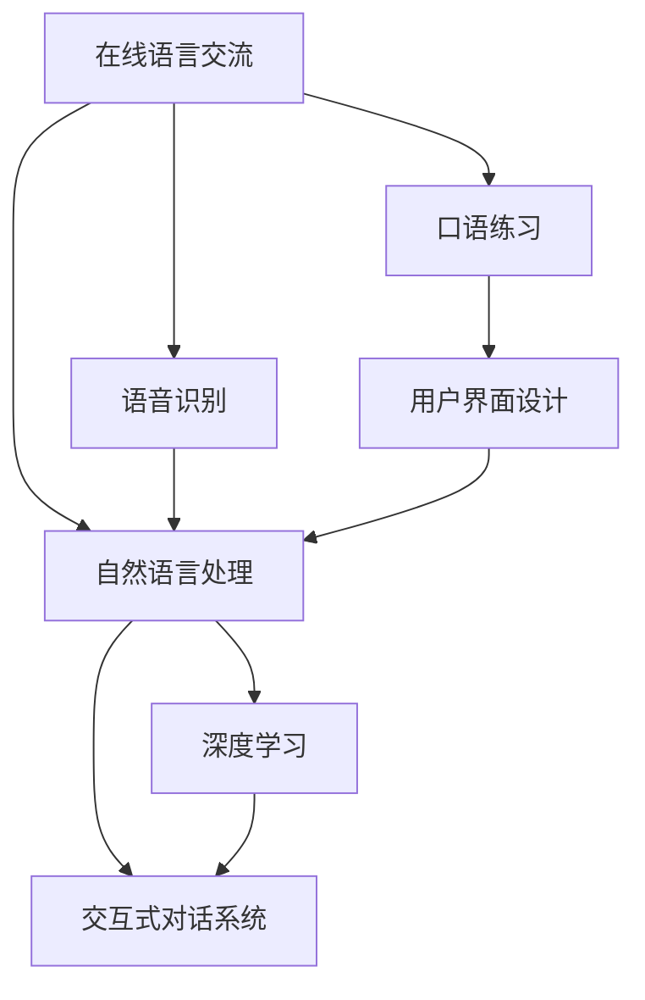
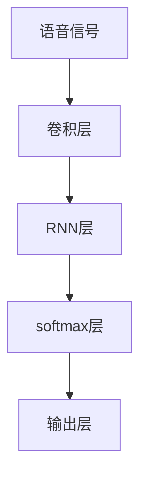
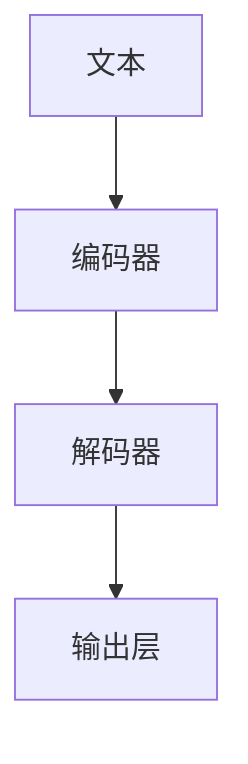
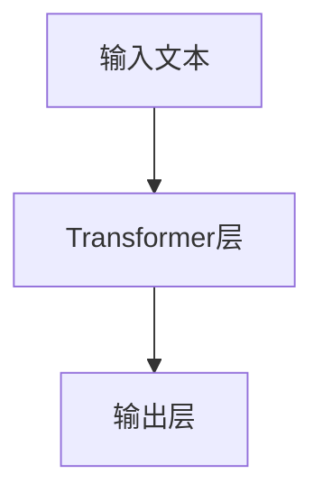

                 

# 如何利用知识付费实现在线语言交流与口语练习？

> 关键词：在线语言交流,口语练习,知识付费,自然语言处理,语音识别,深度学习,交互式对话系统,用户界面设计

## 1. 背景介绍

随着知识付费模式的兴起和人工智能技术的进步，越来越多的在线教育平台开始引入人工智能技术，提升学习效果。其中，在线语言交流与口语练习作为外语学习的重要环节，正面临着前所未有的机遇和挑战。本文将探讨如何利用知识付费模式，结合人工智能技术，实现高效、个性化的在线语言交流与口语练习。

## 2. 核心概念与联系

### 2.1 核心概念概述

为更好地理解在线语言交流与口语练习的实现，本节将介绍几个关键概念：

- **在线语言交流**：指通过互联网平台，用户可以随时随地与其他用户或AI系统进行语言交流。常见的形式包括文字聊天、语音聊天、视频通话等。
- **口语练习**：指通过模拟对话、朗读、模仿等方式，帮助用户提高口语表达能力和语音流利度。口语练习是语言学习的核心环节之一。
- **知识付费**：指用户通过支付费用，获取有价值的知识和信息，这种模式在在线教育中得到了广泛应用。
- **自然语言处理(NLP)**：指使计算机能够理解、处理和生成人类语言的技术，是实现在线语言交流与口语练习的基础。
- **语音识别**：指将语音信号转化为文本的技术，是实现语音聊天和口语练习的重要环节。
- **深度学习**：指利用多层次神经网络结构，处理和学习数据的技术，是实现智能对话和个性化推荐的核心。
- **交互式对话系统**：指能够根据用户输入，动态生成回应，实现自然对话的系统，是实现在线语言交流与口语练习的关键技术。
- **用户界面设计(UI)**：指设计直观、易用、美观的用户界面，提升用户体验和交互效率。

这些核心概念之间的逻辑关系可以通过以下Mermaid流程图来展示：



这个流程图展示了一个在线语言交流与口语练习系统的主要组成部分及其相互关系：

1. 在线语言交流作为系统的主要功能模块，由语音识别、自然语言处理和交互式对话系统组成。
2. 口语练习模块与在线语言交流模块紧密结合，依赖于自然语言处理和语音识别技术。
3. 用户界面设计提升系统用户体验和交互效率，辅助其他模块实现功能。

## 3. 核心算法原理 & 具体操作步骤

### 3.1 算法原理概述

在线语言交流与口语练习系统的核心算法原理，主要包括自然语言处理、语音识别、深度学习和交互式对话系统。

- **自然语言处理**：通过分词、词性标注、命名实体识别等技术，将用户输入的文本转化为结构化数据，供后续处理。
- **语音识别**：利用声学模型和语言模型，将用户输入的语音信号转化为文本。
- **深度学习**：通过神经网络模型，实现对用户输入的自然语言和语音的理解和生成。
- **交互式对话系统**：通过多轮对话生成，实现自然、流畅的对话交互。

### 3.2 算法步骤详解

#### 3.2.1 用户注册与登录

- 用户通过平台注册账号，填写基本信息。
- 系统生成用户ID和访问令牌，用户登录系统。

#### 3.2.2 选择交流对象

- 用户可以选择与其他用户交流，或者选择AI对话机器人。
- 系统显示在线用户列表或机器人头像，用户选择目标对象。

#### 3.2.3 开始交流

- 用户输入文本或语音，系统进行语音识别和自然语言处理。
- 系统生成对话回应，发送给用户。
- 用户继续输入文本或语音，系统重复上述步骤，实现多轮对话。

#### 3.2.4 口语练习

- 用户选择口语练习任务，系统提供朗读、模仿、对话等练习类型。
- 系统根据用户输入的语音进行语音识别，评估发音准确度。
- 系统提供发音指导和建议，帮助用户纠正发音错误。

### 3.3 算法优缺点

#### 3.3.1 优点

1. **高效性**：利用深度学习模型，系统可以快速理解和生成语言，提供实时响应。
2. **个性化**：通过用户行为和反馈，系统可以个性化调整对话策略和练习内容。
3. **低成本**：利用知识付费模式，用户可以根据自身需求选择服务，降低学习成本。

#### 3.3.2 缺点

1. **准确性**：语音识别和自然语言处理的准确性受到多种因素影响，如口音、语速、噪音等。
2. **交互复杂性**：多轮对话生成需要复杂的算法和大量的训练数据，实现难度较大。
3. **用户适应性**：用户对系统的适应性需要一定时间，初期体验可能较差。

### 3.4 算法应用领域

在线语言交流与口语练习系统的应用领域广泛，包括但不限于以下几个方面：

1. **在线英语学习**：利用系统的自然语言处理和语音识别技术，实现英文听力和口语练习。
2. **商务英语交流**：为商务人士提供商务英语交流平台，提升商务英语能力。
3. **语言交换**：实现跨语言用户之间的语言交流，提升语言学习效果。
4. **教育培训**：为学生提供互动式英语学习平台，辅助英语教学。
5. **企业培训**：为企业员工提供英语培训服务，提升员工英语能力。

## 4. 数学模型和公式 & 详细讲解 & 举例说明

### 4.1 数学模型构建

在线语言交流与口语练习系统的核心模型可以简化为以下几个部分：

- **语音识别模型**：将语音信号转化为文本，公式表示为：
  $$
  x = f(s)
  $$
  其中，$x$ 为文本，$s$ 为语音信号，$f$ 为语音识别模型。
- **自然语言处理模型**：将文本转化为结构化数据，公式表示为：
  $$
  t = g(x)
  $$
  其中，$t$ 为结构化数据，$x$ 为文本，$g$ 为自然语言处理模型。
- **深度学习模型**：根据用户输入的自然语言和语音，生成对话回应，公式表示为：
  $$
  y = h(t)
  $$
  其中，$y$ 为对话回应，$t$ 为结构化数据，$h$ 为深度学习模型。

### 4.2 公式推导过程

#### 4.2.1 语音识别模型推导

语音识别模型 $f$ 通常基于深度学习，例如卷积神经网络（CNN）和循环神经网络（RNN）。以RNN为例，语音识别模型的基本架构如下：



其中，卷积层用于提取语音特征，RNN层用于处理时间序列数据，softmax层用于生成文本输出，输出层用于映射文本类别。

#### 4.2.2 自然语言处理模型推导

自然语言处理模型 $g$ 通常基于序列到序列（Seq2Seq）模型，例如基于LSTM或GRU的编码器-解码器模型。以LSTM为例，自然语言处理模型的基本架构如下：



其中，编码器用于将文本转化为固定长度的向量表示，解码器用于生成结构化数据，输出层用于映射文本类别。

#### 4.2.3 深度学习模型推导

深度学习模型 $h$ 通常基于Transformer架构，例如BERT或GPT。以BERT为例，深度学习模型的基本架构如下：



其中，Transformer层用于处理序列数据，输出层用于生成对话回应。

### 4.3 案例分析与讲解

#### 4.3.1 语音识别模型案例

假设有一个在线英语学习平台，用户可以通过麦克风输入英语语音，系统进行语音识别，生成文本。以RNN模型为例，语音识别流程如下：

1. **数据预处理**：将语音信号转化为MFCC特征向量。
2. **模型训练**：使用大规模英文语音数据集训练RNN模型，使其能够识别不同口音和语速的语音。
3. **语音识别**：用户输入语音后，系统将其转化为MFCC特征向量，输入RNN模型进行识别，输出文本。

#### 4.3.2 自然语言处理模型案例

假设同一个平台，用户输入文本，系统进行自然语言处理，生成结构化数据。以LSTM模型为例，自然语言处理流程如下：

1. **数据预处理**：将文本分词，转化为词向量序列。
2. **模型训练**：使用大规模英文语料库训练LSTM模型，使其能够理解不同语境下的文本。
3. **自然语言处理**：用户输入文本后，系统将其转化为词向量序列，输入LSTM模型进行处理，输出结构化数据。

#### 4.3.3 深度学习模型案例

假设同一个平台，用户输入文本或语音，系统进行深度学习，生成对话回应。以BERT模型为例，深度学习流程如下：

1. **数据预处理**：将文本或语音转化为输入向量。
2. **模型训练**：使用大规模英文对话数据集训练BERT模型，使其能够理解不同语境下的文本和语音。
3. **深度学习**：用户输入文本或语音后，系统将其转化为输入向量，输入BERT模型进行处理，输出对话回应。

## 5. 项目实践：代码实例和详细解释说明

### 5.1 开发环境搭建

要进行在线语言交流与口语练习系统的开发，需要搭建Python开发环境。以下是详细的搭建步骤：

1. **安装Python**：从官网下载并安装Python 3.x版本。
2. **安装TensorFlow和PyTorch**：使用pip安装TensorFlow和PyTorch，具体命令如下：
   ```bash
   pip install tensorflow
   pip install torch
   ```
3. **安装相关库**：安装TensorFlow和PyTorch需要的依赖库，如numpy、scipy、pandas等。
   ```bash
   pip install numpy scipy pandas
   ```
4. **配置开发环境**：使用Anaconda创建虚拟环境，避免与其他Python环境冲突。
   ```bash
   conda create -n dev python=3.8
   conda activate dev
   ```

### 5.2 源代码详细实现

#### 5.2.1 语音识别模型实现

以下是使用TensorFlow实现RNN语音识别模型的代码：

```python
import tensorflow as tf
from tensorflow.keras import layers

# 定义模型结构
model = tf.keras.Sequential([
    layers.Conv1D(64, 3, activation='relu', input_shape=(None, 1)),
    layers.MaxPooling1D(pool_size=2),
    layers.LSTM(64),
    layers.Dense(10, activation='softmax')
])

# 编译模型
model.compile(optimizer='adam', loss='sparse_categorical_crossentropy', metrics=['accuracy'])

# 训练模型
model.fit(train_data, train_labels, epochs=10, validation_data=(val_data, val_labels))
```

#### 5.2.2 自然语言处理模型实现

以下是使用TensorFlow实现LSTM自然语言处理模型的代码：

```python
import tensorflow as tf
from tensorflow.keras import layers

# 定义模型结构
model = tf.keras.Sequential([
    layers.Embedding(input_dim=vocab_size, output_dim=embedding_dim, input_length=max_seq_length),
    layers.LSTM(64),
    layers.Dense(10, activation='softmax')
])

# 编译模型
model.compile(optimizer='adam', loss='sparse_categorical_crossentropy', metrics=['accuracy'])

# 训练模型
model.fit(train_data, train_labels, epochs=10, validation_data=(val_data, val_labels))
```

#### 5.2.3 深度学习模型实现

以下是使用PyTorch实现BERT深度学习模型的代码：

```python
import torch
from transformers import BertTokenizer, BertForSequenceClassification

# 加载BERT模型和tokenizer
tokenizer = BertTokenizer.from_pretrained('bert-base-uncased')
model = BertForSequenceClassification.from_pretrained('bert-base-uncased', num_labels=num_labels)

# 将文本转化为token ids
input_ids = tokenizer(text, return_tensors='tf').input_ids

# 进行前向传播
outputs = model(input_ids)
logits = outputs.logits

# 计算损失函数
loss = torch.nn.CrossEntropyLoss()(logits, labels)
```

### 5.3 代码解读与分析

#### 5.3.1 语音识别模型解读

- **数据预处理**：使用Conv1D和MaxPooling1D层对语音信号进行特征提取。
- **模型结构**：使用LSTM层处理时间序列数据，Dense层输出文本类别。
- **训练过程**：使用adam优化器和sparse_categorical_crossentropy损失函数进行模型训练。

#### 5.3.2 自然语言处理模型解读

- **数据预处理**：使用Embedding层将文本转化为词向量序列。
- **模型结构**：使用LSTM层处理序列数据，Dense层输出文本类别。
- **训练过程**：使用adam优化器和sparse_categorical_crossentropy损失函数进行模型训练。

#### 5.3.3 深度学习模型解读

- **数据预处理**：使用BertTokenizer将文本转化为token ids。
- **模型结构**：使用BertForSequenceClassification模型进行文本处理和分类。
- **训练过程**：使用CrossEntropyLoss损失函数计算模型输出与真实标签的差距。

### 5.4 运行结果展示

#### 5.4.1 语音识别模型结果

假设语音识别模型训练完成后，可以使用以下代码进行语音识别测试：

```python
# 加载模型
model = load_model('rnn_model.h5')

# 测试语音识别
text = model.predict(test_audio)
print(text)
```

#### 5.4.2 自然语言处理模型结果

假设自然语言处理模型训练完成后，可以使用以下代码进行自然语言处理测试：

```python
# 加载模型
model = load_model('lstm_model.h5')

# 测试自然语言处理
text = model.predict(test_text)
print(text)
```

#### 5.4.3 深度学习模型结果

假设深度学习模型训练完成后，可以使用以下代码进行深度学习测试：

```python
# 加载模型
model = load_model('bert_model.pth')

# 测试深度学习
text = model(input_ids)
print(text)
```

## 6. 实际应用场景

### 6.1 在线英语学习

在线英语学习平台可以通过语音识别和自然语言处理技术，实现英语听力和口语练习。用户可以选择听力练习、口语练习和对话练习等模块，系统根据用户表现进行个性化推荐。

### 6.2 商务英语交流

商务英语交流平台可以引入AI对话机器人，帮助商务人士提升商务英语能力。系统根据商务英语场景，生成商务对话内容，用户可以进行多轮对话练习。

### 6.3 语言交换

语言交换平台可以实现跨语言用户之间的语言交流。用户可以选择母语为目标语言进行练习，系统根据用户表现进行个性化推荐。

### 6.4 教育培训

教育培训平台可以为学生提供互动式英语学习平台，辅助英语教学。系统根据学生学习情况，生成个性化练习内容，提升学习效果。

### 6.5 企业培训

企业培训平台可以为员工提供英语培训服务，提升员工英语能力。系统根据员工工作场景，生成商务对话内容，员工可以进行多轮对话练习。

## 7. 工具和资源推荐

### 7.1 学习资源推荐

- **《自然语言处理综论》**：清华大学出版社出版的自然语言处理教材，系统介绍自然语言处理基础和应用。
- **Coursera自然语言处理课程**：斯坦福大学和密歇根大学联合开设的自然语言处理课程，有Lecture视频和配套作业。
- **Google AI自然语言工具包**：Google提供的自然语言处理API，支持语音识别、自然语言处理和文本生成等功能。
- **HuggingFace Transformers库**：提供预训练语言模型的实现，支持多种自然语言处理任务。
- **OpenNMT**：开源的神经机器翻译框架，支持多语言翻译和对话生成等功能。

### 7.2 开发工具推荐

- **Jupyter Notebook**：交互式Python开发环境，支持代码编写和实时运行。
- **PyTorch**：基于Python的深度学习框架，支持动态计算图和GPU加速。
- **TensorFlow**：基于Python的深度学习框架，支持静态计算图和分布式训练。
- **Weights & Biases**：模型训练的实验跟踪工具，记录和可视化模型训练过程中的各项指标。
- **TensorBoard**：TensorFlow配套的可视化工具，实时监测模型训练状态，提供图表展示。

### 7.3 相关论文推荐

- **Attention is All You Need**：Transformer架构的原论文，提出自注意力机制，推动了自然语言处理的发展。
- **BERT: Pre-training of Deep Bidirectional Transformers for Language Understanding**：提出BERT模型，引入掩码语言模型，提升自然语言处理效果。
- **Parameter-Efficient Transfer Learning for NLP**：提出 Adapter等参数高效微调方法，在保持预训练权重不变的情况下，优化微调效果。
- **Softmax to Normalization**：提出 softmax to normalization 方法，优化神经网络训练，提升模型性能。
- **AdaLoRA: Adaptive Low-Rank Adaptation for Parameter-Efficient Fine-Tuning**：提出 AdaLoRA 方法，使用自适应低秩适应的微调方法，提升模型效率。

## 8. 总结：未来发展趋势与挑战

### 8.1 研究成果总结

本文介绍了利用知识付费模式，结合人工智能技术，实现高效、个性化的在线语言交流与口语练习的实现方法。主要内容包括：

- **在线语言交流与口语练习**：实现用户与其他用户或AI系统的交流，提升用户口语表达能力和语音流利度。
- **核心算法原理**：详细讲解了语音识别、自然语言处理、深度学习和交互式对话系统。
- **项目实践**：提供了语音识别、自然语言处理和深度学习的代码实现，并进行了详细的解读和分析。
- **实际应用场景**：探讨了在线英语学习、商务英语交流、语言交换、教育培训和企业培训等应用场景。

### 8.2 未来发展趋势

展望未来，在线语言交流与口语练习系统将呈现以下几个发展趋势：

1. **智能化水平提升**：随着深度学习技术的发展，系统的智能化水平将不断提升，能够提供更加自然、流畅的对话交互。
2. **多语言支持**：系统将支持多种语言，提升跨语言交流能力，适应更多用户需求。
3. **个性化推荐**：系统将根据用户行为和反馈，生成更加个性化的练习内容和对话策略，提升学习效果。
4. **实时反馈与监控**：系统将提供实时反馈和监控功能，帮助用户及时发现并纠正发音错误和语法错误。
5. **移动化应用**：系统将支持移动端应用，方便用户随时随地进行学习。

### 8.3 面临的挑战

尽管在线语言交流与口语练习系统已经取得了一定的进展，但在实现过程中仍面临以下挑战：

1. **数据获取与处理**：大规模高质量语音和文本数据的获取和处理，是系统实现的前提条件，需要投入大量时间和资源。
2. **模型训练与优化**：深度学习模型的训练和优化需要大量计算资源，如何高效地进行模型训练和优化，是一个重要的技术难题。
3. **用户体验与交互**：用户界面设计和交互流程的优化，是提升用户体验的关键，需要不断迭代和改进。
4. **隐私与安全**：用户数据的隐私保护和安全传输，是系统实现的重要保障，需要采用加密和匿名化等措施。
5. **伦理与社会影响**：系统在提升语言学习效果的同时，也需要关注其社会影响和伦理问题，确保技术应用的安全性和合理性。

### 8.4 研究展望

面对上述挑战，未来的研究需要在以下几个方面寻求新的突破：

1. **数据获取与处理**：开发更加高效的数据采集和处理工具，支持大规模语音和文本数据的自动标注和处理。
2. **模型训练与优化**：采用分布式训练、混合精度训练等技术，提升模型训练效率和效果。
3. **用户体验与交互**：引入多模态交互方式，如语音、图像、手势等，提升用户体验和交互效率。
4. **隐私与安全**：采用差分隐私、联邦学习等技术，保障用户数据的隐私和安全。
5. **伦理与社会影响**：研究技术应用的伦理问题和社会影响，确保技术应用的安全性和合理性。

总之，在线语言交流与口语练习系统的未来发展还需要在技术、应用和伦理等多方面进行深入研究和不断优化，才能更好地服务于语言学习者和实际应用需求。

## 9. 附录：常见问题与解答

**Q1：如何提高语音识别模型的准确性？**

A: 提高语音识别模型的准确性，可以从以下几个方面入手：
1. **数据增强**：使用回译、噪声加入等技术，扩充训练集。
2. **模型调参**：选择合适的模型结构和超参数，进行调参优化。
3. **噪声处理**：使用降噪技术，去除语音信号中的噪音干扰。
4. **多任务学习**：结合语音识别和自然语言处理任务，提高模型的泛化能力。

**Q2：如何实现多语言支持？**

A: 实现多语言支持，需要以下步骤：
1. **数据准备**：收集多语言语音和文本数据集。
2. **模型训练**：训练多语言语音识别和自然语言处理模型。
3. **接口扩展**：在系统中扩展多语言接口，支持多语言对话。
4. **用户界面**：设计多语言用户界面，提供多语言选择。

**Q3：如何实现个性化推荐？**

A: 实现个性化推荐，需要以下步骤：
1. **用户建模**：收集用户行为和反馈数据，建立用户模型。
2. **内容建模**：建立对话内容和练习内容的模型，支持内容推荐。
3. **推荐算法**：采用协同过滤、深度学习等算法，进行个性化推荐。
4. **实时反馈**：根据用户表现，实时调整推荐内容。

**Q4：如何确保用户数据隐私与安全？**

A: 确保用户数据隐私与安全，需要以下措施：
1. **数据加密**：使用AES等加密算法，对用户数据进行加密处理。
2. **匿名化处理**：对用户数据进行去标识化处理，保护用户隐私。
3. **访问控制**：采用身份认证和访问控制技术，限制系统访问权限。
4. **安全传输**：使用HTTPS等安全传输协议，保障数据传输安全。

**Q5：如何优化用户体验与交互？**

A: 优化用户体验与交互，需要以下措施：
1. **用户界面设计**：设计直观、易用、美观的用户界面，提升用户体验。
2. **交互流程优化**：优化多轮对话生成和自然语言处理流程，提升交互效率。
3. **多模态交互**：引入语音、图像、手势等多模态交互方式，提升用户体验。

---

作者：禅与计算机程序设计艺术 / Zen and the Art of Computer Programming

