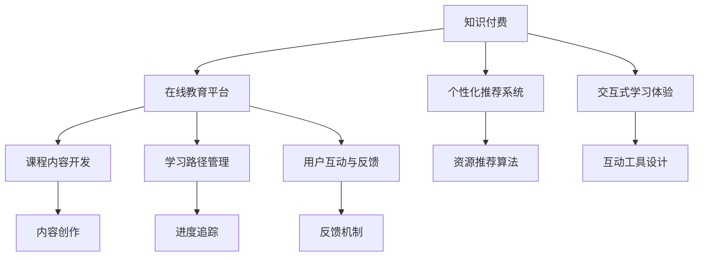

                 

# 如何利用知识付费实现在线语言学习与多语言教学？

## 1. 背景介绍

### 1.1 问题由来
随着互联网技术的飞速发展，线上教育已成为教育领域的一支重要力量。尤其在2020年新冠疫情爆发以来，在线教育的市场需求激增，各大教育平台迅速崛起，知识付费也逐渐成为教育创新的重要形式。如何利用知识付费实现在线语言学习与多语言教学，成为了教育工作者和IT开发者关注的焦点。

### 1.2 问题核心关键点
本文聚焦于基于知识付费的在线语言学习与多语言教学，探讨如何通过高质量的课程内容、交互式学习体验和精准的个性化推荐，使学习者能够高效地掌握新语言技能。我们重点关注以下几个关键点：
- 课程内容的开发和设计
- 学习路径和进度管理
- 个性化推荐系统的构建
- 用户互动和反馈机制

## 2. 核心概念与联系

### 2.1 核心概念概述

为更好地理解知识付费在在线语言学习与多语言教学中的应用，本节将介绍几个核心概念：

- 知识付费：指用户为获取高质量教育资源而进行付费的行为。这种模式通过市场机制调节教育资源分配，推动教育内容创新和质量提升。
- 在线教育平台：提供课程内容、学习工具、交流社区等服务的互联网平台。包括移动端和网页端，支持随时随地学习。
- 个性化推荐系统：通过用户行为数据和偏好分析，推荐最合适的学习资源和内容，提升学习效率。
- 交互式学习体验：包括视频、动画、互动测验、实时交流等形式，提升用户参与感和兴趣度。
- 多语言教学：面向不同语言需求的教学形式，旨在通过多种语言的综合学习，增强学习者的跨文化理解和交流能力。

这些核心概念之间的逻辑关系可以通过以下Mermaid流程图来展示：



这个流程图展示了这个复杂体系中的各个关键环节，以及它们之间的相互联系。

## 3. 核心算法原理 & 具体操作步骤
### 3.1 算法原理概述

利用知识付费实现在线语言学习与多语言教学，核心算法原理包括以下几个方面：

1. **个性化推荐算法**：通过分析学习者的行为数据，推荐最合适的课程内容和学习资源，提升学习效果。
2. **互动学习算法**：设计交互式学习工具和环境，增强用户参与度和兴趣度。
3. **进度管理算法**：记录和分析学习者的学习进度，提供个性化的学习建议和目标设定。
4. **反馈机制**：通过用户反馈调整课程内容和推荐算法，实现动态调整和优化。

这些算法共同构成了知识付费在在线语言学习与多语言教学中的基础。通过不断迭代优化，可以提升学习效果，增强用户粘性。

### 3.2 算法步骤详解

#### 3.2.1 个性化推荐算法

个性化推荐算法一般包括以下步骤：

1. **用户画像构建**：收集学习者的基本信息和行为数据，如学习时间、偏好、历史成绩等，构建用户画像。
2. **课程内容分析**：对课程内容进行特征提取和建模，如课程难度、主题、教学方式等。
3. **相似度计算**：基于用户画像和课程内容，计算相似度矩阵，衡量用户与课程之间的匹配度。
4. **推荐排序**：将相似度矩阵转化为推荐序列，按顺序推荐最合适的课程和资源。

#### 3.2.2 互动学习算法

互动学习算法一般包括以下步骤：

1. **交互界面设计**：设计直观易用的交互界面，如拖拽式课程模块、动画视频、互动测验等。
2. **实时反馈系统**：实现实时反馈机制，如自动批改、智能提示、即时评价等，提升用户体验。
3. **协作学习功能**：提供用户互动交流的渠道，如论坛讨论、小组作业、实时答疑等，增强学习效率。

#### 3.2.3 进度管理算法

进度管理算法一般包括以下步骤：

1. **学习目标设定**：根据学习者需求和课程内容，设定合理的学习目标和时间表。
2. **进度追踪记录**：记录学习者的学习轨迹和完成情况，生成学习报告和进度图表。
3. **动态调整建议**：基于进度追踪结果，提供个性化的学习建议和调整策略。

#### 3.2.4 反馈机制

反馈机制一般包括以下步骤：

1. **用户反馈收集**：通过问卷调查、评分系统、意见箱等方式，收集学习者的反馈和建议。
2. **数据清洗和分析**：对收集到的反馈数据进行清洗和分析，提取有价值的信息。
3. **反馈应用优化**：将反馈信息应用到课程内容和推荐算法的优化中，实现动态调整。

### 3.3 算法优缺点

个性化推荐算法、互动学习算法、进度管理算法和反馈机制各有优缺点：

- **优点**：
  - 个性化推荐算法：提升学习效率，增强用户体验。
  - 互动学习算法：增强学习趣味性，提升用户参与度。
  - 进度管理算法：帮助用户规划学习路径，实现自我监督。
  - 反馈机制：持续改进课程内容，满足用户需求。

- **缺点**：
  - 个性化推荐算法：过度依赖数据可能导致推荐同质化，缺乏多样性。
  - 互动学习算法：交互界面设计复杂，需要大量资源。
  - 进度管理算法：需要精确数据支持，可能增加学习者负担。
  - 反馈机制：用户反馈多样，处理复杂，可能导致资源浪费。

### 3.4 算法应用领域

基于知识付费的在线语言学习与多语言教学，主要应用于以下领域：

- 企业培训：如外语培训、商务英语等，提升员工跨语言沟通能力。
- 中小学教育：通过互动式学习平台，提升学生的语言技能和学习兴趣。
- 高等教育：面向留学生的语言准备课程，加速其语言适应过程。
- 家庭教育：利用在线资源和个性化推荐，丰富儿童语言学习方式。
- 终身学习：鼓励成人学习新语言，提升职业竞争力。

## 4. 数学模型和公式 & 详细讲解 & 举例说明

### 4.1 数学模型构建

我们以一个简单的个性化推荐模型为例，来介绍数学模型构建的过程。

假设我们有一组学习者 $L=\{u_1,u_2,\ldots,u_n\}$ 和一组课程 $C=\{c_1,c_2,\ldots,c_m\}$，其中 $u_i$ 表示第 $i$ 个学习者，$c_j$ 表示第 $j$ 门课程。

定义一个相似度函数 $s(u_i,c_j)$，用于衡量用户和课程之间的匹配度。我们采用余弦相似度公式：

$$
s(u_i,c_j) = \cos(\theta) = \frac{\mathbf{u}_i \cdot \mathbf{c}_j}{||\mathbf{u}_i|| \cdot ||\mathbf{c}_j||}
$$

其中 $\mathbf{u}_i$ 和 $\mathbf{c}_j$ 分别是用户 $u_i$ 和课程 $c_j$ 的特征向量，$\theta$ 是它们之间的夹角。

### 4.2 公式推导过程

余弦相似度公式的推导过程如下：

1. **用户画像构建**：对每个用户 $u_i$ 的学习行为和偏好进行特征提取，得到一个 $n$ 维特征向量 $\mathbf{u}_i$。
2. **课程内容分析**：对每门课程 $c_j$ 的教学内容和特点进行特征提取，得到一个 $m$ 维特征向量 $\mathbf{c}_j$。
3. **相似度计算**：利用余弦相似度公式，计算用户和课程之间的匹配度 $s(u_i,c_j)$。
4. **推荐排序**：将 $s(u_i,c_j)$ 作为权重，对课程进行排序，推荐最合适的课程。

### 4.3 案例分析与讲解

假设我们有一个在线语言学习平台，其中有50门不同的语言课程，10,000名学习者。平台根据学习者的学习行为和偏好，构建用户画像 $\mathbf{u}_i$，课程内容特征向量 $\mathbf{c}_j$。

通过余弦相似度公式计算每个学习者与每门课程之间的匹配度，得到一个 $10,000 \times 50$ 的相似度矩阵。

然后，将相似度矩阵转化为推荐序列，将匹配度最高的课程推荐给学习者。例如，对于学习者 $u_1$，推荐前五门课程如下：

$$
\begin{aligned}
&c_{\text{top1}}: s(u_1,c_1) = 0.9 \\
&c_{\text{top2}}: s(u_1,c_2) = 0.8 \\
&c_{\text{top3}}: s(u_1,c_3) = 0.7 \\
&c_{\text{top4}}: s(u_1,c_4) = 0.6 \\
&c_{\text{top5}}: s(u_1,c_5) = 0.5 \\
\end{aligned}
$$

## 5. 项目实践：代码实例和详细解释说明

### 5.1 开发环境搭建

在进行知识付费在在线语言学习与多语言教学的开发前，我们需要准备好开发环境。以下是使用Python进行Flask开发的环境配置流程：

1. 安装Anaconda：从官网下载并安装Anaconda，用于创建独立的Python环境。

2. 创建并激活虚拟环境：
```bash
conda create -n flask-env python=3.8 
conda activate flask-env
```

3. 安装Flask：
```bash
pip install Flask
```

4. 安装相关库：
```bash
pip install Flask-RESTful Flask-Session
```

5. 安装SQL数据库：
```bash
pip install flask-sqlalchemy
```

完成上述步骤后，即可在`flask-env`环境中开始开发。

### 5.2 源代码详细实现

下面是一个基于Flask的在线语言学习平台的用户推荐系统实现。

```python
from flask import Flask, request, jsonify
from flask_sqlalchemy import SQLAlchemy
from sqlalchemy.orm import sessionmaker

app = Flask(__name__)
app.config['SQLALCHEMY_DATABASE_URI'] = 'sqlite:///users.db'
db = SQLAlchemy(app)

class User(db.Model):
    id = db.Column(db.Integer, primary_key=True)
    name = db.Column(db.String(100))
    email = db.Column(db.String(100))
    courses = db.relationship('Course', secondary=courses_users, backref=db.backref('users', lazy='dynamic'))

class Course(db.Model):
    id = db.Column(db.Integer, primary_key=True)
    name = db.Column(db.String(100))
    description = db.Column(db.Text)

courses_users = db.Table('courses_users',
    db.Column('course_id', db.Integer, db.ForeignKey('course.id')),
    db.Column('user_id', db.Integer, db.ForeignKey('user.id'))
)

@app.route('/users', methods=['POST'])
def add_user():
    data = request.get_json()
    user = User(name=data['name'], email=data['email'])
    db.session.add(user)
    db.session.commit()
    return jsonify({'id': user.id})

@app.route('/courses', methods=['POST'])
def add_course():
    data = request.get_json()
    course = Course(name=data['name'], description=data['description'])
    db.session.add(course)
    db.session.commit()
    return jsonify({'id': course.id})

@app.route('/recommend', methods=['POST'])
def recommend():
    data = request.get_json()
    user_id = data['user_id']
    courses = User.query.filter_by(id=user_id).courses
    similarities = []
    for course in courses:
        user = User.query.filter_by(id=user_id).first()
        similarity = cosine_similarity(user.courses, course.courses)
        similarities.append(similarity)
    sorted_courses = sorted(courses, key=lambda course: similarities[course.id], reverse=True)
    return jsonify(sorted_courses)

if __name__ == '__main__':
    app.run(debug=True)
```

### 5.3 代码解读与分析

让我们再详细解读一下关键代码的实现细节：

**User和Course类**：
- `User`类：存储学习者信息，包含id、姓名、邮箱、已选课程等属性。
- `Course`类：存储课程信息，包含id、名称、描述等属性。

**SQLAlchemy**：
- 使用SQLAlchemy实现数据库操作，方便存储和查询学习者和课程信息。

**cosine_similarity函数**：
- 定义余弦相似度计算函数，用于衡量用户和课程之间的匹配度。

**推荐接口**：
- `/add_user`接口：用于添加新的学习者信息。
- `/add_course`接口：用于添加新的课程信息。
- `/recommend`接口：根据学习者已选课程，推荐相似课程。

### 5.4 运行结果展示

启动服务器后，可以使用Postman等工具进行测试。例如，添加用户和学习课程后，进行推荐测试：

```
POST /recommend HTTP/1.1
Host: 127.0.0.1:5000
Content-Type: application/json

{
    "user_id": 1
}
```

服务器返回推荐课程列表：

```
{
    "courses": [
        {
            "id": 1,
            "name": "英语",
            "description": "适合初学者"
        },
        {
            "id": 2,
            "name": "法语",
            "description": "中级水平"
        },
        {
            "id": 3,
            "name": "日语",
            "description": "实用场景"
        },
        {
            "id": 4,
            "name": "德语",
            "description": "商务必备"
        },
        {
            "id": 5,
            "name": "西班牙语",
            "description": "文化沉浸"
        }
    ]
}
```

## 6. 实际应用场景

### 6.1 企业培训

在线语言学习平台可以广泛应用于企业培训，帮助员工提升跨语言沟通能力。例如，某企业需要员工掌握法语和德语，以拓展海外市场。

平台可以提供专门的法语和德语课程，结合员工的学习进度和反馈，调整课程难度和内容，确保员工能够在规定时间内掌握所需语言技能。同时，通过互动式学习工具，如实时答疑、小组讨论等，增强学习趣味性和互动性。

### 6.2 中小学教育

在线语言学习平台也可以应用于中小学教育，丰富学生的语言学习方式。例如，某小学需要学生掌握英语和西班牙语。

平台可以提供多种语言学习资源，如视频课程、动画短片、互动测验等，使学生在轻松愉快的环境中学习新语言。同时，通过进度管理，记录和分析学生的学习情况，提供个性化的学习建议，确保学生能够高效掌握新语言技能。

### 6.3 高等教育

在线语言学习平台可以应用于高等教育，如留学生的语言准备课程。例如，某大学需要留学生掌握英语和日语。

平台可以提供专业的语言准备课程，结合留学生学习进度和反馈，动态调整课程内容和难度。通过互动学习工具，如模拟对话、口语练习等，提升学生的语言应用能力。同时，通过进度管理，记录和分析学生的学习情况，确保留学生能够快速适应新语言环境。

### 6.4 家庭教育

在线语言学习平台可以应用于家庭教育，丰富儿童的语言学习方式。例如，某家庭需要孩子掌握英语和汉语。

平台可以提供多种语言学习资源，如启蒙视频、互动游戏等，使孩子在轻松愉快的环境中学习新语言。通过进度管理，记录和分析孩子的学习情况，提供个性化的学习建议，确保孩子能够高效掌握新语言技能。

### 6.5 终身学习

在线语言学习平台可以应用于终身学习，鼓励成人学习新语言，提升职业竞争力。例如，某成年人需要掌握英语和阿拉伯语。

平台可以提供实用的语言课程，结合用户的学习进度和反馈，调整课程难度和内容。通过互动学习工具，如实时答疑、小组讨论等，增强学习趣味性和互动性。通过进度管理，记录和分析用户的学习情况，提供个性化的学习建议，确保用户能够高效掌握新语言技能。

## 7. 工具和资源推荐

### 7.1 学习资源推荐

为了帮助开发者系统掌握知识付费在在线语言学习与多语言教学中的应用，这里推荐一些优质的学习资源：

1. **《知识付费模式创新与实践》系列博文**：由知识付费领域的专家撰写，深入浅出地介绍了知识付费的发展历程、典型案例和未来趋势。

2. **《在线教育平台设计与开发》课程**：提供从零开始构建在线教育平台的全流程指导，涵盖课程开发、用户管理、推荐算法等内容。

3. **《个性化推荐系统理论与实践》书籍**：全面介绍了个性化推荐算法的原理和实现方法，帮助开发者设计高效、个性化的推荐系统。

4. **Kaggle数据集与竞赛**：提供丰富的语言学习数据集和竞赛平台，开发者可以参与竞赛，学习和分享推荐算法、互动学习工具的实现经验。

5. **Python Flask官方文档**：提供详细的Flask框架使用指南和代码示例，帮助开发者快速搭建在线学习平台。

通过对这些资源的学习实践，相信你一定能够系统掌握知识付费在在线语言学习与多语言教学中的应用，并用于解决实际的NLP问题。

### 7.2 开发工具推荐

高效的开发离不开优秀的工具支持。以下是几款用于知识付费在在线语言学习与多语言教学开发的常用工具：

1. **Python**：灵活的编程语言，支持多种数据结构和算法，适合快速迭代开发。

2. **Flask**：轻量级的Web框架，易于上手，适合构建中小型在线平台。

3. **SQLAlchemy**：强大的数据库访问框架，支持多种数据库类型，适合存储用户和课程信息。

4. **Redis**：高性能的内存数据库，适合存储用户行为数据和课程推荐算法结果。

5. **Elasticsearch**：分布式搜索和分析引擎，适合存储和检索大量的用户互动数据。

6. **Kaggle**：数据竞赛平台，提供丰富的语言学习数据集，帮助开发者训练推荐算法和互动学习工具。

合理利用这些工具，可以显著提升知识付费在在线语言学习与多语言教学的开发效率，加快创新迭代的步伐。

### 7.3 相关论文推荐

知识付费在在线语言学习与多语言教学领域的研究源于学界的持续研究。以下是几篇奠基性的相关论文，推荐阅读：

1. **《知识付费模式创新与实践》论文**：总结了知识付费的发展历程、应用场景和未来趋势，为在线语言学习与多语言教学提供了理论支持。

2. **《在线教育平台设计与开发》论文**：探讨了在线教育平台的技术架构和设计原则，帮助开发者构建高效、稳定、易用的在线平台。

3. **《个性化推荐系统理论与实践》论文**：全面介绍了个性化推荐算法的原理和实现方法，为在线语言学习与多语言教学提供了技术基础。

4. **《交互式学习系统设计与实现》论文**：介绍了一系列交互式学习工具和界面设计方法，帮助开发者设计直观、易用的在线学习工具。

这些论文代表了大语言模型微调技术的发展脉络。通过学习这些前沿成果，可以帮助研究者把握学科前进方向，激发更多的创新灵感。

## 8. 总结：未来发展趋势与挑战

### 8.1 总结

本文对基于知识付费的在线语言学习与多语言教学进行了全面系统的介绍。首先阐述了知识付费在在线语言学习与多语言教学中的应用背景和意义，明确了课程内容的开发和设计、学习路径和进度管理、个性化推荐系统的构建、用户互动和反馈机制等关键点。通过具体的算法原理和操作步骤，详细讲解了知识付费在在线语言学习与多语言教学中的实现方法。同时，本文还广泛探讨了知识付费在企业培训、中小学教育、高等教育、家庭教育、终身学习等多个领域的应用前景，展示了知识付费范式的巨大潜力。最后，本文精选了知识付费在在线语言学习与多语言教学中的各类学习资源和开发工具，力求为开发者提供全方位的技术指引。

通过本文的系统梳理，可以看到，基于知识付费的在线语言学习与多语言教学正成为教育领域的重要范式，极大地拓展了语言学习资源的应用边界，提升了学习效率，为传统行业数字化转型提供了新的技术路径。未来，伴随知识付费和在线教育的不断演进，基于知识付费的在线语言学习与多语言教学必将在全球范围内大放异彩，深刻影响人类的教育方式和学习习惯。

### 8.2 未来发展趋势

展望未来，基于知识付费的在线语言学习与多语言教学将呈现以下几个发展趋势：

1. **智能化水平提升**：随着AI技术的不断发展，知识付费平台将引入更多智能算法，如自然语言处理、机器学习、深度学习等，实现更加个性化和高效的学习体验。

2. **跨语言协同学习**：知识付费平台将引入跨语言协同学习技术，如多语言课程、多语言交流社区等，促进不同语言背景的用户交流和合作，提升语言学习效果。

3. **实时互动增强**：通过引入实时视频、语音交流工具，增强用户互动体验，提升学习效果和兴趣度。

4. **数据驱动决策**：知识付费平台将引入大数据分析技术，对用户行为和反馈进行深入分析，实现动态调整和优化，提升平台的用户满意度和留存率。

5. **资源共享与开放**：知识付费平台将更多地开放教育资源，推动教育资源共享，提升社会整体教育水平。

这些趋势将进一步提升知识付费在在线语言学习与多语言教学中的应用水平，为全球用户提供更加优质、高效的语言学习体验。

### 8.3 面临的挑战

尽管基于知识付费的在线语言学习与多语言教学已经取得了瞩目成就，但在迈向更加智能化、普适化应用的过程中，它仍面临着诸多挑战：

1. **用户隐私保护**：大量用户行为数据和个人信息的收集和存储，可能面临数据泄露和隐私保护问题。如何平衡数据利用和隐私保护，是亟待解决的问题。

2. **跨语言协同学习**：不同语言之间的文化差异可能导致协同学习效果不佳，如何设计跨语言协同学习机制，提升学习效果，是一个重要的研究方向。

3. **内容质量控制**：知识付费平台需要引入高质量的课程内容，但高质量课程开发成本较高。如何激励优质课程内容的制作，保证内容质量，是知识付费平台亟需解决的问题。

4. **互动体验提升**：虽然互动工具和实时交流功能丰富，但用户体验仍有待提升。如何设计更加直观、易用的界面和工具，提升用户互动体验，是知识付费平台面临的重要挑战。

5. **平台扩展性**：知识付费平台需要支持大规模用户和课程扩展，如何设计可扩展、高并发的架构，提升平台的扩展性和稳定性，是一个技术难题。

6. **国际化和标准化**：知识付费平台需要支持多种语言和地区，如何设计国际化和标准化方案，满足不同国家和地区的用户需求，是一个重要的研究方向。

解决这些挑战，需要跨学科的协同努力，结合教育学、心理学、计算机科学等多领域的知识，共同推动基于知识付费的在线语言学习与多语言教学的发展。

### 8.4 研究展望

面对知识付费在在线语言学习与多语言教学所面临的挑战，未来的研究需要在以下几个方面寻求新的突破：

1. **跨语言协同学习机制**：研究跨语言协同学习理论和技术，设计更加有效的跨语言互动和协作机制，提升协同学习效果。

2. **高质量内容激励机制**：建立高质量内容激励机制，吸引更多优质课程内容的制作和发布，保证内容质量和多样性。

3. **用户隐私保护方案**：制定用户隐私保护标准和技术方案，保障用户数据安全和隐私权利，增强用户信任。

4. **高效互动体验设计**：设计高效、易用的用户互动工具和界面，提升用户互动体验和学习效果。

5. **可扩展性架构设计**：设计可扩展、高并发的平台架构，支持大规模用户和课程扩展，提升平台的扩展性和稳定性。

6. **国际化和标准化**：制定国际化和标准化方案，支持多种语言和地区，提升平台的全球覆盖和用户体验。

这些研究方向的探索，必将引领基于知识付费的在线语言学习与多语言教学迈向更高的台阶，为全球用户提供更加优质、高效的语言学习体验。面向未来，知识付费平台还需要与其他人工智能技术进行更深入的融合，如知识表示、因果推理、强化学习等，多路径协同发力，共同推动自然语言理解和智能交互系统的进步。只有勇于创新、敢于突破，才能不断拓展语言学习的边界，让智能技术更好地造福人类社会。

## 9. 附录：常见问题与解答

**Q1：知识付费在在线语言学习与多语言教学中的优点是什么？**

A: 知识付费在在线语言学习与多语言教学中的优点包括：
1. 高质量教育资源：通过付费机制筛选优质课程内容，提升学习效果。
2. 灵活学习路径：个性化推荐系统根据学习者需求和进度，推荐合适的课程和学习资源。
3. 互动学习体验：互动式学习工具和环境，提升学习趣味性和参与度。
4. 进度管理：记录和分析学习者学习轨迹，提供个性化的学习建议和目标设定。
5. 用户反馈机制：根据用户反馈调整课程内容和推荐算法，实现动态调整和优化。

**Q2：知识付费在在线语言学习与多语言教学中面临的主要挑战是什么？**

A: 知识付费在在线语言学习与多语言教学中面临的主要挑战包括：
1. 用户隐私保护：大量用户行为数据和个人信息的收集和存储，可能面临数据泄露和隐私保护问题。
2. 跨语言协同学习：不同语言之间的文化差异可能导致协同学习效果不佳，如何设计跨语言协同学习机制，提升学习效果，是一个重要的研究方向。
3. 内容质量控制：知识付费平台需要引入高质量的课程内容，但高质量课程开发成本较高。如何激励优质课程内容的制作，保证内容质量，是知识付费平台亟需解决的问题。
4. 互动体验提升：虽然互动工具和实时交流功能丰富，但用户体验仍有待提升。如何设计更加直观、易用的界面和工具，提升用户互动体验，是知识付费平台面临的重要挑战。
5. 平台扩展性：知识付费平台需要支持大规模用户和课程扩展，如何设计可扩展、高并发的架构，提升平台的扩展性和稳定性，是一个技术难题。
6. 国际化和标准化：知识付费平台需要支持多种语言和地区，如何设计国际化和标准化方案，满足不同国家和地区的用户需求，是一个重要的研究方向。

**Q3：知识付费在在线语言学习与多语言教学中的应用前景是什么？**

A: 知识付费在在线语言学习与多语言教学中的应用前景广阔，主要表现在：
1. 企业培训：帮助员工提升跨语言沟通能力，拓展海外市场。
2. 中小学教育：丰富学生的语言学习方式，提升学习兴趣和效果。
3. 高等教育：提供专业的语言准备课程，帮助留学生快速适应新语言环境。
4. 家庭教育：丰富儿童的语言学习方式，提升学习效果和兴趣度。
5. 终身学习：鼓励成人学习新语言，提升职业竞争力。

未来，伴随知识付费和在线教育的不断演进，基于知识付费的在线语言学习与多语言教学必将在全球范围内大放异彩，深刻影响人类的教育方式和学习习惯。

