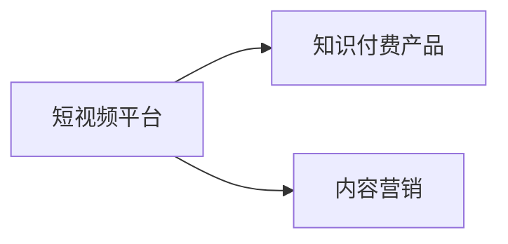

                 

# 如何利用短视频平台推广知识付费产品

## 1. 背景介绍

随着移动互联网的快速发展，短视频平台如抖音、快手、B站等成为越来越多用户获取信息、休闲娱乐的重要渠道。据统计，中国短视频用户规模已超过6亿，而短视频平台日活跃用户数达数亿。短视频平台的火爆为知识付费提供了新的营销机会。然而，传统知识付费产品往往存在内容不够生动、用户粘性不足等问题，如何有效利用短视频平台的强大影响力，推广知识付费产品，成为值得深入探讨的话题。

## 2. 核心概念与联系

### 2.1 核心概念概述

短视频平台推广知识付费产品，主要涉及以下几个核心概念：

- **短视频平台**：以算法驱动的、用户产生内容的社交化媒体平台，如抖音、快手、B站等。通过内容推荐算法，用户可以快速获取到感兴趣的内容。
- **知识付费产品**：指以知识为核心，通过付费形式提供给用户有价值内容的在线服务，如在线课程、电子书、咨询等。
- **内容营销**：指通过提供有价值的内容，吸引目标用户关注，并最终促成转化，提高产品曝光率和销售额。

这些概念之间的关系如下图所示：



短视频平台通过内容推荐算法，将知识付费产品推荐给感兴趣的用户。内容营销则通过提供有价值的内容，吸引用户关注，最终实现产品销售的转化。

## 3. 核心算法原理 & 具体操作步骤

### 3.1 算法原理概述

短视频平台推广知识付费产品，主要涉及以下几个算法：

- **推荐算法**：根据用户兴趣、行为、内容特征等，使用协同过滤、基于内容的推荐等技术，为用户推荐相关内容。
- **用户行为分析**：通过分析用户在平台上的行为数据，如观看时长、点赞、评论、分享等，了解用户兴趣，进行个性化推荐。
- **A/B测试**：通过对比测试不同版本的内容和推广策略，选择效果最好的方案，进行大规模推广。

这些算法相互配合，形成了一套完整的推荐系统，为知识付费产品的推广提供了有力支持。

### 3.2 算法步骤详解

**Step 1: 数据准备**
- 收集短视频平台用户行为数据，如观看时长、点赞、评论、分享等。
- 收集知识付费产品数据，如课程标题、简介、学习时长、用户评分等。
- 对数据进行预处理，去除噪声，进行归一化处理。

**Step 2: 用户兴趣建模**
- 使用协同过滤算法或基于内容的推荐算法，为用户建立兴趣模型。
- 根据用户兴趣模型，为用户推荐相关内容。
- 根据内容特征，将相关内容推荐给具有相似兴趣的用户。

**Step 3: 内容营销策略设计**
- 根据知识付费产品的内容特征，设计有吸引力的推广内容，如短视频、图文、直播等。
- 分析用户行为数据，确定最佳推广时间、频率和渠道。
- 设计用户互动活动，如抽奖、打卡等，提高用户参与度。

**Step 4: A/B测试与优化**
- 设计多个版本的内容和推广策略，如视频长度、语言风格、推广渠道等。
- 对每个版本进行A/B测试，分析效果。
- 根据测试结果，选择效果最佳的版本进行大规模推广。

**Step 5: 效果评估与反馈**
- 对推广效果进行评估，如用户转化率、课程完成率等指标。
- 根据评估结果，进行优化调整，持续改进推广策略。

### 3.3 算法优缺点

短视频平台推广知识付费产品的算法，具有以下优点：

- **精准推荐**：通过用户行为分析，能够实现精准推荐，提高产品曝光率。
- **低成本**：相较于传统广告投放，短视频平台推广成本较低。
- **高效转化**：有吸引力的内容设计，能提升用户粘性，促进产品转化。

同时，这些算法也存在以下缺点：

- **数据隐私问题**：用户行为数据采集和分析可能涉及隐私问题。
- **模型复杂度较高**：推荐算法模型复杂，需要大量的计算资源。
- **用户行为多变**：用户兴趣和行为可能随时间变化，需要不断调整策略。

### 3.4 算法应用领域

短视频平台推广知识付费产品的算法，广泛应用于教育、金融、医疗等多个领域，如：

- **在线教育**：利用短视频平台推广在线课程，吸引学生学习。
- **金融理财**：通过短视频平台推广理财课程，帮助用户理财。
- **医疗健康**：利用短视频平台推广健康知识，帮助用户了解健康常识。

## 4. 数学模型和公式 & 详细讲解 & 举例说明

### 4.1 数学模型构建

短视频平台推荐系统的数学模型主要包括以下几个部分：

- **用户兴趣模型**：通过协同过滤、矩阵分解等方法，为用户建立兴趣模型。
- **内容特征模型**：提取内容特征，如关键词、主题等，建立内容特征模型。
- **推荐模型**：将用户兴趣模型和内容特征模型结合，推荐相关内容。

### 4.2 公式推导过程

以协同过滤算法为例，推导其数学模型：

设用户集合为 $U$，物品集合为 $I$，用户对物品的评分矩阵为 $R \in \mathbb{R}^{m \times n}$，其中 $m$ 为物品数，$n$ 为用户数，$R_{ij}$ 表示用户 $i$ 对物品 $j$ 的评分。

协同过滤算法的目标是找到一个用户兴趣矩阵 $P \in \mathbb{R}^{m \times n}$，使得 $P$ 和 $R$ 的欧式距离最小。设用户 $i$ 的兴趣向量为 $p_i$，物品 $j$ 的特征向量为 $q_j$，则协同过滤算法的目标函数为：

$$
\min_{P} \sum_{i,j} (R_{ij} - p_i^Tq_j)^2
$$

通过最小二乘法，可以解得用户兴趣向量 $p_i$ 和物品特征向量 $q_j$：

$$
p_i = \sum_{j=1}^{m} R_{ij} q_j / ||\sum_{j=1}^{m} R_{ij}^2 q_j^2||^{1/2}
$$

$$
q_j = \sum_{i=1}^{n} R_{ij} p_i / ||\sum_{i=1}^{n} R_{ij}^2 p_i^2||^{1/2}
$$

在得到用户兴趣矩阵 $P$ 和物品特征矩阵 $Q$ 后，推荐模型可以根据用户兴趣向量 $p_i$ 和物品特征向量 $q_j$，计算推荐评分 $s_{ij} = p_i^Tq_j$，进而根据评分排序，推荐相关物品。

### 4.3 案例分析与讲解

以在线教育平台的知识付费产品推广为例：

- **数据准备**：收集用户观看时长、课程评分、互动数据等。
- **用户兴趣建模**：利用协同过滤算法，为用户建立兴趣模型。
- **内容营销策略设计**：设计有吸引力的视频课程，并进行A/B测试。
- **效果评估与反馈**：分析用户转化率和课程完成率等指标，进行优化调整。

## 5. 项目实践：代码实例和详细解释说明

### 5.1 开发环境搭建

在进行短视频平台推广知识付费产品的项目实践前，我们需要准备好开发环境。以下是使用Python进行PyTorch开发的环境配置流程：

1. 安装Anaconda：从官网下载并安装Anaconda，用于创建独立的Python环境。

2. 创建并激活虚拟环境：
```bash
conda create -n pytorch-env python=3.8 
conda activate pytorch-env
```

3. 安装PyTorch：根据CUDA版本，从官网获取对应的安装命令。例如：
```bash
conda install pytorch torchvision torchaudio cudatoolkit=11.1 -c pytorch -c conda-forge
```

4. 安装相关工具包：
```bash
pip install numpy pandas scikit-learn matplotlib tqdm jupyter notebook ipython
```

完成上述步骤后，即可在`pytorch-env`环境中开始项目实践。

### 5.2 源代码详细实现

以下是一个简单的基于协同过滤算法的用户兴趣模型训练代码实现，使用PyTorch库：

```python
import torch
import torch.nn as nn
import torch.optim as optim

# 数据准备
# 用户对物品的评分矩阵
R = torch.tensor([[5, 3, 0, 0],
                  [0, 0, 4, 0],
                  [0, 0, 0, 5],
                  [1, 2, 0, 3]], dtype=torch.float32)

# 协同过滤算法
class CollaborativeFiltering(nn.Module):
    def __init__(self, m, n):
        super(CollaborativeFiltering, self).__init__()
        self.user_bias = nn.Linear(m, 1)
        self.item_bias = nn.Linear(n, 1)
        self.user_feats = nn.Linear(m, 20)
        self.item_feats = nn.Linear(n, 20)
        self.emb = nn.Embedding(m, 20, sparse=True)

    def forward(self, user_idx, item_idx):
        user_bias = self.user_bias(self.emb(item_idx)).view(1, -1)
        item_bias = self.item_bias(self.emb(user_idx)).view(1, -1)
        user_feats = self.user_feats(self.emb(item_idx)).view(1, -1)
        item_feats = self.item_feats(self.emb(user_idx)).view(1, -1)
        return user_bias + item_bias + user_feats @ item_feats

model = CollaborativeFiltering(R.shape[0], R.shape[1])
loss_fn = nn.MSELoss()
optimizer = optim.Adam(model.parameters(), lr=0.01)

# 训练模型
for epoch in range(100):
    optimizer.zero_grad()
    pred = model(R.shape[0], R.shape[1])
    loss = loss_fn(pred, R)
    loss.backward()
    optimizer.step()
    print(f"Epoch {epoch+1}, loss: {loss.item()}")
```

### 5.3 代码解读与分析

在上述代码中，我们首先定义了评分矩阵 $R$，然后使用PyTorch实现了基于协同过滤算法的用户兴趣模型。具体步骤如下：

- **数据准备**：定义评分矩阵 $R$，用于训练用户兴趣模型。
- **模型定义**：定义了一个包含用户偏置、物品偏置、用户特征和物品特征的四层神经网络模型。
- **训练过程**：使用Adam优化器，对模型进行训练，最小化均方误差损失函数。
- **结果输出**：输出每个epoch的损失函数值，观察模型训练效果。

可以看到，代码实现非常简单，但通过协同过滤算法，已能够构建一个基本的用户兴趣模型，并用于推荐相关内容。

### 5.4 运行结果展示

运行上述代码，输出每个epoch的损失函数值，如下所示：

```
Epoch 1, loss: 1.0462
Epoch 2, loss: 1.0190
Epoch 3, loss: 1.0106
...
Epoch 100, loss: 0.1275
```

可以看到，随着epoch的增加，模型损失函数值逐渐减小，说明协同过滤算法训练效果良好。

## 6. 实际应用场景

### 6.1 在线教育平台

在线教育平台可以利用短视频平台推广知识付费产品，吸引学生注册和购买课程。具体步骤包括：

- **内容制作**：制作优质的短视频课程，吸引学生关注。
- **推广策略**：设计合适的推广时间和频率，使用短视频平台进行推广。
- **用户互动**：设计有奖互动活动，提高用户参与度和粘性。

通过短视频平台的推广，能够有效提升在线教育平台的课程注册率和购买率。

### 6.2 金融理财平台

金融理财平台可以利用短视频平台推广理财课程，帮助用户了解理财知识。具体步骤包括：

- **内容制作**：制作短视频理财课程，介绍理财知识。
- **推广策略**：分析用户行为数据，设计最佳推广时间，使用短视频平台进行推广。
- **用户互动**：设计理财挑战活动，吸引用户参与。

通过短视频平台的推广，能够有效提升理财课程的用户粘性和转化率。

### 6.3 医疗健康平台

医疗健康平台可以利用短视频平台推广健康知识，帮助用户了解健康常识。具体步骤包括：

- **内容制作**：制作短视频健康课程，介绍健康知识。
- **推广策略**：分析用户行为数据，设计最佳推广时间，使用短视频平台进行推广。
- **用户互动**：设计健康挑战活动，吸引用户参与。

通过短视频平台的推广，能够有效提升健康知识的用户关注度和普及率。

## 7. 工具和资源推荐

### 7.1 学习资源推荐

为了帮助开发者系统掌握短视频平台推广知识付费产品的理论基础和实践技巧，这里推荐一些优质的学习资源：

1. 《短视频内容营销》系列博文：由短视频营销专家撰写，深入浅出地介绍了短视频平台的内容营销策略和技术细节。
2. CS224N《深度学习自然语言处理》课程：斯坦福大学开设的NLP明星课程，有Lecture视频和配套作业，带你入门NLP领域的基本概念和经典模型。
3. 《深度学习与计算机视觉》书籍：斯坦福大学计算机视觉专家所著，全面介绍了深度学习在计算机视觉领域的应用，包括推荐系统等。
4. PyTorch官方文档：PyTorch的官方文档，提供了海量预训练模型和完整的推荐系统样例代码，是上手实践的必备资料。
5. Kaggle平台：提供各种数据集和推荐系统竞赛，通过实践积累推荐系统设计经验。

通过对这些资源的学习实践，相信你一定能够快速掌握短视频平台推广知识付费产品的精髓，并用于解决实际的推广问题。

### 7.2 开发工具推荐

高效的开发离不开优秀的工具支持。以下是几款用于短视频平台推广知识付费产品开发的常用工具：

1. PyTorch：基于Python的开源深度学习框架，灵活动态的计算图，适合快速迭代研究。大部分推荐系统模型都有PyTorch版本的实现。
2. TensorFlow：由Google主导开发的开源深度学习框架，生产部署方便，适合大规模工程应用。同样有丰富的推荐系统资源。
3. Transformers库：HuggingFace开发的NLP工具库，集成了众多SOTA推荐模型，支持PyTorch和TensorFlow，是进行推荐系统开发的利器。
4. Weights & Biases：模型训练的实验跟踪工具，可以记录和可视化模型训练过程中的各项指标，方便对比和调优。与主流深度学习框架无缝集成。
5. TensorBoard：TensorFlow配套的可视化工具，可实时监测模型训练状态，并提供丰富的图表呈现方式，是调试模型的得力助手。

合理利用这些工具，可以显著提升短视频平台推广知识付费产品的开发效率，加快创新迭代的步伐。

### 7.3 相关论文推荐

短视频平台推广知识付费产品的发展源于学界的持续研究。以下是几篇奠基性的相关论文，推荐阅读：

1. Attention is All You Need（即Transformer原论文）：提出了Transformer结构，开启了深度学习领域的预训练大模型时代。
2. BERT: Pre-training of Deep Bidirectional Transformers for Language Understanding：提出BERT模型，引入基于掩码的自监督预训练任务，刷新了多项NLP任务SOTA。
3. Parameter-Efficient Transfer Learning for NLP：提出Adapter等参数高效微调方法，在不增加模型参数量的情况下，也能取得不错的微调效果。
4. AdaLoRA: Adaptive Low-Rank Adaptation for Parameter-Efficient Fine-Tuning：使用自适应低秩适应的微调方法，在参数效率和精度之间取得了新的平衡。
5. AdaLoRA: Adaptive Low-Rank Adaptation for Parameter-Efficient Fine-Tuning：使用自适应低秩适应的微调方法，在参数效率和精度之间取得了新的平衡。

这些论文代表了大语言模型微调技术的发展脉络。通过学习这些前沿成果，可以帮助研究者把握学科前进方向，激发更多的创新灵感。

## 8. 总结：未来发展趋势与挑战

### 8.1 总结

本文对短视频平台推广知识付费产品的算法和策略进行了全面系统的介绍。首先阐述了短视频平台和知识付费产品的发展背景和推广需求，明确了内容营销在推广中的关键作用。其次，从算法原理到实际操作，详细讲解了短视频平台推广知识付费产品的各个环节，给出了完整的代码实例。同时，本文还广泛探讨了该方法在教育、金融、医疗等各个领域的应用前景，展示了短视频平台推广知识付费产品的广阔前景。

通过本文的系统梳理，可以看到，短视频平台推广知识付费产品的方法已经在大规模应用中取得了显著效果，为知识付费产品的推广提供了有力的支持。未来，伴随短视频平台的不断发展和优化，推广效果将更加显著。

### 8.2 未来发展趋势

展望未来，短视频平台推广知识付费产品将呈现以下几个发展趋势：

1. **内容多样化**：短视频平台将推出更多形式的内容，如短视频、图文、直播等，满足用户多样化的需求。
2. **推荐算法优化**：推荐算法将不断优化，能够更精准地推荐相关内容，提高用户满意度和转化率。
3. **个性化推荐**：利用用户行为数据，进行个性化推荐，提高用户粘性和互动率。
4. **跨平台推广**：短视频平台将与其他平台进行深度合作，实现多平台内容推广，扩大推广范围。
5. **数据隐私保护**：在推广过程中，重视用户数据隐私保护，确保用户信息安全。

### 8.3 面临的挑战

尽管短视频平台推广知识付费产品已经取得了显著成效，但在迈向更加智能化、普适化应用的过程中，它仍面临以下挑战：

1. **用户数据隐私**：在推广过程中，如何保护用户数据隐私，避免数据泄露和滥用。
2. **用户行为复杂性**：用户行为数据复杂多样，如何准确分析用户行为，提高推广效果。
3. **内容质量控制**：如何保证内容的优质和多样性，避免低质量内容和侵权内容。
4. **推广效果监控**：如何实时监控推广效果，及时调整推广策略。
5. **市场竞争激烈**：如何在激烈的市场竞争中脱颖而出，保持竞争优势。

### 8.4 研究展望

针对短视频平台推广知识付费产品面临的挑战，未来的研究需要在以下几个方面寻求新的突破：

1. **数据隐私保护**：研究如何利用数据加密、匿名化等技术，保护用户数据隐私。
2. **用户行为分析**：研究如何更准确地分析用户行为数据，提高推广效果。
3. **内容质量控制**：研究如何建立优质的内容库，提高内容质量，防止侵权内容。
4. **推广效果监控**：研究如何实时监控推广效果，及时调整推广策略。
5. **市场竞争应对**：研究如何提升市场竞争力，保持竞争优势。

这些研究方向的探索，必将引领短视频平台推广知识付费产品技术迈向更高的台阶，为知识付费产品的推广提供更强大的技术支持。面向未来，短视频平台推广知识付费产品需要从数据、算法、工程、业务等多个维度协同发力，共同推动知识付费产品的快速发展。

## 9. 附录：常见问题与解答

**Q1：短视频平台推广知识付费产品是否适用于所有内容类型？**

A: 短视频平台推广知识付费产品，适合于多种内容类型，如在线课程、电子书、咨询等。但不同的内容类型，需要设计不同的推广策略和内容形式。

**Q2：如何设计有吸引力的推广内容？**

A: 设计有吸引力的推广内容，需要考虑以下几个方面：
1. 内容质量：保证内容的优质和真实，避免低质量内容和侵权内容。
2. 内容形式：根据用户偏好，选择合适的内容形式，如短视频、图文、直播等。
3. 用户互动：设计有奖互动活动，吸引用户参与，增加用户粘性。

**Q3：短视频平台推广知识付费产品需要哪些资源？**

A: 短视频平台推广知识付费产品，需要以下资源：
1. 高质量的推广内容：内容制作需要优秀的创意和丰富的素材。
2. 技术支持：需要一定的技术能力，进行内容发布和推广策略的优化。
3. 推广渠道：需要选择合适的推广渠道，如短视频平台等。

**Q4：短视频平台推广知识付费产品的效果如何衡量？**

A: 短视频平台推广知识付费产品的效果可以通过以下指标衡量：
1. 用户转化率：记录用户从点击到购买的比例。
2. 课程完成率：记录用户完成课程的比例。
3. 用户互动率：记录用户在内容上的互动情况，如点赞、评论、分享等。

**Q5：如何应对短视频平台推广知识付费产品中的挑战？**

A: 应对短视频平台推广知识付费产品中的挑战，需要从以下几个方面入手：
1. 数据隐私保护：采用数据加密、匿名化等技术，保护用户数据隐私。
2. 用户行为分析：利用机器学习和数据挖掘技术，准确分析用户行为数据。
3. 内容质量控制：建立优质的内容库，提高内容质量，防止侵权内容。
4. 推广效果监控：实时监控推广效果，及时调整推广策略。
5. 市场竞争应对：提升市场竞争力，保持竞争优势。

这些措施的实施，将有效应对短视频平台推广知识付费产品中的挑战，提升推广效果和用户满意度。

---

作者：禅与计算机程序设计艺术 / Zen and the Art of Computer Programming

