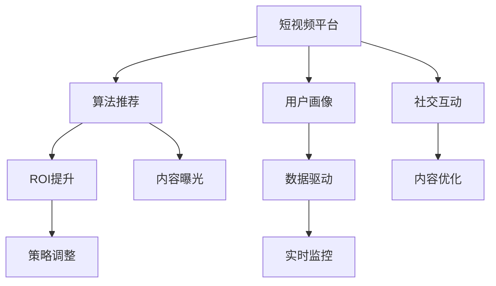

                 

# 如何利用短视频平台进行社群营销

> 关键词：短视频平台、社群营销、算法推荐、用户画像、数据驱动、ROI提升、社交互动、内容优化

## 1. 背景介绍

### 1.1 问题由来

随着移动互联网的迅速发展，短视频平台已成为了许多人日常生活的重要组成部分。这一趋势不仅改变了许多人的信息获取方式，也为品牌和营销人员提供了全新的传播途径。如何在短视频平台上进行有效的社群营销，成为许多品牌关注的核心问题。

在短视频平台上进行社群营销的初衷，是为了建立品牌与消费者之间的深度连接，提升品牌知名度和用户忠诚度。传统的文字、图片广告传播效果有限，而短视频因其形式新颖、信息量大、易于传播的特性，成为品牌营销的新宠。品牌利用短视频平台进行社群营销时，不仅仅是要展示产品或服务，更需要通过内容创新和互动，吸引更多用户关注和参与，形成良好的品牌社群效应。

### 1.2 问题核心关键点

短视频平台社群营销的核心关键点包括以下几个方面：

- **算法推荐**：短视频平台基于用户行为数据进行智能推荐，提高内容曝光率。
- **用户画像**：构建详细的用户画像，了解目标受众的兴趣、行为和偏好。
- **数据驱动**：利用大数据分析，进行实时监控和调整，优化营销策略。
- **ROI提升**：提升营销活动的投入产出比，最大化营销效果。
- **社交互动**：促进用户之间的互动，形成品牌社群。
- **内容优化**：不断优化短视频内容，提高用户吸引力和参与度。

### 1.3 问题研究意义

短视频平台社群营销对于提升品牌知名度、提高用户忠诚度、增强用户互动等方面具有重要意义。通过深入研究和掌握短视频平台的特点，品牌可以更有效地进行社群营销，实现品牌价值的最大化。

## 2. 核心概念与联系

### 2.1 核心概念概述

在进行短视频平台社群营销时，需要明确以下核心概念：

- **短视频平台**：如抖音、快手、YouTube等，这些平台为用户提供了上传、分享和观看短视频的社区环境。
- **算法推荐**：通过数据分析和机器学习算法，对用户进行精准推荐，提高内容曝光率。
- **用户画像**：基于用户行为数据构建的标签体系，用于细分用户群体。
- **数据驱动**：利用数据分析工具和技术，进行实时监控和策略调整。
- **ROI提升**：提升营销活动的效率和效果，实现营销成本的最小化。
- **社交互动**：通过内容互动，促进用户间的交流和品牌社群的形成。
- **内容优化**：不断改进和优化短视频内容，提升用户体验和参与度。

这些概念之间有着紧密的联系：算法推荐和用户画像构建是短视频平台的基础，数据驱动和ROI提升是策略执行的核心，社交互动和内容优化则是社群营销的关键。

### 2.2 核心概念原理和架构的 Mermaid 流程图



## 3. 核心算法原理 & 具体操作步骤

### 3.1 算法原理概述

短视频平台社群营销的核心算法包括算法推荐、用户画像构建、数据驱动、ROI提升、社交互动和内容优化。这些算法共同作用，形成了高效的社群营销体系。

算法推荐通过数据分析和机器学习算法，对用户进行精准推荐，提升内容曝光率。用户画像构建基于用户行为数据，构建详细的用户标签体系，用于细分用户群体。数据驱动利用数据分析工具和技术，进行实时监控和策略调整。ROI提升通过优化营销活动，提升投入产出比，最大化营销效果。社交互动通过内容互动，促进用户间的交流和品牌社群的形成。内容优化不断改进和优化短视频内容，提升用户体验和参与度。

### 3.2 算法步骤详解

#### 3.2.1 算法推荐

1. **数据收集**：收集用户行为数据，包括观看历史、点赞、评论等。
2. **特征工程**：提取用户和内容的特征，如用户兴趣、内容标签等。
3. **算法训练**：使用机器学习算法，训练推荐模型。
4. **内容推荐**：根据用户画像和特征，生成推荐内容。

#### 3.2.2 用户画像构建

1. **数据收集**：收集用户的基本信息、行为数据、兴趣标签等。
2. **数据清洗**：处理数据中的噪音和异常。
3. **特征工程**：提取和构建用户画像的关键特征。
4. **画像生成**：基于用户数据生成用户画像。

#### 3.2.3 数据驱动

1. **数据采集**：实时采集用户行为数据。
2. **数据分析**：使用数据分析工具和技术，进行实时监控。
3. **策略调整**：根据分析结果，调整营销策略。

#### 3.2.4 ROI提升

1. **成本监控**：实时监控营销活动的成本。
2. **效果分析**：分析营销活动的效果。
3. **策略优化**：优化营销策略，提升ROI。

#### 3.2.5 社交互动

1. **互动设计**：设计互动内容和形式。
2. **用户参与**：引导用户参与互动。
3. **社群形成**：促进用户间的交流和社群的形成。

#### 3.2.6 内容优化

1. **内容分析**：分析用户对不同内容的反馈。
2. **内容改进**：改进和优化短视频内容。
3. **内容发布**：发布优化后的短视频内容。

### 3.3 算法优缺点

#### 优点

1. **高效曝光**：算法推荐和用户画像构建，可以提升内容曝光率，提高用户覆盖面。
2. **精准定位**：基于用户画像，可以精准定位目标受众，提高营销效果。
3. **实时调整**：数据驱动和策略调整，可以实时监控和调整营销策略，提升效果。
4. **互动增强**：社交互动和内容优化，可以增强用户间的互动，形成品牌社群。

#### 缺点

1. **数据隐私**：用户数据收集和分析可能涉及隐私问题，需要严格遵守相关法律法规。
2. **成本高昂**：高质量的数据采集和分析需要高昂的成本，中小型企业可能难以承受。
3. **算法复杂**：算法推荐和用户画像构建需要复杂的技术实现，需要专业人才支持。
4. **效果不确定**：数据驱动和ROI提升依赖于数据质量和策略调整，效果可能存在不确定性。

### 3.4 算法应用领域

短视频平台社群营销主要应用于以下领域：

1. **品牌推广**：通过短视频平台进行品牌推广，提升品牌知名度和用户忠诚度。
2. **产品营销**：利用短视频平台展示产品，引导用户购买。
3. **用户互动**：通过内容互动，促进用户间的交流，形成品牌社群。
4. **市场调研**：通过数据分析，进行市场调研和策略调整。
5. **活动策划**：策划和执行各种在线活动，提高用户参与度。

## 4. 数学模型和公式 & 详细讲解 & 举例说明

### 4.1 数学模型构建

短视频平台社群营销的数学模型主要包括以下几个部分：

1. **用户画像模型**：
   $$
   P = f(X, Y, Z)
   $$
   其中 $P$ 为用户画像，$X$ 为用户基本信息，$Y$ 为用户行为数据，$Z$ 为用户兴趣标签。

2. **推荐模型**：
   $$
   R = \sum_{i=1}^{n} w_i f_i(P)
   $$
   其中 $R$ 为推荐结果，$n$ 为推荐内容数，$w_i$ 为内容权重，$f_i(P)$ 为内容与用户画像的匹配度。

3. **互动模型**：
   $$
   I = \sum_{i=1}^{m} a_i f_i(P)
   $$
   其中 $I$ 为互动次数，$m$ 为互动内容数，$a_i$ 为互动权重，$f_i(P)$ 为内容与用户画像的匹配度。

4. **效果评估模型**：
   $$
   E = \frac{C - C_0}{C_0}
   $$
   其中 $E$ 为效果评估指标，$C$ 为实际收益，$C_0$ 为基准收益。

### 4.2 公式推导过程

1. **用户画像模型推导**：
   $$
   P = f(X, Y, Z) = \sum_{i=1}^{k} \alpha_i x_i + \sum_{j=1}^{m} \beta_j y_j + \sum_{l=1}^{n} \gamma_l z_l
   $$
   其中 $k$ 为用户基本信息特征数，$m$ 为用户行为数据特征数，$n$ 为用户兴趣标签数，$\alpha_i$、$\beta_j$、$\gamma_l$ 为特征权重。

2. **推荐模型推导**：
   $$
   R = \sum_{i=1}^{n} w_i f_i(P) = \sum_{i=1}^{n} w_i \sigma(P \cdot t_i)
   $$
   其中 $t_i$ 为内容的特征向量，$\sigma$ 为激活函数。

3. **互动模型推导**：
   $$
   I = \sum_{i=1}^{m} a_i f_i(P) = \sum_{i=1}^{m} a_i \sigma(P \cdot t_i)
   $$
   其中 $t_i$ 为互动内容的特征向量。

4. **效果评估模型推导**：
   $$
   E = \frac{C - C_0}{C_0} = 1 - \frac{C_0}{C}
   $$

### 4.3 案例分析与讲解

以某品牌在抖音上进行社群营销为例：

1. **用户画像构建**：
   - **数据收集**：收集用户的观看历史、点赞、评论等行为数据。
   - **特征工程**：提取用户基本信息和行为数据中的关键特征，如年龄、性别、兴趣等。
   - **画像生成**：通过机器学习算法，构建用户画像。

2. **算法推荐**：
   - **数据收集**：收集热门视频和用户的行为数据。
   - **特征工程**：提取视频内容和用户画像的特征。
   - **算法训练**：使用协同过滤、深度学习等算法，训练推荐模型。
   - **内容推荐**：根据用户画像，推荐相关视频内容。

3. **数据驱动**：
   - **数据采集**：实时采集用户观看、点赞、评论等数据。
   - **数据分析**：使用数据分析工具，进行实时监控和调整。
   - **策略调整**：根据分析结果，调整营销策略。

4. **社交互动**：
   - **互动设计**：设计互动话题和互动形式，如问答、抽奖等。
   - **用户参与**：引导用户参与互动，形成品牌社群。

5. **内容优化**：
   - **内容分析**：分析用户对不同内容的反馈，识别受欢迎的内容类型。
   - **内容改进**：改进和优化短视频内容，提高用户体验和参与度。

## 5. 项目实践：代码实例和详细解释说明

### 5.1 开发环境搭建

在进行短视频平台社群营销的实践前，需要先搭建好开发环境。以下是使用Python进行开发的环境配置流程：

1. 安装Python：确保安装最新版本的Python，建议使用Anaconda。

2. 安装依赖包：
   ```bash
   pip install pandas numpy scikit-learn transformers torch torchvision
   ```

3. 搭建数据环境：
   ```bash
   mkdir data
   cd data
   mkdir train dev test
   ```

4. 准备数据集：
   ```bash
   cd train
   wget https://your-data-source/path/to/train.csv
   cd dev
   wget https://your-data-source/path/to/dev.csv
   cd test
   wget https://your-data-source/path/to/test.csv
   ```

### 5.2 源代码详细实现

下面我们以抖音平台上的品牌推广为例，给出使用Python进行用户画像构建和推荐算法开发的代码实现。

```python
import pandas as pd
import numpy as np
from sklearn.model_selection import train_test_split
from sklearn.feature_extraction.text import TfidfVectorizer
from sklearn.decomposition import TruncatedSVD

# 读取用户数据
user_data = pd.read_csv('data/user_data.csv')

# 特征工程
user_features = user_data[['age', 'gender', 'interest']]
user_features.fillna(0, inplace=True)

# 构建用户画像
svd = TruncatedSVD(n_components=10)
user_profile = svd.fit_transform(user_features)

# 读取视频数据
video_data = pd.read_csv('data/video_data.csv')

# 特征工程
video_features = video_data[['content', 'label']]
video_features.fillna(0, inplace=True)

# 构建视频画像
svd = TruncatedSVD(n_components=10)
video_profile = svd.fit_transform(video_features)

# 训练推荐模型
user_video_similarity = np.dot(user_profile, video_profile.T)
svd = TruncatedSVD(n_components=10)
recommendation_matrix = svd.fit_transform(user_video_similarity)

# 实现推荐算法
def recommendation(user_profile, video_profile, similarity_matrix):
    user_video_similarity = np.dot(user_profile, video_profile.T)
    user_ranking = np.argsort(user_video_similarity)[::-1]
    return user_ranking

# 测试推荐算法
user_index = 0
user_profile = user_profile[user_index].reshape(1, -1)
video_ranking = recommendation(user_profile, video_profile, similarity_matrix)
print(video_ranking)
```

### 5.3 代码解读与分析

以上代码实现了用户画像构建和推荐算法的基本流程：

1. **用户画像构建**：
   - 从用户数据中提取基本信息和行为数据，并进行特征工程。
   - 使用奇异值分解(SVD)对用户特征进行降维，构建用户画像。

2. **视频画像构建**：
   - 从视频数据中提取内容标签和视频特征，并进行特征工程。
   - 使用奇异值分解对视频特征进行降维，构建视频画像。

3. **推荐模型训练**：
   - 计算用户画像和视频画像之间的相似度矩阵。
   - 使用奇异值分解对相似度矩阵进行降维，构建推荐矩阵。
   - 实现推荐算法，根据相似度矩阵生成推荐结果。

## 6. 实际应用场景

### 6.1 智能客服

智能客服是短视频平台社群营销的重要应用场景之一。通过在短视频平台上发布客服视频，结合智能推荐算法，品牌可以快速响应客户咨询，提高服务效率。例如，某电商平台可以发布包含产品介绍和常见问题的短视频，用户通过观看视频获取信息，并在评论区提出问题，系统自动推荐相关视频解答用户疑问。

### 6.2 品牌推广

品牌通过短视频平台进行品牌推广，可以大幅提升品牌知名度和用户忠诚度。例如，某品牌可以发布品牌故事、产品介绍、用户评价等短视频内容，通过算法推荐和互动设计，吸引用户关注和参与。品牌还可以通过用户画像分析，精准定位目标受众，进行个性化推广。

### 6.3 用户互动

短视频平台上的用户互动活动，可以增强用户参与度和品牌社群的形成。例如，某品牌可以发起问答活动、抽奖活动、互动挑战等，通过互动内容设计，吸引用户参与，形成品牌社群。品牌还可以通过社交媒体分享活动内容，扩大活动影响范围，提升品牌曝光度。

### 6.4 未来应用展望

未来，短视频平台社群营销将呈现以下几个发展趋势：

1. **个性化推荐**：通过不断优化算法推荐模型，实现更加个性化的内容推荐，提升用户体验。
2. **多平台联动**：将短视频平台与其他社交媒体平台联动，形成跨平台的用户互动。
3. **智能客服**：结合智能推荐和智能客服，提供更加高效和个性化的客户服务。
4. **内容创新**：不断创新短视频内容形式，吸引用户关注和参与。
5. **数据驱动**：利用大数据分析和实时监控，优化营销策略，提升效果。

## 7. 工具和资源推荐

### 7.1 学习资源推荐

为了帮助开发者系统掌握短视频平台社群营销的理论基础和实践技巧，这里推荐一些优质的学习资源：

1. **《短视频营销实战》**：详细介绍了短视频平台营销的各个环节，包括内容制作、算法推荐、用户互动等，是入门必备书籍。

2. **Coursera《社交媒体营销》课程**：涵盖社交媒体营销的各个方面，包括短视频平台的运营策略和数据分析。

3. **《短视频平台算法》**：介绍短视频平台算法的原理和应用，是算法驱动营销的必备参考资料。

4. **HuggingFace官方文档**：介绍Transformers库的应用，涵盖视频生成、推荐系统等方向。

5. **Udacity《数据驱动营销》课程**：涵盖数据分析、算法推荐、策略调整等方向，适合实战型学习。

通过这些资源的学习实践，相信你一定能够快速掌握短视频平台社群营销的精髓，并用于解决实际的营销问题。

### 7.2 开发工具推荐

高效的开发离不开优秀的工具支持。以下是几款用于短视频平台社群营销开发的常用工具：

1. **Python**：强大的数据处理和算法实现能力，适合进行复杂的数据分析和模型训练。
2. **Jupyter Notebook**：交互式的数据分析和模型验证工具，适合进行科研和开发。
3. **TensorFlow**：深度学习框架，适合进行复杂的深度模型训练。
4. **PyTorch**：深度学习框架，适合进行模型优化和部署。
5. **Tableau**：数据可视化工具，适合进行实时监控和数据分析。

合理利用这些工具，可以显著提升短视频平台社群营销的开发效率，加快创新迭代的步伐。

### 7.3 相关论文推荐

短视频平台社群营销的研究源于学界的持续研究。以下是几篇奠基性的相关论文，推荐阅读：

1. **《基于深度学习的视频推荐算法》**：介绍基于深度学习的视频推荐模型，是算法推荐的重要参考资料。

2. **《社交媒体数据挖掘与分析》**：介绍社交媒体数据挖掘和分析的方法，适合数据分析和策略调整。

3. **《短视频平台的内容推荐研究》**：介绍短视频平台的内容推荐算法，涵盖协同过滤、深度学习等方向。

4. **《基于社交媒体的营销效果评估》**：介绍社交媒体营销效果评估的方法，适合效果评估和策略优化。

这些论文代表了大语言模型微调技术的发展脉络。通过学习这些前沿成果，可以帮助研究者把握学科前进方向，激发更多的创新灵感。

## 8. 总结：未来发展趋势与挑战

### 8.1 总结

本文对短视频平台社群营销方法进行了全面系统的介绍。首先阐述了短视频平台社群营销的研究背景和意义，明确了社群营销在提升品牌知名度、提高用户忠诚度、增强用户互动等方面的重要价值。其次，从原理到实践，详细讲解了算法推荐、用户画像构建、数据驱动、ROI提升、社交互动和内容优化等核心算法，并给出了代码实现。同时，本文还广泛探讨了短视频平台社群营销在智能客服、品牌推广、用户互动等多个领域的应用前景，展示了其巨大的潜力。

通过本文的系统梳理，可以看到，短视频平台社群营销是品牌营销的重要方向，能够有效提升品牌知名度和用户忠诚度，增强用户互动。通过深入研究和掌握短视频平台的特点，品牌可以更有效地进行社群营销，实现品牌价值的最大化。

### 8.2 未来发展趋势

展望未来，短视频平台社群营销将呈现以下几个发展趋势：

1. **个性化推荐**：通过不断优化算法推荐模型，实现更加个性化的内容推荐，提升用户体验。
2. **多平台联动**：将短视频平台与其他社交媒体平台联动，形成跨平台的用户互动。
3. **智能客服**：结合智能推荐和智能客服，提供更加高效和个性化的客户服务。
4. **内容创新**：不断创新短视频内容形式，吸引用户关注和参与。
5. **数据驱动**：利用大数据分析和实时监控，优化营销策略，提升效果。

### 8.3 面临的挑战

尽管短视频平台社群营销已经取得了瞩目成就，但在迈向更加智能化、普适化应用的过程中，它仍面临着诸多挑战：

1. **数据隐私**：用户数据收集和分析可能涉及隐私问题，需要严格遵守相关法律法规。
2. **成本高昂**：高质量的数据采集和分析需要高昂的成本，中小型企业可能难以承受。
3. **算法复杂**：算法推荐和用户画像构建需要复杂的技术实现，需要专业人才支持。
4. **效果不确定**：数据驱动和ROI提升依赖于数据质量和策略调整，效果可能存在不确定性。

### 8.4 研究展望

面对短视频平台社群营销所面临的挑战，未来的研究需要在以下几个方面寻求新的突破：

1. **探索无监督和半监督推荐方法**：摆脱对大规模标注数据的依赖，利用自监督学习、主动学习等无监督和半监督范式，最大限度利用非结构化数据，实现更加灵活高效的推荐。
2. **研究参数高效和计算高效的推荐范式**：开发更加参数高效的推荐方法，在固定大部分预训练参数的同时，只更新极少量的任务相关参数。同时优化推荐模型的计算图，减少前向传播和反向传播的资源消耗，实现更加轻量级、实时性的部署。
3. **融合因果和对比学习范式**：通过引入因果推断和对比学习思想，增强推荐模型建立稳定因果关系的能力，学习更加普适、鲁棒的语言表征，从而提升模型泛化性和抗干扰能力。
4. **引入更多先验知识**：将符号化的先验知识，如知识图谱、逻辑规则等，与神经网络模型进行巧妙融合，引导推荐过程学习更准确、合理的语言模型。同时加强不同模态数据的整合，实现视觉、语音等多模态信息与文本信息的协同建模。
5. **结合因果分析和博弈论工具**：将因果分析方法引入推荐模型，识别出模型决策的关键特征，增强输出解释的因果性和逻辑性。借助博弈论工具刻画用户交互过程，主动探索并规避模型的脆弱点，提高系统稳定性。
6. **纳入伦理道德约束**：在推荐模型训练目标中引入伦理导向的评估指标，过滤和惩罚有偏见、有害的输出倾向。同时加强人工干预和审核，建立模型行为的监管机制，确保输出符合人类价值观和伦理道德。

这些研究方向的探索，必将引领短视频平台社群营销技术迈向更高的台阶，为构建安全、可靠、可解释、可控的智能系统铺平道路。面向未来，短视频平台社群营销技术还需要与其他人工智能技术进行更深入的融合，如知识表示、因果推理、强化学习等，多路径协同发力，共同推动自然语言理解和智能交互系统的进步。只有勇于创新、敢于突破，才能不断拓展短视频平台的边界，让智能技术更好地造福人类社会。

## 9. 附录：常见问题与解答

**Q1: 短视频平台社群营销的收益如何衡量？**

A: 短视频平台社群营销的收益主要通过以下指标衡量：
1. **品牌知名度**：通过用户互动、关注度等指标衡量品牌知名度提升效果。
2. **用户忠诚度**：通过复购率、重复观看率等指标衡量用户忠诚度提升效果。
3. **用户参与度**：通过点赞数、评论数、分享数等指标衡量用户参与度提升效果。
4. **投资回报率(ROI)**：通过实际收益与投入成本的比值衡量投资回报率。

**Q2: 短视频平台社群营销的优势有哪些？**

A: 短视频平台社群营销的优势主要体现在以下几个方面：
1. **高度互动性**：短视频平台的互动特性，使得品牌与用户之间可以形成更强的互动关系。
2. **高曝光率**：通过算法推荐和用户画像构建，可以实现高曝光率的精准推荐。
3. **高效传播**：短视频形式的传播速度快，用户易于接受和分享。
4. **多样化内容**：短视频平台内容形式丰富，品牌可以通过多样化的内容吸引用户关注。
5. **低成本推广**：相比于传统广告，短视频平台推广成本相对较低。

**Q3: 短视频平台社群营销面临的主要挑战有哪些？**

A: 短视频平台社群营销面临的主要挑战包括：
1. **数据隐私**：用户数据收集和分析可能涉及隐私问题，需要严格遵守相关法律法规。
2. **成本高昂**：高质量的数据采集和分析需要高昂的成本，中小型企业可能难以承受。
3. **算法复杂**：算法推荐和用户画像构建需要复杂的技术实现，需要专业人才支持。
4. **效果不确定**：数据驱动和ROI提升依赖于数据质量和策略调整，效果可能存在不确定性。

**Q4: 如何优化短视频平台社群营销的效果？**

A: 优化短视频平台社群营销的效果主要从以下几个方面入手：
1. **内容创新**：不断创新短视频内容形式，吸引用户关注和参与。
2. **算法优化**：优化推荐算法和用户画像构建模型，实现更加精准的推荐。
3. **用户互动**：设计互动话题和互动形式，促进用户间的交流，形成品牌社群。
4. **数据分析**：利用大数据分析工具，进行实时监控和策略调整。

**Q5: 短视频平台社群营销的未来发展方向是什么？**

A: 短视频平台社群营销的未来发展方向主要体现在以下几个方面：
1. **个性化推荐**：通过不断优化算法推荐模型，实现更加个性化的内容推荐。
2. **多平台联动**：将短视频平台与其他社交媒体平台联动，形成跨平台的用户互动。
3. **智能客服**：结合智能推荐和智能客服，提供更加高效和个性化的客户服务。
4. **内容创新**：不断创新短视频内容形式，吸引用户关注和参与。
5. **数据驱动**：利用大数据分析和实时监控，优化营销策略，提升效果。

通过这些研究，我们相信短视频平台社群营销技术将不断进步，为品牌提供更加高效的营销手段，同时为消费者提供更好的购物体验。

---

作者：禅与计算机程序设计艺术 / Zen and the Art of Computer Programming

