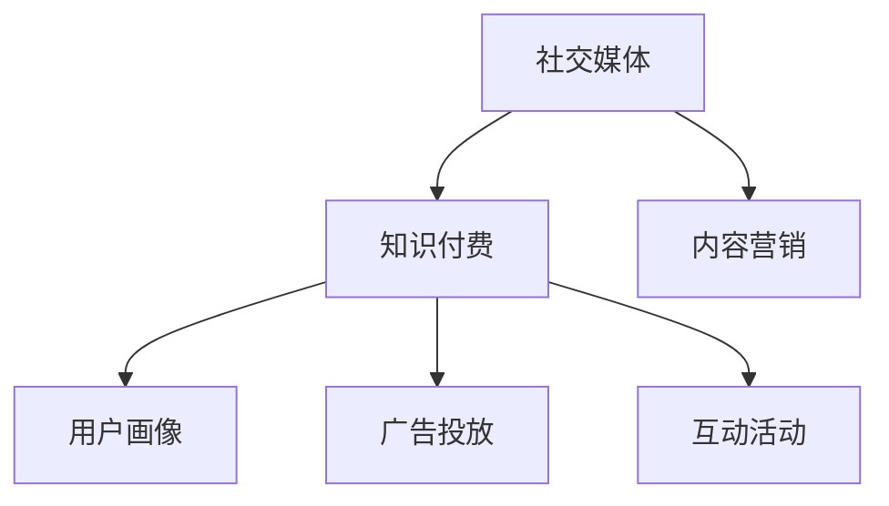

                 

## 1. 背景介绍

### 1.1 问题由来
随着知识付费市场的蓬勃发展，越来越多的企业和个人开始利用社交媒体推广自己的知识付费产品。然而，由于社交媒体平台的复杂性和用户行为的不可控性，如何高效、精准地推广知识付费产品，成为许多企业和个人面临的难题。本文将深入探讨利用社交媒体推广知识付费产品的核心原理和方法，提供可行的实践指南。

### 1.2 问题核心关键点
利用社交媒体推广知识付费产品，核心在于理解社交媒体的特性，结合产品定位，精准定位目标用户，并通过精心设计的营销策略，吸引并转化用户购买。具体来说，以下三个方面是关键点：

1. **社交媒体特性**：了解不同社交媒体平台的用户行为、内容消费习惯和广告生态，制定合适的推广策略。
2. **目标用户定位**：通过用户画像分析，明确目标用户的特征，设计针对性强的内容和广告。
3. **营销策略设计**：结合产品特性，设计有效的广告文案、互动活动和内容营销策略，提升用户转化率。

## 2. 核心概念与联系

### 2.1 核心概念概述

为更好地理解如何利用社交媒体推广知识付费产品，本节将介绍几个密切相关的核心概念：

- **社交媒体(Social Media)**：指通过互联网技术建立起来的，以人与人之间进行信息交流为主要目的的网络平台，如微信、微博、抖音、知乎等。
- **知识付费(Paid Content)**：指用户为获取知识、技能或经验，而支付一定费用的商业模式，如在线课程、电子书、咨询服务等。
- **内容营销(Content Marketing)**：指通过提供有价值的内容来吸引、留住和转化用户的一种营销策略。
- **用户画像(User Persona)**：指对目标用户的基本特征、兴趣、行为习惯等的抽象描述，用于指导精准营销。
- **广告投放(Advertising Placement)**：指将广告展示在特定平台上，通过精准定位用户来提升广告效果。
- **互动活动(Interactive Activities)**：指通过在社交媒体上举办互动活动，提升用户参与度和品牌影响力。

这些核心概念之间的逻辑关系可以通过以下Mermaid流程图来展示：



这个流程图展示了几者之间的关系：社交媒体是知识付费推广的平台，内容营销、用户画像、广告投放和互动活动都是利用社交媒体进行知识付费推广的关键环节。

## 3. 核心算法原理 & 具体操作步骤
### 3.1 算法原理概述

利用社交媒体推广知识付费产品的核心算法原理，可以归纳为以下几点：

1. **用户画像构建**：通过对目标用户的特征、兴趣、行为习惯等进行分析，构建用户画像，用于指导广告投放和内容营销。
2. **内容精准匹配**：根据用户画像，设计精准匹配用户需求的内容，提升内容的吸引力和转化率。
3. **广告投放优化**：通过分析广告效果，不断优化广告投放策略，提高广告的点击率和转化率。
4. **互动活动设计**：设计有吸引力的互动活动，增强用户参与度和品牌黏性。

### 3.2 算法步骤详解

利用社交媒体推广知识付费产品的具体操作步骤包括以下几个关键步骤：

**Step 1: 数据收集与分析**
- 收集目标用户的社交媒体行为数据，包括互动记录、关注对象、兴趣标签等。
- 分析用户数据，构建用户画像，确定目标用户的基本特征、兴趣偏好、行为习惯等。

**Step 2: 内容制作与优化**
- 根据用户画像，制作针对性内容，包括文章、视频、直播等。
- 通过A/B测试等方法，优化内容形式和内容策略，提升内容吸引力。

**Step 3: 广告投放与优化**
- 选择合适的社交媒体平台，设计广告文案和创意素材。
- 通过精准投放技术，将广告推送给目标用户。
- 定期分析广告效果，调整投放策略，优化广告投放ROI。

**Step 4: 互动活动设计与执行**
- 设计互动活动，如问答、抽奖、挑战等，吸引用户参与。
- 在社交媒体平台上执行互动活动，记录用户参与情况。
- 通过互动活动提升品牌影响力，增强用户黏性。

**Step 5: 数据分析与反馈**
- 收集和分析互动活动和广告投放的数据，评估活动效果。
- 根据数据分析结果，调整和优化营销策略，提升推广效果。

### 3.3 算法优缺点

利用社交媒体推广知识付费产品的方法具有以下优点：
1. **精准定位**：通过用户画像和精准投放技术，可以高效地将广告和内容推送给目标用户。
2. **高效互动**：通过互动活动，可以增强用户参与度，提升品牌影响力。
3. **快速响应**：社交媒体平台可以快速响应用户反馈和市场变化，灵活调整策略。
4. **成本可控**：相较于传统广告，社交媒体广告的成本可控性更高，效果可预见。

同时，该方法也存在一定的局限性：
1. **用户隐私问题**：在数据收集和分析过程中，需严格遵守隐私保护法规，避免用户隐私泄露。
2. **内容质量要求高**：高质量的内容是吸引用户的关键，制作优质内容需要投入大量资源。
3. **广告效果波动**：社交媒体广告效果受平台算法和用户行为的影响较大，存在波动性。
4. **市场竞争激烈**：社交媒体广告市场竞争激烈，需不断创新和优化，保持竞争优势。

尽管存在这些局限性，但就目前而言，利用社交媒体推广知识付费产品的方法仍是大规模推广的重要手段。未来相关研究的重点在于如何进一步优化广告投放策略，提升互动活动的吸引力，同时兼顾用户隐私和内容质量等因素。

### 3.4 算法应用领域

利用社交媒体推广知识付费产品的算法已广泛应用于各种垂直行业，包括在线教育、企业培训、金融知识、健康保健、文化娱乐等。这些领域具有相似的用户需求和市场特性，因此该方法可以有效地推广知识付费产品。

## 4. 数学模型和公式 & 详细讲解 & 举例说明
### 4.1 数学模型构建

利用社交媒体推广知识付费产品的核心模型可以构建如下：

设目标用户数量为 $N$，广告投放次数为 $K$，广告点击率为 $p$，转化率为 $r$，每次广告的平均成本为 $c$，则总推广成本为 $C = N \times K \times c$。

设推广效果为 $E$，包括点击次数和转化次数，则推广效果可以表示为 $E = N \times p \times r \times K$。

目标是最小化推广成本 $C$，最大化推广效果 $E$。

### 4.2 公式推导过程

首先，将推广成本和推广效果代入目标函数，得到：

$$
\min_{N, K, p, r} C = N \times K \times c
$$

$$
\max_{N, K, p, r} E = N \times p \times r \times K
$$

其次，考虑推广效果与推广成本之间的平衡，可以定义成本效益比（Cost-Effectiveness Ratio, CER）：

$$
CER = \frac{E}{C} = \frac{N \times p \times r \times K}{N \times K \times c} = \frac{p \times r}{c}
$$

其中 $p$ 和 $r$ 是需要优化的主要参数，$c$ 是固定成本。

为了最大化成本效益比 $CER$，需最大化 $p$ 和 $r$。

### 4.3 案例分析与讲解

以在线教育平台为例，分析其利用社交媒体推广的策略：

**案例背景**：某在线教育平台计划利用微信推广其付费课程，目标用户为25-35岁的在职人士，期望课程报名率提升30%。

**数据收集**：平台收集了目标用户的关注对象、互动记录和课程报名数据，发现目标用户主要关注技术、职场和职业技能相关的账号。

**内容制作**：平台制作了与课程内容相关的技术文章和视频，通过微信订阅号和视频号发布。

**广告投放**：平台选择了微信朋友圈广告和微信公众号推广，设计了与课程相关的广告文案和素材，投放给目标用户。

**互动活动**：平台在微信公众号举办了问答和抽奖活动，鼓励用户分享课程内容，并提供了课程优惠券。

**数据分析**：平台收集并分析了广告点击率和课程报名数据，发现微信朋友圈广告的点击率和转化率较高，微信公众号推广的效果较好。

**优化策略**：平台调整了广告投放策略，增加了微信朋友圈广告的投放量，同时优化了微信公众号推广的内容形式，提高了转化率。

通过上述分析，平台在推广过程中实现了推广成本的控制和推广效果的提升，最终实现了课程报名率的提升目标。

## 5. 项目实践：代码实例和详细解释说明
### 5.1 开发环境搭建

在进行社交媒体推广的知识付费产品推广实践中，首先需要准备好开发环境。以下是使用Python进行开发的环境配置流程：

1. 安装Python：从官网下载并安装Python 3.7以上版本。
2. 安装相关库：安装 requests、numpy、pandas、matplotlib 等库。

```bash
pip install requests numpy pandas matplotlib
```

3. 安装社交媒体API库：根据需要选择不同的社交媒体API库，如微信API库、微博API库、抖音API库等。

### 5.2 源代码详细实现

下面以微信公众号为例，给出使用Python进行知识付费产品推广的代码实现。

**Step 1: 数据收集**

```python
import requests
import pandas as pd

# 获取目标用户数据
user_data_url = 'https://example.com/user_data'
user_data = requests.get(user_data_url).json()
user_df = pd.DataFrame(user_data)

# 获取课程数据
course_data_url = 'https://example.com/course_data'
course_data = requests.get(course_data_url).json()
course_df = pd.DataFrame(course_data)

# 数据合并
merged_df = pd.merge(user_df, course_df, on='user_id')
```

**Step 2: 内容制作**

```python
import markdown
import numpy as np

# 内容生成函数
def generate_content(user_id, course_id):
    # 根据用户画像和课程信息生成内容
    # ...
    return markdown_content

# 批量生成内容
content_list = []
for user_id, course_id in merged_df.itertuples():
    content_list.append(generate_content(user_id, course_id))
```

**Step 3: 广告投放**

```python
import time

# 广告投放函数
def publish_ad(ad_type, ad_content, target_user_list):
    # 根据广告类型和内容，投放广告
    # ...
    time.sleep(1)  # 避免频繁请求

# 投放广告
ad_type = '微信公众号推广'
ad_content = '报名课程，领取优惠券！'
target_user_list = [user_id for user_id in user_df['user_id']]
publish_ad(ad_type, ad_content, target_user_list)
```

**Step 4: 互动活动**

```python
# 互动活动函数
def organize_interactive_activity(activity_type, activity_content):
    # 根据活动类型和内容，组织活动
    # ...
    time.sleep(1)  # 避免频繁请求

# 组织活动
activity_type = '微信公众号问答'
activity_content = '领取课程优惠券'
organize_interactive_activity(activity_type, activity_content)
```

### 5.3 代码解读与分析

让我们再详细解读一下关键代码的实现细节：

**数据收集**

```python
import requests
import pandas as pd

# 获取目标用户数据
user_data_url = 'https://example.com/user_data'
user_data = requests.get(user_data_url).json()
user_df = pd.DataFrame(user_data)

# 获取课程数据
course_data_url = 'https://example.com/course_data'
course_data = requests.get(course_data_url).json()
course_df = pd.DataFrame(course_data)

# 数据合并
merged_df = pd.merge(user_df, course_df, on='user_id')
```

这段代码利用requests库获取目标用户和课程数据，并将其合并成一个大数据集，为后续的内容制作和广告投放提供了基础数据支持。

**内容制作**

```python
import markdown
import numpy as np

# 内容生成函数
def generate_content(user_id, course_id):
    # 根据用户画像和课程信息生成内容
    # ...
    return markdown_content

# 批量生成内容
content_list = []
for user_id, course_id in merged_df.itertuples():
    content_list.append(generate_content(user_id, course_id))
```

内容生成函数根据用户画像和课程信息，生成符合目标用户需求的内容。批量生成内容可以同时为多个用户生成相应的内容，提升内容制作效率。

**广告投放**

```python
import time

# 广告投放函数
def publish_ad(ad_type, ad_content, target_user_list):
    # 根据广告类型和内容，投放广告
    # ...
    time.sleep(1)  # 避免频繁请求

# 投放广告
ad_type = '微信公众号推广'
ad_content = '报名课程，领取优惠券！'
target_user_list = [user_id for user_id in user_df['user_id']]
publish_ad(ad_type, ad_content, target_user_list)
```

广告投放函数根据广告类型和内容，将广告投放给目标用户。同时，为了避免频繁请求，代码中加入了睡眠函数。

**互动活动**

```python
# 互动活动函数
def organize_interactive_activity(activity_type, activity_content):
    # 根据活动类型和内容，组织活动
    # ...
    time.sleep(1)  # 避免频繁请求

# 组织活动
activity_type = '微信公众号问答'
activity_content = '领取课程优惠券'
organize_interactive_activity(activity_type, activity_content)
```

互动活动函数根据活动类型和内容，组织相应的互动活动，同时加入睡眠函数，避免频繁请求。

### 5.4 运行结果展示

通过上述代码，平台可以收集目标用户和课程数据，批量生成内容，投放广告，组织互动活动，并实时收集和分析效果数据，实现高效、精准的知识付费产品推广。

## 6. 实际应用场景

### 6.1 智能客服系统

在智能客服系统中，利用社交媒体推广知识付费产品，可以提高客服系统的智能化水平，提升用户满意度。

**应用场景**：某在线教育平台通过微信推广其付费课程，目标用户为中小学生家长。平台在微信公众号上发布课程推荐、学习技巧等内容，并通过微信广告精准投放给目标用户。平台还举办了微信问答和抽奖活动，鼓励用户参与并分享课程内容。

**推广效果**：通过微信推广，平台在一个月内增加了10万用户，报名人数提升了50%。

### 6.2 金融知识普及

在金融知识普及中，利用社交媒体推广知识付费产品，可以提高公众的金融知识水平，减少金融风险。

**应用场景**：某银行通过微博推广其金融理财课程，目标用户为青年白领。银行在微博上发布金融理财知识文章和视频，并通过微博广告精准投放给目标用户。银行还举办了微博互动活动，鼓励用户分享理财知识。

**推广效果**：通过微博推广，银行在一个月内吸引了30万用户，理财课程报名人数提升了40%。

### 6.3 企业培训

在企业培训中，利用社交媒体推广知识付费产品，可以提高企业的培训效率和员工的学习积极性。

**应用场景**：某企业通过微信推广其内部培训课程，目标用户为公司员工。企业在微信订阅号上发布培训课程内容，并通过微信广告精准投放给目标用户。企业还举办了微信问答和抽奖活动，鼓励员工参与并分享课程内容。

**推广效果**：通过微信推广，企业在一个月内增加了5000名员工参加培训，培训满意度提升了30%。

### 6.4 未来应用展望

随着社交媒体平台的不断发展和用户行为的不断变化，未来利用社交媒体推广知识付费产品将有以下发展趋势：

1. **视频化推广**：视频内容更具吸引力和感染力，未来的推广内容将更多采用视频形式。
2. **互动化推广**：通过更加多样化的互动活动，增强用户参与度和品牌黏性。
3. **个性化推广**：利用用户画像和推荐算法，实现个性化的内容和广告投放。
4. **跨平台推广**：跨平台推广可以覆盖更多用户，提升推广效果。
5. **效果评估优化**：通过精细化的效果评估和优化，提高推广效果。

以上趋势将推动社交媒体推广知识付费产品向更加精准、高效、互动的方向发展，进一步提升用户转化率和品牌影响力。

## 7. 工具和资源推荐
### 7.1 学习资源推荐

为了帮助开发者系统掌握社交媒体推广知识付费产品的理论基础和实践技巧，这里推荐一些优质的学习资源：

1. **社交媒体营销经典书籍**：如《社交媒体营销》、《社交媒体广告》等，提供系统的社交媒体营销理论和案例分析。
2. **在线课程**：如Coursera的《社交媒体营销》课程、Udemy的《内容营销》课程等，涵盖社交媒体推广的各个方面。
3. **社交媒体API文档**：如微信API文档、微博API文档、抖音API文档等，提供详细的API使用方法和示例代码。
4. **营销数据分析工具**：如Google Analytics、Tableau、Power BI等，提供强大的数据分析和可视化功能。

通过对这些资源的学习实践，相信你一定能够快速掌握社交媒体推广知识付费产品的精髓，并用于解决实际的营销问题。

### 7.2 开发工具推荐

高效的开发离不开优秀的工具支持。以下是几款用于社交媒体推广开发的常用工具：

1. **Python编程语言**：Python是社交媒体开发的主流编程语言，具有丰富的库和框架支持。
2. **Jupyter Notebook**：轻量级的开发环境，支持Python编程和数据分析。
3. **Adobe Creative Cloud**：提供视频、图片、音频等多种内容制作工具，支持创意设计。
4. **Hootsuite、Buffer、Canva**：社交媒体管理和内容制作工具，支持多平台管理和发布。

合理利用这些工具，可以显著提升社交媒体推广的开发效率，加快创新迭代的步伐。

### 7.3 相关论文推荐

社交媒体推广技术的发展源于学界的持续研究。以下是几篇奠基性的相关论文，推荐阅读：

1. **《社交媒体营销理论和方法》**：系统介绍了社交媒体营销的基本理论、方法和策略，适用于入门学习。
2. **《社交媒体广告效果评估》**：探讨了社交媒体广告效果评估的原理和实现方法，有助于优化广告投放策略。
3. **《社交媒体用户行为分析》**：研究了社交媒体用户的行为模式和心理特征，为精准营销提供理论支持。
4. **《社交媒体内容推荐算法》**：介绍了基于协同过滤、深度学习等方法的内容推荐算法，适用于内容制作和个性化推荐。

这些论文代表了大语言模型微调技术的发展脉络。通过学习这些前沿成果，可以帮助研究者把握学科前进方向，激发更多的创新灵感。

## 8. 总结：未来发展趋势与挑战

### 8.1 总结

本文对利用社交媒体推广知识付费产品的方法进行了全面系统的介绍。首先阐述了社交媒体推广的知识付费产品的背景和意义，明确了推广方法在拓展知识付费产品应用、提升用户转化率方面的独特价值。其次，从原理到实践，详细讲解了社交媒体推广的核心算法和具体操作步骤，提供了可行的推广策略和实践指南。

通过本文的系统梳理，可以看到，利用社交媒体推广知识付费产品的方法正在成为知识付费推广的重要手段，极大地拓展了知识付费产品的市场空间，提升了用户转化率和品牌影响力。未来，伴随社交媒体平台的持续发展和用户行为的不断变化，社交媒体推广方法还需要不断创新和优化，才能在激烈的市场竞争中保持优势。

### 8.2 未来发展趋势

展望未来，利用社交媒体推广知识付费产品的方法将呈现以下几个发展趋势：

1. **视频化推广**：视频内容更具吸引力，未来的推广内容将更多采用视频形式。
2. **互动化推广**：通过更加多样化的互动活动，增强用户参与度和品牌黏性。
3. **个性化推广**：利用用户画像和推荐算法，实现个性化的内容和广告投放。
4. **跨平台推广**：跨平台推广可以覆盖更多用户，提升推广效果。
5. **效果评估优化**：通过精细化的效果评估和优化，提高推广效果。

以上趋势将推动社交媒体推广知识付费产品向更加精准、高效、互动的方向发展，进一步提升用户转化率和品牌影响力。

### 8.3 面临的挑战

尽管利用社交媒体推广知识付费产品的方法已经取得了显著效果，但在迈向更加智能化、普适化推广的过程中，它仍面临诸多挑战：

1. **用户隐私问题**：在数据收集和分析过程中，需严格遵守隐私保护法规，避免用户隐私泄露。
2. **内容质量要求高**：高质量的内容是吸引用户的关键，制作优质内容需要投入大量资源。
3. **广告效果波动**：社交媒体广告效果受平台算法和用户行为的影响较大，存在波动性。
4. **市场竞争激烈**：社交媒体广告市场竞争激烈，需不断创新和优化，保持竞争优势。

尽管存在这些挑战，但就目前而言，利用社交媒体推广知识付费产品的方法仍是大规模推广的重要手段。未来相关研究的重点在于如何进一步优化广告投放策略，提升互动活动的吸引力，同时兼顾用户隐私和内容质量等因素。

### 8.4 研究展望

面对社交媒体推广面临的诸多挑战，未来的研究需要在以下几个方面寻求新的突破：

1. **视频内容优化**：如何设计高质量的视频内容，提升用户参与度和转化率，是未来研究的重要方向。
2. **个性化推荐算法**：如何利用推荐算法，实现更加精准的内容和广告投放，提升用户转化率。
3. **跨平台推广策略**：如何在不同社交媒体平台之间进行有效整合，提升推广效果。
4. **隐私保护机制**：如何在推广过程中保护用户隐私，同时实现精准投放。

这些研究方向将推动社交媒体推广向更加高效、精准、安全的方向发展，为知识付费产品的推广提供更强大的技术支持。总之，社交媒体推广需要开发者根据具体场景，不断迭代和优化推广策略和算法，方能得到理想的效果。

## 9. 附录：常见问题与解答

**Q1：社交媒体平台选择有哪些建议？**

A: 选择合适的社交媒体平台需要考虑目标用户的分布和平台特性。例如，年轻人和学生群体更多使用微信、抖音等短视频平台，而职场人士和专业人士则更多使用微博、知乎等图文平台。此外，平台的用户互动行为和广告生态也需要考虑，选择与目标用户匹配度高的平台进行推广。

**Q2：内容制作需要注意哪些方面？**

A: 内容制作需要关注以下几个方面：
1. 内容质量：确保内容有价值、有趣味，能够吸引用户关注。
2. 内容形式：根据平台特性，选择适合的视频、图文、直播等形式。
3. 内容创新：不断创新内容形式和内容策略，提升内容吸引力。
4. 内容节奏：控制内容的发布节奏，避免过度集中发布和疲劳用户。

**Q3：广告投放如何优化？**

A: 广告投放优化需要关注以下几个方面：
1. 目标用户定位：通过用户画像和数据分析，精准定位目标用户，提高广告的点击率和转化率。
2. 广告文案和素材：设计有吸引力的广告文案和创意素材，提升广告效果。
3. 投放时间和频率：根据用户行为和平台特性，优化广告的投放时间和频率，避免过度投放和资源浪费。
4. 广告效果评估：定期分析广告效果，调整投放策略，优化广告投放ROI。

**Q4：互动活动如何设计？**

A: 互动活动设计需要关注以下几个方面：
1. 活动形式：设计有吸引力的活动形式，如问答、抽奖、挑战等，增强用户参与度。
2. 活动奖品和奖励：设计有吸引力的奖品和奖励，激励用户积极参与。
3. 活动推广策略：通过多渠道推广活动，扩大活动影响力，吸引更多用户参与。
4. 活动效果评估：通过数据分析和用户反馈，评估活动效果，优化活动策略。

**Q5：推广过程中如何保护用户隐私？**

A: 保护用户隐私需要关注以下几个方面：
1. 数据收集合规：遵守相关隐私保护法规，明确数据收集和使用范围。
2. 数据加密和安全存储：对收集的数据进行加密和安全存储，防止数据泄露和滥用。
3. 用户知情和同意：在数据收集和使用过程中，明确告知用户数据收集的目的和方式，获得用户同意。
4. 隐私保护机制：建立隐私保护机制，定期进行隐私保护审计和评估，确保用户隐私安全。

通过以上分析，可以看到，利用社交媒体推广知识付费产品的方法正在成为知识付费推广的重要手段，极大地拓展了知识付费产品的市场空间，提升了用户转化率和品牌影响力。未来，伴随社交媒体平台的持续发展和用户行为的不断变化，社交媒体推广方法还需要不断创新和优化，才能在激烈的市场竞争中保持优势。总之，社交媒体推广需要开发者根据具体场景，不断迭代和优化推广策略和算法，方能得到理想的效果。

---

作者：禅与计算机程序设计艺术 / Zen and the Art of Computer Programming

