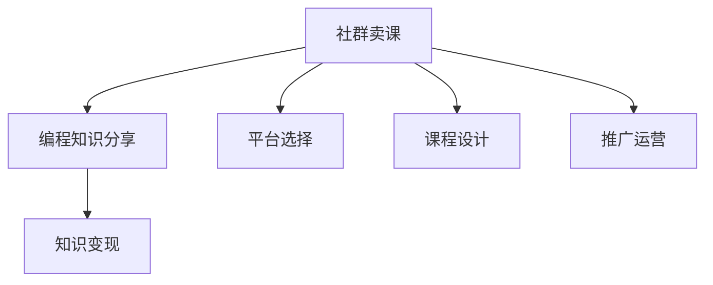

                 

## 如何利用社群卖课：程序员版

### 1. 背景介绍

在知识经济快速发展的今天，社群卖课已经成为了一种常见的知识分享与变现方式。对于程序员而言，拥有编程技能的同时，通过在线社群卖课传授知识，不仅可以实现自我价值，还能开辟第二收入渠道。本文将深入探讨如何利用社群卖课，从平台选择、课程设计到推广运营等环节进行全面解读，帮助程序员开启线上教学的新旅程。

### 2. 核心概念与联系

#### 2.1 核心概念概述

- **社群卖课**：通过在线社群平台进行编程知识的传授和分享，通过课程销售或付费社群参与等方式获取收入。
- **编程知识分享**：程序员将自己的编程经验、技术栈、项目案例等知识以课程的形式分享给学习者。
- **知识变现**：将专业知识转化为商业价值，通过课程销售、打赏、付费社群等方式获得收入。

这些概念紧密相关，共同构成了利用社群卖课的核心框架。社群提供平台，编程知识是内容，变现则是最终目标。

#### 2.2 核心概念原理和架构的 Mermaid 流程图



这个流程图展示了社群卖课的基本流程：通过选择合适的平台、设计高质量的课程、进行有效的推广运营，将编程知识转化为可变现的资源。

### 3. 核心算法原理 & 具体操作步骤

#### 3.1 算法原理概述

利用社群卖课的过程，本质上是一种市场化的知识共享行为。其核心算法原理包括以下几个方面：

1. **平台选择算法**：根据市场需求和自身优势选择合适的在线教育平台，如Udemy、Coursera、Bilibili等。
2. **课程设计算法**：根据目标受众的知识水平和需求，设计适合的课程内容和结构。
3. **推广运营算法**：利用社交媒体、SEO优化、广告投放等手段，提升课程的曝光率和参与度。

#### 3.2 算法步骤详解

##### 3.2.1 平台选择

选择合适的平台是成功的第一步。以下是几个关键考虑因素：

- **平台用户基数**：用户基数越大，课程的潜在市场就越大。
- **平台运营机制**：了解平台的分成政策、版权保护、课程上线流程等细节，确保能够顺畅运营。
- **平台社区氛围**：社区活跃度和用户反馈能帮助更好地推广和互动。
- **平台技术支持**：平台的技术支持和服务能够保障课程正常上线和运行。

##### 3.2.2 课程设计

课程设计是课程成功的关键。以下是一些设计建议：

- **目标受众定位**：明确目标受众，包括编程水平、学习需求等。
- **课程结构规划**：合理划分课程章节，涵盖基础知识、进阶技巧、实战案例等。
- **教学内容编排**：结合自身经验和实例，设计互动性强、易于理解的教学内容。
- **课程互动设计**：设置问答环节、编程练习、项目作业等，提升学习互动性。

##### 3.2.3 推广运营

有效的推广运营能够大大提升课程的曝光率和参与度。以下是几个关键策略：

- **社交媒体营销**：利用微博、微信、知乎等社交平台，分享课程内容和推广信息。
- **SEO优化**：通过关键词优化、内容质量提升等手段，提升课程在搜索引擎中的排名。
- **付费广告投放**：在目标平台上投放精准广告，吸引更多潜在用户。
- **用户口碑传播**：鼓励用户进行课程评价和分享，利用用户口碑进行二次传播。

### 3.3 算法优缺点

#### 3.3.1 优点

- **灵活性强**：课程设计和推广方式可以根据个人特色和市场需求灵活调整。
- **收入可观**：高质量的课程往往能获得高销量和良好口碑，带来可观收入。
- **时间自由**：可以在不影响主业的情况下，利用业余时间进行课程开发和推广。

#### 3.3.2 缺点

- **前期投入大**：课程设计和制作需要大量时间和精力，初期回报周期较长。
- **市场竞争激烈**：在线教育市场竞争激烈，如何突围需要持续努力。
- **质量控制难度高**：需要保持高质量的教学内容和互动体验，维护用户粘性。

### 3.4 算法应用领域

利用社群卖课不仅适用于程序员，也适用于广大知识工作者。以下是几个典型应用场景：

- **技术栈分享**：如JavaScript、Python、机器学习等，通过课程传授编程技巧和项目经验。
- **项目实战案例**：通过具体项目的开发和优化，传授实战经验和技术应用。
- **知识体系构建**：系统介绍某一技术领域的知识体系，适合编程初学者和进阶者。
- **软技能提升**：如团队协作、项目管理、沟通技巧等，提升综合职业素养。

### 4. 数学模型和公式 & 详细讲解 & 举例说明

#### 4.1 数学模型构建

基于社群卖课的过程，可以构建如下数学模型：

- **用户基数模型**：描述用户数目的动态变化。
- **课程销量模型**：预测课程的销售数量。
- **课程质量模型**：衡量课程的受欢迎程度。
- **推广效果模型**：评估各种推广手段的效果。

#### 4.2 公式推导过程

假设目标平台的用户基数为 $U$，课程的初始销量为 $S_0$，平均每周增长率为 $r$，课程质量指数为 $Q$，社交媒体曝光次数为 $E$，广告投放成本为 $C$。则有：

- 用户基数模型：$U(t) = U_0(1 + r)^t$
- 课程销量模型：$S(t) = S_0e^{Q(E - C)}$
- 课程质量模型：$Q = \sum_{i=1}^{n} R_iA_i$
- 推广效果模型：$E = k \log (U) + mC$

其中，$U_0$ 为初始用户基数，$U(t)$ 为$t$时刻的用户基数，$r$ 为增长率，$S_0$ 为初始销量，$S(t)$ 为$t$时刻的销量，$Q$ 为课程质量指数，$R_i$ 和 $A_i$ 分别为第$i$个社交媒体和广告的效果系数，$E$ 为曝光次数，$C$ 为广告成本，$k$ 和 $m$ 为模型参数。

#### 4.3 案例分析与讲解

以Udemy平台为例，分析其用户基数和课程销量随时间变化的情况。假设Udemy的初始用户基数为1000万，课程平均每周销量增长率为5%，课程质量指数为3，社交媒体曝光次数为每周50万次，广告投放成本为每次1美元。则有：

- 用户基数模型：$U(t) = 1000(1 + 0.05)^t$
- 课程销量模型：$S(t) = 100e^{3(50 - 1)}$

通过模型计算，可以预测出Udemy平台的用户基数和课程销量的变化趋势，并根据实际数据进行调整优化。

### 5. 项目实践：代码实例和详细解释说明

#### 5.1 开发环境搭建

在进行社群卖课的项目实践前，需要准备好开发环境。以下是一些必备工具和配置：

- **编程语言**：Python、JavaScript等。
- **开发框架**：Flask、Django等Web框架。
- **数据库**：MySQL、PostgreSQL等。
- **云服务**：AWS、阿里云等。
- **在线教育平台**：Udemy、Coursera等。

#### 5.2 源代码详细实现

以下是一个基于Python和Flask的在线课程管理系统示例：

```python
from flask import Flask, render_template, request
from flask_sqlalchemy import SQLAlchemy
from flask_login import LoginManager, login_user, logout_user, login_required
from werkzeug.security import generate_password_hash, check_password_hash

app = Flask(__name__)
app.config['SECRET_KEY'] = 'your_secret_key'
app.config['SQLALCHEMY_DATABASE_URI'] = 'sqlite:////tmp/test.db'
db = SQLAlchemy(app)
login_manager = LoginManager(app)

class User(db.Model):
    id = db.Column(db.Integer, primary_key=True)
    username = db.Column(db.String(80), unique=True, nullable=False)
    password_hash = db.Column(db.String(120), unique=True, nullable=False)

@login_manager.user_loader
def load_user(user_id):
    return User.query.get(int(user_id))

@app.route('/')
def index():
    return render_template('index.html')

@app.route('/login', methods=['GET', 'POST'])
def login():
    if request.method == 'POST':
        username = request.form.get('username')
        password = request.form.get('password')
        user = User.query.filter_by(username=username).first()
        if user and check_password_hash(user.password_hash, password):
            login_user(user)
            return redirect('/')
        else:
            return render_template('login.html', error='Invalid credentials')
    return render_template('login.html')

@app.route('/logout')
@login_required
def logout():
    logout_user()
    return redirect('/')

@app.route('/admin/dashboard')
@login_required
def dashboard():
    return render_template('dashboard.html')

if __name__ == '__main__':
    app.run(debug=True)
```

#### 5.3 代码解读与分析

以上代码实现了一个基本的在线课程管理系统，主要包含用户登录、课程发布、管理员仪表盘等功能。其中，使用了Flask框架进行Web开发，SQLAlchemy进行数据库操作，Flask-Login进行用户认证。

#### 5.4 运行结果展示

启动服务器后，访问`http://localhost:5000`即可看到登录页面。输入用户名和密码后，若信息正确，则自动登录到仪表盘界面。管理员可以通过仪表盘发布课程和设置课程参数，用户可以浏览课程、参加课程讨论等。

### 6. 实际应用场景

社群卖课已经广泛应用于编程社区、在线教育平台等多个领域，以下是几个实际应用场景：

- **技术博客与视频教程**：在博客平台如CSDN、知乎等发布编程教程和技术文章，通过广告和付费文章等形式获得收益。
- **开源项目与技术分享**：在GitHub等开源平台分享项目代码和技术分享，通过打赏和赞助等方式变现。
- **企业培训与技术支持**：利用自身技术优势，为企业提供定制化培训和技术支持服务，获取项目合作机会和报酬。
- **技术咨询与定制开发**：提供编程技术咨询、系统架构设计、定制软件开发等服务，获取高额项目费。

### 7. 工具和资源推荐

#### 7.1 学习资源推荐

- **编程语言与框架**：《Python编程：从入门到实践》、《JavaScript高级程序设计》、《Flask Web开发》等书籍。
- **在线教育平台**：Udemy、Coursera、网易云课堂等。
- **编程社区**：Stack Overflow、GitHub、CSDN等。

#### 7.2 开发工具推荐

- **编程语言**：Python、JavaScript、Go等。
- **开发框架**：Flask、Django、Spring等。
- **云服务**：AWS、阿里云、腾讯云等。
- **在线教育平台**：Udemy、Coursera、网易云课堂等。

#### 7.3 相关论文推荐

- **在线教育平台的用户行为分析**：《在线学习平台的参与度分析》
- **社群卖课的营销策略**：《社交媒体对在线教育课程推广的影响》
- **编程知识共享的商业模式**：《知识共享平台的经济模型分析》

### 8. 总结：未来发展趋势与挑战

#### 8.1 研究成果总结

利用社群卖课是一种极具潜力的知识变现方式，不仅有助于程序员提升自身影响力，还能带来稳定的收入来源。通过不断优化课程内容和推广策略，可以进一步扩大受众范围，提升课程销量和用户粘性。

#### 8.2 未来发展趋势

- **课程多样化**：未来课程内容将更加丰富多样，涵盖更多的编程技术、项目案例、软技能提升等。
- **技术融合**：结合AR/VR、AI等前沿技术，提供更加互动和沉浸式的学习体验。
- **社区互动**：利用社区论坛、在线问答等方式，增强用户间的互动和交流，提升学习效果。
- **个性化推荐**：通过数据分析和推荐算法，为每位用户推荐最适合的课程，提升学习效率和满意度。

#### 8.3 面临的挑战

- **内容质量控制**：保持高质量的教学内容和互动体验，满足用户需求。
- **市场竞争加剧**：在线教育市场竞争激烈，需要不断创新和优化。
- **用户粘性维护**：提高课程的趣味性和实用性，增强用户粘性。
- **隐私和安全**：保护用户隐私和数据安全，确保平台运营的合法合规。

#### 8.4 研究展望

未来，利用社群卖课的研究将进一步深入，探索更多的创新路径和商业模式。结合AI和大数据技术，可以实现更智能化的课程推荐和个性化学习体验，提升整体教学效果。同时，引入更多社区元素和互动机制，可以增强用户参与感和社区凝聚力，实现更好的商业回报。

### 9. 附录：常见问题与解答

**Q1: 社群卖课是否需要固定时间进行？**

A: 社群卖课的时间安排可以根据个人情况灵活调整。可以定期发布固定周期内的课程计划，也可以根据市场需求随时更新课程内容。关键在于保持高质量的教学内容和活跃的社区氛围。

**Q2: 社群卖课是否需要购买昂贵的硬件设备？**

A: 大多数社群卖课可以在家完成，不需要昂贵的硬件设备。选用价格合理的电脑和网络设备即可。但为了提升学习体验，可以考虑购买更好的键盘、鼠标等办公设备。

**Q3: 社群卖课是否有固定的课程大纲？**

A: 社群卖课的课程大纲可以根据自身经验和技术栈进行灵活设计。不必拘泥于固定的模式，可以根据市场需求和自身优势进行调整。关键是提供有价值和实用的课程内容。

**Q4: 社群卖课是否需要团队合作？**

A: 社群卖课可以个人进行，也可以组建团队。团队合作可以提升课程的制作质量和推广效果，但需要合理分配资源和责任，确保协同高效。

**Q5: 社群卖课是否有利润上限？**

A: 社群卖课的利润上限取决于课程质量和市场需求。只要持续提供高质量的课程内容，保持用户粘性和口碑传播，就有可能实现持续的高收益。

---

作者：禅与计算机程序设计艺术 / Zen and the Art of Computer Programming

