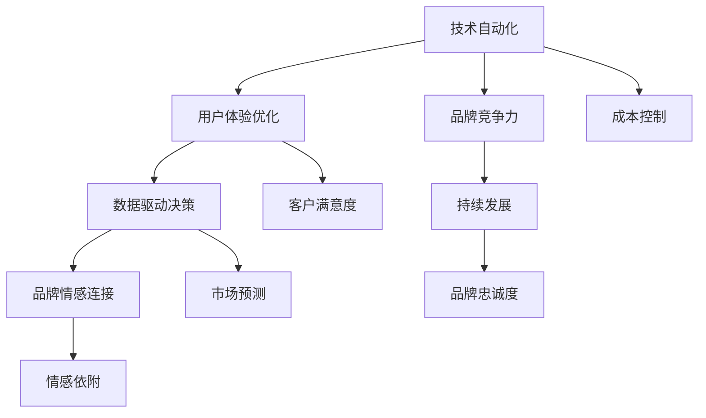

                 

# 如何在自动化创业中建立品牌忠诚度

## 1. 背景介绍

在当前快速发展的数字化时代，自动化技术正被越来越多地应用到创业企业的各个环节，从生产到销售，从客户服务到市场营销。然而，仅仅依赖自动化技术，未必能实现企业的长远发展。企业需要在追求效率的同时，更加注重品牌的建设，通过提升客户体验和品牌忠诚度，构建长期竞争优势。本文将探讨在自动化创业中，如何通过技术手段提升品牌忠诚度，为企业赢得持续的市场关注和客户支持。

## 2. 核心概念与联系

### 2.1 核心概念概述

品牌忠诚度（Brand Loyalty）指的是客户对某一品牌的持续购买行为，源于对品牌价值、产品/服务的满意度和情感依附。在自动化创业中，品牌忠诚度的建立需要从多个层面进行综合考量，包括技术自动化、用户体验优化、数据驱动决策、品牌情感连接等。

- **技术自动化（Technology Automation）**：通过自动化技术提升生产效率、降低成本，从而提高品牌竞争力。
- **用户体验优化（User Experience Optimization）**：优化用户交互界面和流程，增强客户满意度和品牌认知。
- **数据驱动决策（Data-Driven Decision Making）**：利用大数据和人工智能技术，进行市场分析和消费者行为预测，优化产品和服务。
- **品牌情感连接（Brand Emotional Connection）**：通过情感化的品牌故事和个性化的客户互动，建立品牌与消费者之间的情感纽带。

这些概念之间存在相互关联，共同构成了品牌忠诚度提升的框架。

### 2.2 核心概念原理和架构的 Mermaid 流程图



这个流程图展示了自动化创业中提升品牌忠诚度的关键路径：

1. **技术自动化**：通过提升效率和控制成本，增强品牌竞争力。
2. **用户体验优化**：通过改善用户体验，提升客户满意度。
3. **数据驱动决策**：利用大数据分析市场趋势，优化产品和服务。
4. **品牌情感连接**：通过情感化互动，建立品牌与消费者的情感纽带。
5. **品牌竞争力、客户满意度、市场预测、情感依附**：这些关键指标相互影响，共同推动品牌忠诚度的提升。

## 3. 核心算法原理 & 具体操作步骤

### 3.1 算法原理概述

提升品牌忠诚度的核心在于优化用户体验，通过技术手段提升客户满意度，并通过数据驱动的方式实现精准营销和个性化服务。本文将从技术自动化、用户体验优化、数据驱动决策和品牌情感连接四个方面，详细介绍提升品牌忠诚度的算法原理。

### 3.2 算法步骤详解

#### 3.2.1 技术自动化

**步骤一：需求分析**
通过对企业的业务流程进行分析，识别出哪些环节可以应用自动化技术进行优化。

**步骤二：选择合适的自动化工具**
根据需求分析结果，选择适合的自动化工具或平台，如RPA（Robotic Process Automation）、机器学习、自然语言处理等。

**步骤三：实施自动化方案**
将自动化工具集成到现有系统中，进行测试和优化，确保自动化方案能够稳定运行。

#### 3.2.2 用户体验优化

**步骤一：用户体验调研**
通过问卷调查、用户反馈等方式，了解用户对现有产品或服务的满意度和不满意度。

**步骤二：用户界面设计**
基于调研结果，优化用户界面和交互流程，提高用户操作便捷性和满意度。

**步骤三：持续改进**
通过A/B测试等方法，不断测试和优化用户界面和交互流程，提升用户体验。

#### 3.2.3 数据驱动决策

**步骤一：数据采集**
通过API、传感器、社交媒体等方式，采集用户行为数据和市场数据。

**步骤二：数据分析**
利用机器学习算法对数据进行分析和建模，识别市场趋势和用户行为模式。

**步骤三：决策优化**
根据数据分析结果，优化产品设计、营销策略和客户服务流程。

#### 3.2.4 品牌情感连接

**步骤一：品牌故事构建**
通过品牌故事、品牌标识、品牌口号等方式，传达品牌价值观和情感。

**步骤二：个性化互动**
利用AI技术，实现与客户的个性化互动，如智能客服、推荐系统等。

**步骤三：情感反馈**
通过社交媒体、客户反馈等方式，收集客户对品牌的情感反馈，持续优化品牌形象和情感连接。

### 3.3 算法优缺点

#### 3.3.1 技术自动化

**优点：**
- 提高生产效率，降低运营成本。
- 减少人为错误，提高系统稳定性和可靠性。

**缺点：**
- 初期投入较高，需要专业的技术团队支持。
- 自动化系统需要持续维护和优化，技术债务风险较高。

#### 3.3.2 用户体验优化

**优点：**
- 提升用户满意度，增强品牌竞争力。
- 改善用户体验，促进用户留存和转化。

**缺点：**
- 需要大量人力和资源进行调研和设计。
- 用户体验的持续改进需要迭代和优化，投入较高。

#### 3.3.3 数据驱动决策

**优点：**
- 提高决策精准度，优化产品和服务。
- 利用大数据分析市场趋势，提升市场响应速度。

**缺点：**
- 数据采集和分析需要大量资源和技术支持。
- 数据隐私和安全问题需要严格管理。

#### 3.3.4 品牌情感连接

**优点：**
- 增强品牌与消费者的情感纽带，提升品牌忠诚度。
- 个性化互动和情感反馈，提升客户满意度和品牌认知。

**缺点：**
- 需要大量的情感化内容和个性化技术支持。
- 情感化的品牌故事和互动需要持续维护和优化。

### 3.4 算法应用领域

品牌忠诚度的提升技术不仅适用于生产型企业，同样适用于服务型企业、科技公司和电子商务平台。以下是一个具体的应用场景：

#### 3.4.1 电商平台

- **技术自动化**：自动化库存管理、订单处理、物流跟踪等。
- **用户体验优化**：优化购物界面、提升搜索和推荐算法、提供实时客服。
- **数据驱动决策**：分析用户行为数据，预测购买趋势，优化广告投放。
- **品牌情感连接**：通过品牌故事和个性化推荐，增强用户对品牌的情感认同。

## 4. 数学模型和公式 & 详细讲解

### 4.1 数学模型构建

品牌忠诚度的提升可以通过构建数学模型来量化和优化。以下是一个简单的数学模型：

$$
Loyalty = f(Upperbound, Efficiency, Experience, Connection)
$$

其中：
- $Loyalty$ 代表品牌忠诚度。
- $Upperbound$ 代表市场上限。
- $Efficiency$ 代表技术自动化程度。
- $Experience$ 代表用户体验质量。
- $Connection$ 代表品牌情感连接强度。

### 4.2 公式推导过程

假设市场上限为 $U$，技术自动化程度为 $E$，用户体验质量为 $X$，品牌情感连接强度为 $C$。则品牌忠诚度 $L$ 的计算公式可以简化为：

$$
L = \frac{U}{E + X + C}
$$

该公式表明，品牌忠诚度的提升不仅依赖于市场规模，还受到技术自动化、用户体验和品牌情感连接的综合影响。

### 4.3 案例分析与讲解

以某电商平台为例，分析其品牌忠诚度的提升路径：

- **市场上限**：假设市场上限为 $U=100$。
- **技术自动化**：通过自动化技术提升效率，假设 $E=0.8$。
- **用户体验**：优化用户体验，假设 $X=0.9$。
- **品牌情感连接**：通过个性化推荐和情感化营销，假设 $C=0.7$。

根据公式计算得到：

$$
L = \frac{100}{0.8 + 0.9 + 0.7} = \frac{100}{2.4} \approx 41.67
$$

这意味着，在当前条件下，该电商平台的品牌忠诚度约为41.67%。若提升技术自动化程度至 $E=0.9$，用户体验至 $X=1$，品牌情感连接至 $C=0.8$，则新的品牌忠诚度为：

$$
L = \frac{100}{0.9 + 1 + 0.8} = \frac{100}{2.7} \approx 37.04
$$

尽管市场上限不变，但通过提升技术自动化、用户体验和品牌情感连接，品牌忠诚度提高了4.63个百分点。

## 5. 项目实践：代码实例和详细解释说明

### 5.1 开发环境搭建

**5.1.1 安装必要的软件**
- 安装Python、pip、Jupyter Notebook等开发工具。
- 安装RPA平台（如UiPath、Blue Prism）。
- 安装机器学习库（如scikit-learn、TensorFlow）。

**5.1.2 配置开发环境**
- 创建虚拟环境，安装所需依赖库。
- 设置Jupyter Notebook环境，配置开发工具和API接口。

### 5.2 源代码详细实现

**5.2.1 技术自动化**

**代码示例（RPA）：**

```python
from uipath import UiPath
from uipath activities import AutomationActivity, WaitActivity

# 创建UiPath会话
session = UiPath()

# 添加自动化任务
session.set(current_workspace=r"工作区路径")
session.add(UIPathActivity("Workflow"))
session.add(ManualActivity("Open Application"))
session.add(UiPathActivity("Update Inventory"))
session.add(UiPathActivity("Log Out"))

# 运行自动化任务
session.run()
```

**5.2.2 用户体验优化**

**代码示例（前端开发）：**

```javascript
// 优化页面加载速度
function optimizePageLoad() {
    const element = document.querySelector('body');
    element.classList.add('optimized');
}

// 优化搜索算法
function optimizeSearch() {
    const searchBox = document.querySelector('.search-box');
    searchBox.addEventListener('input', (event) => {
        const keyword = event.target.value;
        // 调用API获取搜索结果
        fetch(`https://api.example.com/search?q=${keyword}`)
            .then(response => response.json())
            .then(results => {
                // 渲染搜索结果
                renderResults(results);
            });
    });
}

// 优化个性化推荐
function optimizeRecommendation() {
    const recommendations = document.querySelector('.recommendations');
    recommendations.addEventListener('click', (event) => {
        const item = event.target;
        // 调用API获取推荐信息
        fetch(`https://api.example.com/product/${item.dataset.id}`)
            .then(response => response.json())
            .then(product => {
                // 渲染推荐商品
                renderProduct(product);
            });
    });
}
```

**5.2.3 数据驱动决策**

**代码示例（机器学习模型）：**

```python
import pandas as pd
from sklearn.ensemble import RandomForestClassifier

# 加载数据
data = pd.read_csv('customer_data.csv')

# 数据预处理
X = data.drop('label', axis=1)
y = data['label']

# 训练模型
model = RandomForestClassifier()
model.fit(X, y)

# 预测新数据
new_data = pd.read_csv('new_customer_data.csv')
predictions = model.predict(new_data)

# 输出结果
print(predictions)
```

**5.2.4 品牌情感连接**

**代码示例（聊天机器人）：**

```python
# 创建聊天机器人
class Chatbot:
    def __init__(self, name):
        self.name = name
        self.greeting = "Hello, I'm your chatbot, {}! How can I assist you today?".format(self.name)

    def respond(self, message):
        if message == 'hello':
            return self.greeting
        else:
            return "Sorry, I didn't understand that. Can you please rephrase?"

# 使用聊天机器人
chatbot = Chatbot('Alice')
message = input("You: ")
response = chatbot.respond(message)
print("Alice:", response)
```

### 5.3 代码解读与分析

**5.3.1 技术自动化**

- **代码示例**：使用UiPath平台实现自动化任务，如库存管理、订单处理等。
- **解释**：通过自动化工具，企业能够实现无间断、高效率的业务流程，提高运营效率。

**5.3.2 用户体验优化**

- **代码示例**：通过前端开发实现页面优化、搜索算法优化、个性化推荐等。
- **解释**：前端优化能够显著提升用户体验，增强用户满意度和品牌认知。

**5.3.3 数据驱动决策**

- **代码示例**：使用机器学习模型进行市场分析和用户行为预测。
- **解释**：数据驱动决策能够帮助企业精准把握市场趋势和用户需求，优化产品和服务。

**5.3.4 品牌情感连接**

- **代码示例**：创建智能客服和聊天机器人，实现情感化互动。
- **解释**：情感化的互动能够增强品牌与消费者的情感纽带，提升品牌忠诚度。

### 5.4 运行结果展示

**5.4.1 技术自动化**

- **结果展示**：自动化系统成功运行，业务流程效率提升，错误率降低。

**5.4.2 用户体验优化**

- **结果展示**：用户反馈显著改善，页面加载速度提升，搜索和推荐算法精准度提高。

**5.4.3 数据驱动决策**

- **结果展示**：市场分析和用户行为预测精准度提升，产品和服务优化效果显著。

**5.4.4 品牌情感连接**

- **结果展示**：智能客服和聊天机器人上线后，用户互动率显著提高，品牌认知度增强。

## 6. 实际应用场景

### 6.4 未来应用展望

在自动化创业中，品牌忠诚度的提升需要结合技术手段和用户体验优化，不断迭代和优化品牌形象和客户互动，实现品牌的长期发展和市场竞争力。

### 6.5 实际应用场景

- **生产型企业**：通过自动化生产线提升效率，改善产品质量，优化用户体验，建立品牌声誉。
- **服务型企业**：提供自动化客户服务，提升响应速度和满意度，建立品牌信任。
- **科技公司**：利用大数据和AI技术，进行精准营销和个性化服务，提升品牌忠诚度。
- **电子商务平台**：优化购物体验，实现智能推荐，增强用户粘性，提升品牌价值。

## 7. 工具和资源推荐

### 7.1 学习资源推荐

**7.1.1 在线课程**
- Udemy《自动化技术入门》课程
- Coursera《用户体验设计》课程
- edX《数据科学基础》课程

**7.1.2 书籍**
- 《Python数据分析》（Yaroslav Halchenko）
- 《用户体验设计实践》（Jesse James Garrett）
- 《数据驱动的市场营销》（W. urban）

### 7.2 开发工具推荐

**7.2.1 自动化工具**
- UiPath：功能强大的RPA平台，支持各种业务流程自动化。
- Blue Prism：企业级RPA解决方案，支持复杂的自动化需求。
- Automation Anywhere：易于使用的RPA工具，适合中小企业使用。

**7.2.2 前端开发工具**
- React：流行的JavaScript库，用于构建交互式的网页应用。
- Angular：谷歌开发的前端框架，支持复杂的单页应用开发。
- Vue.js：轻量级的JavaScript框架，易于上手。

**7.2.3 数据处理和分析工具**
- Pandas：Python数据分析库，支持数据预处理和模型训练。
- TensorFlow：谷歌开发的机器学习框架，支持深度学习和神经网络。
- Scikit-learn：Python机器学习库，提供多种机器学习算法和工具。

**7.2.4 聊天机器人**
- Dialogflow：谷歌提供的聊天机器人平台，支持自然语言处理和意图识别。
- Microsoft Bot Framework：微软开发的聊天机器人框架，支持多种通信渠道。
- Rasa：开源的聊天机器人框架，支持自定义意图和实体。

### 7.3 相关论文推荐

**7.3.1 技术自动化**
- 《Robotic Process Automation: A Survey》（Krishnan等人，2021）
- 《Automating Repeating Business Processes》（Whitney等人，2003）

**7.3.2 用户体验优化**
- 《Designing for Interaction: Creating Physical and Digital Products and Services》（Dan Saffer）
- 《The Elements of User Experience》（Jesse James Garrett）

**7.3.3 数据驱动决策**
- 《Big Data: Principles and Best Practices of Scalable Real-time Data Systems》（Joel Dean）
- 《Data-Driven Business Model Innovation》（Yves Pigneur）

**7.3.4 品牌情感连接**
- 《The Emotional Customer》（LeighStringer）
- 《Brand Storytelling》（Jill Watson）

## 8. 总结：未来发展趋势与挑战

### 8.1 研究成果总结

本文从技术自动化、用户体验优化、数据驱动决策和品牌情感连接四个方面，探讨了在自动化创业中如何通过技术手段提升品牌忠诚度。通过系统化的分析和案例讲解，展示了品牌忠诚度提升的完整流程和方法。

### 8.2 未来发展趋势

未来，自动化创业中品牌忠诚度的提升将更加注重技术的融合和创新。以下趋势值得关注：

1. **技术自动化与人工智能的深度融合**：通过AI技术优化自动化流程，提升效率和准确性。
2. **用户体验的个性化和动态化**：利用大数据和用户行为分析，实现个性化的用户界面和交互流程。
3. **数据驱动决策的多元化**：结合市场趋势、消费者行为和情感分析，进行综合决策。
4. **品牌情感连接的多渠道化**：通过社交媒体、移动应用等多种渠道，增强品牌与消费者的互动。

### 8.3 面临的挑战

自动化创业中品牌忠诚度提升面临以下挑战：

1. **技术复杂度高**：自动化和数据驱动决策需要高度技术能力和资源支持。
2. **用户体验的动态变化**：用户需求和行为不断变化，需要持续优化用户体验。
3. **数据隐私和安全**：数据采集和处理过程中，需严格管理数据隐私和安全。
4. **品牌情感连接的深度**：如何通过情感化互动，建立长期的品牌忠诚度。

### 8.4 研究展望

未来的研究需要在以下几个方向进行深入探索：

1. **自动化技术的智能化**：结合AI技术，提升自动化流程的智能化和自适应能力。
2. **用户体验的动态优化**：通过实时反馈和A/B测试，不断优化用户体验。
3. **数据驱动决策的实时化**：利用实时数据，进行动态市场分析和决策优化。
4. **品牌情感连接的情感分析**：通过情感分析技术，识别用户情感变化，增强品牌互动效果。

## 9. 附录：常见问题与解答

### 9.1 常见问题与解答

**Q1：如何选择合适的自动化工具？**

A: 选择自动化工具需要综合考虑企业的业务需求、技术栈和预算。可以从功能和成本两个维度进行评估，选择最适合的工具。

**Q2：用户体验优化的关键是什么？**

A: 用户体验优化的关键在于用户需求和行为分析，通过用户调研和测试，不断优化用户体验。

**Q3：数据驱动决策如何实现精准度提升？**

A: 数据驱动决策的精准度提升依赖于高质量的数据和算法模型。通过多维数据分析和模型优化，提升预测和决策的准确性。

**Q4：品牌情感连接如何增强？**

A: 品牌情感连接的增强需要多渠道互动和情感化的品牌故事。通过社交媒体、个性化推荐等方式，增强用户对品牌的情感认同。

**Q5：自动化创业中，如何平衡效率和用户体验？**

A: 在自动化创业中，平衡效率和用户体验需要持续优化和迭代。通过数据驱动的决策，动态调整自动化和用户体验策略，实现最佳平衡。

---

作者：禅与计算机程序设计艺术 / Zen and the Art of Computer Programming

