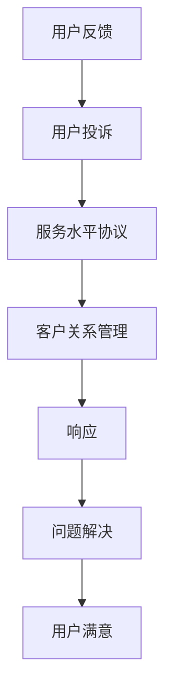

                 

## 1. 背景介绍

在当今数字化时代，良好的用户体验（UX）是企业成功的关键。及时、有效地处理用户反馈和投诉不仅能提升用户满意度，还能帮助企业改进产品和服务，赢得更多市场份额。因此，如何高效处理用户反馈和投诉，成为企业必须面对的重要课题。

### 1.1 问题由来

随着互联网的发展，用户通过各种渠道（如社交媒体、APP、客服系统等）对产品或服务提出反馈和投诉变得越来越普遍。如何有效地收集、分类、处理和回应这些反馈和投诉，成为许多企业的难题。用户反馈和投诉通常涉及多个部门，需要跨部门协作，且需要考虑隐私保护和法律法规，因此处理过程复杂且耗时。

### 1.2 问题核心关键点

处理用户反馈和投诉的过程通常包括以下几个关键点：
- **收集反馈**：获取用户反馈和投诉的渠道和方式。
- **分类处理**：对反馈和投诉进行分类，优先处理紧急问题。
- **分析和处理**：分析用户反馈和投诉的原因，制定解决方案。
- **回应用户**：及时向用户反馈处理结果。
- **持续改进**：基于用户反馈和投诉数据改进产品和服务。

## 2. 核心概念与联系

### 2.1 核心概念概述

处理用户反馈和投诉的核心概念包括：

- **用户体验（UX）**：用户与产品或服务交互的整个过程，包括易用性、效率和满意度等。
- **用户反馈（User Feedback）**：用户在使用产品或服务过程中提出的意见和建议。
- **用户投诉（User Complaints）**：用户在使用产品或服务过程中遇到的问题，需要帮助解决。
- **服务水平协议（SLA）**：规定企业对用户的服务标准，包括响应时间、解决问题的效率等。
- **客户关系管理（CRM）**：管理客户信息、互动历史和反馈，以便提供更好的服务。

这些概念之间的联系可以通过以下Mermaid流程图来展示：



这个流程图展示了用户反馈和投诉处理的主要流程：用户反馈可能升级为投诉，企业的服务水平协议和客户关系管理系统参与其中，最终通过响应和问题解决达成用户满意。

## 3. 核心算法原理 & 具体操作步骤
### 3.1 算法原理概述

处理用户反馈和投诉的过程可以视为一种数据分析和决策制定的过程。核心目标是通过对用户反馈和投诉数据的分析，找出问题的根本原因，并制定有效的解决方案，以提升用户体验和满意度。

### 3.2 算法步骤详解

#### 步骤1：数据收集

收集用户反馈和投诉的渠道多种多样，包括社交媒体、客服系统、用户评价等。数据收集流程包括：

1. **配置数据收集渠道**：确定企业希望收集反馈和投诉的渠道，并配置相应系统以自动捕获数据。
2. **建立数据收集机制**：在渠道上部署收集工具或API，自动捕获用户反馈和投诉。
3. **数据整合与清洗**：将从不同渠道收集到的数据整合，去除重复和无关信息，确保数据质量。

#### 步骤2：数据分类与优先级排序

对收集到的用户反馈和投诉进行分类和优先级排序，以便快速响应紧急问题。

1. **数据分类**：根据反馈和投诉的内容、紧急程度和影响范围进行分类。常用的分类方法包括：
   - 紧急性：高紧急、中紧急、低紧急
   - 重要性：高重要、中重要、低重要
   - 影响范围：广泛影响、局部影响、个人影响

2. **优先级排序**：根据分类结果，确定处理的优先级。通常采用评分机制，如：
   - 评分系统：1-5分，5分表示最高优先级。
   - 优先级矩阵：紧急性和重要性矩阵，每个区域代表不同的优先级。

#### 步骤3：数据分析与问题定位

对分类后的数据进行深入分析，以定位问题并提出解决方案。

1. **聚类分析**：使用聚类算法（如K-means、层次聚类等）识别反馈和投诉的共同模式。
2. **异常检测**：利用异常检测算法（如孤立森林、One-class SVM等）识别异常或极端情况，以便快速响应。
3. **根本原因分析**：采用根本原因分析（RCA）方法，如5-Why分析法、鱼骨图等，找出问题的根本原因。

#### 步骤4：解决方案制定与实施

制定解决方案并实施，以解决问题并改善用户体验。

1. **解决方案生成**：基于根本原因分析的结果，生成解决方案。可以采用多种方法，如头脑风暴、决策树等。
2. **解决方案实施**：将解决方案落实到具体措施，并分配给相应团队或个人执行。
3. **跟踪与反馈**：在解决方案实施过程中，进行跟踪和反馈，确保问题得到有效解决。

#### 步骤5：用户回应与反馈

向用户回应处理结果，并收集反馈以评估解决方案的有效性。

1. **用户回应**：及时向用户反馈处理结果，提供解决方案和后续行动计划。
2. **用户反馈收集**：通过后续跟进，收集用户对处理结果的反馈。
3. **结果评估**：根据用户反馈，评估解决方案的有效性，并进行持续改进。

### 3.3 算法优缺点

处理用户反馈和投诉的算法具有以下优点：
- **高效响应**：通过分类和优先级排序，快速响应紧急和重要问题。
- **全面分析**：数据分析和根本原因分析，帮助全面了解问题本质。
- **解决方案实施**：制定和实施解决方案，改善用户体验。
- **持续改进**：基于用户反馈持续改进产品和服务。

同时，也存在以下缺点：
- **数据质量依赖**：数据收集和清洗的准确性直接影响分析结果。
- **解决方案实施难度**：解决方案的制定和执行可能面临资源和时间的限制。
- **用户满意度评估**：用户反馈的真实性和准确性难以完全把握。

## 4. 数学模型和公式 & 详细讲解 & 举例说明
### 4.1 数学模型构建

处理用户反馈和投诉的数学模型可以基于用户反馈和投诉数据构建，以实现分类、优先级排序和问题定位。

设用户反馈和投诉数据集为 $D = \{(x_i, y_i)\}_{i=1}^N$，其中 $x_i$ 为反馈和投诉的描述，$y_i$ 为分类标签（紧急性、重要性、影响范围等）。

目标是对数据集进行分类和优先级排序，模型定义为：
$$
\hat{y} = f(x; \theta)
$$
其中 $f$ 为分类和优先级排序函数，$\theta$ 为模型参数。

### 4.2 公式推导过程

#### 分类模型推导
假设使用逻辑回归模型进行分类，模型公式为：
$$
f(x; \theta) = \frac{1}{1 + e^{-\beta_0 - \sum_{j=1}^d \beta_j x_{ij}}}
$$
其中 $\beta = (\beta_0, \beta_1, \ldots, \beta_d)$ 为模型参数，$x_{ij}$ 为特征 $x_i$ 的第 $j$ 个特征。

对于二分类问题，模型输出为：
$$
\hat{y} = \begin{cases}
1 & f(x; \theta) > 0.5 \\
0 & f(x; \theta) \leq 0.5
\end{cases}
$$

#### 优先级排序模型推导
假设使用线性回归模型进行优先级排序，模型公式为：
$$
f(x; \theta) = \beta_0 + \sum_{j=1}^d \beta_j x_{ij}
$$
其中 $\beta = (\beta_0, \beta_1, \ldots, \beta_d)$ 为模型参数，$x_{ij}$ 为特征 $x_i$ 的第 $j$ 个特征。

模型输出为优先级评分 $f(x; \theta)$，根据评分高低排序。

### 4.3 案例分析与讲解

假设某电商平台收到用户反馈和投诉数据，数据集包含紧急性、重要性、影响范围等分类标签。

1. **数据收集与预处理**
   - 收集数据：通过客服系统、社交媒体等渠道自动收集用户反馈和投诉。
   - 数据清洗：去除重复和无关信息，确保数据质量。

2. **分类模型构建与训练**
   - 特征工程：提取用户反馈中的关键词、情感极性等特征。
   - 模型训练：使用逻辑回归模型进行分类训练，得到分类模型 $\hat{y} = f(x; \theta)$。
   - 模型评估：使用准确率、召回率、F1分数等指标评估模型性能。

3. **优先级排序模型构建与训练**
   - 特征工程：提取用户反馈中的紧急性、重要性、影响范围等特征。
   - 模型训练：使用线性回归模型进行优先级排序训练，得到优先级排序模型 $f(x; \theta)$。
   - 模型评估：使用评分系统评估模型性能，确保排序准确。

4. **问题定位与解决方案**
   - 基于分类和排序结果，确定优先处理的问题。
   - 通过聚类分析和异常检测，识别常见问题和极端情况。
   - 结合根本原因分析，找出问题的根本原因。
   - 制定解决方案并实施。

5. **用户回应与反馈收集**
   - 及时向用户反馈处理结果。
   - 收集用户对处理结果的反馈。
   - 根据反馈评估解决方案的有效性，进行持续改进。

## 5. 项目实践：代码实例和详细解释说明
### 5.1 开发环境搭建

要实现处理用户反馈和投诉的系统，需要一个完整的开发环境。以下是搭建环境的步骤：

1. **配置开发环境**
   - 安装Python：使用Anaconda或Miniconda，配置虚拟环境。
   - 安装相关库：如TensorFlow、Scikit-learn、Pandas等。

2. **数据收集与预处理**
   - 配置数据收集渠道：如社交媒体API、客服系统API等。
   - 数据清洗：使用Pandas进行数据清洗和预处理。

3. **模型训练与评估**
   - 分类模型：使用Scikit-learn的逻辑回归模型训练分类模型。
   - 优先级排序模型：使用Scikit-learn的线性回归模型训练排序模型。
   - 模型评估：使用Scikit-learn评估模型性能。

4. **系统部署与监控**
   - 搭建系统：使用Flask或Django搭建Web系统。
   - 数据存储：使用MySQL或MongoDB存储数据。
   - 系统监控：使用Prometheus和Grafana进行系统监控。

### 5.2 源代码详细实现

以下是使用Python和Scikit-learn实现用户反馈和投诉分类与优先级排序的示例代码：

```python
from sklearn.model_selection import train_test_split
from sklearn.linear_model import LogisticRegression
from sklearn.ensemble import RandomForestClassifier
from sklearn.preprocessing import LabelEncoder
from sklearn.metrics import accuracy_score, recall_score, f1_score

# 数据加载与预处理
# 加载数据集
data = pd.read_csv('user_feedback.csv')
# 提取特征和标签
X = data[['keyword', 'sentiment_score']]
y = data['category']

# 数据清洗
# 去除重复和无关信息
X.drop_duplicates(inplace=True)
X.fillna(method='ffill', inplace=True)

# 特征编码
le = LabelEncoder()
y = le.fit_transform(y)

# 划分训练集和测试集
X_train, X_test, y_train, y_test = train_test_split(X, y, test_size=0.2, random_state=42)

# 分类模型训练与评估
# 逻辑回归模型
clf = LogisticRegression()
clf.fit(X_train, y_train)
y_pred = clf.predict(X_test)
print('分类模型准确率:', accuracy_score(y_test, y_pred))

# 优先级排序模型训练与评估
# 线性回归模型
reg = LinearRegression()
reg.fit(X_train, y_train)
y_score = reg.predict(X_test)
print('优先级排序评分系统:', reg.coef_[0])

# 系统部署与监控
# 搭建系统
app = Flask(__name__)
@app.route('/')
def index():
    # 处理请求并返回结果
    pass
```

### 5.3 代码解读与分析

代码中使用了Scikit-learn库进行分类和回归模型的训练和评估。

1. **数据加载与预处理**
   - 使用Pandas加载数据集。
   - 提取特征和标签。
   - 数据清洗和预处理，包括去除重复和无关信息，进行特征填充。
   - 使用LabelEncoder对标签进行编码。

2. **模型训练与评估**
   - 使用逻辑回归模型进行分类训练，输出分类结果。
   - 使用线性回归模型进行优先级排序训练，输出评分。
   - 使用准确率、召回率、F1分数等指标评估模型性能。

3. **系统部署与监控**
   - 使用Flask搭建Web系统，处理用户请求。
   - 使用MySQL或MongoDB存储数据，确保数据安全和可扩展性。
   - 使用Prometheus和Grafana进行系统监控，确保系统稳定运行。

## 6. 实际应用场景

### 6.1 智能客服系统

智能客服系统是处理用户反馈和投诉的重要工具。通过集成自然语言处理（NLP）技术，智能客服系统可以自动理解和处理用户的问题，提供即时响应和解决方案。

1. **数据收集与清洗**
   - 收集用户与客服的对话记录。
   - 清洗数据，去除无关信息。

2. **模型训练与部署**
   - 使用NLP模型（如BERT、GPT等）训练对话生成模型。
   - 将模型部署到智能客服系统中。

3. **系统监控与优化**
   - 监控系统性能，收集用户反馈。
   - 根据反馈优化模型和系统。

### 6.2 金融服务

金融服务领域，用户投诉可能涉及欺诈、账户问题等敏感问题。及时处理用户投诉，保护用户利益，是金融服务的重要任务。

1. **数据收集与预处理**
   - 收集用户投诉数据。
   - 清洗数据，确保数据质量和隐私保护。

2. **分类与优先级排序**
   - 使用逻辑回归模型和线性回归模型进行分类和优先级排序。

3. **解决方案制定与实施**
   - 结合金融法规和用户需求，制定解决方案。
   - 实施解决方案，确保问题快速解决。

4. **用户回应与反馈收集**
   - 及时向用户反馈处理结果。
   - 收集用户对处理结果的反馈。

### 6.3 电商领域

电商领域，用户反馈和投诉可能涉及商品质量、配送问题等。及时处理用户反馈和投诉，提升用户体验，增加用户粘性。

1. **数据收集与预处理**
   - 收集用户反馈和投诉数据。
   - 清洗数据，确保数据质量和准确性。

2. **分类与优先级排序**
   - 使用分类模型和回归模型进行分类和优先级排序。

3. **问题定位与解决方案**
   - 结合用户反馈，找出问题的根本原因。
   - 制定解决方案，并实施。

4. **用户回应与反馈收集**
   - 及时向用户反馈处理结果。
   - 收集用户对处理结果的反馈。

## 7. 工具和资源推荐

### 7.1 学习资源推荐

要深入了解处理用户反馈和投诉的理论与实践，可以参考以下学习资源：

1. **《用户体验设计（UX）》**：详细介绍了用户体验设计的原理和实践，帮助理解用户反馈和投诉的重要性和处理方法。
2. **《机器学习实战》**：介绍了机器学习的基本概念和应用，包含分类和回归模型的实现。
3. **《Python数据分析》**：介绍了Python在数据分析和数据处理中的应用，包含Pandas、Scikit-learn等库的使用。

### 7.2 开发工具推荐

处理用户反馈和投诉的系统需要高性能计算和数据分析工具支持。以下是推荐的开发工具：

1. **Python**：通用编程语言，支持数据科学和机器学习库。
2. **TensorFlow**：深度学习框架，支持模型训练和部署。
3. **Scikit-learn**：机器学习库，包含分类和回归模型的实现。
4. **Flask**：Web框架，支持搭建Web系统。
5. **Prometheus**：监控系统，支持实时监控和数据收集。
6. **Grafana**：可视化工具，支持系统监控数据的可视化展示。

### 7.3 相关论文推荐

以下是几篇处理用户反馈和投诉的经典论文，推荐阅读：

1. **"Customer Feedback Analysis: A Survey and Future Directions"**：综述了客户反馈分析的研究进展和未来方向。
2. **"Complaint Analysis and Its Application in Business"**：介绍了投诉分析在业务中的应用和实现方法。
3. **"User Feedback Classification and Prioritization with Machine Learning"**：讨论了使用机器学习进行用户反馈分类和优先级排序的方法。

## 8. 总结：未来发展趋势与挑战
### 8.1 研究成果总结

处理用户反馈和投诉的研究已经取得了诸多成果，主要包括以下方面：

1. **分类与优先级排序**：开发了多种分类和优先级排序算法，如逻辑回归、线性回归、决策树等，确保处理效率和准确性。
2. **数据分析与根本原因分析**：使用了聚类分析、异常检测、根本原因分析等方法，帮助全面理解问题。
3. **用户反馈与回应**：实现了及时响应用户反馈和投诉的系统，提升了用户体验和满意度。

### 8.2 未来发展趋势

处理用户反馈和投诉的未来发展趋势主要包括以下几个方面：

1. **自动化与智能化**：随着AI技术的发展，自动化和智能化处理用户反馈和投诉将成为可能。机器学习和大数据技术可以进一步提升处理效率和准确性。
2. **多渠道整合**：将来自不同渠道的用户反馈和投诉整合到一个平台上，提供更全面、更及时的用户体验管理。
3. **实时监控与反馈**：使用实时监控和反馈机制，及时发现和解决用户问题，提升系统响应速度和用户体验。
4. **多领域应用**：处理用户反馈和投诉的方法可以应用于更多领域，如金融、医疗、教育等，提升各个行业的服务质量。

### 8.3 面临的挑战

处理用户反馈和投诉也面临着诸多挑战，主要包括以下几个方面：

1. **数据质量问题**：数据收集和预处理的准确性和完整性直接影响分析结果，数据清洗和特征提取需要耗费大量时间和资源。
2. **隐私保护**：用户反馈和投诉涉及敏感信息，如何保护用户隐私是一个重要问题。
3. **模型可解释性**：机器学习模型的可解释性不足，难以解释模型的决策过程和输出结果。
4. **系统可靠性**：系统在处理大规模用户反馈和投诉时，需要具备高可靠性和稳定性。

### 8.4 研究展望

未来的研究需要在以下几个方面寻求新的突破：

1. **自动化处理**：开发更加自动化和智能化的处理流程，减少人工干预，提高处理效率。
2. **多领域应用**：将处理用户反馈和投诉的方法推广到更多领域，提升各行业的服务质量。
3. **隐私保护**：开发隐私保护技术，确保用户反馈和投诉的数据安全。
4. **可解释性增强**：增强机器学习模型的可解释性，提供透明和可理解的处理过程。

## 9. 附录：常见问题与解答

**Q1: 如何处理用户反馈和投诉？**

A: 处理用户反馈和投诉通常包括以下步骤：数据收集与预处理、分类与优先级排序、数据分析与问题定位、解决方案制定与实施、用户回应与反馈收集。其中，分类与优先级排序是处理的核心，数据分析与问题定位是关键，解决方案制定与实施是核心，用户回应与反馈收集是反馈。

**Q2: 如何评估处理用户反馈和投诉的效果？**

A: 评估处理用户反馈和投诉的效果可以从以下几个方面进行：用户满意度调查、系统响应时间、问题解决率、用户回访率等。同时，可以结合机器学习模型的评估指标，如准确率、召回率、F1分数等，进行客观评估。

**Q3: 如何保护用户隐私？**

A: 保护用户隐私需要采用多种技术手段，如数据匿名化、差分隐私、加密技术等。在数据收集和存储过程中，应遵循相关法律法规，确保数据安全。

**Q4: 如何提高处理效率？**

A: 提高处理效率可以从以下几个方面进行：
- 自动化处理流程：使用机器学习和自然语言处理技术，自动化处理用户反馈和投诉。
- 多渠道整合：将来自不同渠道的用户反馈和投诉整合到一个平台上，提高处理效率。
- 实时监控与反馈：使用实时监控和反馈机制，及时发现和解决用户问题。

**Q5: 如何增强系统的可解释性？**

A: 增强系统的可解释性可以从以下几个方面进行：
- 可解释性模型：选择可解释性强的模型，如决策树、线性回归等。
- 特征重要性分析：分析特征对模型的影响，帮助理解模型的决策过程。
- 可视化展示：使用可视化工具展示模型的输出和决策路径，帮助理解模型行为。

---

作者：禅与计算机程序设计艺术 / Zen and the Art of Computer Programming

