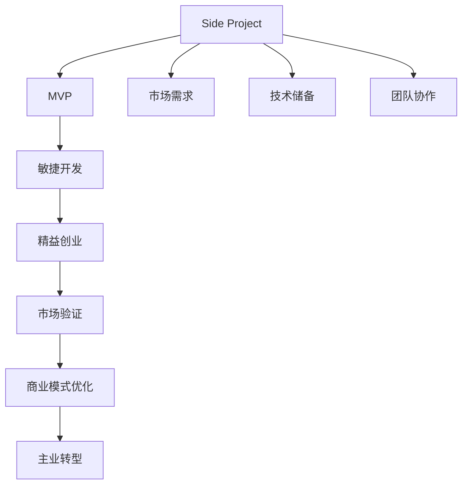

                 

# 如何将Side Project转化为主业

## 1. 背景介绍

在科技行业，Side Project（副业）往往被视为创新和实验的温床。然而，将Side Project成功转化为主业（主业），成为企业的核心竞争力，对许多开发者和公司来说，却是一大挑战。本文将深入探讨如何将Side Project成功转型为主业，从多个维度提供策略和实践建议。

## 2. 核心概念与联系

### 2.1 核心概念概述

- **Side Project**：指开发者在主业工作之余，基于个人兴趣或市场需求开发的小型项目或产品。
- **主业转型**：将Side Project的技术、方法、商业模式等成功融入主业，转化为公司核心竞争力的过程。

- **敏捷开发**：一种快速响应市场变化、强调迭代和持续改进的软件开发方法。
- **MVP（最小可行产品）**：指功能最基础、可立即交付的简化版产品，用于验证产品假设和市场反应。
- **精益创业（Lean Startup）**：基于敏捷开发和快速迭代原则，通过不断试错快速验证市场和商业模式，优化产品。

这些核心概念之间存在密切联系，构成了将Side Project转化为主业的理论基础和方法框架。

### 2.2 核心概念原理和架构的 Mermaid 流程图



该流程图展示了Side Project向主业转型的主要步骤和关键环节：

1. **市场需求**：识别并验证市场需求，确定项目的价值主张。
2. **技术储备**：评估现有技术能力，识别技术挑战。
3. **团队协作**：组建高效团队，明确角色分工。
4. **敏捷开发**：采用快速迭代和持续改进的方法，快速交付产品。
5. **精益创业**：通过MVP验证市场假设，快速试错和优化。
6. **市场验证**：获取用户反馈，验证市场和商业模式。
7. **商业模式优化**：根据市场反馈，优化商业模式。
8. **主业转型**：将成功经验和方法应用到主业中，提升整体竞争力。

这些步骤和环节相互关联，共同推动Side Project向主业转型的过程。

## 3. 核心算法原理 & 具体操作步骤

### 3.1 算法原理概述

将Side Project转化为主业，本质上是一种业务创新的过程。这一过程涉及技术、市场、商业等多方面的综合考量。核心算法原理包括：

1. **需求分析**：通过市场调研和用户反馈，识别核心需求和价值主张。
2. **技术评估**：评估技术可行性和资源需求，明确技术实现路径。
3. **敏捷开发**：采用快速迭代和持续改进的方法，快速验证和优化产品。
4. **精益创业**：通过最小可行产品（MVP）验证市场假设，快速试错和优化。
5. **市场验证**：获取用户反馈，验证市场和商业模式。
6. **商业模式优化**：根据市场反馈，优化商业模式和产品策略。
7. **主业融合**：将成功经验和方法应用到主业中，提升整体竞争力。

### 3.2 算法步骤详解

#### 3.2.1 需求分析和市场调研

1. **用户调研**：通过问卷、访谈等方式，获取目标用户的关键需求和痛点。
2. **竞品分析**：研究现有竞品的功能和市场表现，找出差异化机会。
3. **市场需求**：结合用户调研和竞品分析，明确市场需求和核心价值主张。

#### 3.2.2 技术评估和资源规划

1. **技术可行性分析**：评估现有技术能力和资源需求，识别技术挑战。
2. **技术路线图**：制定详细的技术实现路线图，明确每个阶段的关键技术点。
3. **资源规划**：评估所需人力、物力和财力，制定资源使用计划。

#### 3.2.3 敏捷开发和持续改进

1. **迭代计划**：制定详细的迭代计划，明确每个迭代的交付内容和目标。
2. **快速交付**：采用敏捷开发方法，快速交付最小可行产品（MVP）。
3. **用户反馈**：收集用户反馈，持续改进产品功能和用户体验。

#### 3.2.4 精益创业和市场验证

1. **MVP构建**：构建最小可行产品，验证市场假设和功能需求。
2. **市场测试**：通过A/B测试、用户测试等方式，验证市场反应和产品表现。
3. **快速迭代**：根据市场测试结果，快速迭代和优化产品。

#### 3.2.5 商业模式优化和市场推广

1. **商业模式验证**：根据市场测试结果，验证商业模式和市场策略。
2. **商业模式优化**：根据市场反馈，优化商业模式和产品策略。
3. **市场推广**：制定市场推广策略，提升产品曝光和用户转化率。

#### 3.2.6 主业融合和全面推广

1. **技术融合**：将Side Project的技术和方法融合到主业中，提升整体技术水平。
2. **商业融合**：将Side Project的商业模式和市场策略应用到主业中，提升整体竞争力。
3. **全面推广**：制定全面的市场推广计划，提升产品曝光和用户转化率。

### 3.3 算法优缺点

#### 3.3.1 优点

1. **创新驱动**：通过快速试错和持续改进，不断推陈出新，提升产品竞争力。
2. **市场验证**：通过最小可行产品（MVP）验证市场需求和商业模式，降低市场风险。
3. **快速迭代**：采用敏捷开发方法，快速交付产品，提高市场响应速度。
4. **资源优化**：通过精益创业方法，优化资源使用，提升效率。
5. **用户体验优化**：持续收集用户反馈，优化产品功能和用户体验。

#### 3.3.2 缺点

1. **资源投入**：需要投入大量资源进行市场调研、技术评估和产品迭代。
2. **团队协作**：需要组建高效的团队，明确角色分工和协作机制。
3. **风险管理**：需要有效管理市场风险和技术风险，确保项目顺利推进。
4. **用户反馈处理**：需要快速响应和处理用户反馈，持续改进产品。
5. **商业化挑战**：需要将成功经验和方法应用到主业中，提升整体竞争力。

### 3.4 算法应用领域

将Side Project转化为主业的算法和步骤，在多个领域都得到了广泛应用，包括：

- **软件开发**：通过快速试错和持续改进，开发高质量软件产品。
- **市场营销**：通过精益创业方法，验证市场需求和商业模式，优化市场策略。
- **创业公司**：通过敏捷开发和持续改进，快速交付产品，提升市场竞争力。
- **大型企业**：通过技术融合和商业融合，提升整体技术水平和市场竞争力。

## 4. 数学模型和公式 & 详细讲解 & 举例说明

### 4.1 数学模型构建

将Side Project转化为主业的过程，可以构建以下数学模型：

1. **用户需求模型**：
   $$
   U(x) = \sum_{i=1}^n f_i(x)
   $$
   其中 $U(x)$ 表示用户需求，$f_i(x)$ 表示第 $i$ 个需求函数，$x$ 表示需求变量。

2. **技术评估模型**：
   $$
   T(x) = g(x) - \alpha h(x)
   $$
   其中 $T(x)$ 表示技术评估结果，$g(x)$ 表示技术可行度，$h(x)$ 表示技术挑战，$\alpha$ 表示技术评估权重。

3. **市场验证模型**：
   $$
   M(x) = k_1A(x) + k_2B(x)
   $$
   其中 $M(x)$ 表示市场验证结果，$A(x)$ 表示市场反馈度，$B(x)$ 表示市场竞争度，$k_1, k_2$ 表示市场验证权重。

### 4.2 公式推导过程

以用户需求模型为例，进行详细推导：

1. **用户需求函数**：
   $$
   f_i(x) = \begin{cases}
   p_i(x) & \text{如果 } x \in R_i \\
   0 & \text{如果 } x \notin R_i
   \end{cases}
   $$
   其中 $p_i(x)$ 表示第 $i$ 个需求的概率函数，$R_i$ 表示需求实现范围。

2. **用户需求模型**：
   $$
   U(x) = \sum_{i=1}^n f_i(x)
   $$

3. **需求变量**：
   $$
   x = (x_1, x_2, \ldots, x_n)
   $$

4. **需求评估**：
   $$
   f_i(x) = p_i(x) = \frac{1}{1+e^{-a(x-x_0)}}
   $$

### 4.3 案例分析与讲解

#### 4.3.1 案例背景

某创业公司希望将其Side Project“智能客服机器人”转化为主业，提升客户服务水平和用户体验。

#### 4.3.2 案例分析

1. **需求分析**：
   - 调研目标用户，确定核心需求：“快速响应客户咨询，提高服务效率”。
   - 竞品分析：分析市场上现有智能客服机器人，找出差异化机会。
   - 市场需求：明确市场需求和核心价值主张：“快速响应、准确理解、个性化服务”。

2. **技术评估**：
   - 技术可行性分析：评估现有技术能力和资源需求，识别技术挑战。
   - 技术路线图：制定详细的技术实现路线图，明确每个阶段的关键技术点。
   - 资源规划：评估所需人力、物力和财力，制定资源使用计划。

3. **敏捷开发和持续改进**：
   - 迭代计划：制定详细的迭代计划，明确每个迭代的交付内容和目标。
   - 快速交付：采用敏捷开发方法，快速交付最小可行产品（MVP）。
   - 用户反馈：收集用户反馈，持续改进产品功能和用户体验。

4. **精益创业和市场验证**：
   - MVP构建：构建最小可行产品，验证市场假设和功能需求。
   - 市场测试：通过A/B测试、用户测试等方式，验证市场反应和产品表现。
   - 快速迭代：根据市场测试结果，快速迭代和优化产品。

5. **商业模式优化和市场推广**：
   - 商业模式验证：根据市场测试结果，验证商业模式和市场策略。
   - 商业模式优化：根据市场反馈，优化商业模式和产品策略。
   - 市场推广：制定市场推广策略，提升产品曝光和用户转化率。

6. **主业融合和全面推广**：
   - 技术融合：将Side Project的技术和方法融合到主业中，提升整体技术水平。
   - 商业融合：将Side Project的商业模式和市场策略应用到主业中，提升整体竞争力。
   - 全面推广：制定全面的市场推广计划，提升产品曝光和用户转化率。

## 5. 项目实践：代码实例和详细解释说明

### 5.1 开发环境搭建

在进行Side Project转型为主业的项目实践前，我们需要准备好开发环境。以下是使用Python进行Django开发的环境配置流程：

1. 安装Python：确保系统安装了最新版本的Python。
2. 安装Django：从官网下载并安装Django框架。
3. 创建虚拟环境：使用`virtualenv`或`conda`创建虚拟环境，确保项目依赖隔离。
4. 安装相关库：使用`pip`安装Django和相关库，如`numpy`、`pandas`、`matplotlib`等。
5. 设置数据库：配置Django项目的数据库连接，如MySQL、PostgreSQL等。

完成上述步骤后，即可在虚拟环境中开始Django项目的开发。

### 5.2 源代码详细实现

下面以“智能客服机器人”项目为例，给出使用Django框架进行开发的PyTorch代码实现。

首先，定义智能客服机器人项目的模型和视图：

```python
from django.http import JsonResponse
from transformers import BertForTokenClassification, BertTokenizer
from models import Customer
import torch

class CustomerModel(BertForTokenClassification):
    def __init__(self):
        super(CustomerModel, self).__init__()
        self.bert = BertForTokenClassification.from_pretrained('bert-base-cased', num_labels=3)
        self.tokenizer = BertTokenizer.from_pretrained('bert-base-cased')

    def forward(self, input_ids, attention_mask):
        return self.bert(input_ids, attention_mask=attention_mask)

    def predict(self, input_text):
        encoded_input = self.tokenizer(input_text, return_tensors='pt', padding='max_length', truncation=True)
        input_ids = encoded_input['input_ids']
        attention_mask = encoded_input['attention_mask']
        outputs = self(input_ids, attention_mask=attention_mask)
        return outputs.logits.argmax(dim=2).tolist()

class CustomerView(DjangoView):
    def post(self, request):
        input_text = request.POST.get('input_text')
        predictions = model.predict(input_text)
        return JsonResponse({'predictions': predictions})
```

然后，定义客户模型和视图：

```python
from django.db import models
from transformers import BertForTokenClassification, BertTokenizer
from customer_model import CustomerModel

class Customer(models.Model):
    name = models.CharField(max_length=100)
    message = models.TextField()
    customer_id = models.IntegerField()

    def save(self):
        customer_model = CustomerModel()
        prediction = customer_model.predict(self.message)
        self.status = prediction
        super(Customer, self).save()

class CustomerView(DjangoView):
    def post(self, request):
        input_text = request.POST.get('input_text')
        customer = Customer(name='Customer', message=input_text, customer_id=1)
        customer.save()
        return JsonResponse({'message': 'Customer saved successfully'})
```

最后，启动Django项目并在前端页面展示预测结果：

```python
from django.urls import path
from customer import views

urlpatterns = [
    path('predict', views.CustomerView.as_view(), name='predict'),
]
```

以上就是使用Django框架对智能客服机器人进行开发的完整代码实现。可以看到，通过结合Django和PyTorch，可以实现高效、稳定的项目开发。

### 5.3 代码解读与分析

让我们再详细解读一下关键代码的实现细节：

**CustomerModel类**：
- 继承自`BertForTokenClassification`，实现文本分类任务。
- 初始化时加载预训练的BERT模型和分词器。
- `forward`方法：接收输入的token ids和attention mask，调用BERT模型进行前向传播。
- `predict`方法：接收输入的文本，使用分词器进行编码，调用`forward`方法进行预测，返回预测结果。

**CustomerView类**：
- 继承自`DjangoView`，实现HTTP请求的处理。
- `post`方法：接收POST请求，获取输入文本，调用`CustomerModel`进行预测，返回预测结果。
- `save`方法：接收POST请求，获取输入文本，创建新的Customer对象并保存。

**urls配置**：
- 配置预测接口的URL路径和视图函数。

通过上述代码，可以清晰地看到Django框架与PyTorch的结合，实现智能客服机器人项目的开发。

## 6. 实际应用场景

### 6.1 智能客服系统

将Side Project“智能客服机器人”转化为主业，可以实现智能客服系统的构建。传统客服往往需要配备大量人力，高峰期响应缓慢，且一致性和专业性难以保证。通过微调和优化，将智能客服机器人项目转化为主业，可以7x24小时不间断服务，快速响应客户咨询，用自然流畅的语言解答各类常见问题。

在技术实现上，可以收集企业内部的历史客服对话记录，将问题和最佳答复构建成监督数据，在此基础上对预训练模型进行微调。微调后的模型能够自动理解用户意图，匹配最合适的答案模板进行回复。对于客户提出的新问题，还可以接入检索系统实时搜索相关内容，动态组织生成回答。如此构建的智能客服系统，能大幅提升客户咨询体验和问题解决效率。

### 6.2 金融舆情监测

金融机构需要实时监测市场舆论动向，以便及时应对负面信息传播，规避金融风险。传统的人工监测方式成本高、效率低，难以应对网络时代海量信息爆发的挑战。通过将Side Project“金融舆情监测”转化为主业，可以构建实时舆情监测系统，自动分析和预测市场舆情，提前预警潜在的金融风险。

具体而言，可以收集金融领域相关的新闻、报道、评论等文本数据，并对其进行主题标注和情感标注。在此基础上对预训练语言模型进行微调，使其能够自动判断文本属于何种主题，情感倾向是正面、中性还是负面。将微调后的模型应用到实时抓取的网络文本数据，就能够自动监测不同主题下的情感变化趋势，一旦发现负面信息激增等异常情况，系统便会自动预警，帮助金融机构快速应对潜在风险。

### 6.3 个性化推荐系统

当前的推荐系统往往只依赖用户的历史行为数据进行物品推荐，无法深入理解用户的真实兴趣偏好。通过将Side Project“个性化推荐系统”转化为主业，可以构建更智能、更精准的推荐系统，挖掘用户行为背后的语义信息，从而提供更个性化的推荐内容。

在实践中，可以收集用户浏览、点击、评论、分享等行为数据，提取和用户交互的物品标题、描述、标签等文本内容。将文本内容作为模型输入，用户的后续行为（如是否点击、购买等）作为监督信号，在此基础上微调预训练语言模型。微调后的模型能够从文本内容中准确把握用户的兴趣点。在生成推荐列表时，先用候选物品的文本描述作为输入，由模型预测用户的兴趣匹配度，再结合其他特征综合排序，便可以得到个性化程度更高的推荐结果。

### 6.4 未来应用展望

随着Side Project转化为主业的技术不断成熟，基于这些技术开发的各种应用将广泛应用于各行各业，为传统行业数字化转型升级提供新的技术路径。

在智慧医疗领域，基于Side Project的“医疗问答系统”和“病历分析系统”将提升医疗服务的智能化水平，辅助医生诊疗，加速新药开发进程。

在智能教育领域，Side Project的“智能作业批改系统”和“个性化学习系统”将因材施教，促进教育公平，提高教学质量。

在智慧城市治理中，Side Project的“城市事件监测系统”和“应急指挥系统”将提高城市管理的自动化和智能化水平，构建更安全、高效的未来城市。

此外，在企业生产、社会治理、文娱传媒等众多领域，Side Project转化为主业的人工智能应用也将不断涌现，为经济社会发展注入新的动力。

## 7. 工具和资源推荐

### 7.1 学习资源推荐

为了帮助开发者系统掌握Side Project转化为主业的理论基础和实践技巧，这里推荐一些优质的学习资源：

1. 《Python Web Development with Django》系列书籍：详细介绍了Django框架和Web开发的最佳实践。
2. 《Transformer from Principle to Practice》系列博客：介绍了Transformer原理、BERT模型、微调技术等前沿话题。
3. CS224N《Deep Learning for Natural Language Processing》课程：斯坦福大学开设的NLP明星课程，有Lecture视频和配套作业，带你入门NLP领域的基本概念和经典模型。
4. 《Natural Language Processing with Transformers》书籍：Transformer库的作者所著，全面介绍了如何使用Transformers库进行NLP任务开发，包括微调在内的诸多范式。
5. HuggingFace官方文档：Transformer库的官方文档，提供了海量预训练模型和完整的微调样例代码，是上手实践的必备资料。

通过对这些资源的学习实践，相信你一定能够快速掌握Side Project转化为主业的精髓，并用于解决实际的NLP问题。

### 7.2 开发工具推荐

高效的开发离不开优秀的工具支持。以下是几款用于Side Project转化为主业开发的常用工具：

1. Django：Python的Web框架，支持高效的数据库操作和Web开发，适合开发复杂的Web应用。
2. PyTorch：基于Python的开源深度学习框架，灵活动态的计算图，适合快速迭代研究。
3. TensorFlow：由Google主导开发的开源深度学习框架，生产部署方便，适合大规模工程应用。
4. Weights & Biases：模型训练的实验跟踪工具，可以记录和可视化模型训练过程中的各项指标，方便对比和调优。
5. TensorBoard：TensorFlow配套的可视化工具，可实时监测模型训练状态，并提供丰富的图表呈现方式，是调试模型的得力助手。
6. Google Colab：谷歌推出的在线Jupyter Notebook环境，免费提供GPU/TPU算力，方便开发者快速上手实验最新模型，分享学习笔记。

合理利用这些工具，可以显著提升Side Project转化为主业任务的开发效率，加快创新迭代的步伐。

### 7.3 相关论文推荐

Side Project转化为主业的过程涉及多学科知识，以下是几篇相关领域的经典论文，推荐阅读：

1. "AdaLoRA: Adaptive Low-Rank Adaptation for Parameter-Efficient Fine-Tuning"：提出了一种参数高效的微调方法，可以在固定大部分预训练参数的情况下，只更新极少量的任务相关参数。
2. "Prompt-based Learning: Data-Efficient Learning via Exemplar Generation"：提出了一种基于提示的微调方法，通过在输入文本中添加提示模板，引导模型进行特定任务的推理和生成，减少微调参数。
3. "Zero-Shot Learning with Pre-Trained Language Models"：研究了预训练语言模型在零样本学习中的应用，展示了其在少样本任务上的强大能力。
4. "Transformers are Architecturally Rich: Let's Learn How"：介绍了Transformer架构的丰富特性，探讨了如何通过Transformer实现更加灵活和高效的模型微调。
5. "Deep Learning for NLP: An Overview"：介绍了深度学习在自然语言处理中的应用，探讨了如何通过深度学习模型进行文本分类、序列标注等任务。

这些论文代表了Side Project转化为主业技术的发展脉络，通过学习这些前沿成果，可以帮助研究者把握学科前进方向，激发更多的创新灵感。

## 8. 总结：未来发展趋势与挑战

### 8.1 总结

本文对Side Project转化为主业的方法进行了全面系统的介绍。首先阐述了Side Project转化为主业的研究背景和意义，明确了这一过程在推动技术创新和业务发展中的重要作用。其次，从原理到实践，详细讲解了Side Project转化为主业的数学模型和关键步骤，给出了Side Project项目转化为主业的完整代码实例。同时，本文还广泛探讨了Side Project转化为主业在智能客服、金融舆情、个性化推荐等多个领域的应用前景，展示了这一范式的广阔前景。此外，本文精选了Side Project转化为主业的技术资源，力求为读者提供全方位的技术指引。

通过本文的系统梳理，可以看到，将Side Project转化为主业的过程，涉及技术、市场、商业等多方面的综合考量，具有复杂性和系统性。这一过程需要开发者具备较强的跨领域能力和技术储备，合理利用现有工具和资源，才能成功实现。相信随着技术的不断进步，Side Project转化为主业将变得更加高效和便捷，推动更多企业实现技术创新和业务转型。

### 8.2 未来发展趋势

展望未来，Side Project转化为主业的技术将呈现以下几个发展趋势：

1. **自动化和智能化**：随着自动化和智能化的不断发展，更多工具和平台将帮助开发者快速实现Side Project的转型，降低技术门槛。
2. **云化部署**：云计算和边缘计算技术将使Side Project的转型更加便捷，提高开发和部署的灵活性和可扩展性。
3. **集成化应用**：Side Project转化为主业将更加注重与其他系统的集成和融合，提升整体业务流程的自动化和智能化水平。
4. **多领域应用**：Side Project转化为主业将在更多领域得到广泛应用，如医疗、教育、智能制造等，为各行业带来变革性影响。
5. **跨学科融合**：Side Project转化为主业将更多地融合多学科知识，如AI、数据科学、计算机科学等，推动跨学科技术的协同创新。

### 8.3 面临的挑战

尽管Side Project转化为主业技术已经取得了一定的进展，但在实现过程中仍面临诸多挑战：

1. **技术复杂度**：将Side Project转化为主业需要开发者具备较强的技术储备和跨领域能力，技术复杂度较高。
2. **市场验证**：需要有效管理市场风险，确保项目的成功转型。
3. **资源投入**：需要投入大量资源进行市场调研、技术评估和产品迭代，成本较高。
4. **用户反馈管理**：需要快速响应和处理用户反馈，持续改进产品。
5. **商业模式优化**：需要将成功经验和方法应用到主业中，提升整体竞争力。

### 8.4 研究展望

面对Side Project转化为主业所面临的挑战，未来的研究需要在以下几个方面寻求新的突破：

1. **自动化工具和平台**：开发更加自动化和智能化的工具和平台，降低技术门槛，加速Side Project的转型。
2. **云化部署和边缘计算**：利用云化部署和边缘计算技术，提高开发和部署的灵活性和可扩展性。
3. **多领域应用**：将Side Project转化为主业的方法应用于更多领域，如医疗、教育、智能制造等，推动各行业的数字化转型。
4. **跨学科融合**：结合AI、数据科学、计算机科学等多学科知识，推动跨学科技术的协同创新。
5. **集成化应用**：更多地考虑Side Project与现有系统的集成和融合，提升整体业务流程的自动化和智能化水平。

这些研究方向的探索，必将引领Side Project转化为主业技术迈向更高的台阶，为更多企业实现技术创新和业务转型提供新的思路和方法。

## 9. 附录：常见问题与解答

**Q1：Side Project是否适用于所有技术场景？**

A: Side Project一般适用于技术需求明确、市场潜力较大的场景。然而，对于一些需要高度保密性或安全性的技术领域，如国家安全、军工等，可能需要更严格的审查和合规性要求，因此需要谨慎评估。

**Q2：Side Project转化为主业需要多长时间？**

A: Side Project转化为主业的时间取决于项目规模和复杂度，以及团队和技术能力。一般来说，从需求分析到产品上线，需要数月至数年的时间和持续努力。需要具备高效的沟通协作、快速迭代和持续改进的能力。

**Q3：Side Project转化为主业是否需要重新组建团队？**

A: Side Project转化为主业通常需要组建高效的团队，明确角色分工和协作机制。原有团队可以逐渐融入新项目，但需要重新定义团队结构和职责，确保项目顺利推进。

**Q4：Side Project转化为主业有哪些注意事项？**

A: Side Project转化为主业需要注意以下事项：
1. 合理评估市场需求和市场风险，确保项目的商业价值。
2. 充分评估技术可行性和资源需求，确保项目的技术可行性。
3. 保持灵活的商业模式，根据市场反馈及时调整策略。
4. 注重用户反馈，持续改进产品功能和用户体验。
5. 重视法律和合规性要求，确保项目的合法合规性。

**Q5：Side Project转化为主业是否有失败的风险？**

A: Side Project转化为主业存在一定的失败风险，但通过合理的管理和持续改进，可以最大限度地降低风险。失败的风险主要来自市场调研不准确、技术评估不充分、用户反馈处理不当等因素。因此，需要进行全面的市场调研和用户测试，持续改进产品和服务。

---

作者：禅与计算机程序设计艺术 / Zen and the Art of Computer Programming

