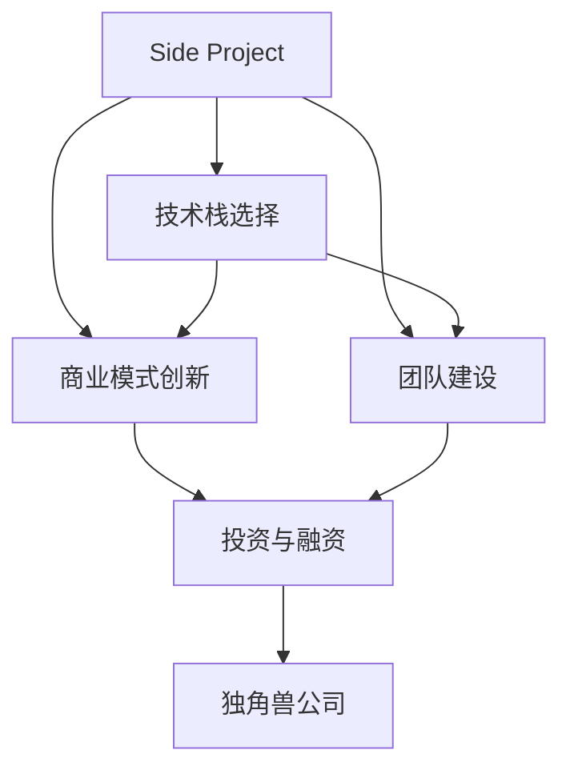

                 

# 如何将Side Project转化为独角兽

> 关键词：侧项目,独角兽公司,创业,技术栈,投资,商业模式,团队建设

## 1. 背景介绍

### 1.1 问题由来

在创业领域，侧项目往往被看作是创新和探索的前奏。但是，由于资源和时间的限制，许多侧项目最终未能成为真正意义上的“独角兽”。如何在侧项目中挖掘出潜在的商业价值，并成功将其转化为独角兽公司，是每一个创业者面临的重要课题。本文将从技术栈选择、商业模式的创新、团队建设等多个角度，探讨如何将侧项目转化为独角兽公司。

### 1.2 问题核心关键点

- 技术栈选择：如何根据项目特点选择最适合的技术栈。
- 商业模式创新：如何设计具有独特竞争力的商业模式。
- 团队建设：如何构建高效、协作的团队。
- 投资与融资：如何获取关键的投资支持。

这些关键点将贯穿文章的各个章节，帮助我们系统地了解如何将侧项目成功转型为独角兽公司。

## 2. 核心概念与联系

### 2.1 核心概念概述

为更好地理解如何将Side Project转化为独角兽公司，本节将介绍几个密切相关的核心概念：

- **Side Project**：指创业者在主业务之外探索新想法或技术的前置性项目。其目的是验证市场需求、探索技术可行性，为后续商业化积累经验。
- **独角兽公司**：指估值超过10亿美元，具有快速增长潜力的创新型科技公司。它们通常具有独特的商业模式和核心技术。
- **技术栈选择**：指为项目选择最合适的编程语言、框架和工具的集合。不同的技术栈对项目的开发效率、性能和扩展性有显著影响。
- **商业模式创新**：指设计出既能满足用户需求，又能实现盈利的新型商业模式。关键在于找到独特的价值主张。
- **团队建设**：指构建一个高效、协作的团队，是项目成功的关键。它包括招聘、培养、管理等多个环节。
- **投资与融资**：指获取关键的资金支持，是项目发展的动力源泉。成功融资不仅可以解决资金问题，还能带来商业和管理上的支持。

这些核心概念之间的逻辑关系可以通过以下Mermaid流程图来展示：



这个流程图展示了一个Side Project向独角兽公司转化的逻辑路径：

1. 侧项目A通过选择合适的技术栈B，设计创新的商业模式C，构建高效的团队D，最终通过融资E获得资金支持，成功转型为独角兽公司F。

## 3. 核心算法原理 & 具体操作步骤
### 3.1 算法原理概述

将Side Project转化为独角兽公司，本质上是一个多目标优化问题。核心在于找到合适的技术栈、商业模式、团队建设和融资策略，以实现项目的最优价值转化。

形式化地，假设Side Project为 $S$，技术栈选择为 $T$，商业模式为 $M$，团队建设为 $T$，融资为 $F$，独角兽公司为 $C$。转化过程的目标是最小化成本 $C$，最大化价值 $V$，即：

$$
\min_{T,M,T,F} C \\
\max_{T,M,T,F} V
$$

其中 $C$ 包括技术实现成本、商业模式设计成本、团队建设成本和融资成本；$V$ 包括项目市场价值、用户满意度和创新影响力。

通过梯度下降等优化算法，转化过程不断调整技术栈、商业模式、团队建设和融资策略，最小化成本，最大化价值，最终达到转化目标。

### 3.2 算法步骤详解

将Side Project转化为独角兽公司，一般包括以下几个关键步骤：

**Step 1: 确定项目目标与愿景**

- 明确Side Project的核心理念和目标市场。
- 制定清晰的发展愿景和短期、中期、长期目标。

**Step 2: 技术栈选择与设计**

- 根据项目需求和团队技术背景，选择合适的编程语言和框架。
- 设计模块化的架构，确保可扩展性和可维护性。

**Step 3: 商业模式创新**

- 分析目标市场的需求和痛点，设计独特的价值主张。
- 探索不同的盈利模式，如订阅制、广告、B2B等。

**Step 4: 团队建设与管理**

- 招聘有经验且适合企业文化的人才。
- 设计激励机制和团队文化，提升团队协作效率。

**Step 5: 融资与投资**

- 准备详细的商业计划书，包括市场分析、团队介绍、财务预测等。
- 通过天使投资、风投、众筹等多种渠道，获取关键资金支持。

**Step 6: 持续优化与迭代**

- 根据市场反馈和数据，持续优化技术栈、商业模式、团队建设和融资策略。
- 不断迭代产品和服务，提升用户满意度和市场竞争力。

### 3.3 算法优缺点

将Side Project转化为独角兽公司的算法方法具有以下优点：

1. 系统化：通过系统规划和优化，能够全面考虑技术、商业、团队和融资等多个维度，提升转化成功率。
2. 灵活性：在每个步骤中，可以根据实际情况灵活调整策略，适应市场变化。
3. 可量化：通过成本和价值的最小化最大化，可以量化分析每个决策的优劣，科学决策。

同时，该方法也存在一定的局限性：

1. 高度依赖资源：需要充足的资金、时间、技术、人才等资源支持。
2. 风险较高：每一步决策都可能面临市场不确定性和风险，需要进行风险管理。
3. 周期较长：从Side Project到独角兽公司需要较长时间，且过程中可能遇到多次迭代和调整。

尽管存在这些局限性，但就目前而言，系统化的侧项目转化方法仍是最主流、最有效的路径。未来相关研究的重点在于如何进一步降低资源依赖，提高转化效率，同时兼顾灵活性和风险管理。

### 3.4 算法应用领域

将Side Project转化为独角兽公司的算法方法，在创业领域已经得到了广泛的应用，涵盖了从初创企业的孵化，到现有业务的转型升级，再到跨行业创新等多个领域，例如：

- **科技初创企业**：通过技术栈选择、商业模式创新和团队建设，将创业想法转化为可落地、可扩展的科技产品。
- **传统企业转型**：利用新技术和新业务模式，实现传统业务的数字化转型，提升竞争力和市场份额。
- **跨行业创新**：通过技术融合和商业模式创新，跨界进入新的行业，探索新的市场机会。
- **公共服务**：利用技术创新和商业化手段，提升公共服务的效率和质量，构建智慧社会。

除了上述这些经典应用外，侧项目转化方法还将被创新性地应用于更多场景中，如教育、医疗、环保等，为社会带来新的价值和变革。

## 4. 数学模型和公式 & 详细讲解  
### 4.1 数学模型构建

本节将使用数学语言对Side Project向独角兽公司转化的过程进行更加严格的刻画。

假设Side Project的初始市场价值为 $V_0$，转化过程中总成本为 $C$，其中技术栈选择、商业模式创新、团队建设和融资的成本分别为 $C_T$、$C_M$、$C_T$ 和 $C_F$。转化后的独角兽公司市场价值为 $V_C$。则转化过程的目标函数为：

$$
\max_{T,M,T,F} V_C = V_0 + (V_C - V_0) - C
$$

其中 $V_C$ 是转化后的市场价值，$V_C - V_0$ 表示通过转化增加的市场价值，$C$ 表示总成本。

### 4.2 公式推导过程

以下我们以一个简单的商业模型为例，推导转化过程的成本和价值函数。

假设Side Project的初始用户量为 $U_0$，转化后的独角兽公司用户量为 $U_C$。通过商业模式创新，独角兽公司的用户增长率为 $r$。则独角兽公司的市场价值为：

$$
V_C = U_C \times P
$$

其中 $P$ 为用户的平均收入。转化过程中增加的用户量为：

$$
U_C - U_0 = U_0 \times r \times t
$$

其中 $t$ 为转化时间。则增加的收入为：

$$
\Delta P = P - P_0
$$

其中 $P_0$ 为Side Project的平均收入。则增加的收入总额为：

$$
\Delta V = (U_C - U_0) \times \Delta P = U_0 \times r \times t \times (P - P_0)
$$

转化过程中的总成本包括技术栈选择、商业模式创新、团队建设和融资成本，即 $C = C_T + C_M + C_T + C_F$。则转化过程的净增值为：

$$
\Delta V - C = U_0 \times r \times t \times (P - P_0) - (C_T + C_M + C_T + C_F)
$$

根据上述模型，可以通过优化 $r$、$t$、$P_0$、$P$、$C_T$、$C_M$、$C_F$ 等变量，找到最优的转化策略。

### 4.3 案例分析与讲解

**案例：一款社交媒体App的转化**

假设一款社交媒体App的初始用户量为 $U_0 = 10,000$，转化后的独角兽公司用户量为 $U_C = 1,000,000$，增长率为 $r = 10\%$，转化时间为 $t = 2$ 年。初始平均收入 $P_0 = 1$ 元/用户/月，转化后平均收入 $P = 5$ 元/用户/月。技术栈选择成本 $C_T = 10,000$，商业模式创新成本 $C_M = 5,000$，团队建设成本 $C_T = 20,000$，融资成本 $C_F = 100,000$。则转化过程的净增值为：

$$
\Delta V - C = 10,000 \times 10\% \times 2 \times (5 - 1) - (10,000 + 5,000 + 20,000 + 100,000) = 40,000 - 135,000 = -95,000
$$

显然，该转化策略未能带来正增值，需要进一步优化。例如，可以考虑增加融资额度，提升团队规模和技术栈质量，或探索新的商业模式，如会员制、广告分成等，以提升用户平均收入和增长率。

## 5. 项目实践：代码实例和详细解释说明
### 5.1 开发环境搭建

在进行侧项目向独角兽公司转化的实践前，我们需要准备好开发环境。以下是使用Python进行Web开发的环境配置流程：

1. 安装Anaconda：从官网下载并安装Anaconda，用于创建独立的Python环境。

2. 创建并激活虚拟环境：
```bash
conda create -n project-env python=3.8 
conda activate project-env
```

3. 安装Flask：
```bash
pip install flask
```

4. 安装SQLAlchemy：
```bash
pip install sqlalchemy
```

5. 安装Jinja2：
```bash
pip install jinja2
```

6. 安装SQLite：
```bash
pip install sqlite3
```

完成上述步骤后，即可在`project-env`环境中开始项目实践。

### 5.2 源代码详细实现

这里我们以开发一个基本的Web应用为例，给出使用Flask进行开发的PyTorch代码实现。

首先，定义一个简单的路由：

```python
from flask import Flask, request, jsonify

app = Flask(__name__)

@app.route('/hello', methods=['GET'])
def hello():
    return jsonify({'message': 'Hello, World!'})

if __name__ == '__main__':
    app.run(debug=True)
```

然后，定义一个简单的数据模型：

```python
from sqlalchemy import Column, Integer, String
from sqlalchemy.ext.declarative import declarative_base

Base = declarative_base()

class User(Base):
    __tablename__ = 'users'
    id = Column(Integer, primary_key=True)
    name = Column(String)

    def __init__(self, name):
        self.name = name
```

最后，运行Flask应用：

```bash
python app.py
```

在浏览器中输入`http://127.0.0.1:5000/hello`，即可访问Web应用。

### 5.3 代码解读与分析

让我们再详细解读一下关键代码的实现细节：

**Flask应用**：
- 使用Flask框架创建Web应用，定义`/hello`路由，返回`Hello, World!`消息。
- `if __name__ == '__main__':`表示只有当文件作为主程序运行时，才启动应用。

**SQLAlchemy模型**：
- 使用SQLAlchemy框架创建数据模型`User`，定义了`id`和`name`两个字段。
- 通过`Base`基类进行继承，使得`User`模型能够使用SQLAlchemy的ORM（对象关系映射）功能，方便进行数据库操作。

**Flask应用启动**：
- 调用`app.run()`方法启动Web应用，设置`debug=True`表示开启调试模式，在控制台输出调试信息。
- 在运行环境中执行`python app.py`启动应用，浏览器访问`http://127.0.0.1:5000`即可访问Web应用。

通过上述代码实现，我们可以快速搭建一个基本的Web应用，并进行调试和优化。在实际开发中，还需要考虑更多因素，如数据库连接、API接口、安全性、性能优化等，以确保应用的稳定性和可靠性。

## 6. 实际应用场景
### 6.1 社交媒体平台

将侧项目转化为社交媒体平台的独角兽公司，是许多创业者的梦想。通过用户生成内容、社交网络、广告收入等多种模式，社交媒体平台可以迅速积累用户，实现商业化。

在技术实现上，可以收集用户的互动数据，分析用户行为和兴趣，构建个性化推荐系统。通过算法推荐用户感兴趣的内容，提升用户粘性和活跃度。同时，开发社区管理工具，处理用户举报和违规行为，维护平台秩序。最后，引入广告投放系统，实现商业变现。

### 6.2 在线教育平台

在线教育平台通过提供优质的课程内容，吸引用户付费订阅。侧项目可以探索新的教育模式，如直播互动、虚拟现实（VR）体验、AI辅助教学等。

在技术实现上，可以开发智能推荐系统，根据用户的学习行为和成绩，推荐适合的课程和练习。同时，引入AI辅助教学工具，通过语音识别、自然语言处理等技术，提升教学质量。最后，开发社区平台，促进用户之间的交流和互助。

### 6.3 金融科技平台

金融科技平台通过提供便捷的金融服务，提升用户体验和效率。侧项目可以探索新的金融产品，如区块链、加密货币、智能合约等。

在技术实现上，可以开发智能风控系统，通过大数据分析，评估用户信用和风险。同时，引入区块链技术，提供去中心化的交易和记录。最后，开发智能投顾工具，通过AI算法，为用户推荐投资组合和资产管理方案。

### 6.4 未来应用展望

随着技术的不断进步和市场需求的变化，侧项目转化方法将在更多领域得到应用，为传统行业带来新的变革。

在智慧城市领域，侧项目可以探索智能交通、智能安防、智能能源等应用，提升城市管理的智能化水平。

在医疗健康领域，侧项目可以探索远程诊疗、智能诊断、健康管理等应用，提升医疗服务的便捷性和精准性。

在农业领域，侧项目可以探索精准农业、智能种植、农产品质量监控等应用，提升农业生产效率和品质。

此外，在物流、制造、零售、旅游等多个领域，侧项目转化方法也将不断涌现，为各行各业带来新的创新和机遇。

## 7. 工具和资源推荐
### 7.1 学习资源推荐

为了帮助开发者系统掌握侧项目向独角兽公司转化的理论基础和实践技巧，这里推荐一些优质的学习资源：

1. 《创业的艺术》系列书籍：由多位创业导师和成功创业者所著，深入浅出地介绍了创业的各个环节，包括项目选择、团队建设、融资等。

2. 《商业模式画布》：由亚历山大·奥斯特瓦德（Alexander Osterwalder）和伊夫·皮尼厄（Yves Pigneur）合著，详细讲解了如何设计和管理商业模式。

3. 《精益创业》：由埃里克·莱斯（Eric Ries）所著，介绍了精益创业的核心理念和方法，帮助创业者快速验证商业假设。

4. Coursera的《创业与创新》课程：由斯坦福大学和密歇根大学等名校开设，系统讲解了创业的各个环节和案例分析。

5. 《Web开发实战》书籍：介绍Web开发的各个方面，包括前端、后端、数据库、API接口等。

通过这些资源的学习实践，相信你一定能够快速掌握侧项目向独角兽公司转化的精髓，并用于解决实际的商业问题。

### 7.2 开发工具推荐

高效的开发离不开优秀的工具支持。以下是几款用于侧项目向独角兽公司转化的常用工具：

1. Visual Studio Code：功能强大的代码编辑器，支持多种编程语言和框架，是Web开发的首选工具。

2. Git：版本控制系统，支持代码的分支、合并、版本控制等功能，是团队协作开发的重要工具。

3. JIRA：项目管理工具，支持任务分配、进度跟踪、缺陷管理等功能，是项目管理的重要工具。

4. Slack：团队沟通工具，支持即时消息、文件共享、视频会议等功能，是团队协作的重要工具。

5. Google Docs：在线文档协作工具，支持多人实时编辑、评论、分享等功能，是团队协作的重要工具。

合理利用这些工具，可以显著提升侧项目向独角兽公司转化的开发效率，加快创新迭代的步伐。

### 7.3 相关论文推荐

侧项目向独角兽公司转化的研究源于学界的持续研究。以下是几篇奠基性的相关论文，推荐阅读：

1. 《创业过程中的不确定性与创新》：深入分析了创业过程中面临的不确定性，探讨了如何通过创新应对市场变化。

2. 《商业模式创新与公司绩效》：研究了商业模式创新对公司绩效的影响，提供了商业模式的评估方法和设计原则。

3. 《团队动力学与创新》：探讨了团队成员之间的相互作用，如何通过协作提升创新能力。

4. 《融资与企业成长》：研究了不同融资方式对企业成长的影响，提供了融资策略的选择和优化方法。

5. 《创业生态系统的演化》：研究了创业生态系统的发展规律，探讨了如何构建健康的创业生态。

这些论文代表了大语言模型微调技术的发展脉络。通过学习这些前沿成果，可以帮助研究者把握学科前进方向，激发更多的创新灵感。

## 8. 总结：未来发展趋势与挑战

### 8.1 总结

本文对将Side Project转化为独角兽公司的算法方法进行了全面系统的介绍。首先阐述了Side Project向独角兽公司转化的背景和意义，明确了转化的关键步骤和技术栈、商业模式、团队建设和融资策略的重要性。其次，从原理到实践，详细讲解了转化过程的数学模型和关键步骤，给出了具体的代码实现和案例分析。同时，本文还广泛探讨了转化的实际应用场景，展示了转化的广泛前景。

通过本文的系统梳理，可以看到，将Side Project转化为独角兽公司的方法是系统化、多维度、多目标优化的过程。它不仅需要科学的方法论，还需要结合具体项目特点进行灵活调整和优化。相信通过不断学习和实践，创业者能够更好地应对市场变化，实现Side Project到独角兽公司的成功转化。

### 8.2 未来发展趋势

展望未来，Side Project向独角兽公司转化的趋势将呈现以下几个方向：

1. 数据驱动：随着大数据和人工智能技术的发展，数据在决策中的作用将更加凸显。侧项目需要充分利用数据资源，通过数据分析和机器学习技术，提升转化效率和成功率。

2. 技术融合：随着技术的不断融合，跨领域的创新将成为主流。例如，AI与区块链的结合，可以提供去中心化的智能合约和信任机制。

3. 生态系统：侧项目需要构建健康的创业生态，包括孵化器、加速器、投资者等资源支持，加速转化过程。

4. 用户反馈：用户反馈是商业决策的重要依据，侧项目需要建立用户反馈机制，及时调整和优化产品和服务。

5. 国际市场：全球化的市场为创业提供了更多机会和挑战。侧项目需要考虑国际市场的需求和文化差异，制定全球化的发展战略。

6. 政策环境：政府政策和市场环境对创业有重要影响。侧项目需要关注政策变化，灵活调整策略。

以上趋势凸显了Side Project向独角兽公司转化的广阔前景。这些方向的探索发展，必将进一步提升创业成功率，加速创新技术的落地应用。

### 8.3 面临的挑战

尽管Side Project向独角兽公司转化的方法已经取得了一定的成果，但在迈向更加智能化、普适化应用的过程中，它仍面临着诸多挑战：

1. 资源瓶颈：侧项目需要充足的资金、技术、人才等资源支持，但初创企业往往面临资源不足的问题。

2. 市场风险：市场需求和市场变化的不确定性，增加了转化过程的风险。

3. 技术难度：侧项目需要跨学科的技术支持和融合，技术难度较大。

4. 团队建设：高效团队的构建和管理是一个长期的过程，需要持续投入和优化。

5. 融资难度：获取关键投资支持是转化的关键，但初创企业面临融资难的困境。

6. 法律合规：侧项目需要遵守各种法律法规，避免法律风险。

这些挑战需要创业者在技术、市场、管理和法律等多个方面进行综合考虑和应对，以确保成功转化。

### 8.4 研究展望

面对Side Project向独角兽公司转化所面临的挑战，未来的研究需要在以下几个方面寻求新的突破：

1. 数据驱动的优化：通过数据分析和机器学习技术，优化转化策略，降低资源成本，提升转化成功率。

2. 技术融合的创新：探索新的技术融合范式，如AI与区块链的结合，提升转化的灵活性和实用性。

3. 生态系统的构建：建立健康的创业生态系统，提供资源支持，加速转化过程。

4. 用户反馈的机制：建立用户反馈机制，及时调整和优化产品和服务，提升用户满意度和市场竞争力。

5. 国际市场的拓展：考虑国际市场的需求和文化差异，制定全球化的发展战略，提升市场份额。

6. 政策环境的适应：关注政策变化，灵活调整策略，规避政策风险。

这些研究方向的探索，必将引领Side Project向独角兽公司转化的技术突破，为创业公司带来更多的成功案例和创新动力。

## 9. 附录：常见问题与解答

**Q1: Side Project需要哪些关键资源？**

A: Side Project需要充足的资金、技术、人才和数据资源支持。资金用于产品开发和市场推广，技术用于开发和优化产品，人才用于团队建设和项目管理，数据用于分析和优化决策。

**Q2: 如何选择合适的技术栈？**

A: 选择合适的技术栈需要考虑项目需求、团队背景、市场趋势等多个因素。例如，Web应用可以选择前端框架如React、Vue，后端框架如Flask、Django，数据库如MySQL、PostgreSQL。

**Q3: 如何设计创新的商业模式？**

A: 设计创新的商业模式需要深入分析目标市场和用户需求，探索新的盈利模式，如订阅制、广告分成、B2B等。同时，需要考虑用户体验和市场接受度，设计合理的定价策略和激励机制。

**Q4: 如何构建高效的团队？**

A: 构建高效的团队需要招聘合适的人才，设计激励机制和团队文化，提升团队协作效率。同时，需要建立明确的目标和角色分工，定期进行团队建设和培训。

**Q5: 如何获取关键的投资支持？**

A: 获取关键投资支持需要准备详细的商业计划书，包括市场分析、团队介绍、财务预测等。同时，需要展示项目的独特价值和市场潜力，建立良好的投资者关系。

通过回答这些问题，我们可以更好地理解Side Project向独角兽公司转化的关键资源和步骤，为创业者提供实用的指导和建议。

