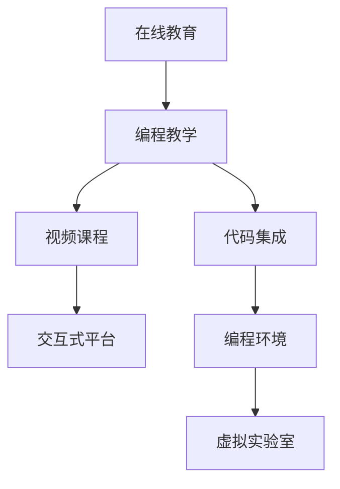

                 

# 如何将编程技能转化为在线课程

> 关键词：在线教育, 编程教学, 软件开发, 视频课程, 交互式平台

## 1. 背景介绍

### 1.1 问题由来
随着互联网的普及和技术的进步，在线教育逐渐成为一种主流的学习方式。特别是在编程和软件开发领域，在线课程因其灵活、便捷、丰富的资源成为许多程序员、初学者和职业培训师的首选。然而，高质量的在线课程并不容易制作，需要将编程技能有效地转化为易于理解和实践的教学内容。

### 1.2 问题核心关键点
将编程技能转化为在线课程，需要考虑以下几个关键点：
- 学习者背景的多样性。不同的学习者背景（从零基础到有一定编程经验的）需要不同程度的教学深度。
- 课程内容的组织结构。需要逻辑清晰、循序渐进地呈现编程知识，确保学习者能够系统地掌握技能。
- 交互性和反馈机制。通过实时互动和即时反馈，提升学习效果。
- 教学工具和资源的可用性。利用先进的教学工具和技术，如编程环境集成、视频互动、虚拟实验室等，提高课程体验。

### 1.3 问题研究意义
将编程技能转化为在线课程，对于普及计算机科学知识、促进技术创新、培养下一代开发者具有重要意义：

1. **普及编程知识**：在线课程能够打破时间和空间的限制，让更多人接触到编程和软件开发的知识。
2. **提升教育质量**：高质量的在线课程提供了系统化的学习资源，有助于提升教育质量，尤其是在编程等实践性强的领域。
3. **促进技术创新**：通过在线课程，技术专家能够快速传播新知识，推动技术的快速迭代和创新。
4. **培养新人才**：在线教育能够提供灵活的学习方式，吸引和培养更多有兴趣和潜力的编程人才。
5. **产业赋能**：在线课程能够帮助企业快速培训新员工，提升整体技术水平，助力产业升级。

## 2. 核心概念与联系

### 2.1 核心概念概述

为了更好地理解如何将编程技能转化为在线课程，我们先介绍几个核心概念：

- **在线教育**：通过互联网平台提供的学习方式，包括视频、文本、互动等多种形式，打破了传统教育的地理和时间限制。
- **编程教学**：专注于通过在线课程传授编程知识和技能的教学方式，强调实践和应用。
- **视频课程**：以视频为主要形式，结合屏幕共享、代码演示等手段，提供系统化的编程知识。
- **交互式平台**：利用在线工具，如代码编辑器、虚拟实验室、即时反馈系统等，增强课程的互动性和学习效果。
- **代码集成**：将编程工具和教学内容无缝集成，提供良好的学习环境。
- **编程环境**：如Jupyter Notebook、Visual Studio Code等，支持编写、测试和运行代码。
- **虚拟实验室**：提供模拟编程环境，便于学习者实践和调试。

这些概念之间的逻辑关系可以通过以下Mermaid流程图来展示：



这个流程图展示了几大核心概念及其相互关系：

1. 在线教育作为基础平台，支持多种教学形式。
2. 编程教学是核心内容，通过视频课程、交互式平台等形式实施。
3. 视频课程是主要教学手段，结合代码集成、编程环境、虚拟实验室等技术手段。
4. 交互式平台提供实时互动和即时反馈，增强学习体验。
5. 代码集成和编程环境优化编程工具的使用，提高教学效果。
6. 虚拟实验室提供模拟环境，便于编程实践和调试。

## 3. 核心算法原理 & 具体操作步骤
### 3.1 算法原理概述

将编程技能转化为在线课程的原理，本质上是将编程知识结构化、系统化，并通过视频、代码、互动等形式呈现给学习者，同时利用技术手段提升学习效果。以下是核心步骤：

1. **需求分析**：确定目标学习者的背景、目标技能和期望的课程结构。
2. **内容规划**：设计课程大纲，选择和组织教学内容。
3. **视频制作**：制作视频内容，结合代码演示、屏幕共享等手段。
4. **互动设计**：设计互动环节，如实时问答、编程挑战等。
5. **技术集成**：集成编程环境、虚拟实验室等技术手段。
6. **测试与优化**：通过测试和学习者反馈，不断优化课程内容和教学方法。

### 3.2 算法步骤详解

以下详细讲解如何将编程技能转化为在线课程的各个步骤：

**Step 1: 需求分析**
- **目标学习者背景**：分析学习者的编程基础，设计针对性的教学深度。
- **目标技能**：确定学习者需要掌握的具体编程技能。
- **课程结构**：规划课程的大纲，包含理论讲解、实践练习、项目实战等环节。

**Step 2: 内容规划**
- **知识体系**：构建系统化的知识体系，确保逻辑性和连贯性。
- **内容选择**：选择与课程目标相关的编程知识，如基础语法、数据结构、算法等。
- **组织结构**：设计课程的章节和课时，明确每个环节的学习目标和要求。

**Step 3: 视频制作**
- **脚本编写**：编写详细的视频脚本，结合教学内容进行讲解。
- **代码演示**：在视频中演示关键代码片段，展示实际应用场景。
- **屏幕共享**：通过屏幕共享工具展示代码运行和调试过程。
- **互动环节**：插入互动环节，如即时问答、编程挑战等，增强学习体验。

**Step 4: 互动设计**
- **即时反馈**：设计即时反馈机制，如通过学习管理系统（LMS）收集学习者的疑问和问题。
- **编程挑战**：设计编程挑战和任务，在学习者完成特定任务后给予即时反馈和评分。
- **社群互动**：建立学习社群，促进学习者之间的交流和讨论。

**Step 5: 技术集成**
- **编程环境集成**：将编程工具（如IDE、代码编辑器）嵌入到视频课程中，方便学习者实践。
- **虚拟实验室**：提供模拟编程环境，学习者可以在其中进行实验和调试。
- **在线测试平台**：集成在线测试平台，学习者可以在线完成编程任务并接收评分。

**Step 6: 测试与优化**
- **测试**：通过测试和学习者反馈，评估课程效果。
- **优化**：根据测试结果和学习者反馈，不断优化课程内容和教学方法。

### 3.3 算法优缺点

将编程技能转化为在线课程的优点包括：

1. **灵活性高**：在线课程可以随时访问，学习者可以根据自己的时间安排学习。
2. **互动性强**：通过即时反馈和互动环节，增强学习效果。
3. **资源丰富**：利用视频、代码、互动等多种形式，提供丰富的教学资源。
4. **覆盖面广**：能够覆盖大量学习者，提供普惠教育。

缺点包括：

1. **技术门槛**：需要具备一定的视频制作和互动设计技能。
2. **内容更新困难**：课程内容需要定期更新，以保持最新技术。
3. **质量控制**：需要保证视频质量和教学效果，确保学习者能够从中受益。
4. **个性化不足**：虽然灵活，但无法完全满足个性化学习需求。

### 3.4 算法应用领域

基于上述算法，将编程技能转化为在线课程在多个领域都有广泛应用：

1. **职业培训**：为在职人员提供编程技能的培训和提升。
2. **基础教育**：为学生提供系统化的编程入门课程。
3. **自我学习**：为个人提供灵活的学习途径，提升编程技能。
4. **企业培训**：为企业员工提供技术培训，提升整体技术水平。
5. **在线教育平台**：如Coursera、Udemy、edX等，提供多样化的编程课程。

## 4. 数学模型和公式 & 详细讲解 & 举例说明

### 4.1 数学模型构建

将编程技能转化为在线课程的数学模型，可以用于量化课程设计和教学效果。

记课程设计为一个映射函数 $f$，其中 $x$ 为学习者背景和目标技能，$y$ 为课程大纲和内容选择。则课程设计可以表示为：

$$
y = f(x)
$$

目标函数是最大化学习效果 $E$，可以表示为：

$$
E = \max_{y} \int \log(\frac{y}{y^*}) \text{d}x
$$

其中 $y^*$ 为最优课程设计，即能够最大化学习效果的课程内容。

### 4.2 公式推导过程

为了最大化学习效果 $E$，需要考虑以下几个方面：

1. **学习者背景**：学习者的编程基础和期望技能水平。
2. **课程内容**：选择合适的编程知识和技能。
3. **教学方法**：互动和即时反馈等教学手段。
4. **学习效果**：通过测试和学习者反馈评估课程效果。

根据以上考虑，可以设计以下评估指标：

1. **知识掌握率**：通过测试和学习者反馈，评估学习者对编程知识的掌握程度。
2. **学习时长**：记录学习者花费在视频课程上的时间，衡量学习投入。
3. **互动参与度**：通过互动环节和即时反馈，评估学习者参与度。
4. **项目实战**：通过项目实战环节，评估学习者应用编程技能的能力。

### 4.3 案例分析与讲解

以一个基础Python编程课程为例，分析如何通过数学模型和公式推导，进行课程设计和教学效果评估：

**学习者背景**：
- 编程基础：零基础。
- 目标技能：掌握Python基础语法、数据结构、函数等。

**课程内容**：
- 章节1：Python基础语法。
- 章节2：数据结构和算法。
- 章节3：函数和模块。
- 章节4：项目实战：实现一个简单的数据处理程序。

**教学方法**：
- 视频讲解：每个章节配备详细的视频讲解。
- 互动环节：视频中间插入即时问答和编程挑战。
- 代码演示：每个关键知识点结合代码演示。

**学习效果评估**：
- 知识掌握率：通过测试和学习者反馈评估。
- 学习时长：记录学习者花费在视频课程上的时间。
- 互动参与度：通过互动环节和即时反馈收集数据。
- 项目实战：通过项目实战评估学习者应用编程技能的能力。

## 5. 项目实践：代码实例和详细解释说明

### 5.1 开发环境搭建

在进行在线课程开发前，我们需要准备好开发环境。以下是使用Python进行Jupyter Notebook开发的环境配置流程：

1. 安装Anaconda：从官网下载并安装Anaconda，用于创建独立的Python环境。

2. 创建并激活虚拟环境：
```bash
conda create -n pytorch-env python=3.8 
conda activate pytorch-env
```

3. 安装Jupyter Notebook：
```bash
conda install jupyterlab
```

4. 安装相关库：
```bash
pip install numpy pandas matplotlib scikit-learn torch transformers
```

5. 启动Jupyter Notebook：
```bash
jupyter lab
```

完成上述步骤后，即可在`pytorch-env`环境中开始在线课程开发。

### 5.2 源代码详细实现

下面我们以一个简单的Python基础编程课程为例，给出使用Jupyter Notebook进行课程开发的Python代码实现。

**Step 1: 需求分析**

1. **目标学习者背景**：零基础。
2. **目标技能**：掌握Python基础语法、数据结构、函数等。
3. **课程结构**：包含基础语法、数据结构、函数、项目实战等环节。

```python
# 需求分析
target_learner = "zero_base"
target_skills = ["Python基础语法", "数据结构", "函数", "项目实战"]
course_structure = {
    "基础语法": "基础语法入门",
    "数据结构": "数据结构基础",
    "函数": "函数和模块",
    "项目实战": "实现一个简单的数据处理程序"
}
```

**Step 2: 内容规划**

1. **知识体系**：设计系统化的知识体系，确保逻辑性和连贯性。
2. **内容选择**：选择与课程目标相关的编程知识。
3. **组织结构**：设计课程的章节和课时。

```python
# 内容规划
content体系 = {
    "基础语法": ["语法基础", "变量和数据类型", "条件语句", "循环语句"],
    "数据结构": ["列表", "字典", "集合", "元组"],
    "函数": ["函数定义", "函数参数", "函数返回值", "Lambda函数"],
    "项目实战": ["数据处理", "数据可视化", "数据分析"]
}

# 组织结构
章节 = {}
课时 = {}
for topic in content体系:
    章节[topic] = []
    课时[topic] = []
    for item in content体系[topic]:
        章节[topic].append(item)
        课时[topic].append(f"{topic} {item}")
```

**Step 3: 视频制作**

1. **脚本编写**：编写详细的视频脚本。
2. **代码演示**：在视频中演示关键代码片段。
3. **屏幕共享**：通过屏幕共享工具展示代码运行和调试过程。
4. **互动环节**：插入互动环节，如即时问答、编程挑战。

```python
# 视频制作
from IPython.display import YouTubeVideo

脚本 = {
    "基础语法": ["语法基础", "变量和数据类型", "条件语句", "循环语句"],
    "数据结构": ["列表", "字典", "集合", "元组"],
    "函数": ["函数定义", "函数参数", "函数返回值", "Lambda函数"],
    "项目实战": ["数据处理", "数据可视化", "数据分析"]
}

# 代码演示
from IPython.display import IFrame
def 演示代码(代码):
    IFrame(代码, width="100%", height=400)

# 屏幕共享
from IPython.display import display
def 屏幕共享(文件名):
    YouTubeVideo(f"链接", width=800, height=450)

# 互动环节
from IPython.display import HTML
def 实时问答():
    HTML('''
        <form id="question-form">
            <input type="text" id="question-input">
            <button type="submit">提交问题</button>
        </form>
        <div id="question-output"></div>
    ''')

# 编程挑战
from IPython.display import HTML
def 编程挑战(代码):
    HTML(f'''
        <form id="challenge-form">
            <textarea id="challenge-input"></textarea>
            <button type="submit">提交代码</button>
        </form>
        <div id="challenge-output"></div>
    ''')
```

**Step 4: 互动设计**

1. **即时反馈**：通过学习管理系统（LMS）收集学习者的疑问和问题。
2. **编程挑战**：设计编程挑战和任务，在学习者完成特定任务后给予即时反馈和评分。
3. **社群互动**：建立学习社群，促进学习者之间的交流和讨论。

```python
# 即时反馈
from IPython.display import HTML
def 即时反馈():
    HTML('''
        <form id="feedback-form">
            <input type="text" id="feedback-input">
            <button type="submit">提交反馈</button>
        </form>
        <div id="feedback-output"></div>
    ''')

# 编程挑战
from IPython.display import HTML
def 编程挑战(代码):
    HTML(f'''
        <form id="challenge-form">
            <textarea id="challenge-input"></textarea>
            <button type="submit">提交代码</button>
        </form>
        <div id="challenge-output"></div>
    ''')

# 社群互动
from IPython.display import HTML
def 社群互动():
    HTML('''
        <form id="community-form">
            <input type="text" id="community-input">
            <button type="submit">提交讨论</button>
        </form>
        <div id="community-output"></div>
    ''')
```

**Step 5: 技术集成**

1. **编程环境集成**：将编程工具（如IDE、代码编辑器）嵌入到视频课程中。
2. **虚拟实验室**：提供模拟编程环境。
3. **在线测试平台**：学习者可以在线完成编程任务并接收评分。

```python
# 编程环境集成
from IPython.display import HTML
def 编程环境集成():
    HTML('''
        <form id="environment-form">
            <button type="submit">打开编程环境</button>
        </form>
    ''')

# 虚拟实验室
from IPython.display import HTML
def 虚拟实验室():
    HTML('''
        <form id="lab-form">
            <button type="submit">进入虚拟实验室</button>
        </form>
    ''')

# 在线测试平台
from IPython.display import HTML
def 在线测试平台():
    HTML('''
        <form id="test-platform-form">
            <button type="submit">开始在线测试</button>
        </form>
    ''')
```

**Step 6: 测试与优化**

1. **测试**：通过测试和学习者反馈，评估课程效果。
2. **优化**：根据测试结果和学习者反馈，不断优化课程内容和教学方法。

```python
# 测试与优化
from IPython.display import HTML
def 测试与优化():
    HTML('''
        <form id="test-opt-form">
            <input type="text" id="test-opt-input">
            <button type="submit">提交优化建议</button>
        </form>
        <div id="test-opt-output"></div>
    ''')
```

### 5.3 代码解读与分析

让我们再详细解读一下关键代码的实现细节：

**需求分析**

1. **目标学习者背景**：
```python
target_learner = "zero_base"
```

2. **目标技能**：
```python
target_skills = ["Python基础语法", "数据结构", "函数", "项目实战"]
```

3. **课程结构**：
```python
课程_structure = {
    "基础语法": "基础语法入门",
    "数据结构": "数据结构基础",
    "函数": "函数和模块",
    "项目实战": "实现一个简单的数据处理程序"
}
```

**内容规划**

1. **知识体系**：
```python
内容体系 = {
    "基础语法": ["语法基础", "变量和数据类型", "条件语句", "循环语句"],
    "数据结构": ["列表", "字典", "集合", "元组"],
    "函数": ["函数定义", "函数参数", "函数返回值", "Lambda函数"],
    "项目实战": ["数据处理", "数据可视化", "数据分析"]
}
```

2. **组织结构**：
```python
章节 = {}
课时 = {}
for topic in 内容体系:
    章节[topic] = []
    课时[topic] = []
    for item in 内容体系[topic]:
        章节[topic].append(item)
        课时[topic].append(f"{topic} {item}")
```

**视频制作**

1. **脚本编写**：
```python
脚本 = {
    "基础语法": ["语法基础", "变量和数据类型", "条件语句", "循环语句"],
    "数据结构": ["列表", "字典", "集合", "元组"],
    "函数": ["函数定义", "函数参数", "函数返回值", "Lambda函数"],
    "项目实战": ["数据处理", "数据可视化", "数据分析"]
}
```

2. **代码演示**：
```python
def 演示代码(代码):
    IFrame(代码, width="100%", height=400)
```

3. **屏幕共享**：
```python
from IPython.display import display
def 屏幕共享(文件名):
    YouTubeVideo(f"链接", width=800, height=450)
```

4. **互动环节**：
```python
def 实时问答():
    HTML('''
        <form id="question-form">
            <input type="text" id="question-input">
            <button type="submit">提交问题</button>
        </form>
        <div id="question-output"></div>
    ''')

def 编程挑战(代码):
    HTML(f'''
        <form id="challenge-form">
            <textarea id="challenge-input"></textarea>
            <button type="submit">提交代码</button>
        </form>
        <div id="challenge-output"></div>
    ''')
```

**互动设计**

1. **即时反馈**：
```python
def 即时反馈():
    HTML('''
        <form id="feedback-form">
            <input type="text" id="feedback-input">
            <button type="submit">提交反馈</button>
        </form>
        <div id="feedback-output"></div>
    ''')
```

2. **编程挑战**：
```python
def 编程挑战(代码):
    HTML(f'''
        <form id="challenge-form">
            <textarea id="challenge-input"></textarea>
            <button type="submit">提交代码</button>
        </form>
        <div id="challenge-output"></div>
    ''')
```

3. **社群互动**：
```python
def 社群互动():
    HTML('''
        <form id="community-form">
            <input type="text" id="community-input">
            <button type="submit">提交讨论</button>
        </form>
        <div id="community-output"></div>
    ''')
```

**技术集成**

1. **编程环境集成**：
```python
def 编程环境集成():
    HTML('''
        <form id="environment-form">
            <button type="submit">打开编程环境</button>
        </form>
    ''')
```

2. **虚拟实验室**：
```python
def 虚拟实验室():
    HTML('''
        <form id="lab-form">
            <button type="submit">进入虚拟实验室</button>
        </form>
    ''')
```

3. **在线测试平台**：
```python
def 在线测试平台():
    HTML('''
        <form id="test-platform-form">
            <button type="submit">开始在线测试</button>
        </form>
    ''')
```

**测试与优化**

1. **测试**：
```python
def 测试与优化():
    HTML('''
        <form id="test-opt-form">
            <input type="text" id="test-opt-input">
            <button type="submit">提交优化建议</button>
        </form>
        <div id="test-opt-output"></div>
    ''')
```

以上代码实现了从需求分析到内容规划、视频制作、互动设计、技术集成、测试与优化的完整流程，能够帮助开发者系统化地将编程技能转化为在线课程。

## 6. 实际应用场景

### 6.1 职业培训

在线编程课程广泛应用于职业培训，特别是对在职人员进行技能提升。例如，某公司需要提升员工的数据处理能力，可以设计一个基础Python编程课程，帮助员工掌握数据清洗、分析等技能，提高工作效率。

### 6.2 基础教育

基础教育领域，在线编程课程能够帮助学生系统地学习编程知识。例如，某小学开设Python基础编程课程，通过生动的视频讲解和互动环节，让学生在趣味中掌握编程基础，激发对编程的兴趣。

### 6.3 自我学习

在线编程课程为个人提供了灵活的学习途径，能够满足不同层次的学习需求。例如，某编程爱好者希望系统学习Python，通过在线课程，能够灵活安排学习时间，深入理解编程知识。

### 6.4 企业培训

在线编程课程能够帮助企业快速培训新员工，提升整体技术水平。例如，某企业需要新员工掌握Python基础语法，通过在线课程，能够提高培训效率，减少时间成本。

### 6.5 在线教育平台

在线教育平台如Coursera、Udemy、edX等，提供了多样化的编程课程，满足不同学习者的需求。例如，某在线教育平台提供Python基础编程课程，通过视频讲解、代码演示、互动环节等形式，帮助学习者系统掌握Python编程技能。

## 7. 工具和资源推荐

### 7.1 学习资源推荐

为了帮助开发者系统掌握将编程技能转化为在线课程的理论基础和实践技巧，这里推荐一些优质的学习资源：

1. **《Python编程基础》**：一本详细介绍Python编程的入门书籍，适合初学者入门。
2. **《JavaScript高级程序设计》**：一本深入讲解JavaScript编程的书籍，适合进阶学习。
3. **《Java核心技术》**：一本详细介绍Java编程的书籍，适合Java开发者。
4. **《C# 7.0高级程序设计》**：一本详细介绍C#编程的书籍，适合C#开发者。
5. **《Ruby程序设计》**：一本详细介绍Ruby编程的书籍，适合Ruby开发者。

### 7.2 开发工具推荐

高效的开发离不开优秀的工具支持。以下是几款用于编程课程开发的常用工具：

1. **Jupyter Notebook**：一个交互式编程环境，支持Python、R、JavaScript等多种语言，非常适合进行编程课程开发。
2. **Visual Studio Code**：一个轻量级的代码编辑器，支持多种编程语言，插件丰富，扩展性强。
3. **Git**：版本控制系统，能够方便地进行代码管理，支持多人协作开发。
4. **Docker**：容器化技术，能够打包编程环境，方便部署和移植。
5. **Anaconda**：Python发行版，支持科学计算和数据处理，包含大量开源库和工具。

### 7.3 相关论文推荐

将编程技能转化为在线课程的研究源于学界的持续研究。以下是几篇奠基性的相关论文，推荐阅读：

1. **《在线编程课程的设计与实施》**：探讨在线编程课程的设计和实施方法，提出系统化课程体系。
2. **《交互式编程学习平台的构建与优化》**：分析交互式编程学习平台的构建，提出提高学习效果的策略。
3. **《编程课程的评估与优化》**：提出评估编程课程效果的方法，并给出优化建议。
4. **《编程课程的交互设计》**：探讨编程课程的交互设计，提出增强学习体验的策略。
5. **《编程课程的技术集成》**：分析编程课程的技术集成，提出提高课程效果的策略。

## 8. 总结：未来发展趋势与挑战

### 8.1 总结

本文对将编程技能转化为在线课程进行了全面系统的介绍。首先阐述了编程技能转化为在线课程的研究背景和意义，明确了在线编程课程的设计、实施、评估等关键环节。其次，从原理到实践，详细讲解了课程设计和教学效果评估的数学模型，给出了完整的开发流程和代码实现。同时，本文还广泛探讨了编程课程在职业培训、基础教育、自我学习、企业培训等多个领域的应用前景，展示了编程课程的巨大潜力。

通过本文的系统梳理，可以看到，将编程技能转化为在线课程是一个多学科交叉的过程，涉及教育学、心理学、计算机科学等多个领域。在未来的发展中，需要各领域专家共同努力，不断优化课程设计，提升教学效果，确保学习者能够从中受益。

### 8.2 未来发展趋势

展望未来，将编程技能转化为在线课程的发展趋势包括：

1. **技术手段的进步**：随着技术的进步，在线编程课程将提供更加丰富、互动、个性化的学习体验。
2. **课程内容的丰富**：课程内容将更加多样、全面，覆盖更多的编程语言和技术栈。
3. **教学方法的创新**：通过更多新技术和教学方法，提升课程互动性和学习效果。
4. **学习资源的共享**：更多优质的学习资源将通过在线平台共享，促进知识传播和普及。
5. **跨领域应用**：在线编程课程将与人工智能、数据科学等领域结合，提供更多交叉学科的学习机会。

### 8.3 面临的挑战

尽管将编程技能转化为在线课程已经取得了诸多进展，但在迈向更加智能化、普适化应用的过程中，仍面临以下挑战：

1. **技术门槛高**：开发高质量的在线编程课程需要具备一定的视频制作和互动设计技能。
2. **内容更新困难**：课程内容需要定期更新，以保持最新技术。
3. **质量控制难**：需要保证视频质量和教学效果，确保学习者能够从中受益。
4. **个性化不足**：虽然灵活，但无法完全满足个性化学习需求。
5. **技术迭代快**：编程语言和技术栈不断更新，课程需要快速响应，保持更新。

### 8.4 研究展望

面对未来发展趋势和挑战，需要在以下几个方面进行深入研究：

1. **课程设计的自动化**：利用人工智能和机器学习技术，自动化课程设计，提升设计效率和质量。
2. **互动学习的优化**：通过更多新技术和教学方法，提升课程互动性和学习效果。
3. **学习资源的开放共享**：建立开放的学习资源平台，促进知识的共享和普及。
4. **跨领域应用的探索**：将编程课程与人工智能、数据科学等领域结合，提供更多交叉学科的学习机会。

总之，将编程技能转化为在线课程是一个不断探索和创新的过程。只有在技术、教育、心理学等各领域专家的共同努力下，才能实现在线编程课程的持续发展和优化，为更多人提供高质量的编程教育。

## 9. 附录：常见问题与解答

**Q1: 将编程技能转化为在线课程需要哪些技能？**

A: 将编程技能转化为在线课程需要具备以下技能：
1. **编程技能**：熟悉多种编程语言和工具。
2. **教育学知识**：了解教育心理学，设计合理的课程结构和教学方法。
3. **视频制作技能**：能够制作清晰、生动的视频内容。
4. **互动设计技能**：设计互动环节和即时反馈机制。
5. **技术集成技能**：能够集成编程环境、虚拟实验室等技术手段。

**Q2: 如何评估在线编程课程的效果？**

A: 评估在线编程课程的效果可以从以下几个方面考虑：
1. **学习者反馈**：通过问卷调查、即时反馈等方式，收集学习者的评价和建议。
2. **知识掌握率**：通过测试和学习者反馈评估学习者对编程知识的掌握程度。
3. **互动参与度**：通过互动环节和即时反馈收集数据，评估学习者参与度。
4. **项目实战效果**：通过项目实战环节，评估学习者应用编程技能的能力。

**Q3: 开发在线编程课程需要哪些工具？**

A: 开发在线编程课程需要以下工具：
1. **Jupyter Notebook**：交互式编程环境，支持多种编程语言。
2. **Visual Studio Code**：轻量级代码编辑器，插件丰富，扩展性强。
3. **Git**：版本控制系统，方便代码管理，支持多人协作开发。
4. **Docker**：容器化技术，方便打包编程环境，部署和移植。
5. **Anaconda**：Python发行版，支持科学计算和数据处理，包含大量开源库和工具。

**Q4: 在线编程课程如何应对编程语言和技术栈的变化？**

A: 在线编程课程需要定期更新，以应对编程语言和技术栈的变化。具体措施包括：
1. **定期维护**：定期更新课程内容，确保与最新技术保持一致。
2. **灵活设计**：设计灵活的课程结构，方便添加新内容。
3. **持续改进**：根据学习者反馈和技术发展，不断优化课程设计和教学方法。
4. **模块化设计**：将课程内容模块化，方便添加新模块和内容。

**Q5: 如何提升在线编程课程的学习效果？**

A: 提升在线编程课程的学习效果，可以从以下几个方面考虑：
1. **互动设计**：设计互动环节和即时反馈机制，增强学习体验。
2. **视频制作**：制作清晰、生动的视频内容，提高学习者的参与度。
3. **代码演示**：结合代码演示，帮助学习者理解和掌握编程知识。
4. **项目实战**：通过项目实战环节，提高学习者应用编程技能的能力。
5. **学习资源**：提供丰富的学习资源，如代码示例、学习资料等，帮助学习者自主学习。

---

作者：禅与计算机程序设计艺术 / Zen and the Art of Computer Programming

