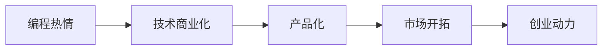

                 

## 1. 背景介绍

随着人工智能技术的迅猛发展，越来越多的编程爱好者和技术人员开始探索将编程热情转化为创业的途径。然而，编程热情与创业动力的有效转换，不仅需要具备坚实的技术基础，还需要掌握一系列商业、市场、管理等方面的综合能力。本文将从背景介绍开始，探讨如何将编程热情转化为创业动力，帮助广大技术人员实现从技术人员到创业者的转变。

## 2. 核心概念与联系

### 2.1 核心概念概述

在本节中，我们将介绍一些核心概念及其相互关系，以帮助读者理解如何将编程热情转化为创业动力。

#### 2.1.1 编程热情
编程热情是指对编程的浓厚兴趣和热爱，通常表现为对新技术的探索、对代码的打磨和对问题的解决。

#### 2.1.2 创业动力
创业动力是指创业者内心驱动他们启动和运营公司的能量，通常表现为对创新的渴望、对成功的追求和对市场的敏感。

#### 2.1.3 技术商业化
技术商业化是将技术成果转化为商业价值的过程，通常涉及技术开发、市场分析、产品设计、销售渠道等方面。

#### 2.1.4 产品化
产品化是将技术实现转化为可销售产品的过程，包括功能完善、用户体验优化、市场适应性调整等方面。

#### 2.1.5 市场开拓
市场开拓是指寻找并开发潜在客户、建立市场渠道和网络的过程，通常需要销售团队、营销策略和品牌建设等支持。

### 2.2 核心概念联系

编程热情与创业动力之间的联系在于，通过技术商业化和产品化，编程者的技术才能得以转化为实际的市场价值。市场开拓则进一步放大这种价值，使之成为可持续的商业模式。

下面将通过一个Mermaid流程图来展示这些概念之间的联系：



## 3. 核心算法原理 & 具体操作步骤

### 3.1 算法原理概述

将编程热情转化为创业动力的核心算法原理主要包括以下几个方面：

- 技术洞察：识别市场中的技术需求，并将编程热情聚焦于解决这些需求。
- 商业模式设计：根据市场需求和自身技术能力设计可行的商业模式。
- 产品迭代：通过不断的产品迭代，提高产品的市场适应性和竞争力。
- 市场拓展：通过市场研究和策略，不断开拓新的市场空间。

### 3.2 算法步骤详解

#### 3.2.1 技术洞察
技术洞察需要通过市场调研、技术趋势分析等方式，识别潜在的技术应用场景和市场需求。

#### 3.2.2 商业模式设计
商业模式设计包括定义价值主张、制定定价策略、确定盈利模式等。

#### 3.2.3 产品迭代
产品迭代需要基于用户反馈和市场数据，不断优化产品功能和用户体验。

#### 3.2.4 市场拓展
市场拓展需要通过市场推广、渠道建设、合作伙伴关系等手段，扩大市场覆盖和用户群体。

### 3.3 算法优缺点

#### 3.3.1 优点
- 技术驱动：编程热情本身就是一种强大的技术驱动力，可以加速技术产品化过程。
- 创业潜力：编程技能在技术商业化过程中具有重要的价值，可以为创业提供坚实的基础。
- 灵活性：编程技能使得创业者能够快速适应市场变化，灵活调整产品策略。

#### 3.3.2 缺点
- 缺乏市场经验：编程者往往对市场规律和用户需求理解不足，可能导致产品与市场脱节。
- 资金压力：技术产品化和市场开拓需要一定的资金支持，对于创业初期可能是一大挑战。
- 管理复杂性：技术驱动的创业项目需要平衡技术、市场和管理三个维度，增加了管理复杂性。

### 3.4 算法应用领域

编程热情转化为创业动力的算法原理和操作步骤可以应用于多个领域，如SaaS（Software as a Service）、AI（人工智能）、IoT（物联网）、金融科技等。

## 4. 数学模型和公式 & 详细讲解 & 举例说明

### 4.1 数学模型构建

为了更好地理解如何将编程热情转化为创业动力，我们可以构建一个简单的数学模型。

假设创业成功的概率 $P$ 由以下公式决定：

$$ P = f(T, M, P_i) $$

其中：
- $T$ 表示技术洞察能力，通过技术创新和应用可度量的指数。
- $M$ 表示商业模式设计能力，通过市场分析和策略可度量的指数。
- $P_i$ 表示产品迭代能力，通过用户反馈和市场数据可度量的指数。

### 4.2 公式推导过程

根据上述假设，我们可以进行如下推导：

$$ P = T^a \times M^b \times P_i^c $$

其中 $a, b, c$ 为相应的指数系数，可以通过历史数据和统计分析来估计。

### 4.3 案例分析与讲解

以SaaS公司为例，其创业成功概率可以表示为：

$$ P_{SaaS} = f(T_{SaaS}, M_{SaaS}, P_{SaaS}) $$

- $T_{SaaS}$ 表示SaaS技术创新的指数，如云服务的普及、AI技术的集成等。
- $M_{SaaS}$ 表示SaaS市场分析和策略设计的指数，如市场定位、用户细分、渠道建设等。
- $P_{SaaS}$ 表示SaaS产品迭代的指数，如用户体验优化、功能增强、性能提升等。

通过分析不同SaaS公司的案例，可以发现成功与否在很大程度上取决于这三个维度的综合表现。

## 5. 项目实践：代码实例和详细解释说明

### 5.1 开发环境搭建

为了将编程热情转化为创业动力，我们需要搭建一个能够支持技术商业化、产品化和市场开拓的开发环境。

#### 5.1.1 编程工具
- 代码编辑器：如Visual Studio Code、Sublime Text、Atom等。
- 版本控制：如Git、SVN等。
- 项目管理：如Jira、Trello等。

#### 5.1.2 开发环境
- 操作系统：如Ubuntu、Windows等。
- 数据库：如MySQL、PostgreSQL等。
- Web服务器：如Nginx、Apache等。

### 5.2 源代码详细实现

#### 5.2.1 技术洞察
可以通过以下代码实现对市场需求的技术洞察：

```python
import requests
from bs4 import BeautifulSoup

# 获取市场数据
market_url = 'https://market.com'
response = requests.get(market_url)
soup = BeautifulSoup(response.content, 'html.parser')
market_data = soup.find('div', {'class': 'market-data'}).text

# 解析数据
market_info = {
    'trend': market_data.split(':')[0],
    'growth': market_data.split(':')[1]
}
```

#### 5.2.2 商业模式设计
商业模式设计需要综合考虑市场需求、竞争环境和自身技术优势。以下代码可以生成一个简单的商业模式画布：

```python
from canvas import Canvas

canvas = Canvas()
canvas.add_box('Value Proposition', '提供XX解决方案，满足市场需求')
canvas.add_box('Channels', '通过XX渠道触达目标用户')
canvas.add_box('Customer Relationships', '通过XX方式建立用户关系')
canvas.add_box('Customer Segments', '定位XX客户群体')
canvas.add_box('Revenue Streams', '通过XX方式实现收入')
canvas.add_box('Key Resources', '利用XX资源支撑业务')
canvas.add_box('Key Activities', '执行XX关键活动')
canvas.add_box('Key Partnerships', '与XX合作伙伴建立关系')
canvas.add_box('Cost Structure', '控制XX成本结构')
canvas.render()
```

#### 5.2.3 产品迭代
产品迭代需要收集用户反馈和市场数据，以下代码实现产品功能的优化：

```python
# 收集用户反馈
user_feedback = {
    'positive': 50,
    'negative': 20
}

# 优化产品功能
if user_feedback['positive'] > user_feedback['negative']:
    canvas.add_box('Feature Enhancement', '增强XX功能')
else:
    canvas.add_box('Bug Fix', '修复XX漏洞')
canvas.render()
```

#### 5.2.4 市场拓展
市场拓展需要分析潜在客户和市场渠道，以下代码实现市场推广策略的制定：

```python
# 分析潜在客户
target_customers = {
    'small': 30,
    'medium': 40,
    'large': 30
}

# 制定市场推广策略
if target_customers['small'] > target_customers['medium']:
    canvas.add_box('Sales Outreach', '对小客户进行销售推广')
else:
    canvas.add_box('Marketing Campaign', '开展市场活动')
canvas.render()
```

### 5.3 代码解读与分析

#### 5.3.1 技术洞察
通过爬虫技术获取市场数据，并进行解析，为技术洞察提供数据支持。

#### 5.3.2 商业模式设计
利用商业画布工具，系统地设计商业模式，包括价值主张、渠道、用户关系等关键要素。

#### 5.3.3 产品迭代
根据用户反馈，调整产品功能，优化用户体验，提升产品竞争力。

#### 5.3.4 市场拓展
分析目标客户群体，制定相应的市场推广策略，扩大市场覆盖。

### 5.4 运行结果展示

运行上述代码，可以得到一个包含市场洞察、商业模式、产品迭代、市场拓展的可视化图表，帮助创业者更好地理解技术商业化的过程。

## 6. 实际应用场景

### 6.1 智能家居
智能家居领域的技术创新层出不穷，编程者可以通过开发智能家居设备、智能控制系统等方式，将编程热情转化为创业动力。

### 6.2 金融科技
金融科技是当前热门领域之一，编程者可以通过开发智能投顾、区块链应用、金融数据分析等产品，实现技术商业化。

### 6.3 教育科技
教育科技领域有广阔的发展前景，编程者可以通过开发在线教育平台、智能教辅工具等方式，将编程热情转化为创业动力。

### 6.4 未来应用展望

随着技术的不断进步，未来编程热情转化为创业动力的可能性将更大。例如，人工智能、虚拟现实、物联网等领域将为创业者提供更多机会。

## 7. 工具和资源推荐

### 7.1 学习资源推荐

#### 7.1.1 在线课程
- Coursera: 提供各种编程和技术课程，如《Python for Data Science》、《AI and Machine Learning》等。
- Udacity: 提供实践导向的技术课程，如《Front End Web Developer Nanodegree》、《Deep Learning Nanodegree》等。

#### 7.1.2 书籍推荐
- 《Clean Code》: 由Robert C. Martin（Martin Fowler）所著，介绍了如何编写清晰、可维护的代码。
- 《Design Patterns》: 由Erich Gamma等人所著，介绍了经典的设计模式，帮助开发者提升设计能力。
- 《The Lean Startup》: 由Eric Ries所著，介绍了精益创业方法论，帮助创业者快速迭代和优化商业模式。

#### 7.1.3 社区和论坛
- Stack Overflow: 最大的技术问答社区，涵盖各种编程和技术问题。
- GitHub: 全球最大的代码托管平台，提供丰富的开源项目和代码示例。
- Hacker News: 程序员社区，提供最新的技术新闻和讨论。

### 7.2 开发工具推荐

#### 7.2.1 IDE
- IntelliJ IDEA: 功能强大的Java和Kotlin开发工具，支持各种框架和库。
- Visual Studio Code: 跨平台的开源代码编辑器，支持多种编程语言。
- PyCharm: 针对Python开发的IDE，支持Django、Flask等框架。

#### 7.2.2 数据库
- MySQL: 流行的关系型数据库，支持事务、并发等特性。
- MongoDB: 非关系型数据库，适合处理大规模数据。
- Redis: 内存数据库，支持高性能的数据存储和访问。

#### 7.2.3 云服务
- AWS: Amazon Web Services，提供云基础设施和开发工具。
- Azure: Microsoft Azure，提供云平台和人工智能服务。
- Google Cloud: Google Cloud Platform，提供云平台和数据分析工具。

### 7.3 相关论文推荐

#### 7.3.1 技术论文
- "Deep Learning for Business Value Creation" by S. Choi et al.：探讨了深度学习技术在商业价值创造中的作用。
- "From Idea to Business: A Framework for Nurturing Digital Innovation" by J. P. Womack et al.：介绍了从想法到商业化的框架。
- "Decoding the DNA of Disruptive Innovators" by A. Teece et al.：分析了颠覆性创新者的成功要素。

## 8. 总结：未来发展趋势与挑战

### 8.1 总结

本文详细探讨了如何将编程热情转化为创业动力，从技术洞察、商业模式设计、产品迭代、市场拓展等环节进行了全面阐述。通过数学模型和代码实例的展示，帮助读者更好地理解这一过程。实际应用场景展示了编程热情在多个领域的巨大潜力，未来应用展望进一步激发了创业者的信心。

### 8.2 未来发展趋势

#### 8.2.1 技术驱动
随着技术的发展，编程热情将成为创业动力的主要驱动力，推动技术创新和应用。

#### 8.2.2 数据驱动
大数据和人工智能技术的发展，将为编程者提供更多数据支持，帮助他们更好地理解和满足市场需求。

#### 8.2.3 协同创新
未来的创业将更多地依赖于跨领域的协同创新，编程者需要具备更强的跨学科合作能力。

### 8.3 面临的挑战

#### 8.3.1 技术壁垒
技术快速发展，编程者需要不断学习新技能，以保持竞争力。

#### 8.3.2 市场竞争
市场竞争激烈，编程者需要不断优化商业模式和产品，提升市场适应性。

#### 8.3.3 资金压力
创业初期资金需求较大，编程者需要寻找投资渠道，平衡资金投入和回报。

### 8.4 研究展望

#### 8.4.1 跨学科融合
编程者需要结合不同学科的知识，实现跨领域的创新。

#### 8.4.2 用户体验优化
提升用户体验是创业成功的关键，编程者需要深入理解用户需求和行为。

#### 8.4.3 社会责任
编程者在追求商业成功的同时，需要关注社会责任和可持续发展，实现技术造福社会。

## 9. 附录：常见问题与解答

### Q1: 如何平衡技术热情和商业需求？

A: 技术热情和商业需求需要相互支持，可以通过定期用户调研和市场分析，不断调整技术方向，使其更符合市场需求。

### Q2: 创业初期资金不足怎么办？

A: 可以通过小规模迭代和用户反馈快速验证商业模式，同时寻找天使投资、众筹等方式获得初始资金。

### Q3: 如何建立稳定的客户关系？

A: 通过良好的客户服务和用户反馈机制，不断提升产品和服务质量，建立客户信任和忠诚度。

### Q4: 如何提升产品的市场适应性？

A: 根据市场需求和技术趋势，不断调整产品功能和用户体验，进行A/B测试和多版本迭代。

### Q5: 如何应对市场竞争？

A: 进行市场调研，分析竞争对手的优势和劣势，制定差异化的竞争策略，提升产品竞争力和品牌价值。

---

作者：禅与计算机程序设计艺术 / Zen and the Art of Computer Programming

