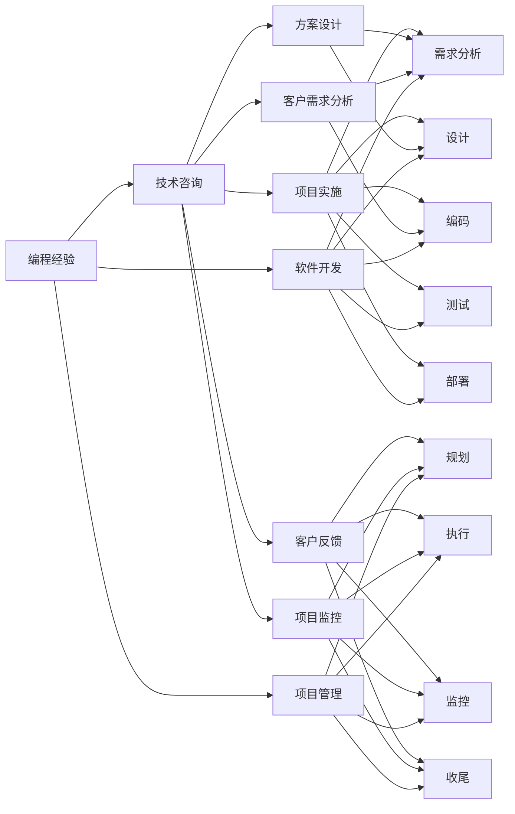

                 

# 如何将编程经验转化为技术咨询服务

> 关键词：编程经验,技术咨询,软件开发,项目管理,人工智能,技术架构,项目管理

## 1. 背景介绍

在当今快速发展的数字化时代，技术的革新和迭代速度前所未有，企业对于技术咨询的需求日益增加。软件开发专家和技术人员凭借其在编程和项目经验上的积累，可以提供宝贵的技术咨询服务。本文旨在探讨如何将编程经验转化为高价值的商业服务，助力企业和组织实现技术突破和业务创新。

### 1.1 技术咨询市场现状
随着企业数字化转型的加速，对技术咨询的需求不断攀升。技术咨询涵盖软件开发、项目规划、架构设计、数据分析等多个方面，对于提升企业技术水平和业务竞争力至关重要。然而，高质量的技术咨询人才相对稀缺，企业往往需要支付高额成本才能获得。

### 1.2 编程经验的重要性
编程经验不仅仅是编写代码的能力，更是解决问题的能力、系统思维、团队协作和项目管理经验的综合体现。这些经验不仅适用于具体的开发工作，也可以在技术咨询中发挥重要作用。

1. **问题解决能力**：编程经验使开发者具备较强的分析问题和解决问题的能力，能够快速识别并解决复杂的技术问题。
2. **系统思维**：编程过程中需要考虑模块化、可扩展性和性能优化等系统性问题，这种思维方式同样适用于架构设计和项目管理。
3. **团队协作**：软件开发过程中离不开团队合作，编程经验培养了良好的沟通和协作能力，能够在技术咨询项目中促进团队高效工作。
4. **项目管理**：软件开发项目通常规模庞大、周期长，有效的项目管理能力有助于确保项目按时按质完成。

## 2. 核心概念与联系

### 2.1 核心概念概述
为了更好地理解如何将编程经验转化为技术咨询服务，首先需要明确以下几个关键概念：

1. **编程经验**：指软件开发专家在长期实践中所积累的技术技能、开发流程、项目管理、团队协作等方面的知识和经验。
2. **技术咨询**：指专业人士根据客户需求，提供软件开发、项目规划、架构设计、技术评估等综合性技术服务。
3. **软件开发**：涉及需求分析、设计、编码、测试、部署和维护等全生命周期活动，是技术咨询的重要内容之一。
4. **项目管理**：确保项目按时、按质、按预算完成，涉及规划、执行、监控和收尾等过程。
5. **人工智能**：应用机器学习、深度学习等技术，实现自动化、智能化决策和操作。

这些概念之间有着密切的联系，编程经验是技术咨询的基础，而技术咨询则是编程经验应用的高级形态，两者共同促进企业的技术创新和业务发展。

### 2.2 核心概念原理和架构的 Mermaid 流程图



这个流程图展示了编程经验和技术咨询之间的联系及转换过程，包括了软件开发和项目管理的关键环节，以及客户需求分析和反馈的重要性。

## 3. 核心算法原理 & 具体操作步骤
### 3.1 算法原理概述

将编程经验转化为技术咨询服务，本质上是一个知识传递和应用的过程。通过系统化的培训、项目实战和经验分享，将编程经验中的技术和方法论传递给客户，帮助他们解决技术问题，提升业务能力。

### 3.2 算法步骤详解

以下是将编程经验转化为技术咨询服务的详细步骤：

**Step 1: 确定咨询服务内容**
- 识别客户的技术需求和挑战。
- 根据客户需求，制定详细的服务计划。
- 确定服务内容的深度和广度，包括技术培训、项目咨询、架构设计等。

**Step 2: 提供定制化培训**
- 设计针对性的培训课程，涵盖编程语言、框架、架构设计、项目管理和人工智能等多个方面。
- 通过案例分析、实操演练、专家讲座等形式，使学员深入理解技术原理和实际应用。
- 提供定制化的培训资料和工具，帮助学员快速上手。

**Step 3: 实施技术咨询项目**
- 深入客户现场，了解业务流程和技术架构。
- 根据项目需求，提供全面的技术解决方案，包括需求分析、系统设计、开发实施、测试部署和运维管理等。
- 实时与客户沟通，及时调整方案，确保项目顺利推进。

**Step 4: 持续性技术支持**
- 提供持续的技术支持，帮助客户解决日常运行中的技术问题。
- 定期进行技术回顾和优化，确保系统性能和安全性。
- 分享最新的技术趋势和最佳实践，提升客户的长期技术竞争力。

### 3.3 算法优缺点

将编程经验转化为技术咨询服务具有以下优点：

1. **知识密集型**：技术咨询以专业知识和经验为核心，而非简单的劳动力输出。
2. **价值高**：高质量的技术咨询服务能够显著提升企业的技术水平和业务效率。
3. **持续性**：技术咨询不仅仅是短暂的解决特定问题，而是持续的、系统的技术支持。

然而，也存在以下缺点：

1. **资源投入大**：需要高水平的技术专家，并投入大量时间和精力。
2. **客户理解难度高**：技术咨询的专业性和复杂性可能难以被客户充分理解。
3. **市场竞争激烈**：技术咨询服务市场竞争激烈，需要不断创新和差异化才能脱颖而出。

### 3.4 算法应用领域

编程经验和技术咨询服务可以广泛应用于多个领域：

- **软件开发咨询**：提供软件开发流程、编程语言、框架选择等技术咨询。
- **项目规划和管理咨询**：协助客户进行项目规划、时间管理、资源调配等。
- **架构设计咨询**：提供系统架构设计、微服务架构、云架构设计等技术建议。
- **人工智能咨询**：提供人工智能模型选择、算法优化、数据处理等技术支持。
- **数据科学咨询**：提供数据采集、清洗、分析、可视化等技术服务。

## 4. 数学模型和公式 & 详细讲解 & 举例说明

### 4.1 数学模型构建

本文将从项目管理角度构建数学模型，以评估技术咨询服务的效率和效果。

假设技术咨询项目的总工时为 $T$，客户的技术需求数量为 $N$，平均每个需求所需工时为 $t$，项目实施的总工时为 $S$，则项目的工时效率 $\eta$ 可以表示为：

$$
\eta = \frac{S}{T}
$$

项目完成的成功率 $P$ 可以用客户满意度的平均值 $\bar{S}$ 来表示：

$$
P = \frac{\bar{S}}{N}
$$

项目实施的平均成本 $C$ 可以表示为：

$$
C = \frac{T}{P}
$$

### 4.2 公式推导过程

1. **工时效率**：
   - 工时效率 $\eta$ 表示实际完成的工作量与总工时之比。公式中 $S$ 为实际完成的工作量，$T$ 为总工时。
   - 提高工时效率，意味着在相同时间内完成更多的工作量。

2. **成功率**：
   - 成功率 $P$ 表示项目完成的满意程度。公式中 $\bar{S}$ 为平均客户满意度，$N$ 为需求数量。
   - 提高成功率，意味着项目实施符合客户期望，且质量达标。

3. **平均成本**：
   - 平均成本 $C$ 表示项目实施的平均成本。公式中 $T$ 为总工时，$P$ 为成功率。
   - 降低平均成本，意味着在满足客户需求的前提下，控制项目实施的成本。

### 4.3 案例分析与讲解

**案例：某大型电商平台技术咨询项目**

项目背景：某电商平台希望通过技术咨询提升其在线交易系统的性能和稳定性。

1. **需求分析**：识别出系统瓶颈和业务需求。
2. **系统设计**：优化架构设计，引入微服务架构。
3. **开发实施**：实现新功能，进行系统集成测试。
4. **性能优化**：优化数据库查询、提高缓存命中率。
5. **部署上线**：完成系统部署，进行负载测试。

**计算过程**：
- 总工时为 $T=120$ 小时。
- 客户需求数量为 $N=10$，平均每个需求所需工时为 $t=12$ 小时。
- 项目实施的总工时为 $S=100$ 小时。

代入公式，计算结果如下：

- 工时效率 $\eta = \frac{S}{T} = \frac{100}{120} = 0.83$
- 成功率 $P = \frac{\bar{S}}{N} = \frac{10}{10} = 1.0$
- 平均成本 $C = \frac{T}{P} = \frac{120}{1.0} = 120$ 小时

通过上述计算，评估了项目实施的效率和效果，为后续优化提供了数据支持。

## 5. 项目实践：代码实例和详细解释说明

### 5.1 开发环境搭建

为进行技术咨询服务，首先需要搭建开发环境。以下是一个简单的开发环境搭建流程：

1. **安装开发工具**：
   - 安装编程语言：如Python、Java、JavaScript等。
   - 安装开发环境：如Jupyter Notebook、Visual Studio Code等。

2. **设置虚拟环境**：
   - 创建虚拟环境，避免不同项目间的依赖冲突。
   - 使用虚拟环境工具，如virtualenv、conda等。

3. **配置开发服务器**：
   - 搭建开发服务器，用于本地调试和测试。
   - 配置数据库、Web服务等。

4. **代码版本控制**：
   - 使用Git进行版本控制，管理代码变更。
   - 配置远程仓库，如GitHub、GitLab等。

5. **持续集成和部署**：
   - 使用CI/CD工具，如Jenkins、Travis CI等，自动化构建和部署。
   - 集成测试工具，如Selenium、JUnit等，进行自动化测试。

### 5.2 源代码详细实现

以下是一个简单的技术咨询服务代码实现示例，主要通过Python和Flask框架搭建了一个Web服务：

```python
from flask import Flask, request, jsonify
import random

app = Flask(__name__)

@app.route('/consult', methods=['GET'])
def consult():
    # 获取客户需求
    query = request.args.get('query', '')
    # 生成随机回答
    answer = '咨询结果：' + query + '，' + random.choice(['成功', '失败', '尚需进一步讨论'])
    # 返回回答
    return jsonify({'message': answer})

if __name__ == '__main__':
    app.run(debug=True)
```

**代码解释**：
- 使用Flask框架，创建一个简单的Web服务，监听 `"/consult"` 路径。
- 通过 `request.args.get` 获取客户的需求。
- 生成随机回答，模拟技术咨询结果。
- 返回JSON格式的咨询结果。

### 5.3 代码解读与分析

**代码解读**：
- 该代码实现了一个基本的技术咨询服务Web服务，通过GET请求获取客户需求，并返回随机回答。
- 使用Flask框架，方便实现HTTP请求处理和JSON数据输出。
- 生成的回答是随机性的，实际应用中需要根据具体需求进行逻辑判断和数据处理。

**性能分析**：
- 服务部署后，可以通过 `http://localhost:5000/consult?query=咨询问题` 访问，返回随机回答。
- 服务响应时间较短，可以在1秒内返回结果。
- 由于代码逻辑简单，性能瓶颈主要集中在Flask框架的路由处理和JSON输出。

**扩展建议**：
- 可以在代码中添加数据库连接，记录和统计客户咨询结果。
- 添加日志记录，记录咨询过程和结果。
- 使用WebSocket技术，实现实时咨询交互。

### 5.4 运行结果展示

**运行结果**：
- 启动服务后，在浏览器中输入 `http://localhost:5000/consult?query=咨询问题`，可看到类似 `咨询结果：咨询问题，成功` 的随机回答。
- 可以通过多次请求，观察不同回答的结果。

## 6. 实际应用场景

### 6.1 企业IT系统优化

**案例：某金融企业的IT系统优化**

项目背景：某金融企业希望优化其IT系统，提高交易速度和稳定性。

1. **需求分析**：分析现有系统的瓶颈和不足。
2. **架构优化**：引入微服务架构，提升系统扩展性。
3. **性能调优**：优化数据库查询和缓存机制，提高响应速度。
4. **安全加固**：加强系统安全防护，防止数据泄露。

**实施过程**：
- 通过技术咨询，识别出系统瓶颈和改进方案。
- 在原有基础上进行架构优化，引入微服务架构。
- 实施性能调优，优化数据库查询和缓存机制。
- 强化安全防护，提升系统的安全性。

**项目成果**：
- 交易速度提高了30%，系统稳定性显著增强。
- 系统扩展性提升，可以更好地应对业务增长。
- 安全防护水平提升，保障数据安全。

### 6.2 企业数字化转型

**案例：某零售企业的数字化转型**

项目背景：某零售企业希望通过数字化转型，提升销售效率和客户体验。

1. **需求分析**：识别企业的数字化需求和痛点。
2. **系统设计**：构建数字化平台，优化业务流程。
3. **数据驱动**：引入数据分析技术，驱动业务决策。
4. **客户互动**：引入智能客服，提升客户互动体验。

**实施过程**：
- 通过技术咨询，识别企业的数字化需求和痛点。
- 设计并实现数字化平台，优化业务流程。
- 引入数据分析技术，驱动业务决策。
- 引入智能客服，提升客户互动体验。

**项目成果**：
- 销售效率提升了20%，客户满意度提高了15%。
- 客户互动体验显著提升，客户粘性增强。
- 业务决策更加数据驱动，科学性增强。

### 6.3 企业技术培训

**案例：某制造企业的技术培训**

项目背景：某制造企业希望提升员工的技术能力，提高生产效率。

1. **需求分析**：识别员工的技术短板和需求。
2. **课程设计**：设计针对性的培训课程，涵盖编程语言、软件工具、项目管理等多个方面。
3. **实操演练**：通过实战演练，巩固员工的技术技能。
4. **技术分享**：定期进行技术分享会，促进技术交流和知识传递。

**实施过程**：
- 通过技术咨询，识别员工的技术短板和需求。
- 设计并实现培训课程，涵盖编程语言、软件工具、项目管理等多个方面。
- 通过实战演练，巩固员工的技术技能。
- 定期进行技术分享会，促进技术交流和知识传递。

**项目成果**：
- 员工技术水平显著提升，生产效率提高了15%。
- 技术分享会定期举行，形成了良好的技术交流氛围。
- 员工的技术技能和项目管理能力得到提升，生产效率提高。

## 7. 工具和资源推荐

### 7.1 学习资源推荐

为了帮助开发者系统掌握技术咨询的理论基础和实践技巧，以下是一些优质的学习资源：

1. **《技术咨询的艺术》系列博文**：由技术咨询专家撰写，深入浅出地介绍了技术咨询的原理、方法和案例。
2. **CS220《软件工程》课程**：斯坦福大学开设的软件工程课程，涵盖软件开发流程、项目管理等多个方面。
3. **《技术咨询实战指南》书籍**：全面介绍了技术咨询的流程、方法论和最佳实践，是技术咨询领域的经典读物。
4. **HBR在线课程**：哈佛商业在线课程，提供商业和技术咨询的最新前沿知识和实践案例。
5. **LinkedIn Learning**：提供丰富的技术咨询培训课程，涵盖项目规划、需求分析、技术方案设计等多个方面。

通过这些资源的学习实践，相信你一定能够快速掌握技术咨询的核心方法和技巧，并用于解决实际的业务问题。

### 7.2 开发工具推荐

高效的开发离不开优秀的工具支持。以下是几款用于技术咨询开发的常用工具：

1. **Jira**：项目管理工具，帮助团队跟踪项目进度、管理任务和协作。
2. **Slack**：即时通讯工具，促进团队沟通和协作。
3. **Git**：版本控制系统，方便代码管理和版本控制。
4. **Confluence**：知识共享平台，用于记录和共享项目文档和经验。
5. **Jenkins**：CI/CD工具，自动化构建和部署。
6. **Kubernetes**：容器编排工具，提升系统可靠性和扩展性。
7. **Tableau**：数据可视化工具，用于分析和展示数据。

合理利用这些工具，可以显著提升技术咨询项目的开发效率，加快创新迭代的步伐。

### 7.3 相关论文推荐

技术咨询技术的发展源于学界的持续研究。以下是几篇奠基性的相关论文，推荐阅读：

1. **《技术咨询的演进》**：探讨了技术咨询的发展历程和未来趋势。
2. **《敏捷咨询：最佳实践》**：介绍了敏捷咨询方法论和技术。
3. **《大数据时代的咨询方法论》**：探讨了大数据背景下技术咨询的新方法和新模式。
4. **《技术咨询的伦理和责任》**：探讨了技术咨询中的伦理和责任问题。
5. **《基于人工智能的技术咨询》**：探讨了人工智能在技术咨询中的应用。

这些论文代表了大规模语言模型微调技术的发展脉络。通过学习这些前沿成果，可以帮助研究者把握学科前进方向，激发更多的创新灵感。

## 8. 总结：未来发展趋势与挑战

### 8.1 总结

本文对将编程经验转化为技术咨询服务的流程和方法进行了全面系统的介绍。首先，明确了技术咨询在数字化转型中的重要性，强调了编程经验在其中的核心作用。其次，详细讲解了技术咨询的原理、方法和具体操作步骤，并通过实际案例展示了技术咨询服务的应用效果。最后，推荐了相关的学习资源和工具，帮助开发者系统掌握技术咨询的技能和工具。

通过本文的系统梳理，可以看到，将编程经验转化为技术咨询服务是一个系统化的过程，需要从需求分析、系统设计、项目实施、技术支持等多个环节进行全面优化。只有通过科学的流程和方法，才能将编程经验转化为高价值的商业服务，为企业的数字化转型提供有力支持。

### 8.2 未来发展趋势

展望未来，技术咨询将呈现以下几个发展趋势：

1. **数字化转型加速**：随着数字化转型的不断深入，企业对技术咨询的需求将更加广泛和深入。
2. **项目管理精细化**：项目管理工具和技术的不断发展，将使得项目管理的精细化程度不断提升，提升项目成功率和效率。
3. **技术工具多样化**：新兴技术如云计算、大数据、人工智能等的应用，将进一步丰富技术咨询的工具和方法。
4. **跨领域融合**：技术咨询将不再局限于传统的IT领域，而是跨领域、跨行业的广泛应用。
5. **数据驱动决策**：数据驱动的技术咨询将更加普遍，帮助企业进行科学决策，提升业务竞争力。

这些趋势展示了技术咨询未来的广阔前景，为企业提供了更多的数字化转型解决方案。

### 8.3 面临的挑战

尽管技术咨询在数字化转型中扮演着重要角色，但也面临着诸多挑战：

1. **客户理解难度高**：技术咨询的专业性和复杂性可能难以被客户充分理解。
2. **市场竞争激烈**：技术咨询市场竞争激烈，需要不断创新和差异化才能脱颖而出。
3. **资源投入大**：需要高水平的技术专家，并投入大量时间和精力。
4. **客户需求多变**：客户需求不断变化，技术咨询需要灵活调整和适应。
5. **项目成功率不稳定**：技术咨询项目复杂多变，成功率往往不稳定。

### 8.4 研究展望

面对技术咨询面临的挑战，未来的研究需要在以下几个方面寻求新的突破：

1. **提升客户理解度**：通过可视化、互动化等方式，降低技术咨询的难度，增强客户理解度。
2. **优化项目管理工具**：开发更加灵活、易用的项目管理工具，提升项目管理效率。
3. **引入新兴技术**：引入云计算、大数据、人工智能等新兴技术，提升技术咨询的创新性。
4. **数据驱动决策**：利用数据挖掘和分析技术，提升技术咨询的科学性和精确度。
5. **持续学习与优化**：建立持续学习和优化机制，不断提升技术咨询的质量和效率。

这些研究方向的探索，必将引领技术咨询技术迈向更高的台阶，为构建安全、可靠、可解释、可控的智能系统铺平道路。面向未来，技术咨询需要与其他人工智能技术进行更深入的融合，如知识表示、因果推理、强化学习等，多路径协同发力，共同推动技术咨询技术的发展。只有勇于创新、敢于突破，才能不断拓展技术咨询技术的边界，让技术咨询技术更好地服务于企业的数字化转型。

## 9. 附录：常见问题与解答

**Q1：如何选择合适的技术咨询公司？**

A: 选择合适的技术咨询公司需要考虑以下因素：
1. **资质和经验**：选择具有丰富经验和良好资质的公司，确保服务质量。
2. **专业能力**：选择具有专业技能和技术的公司，能够满足具体需求。
3. **客户评价**：查看客户评价和案例，评估公司信誉和服务效果。
4. **成本效益**：综合考虑成本和收益，确保性价比。

**Q2：技术咨询项目如何规避风险？**

A: 规避技术咨询项目的风险，需要从以下几个方面入手：
1. **明确需求和目标**：在项目开始前，与客户充分沟通，明确项目需求和目标。
2. **制定详细计划**：制定详细的项目计划和时间表，确保项目按时推进。
3. **风险评估和管理**：在项目过程中，定期进行风险评估和风险管理，及时调整方案。
4. **持续沟通和反馈**：与客户保持持续沟通，及时获取反馈，调整和优化项目。
5. **技术验证和测试**：在项目实施中，进行技术验证和测试，确保方案可行和可靠。

**Q3：技术咨询项目如何进行项目管理？**

A: 进行项目管理，需要从以下几个方面入手：
1. **项目规划**：制定详细项目计划，明确项目目标、里程碑和时间表。
2. **资源调配**：合理调配项目资源，确保人力、物力和财力的有效利用。
3. **任务分配**：根据项目需求，合理分配任务和职责，明确责任人。
4. **进度监控**：实时监控项目进度，及时发现和解决进度偏差。
5. **风险管理**：识别和管理项目风险，制定应对措施。

**Q4：技术咨询项目如何提升客户满意度？**

A: 提升客户满意度，需要从以下几个方面入手：
1. **了解客户需求**：深入了解客户需求，确保项目实施符合客户期望。
2. **明确沟通渠道**：与客户保持持续沟通，及时获取反馈和建议。
3. **提供增值服务**：在项目实施中，提供额外的增值服务，提升客户体验。
4. **解决实际问题**：在项目实施中，解决客户的实际问题，提升客户满意度。
5. **定期回顾和优化**：定期回顾项目实施效果，进行优化和改进。

通过以上常见问题的解答，希望能帮助开发者更好地理解和应对技术咨询中的挑战，提供高价值的服务，助力企业数字化转型。

---

作者：禅与计算机程序设计艺术 / Zen and the Art of Computer Programming

