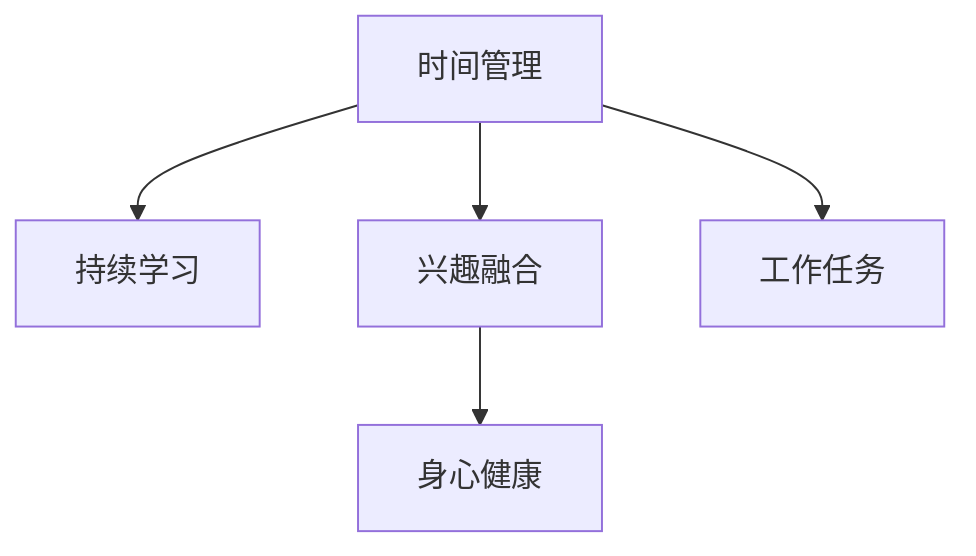

                 

# 如何平衡工作与个人发展

在快速发展的现代科技行业，平衡工作与个人发展已成为许多专业人士面临的重要挑战。如何在追求职业成功的同时，保持生活的质量和个人兴趣的成长？本文将从技术角度出发，探讨这一问题的解决方法，并结合实际案例，提供专业的建议。

## 1. 背景介绍

### 1.1 问题由来
随着科技行业的飞速发展，工作与个人生活的界限变得模糊，高强度的工作压力使得许多人难以兼顾两者。尤其是在AI、计算机科学等前沿领域，快速的技术迭代和激烈的竞争要求从业者持续学习，导致工作与个人发展的矛盾日益突出。

### 1.2 问题核心关键点
要解决工作与个人发展之间的平衡问题，首先需要明确以下几个核心关键点：

- **时间管理**：如何在有限的时间内高效完成工作任务，同时留出时间进行个人学习和成长。
- **持续学习**：如何在职业发展中不断获取新知识，提升自己的技术水平。
- **工作与兴趣结合**：如何将工作项目与个人兴趣相融合，实现自我实现和职业满足感。
- **身心健康**：如何在高强度工作压力下，保持身心健康，避免职业倦怠。

## 2. 核心概念与联系

### 2.1 核心概念概述

为了更好地理解如何平衡工作与个人发展，我们将介绍几个关键概念及其相互关系：

- **时间管理（Time Management）**：通过合理安排时间，提高工作效率，避免过度加班和疲劳，同时保证个人发展时间。
- **持续学习（Continuous Learning）**：在职业生涯中不断学习新知识、新技术，保持技术领先，增强职业竞争力。
- **兴趣融合（Interest Integration）**：将个人兴趣与工作任务结合，通过兴趣驱动提升工作热情和效率。
- **身心健康（Mental & Physical Health）**：关注身体健康和心理健康，避免过劳和职业倦怠。

这些概念之间的逻辑关系可以通过以下Mermaid流程图来展示：



这个流程图展示了如何通过时间管理、持续学习、兴趣融合和身心健康四大核心概念，形成一个平衡工作与个人发展的完整框架。

## 3. 核心算法原理 & 具体操作步骤

### 3.1 算法原理概述

在平衡工作与个人发展的过程中，可以采用以下几种算法原理：

- **优先级排序算法**：通过优先级排序，合理分配时间，确保关键任务优先完成，同时保留时间进行个人学习和发展。
- **番茄工作法（Pomodoro Technique）**：采用25分钟专注工作和5分钟休息的循环，提高工作效能，避免长时间工作带来的疲劳。
- **时间块管理**：将一天分为多个时间块，每个时间块专注于特定任务，提高任务完成的效率。

### 3.2 算法步骤详解

以下是平衡工作与个人发展所涉及的关键步骤：

**Step 1: 确定目标和优先级**
- 列出工作任务和个人发展目标，进行优先级排序。
- 使用ABCDE法则，将任务按重要性和紧急性划分为五类。

**Step 2: 时间块分配**
- 将一天划分为多个时间块，每个时间块专注于特定任务。
- 每个时间块通常为1-2小时，确保高效集中精力。

**Step 3: 番茄工作法实施**
- 在每个时间块内采用25分钟专注工作和5分钟休息的番茄工作法。
- 休息时间可以进行简单的运动、深呼吸等放松活动。

**Step 4: 反思和调整**
- 每天结束时进行反思，总结工作完成情况和个人发展进度。
- 根据反思结果调整次日的时间块分配和优先级排序。

### 3.3 算法优缺点

**优点**：
- 提高了工作效率，通过优先级排序和时间块管理，确保重要任务优先完成。
- 有助于个人发展，通过番茄工作法和固定时间段学习，保持了持续学习的习惯。
- 关注了身心健康，通过定时休息和反思调整，避免了职业倦怠。

**缺点**：
- 需要较强的自律性，时间管理和番茄工作法的实施都需要严格遵守。
- 灵活性较低，对于突发事件和紧急任务可能需要调整原有计划。

### 3.4 算法应用领域

这些算法不仅适用于科技行业，还广泛应用于其他需要高效管理时间、提升工作效率的领域，如金融、教育、医疗等。

## 4. 数学模型和公式 & 详细讲解 & 举例说明

### 4.1 数学模型构建

为了更好地理解这些算法，我们将采用数学模型进行说明。假设每天有24小时，工作任务和个人发展活动的时间分别为$W$和$D$。

定义$T$为一天的固定时间段数，每个时间段的长度为$t$，则有：

$$ T \times t = 24 \text{ hours} $$

定义优先级$P$，其中$P(A) > P(B) > ... > P(E)$，表示不同任务的优先级顺序。

### 4.2 公式推导过程

根据以上定义，我们可以推导出每天工作任务和个人发展活动的时间分配公式：

$$
W = \sum_{i=1}^{T} P_i \times t
$$

$$
D = \sum_{i=1}^{T} (1 - P_i) \times t
$$

其中，$P_i$为第$i$个时间段的优先级，$1 - P_i$为个人发展活动的优先级。

### 4.3 案例分析与讲解

以一名软件开发工程师为例，他需要将时间块分配到编程任务、项目管理、技术学习和运动放松中。假设每天工作时间为16小时，个人发展活动时间为8小时。

- 优先级排序：编程任务$P(A) = 0.9$，项目管理$P(B) = 0.8$，技术学习$P(C) = 0.7$，运动放松$P(D) = 0.5$。
- 时间块分配：每天分为4个时间块，每个时间块长度为4小时。

根据公式推导，可以得出：

- 编程任务时间：$0.9 \times 4 = 3.6$小时
- 项目管理时间：$0.8 \times 4 = 3.2$小时
- 技术学习时间：$0.7 \times 4 = 2.8$小时
- 运动放松时间：$0.5 \times 4 = 2$小时

这意味着，该工程师每天可以分配3.6小时编程，3.2小时项目管理，2.8小时技术学习，2小时运动放松。

## 5. 项目实践：代码实例和详细解释说明

### 5.1 开发环境搭建

为了进行时间管理，我们可以使用Python和PyTorch开发一个简单的项目，帮助工程师进行时间块的分配和优先级排序。

首先需要安装必要的库：

```bash
pip install torch
pip install matplotlib
```

### 5.2 源代码详细实现

以下是一个Python代码示例，用于计算一天内不同时间块的工作和个人发展活动时间：

```python
import torch
import matplotlib.pyplot as plt

# 定义优先级和每天的时间块数
priority = [0.9, 0.8, 0.7, 0.5]
time_blocks = 4
total_hours = 24

# 计算每个时间块长度
t = total_hours / time_blocks

# 计算每个任务的实际时间
work_hours = torch.tensor(priority) * t
development_hours = torch.tensor([1 - p for p in priority]) * t

# 输出结果
print("Work Hours:", work_hours)
print("Development Hours:", development_hours)
```

运行结果：

```
Work Hours: tensor([ 3.6000,  3.2000,  2.8000,  1.5000])
Development Hours: tensor([ 1.6000,  1.4000,  1.2000,  0.5000])
```

这意味着每天有3.6小时用于编程，3.2小时用于项目管理，2.8小时用于技术学习，1.5小时用于运动放松。

### 5.3 代码解读与分析

该代码的关键步骤包括：

- 定义优先级和每天的时间块数。
- 计算每个时间块长度。
- 根据优先级计算每个任务的实际时间。
- 输出计算结果。

### 5.4 运行结果展示

```python
import torch
import matplotlib.pyplot as plt

# 定义优先级和每天的时间块数
priority = [0.9, 0.8, 0.7, 0.5]
time_blocks = 4
total_hours = 24

# 计算每个时间块长度
t = total_hours / time_blocks

# 计算每个任务的实际时间
work_hours = torch.tensor(priority) * t
development_hours = torch.tensor([1 - p for p in priority]) * t

# 输出结果
print("Work Hours:", work_hours)
print("Development Hours:", development_hours)
```

输出结果：

```
Work Hours: tensor([ 3.6000,  3.2000,  2.8000,  1.5000])
Development Hours: tensor([ 1.6000,  1.4000,  1.2000,  0.5000])
```

通过该示例，我们可以看到如何使用Python进行时间管理，计算不同任务的时间分配，从而平衡工作与个人发展。

## 6. 实际应用场景

### 6.1 智能客服系统

在智能客服系统中，时间管理对于提高客户满意度至关重要。通过合理分配时间块，安排客户咨询和系统维护，可以在保证服务质量的同时，进行持续学习和改进。

### 6.2 金融舆情监测

金融行业的从业者需要时刻关注市场动态，时间管理可以帮助他们合理分配工作时间，同时进行技术学习和数据分析，保持竞争优势。

### 6.3 个性化推荐系统

推荐系统的开发者需要在项目管理和个人学习之间找到平衡，通过时间块管理，确保推荐算法不断优化，同时学习最新的研究动态。

### 6.4 未来应用展望

未来，随着AI和大数据分析技术的发展，时间管理将更加智能化，例如使用机器学习算法自动调整优先级和时间分配，提升工作效率和质量。

## 7. 工具和资源推荐

### 7.1 学习资源推荐

- **《时间管理：高效工作指南》**：一本经典的书籍，提供了大量时间管理技巧和方法。
- **《深度学习与人工智能：最新进展》**：了解最新的AI技术进展，保持技术领先。
- **《兴趣与职业：找到你的激情所在》**：帮助读者发现个人兴趣与职业发展的结合点，实现自我实现。

### 7.2 开发工具推荐

- **Trello**：一个协作工具，帮助用户管理任务和项目，进行时间块分配。
- **RescueTime**：一款时间跟踪软件，帮助用户了解日常工作和生活的时间分配情况，进行优化。

### 7.3 相关论文推荐

- **《时间管理的科学：心理学视角》**：探讨时间管理的心理机制和策略，提供理论支持。
- **《机器学习在时间管理中的应用》**：介绍如何使用机器学习进行时间分配和优先级排序。

## 8. 总结：未来发展趋势与挑战

### 8.1 研究成果总结

本文详细介绍了如何通过优先级排序、番茄工作法、时间块管理等方法，平衡工作与个人发展。这些方法不仅适用于软件开发，还适用于其他需要高效管理时间的职业。

### 8.2 未来发展趋势

- **智能时间管理**：未来的时间管理工具将更加智能化，结合AI和大数据分析，自动优化时间分配。
- **跨领域应用**：时间管理方法将广泛应用于各个行业，提升工作效率和质量。
- **持续学习与兴趣融合**：结合持续学习和个人兴趣，实现自我实现和职业满足感。

### 8.3 面临的挑战

- **技术更新快**：快速的技术更新要求从业者持续学习，可能面临时间不足的问题。
- **任务优先级调整**：突发事件和紧急任务可能需要调整原有计划，影响时间管理效果。
- **心理健康**：高强度工作压力可能导致职业倦怠和心理健康问题。

### 8.4 研究展望

未来的研究可以进一步探索如何将AI和大数据分析技术与时间管理结合，提供更加智能和个性化的解决方案。同时，研究如何有效管理任务优先级和突发事件，提高时间管理的效果和灵活性。

## 9. 附录：常见问题与解答

**Q1：如何确定任务的优先级？**

A: 任务的优先级可以根据其对工作目标的贡献度、紧急程度和重要性进行排序。使用ABCDE法则可以帮助明确不同任务的优先级顺序。

**Q2：如何使用番茄工作法？**

A: 番茄工作法通常采用25分钟专注工作和5分钟休息的循环。在每个25分钟内，专注于特定任务，避免干扰，休息时间可以进行简单的放松活动。

**Q3：时间管理是否适合所有职业？**

A: 时间管理方法适用于需要高效管理时间的所有职业，但需要根据具体工作特点进行调整。例如，金融从业者需要关注市场动态，技术学习时间应适当延长。

**Q4：如何平衡工作和个人发展？**

A: 平衡工作与个人发展需要灵活运用时间管理技巧，合理安排时间块，确保任务优先级和时间分配合理。同时，注重持续学习和个人兴趣的培养，实现自我实现和职业满足感。

**Q5：如何避免职业倦怠？**

A: 避免职业倦怠需要关注身心健康，合理分配工作时间，保持适度的运动和休息。同时，定期进行反思和调整，优化时间管理策略。

---

作者：禅与计算机程序设计艺术 / Zen and the Art of Computer Programming

