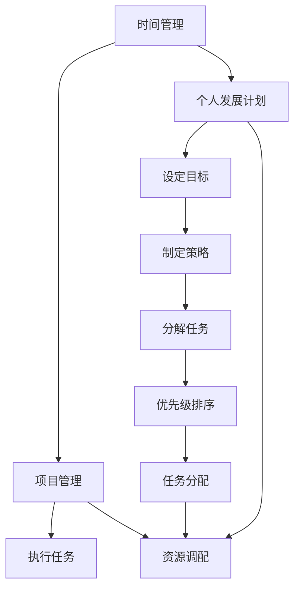

                 

# 如何建立个人的管理体系

## 1. 背景介绍

在信息化高速发展的今天，个人管理体系已经成为了许多成功人士的必修课。然而，由于缺乏系统的指导，很多人对于如何建立自己的管理体系仍然感到困惑。本文旨在提供一个系统、专业的管理体系构建指南，帮助读者建立自己的时间管理、项目管理和个人发展计划，从而提升效率、提高产出，实现职业和个人生活的平衡。

## 2. 核心概念与联系

### 2.1 核心概念概述

为了更好地理解个人管理体系的构建，我们先介绍几个关键概念：

- **时间管理**：通过合理规划和分配时间，实现个人和职业目标的达成。
- **项目管理**：通过系统化的方法和工具，管理和执行项目任务，确保项目按时按质完成。
- **个人发展计划**：基于个人兴趣、技能和职业目标，制定并实施长期发展的战略规划。

这些概念相互联系，共同构成了个人管理体系的核心框架。时间管理是项目管理的基础，项目管理是个人发展计划的执行手段，而个人发展计划又为时间管理和项目管理提供方向和动力。

### 2.2 核心概念原理和架构的 Mermaid 流程图

## 3. 核心算法原理 & 具体操作步骤

### 3.1 算法原理概述

个人管理体系的构建，本质上是一个优化过程。通过系统化的方法和工具，对个人的时间和资源进行高效管理，实现个人目标的最大化。

该过程的目标是最大化个人的生产力和满意度，遵循以下几个原则：

- **目标明确**：明确个人和职业目标，并分解为可执行的任务。
- **时间优化**：通过合理的时间分配和任务调度，提高效率。
- **资源高效**：合理调配项目所需的人力、物力、财力等资源，确保项目顺利进行。
- **持续改进**：定期回顾和调整个人管理体系，不断优化提升。

### 3.2 算法步骤详解

#### 3.2.1 目标设定

首先，明确个人和职业的长期目标，并分解为短期和中期目标。可以使用SMART原则（Specific, Measurable, Achievable, Relevant, Time-bound）来设定目标，确保目标的具体性、可测量性、可实现性、相关性和时限性。

#### 3.2.2 时间规划

根据目标设定，制定详细的时间规划。可以使用甘特图、日历、时间线等工具进行可视化，明确每个任务的时间节点和负责人。同时，可以使用番茄工作法、时间块等技巧，提高时间利用效率。

#### 3.2.3 任务管理

针对每个任务，进行详细的分解和优先级排序。可以使用任务管理工具，如Trello、Asana、Todoist等，实时跟踪任务进度，并进行动态调整。

#### 3.2.4 项目执行

根据任务管理的结果，进行项目执行。可以通过定期会议、进度报告等方式，确保项目按时按质完成。同时，可以使用敏捷开发、Scrum等方法，进行持续集成和迭代改进。

#### 3.2.5 反馈与改进

定期回顾和总结项目管理过程，收集反馈意见，进行改进。可以通过KPI（关键绩效指标）、SWOT分析等方法，评估项目的效果，并制定改进措施。

### 3.3 算法优缺点

#### 3.3.1 优点

- **系统性**：通过系统化的方法和工具，提高个人管理的效率和效果。
- **灵活性**：可以根据实际情况进行调整和优化，适应不断变化的环境。
- **可操作性**：方法和工具简单易行，容易上手，适合不同层次和背景的人。

#### 3.3.2 缺点

- **依赖工具**：需要依赖各种工具和平台，增加了学习的难度和成本。
- **复杂性**：方法和工具较为复杂，需要一定的学习和实践成本。
- **人机协作**：需要团队协作和个人自律，对团队管理要求较高。

### 3.4 算法应用领域

个人管理体系不仅适用于个人职业发展，也广泛应用于企业项目管理、项目运营、人力资源管理等领域。在企业中，通过对个人管理体系的引入，可以实现更高的项目效率和员工满意度，推动企业持续发展。

## 4. 数学模型和公式 & 详细讲解 & 举例说明

### 4.1 数学模型构建

个人管理体系的数学模型可以表示为：

$$ P = T * (C + M + P_{\text{optimization}}) $$

其中：
- $P$ 表示个人生产力，
- $T$ 表示时间规划，
- $C$ 表示任务管理，
- $M$ 表示项目管理，
- $P_{\text{optimization}}$ 表示持续改进。

### 4.2 公式推导过程

1. **目标设定**：使用SMART原则，设定具体、可测量、可实现、相关、时限的目标。
2. **时间规划**：根据目标，制定详细的时间规划，并进行可视化。
3. **任务管理**：将任务分解为小步骤，进行优先级排序，使用任务管理工具跟踪进度。
4. **项目执行**：根据任务管理的结果，进行项目执行，确保按时按质完成。
5. **反馈与改进**：定期回顾和总结项目管理过程，收集反馈意见，进行改进。

### 4.3 案例分析与讲解

以软件开发项目为例：

1. **目标设定**：项目目标是完成一款手机应用，并上线发布。
2. **时间规划**：将项目分为需求分析、设计、开发、测试、上线等阶段，每个阶段设定具体时间节点。
3. **任务管理**：将每个阶段任务分解为小步骤，如需求分析中的用户调研、需求文档编写等，并进行优先级排序。
4. **项目执行**：按照时间规划和任务管理的结果，进行任务分配和执行。
5. **反馈与改进**：每周进行项目回顾，收集团队反馈，调整任务分配和资源调配。

## 5. 项目实践：代码实例和详细解释说明

### 5.1 开发环境搭建

1. **安装项目管理工具**：选择一款适合自己的项目管理工具，如Trello、Asana、JIRA等。
2. **配置时间规划工具**：安装和配置日历工具，如Google Calendar、Microsoft Outlook等。
3. **学习编程语言和框架**：选择合适的编程语言和开发框架，如Python、JavaScript、Vue等。
4. **安装IDE和版本控制工具**：安装和配置IDE（如Visual Studio Code、IntelliJ IDEA等）和版本控制工具（如Git、SVN等）。

### 5.2 源代码详细实现

以Trello为例，创建一个新的项目管理板，进行项目任务的管理和跟踪：

1. **创建项目板**：在Trello上创建一个新的项目板，并命名。
2. **添加任务卡片**：在项目板中添加任务卡片，并设置任务标题、描述、负责人等属性。
3. **设置任务优先级**：根据任务的重要性和紧急程度，设置任务的优先级，如高、中、低。
4. **分配任务负责人**：为每个任务分配负责人，并设置截止时间。
5. **跟踪任务进度**：使用Trello的进度跟踪功能，实时查看任务进度，并进行动态调整。

### 5.3 代码解读与分析

在Trello中，任务卡片是一个基本单位。每个卡片包含任务的信息和进度，可以方便地进行管理和跟踪。任务卡片可以包含以下属性：

- **任务标题**：简明扼要地描述任务。
- **任务描述**：详细说明任务的具体要求和目标。
- **负责人**：指定任务的责任人。
- **截止时间**：设置任务的完成期限。
- **状态**：表示任务当前的状态，如进行中、已完成、待开始等。

使用Trello进行项目管理，可以实现以下优势：

- **可视化**：任务卡片和进度条直观展示任务进度，便于跟踪和管理。
- **协作性**：团队成员可以实时查看和编辑任务卡片，提高协作效率。
- **灵活性**：可以根据实际情况进行调整和优化，适应不同项目需求。

### 5.4 运行结果展示

下图为Trello任务板的示例，展示了项目任务的管理和跟踪过程：

## 6. 实际应用场景

### 6.1 软件开发

在软件开发项目中，使用个人管理体系可以提高项目效率和团队协作能力。通过设定目标、时间规划、任务管理和项目执行，可以确保项目按时按质完成。同时，通过持续改进和反馈机制，可以不断优化项目过程，提高团队的生产力和满意度。

### 6.2 项目管理

在项目管理中，使用个人管理体系可以实现项目的系统化管理。通过明确目标、制定时间规划、任务分解和优先级排序，可以确保项目顺利进行。同时，通过项目管理工具和持续改进机制，可以提高项目执行效果和团队协作水平。

### 6.3 教育培训

在教育培训中，使用个人管理体系可以提高学习效率和成果。通过设定学习目标、时间规划、任务管理和反馈改进，可以确保学习任务按时完成。同时，通过持续改进和反馈机制，可以不断优化学习方法，提高学习效果和满意度。

### 6.4 未来应用展望

随着人工智能和大数据技术的不断发展，个人管理体系将进一步提升其智能化和自动化水平。例如，使用智能助理进行时间规划和任务管理，使用数据分析工具进行项目绩效评估和改进等。同时，随着物联网和协作工具的发展，个人管理体系将更加便捷和高效，为个人和企业带来更高的生产力和满意度。

## 7. 工具和资源推荐

### 7.1 学习资源推荐

- **《高效能人士的七个习惯》**：史蒂芬·柯维的经典著作，介绍了时间管理、任务管理和个人发展的系统方法。
- **《项目管理知识体系指南》(PMBOK)**：项目管理领域的权威指南，介绍了项目管理的方法和工具。
- **Coursera和Udacity**：在线学习平台，提供系统化的时间管理和项目管理课程。
- **《深度学习》**：Ian Goodfellow的经典著作，介绍了深度学习的基本原理和应用，适合技术背景的读者。

### 7.2 开发工具推荐

- **Trello**：简单易用的项目管理工具，适合个人和团队使用。
- **JIRA**：功能强大的项目管理工具，适合大中型企业使用。
- **Asana**：灵活的任务管理工具，支持各种自定义功能。
- **Google Calendar**：功能全面的日历工具，支持时间规划和提醒功能。

### 7.3 相关论文推荐

- **《项目管理的九项原则》**：Henri Fayol的经典著作，介绍了项目管理的基本原则和方法。
- **《敏捷软件开发：原则、模式与实践》**：Robert C. Martin的著作，介绍了敏捷开发的基本原理和实践方法。
- **《团队协作工具在项目管理中的应用》**：相关论文和研究，探讨了各种团队协作工具在项目管理中的应用效果。

## 8. 总结：未来发展趋势与挑战

### 8.1 研究成果总结

个人管理体系的研究和实践，已经取得了显著的成果。通过系统化的方法和工具，个人和团队可以实现更高的生产力和满意度。未来，随着技术的不断进步和应用的广泛推广，个人管理体系将进一步优化和提升。

### 8.2 未来发展趋势

1. **智能化和自动化**：随着人工智能和大数据技术的发展，个人管理体系将进一步智能化和自动化，提高效率和效果。
2. **协作化和社会化**：未来的个人管理体系将更加协作化和社会化，通过社交媒体和协作工具，实现更加高效的人机协作。
3. **跨领域融合**：未来的个人管理体系将与其他领域的技术和管理方法进行融合，实现更加全面和综合的管理效果。

### 8.3 面临的挑战

1. **工具和平台的选择**：选择适合自己的工具和平台，需要一定的学习和实践成本。
2. **系统的集成和协同**：不同工具和平台的集成和协同，需要较高的技术和管理能力。
3. **团队协作和沟通**：团队协作和沟通需要良好的组织和管理能力，容易出现沟通不畅和协作效率低下的问题。

### 8.4 研究展望

未来的研究将重点关注以下几个方面：

1. **跨领域融合**：将个人管理体系与其他领域的技术和管理方法进行融合，实现更加全面和综合的管理效果。
2. **智能化和自动化**：使用人工智能和大数据技术，实现个人管理体系的智能化和自动化，提高效率和效果。
3. **协作化和社会化**：通过社交媒体和协作工具，实现更加高效的人机协作和社会化管理。

## 9. 附录：常见问题与解答

**Q1：个人管理体系的构建需要多长时间？**

A: 个人管理体系的构建需要一定的学习和实践成本，根据个人情况和项目复杂度，可能需要1-3个月的时间。但一旦建立，可以在长期内不断优化和提升，持续提高个人和团队的生产力。

**Q2：如何选择合适的项目管理工具？**

A: 选择合适的项目管理工具需要考虑以下因素：
- **功能需求**：根据自己的项目管理需求，选择功能适合的工具，如任务管理、进度跟踪、协作功能等。
- **使用习惯**：选择自己熟悉和习惯的工具，可以提高使用效率和效果。
- **团队规模**：根据团队规模，选择适合的工具，如小型团队可以使用Trello，大中型企业可以使用JIRA。

**Q3：个人管理体系的构建需要哪些软件工具？**

A: 个人管理体系的构建需要以下软件工具：
- **项目管理工具**：如Trello、Asana、JIRA等。
- **时间规划工具**：如Google Calendar、Microsoft Outlook等。
- **开发环境工具**：如Visual Studio Code、IntelliJ IDEA等。
- **版本控制工具**：如Git、SVN等。

**Q4：如何制定个人发展计划？**

A: 制定个人发展计划需要以下步骤：
- **明确兴趣和技能**：分析自己的兴趣和技能，确定职业发展方向。
- **设定长期目标**：基于兴趣和技能，设定长期职业目标，如成为技术专家、项目经理等。
- **分解为短期目标**：将长期目标分解为短期和中期目标，制定详细的时间规划和执行方案。
- **持续学习和提升**：定期回顾和调整个人发展计划，不断学习和提升技能，实现职业目标。

**Q5：如何提高个人和团队的协作效率？**

A: 提高个人和团队的协作效率需要以下措施：
- **明确任务和责任**：明确每个任务的负责人、目标和截止时间，避免任务重叠和责任不清。
- **建立沟通渠道**：建立有效的沟通渠道，如每周会议、即时通讯工具等，保持团队成员之间的信息流畅。
- **使用协作工具**：使用协作工具，如Trello、Asana、Slack等，实时跟踪任务进度和团队协作状态。
- **持续改进和反馈**：定期回顾和总结协作过程，收集反馈意见，进行改进和优化。

本文旨在提供一个系统、专业的个人管理体系构建指南，帮助读者建立自己的时间管理、项目管理和个人发展计划，从而提升效率、提高产出，实现职业和个人生活的平衡。希望通过本文的分享，能够帮助更多读者在职业和生活中实现成功和幸福。

作者：禅与计算机程序设计艺术 / Zen and the Art of Computer Programming

