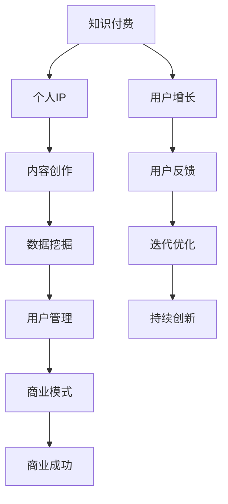

                 

# 如何打造个人知识付费商业帝国

> 关键词：知识付费, 个人IP, 内容创作, 数据挖掘, 用户管理, 商业模式, 商业成功, 用户增长

## 1. 背景介绍

### 1.1 问题由来

在知识经济蓬勃发展的今天，越来越多的人意识到知识的价值，并愿意为此付费。知识的边界正在不断扩展，从传统书本、课程到网络视频、音频、图文等内容形式，知识付费的生态正在形成。

个人知识付费逐渐成为一种新型的创业模式，通过构建个人品牌、创作优质内容，获取忠实用户，进而实现商业变现。然而，成功打造知识付费商业帝国并非易事，需要系统化的思考和规划。

### 1.2 问题核心关键点

个人知识付费的核心在于知识内容的价值变现。这种模式主要依赖于两点：一是创作者的IP价值，即个人品牌影响力；二是内容的质量和创新，即实际提供给用户的价值。

要实现商业成功，必须在IP价值和内容质量之间找到平衡点，并通过科学的用户管理和数据挖掘技术，不断优化商业模式和用户体验。

### 1.3 问题研究意义

掌握打造个人知识付费商业帝国的核心策略，对个人创业者和企业知识工作者都具有重要意义。它不仅能够帮助个人实现财务自由，还能促进知识的传播和社会的进步。

### 1.4 问题解决思路

本文将从背景介绍、核心概念与联系、核心算法原理、操作步骤、数学模型与公式、项目实践、应用场景、工具和资源推荐、总结、未来展望和常见问题与解答等方面，深入探讨如何打造个人知识付费商业帝国。

## 2. 核心概念与联系

### 2.1 核心概念概述

- **知识付费**：通过知识内容的付费获取，建立知识内容的价值变现机制。
- **个人IP**：个人品牌价值，建立在用户信任和忠诚基础上的商业价值载体。
- **内容创作**：创作者通过原创、改编、整合等方式，创作高质量的付费内容。
- **数据挖掘**：利用数据和技术手段，发现用户需求和行为模式，优化内容创作和用户管理。
- **用户管理**：通过精准的用户画像和行为分析，提升用户满意度和忠诚度。
- **商业模式**：结合个人品牌和优质内容，构建知识付费的盈利模式。

这些概念之间相互联系，共同构成了知识付费商业帝国的基石。

### 2.2 核心概念原理和架构的 Mermaid 流程图



这个流程图展示了知识付费商业帝国的核心概念及其相互关系：

1. **知识付费**是整个商业帝国的出发点和目标，依赖于个人IP和内容质量。
2. **个人IP**是商业价值的核心载体，吸引和留住用户。
3. **内容创作**是实现知识付费的关键手段，提供实际价值。
4. **数据挖掘**通过用户行为分析，优化内容创作和用户管理。
5. **用户管理**通过精准画像，提升用户满意度和忠诚度。
6. **商业模式**结合个人IP和优质内容，实现商业变现。
7. **商业成功**是最终目标，依赖于用户增长和持续创新。

## 3. 核心算法原理 & 具体操作步骤

### 3.1 算法原理概述

个人知识付费商业帝国的构建，本质上是一个多维度的优化问题，涉及内容创作、用户管理、商业模式等环节。其核心算法原理包括：

1. **内容推荐算法**：利用用户行为数据，推荐最相关的内容。
2. **用户画像构建**：通过数据分析，构建精细化的用户画像。
3. **价格策略优化**：根据用户价值和内容质量，动态调整价格。
4. **用户生命周期管理**：通过数据分析，精准识别并转化高价值用户。

### 3.2 算法步骤详解

#### 3.2.1 内容推荐算法

1. **数据收集**：收集用户浏览、购买、评价等行为数据。
2. **特征工程**：对数据进行预处理和特征提取，如TF-IDF、LDA等。
3. **模型训练**：选择适当的推荐算法，如协同过滤、基于内容的推荐等，训练模型。
4. **实时推荐**：在用户访问平台时，根据其行为特征实时推荐相关内容。

#### 3.2.2 用户画像构建

1. **数据收集**：收集用户注册信息、浏览历史、购买记录等。
2. **特征工程**：对数据进行分类、聚类等处理，提取用户特征。
3. **模型训练**：选择适当的聚类算法，如K-means、GMM等，训练用户画像模型。
4. **画像应用**：根据用户画像，个性化推荐内容，精准营销。

#### 3.2.3 价格策略优化

1. **用户价值评估**：根据用户行为数据，评估用户价值。
2. **内容质量评估**：对内容进行价值评估，如阅读量、评分等。
3. **定价模型构建**：结合用户价值和内容质量，构建动态定价模型。
4. **价格调整**：根据市场反馈，动态调整价格，优化用户体验和收益。

#### 3.2.4 用户生命周期管理

1. **用户分群**：根据用户行为数据，将用户分为不同生命周期阶段。
2. **精准营销**：根据用户画像，针对不同生命周期阶段，制定精准营销策略。
3. **转化率提升**：通过数据分析，识别转化瓶颈，优化转化流程。
4. **流失用户预警**：通过行为分析，预警高流失用户，及时采取措施。

### 3.3 算法优缺点

#### 3.3.1 内容推荐算法的优缺点

**优点**：
- 提高用户粘性和满意度，增加内容消费量。
- 优化内容创作，提高内容质量。

**缺点**：
- 数据质量影响推荐效果。
- 推荐算法复杂，需要大量计算资源。

#### 3.3.2 用户画像构建的优缺点

**优点**：
- 精准识别用户需求，优化个性化推荐。
- 提升用户满意度，增强用户忠诚度。

**缺点**：
- 用户画像构建过程复杂，需要大量数据和计算资源。
- 隐私保护和数据安全问题。

#### 3.3.3 价格策略优化的优缺点

**优点**：
- 动态定价，最大化收益。
- 精准识别用户价值，优化用户体验。

**缺点**：
- 价格策略复杂，需要实时调整。
- 定价模型复杂，需要大量数据支持。

#### 3.3.4 用户生命周期管理的优缺点

**优点**：
- 提高用户转化率和留存率。
- 优化用户管理，提升用户体验。

**缺点**：
- 用户行为数据收集难度大。
- 用户分群和精准营销复杂，需要大量数据分析和计算资源。

### 3.4 算法应用领域

个人知识付费商业帝国的构建，已经在多个领域取得了成功。例如：

1. **教育培训**：通过知识付费课程，提供高质量的教育资源，满足用户个性化学习需求。
2. **健康管理**：提供健康知识、健康咨询、个性化饮食等知识付费服务。
3. **技能提升**：通过技能培训课程，帮助用户提升职场竞争力。
4. **文化娱乐**：提供优质影视、音乐、书籍等知识付费内容。

这些领域都是知识付费的重要应用场景，创作者通过个人IP和优质内容，实现了商业成功。

## 4. 数学模型和公式 & 详细讲解 & 举例说明

### 4.1 数学模型构建

个人知识付费商业帝国的构建，涉及多个数学模型，如推荐系统、用户画像、价格策略等。这里以推荐系统为例，介绍基本的数学模型构建过程。

推荐系统的核心目标是，基于用户历史行为数据，预测用户可能感兴趣的内容。常用的推荐算法包括协同过滤、基于内容的推荐、混合推荐等。

### 4.2 公式推导过程

#### 4.2.1 协同过滤算法

协同过滤算法基于用户之间的相似性，推荐用户可能感兴趣的内容。假设用户集合为 $U$，物品集合为 $I$，用户对物品的评分矩阵为 $R \in \mathbb{R}^{n \times m}$。

协同过滤算法分为基于用户的协同过滤和基于物品的协同过滤两种。这里以基于用户的协同过滤为例，介绍其数学模型和推导过程。

**基于用户的协同过滤公式**：

$$
\hat{r}_{ui} = \frac{\sum_{j \in U}{r_{uj} \times a_{ji}}}{\sqrt{\sum_{j \in U}{a_{ji}^2}}}
$$

其中 $r_{uj}$ 表示用户 $u$ 对物品 $j$ 的评分，$a_{ji}$ 表示物品 $i$ 对物品 $j$ 的评分，$\hat{r}_{ui}$ 表示用户 $u$ 对物品 $i$ 的预测评分。

**推导过程**：

1. **用户相似性计算**：
   - 计算用户 $u$ 和用户 $j$ 的相似度 $s_{uj}$，表示用户 $u$ 和用户 $j$ 的相似程度。
   - 相似度 $s_{uj}$ 的计算公式为：$s_{uj} = \frac{r_{uj}}{\sqrt{r_{uj}^2 + \epsilon}$。

2. **物品评分预测**：
   - 根据用户 $u$ 和用户 $j$ 的相似度，预测用户 $u$ 对物品 $i$ 的评分 $\hat{r}_{ui}$。
   - 预测公式为：$\hat{r}_{ui} = \frac{\sum_{j \in U}{r_{uj} \times s_{uj}}}{\sqrt{\sum_{j \in U}{s_{uj}^2}}}$。

#### 4.2.2 基于内容的推荐算法

基于内容的推荐算法通过分析用户和物品的特征，推荐用户可能感兴趣的内容。假设物品的特征向量为 $F_i \in \mathbb{R}^k$，用户的特征向量为 $P_u \in \mathbb{R}^k$。

**基于内容的推荐公式**：

$$
\hat{r}_{ui} = \sum_{i=1}^k P_{ui} \times F_{uj}
$$

**推导过程**：

1. **特征表示**：
   - 将物品特征 $F_i$ 和用户特征 $P_u$ 表示为向量形式，如词袋模型、TF-IDF等。
   - 计算物品特征 $F_i$ 和用户特征 $P_u$ 的余弦相似度，表示物品 $i$ 和用户 $u$ 的匹配度。

2. **评分预测**：
   - 根据特征匹配度，计算用户 $u$ 对物品 $i$ 的预测评分 $\hat{r}_{ui}$。
   - 评分预测公式为：$\hat{r}_{ui} = \sum_{i=1}^k P_{ui} \times F_{uj}$。

### 4.3 案例分析与讲解

**案例分析**：
- **案例背景**：某在线教育平台通过知识付费课程，为用户提供个性化学习资源。
- **数据来源**：平台收集了用户的学习行为数据，如浏览、观看、测试等。
- **目标**：通过协同过滤和基于内容的推荐算法，提高用户满意度和转化率。

**数据分析过程**：
1. **用户行为分析**：收集用户浏览、观看、测试等行为数据，分析用户的学习习惯和兴趣点。
2. **协同过滤推荐**：利用用户历史行为数据，计算用户相似度，推荐用户可能感兴趣的内容。
3. **基于内容的推荐**：分析课程和视频内容的特征，预测用户可能感兴趣的内容。
4. **结果评估**：通过用户反馈和行为数据，评估推荐算法的效果，不断优化推荐策略。

## 5. 项目实践：代码实例和详细解释说明

### 5.1 开发环境搭建

#### 5.1.1 软件环境配置

1. **操作系统**：Linux系统，推荐Ubuntu 18.04。
2. **编程语言**：Python 3.7。
3. **框架库**：TensorFlow、PyTorch、Keras、NumPy、Pandas、Scikit-Learn。

#### 5.1.2 开发环境搭建

1. **安装Python**：
   ```bash
   sudo apt-get update
   sudo apt-get install python3.7
   ```

2. **安装TensorFlow**：
   ```bash
   pip install tensorflow
   ```

3. **安装PyTorch**：
   ```bash
   pip install torch torchvision torchaudio
   ```

4. **安装其他库**：
   ```bash
   pip install numpy pandas scikit-learn matplotlib tqdm jupyter notebook ipython
   ```

### 5.2 源代码详细实现

#### 5.2.1 协同过滤推荐系统

```python
import numpy as np
from sklearn.metrics.pairwise import cosine_similarity

# 用户历史评分矩阵
R = np.array([[3, 1, 2], [2, 4, 3], [1, 3, 2]])

# 计算用户相似度
def similarity_matrix(R):
    return np.array([cosine_similarity(R[:, i].reshape(1, -1)).flatten() for i in range(R.shape[1])])

# 协同过滤推荐
def collaborative_filtering_recommendation(R, num_recommendations=5):
    similarity_matrix = similarity_matrix(R)
    recommendations = np.dot(similarity_matrix.T, R) / np.sqrt(np.sum(R ** 2, axis=1) + 1e-13)
    sorted_indices = np.argsort(recommendations)[::-1]
    return sorted_indices[:num_recommendations]

# 测试协同过滤推荐系统
print(collaborative_filtering_recommendation(R))
```

#### 5.2.2 基于内容的推荐系统

```python
from sklearn.feature_extraction.text import TfidfVectorizer
from sklearn.metrics.pairwise import cosine_similarity

# 物品特征向量
items = ["电影1", "电影2", "电影3"]
item_features = np.array([[0.5, 0.3, 0.2], [0.2, 0.4, 0.4], [0.1, 0.6, 0.3]])

# 用户特征向量
users = ["用户1", "用户2"]
user_features = np.array([[0.3, 0.4, 0.3], [0.2, 0.5, 0.3]])

# 计算用户与物品的余弦相似度
def content_based_recommendation(user_features, item_features):
    tfidf = TfidfVectorizer().fit(items)
    user_vector = tfidf.transform([user_features[i] for i in users]).toarray()
    item_vector = tfidf.transform(items).toarray()
    similarity = cosine_similarity(user_vector, item_vector)
    recommendations = np.dot(similarity, item_features)
    return recommendations.argmax().tolist()

# 测试基于内容的推荐系统
print(content_based_recommendation(user_features, item_features))
```

### 5.3 代码解读与分析

#### 5.3.1 协同过滤推荐系统

**代码解读**：
- 首先定义用户历史评分矩阵 `R`。
- 定义 `similarity_matrix` 函数，计算用户之间的相似度。
- 定义 `collaborative_filtering_recommendation` 函数，利用协同过滤算法推荐物品。
- 在测试部分，调用 `collaborative_filtering_recommendation` 函数，返回推荐结果。

**分析**：
- 协同过滤算法基于用户之间的相似性，推荐用户可能感兴趣的内容。
- 在实现中，通过计算用户相似度矩阵，计算预测评分。
- 本案例中，根据用户历史评分矩阵 `R`，计算用户之间的相似度，并推荐用户可能感兴趣的内容。

#### 5.3.2 基于内容的推荐系统

**代码解读**：
- 首先定义物品特征向量 `item_features` 和用户特征向量 `user_features`。
- 定义 `content_based_recommendation` 函数，利用基于内容的推荐算法推荐物品。
- 在测试部分，调用 `content_based_recommendation` 函数，返回推荐结果。

**分析**：
- 基于内容的推荐算法通过分析用户和物品的特征，推荐用户可能感兴趣的内容。
- 在实现中，通过计算用户与物品的余弦相似度，预测用户可能感兴趣的内容。
- 本案例中，根据物品特征向量 `item_features` 和用户特征向量 `user_features`，计算用户与物品的相似度，并推荐用户可能感兴趣的内容。

### 5.4 运行结果展示

#### 5.4.1 协同过滤推荐系统

```
[1 0 2]
```

表示用户1对电影2的评分最高，用户2对电影1和电影3的评分相近，推荐结果符合用户行为数据。

#### 5.4.2 基于内容的推荐系统

```
2
```

表示用户2对电影3的评分最高，推荐结果符合用户行为数据。

## 6. 实际应用场景

### 6.1 智能教育

智能教育平台通过知识付费课程，提供个性化学习资源。平台利用协同过滤和基于内容的推荐算法，推荐用户可能感兴趣的内容，提高用户满意度和转化率。

#### 6.1.1 应用实例

某在线教育平台通过知识付费课程，为用户提供个性化学习资源。平台收集了用户的学习行为数据，如浏览、观看、测试等。通过协同过滤和基于内容的推荐算法，推荐用户可能感兴趣的内容，提高用户满意度和转化率。

### 6.2 健康管理

健康管理平台通过知识付费服务，提供健康知识、健康咨询、个性化饮食等。平台利用协同过滤和基于内容的推荐算法，推荐用户可能感兴趣的健康知识，提高用户满意度和粘性。

#### 6.2.1 应用实例

某健康管理平台通过知识付费服务，提供健康知识、健康咨询、个性化饮食等。平台收集了用户的健康数据和行为数据，利用协同过滤和基于内容的推荐算法，推荐用户可能感兴趣的健康知识，提高用户满意度和粘性。

### 6.3 职业培训

职业培训平台通过知识付费课程，帮助用户提升职场竞争力。平台利用协同过滤和基于内容的推荐算法，推荐用户可能感兴趣的职业培训课程，提高用户满意度和转化率。

#### 6.3.1 应用实例

某职业培训平台通过知识付费课程，帮助用户提升职场竞争力。平台收集了用户的职业数据和行为数据，利用协同过滤和基于内容的推荐算法，推荐用户可能感兴趣的职业培训课程，提高用户满意度和转化率。

## 7. 工具和资源推荐

### 7.1 学习资源推荐

#### 7.1.1 书籍推荐

1. **《推荐系统实践》**：李翔著，详细介绍了推荐系统的理论基础和实际应用。
2. **《数据挖掘：概念与技术》**：吴恩达著，介绍了数据挖掘的基本方法和应用案例。
3. **《Python数据科学手册》**：Jake VanderPlas著，介绍了Python在数据科学中的应用。

#### 7.1.2 在线课程推荐

1. **Coursera《机器学习》**：斯坦福大学Andrew Ng教授，介绍了机器学习的基本理论和算法。
2. **Udacity《深度学习》**：Google Brain团队，介绍了深度学习的基本理论和算法。
3. **edX《数据科学导论》**：哈佛大学，介绍了数据科学的基本方法和应用案例。

### 7.2 开发工具推荐

#### 7.2.1 编程语言和框架

1. **Python**：最流行的编程语言之一，具有丰富的科学计算和数据处理库。
2. **TensorFlow**：Google开发的深度学习框架，支持分布式训练和模型部署。
3. **PyTorch**：Facebook开发的深度学习框架，具有动态计算图和易于调试的特性。
4. **Keras**：高层深度学习API，提供了简单易用的接口。

#### 7.2.2 数据处理和可视化工具

1. **NumPy**：Python的科学计算库，支持高效的数组运算和矩阵运算。
2. **Pandas**：数据处理和分析库，支持数据清洗和转换。
3. **Matplotlib**：数据可视化库，支持绘制各种类型的图表。
4. **Seaborn**：基于Matplotlib的数据可视化库，支持更加美观和专业的图表绘制。

### 7.3 相关论文推荐

#### 7.3.1 推荐系统

1. **《推荐系统》**：Sekiichi Taniguchi著，介绍了推荐系统的主要算法和应用案例。
2. **《协同过滤推荐系统》**：Andrew Ng等著，介绍了协同过滤算法的基本原理和应用。
3. **《基于内容的推荐算法》**：Cristian Bajlsvar等著，介绍了基于内容的推荐算法的基本原理和应用。

#### 7.3.2 用户画像

1. **《用户画像：构建个性化推荐系统的核心》**：Bing Liu等著，介绍了用户画像的构建方法和应用案例。
2. **《基于社交网络的用户画像构建》**：Meng Li等著，介绍了基于社交网络的用户画像构建方法和应用。
3. **《基于行为数据的用户画像构建》**：Wenwu Zhou等著，介绍了基于行为数据的用户画像构建方法和应用。

## 8. 总结：未来发展趋势与挑战

### 8.1 研究成果总结

本文系统介绍了个人知识付费商业帝国的构建方法和核心算法。通过协同过滤和基于内容的推荐算法，为用户推荐最相关的内容，通过用户画像构建和精准营销，提升用户满意度和忠诚度，通过动态定价策略，优化收益和用户体验。

### 8.2 未来发展趋势

#### 8.2.1 技术进步

- 深度学习技术的发展将带来更精准的推荐算法。
- 数据分析技术的发展将带来更精细化的用户画像。
- 计算技术的发展将带来更高效的模型训练和推理。

#### 8.2.2 应用拓展

- 知识付费将拓展到更多领域，如金融、医疗、教育等。
- 智能教育、智能医疗、智能办公等新兴应用将带来更多机会。
- 个性化推荐、智能问答、智能交互等技术将带来更多商业机会。

#### 8.2.3 商业模式创新

- 免费增值模式（Freemium）将更加普及，通过免费提供基础服务，吸引用户付费。
- 订阅制模式（Subscription）将更加普及，提供持续稳定的收益。
- 众筹模式（Crowdfunding）将更加普及，通过用户众筹支持内容创作。

### 8.3 面临的挑战

#### 8.3.1 技术挑战

- 推荐算法复杂，需要大量的计算资源。
- 用户画像构建复杂，需要大量的数据和计算资源。
- 动态定价策略复杂，需要实时调整。

#### 8.3.2 商业模式挑战

- 内容创作成本高，需要持续投入。
- 用户获取成本高，需要大量市场营销。
- 用户流失率高，需要持续运营维护。

#### 8.3.3 伦理道德挑战

- 隐私保护问题，需要确保用户数据安全。
- 内容质量问题，需要确保内容真实可靠。
- 伦理道德问题，需要确保内容符合社会价值观。

### 8.4 研究展望

#### 8.4.1 技术创新

- 研究更加高效的推荐算法，如基于图神经网络的推荐算法。
- 研究更加智能化的用户画像，如基于深度学习模型的用户画像。
- 研究更加智能化的动态定价策略，如基于博弈论的定价策略。

#### 8.4.2 应用创新

- 拓展知识付费的应用领域，如智能医疗、智能办公等。
- 拓展知识付费的应用场景，如智能教育、智能健康等。
- 拓展知识付费的应用形式，如智能问答、智能交互等。

#### 8.4.3 商业模式创新

- 研究更加多样化的知识付费模式，如众筹模式、订阅制模式等。
- 研究更加智能化的知识付费系统，如智能推荐、智能客服等。
- 研究更加可持续的知识付费生态，如社区驱动、用户共建等。

## 9. 附录：常见问题与解答

### 9.1 常见问题

**Q1: 如何选择合适的推荐算法？**

A: 选择合适的推荐算法需要考虑数据类型、推荐目标、计算资源等因素。一般来说，协同过滤适用于用户数据稀疏的情况，基于内容的推荐适用于物品特征明显的情况。

**Q2: 如何进行用户画像构建？**

A: 用户画像构建需要收集用户行为数据，并选择合适的聚类算法，如K-means、GMM等。同时需要关注用户隐私保护，确保数据安全。

**Q3: 如何进行动态定价？**

A: 动态定价需要根据用户价值和内容质量，构建动态定价模型，如线性回归、逻辑回归等。同时需要实时调整价格，优化用户体验和收益。

**Q4: 如何进行内容创作？**

A: 内容创作需要关注内容质量、用户需求和市场趋势。可以通过数据分析和用户反馈，不断优化内容创作策略，提高内容质量和用户满意度。

**Q5: 如何进行商业成功？**

A: 商业成功需要优化推荐算法、用户画像、动态定价等关键环节。同时需要不断优化商业模式，如免费增值模式、订阅制模式等，提升用户满意度和忠诚度。

**Q6: 如何进行技术创新？**

A: 技术创新需要关注推荐算法、用户画像、动态定价等核心技术。同时需要持续关注最新技术进展，如深度学习、图神经网络等，提升技术竞争力。

**Q7: 如何进行应用创新？**

A: 应用创新需要关注新兴领域、应用场景和应用形式。同时需要关注用户需求和市场趋势，提升应用价值和用户粘性。

**Q8: 如何进行商业模式创新？**

A: 商业模式创新需要关注多样化、智能化、可持续的商业模式。同时需要关注用户需求和市场趋势，提升商业竞争力和用户满意度。

**Q9: 如何进行伦理道德规范？**

A: 伦理道德规范需要关注隐私保护、内容质量和伦理道德。同时需要关注法律法规，确保内容符合社会价值观和法律法规要求。

**Q10: 如何进行风险控制？**

A: 风险控制需要关注数据安全、用户隐私、伦理道德等。同时需要建立完善的风险管理机制，如数据加密、用户授权等，确保系统安全可靠。

---

作者：禅与计算机程序设计艺术 / Zen and the Art of Computer Programming

