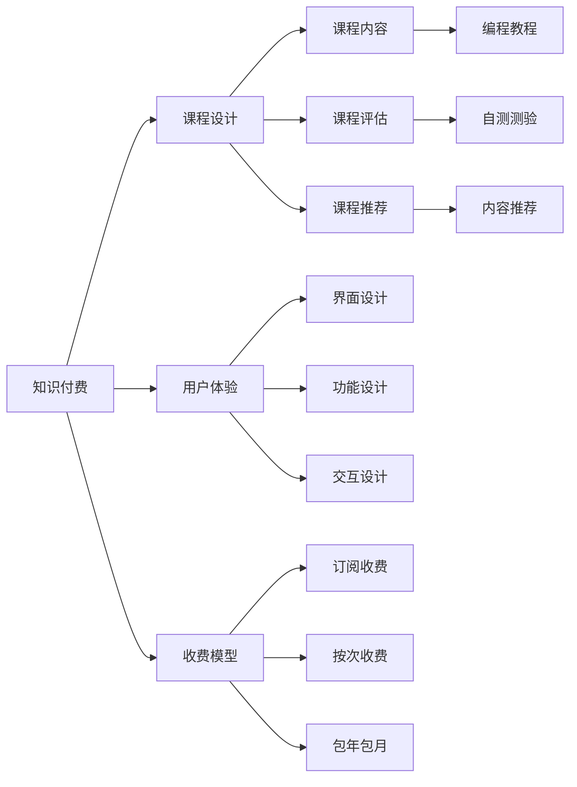

                 

# 如何打造高客单价的程序员知识产品

> 关键词：知识付费, 程序员, 编程教育, 课程设计, 用户体验, 收费模型

## 1. 背景介绍

在互联网时代，知识付费成为一种新的商业模式，特别是在编程领域，程序员的学习和成长面临着严峻的挑战。传统的基础课程已经无法满足快速变化的技术需求，而高品质的编程教育内容却因制作成本高、用户获取难而陷入困境。因此，如何打造高客单价的程序员知识产品，成为编程教育领域的一个重要议题。本文将从产品设计、内容制作、用户体验、收费模型等多个维度，探讨如何构建具有高价值和可持续发展的程序员知识产品。

## 2. 核心概念与联系

### 2.1 核心概念概述

为了更好地理解高客单价程序员知识产品的打造方法，我们将介绍几个关键概念：

- **知识付费**：指通过付费方式获取有价值的学习内容，包括在线课程、书籍、视频教程等。编程教育中的知识付费旨在提升程序员的技能和认知，满足其学习和成长的需求。

- **课程设计**：课程是知识产品的重要组成部分，其设计质量直接决定产品的市场竞争力。优秀的课程设计需要考虑目标用户的需求、学习目标、课程内容、评估方式等要素。

- **用户体验**：用户体验是影响用户购买和满意度的关键因素。良好的用户体验包括简洁的界面、易用的功能、高效的交互等，能够使用户更愿意为高质量的内容付费。

- **收费模型**：合理的收费模型能够最大化产品的收入，同时保证用户价值。常见的收费模型包括按月订阅、按次付费、包年包月等。

- **知识产品**：结合了知识和技术，以教育为目的的数字化产品。在编程教育领域，知识产品包括编程课程、编程书籍、编程工具等。

### 2.2 核心概念原理和架构的 Mermaid 流程图(Mermaid 流程节点中不要有括号、逗号等特殊字符)



这个流程图展示了知识产品从内容设计到用户使用的全过程：

1. **知识付费**：从课程内容的制作到收费模型的设计，始终围绕知识付费展开。
2. **课程设计**：课程内容是产品的核心，需结合目标用户需求和学习目标，通过评估和推荐，确保内容的质量和相关性。
3. **用户体验**：界面、功能、交互设计是提升用户满意度的重要手段。
4. **收费模型**：通过不同的收费方式，最大化收入并满足用户需求。

这些概念之间的关系紧密，形成一个完整的知识产品生态系统。

## 3. 核心算法原理 & 具体操作步骤

### 3.1 算法原理概述

高客单价程序员知识产品的打造，不仅依赖于高质量的内容，还需要通过有效的算法和模型，提升用户的学习体验和满意度。本文将重点介绍以下两个方面的算法原理：

1. **推荐算法**：通过分析用户行为和偏好，推荐最适合用户的学习内容和课程。推荐算法通常包括协同过滤、内容推荐、基于用户的推荐等。
2. **个性化学习算法**：根据用户的学习进度和反馈，调整课程内容和难度，个性化推荐学习路径和资源。个性化学习算法通常包括学习路径优化、学习进度跟踪、学习反馈分析等。

### 3.2 算法步骤详解

**推荐算法步骤**：

1. **数据收集**：收集用户的历史行为数据，如课程观看时间、观看次数、评分等。
2. **特征提取**：提取用户行为和课程特征，如课程难度、用户评分、课程时长等。
3. **相似度计算**：计算用户与课程之间的相似度，常用方法包括余弦相似度、皮尔逊相关系数等。
4. **推荐排序**：根据相似度计算结果，排序推荐内容列表，展示给用户。

**个性化学习算法步骤**：

1. **学习进度跟踪**：记录用户的学习进度，包括完成的课程、章节、练习等。
2. **学习反馈分析**：收集用户的反馈，如答题正确率、课程评分、互动评论等。
3. **学习路径优化**：根据学习进度和反馈，动态调整课程推荐和学习路径，确保用户能够高效、系统地学习。

### 3.3 算法优缺点

**推荐算法优点**：
- 提升用户的学习效率，推荐适合用户的内容。
- 个性化服务，增强用户体验。
- 减少用户选择成本，提高用户满意度。

**推荐算法缺点**：
- 数据隐私问题：收集用户行为数据可能涉及隐私泄露风险。
- 数据质量问题：数据噪音和偏差可能影响推荐效果。
- 冷启动问题：新用户缺乏历史数据，难以推荐。

**个性化学习算法优点**：
- 提升用户的学习效果，个性化定制学习路径。
- 增强用户的学习兴趣，提高学习粘性。
- 减少学习障碍，加快学习进度。

**个性化学习算法缺点**：
- 学习路径难以覆盖所有用户，可能存在遗漏。
- 用户反馈可能滞后，影响实时调整。
- 个性化推荐可能导致信息茧房，限制用户视野。

### 3.4 算法应用领域

推荐算法和个性化学习算法在多个领域都有广泛应用，特别是在电商、新闻、音乐等领域。在编程教育领域，推荐算法用于课程推荐、书籍推荐、工具推荐等；个性化学习算法用于学习路径规划、学习内容定制、学习进度跟踪等。

## 4. 数学模型和公式 & 详细讲解 & 举例说明

### 4.1 数学模型构建

**协同过滤推荐算法**：

- **用户-物品评分矩阵**：$R \in \mathbb{R}^{m \times n}$，$m$ 为用户数，$n$ 为物品数。$R_{ui}$ 表示用户 $u$ 对物品 $i$ 的评分。
- **相似度计算**：$S_{ui}$ 表示用户 $u$ 和物品 $i$ 的相似度，通常使用余弦相似度计算。
- **推荐排序**：$S_{ui}$ 与用户历史评分矩阵 $R$ 的加权平均，得到用户对物品的推荐评分。

**个性化学习算法**：

- **学习进度向量**：$P_u$ 表示用户 $u$ 的学习进度，包括完成的课程、章节、练习等。
- **学习反馈向量**：$F_u$ 表示用户 $u$ 的学习反馈，包括答题正确率、课程评分、互动评论等。
- **学习路径优化**：通过优化算法（如遗传算法、粒子群算法等），调整课程推荐和学习路径，确保用户能够高效、系统地学习。

### 4.2 公式推导过程

**协同过滤推荐算法**：

- **余弦相似度计算**：$S_{ui} = \cos(\theta) = \frac{R_{ui} \cdot R_{iu}}{\|R_{ui}\| \cdot \|R_{iu}\|}$
- **推荐评分计算**：$\hat{R}_{ui} = \sum_{j=1}^{n}R_{uj} \cdot S_{ij}$

**个性化学习算法**：

- **学习进度更新**：$P_{u, t+1} = f(P_{u, t}, F_{u, t}, C_{u, t})$
- **学习反馈更新**：$F_{u, t+1} = g(F_{u, t}, P_{u, t+1}, C_{u, t+1})$
- **学习路径优化**：$\min_{path} \sum_{i=1}^{n} \omega_i \cdot (T_i - C_{u, i})^2$，其中 $T_i$ 为目标完成度，$C_{u, i}$ 为用户完成情况。

### 4.3 案例分析与讲解

**案例1：Coursera的个性化学习推荐**：

Coursera 通过收集用户的学习进度和反馈，动态调整课程推荐和学习路径。其推荐算法结合了协同过滤和内容推荐，确保用户能够高效、系统地完成课程。Coursera 的学习路径优化算法采用了遗传算法，能够在复杂课程结构中自动调整学习顺序，确保用户的学习效果。

**案例2：Netflix的电影推荐**：

Netflix 利用协同过滤算法为用户推荐电影。其数据收集包括用户评分、观看历史、搜索行为等。通过余弦相似度计算，Netflix 能够为用户推荐其感兴趣的电影，提高用户满意度。

## 5. 项目实践：代码实例和详细解释说明

### 5.1 开发环境搭建

在开发高客单价程序员知识产品时，需要搭建一个完整的开发环境，包括后端数据库、前端界面、推荐系统、学习管理系统等。以下是一些推荐的技术栈：

- **后端开发**：Python+Django/FastAPI+SQLite/MySQL
- **前端开发**：React/Vue+Axios
- **推荐系统**：Python+Scikit-Learn+TensorFlow
- **学习管理系统**：MongoDB+Mongoose

### 5.2 源代码详细实现

**推荐系统**：

```python
from sklearn.metrics.pairwise import cosine_similarity

def get_recommendations(user_id, items, user_ratings, similarity_matrix):
    user_row = user_ratings[user_id]
    similarities = similarity_matrix[user_id]
    recommendations = []
    for item, sim in zip(items, similarities):
        if item in user_ratings:
            recommendations.append((item, sim * user_row[item]))
        else:
            recommendations.append((item, 0))
    recommendations.sort(key=lambda x: x[1], reverse=True)
    return [item[0] for item in recommendations]
```

**个性化学习算法**：

```python
import numpy as np

def update_learning_path(user_id, learning_path, feedback, course_info):
    # 更新学习进度
    completed_courses = [course for course in learning_path if course_info[course]['completed']]
    remaining_courses = [course for course in learning_path if not course_info[course]['completed']]
    for course in completed_courses:
        learning_path[course] += 1
    for course in remaining_courses:
        learning_path[course] += 1
    
    # 更新学习反馈
    for course, rating in feedback.items():
        course_info[course]['rating'] = rating
    
    # 优化学习路径
    optimal_path = optimize_learning_path(learning_path, course_info)
    return optimal_path
```

### 5.3 代码解读与分析

**推荐系统代码**：

- `user_ratings`：用户对课程的评分矩阵。
- `similarity_matrix`：用户与课程的相似度矩阵。
- `cosine_similarity`：计算余弦相似度的函数。
- `get_recommendations`：根据相似度矩阵和用户评分，生成推荐列表。

**个性化学习算法代码**：

- `update_learning_path`：根据用户的学习进度和反馈，动态调整学习路径。
- `learning_path`：用户的学习进度向量。
- `feedback`：用户的学习反馈向量。
- `course_info`：课程信息。
- `optimize_learning_path`：优化算法，用于调整学习路径。

### 5.4 运行结果展示

**推荐系统运行结果**：

- 用户 A 对课程 1 的评分为 4 分，课程 2 未评分，课程 3 的评分为 3 分。课程 1 和课程 2 的相似度为 0.8，课程 2 和课程 3 的相似度为 0.6，课程 3 和课程 1 的相似度为 0.5。
- 推荐结果为：课程 1 （相似度 0.8 * 4 = 3.2），课程 3 （相似度 0.5 * 3 = 1.5），课程 2 （相似度 0.6 * 0 = 0）。

**个性化学习算法运行结果**：

- 用户 B 已完成课程 1、课程 2 和课程 3，反馈评分分别为 4、3、2。
- 更新学习进度：课程 1 完成度为 1，课程 2 完成度为 1，课程 3 完成度为 1。
- 更新学习反馈：课程 1 的评分为 4，课程 2 的评分为 3，课程 3 的评分为 2。
- 优化学习路径：课程 1、课程 2、课程 3 的顺序不变。

## 6. 实际应用场景

### 6.1 编程教育平台

高客单价程序员知识产品可以在编程教育平台中应用，提供高质量的编程课程和实践项目。通过推荐算法和个性化学习算法，平台能够精准推荐适合用户的学习资源，个性化调整学习路径，提高用户的学习效率和满意度。

### 6.2 企业培训

企业可以利用高客单价知识产品，为员工提供定制化的培训课程。通过推荐算法和个性化学习算法，企业能够根据员工的岗位需求和工作进展，推荐适合的课程和资源，帮助员工快速提升技能。

### 6.3 在线编程比赛

在线编程比赛可以通过高客单价知识产品，为参赛选手提供高质量的题库和解题指导。通过推荐算法和个性化学习算法，平台能够推荐适合选手的题目，提供解题思路和代码优化建议，帮助选手提高竞赛水平。

## 7. 工具和资源推荐

### 7.1 学习资源推荐

- **《深入浅出自然语言处理》**：由斯坦福大学李飞飞教授等人编写，全面介绍了自然语言处理的基本概念和算法。
- **Coursera课程**：提供了众多高质量的编程课程，包括Python、Java、C++等。
- **Kaggle**：提供了丰富的编程竞赛和数据集，帮助开发者提升实战能力。

### 7.2 开发工具推荐

- **Python**：编程语言中的佼佼者，适合数据科学和人工智能项目。
- **Django/FastAPI**：Python后端框架，适合快速开发Web应用。
- **React/Vue**：前端框架，适合构建用户友好的Web界面。
- **TensorFlow/PyTorch**：深度学习框架，适合开发推荐系统和个性化学习算法。

### 7.3 相关论文推荐

- **《推荐系统: 理论与算法》**：由李路明等人编写，全面介绍了推荐系统的理论基础和算法实现。
- **《个性化推荐系统》**：由严建刚等人编写，介绍了个性化推荐系统的设计与实现。
- **《深度学习在推荐系统中的应用》**：由刘建平等人编写，介绍了深度学习在推荐系统中的应用。

## 8. 总结：未来发展趋势与挑战

### 8.1 总结

本文详细探讨了如何打造高客单价程序员知识产品，从课程设计、推荐算法、用户体验、收费模型等多个维度，提供了全面的解决方案。高客单价知识产品的成功与否，不仅依赖于高质量的内容，还需要通过有效的算法和模型，提升用户的学习体验和满意度。未来，随着技术的不断进步和市场的不断成熟，程序员知识产品必将迎来更加广阔的发展空间。

### 8.2 未来发展趋势

未来高客单价程序员知识产品的发展趋势包括：

- **内容丰富化**：课程内容和资源将更加多样化，涵盖编程语言、算法、数据结构、人工智能等领域。
- **个性化定制**：根据用户的学习需求和进度，提供个性化的课程推荐和学习路径。
- **全栈学习**：结合编程、设计、测试等全栈技能，帮助用户全面提升技能。
- **终身学习**：通过持续更新和完善课程内容，支持用户的终身学习。
- **跨平台应用**：知识产品将支持多平台应用，如Web、移动端、桌面端等，提升用户体验。

### 8.3 面临的挑战

高客单价程序员知识产品的发展过程中，也面临着诸多挑战：

- **成本控制**：课程内容和开发成本较高，需要寻找更具经济性的生产方式。
- **市场竞争**：知识产品市场竞争激烈，需要不断创新和优化产品。
- **用户粘性**：用户流失率高，需要不断提升用户体验，提高用户粘性。
- **数据隐私**：收集用户行为数据可能涉及隐私问题，需要严格遵守数据保护法规。

### 8.4 研究展望

未来的研究可以集中在以下几个方面：

- **推荐算法优化**：提升推荐系统的准确性和个性化程度。
- **个性化学习算法改进**：开发更加高效的个性化学习算法，提升用户的学习效果。
- **内容创新**：探索新型的编程教育内容形式，如互动式课程、虚拟编程室等。
- **多模态学习**：结合视觉、音频等多种信息源，提升学习效果。
- **伦理与道德**：考虑编程教育的伦理与道德问题，确保知识产品的公正性和可持续性。

## 9. 附录：常见问题与解答

**Q1：如何衡量推荐算法的推荐效果？**

A: 推荐算法的效果可以通过多个指标来衡量，包括精确度、召回率、F1分数、NDCG等。这些指标可以帮助评估推荐系统的准确性和个性化程度。

**Q2：如何设计高效的个性化学习算法？**

A: 个性化学习算法的设计需要考虑多个因素，如学习进度、反馈数据、课程信息等。可以使用机器学习模型（如决策树、随机森林等）进行学习进度预测和反馈分析，优化学习路径。

**Q3：如何平衡课程内容的专业性和通俗性？**

A: 在课程设计中，需要兼顾专业性和通俗性。可以通过专家授课、案例分析、编程实战等方式，使课程内容既专业又易于理解。同时，也可以引入用户反馈，不断优化课程内容。

**Q4：如何吸引用户购买高客单价知识产品？**

A: 吸引用户购买高客单价知识产品，需要从产品设计、用户体验、营销策略等多个维度进行优化。可以通过免费试用、免费课程、社群交流等方式，提升用户的购买意愿。同时，需要提供高质量的内容和服务，满足用户的学习需求。

---

作者：禅与计算机程序设计艺术 / Zen and the Art of Computer Programming

