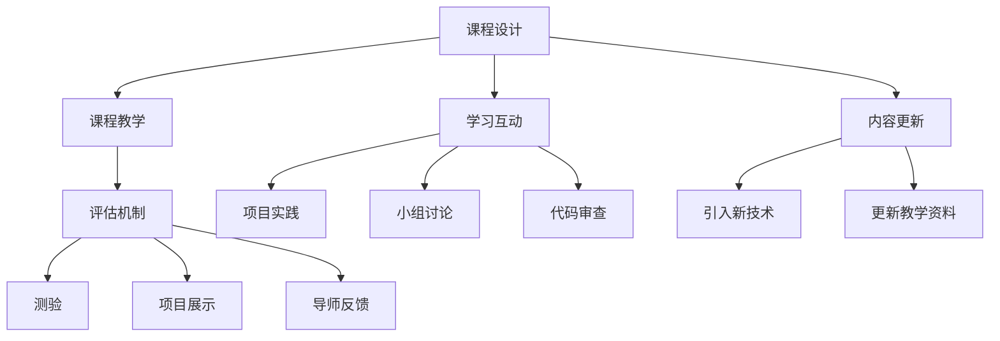

                 

## 1. 背景介绍

在当前高速发展的科技时代，技术知识迭代更新频繁，程序员需要持续学习来保持竞争力。构建高活跃度的程序员知识课程，不仅可以帮助学员高效地掌握新技能，还能保持课程的长期吸引力。在本文中，我们将深入探讨如何打造这种高质量的课程，并详细分析其实现步骤和潜在挑战。

### 1.1 问题由来

目前，许多程序员知识课程往往面临用户活跃度低、知识更新慢等问题，导致学员流失和课程吸引力下降。为了解决这些问题，我们需要从课程设计、教学方法、学习互动等多个方面入手，全面提升课程质量。

### 1.2 问题核心关键点

我们通过以下关键点来详细描述问题的核心：

- **目标明确**：清晰地定义课程目标，使其与学员的职业发展需求相匹配。
- **内容相关**：课程内容应与当前技术趋势和实际工作需求紧密相关。
- **互动性强**：通过互动和实战练习，增强学员的参与感和成就感。
- **更新及时**：课程内容需不断更新，保持与行业发展同步。
- **评估机制**：设计科学的评估机制，确保学员的进步和课程的有效性。

### 1.3 问题研究意义

高质量的程序员知识课程不仅能提高学员的技能水平，还能增强学习兴趣和团队合作精神，对于企业和个人发展具有重要意义。同时，这也有助于推动整个行业的技术进步和知识共享。

## 2. 核心概念与联系

### 2.1 核心概念概述

本文涉及的核心概念包括课程设计、课程教学、学习互动、内容更新和评估机制等。这些概念彼此之间紧密关联，共同构成了高活跃度程序员知识课程的基石。

- **课程设计**：包括课程结构、内容编排和教学方法等。
- **课程教学**：包含课堂讲授、线上教学、互动研讨等多种教学形式。
- **学习互动**：通过项目实践、小组讨论、代码审查等方式，增强学员的参与感。
- **内容更新**：定期更新课程内容，引入最新技术和实践经验。
- **评估机制**：通过测验、项目展示和导师反馈等手段，评估学员的学习效果。

### 2.2 核心概念原理和架构的 Mermaid 流程图



这个流程图示意图展示了高活跃度程序员知识课程的各个环节及其相互作用。各环节通过不断的迭代和优化，确保课程始终保持高质量和活跃度。

## 3. 核心算法原理 & 具体操作步骤

### 3.1 算法原理概述

高活跃度程序员知识课程的打造主要基于以下算法原理：

- **数据驱动**：通过分析学员的学习数据，制定个性化的教学策略。
- **互动反馈**：通过学员的反馈，不断调整教学方法和课程内容。
- **持续改进**：定期收集和分析课程反馈，持续优化课程设计和教学效果。

### 3.2 算法步骤详解

以下将详细介绍打造高活跃度程序员知识课程的具体操作步骤：

1. **需求分析**：通过调研和访谈，了解目标学员的技术背景、职业目标和学习需求。
2. **课程规划**：根据需求分析结果，设计课程结构，包括课程内容、教学方法和评估机制等。
3. **教学实施**：选择适合的教学平台，开展线上或线下课程，引入实战项目和互动环节。
4. **学习评估**：通过测验、项目展示和反馈表等方式，评估学员的学习效果，及时调整教学策略。
5. **持续优化**：收集学员反馈和课程数据，进行课程内容的迭代和优化。

### 3.3 算法优缺点

- **优点**：
  - 提高学员的学习效果和兴趣。
  - 适应技术发展，保持课程内容的前沿性。
  - 通过个性化教学，满足不同学员的需求。

- **缺点**：
  - 课程设计复杂，需要大量的前期准备工作。
  - 持续优化需要持续投入资源和精力。
  - 个性化教学可能导致教学成本上升。

### 3.4 算法应用领域

高活跃度程序员知识课程不仅适用于企业内部的技术培训，也可以应用于公开课程、在线教育平台和专业认证项目。

## 4. 数学模型和公式 & 详细讲解

### 4.1 数学模型构建

高活跃度程序员知识课程的设计可以建模为以下数学公式：

- **学员特征模型**：描述学员的基本信息、技能水平和学习行为等特征。
- **课程内容模型**：包含课程结构、教学方法和评估机制等。
- **学习效果模型**：通过学员的测验成绩、项目展示和导师反馈等数据，评估学员的学习效果。

### 4.2 公式推导过程

- **学员特征模型推导**：
$$ F(E) = \alpha E + \beta \sum_{i=1}^N F_i $$
其中，$E$ 代表学员的基本信息，$F_i$ 为学员在不同学习模块上的表现。

- **课程内容模型推导**：
$$ C = \sum_{i=1}^n w_i C_i $$
其中，$C$ 为课程内容，$C_i$ 为课程中的模块内容，$w_i$ 为各模块的权重。

- **学习效果模型推导**：
$$ G = \sum_{i=1}^m \lambda_i G_i + \mu \sum_{j=1}^J F_j $$
其中，$G$ 为学习效果，$G_i$ 为各项评估指标，$F_j$ 为学员在各个模块的表现。

### 4.3 案例分析与讲解

以一个项目实践课程为例，课程设计如下：

- **课程目标**：教授Python Web开发技术，包括Django框架、RESTful API设计、前端框架等。
- **课程内容**：包括基础理论、实战项目、代码评审和导师指导等环节。
- **学习评估**：通过项目成果、代码评审和导师反馈综合评估学员学习效果。

## 5. 项目实践：代码实例和详细解释说明

### 5.1 开发环境搭建

以下是高活跃度程序员知识课程开发的基本环境配置：

1. **开发语言**：Python
2. **开发框架**：Django
3. **数据库**：MySQL
4. **开发工具**：Jupyter Notebook、PyCharm

### 5.2 源代码详细实现

下面是一个简化的课程管理系统示例，用于管理和跟踪学员的学习进度：

```python
from django.db import models
from django.contrib.auth.models import User

class Course(models.Model):
    title = models.CharField(max_length=255)
    description = models.TextField()
    start_date = models.DateField()
    end_date = models.DateField()
    instructor = models.ForeignKey(User, on_delete=models.CASCADE)

class Lesson(models.Model):
    course = models.ForeignKey(Course, on_delete=models.CASCADE)
    title = models.CharField(max_length=255)
    content = models.TextField()
    pub_date = models.DateTimeField()

class Assignment(models.Model):
    lesson = models.ForeignKey(Lesson, on_delete=models.CASCADE)
    title = models.CharField(max_length=255)
    due_date = models.DateField()
    files = models.FileField(upload_to='assignments/')
```

### 5.3 代码解读与分析

上述代码实现了基本的课程管理功能，包括课程、课程内容和作业等模型的定义。通过Django框架的ORM，可以方便地进行数据存储和查询，支持学员的注册、登录、课程浏览和作业提交等功能。

### 5.4 运行结果展示

在开发环境中运行该代码，可以创建一个简单的课程管理系统，用于课程的创建、更新、删除和学员的学习管理。

## 6. 实际应用场景

### 6.1 企业内部培训

在高活跃度程序员知识课程中，企业可以针对不同部门和岗位，设计定制化的培训课程。通过线上线下相结合的方式，提高员工的技术水平和业务能力。

### 6.2 开源社区教育

开源社区可以通过高活跃度课程吸引更多的开发者参与，分享知识和经验，推动技术社区的良性发展。

### 6.3 专业认证考试

在线教育平台和培训机构可以开发高活跃度课程，作为技术认证的预备课程，帮助学员顺利通过认证考试。

### 6.4 未来应用展望

未来，高活跃度程序员知识课程将更广泛地应用于各种领域，如在线教育、企业培训、职业认证等。通过不断优化和迭代，成为程序员快速学习和技能提升的重要工具。

## 7. 工具和资源推荐

### 7.1 学习资源推荐

- **《Python Web开发实战》**：一本系统介绍Python Web开发技术的书籍，适合初学者入门。
- **《Django 3.1 实战指南》**：详细讲解Django框架的使用方法和最佳实践。
- **《Flask Web开发实战》**：介绍Flask框架的Web开发实践，适合进阶学习。
- **在线教程和文档**：如Django官方文档、Python Web开发教程等。

### 7.2 开发工具推荐

- **PyCharm**：Python IDE，支持项目管理和代码调试。
- **Django**：Python Web开发框架，适合开发复杂的Web应用。
- **PostgreSQL**：开源数据库，适合高活跃度课程的数据存储。
- **Git**：版本控制系统，方便团队协作和代码版本管理。

### 7.3 相关论文推荐

- **《个性化学习推荐算法研究》**：研究如何根据学员的学习行为，推荐合适的课程内容。
- **《交互式学习系统的设计与实现》**：介绍交互式学习系统的设计和实践方法。
- **《在线教育平台的学员行为分析》**：分析在线教育平台学员的行为数据，优化课程设计。

## 8. 总结：未来发展趋势与挑战

### 8.1 研究成果总结

本文详细探讨了如何打造高活跃度的程序员知识课程，并提出了具体的操作方法。通过数据驱动、互动反馈和持续改进等策略，提升课程的吸引力和学员的学习效果。

### 8.2 未来发展趋势

未来的高活跃度课程将更加注重个性化教学和互动体验，通过大数据分析和机器学习技术，实现更加智能化的课程设计。

### 8.3 面临的挑战

- **技术更新快**：需要不断更新课程内容，保持与时俱进。
- **学员多样性**：不同背景和能力的学员对课程的需求各异，需要灵活应对。
- **资源投入大**：开发和维护高活跃度课程需要大量的资源和人力。

### 8.4 研究展望

未来研究可以重点关注以下几个方面：

- **自适应学习算法**：通过机器学习模型，动态调整课程内容和难度。
- **虚拟现实技术**：引入VR/AR技术，提升课程的互动性和沉浸感。
- **社区学习平台**：构建社区学习平台，促进学员之间的知识共享和协作。

## 9. 附录：常见问题与解答

**Q1：如何确保课程内容的前沿性？**

A: 通过定期邀请行业专家进行课程更新和讲座，了解最新的技术趋势和应用案例。同时，关注开源社区和技术博客，及时引入最新的技术和实践经验。

**Q2：如何处理学员的多样性需求？**

A: 设计灵活的课程结构，允许学员根据自己的兴趣和需求选择课程内容。同时，通过项目实践和小组讨论，增强学员之间的互动和协作，提升课程的多样性。

**Q3：如何提高学员的学习兴趣？**

A: 引入实战项目和实际案例，让学员在学习过程中能够看到实际应用场景。通过互动讨论和代码评审，增强学员的参与感和成就感。

**Q4：如何评估学员的学习效果？**

A: 通过测验、项目展示和导师反馈等多维度评估机制，全面衡量学员的学习效果。同时，定期收集学员反馈，调整教学策略和方法。

---

作者：禅与计算机程序设计艺术 / Zen and the Art of Computer Programming

