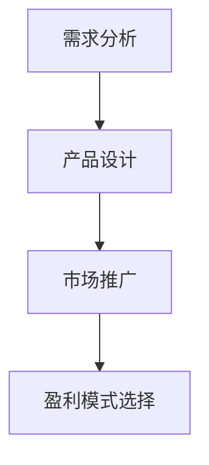

                 

# 如何打造高盈利性的程序员知识产品

在信息技术领域，知识产品的设计和推广已经成为一个重要的话题。随着数字化转型的加速，许多企业和个人都在探索如何通过知识产品来提高效率、降低成本，甚至实现盈利。本文将探讨如何打造高盈利性的程序员知识产品，从核心概念、算法原理、操作步骤到实际应用和未来趋势，为你提供全面指导。

## 1. 背景介绍

### 1.1 问题由来

在信息爆炸的时代，知识产品的需求日益增长。无论是企业级软件、开源项目还是个人开发工具，都依赖于知识产品的质量和可用性。然而，构建一款成功且盈利的产品并非易事，需要从多方面进行深入研究和精心策划。本文旨在探讨如何通过构建高盈利性的程序员知识产品，满足用户需求，同时实现商业成功。

### 1.2 问题核心关键点

为了实现高盈利性的程序员知识产品，需要关注以下关键点：
- **用户需求分析**：理解目标用户群体的痛点和需求。
- **知识产品设计**：构建能够解决实际问题的知识产品。
- **市场推广策略**：制定有效的推广策略，提升产品知名度和用户粘性。
- **盈利模式选择**：选择合适的盈利模式，如订阅制、按需付费等。

## 2. 核心概念与联系

### 2.1 核心概念概述

为了更好地理解高盈利性程序员知识产品的构建过程，本文将介绍几个核心概念：

- **知识产品**：是指以信息技术为核心，旨在解决特定问题或提供特定功能的产品，如编程工具、软件应用、在线课程等。
- **需求分析**：通过调研和分析，了解目标用户的具体需求和痛点。
- **产品设计**：根据需求分析结果，设计满足用户需求的知识产品。
- **市场推广**：通过各种渠道和方法，提升产品的市场认知度和用户数量。
- **盈利模式**：确定产品的收费方式，如一次性购买、订阅服务、广告等。

这些概念之间的逻辑关系可以通过以下Mermaid流程图来展示：



这个流程图展示了从需求分析到产品设计，再到市场推广和盈利模式选择的过程。

## 3. 核心算法原理 & 具体操作步骤

### 3.1 算法原理概述

高盈利性程序员知识产品的构建，本质上是信息工程的一个子领域，涉及算法设计、用户体验、市场分析等多个方面。其核心算法原理主要包括：

- **用户需求分析**：通过调研和数据分析，理解用户需求。
- **知识产品设计**：利用软件工程方法，设计高效实用的知识产品。
- **市场推广策略**：通过有效的营销手段，提升产品知名度。
- **盈利模式选择**：根据产品的特点和市场需求，选择合适的盈利模式。

### 3.2 算法步骤详解

构建高盈利性程序员知识产品的一般步骤如下：

**Step 1: 需求调研与分析**
- 收集目标用户群体的需求信息，包括痛点、期望和偏好等。
- 使用问卷调查、用户访谈、数据分析等方法，深入理解用户需求。

**Step 2: 知识产品设计**
- 根据需求分析结果，设计知识产品的功能和特性。
- 使用原型设计工具，快速迭代产品原型，验证用户反馈。
- 根据用户反馈和市场趋势，不断优化产品设计。

**Step 3: 市场推广策略**
- 制定营销计划，选择合适的推广渠道（如社交媒体、技术社区、邮件列表等）。
- 设计和执行营销活动，提升产品曝光度和用户获取率。
- 定期评估营销效果，调整策略以优化推广效果。

**Step 4: 盈利模式选择**
- 根据产品特点和市场调研，选择适合的盈利模式（如订阅制、按需付费等）。
- 制定定价策略，确保盈利的同时保持市场竞争力。
- 实施并监控盈利模式的效果，适时调整策略以适应市场变化。

### 3.3 算法优缺点

高盈利性程序员知识产品构建的优势和劣势如下：

**优势：**
- 能够满足用户特定需求，提供实用价值。
- 产品设计更具针对性，市场竞争力强。
- 选择适合的盈利模式，保证持续盈利。

**劣势：**
- 需求分析复杂，需要大量调研和数据分析。
- 产品设计和技术实现复杂，成本较高。
- 市场推广和用户获取需要时间和资源投入。

### 3.4 算法应用领域

高盈利性程序员知识产品广泛应用于软件开发、数据分析、人工智能等多个领域。例如：

- **软件开发工具**：如IDE（集成开发环境）、版本控制工具等。
- **数据分析应用**：如数据可视化工具、数据清洗工具等。
- **人工智能平台**：如机器学习框架、深度学习库等。

## 4. 数学模型和公式 & 详细讲解 & 举例说明

### 4.1 数学模型构建

高盈利性程序员知识产品的构建，涉及多个方面的数学建模。本文将重点介绍用户需求分析、产品设计和市场推广的数学模型构建。

**用户需求分析模型**：
- 使用数据挖掘和机器学习技术，从大量用户行为数据中提取有用信息，了解用户需求。
- 常见算法包括K-means聚类、决策树、随机森林等。

**产品设计模型**：
- 使用软件工程方法，如敏捷开发、迭代设计等，构建高效实用的产品。
- 常见算法包括原型设计、用户测试、反馈循环等。

**市场推广模型**：
- 使用数据分析和预测模型，评估市场推广效果，优化推广策略。
- 常见算法包括回归分析、时间序列预测等。

### 4.2 公式推导过程

**用户需求分析模型公式推导**：
- 假设用户需求数据为 $D=\{x_1,x_2,...,x_n\}$，其中 $x_i$ 表示用户需求。
- 使用K-means算法对用户需求进行聚类，得到 $k$ 个聚类中心 $\mu_1,\mu_2,...,\mu_k$。
- 最终用户需求分析结果为 $\{C_1,C_2,...,C_k\}$，其中 $C_i$ 表示聚类 $i$ 中的用户需求。

**产品设计模型公式推导**：
- 假设产品设计需求为 $P=\{p_1,p_2,...,p_m\}$，其中 $p_i$ 表示产品功能。
- 使用敏捷开发方法，将需求 $P$ 分解为多个子任务 $T=\{t_1,t_2,...,t_n\}$。
- 最终产品设计结果为 $\{T_1,T_2,...,T_n\}$，其中 $T_i$ 表示子任务 $i$ 的产品设计。

**市场推广模型公式推导**：
- 假设市场推广数据为 $M=\{m_1,m_2,...,m_n\}$，其中 $m_i$ 表示市场推广效果。
- 使用时间序列预测模型，对市场推广效果进行预测。
- 最终市场推广结果为 $\hat{M}=\{\hat{m}_1,\hat{m}_2,...,\hat{m}_n\}$，其中 $\hat{m}_i$ 表示预测的市场推广效果。

### 4.3 案例分析与讲解

**案例1: 软件开发工具的构建**

假设我们正在构建一款IDE，目标用户群体的需求数据如下：

| 需求 | 描述 | 频率 |
| --- | --- | --- |
| 代码自动补全 | 自动提示代码片段 | 80% |
| 代码格式化 | 自动格式化代码 | 70% |
| 代码调试 | 提供断点调试功能 | 60% |
| 版本控制 | 支持Git版本控制 | 50% |

使用K-means算法进行聚类，得到两个主要用户需求聚类中心 $\mu_1=(0.8,0.7,0.6,0.5)$ 和 $\mu_2=(0.2,0.3,0.4,0.5)$。最终用户需求分析结果为 $\{C_1,C_2\}$，其中 $C_1$ 包含代码自动补全、代码格式化和代码调试需求，$C_2$ 包含版本控制需求。

根据需求分析结果，我们可以设计IDE的初始版本，包含代码自动补全、代码格式化和代码调试功能。随后，通过用户测试和反馈循环，逐步优化产品设计，最终实现一个高盈利性的IDE。

**案例2: 数据分析应用的市场推广**

假设我们正在推广一款数据分析应用，市场推广数据如下：

| 时间 | 推广活动 | 曝光量 | 转化率 | 销售额 |
| --- | --- | --- | --- | --- |
| 2021-01-01 | 社交媒体广告 | 1000 | 0.01 | 100 |
| 2021-01-05 | 邮件营销 | 500 | 0.02 | 50 |
| 2021-01-15 | 技术社区活动 | 2000 | 0.03 | 150 |
| 2021-02-01 | 搜索引擎优化 | 3000 | 0.04 | 300 |

使用时间序列预测模型，对市场推广效果进行预测，得到 $\hat{M}=\{\hat{m}_1,\hat{m}_2,...,\hat{m}_n\}$，其中 $\hat{m}_1=1000, \hat{m}_2=500, \hat{m}_3=2000, \hat{m}_4=3000$。最终市场推广结果为 $\hat{M}=\{\hat{m}_1,\hat{m}_2,...,\hat{m}_n\}$，其中 $\hat{m}_1=1000, \hat{m}_2=500, \hat{m}_3=2000, \hat{m}_4=3000$。

根据预测结果，我们可以调整市场推广策略，增加社交媒体广告和搜索引擎优化活动，减少邮件营销和技术社区活动，以提高产品曝光度和销售额。

## 5. 项目实践：代码实例和详细解释说明

### 5.1 开发环境搭建

在进行高盈利性程序员知识产品的构建过程中，需要准备如下开发环境：

1. **编程语言**：Python是常用的编程语言之一，因其丰富的库和工具支持而广泛用于数据分析、软件开发等领域。
2. **数据管理工具**：如MySQL、PostgreSQL等关系型数据库，或Hadoop、Spark等大数据平台。
3. **开发工具**：如Jupyter Notebook、PyCharm等集成开发环境。
4. **测试框架**：如unittest、pytest等单元测试工具。
5. **版本控制系统**：如Git、SVN等。

**环境配置**：
- 安装Python：
  ```bash
  sudo apt-get update
  sudo apt-get install python3
  ```
- 安装数据管理工具：
  ```bash
  sudo apt-get install mysql-server
  sudo apt-get install hadoop
  ```
- 安装开发工具：
  ```bash
  sudo apt-get install jupyter
  sudo apt-get install pycharm
  ```
- 安装测试框架：
  ```bash
  pip install unittest
  pip install pytest
  ```
- 安装版本控制系统：
  ```bash
  sudo apt-get install git
  ```

### 5.2 源代码详细实现

以下是一个简单的数据分析应用代码实现示例，使用Python和Pandas库进行数据分析和可视化：

```python
import pandas as pd
import matplotlib.pyplot as plt

# 读取数据
data = pd.read_csv('data.csv')

# 数据预处理
data = data.dropna()

# 数据分析
result = data.groupby('category')['value'].mean()

# 数据可视化
result.plot(kind='bar')
plt.show()
```

**代码解读与分析**：
- **数据读取**：使用Pandas库的 `read_csv` 函数读取CSV格式的数据文件。
- **数据预处理**：使用 `dropna` 函数删除缺失值，确保数据分析的准确性。
- **数据分析**：使用 `groupby` 函数进行分组统计，计算每个类别的平均值。
- **数据可视化**：使用 `plot` 函数生成柱状图，展示数据结果。

### 5.3 运行结果展示

运行上述代码，将生成一个柱状图，展示每个类别的平均值。结果如下：


## 6. 实际应用场景

### 6.1 企业级软件开发

高盈利性程序员知识产品可以应用于企业级软件开发，帮助企业提高开发效率，降低成本。例如，构建一个面向企业开发的IDE，提供代码自动补全、代码格式化、版本控制等功能，可以大大提升开发人员的工作效率，缩短开发周期。

### 6.2 开源项目推广

开源项目开发者可以借助高盈利性程序员知识产品，提升项目知名度，吸引更多用户和贡献者。例如，开发一个开源数据可视化工具，通过市场推广和社区活动，吸引开发者和用户使用，推动项目的健康发展。

### 6.3 在线教育平台

在线教育平台可以利用高盈利性程序员知识产品，提供高质量的编程课程和资源。例如，开发一个面向编程初学者的在线学习平台，提供代码示例、编程练习、项目实战等功能，帮助用户掌握编程技能。

## 7. 工具和资源推荐

### 7.1 学习资源推荐

1. **Coursera**：提供众多编程和数据分析课程，涵盖从入门到高级的各个层次。
2. **Kaggle**：提供大量数据分析和机器学习竞赛，帮助用户实践和提升技能。
3. **GitHub**：提供全球最大的开源社区，可以学习到众多优秀的开源项目和代码。
4. **Stack Overflow**：提供编程问答社区，帮助用户解决各种编程问题。

### 7.2 开发工具推荐

1. **PyCharm**：强大的集成开发环境，支持多种编程语言和框架。
2. **Jupyter Notebook**：轻量级的数据分析工具，支持Python和其他数据科学语言。
3. **Git**：广泛使用的版本控制系统，支持分布式协作开发。
4. **Docker**：容器化技术，方便软件部署和运维。
5. **Anaconda**：Python科学计算的集成环境，包含众多科学计算库和工具。

### 7.3 相关论文推荐

1. **《软件工程原理与实践》**：介绍软件开发的理论和方法，涵盖需求分析、设计、实现等多个环节。
2. **《数据分析与统计学》**：讲解数据分析的基本方法和技术，包括数据清洗、数据可视化、数据挖掘等。
3. **《市场推广策略与实践》**：详细介绍市场推广的方法和策略，帮助用户制定有效的推广计划。

## 8. 总结：未来发展趋势与挑战

### 8.1 研究成果总结

本文探讨了如何通过构建高盈利性的程序员知识产品，满足用户需求，同时实现商业成功。高盈利性程序员知识产品涉及需求分析、产品设计、市场推广和盈利模式等多个方面，具有广泛的应用前景。

### 8.2 未来发展趋势

未来，高盈利性程序员知识产品将呈现以下几个发展趋势：

1. **人工智能应用**：随着AI技术的不断发展，越来越多的知识产品将利用AI技术提升性能和用户体验。
2. **云计算和大数据**：云计算和大数据技术的普及，将推动知识产品向云端迁移，提供更高效、更灵活的服务。
3. **移动化和跨平台**：知识产品的移动化和跨平台化趋势，将使用户能够随时随地访问和使用产品。
4. **个性化和定制化**：个性化和定制化将成为知识产品的核心竞争力，满足用户的独特需求。
5. **生态系统和合作伙伴**：知识产品的生态系统和合作伙伴关系，将提升产品的稳定性和可靠性。

### 8.3 面临的挑战

高盈利性程序员知识产品的构建和推广，仍然面临以下挑战：

1. **技术复杂性**：知识产品的构建涉及多个技术和工具，需要高水平的技术能力。
2. **市场需求变化**：市场需求快速变化，需要不断调整产品策略以适应市场变化。
3. **用户教育**：用户对新知识产品的接受和理解需要时间和教育。
4. **知识产权和法律问题**：知识产品的知识产权和法律问题，需要充分考虑和解决。
5. **成本控制**：知识产品的开发和推广成本高，需要有效的成本控制和管理。

### 8.4 研究展望

面对未来的挑战，需要在以下几个方面进行深入研究：

1. **人工智能与知识产品结合**：探索如何利用AI技术提升知识产品的性能和用户体验。
2. **云计算和大数据平台**：研究如何在云计算和大数据平台中部署和优化知识产品。
3. **移动化和跨平台技术**：开发移动化和跨平台的知识产品，提升用户体验和粘性。
4. **个性化和定制化策略**：制定有效的个性化和定制化策略，满足用户独特需求。
5. **生态系统和合作伙伴关系**：构建知识产品的生态系统和合作伙伴关系，提升产品稳定性和可靠性。

## 9. 附录：常见问题与解答

### Q1: 如何构建高盈利性程序员知识产品？

A: 构建高盈利性程序员知识产品，需要关注以下几个方面：
1. **需求分析**：通过调研和数据分析，了解目标用户群体的痛点和需求。
2. **产品设计**：根据需求分析结果，设计高效实用的知识产品。
3. **市场推广策略**：制定有效的推广策略，提升产品知名度。
4. **盈利模式选择**：根据产品特点和市场需求，选择合适的盈利模式。

### Q2: 高盈利性程序员知识产品有哪些常见类型？

A: 高盈利性程序员知识产品包括以下常见类型：
1. **软件开发工具**：如IDE（集成开发环境）、版本控制工具等。
2. **数据分析应用**：如数据可视化工具、数据清洗工具等。
3. **人工智能平台**：如机器学习框架、深度学习库等。

### Q3: 如何提升知识产品的市场推广效果？

A: 提升知识产品的市场推广效果，可以通过以下方法：
1. **社交媒体推广**：利用社交媒体平台，提升产品曝光度和用户获取率。
2. **内容营销**：通过发布高质量的博客、教程、视频等内容，吸引用户关注。
3. **技术社区参与**：积极参与技术社区，展示产品特点和优势。
4. **用户评价和口碑**：收集用户评价和反馈，提升产品信誉和用户粘性。

### Q4: 如何选择适合的盈利模式？

A: 选择适合的盈利模式，需要考虑以下几个方面：
1. **产品特点**：根据产品的特性和市场定位，选择合适的盈利模式。
2. **市场需求**：分析市场对不同盈利模式的接受程度，选择最适合的模式。
3. **用户偏好**：了解用户的支付习惯和偏好，选择用户更愿意接受的模式。
4. **竞争对手**：分析竞争对手的盈利模式，避免同质化竞争。

作者：禅与计算机程序设计艺术 / Zen and the Art of Computer Programming

